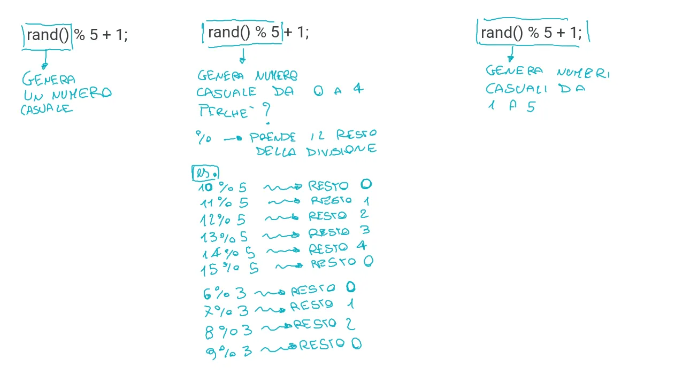

## 1. Descrizione

Documentazione Ufficiale:

[cstdlib - rand](https://cplusplus.com/reference/cstdlib/rand/)

Vediamo come **generare numeri casuali in C**. Fulcro del nostro lavoro sarà la funzione **rand()**
la quale viene utilizzata per generare un numero compreso nell'intervallo tra 0 e RAND_MAX, dove RAND_MAX è un valore che cambia a seconda del compilatore usato (in genere 32767).

## 2. Come generare valori in un range specifico



```c
v1 = rand() % 100;         // v1 in the range 0 to 99
v2 = rand() % 100 + 1;     // v2 in the range 1 to 100
v3 = rand() % 30 + 1985;   // v3 in the range 1985-2014 (30 perchè max - min + 1)
```

**Formula generale**:

```c
int valore = rand() % (max - min + 1) + min;
```

## 3. Esempio pratico

```c
#include <stdio.h>
#include <time.h>

int main () {
    // inizializzazione
    srand(time(NULL));

    int valore;

    // Genera numeri casuali qualsiasi
    for (int i=0; i<10; i++) {
        valore = rand();
        printf("%d ", valore);
    }

    printf("\n");

    // Genera numeri casuali da 1 a 5
    for (int i=0; i<10; i++) {
        valore = rand() % 5 + 1;
        printf("%d ", valore);
    }

    printf("\n");

    // Genera numeri casuali da 10 a 19
    int min = 10;
    int max = 19;
    for (int i=0; i<10; i++) {
        valore = rand() % (max - min + 1) + min;
        printf("%d ", valore);
    }

    return 0;
}
```
