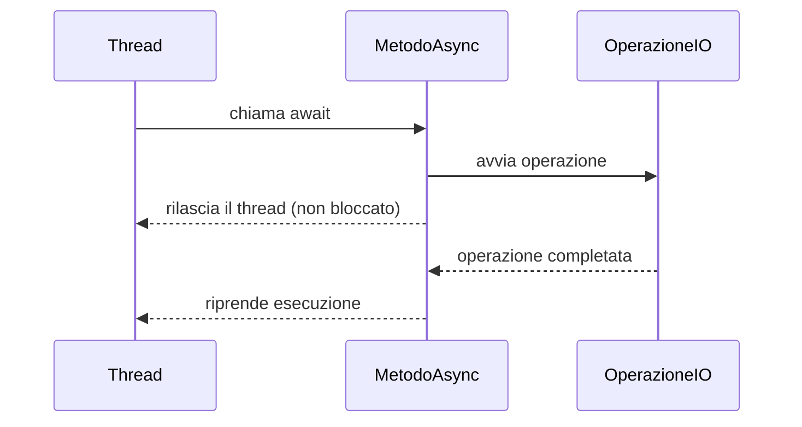
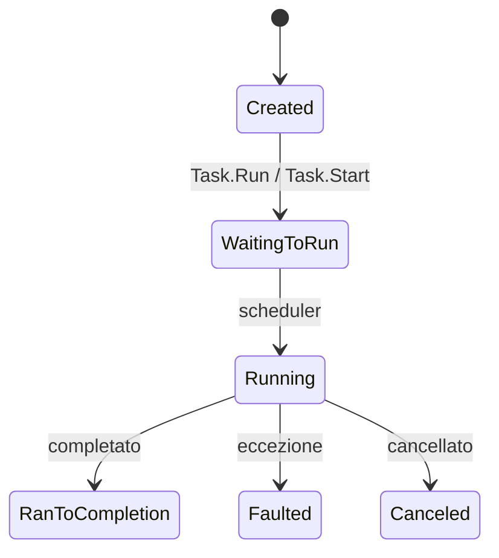

## 1. Introduzione

La programmazione **asincrona** consente di eseguire operazioni che richiedono tempo (I/O, rete, database) senza bloccare il thread chiamante. In C#, il modello asincrono si basa su:

- `async` $\rightarrow$ parola chiave che marca un metodo come asincrono.
- `await` $\rightarrow$ sospende l'esecuzione del metodo corrente finché il `Task` completato non è pronto, **senza bloccare il thread**.
- `Task` / `Task<T>` $\rightarrow$ rappresentano un'operazione asincrona.



## 2. Task e Task\<T\>

`Task` è la classe che rappresenta un'operazione asincrona:

- `Task` $\rightarrow$ operazione che **non restituisce valore** (equivalente a `void` asincrono).
- `Task<T>` $\rightarrow$ operazione che **restituisce un valore di tipo T**.

```cs
// Task senza valore di ritorno
Task task = Task.Run(() => Console.WriteLine("Eseguito in background"));

// Task con valore di ritorno
Task<int> taskConRitorno = Task.Run(() => 42);
int valore = await taskConRitorno; // valore == 42
```

### Ciclo di vita di un Task



## 3. Sintassi async / await

Un metodo `async` deve sempre restituire `Task`, `Task<T>`, `ValueTask`, `ValueTask<T>` oppure `void` (solo per event handler).

```cs
// Metodo sincrono
public string LeggiDati()
{
    Thread.Sleep(2000); // BLOCCA il thread per 2 secondi
    return "Dati letti";
}

// Metodo asincrono equivalente
public async Task<string> LeggiDatiAsync()
{
    await Task.Delay(2000); // NON blocca il thread
    return "Dati letti";
}
```

### Chiamata di un metodo asincrono

```cs
public async Task Main()
{
    Console.WriteLine("Inizio");

    string risultato = await LeggiDatiAsync();

    Console.WriteLine($"Risultato: {risultato}");
    Console.WriteLine("Fine");
}
```

## 4. async void vs async Task

| | `async void` | `async Task` |
|---|---|---|
| Tipo di ritorno | void | Task |
| Gestione eccezioni | ❌ non catturabili con try/catch | ✅ catturabili |
| Awaitable | ❌ non può essere atteso | ✅ può essere atteso |
| Uso consigliato | Solo event handler | Sempre |

```cs
// ❌ EVITARE (impossibile catturare eccezioni)
public async void MetodoSbagliato()
{
    await Task.Delay(1000);
    throw new Exception("Persa nel vuoto!");
}

// ✅ CORRETTO
public async Task MetodoCorretto()
{
    await Task.Delay(1000);
    throw new Exception("Catturabile con await/try-catch!");
}
```

## 5. Gestione delle eccezioni

Le eccezioni in metodi `async` si propagano quando si fa `await` sul Task risultante.

```cs
public async Task<int> DividiAsync(int a, int b)
{
    await Task.Delay(100);
    if (b == 0)
        throw new DivideByZeroException("Divisione per zero!");
    return a / b;
}

public async Task EsempioDiGestioneEccezioni()
{
    try
    {
        int risultato = await DividiAsync(10, 0);
    }
    catch (DivideByZeroException ex)
    {
        Console.WriteLine($"Errore catturato: {ex.Message}");
    }
    finally
    {
        Console.WriteLine("Finally eseguito sempre");
    }
}
```

## 6. Task.WhenAll e Task.WhenAny

### Task.WhenAll — esegue più task in parallelo

```cs
public async Task EsempiWhenAll()
{
    Task<string> task1 = FetchDaApiAsync("https://api1.example.com");
    Task<string> task2 = FetchDaApiAsync("https://api2.example.com");
    Task<string> task3 = FetchDaApiAsync("https://api3.example.com");

    // Attende che TUTTI i task siano completati
    string[] risultati = await Task.WhenAll(task1, task2, task3);

    foreach (var r in risultati)
        Console.WriteLine(r);
}
```

### Task.WhenAny — il primo che finisce vince

```cs
public async Task EsempiWhenAny()
{
    Task<string> task1 = Task.Delay(3000).ContinueWith(_ => "Lento");
    Task<string> task2 = Task.Delay(500).ContinueWith(_ => "Veloce");

    // Ritorna il task completato per primo
    Task<string> primoCompletato = await Task.WhenAny(task1, task2);
    string risultato = await primoCompletato;

    Console.WriteLine($"Primo completato: {risultato}"); // Veloce
}
```

## 7. CancellationToken

Il `CancellationToken` permette di **cancellare** operazioni asincrone in corso.

```cs
public async Task OperazioneLungaAsync(CancellationToken cancellationToken)
{
    for (int i = 0; i < 100; i++)
    {
        cancellationToken.ThrowIfCancellationRequested(); // controlla se cancellato

        await Task.Delay(100, cancellationToken);
        Console.WriteLine($"Step {i}");
    }
}

public async Task EsempioCancellazione()
{
    var cts = new CancellationTokenSource();

    // Cancella dopo 500ms
    cts.CancelAfter(TimeSpan.FromMilliseconds(500));

    try
    {
        await OperazioneLungaAsync(cts.Token);
    }
    catch (OperationCanceledException)
    {
        Console.WriteLine("Operazione cancellata!");
    }
}
```

## 8. ConfigureAwait

`ConfigureAwait(false)` indica che la ripresa dell'esecuzione **non deve tornare necessariamente al contesto originale** (es. UI thread). È utile nelle librerie per evitare deadlock.

```cs
// In una libreria (non in codice UI)
public async Task<string> MetodoDiLibreriaAsync()
{
    var dati = await FetchAsync()
        .ConfigureAwait(false); // non tornare al contesto originale

    return dati.ToUpper();
}
```

| Contesto | Usa ConfigureAwait(false)? |
|---|---|
| Applicazione WPF / WinForms | ❌ (serve il UI thread) |
| Librerie riutilizzabili | ✅ raccomandato |
| ASP.NET Core | Non necessario (no SynchronizationContext) |

## 9. Deadlock

Un **deadlock** asincrono si verifica quando si usa `.Result` o `.Wait()` su un `Task` in un contesto con `SynchronizationContext` (es. WPF, WinForms).

```cs
// ❌ DEADLOCK in WPF/WinForms
public void MetodoSincrono()
{
    var risultato = MetodoAsincrono().Result; // BLOCCO $\rightarrow$ deadlock!
}

public async Task<string> MetodoAsincrono()
{
    await Task.Delay(1000); // cerca di tornare al UI thread $\rightarrow$ già bloccato!
    return "Pronto";
}

// ✅ CORRETTO: usa async fino in cima (async all the way)
public async Task MetodoCorretto()
{
    var risultato = await MetodoAsincrono();
}
```

## 10. ValueTask

`ValueTask<T>` è un'alternativa ottimizzata a `Task<T>` per metodi che spesso completano **in modo sincrono** (es. cache hit).

```cs
public async ValueTask<int> LeggiDaCache(string chiave)
{
    if (_cache.TryGetValue(chiave, out int valore))
        return valore; // completamento sincrono, nessuna allocazione heap

    int daDb = await _db.LeggiAsync(chiave);
    _cache[chiave] = daDb;
    return daDb;
}
```

## 11. Quiz

import Quiz from '../../../components/Quiz.jsx';

<Quiz client:load questions={[
{
question:"Cosa fa la keyword await in C#?",
answers:{
a:"Blocca il thread corrente fino al completamento",
b:"Sospende il metodo corrente senza bloccare il thread",
c:"Crea un nuovo thread",
d:"Cancella il task"
},
correctAnswer:"b"
},
{
question:"Quale tipo di ritorno è consigliato per un metodo asincrono?",
answers:{
a:"void",
b:"int",
c:"Task o Task<T>",
d:"object"
},
correctAnswer:"c"
},
{
question:"async void è consigliato in quale caso?",
answers:{
a:"Sempre",
b:"Mai",
c:"Solo per event handler",
d:"Per metodi di librerie"
},
correctAnswer:"c"
},
{
question:"Task.WhenAll fa:",
answers:{
a:"Esegue i task in sequenza",
b:"Attende il completamento di TUTTI i task in parallelo",
c:"Attende il primo task completato",
d:"Cancella tutti i task"
},
correctAnswer:"b"
},
{
question:"Cosa lancia ThrowIfCancellationRequested()?",
answers:{
a:"TaskCanceledException",
b:"TimeoutException",
c:"OperationCanceledException",
d:"InvalidOperationException"
},
correctAnswer:"c"
},
{
question:"ConfigureAwait(false) è particolarmente utile in:",
answers:{
a:"Applicazioni WPF",
b:"Librerie riutilizzabili",
c:"Metodi statici",
d:"Event handler"
},
correctAnswer:"b"
},
{
question:"Quale chiamata può causare un deadlock in WPF?",
answers:{
a:"await task",
b:"task.Result",
c:"Task.WhenAll",
d:"Task.Run"
},
correctAnswer:"b"
},
{
question:"ValueTask<T> è preferibile quando:",
answers:{
a:"Il metodo è sempre asincrono",
b:"Il metodo spesso completa in modo sincrono",
c:"Si usano CancellationToken",
d:"Si lavora con database"
},
correctAnswer:"b"
},
{
question:"Come si avvia un metodo asincrono senza attenderne il risultato (fire-and-forget)?",
answers:{
a:"await task",
b:"task.Wait()",
c:"_ = task (con discard)",
d:"Task.WhenAny(task)"
},
correctAnswer:"c"
},
{
question:"Task.WhenAny fa:",
answers:{
a:"Lancia un'eccezione se un task fallisce",
b:"Attende che TUTTI i task finiscano",
c:"Restituisce il primo task completato",
d:"Cancella i task in eccesso"
},
correctAnswer:"c"
}
]} />

## 12. Esercizi

### 12.1 Download simulato

**Scenario**: Vuoi simulare il download di più file in parallelo.

**Consegna**:
1. Crea un metodo `async Task<string> DownloadFileAsync(string url)` che simula un download con `Task.Delay` (delay casuale tra 500ms e 2000ms) e restituisce il nome del file.
2. Nel `Main`, avvia 5 download in parallelo con `Task.WhenAll`.
3. Stampa i risultati nell'ordine in cui arrivano.

*Obiettivo: comprendere il parallelismo con Task.WhenAll e i benefici dell'async.*

### 12.2 Timeout con CancellationToken

**Scenario**: Vuoi che un'operazione lunga venga cancellata se supera un certo tempo.

**Consegna**:
1. Crea un metodo `async Task ElaboraAsync(CancellationToken ct)` che esegue 20 step con `Task.Delay(300, ct)`.
2. Nel `Main`, usa `CancellationTokenSource` con timeout di 1 secondo.
3. Gestisci `OperationCanceledException` e mostra un messaggio appropriato.

*Obiettivo: imparare a usare CancellationToken per controllare la durata delle operazioni.*

### 12.3 Gestione eccezioni async

**Scenario**: Devi chiamare più API e alcune potrebbero fallire.

**Consegna**:
1. Crea un metodo `async Task<int> ChiamaApiAsync(int id)` che lancia un'eccezione se `id % 3 == 0`.
2. Chiama 6 API con `Task.WhenAll`.
3. Gestisci le eccezioni aggregate con `AggregateException`.

*Obiettivo: capire come le eccezioni si propagano in contesti di task paralleli.*

### 12.4 Pipeline asincrona

**Scenario**: Devi costruire una pipeline: leggi dati $\rightarrow$ elabora $\rightarrow$ salva.

**Consegna**:
1. `async Task<string> LeggiAsync()` $\rightarrow$ restituisce dati grezzi dopo 500ms.
2. `async Task<string> ElaboraAsync(string dati)` $\rightarrow$ trasforma i dati dopo 300ms.
3. `async Task SalvaAsync(string dati)` $\rightarrow$ simula salvataggio dopo 200ms.
4. Nel `Main`, esegui la pipeline in sequenza con `await`.

*Obiettivo: comprendere la composizione di metodi asincroni in sequenza.*
