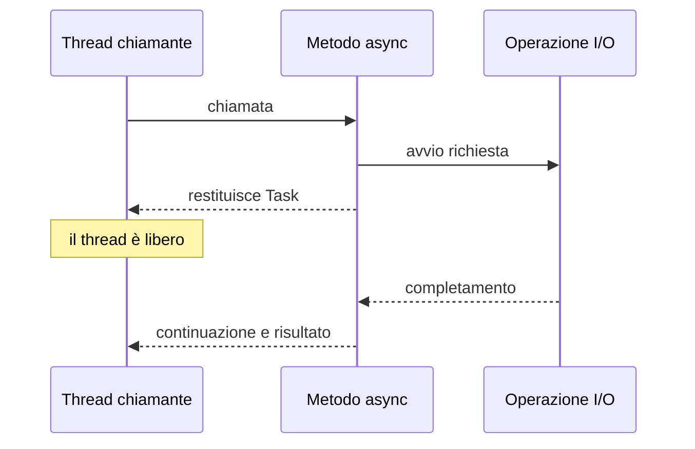
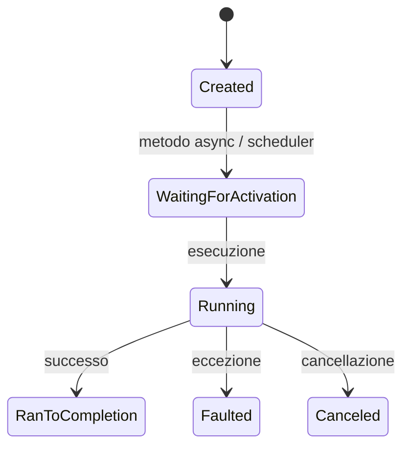
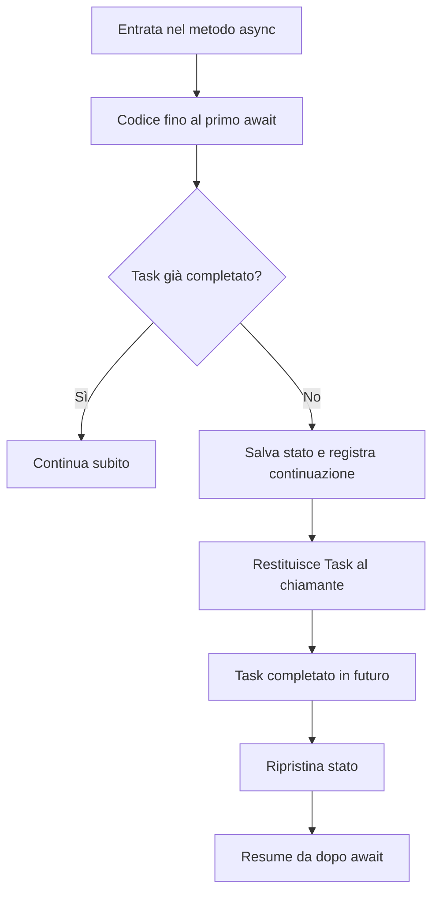
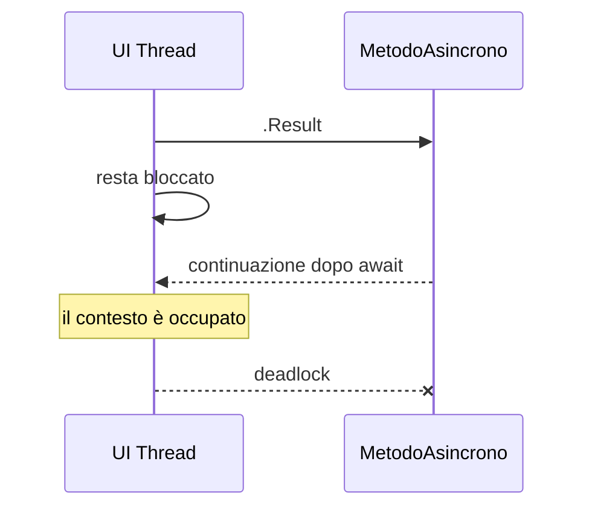

## 1. Introduzione

La programmazione **asincrona** in C# serve a gestire operazioni con latenza significativa senza occupare inutilmente il thread chiamante. Il caso tipico è l'I/O: rete, file system, database, chiamate HTTP, attese temporali, stream. In questi scenari il costo principale non è il calcolo, ma il tempo di attesa.

Una scomposizione utile è:

$$
T_{totale} = T_{cpu} + T_{attesa}
$$

Se $T_{attesa} \gg T_{cpu}$, usare `await` migliora la **reattività** dell'applicazione perché il thread può tornare al chiamante e fare altro durante l'attesa.

I tre pilastri sono:

- `async`: dichiara che un metodo può sospendersi e riprendere.
- `await`: sospende logicamente il metodo finché l'operazione non termina, senza bloccare il thread.
- `Task` / `Task<T>`: rappresentano il risultato futuro di un'operazione.

È importante distinguere:

- **asincronia**: non bloccare mentre si aspetta;
- **concorrenza**: più operazioni in avanzamento nello stesso intervallo di tempo;
- **parallelismo**: più operazioni eseguite davvero insieme su più core/thread.

Un'operazione async non crea automaticamente un nuovo thread. Spesso non usa alcun thread mentre aspetta il completamento di I/O.



### Perché async/await è utile

- In una UI (WPF, WinForms, MAUI) evita interfacce bloccate.
- In un server aumenta la scalabilità: meno thread bloccati per richiesta.
- In pipeline di dati permette di comporre operazioni che arrivano nel tempo.

Se hai $N$ richieste indipendenti con latenze $L_1, L_2, \dots, L_N$:

- esecuzione sequenziale: $$T_{seq} \approx \sum_{i=1}^{N} L_i$$
- esecuzione concorrente con `Task.WhenAll`: $$T_{conc} \approx \max(L_1, L_2, \dots, L_N)$$

Questo vantaggio vale soprattutto per carichi **I/O-bound**.

## 2. Task e Task\<T\>

`Task` è l'astrazione centrale dell'asincronia moderna in .NET:

- `Task`: operazione asincrona senza valore finale;
- `Task<T>`: operazione asincrona che restituisce un valore di tipo `T`.

```cs
Task task = Task.Run(() => Console.WriteLine("Eseguito nel thread pool"));

Task<int> taskConRitorno = Task.Run(() => 42);
int valore = await taskConRitorno;
```

### Stato logico di un Task

Un `Task` può essere visto come una promessa di completamento con tre esiti possibili:

- completato con successo;
- fallito con eccezione;
- cancellato.



### Task caldo e Task freddo

Nella pratica, la maggior parte dei task creati da metodi `async` è già "in movimento": il metodo parte subito fino al primo `await` incompleto. Non sono come enumerazioni lazy che aspettano di essere avviate manualmente.

```cs
public async Task<int> CalcolaAsync()
{
    Console.WriteLine("Parte subito");
    await Task.Delay(1000);
    return 10;
}
```

La riga `CalcolaAsync()` esegue immediatamente il corpo fino al primo `await` che non può completare in modo sincrono.

### Il thread pool

Molti task che eseguono codice CPU-bound usano il **thread pool** di .NET, un insieme gestito di thread worker riutilizzabili. Il thread pool:

- evita il costo di creare e distruggere thread di continuo;
- regola dinamicamente il numero di worker thread;
- supporta il completamento di callback e continuazioni;
- collabora con l'infrastruttura I/O del runtime.

`Task.Run` accoda lavoro CPU-bound al thread pool:

```cs
int risultato = await Task.Run(() =>
{
    int somma = 0;
    for (int i = 0; i < 1_000_000; i++)
        somma += i;
    return somma;
});
```

### Task.Run vs async I/O diretto

Qui c'è una distinzione fondamentale:

| Scenario | Soluzione corretta |
|---|---|
| Chiamata HTTP, DB, file async disponibili | usa direttamente API async |
| Compressione, parsing pesante, hashing, trasformazioni CPU | valuta `Task.Run` |
| Wrappare `Thread.Sleep`, `.Result`, API sincrone lente | spesso è un anti-pattern |

Esempio corretto per I/O:

```cs
public async Task<string> ScaricaHtmlAsync(HttpClient httpClient, string url)
{
    return await httpClient.GetStringAsync(url);
}
```

Qui `Task.Run` sarebbe inutile: l'I/O è già asincrono.

Esempio corretto per CPU-bound:

```cs
public async Task<byte[]> ComprimiAsync(byte[] dati)
{
    return await Task.Run(() => Comprimi(dati));
}
```

### CPU-bound vs I/O-bound

- **CPU-bound**: il tempo è speso in calcolo. Formula dominante: $$T \approx T_{cpu}$$
- **I/O-bound**: il tempo è speso in attesa. Formula dominante: $$T \approx T_{attesa}$$

Regola pratica:

- per I/O-bound: usa API async native;
- per CPU-bound: usa `Task.Run` solo quando serve non bloccare il thread corrente.

## 3. Sintassi async / await

Un metodo `async` restituisce tipicamente:

- `Task`
- `Task<T>`
- `ValueTask`
- `ValueTask<T>`
- `void` solo per event handler

```cs
public string LeggiDati()
{
    Thread.Sleep(2000);
    return "Dati letti";
}

public async Task<string> LeggiDatiAsync()
{
    await Task.Delay(2000);
    return "Dati letti";
}
```

### Cosa fa davvero `await`

Quando esegui:

```cs
string risultato = await LeggiDatiAsync();
```

accade questo:

1. ottieni un awaiter dal task;
2. se il task è già completato, prosegui subito;
3. altrimenti il metodo salva il proprio stato;
4. registra una continuazione;
5. restituisce il controllo al chiamante;
6. quando il task termina, il metodo riparte dal punto successivo all'`await`.

### Trasformazione del compilatore: la state machine

Il compilatore non esegue magia: trasforma il metodo `async` in una **macchina a stati**. Ogni `await` diventa un possibile punto di sospensione.

Metodo sorgente:

```cs
public async Task<int> SommaDopoAttesaAsync()
{
    int a = 10;
    await Task.Delay(1000);
    int b = 32;
    return a + b;
}
```

Struttura concettuale generata dal compilatore:

```cs
private struct SommaDopoAttesaAsyncStateMachine : IAsyncStateMachine
{
    public int _state;
    public AsyncTaskMethodBuilder<int> _builder;

    private int _a;
    private int _b;
    private TaskAwaiter _awaiter;

    public void MoveNext()
    {
        int result;

        try
        {
            if (_state == -1)
            {
                _a = 10;
                var delayTask = Task.Delay(1000);
                _awaiter = delayTask.GetAwaiter();

                if (!_awaiter.IsCompleted)
                {
                    _state = 0;
                    _builder.AwaitUnsafeOnCompleted(ref _awaiter, ref this);
                    return;
                }
            }

            if (_state == 0)
            {
                _awaiter.GetResult();
            }

            _b = 32;
            result = _a + _b;
        }
        catch (Exception ex)
        {
            _state = -2;
            _builder.SetException(ex);
            return;
        }

        _state = -2;
        _builder.SetResult(result);
    }

    public void SetStateMachine(IAsyncStateMachine stateMachine) { }
}
```

Da capire bene:

- `_state` indica il punto di ripresa;
- `_builder` costruisce il `Task<int>` restituito al chiamante;
- le variabili locali che devono sopravvivere all'`await` diventano campi;
- l'awaiter conserva il collegamento con l'operazione attesa.



### Complessità mentale del codice async

Dal punto di vista del chiamante:

- costo di memoria: cresce con lo stato che deve essere conservato;
- costo di scheduling: c'è overhead per awaiter, continuazioni e possibili allocazioni;
- vantaggio: il thread non resta bloccato.

Per operazioni brevissime e sempre sincrone, l'overhead di `Task` può essere rilevante rispetto al lavoro reale. Da qui nasce l'utilità di `ValueTask` in casi speciali.

### Gotcha: closure in lambda async

Le lambda async catturano variabili esterne. Se la variabile cambia dopo la cattura, tutte le lambda possono vedere lo stesso valore finale.

```cs
var tasks = new List<Task>();

for (int i = 0; i < 3; i++)
{
    tasks.Add(Task.Run(async () =>
    {
        await Task.Delay(100);
        Console.WriteLine(i); // rischio: stampa 3, 3, 3
    }));
}

await Task.WhenAll(tasks);
```

Versione corretta:

```cs
var tasks = new List<Task>();

for (int i = 0; i < 3; i++)
{
    int copia = i;
    tasks.Add(Task.Run(async () =>
    {
        await Task.Delay(100);
        Console.WriteLine(copia);
    }));
}

await Task.WhenAll(tasks);
```

## 4. async void vs async Task

`async void` e `async Task` non sono equivalenti.

| Aspetto | `async void` | `async Task` |
|---|---|---|
| Tipo di ritorno | `void` | `Task` |
| Può essere atteso | No | Sì |
| Propagazione eccezioni | difficile da gestire dal chiamante | naturale con `await` |
| Composizione con `WhenAll`, `WhenAny` | No | Sì |
| Uso corretto | event handler | quasi sempre |

```cs
public async void MetodoSbagliato()
{
    await Task.Delay(1000);
    throw new Exception("Eccezione fuori controllo del chiamante");
}

public async Task MetodoCorretto()
{
    await Task.Delay(1000);
    throw new Exception("Eccezione osservabile con await");
}
```

### Fire-and-forget

A volte si vede questo pattern:

```cs
_ = SalvaLogAsync();
```

Questo è un **fire-and-forget**: avvii un task e non lo attendi. È lecito solo se:

- sai dove finiranno le eccezioni;
- la vita dell'operazione non deve essere sincronizzata col chiamante;
- la cancellazione e lo shutdown dell'app sono gestiti;
- non stai usando risorse scoped che potrebbero essere già distrutte.

Pericoli:

- eccezioni non osservate;
- perdita di errori in produzione;
- race condition su oggetti già disposed;
- uscita dell'app prima del completamento.

Versione più sicura:

```cs
public static void AvviaInBackground(Task task, ILogger logger)
{
    _ = task.ContinueWith(
        t => logger.LogError(t.Exception, "Errore in task fire-and-forget"),
        CancellationToken.None,
        TaskContinuationOptions.OnlyOnFaulted,
        TaskScheduler.Default);
}
```

Ancora meglio, in ASP.NET Core o servizi worker, conviene delegare il lavoro a:

- `BackgroundService`
- code interne
- sistemi di job scheduling

invece di lanciare task scollegati dal ciclo di vita dell'app.

### Dimenticare `await`

Questo anti-pattern è molto comune:

```cs
public Task SalvaAsync() => Task.Delay(1000);

public void Metodo()
{
    SalvaAsync(); // il task parte, ma nessuno controlla esito o errori
}
```

Se il risultato ti serve o se l'operazione può fallire, `await` non è opzionale.

## 5. Gestione delle eccezioni

Le eccezioni dei metodi async vengono memorizzate nel `Task` e rilanciate quando fai `await`.

```cs
public async Task<int> DividiAsync(int a, int b)
{
    await Task.Delay(100);
    if (b == 0)
        throw new DivideByZeroException("Divisione per zero!");
    return a / b;
}

public async Task EsempioDiGestioneEccezioni()
{
    try
    {
        int risultato = await DividiAsync(10, 0);
    }
    catch (DivideByZeroException ex)
    {
        Console.WriteLine($"Errore catturato: {ex.Message}");
    }
    finally
    {
        Console.WriteLine("Finally eseguito sempre");
    }
}
```

### `await` vs `.Result` e `.Wait()`

Con `await` l'eccezione originale viene rilanciata in modo naturale. Con `.Result` e `.Wait()` si entra nel mondo delle attese bloccanti e spesso delle `AggregateException`.

```cs
try
{
    var valore = MetodoAsync().Result;
}
catch (AggregateException ex)
{
    Console.WriteLine(ex.InnerException?.Message);
}
```

### Task.WhenAll ed eccezioni

Se più task falliscono:

- `Task.WhenAll` produce un task faulted;
- tutte le eccezioni finiscono nella `Exception` aggregata del task finale;
- con `await`, il runtime rilancia l'errore, ma le eccezioni complete sono comunque consultabili.

```cs
Task t1 = Task.Run(() => throw new InvalidOperationException("Errore 1"));
Task t2 = Task.Run(() => throw new ArgumentException("Errore 2"));

Task all = Task.WhenAll(t1, t2);

try
{
    await all;
}
catch
{
    foreach (var ex in all.Exception!.InnerExceptions)
        Console.WriteLine(ex.Message);
}
```

### Async over sync e sync over async

Due anti-pattern classici:

1. **async over sync**: fingi asincronia spostando codice sincrono su thread pool.
2. **sync over async**: chiami codice async e poi lo blocchi con `.Wait()` o `.Result`.

Esempio di async over sync discutibile:

```cs
public Task<string> LeggiFileMaleAsync(string path)
{
    return Task.Run(() => File.ReadAllText(path));
}
```

Se esiste `File.ReadAllTextAsync`, va preferita.

Esempio di sync over async pericoloso:

```cs
public string OttieniConfigurazione()
{
    return CaricaConfigurazioneAsync().Result;
}
```

Regola: **async all the way**, cioè mantieni asincrona l'intera catena finché possibile.

## 6. Task.WhenAll e Task.WhenAny

### Task.WhenAll: concorrenza per operazioni indipendenti

```cs
public async Task EsempiWhenAll()
{
    Task<string> task1 = FetchDaApiAsync("https://api1.example.com");
    Task<string> task2 = FetchDaApiAsync("https://api2.example.com");
    Task<string> task3 = FetchDaApiAsync("https://api3.example.com");

    string[] risultati = await Task.WhenAll(task1, task2, task3);

    foreach (var r in risultati)
        Console.WriteLine(r);
}
```

`WhenAll` non rende magico il codice: funziona bene se i task sono **indipendenti**. Se ogni task dipende dal precedente, l'ordine logico resta sequenziale.

### Task.WhenAny: reagire al primo completamento

```cs
public async Task EsempiWhenAny()
{
    Task<string> task1 = Task.Delay(3000).ContinueWith(_ => "Lento");
    Task<string> task2 = Task.Delay(500).ContinueWith(_ => "Veloce");

    Task<string> primoCompletato = await Task.WhenAny(task1, task2);
    string risultato = await primoCompletato;

    Console.WriteLine($"Primo completato: {risultato}");
}
```

È utile per:

- timeout manuali;
- strategie di fallback;
- replica su più endpoint;
- processare i risultati nell'ordine di arrivo.

### ContinueWith: esiste, ma `await` è migliore

Le continuazioni esplicite erano comuni prima di `await`:

```cs
Task<int> t = Task.Run(() => 10);

Task continuazione = t.ContinueWith(antecedent =>
{
    Console.WriteLine(antecedent.Result * 2);
});

await continuazione;
```

Problemi di `ContinueWith`:

- codice più difficile da leggere;
- bisogna gestire manualmente scheduler, fault, cancellation;
- facile sbagliare con `TaskScheduler.Current` o `TaskScheduler.Default`;
- composizione meno naturale delle eccezioni.

Versione preferita:

```cs
int valore = await Task.Run(() => 10);
Console.WriteLine(valore * 2);
```

`await` preserva meglio il flusso logico, il `try/catch`, il `using` e il debugging.

### Parallel.ForEachAsync (.NET 6+)

Quando hai una collezione e vuoi eseguire lavoro concorrente controllato, `.NET 6+` offre `Parallel.ForEachAsync`.

```cs
public async Task ScaricaTuttiAsync(IEnumerable<string> urls, HttpClient httpClient, CancellationToken ct)
{
    var options = new ParallelOptions
    {
        MaxDegreeOfParallelism = 4,
        CancellationToken = ct
    };

    await Parallel.ForEachAsync(urls, options, async (url, token) =>
    {
        string html = await httpClient.GetStringAsync(url, token);
        Console.WriteLine($"{url}: {html.Length} caratteri");
    });
}
```

È utile quando:

- vuoi limitare il parallelismo;
- hai molti elementi;
- ogni iterazione è indipendente;
- vuoi integrare anche la cancellazione.

### Limite teorico del parallelismo: legge di Amdahl

Se una frazione $P$ del lavoro è parallelizzabile, il miglior speedup teorico con $N$ worker è:

$$
S(N) = \frac{1}{(1 - P) + \frac{P}{N}}
$$

Quindi:

- se una parte importante resta seriale, il guadagno massimo è limitato;
- aumentare i thread oltre un certo punto non porta benefici proporzionali;
- per I/O-bound, la latenza esterna può dominare il tempo totale.

## 7. CancellationToken

Il `CancellationToken` è il modo cooperativo per interrompere operazioni asincrone.

```cs
public async Task OperazioneLungaAsync(CancellationToken cancellationToken)
{
    for (int i = 0; i < 100; i++)
    {
        cancellationToken.ThrowIfCancellationRequested();

        await Task.Delay(100, cancellationToken);
        Console.WriteLine($"Step {i}");
    }
}

public async Task EsempioCancellazione()
{
    var cts = new CancellationTokenSource();
    cts.CancelAfter(TimeSpan.FromMilliseconds(500));

    try
    {
        await OperazioneLungaAsync(cts.Token);
    }
    catch (OperationCanceledException)
    {
        Console.WriteLine("Operazione cancellata!");
    }
}
```

### IProgress\<T\>: riportare avanzamento

Per notificare progressi in modo pulito, usa `IProgress<T>`.

```cs
public async Task DownloadConProgressoAsync(IProgress<int> progress, CancellationToken ct)
{
    for (int percentuale = 0; percentuale <= 100; percentuale += 10)
    {
        ct.ThrowIfCancellationRequested();
        await Task.Delay(100, ct);
        progress.Report(percentuale);
    }
}

public async Task EsempioProgressoAsync()
{
    IProgress<int> progress = new Progress<int>(p =>
    {
        Console.WriteLine($"Completamento: {p}%");
    });

    await DownloadConProgressoAsync(progress, CancellationToken.None);
}
```

`Progress<T>` invoca il callback sul contesto catturato al momento della creazione, quindi in una UI è utile per aggiornare controlli in sicurezza.

### Async streams: `IAsyncEnumerable<T>` e `await foreach`

Quando i dati arrivano nel tempo, non vuoi aspettare l'intera collezione finale. Gli **async streams** permettono di produrre elementi uno alla volta.

```cs
public async IAsyncEnumerable<int> GeneraValoriAsync(
    [EnumeratorCancellation] CancellationToken ct = default)
{
    for (int i = 1; i <= 5; i++)
    {
        ct.ThrowIfCancellationRequested();
        await Task.Delay(200, ct);
        yield return i;
    }
}

public async Task ConsumaAsync()
{
    await foreach (int valore in GeneraValoriAsync())
    {
        Console.WriteLine(valore);
    }
}
```

Vantaggi:

- consumo progressivo;
- memoria ridotta: non devi materializzare tutto;
- pipeline naturali per stream di eventi, paging, lettura file/rete.

Se una sorgente produce $n$ elementi:

- lista completa: memoria fino a $$O(n)$$
- stream consumato progressivamente: memoria addizionale spesso vicina a $$O(1)$$

### Concorrenza e stream non sono la stessa cosa

`IAsyncEnumerable<T>` non implica parallelismo. Significa solo che:

- ogni elemento può arrivare in modo asincrono;
- il consumer può attendere il prossimo elemento;
- il produttore controlla il ritmo di emissione.

## 8. ConfigureAwait

`ConfigureAwait(false)` dice che la continuazione dopo un `await` non deve tentare di rientrare nel contesto originale.

```cs
public async Task<string> MetodoDiLibreriaAsync()
{
    var dati = await FetchAsync()
        .ConfigureAwait(false);

    return dati.ToUpper();
}
```

### SynchronizationContext in profondità

`SynchronizationContext` è un'astrazione che decide **dove** eseguire una continuazione.

Esempi:

- WPF / WinForms: c'è un context legato al thread UI;
- ASP.NET classico: c'era un context per la richiesta;
- ASP.NET Core: in generale **non** usa un `SynchronizationContext` custom per riprendere sul thread originale;
- Console app: di solito non c'è un context speciale.

Quando fai `await` senza `ConfigureAwait(false)`:

1. il runtime osserva il contesto corrente;
2. registra la continuazione;
3. quando il task termina, prova a rieseguire la continuazione in quel contesto.

In WPF questo è cruciale: dopo l'`await`, puoi toccare i controlli UI perché la ripresa torna sul thread giusto.

```cs
public async Task AggiornaLabelAsync()
{
    string testo = await httpClient.GetStringAsync("https://example.com");
    MiaLabel.Content = testo; // valido in WPF se il contesto UI è stato catturato
}
```

In ASP.NET Core invece non hai quel vincolo di thread UI. La continuazione può proseguire su un thread pool qualunque, e normalmente questo va bene.

### ExecutionContext in profondità

`ExecutionContext` è diverso da `SynchronizationContext`. Non decide **su quale thread logico riprendere**, ma **quale contesto ambientale fluisce** attraverso chiamate async e thread pool.

Tipicamente include:

- valori `AsyncLocal<T>`;
- identità e principal;
- cultura corrente;
- altri dati contestuali del runtime.

Esempio con `AsyncLocal<T>`:

```cs
private static readonly AsyncLocal<string> CorrelationId = new();

public async Task EsempioExecutionContextAsync()
{
    CorrelationId.Value = "REQ-123";

    await Task.Delay(100);

    Console.WriteLine(CorrelationId.Value); // "REQ-123"
}
```

Questo valore fluisce anche se la continuazione avviene su un thread fisico diverso.

### Come `await` cattura i contesti

Schema semplificato:


Punti chiave:

- `SynchronizationContext` riguarda il **luogo di esecuzione** della continuazione;
- `ExecutionContext` riguarda i **dati ambientali** che fluiscono;
- `ConfigureAwait(false)` evita la cattura del context/scheduler di sincronizzazione;
- `ConfigureAwait(false)` **non** annulla automaticamente il flusso di `ExecutionContext`.

### WPF vs ASP.NET Core

| Aspetto | WPF | ASP.NET Core |
|---|---|---|
| UI thread dedicato | Sì | No |
| `SynchronizationContext` significativo | Sì | In genere no |
| Rientrare sul contesto dopo `await` | spesso necessario | spesso irrilevante |
| `ConfigureAwait(false)` | da usare con cautela nel codice UI | di solito non necessario, ma possibile in librerie |

## 9. Deadlock

Un deadlock async tipico nasce quando blocchi sincronicamente un thread che serve anche per la continuazione.

```cs
public void MetodoSincrono()
{
    var risultato = MetodoAsincrono().Result;
}

public async Task<string> MetodoAsincrono()
{
    await Task.Delay(1000);
    return "Pronto";
}
```

Scenario classico in WPF:

1. il thread UI chiama `.Result`;
2. il thread UI resta bloccato;
3. `MetodoAsincrono` completa il delay e vuole riprendere sul contesto UI catturato;
4. il thread UI però è occupato ad aspettare `.Result`;
5. nessuno può avanzare.



### Perché in ASP.NET Core è diverso

ASP.NET Core non ha il classico `SynchronizationContext` della UI, quindi questo deadlock specifico è meno frequente. Tuttavia bloccare thread con `.Result` o `.Wait()` resta una cattiva idea perché:

- riduce la scalabilità;
- può causare starvation del thread pool;
- peggiora la latenza;
- rende il codice fragile.

### Anti-pattern principali

- usare `.Result` o `.Wait()` su task async;
- wrappare API sincrone dentro `Task.Run` senza motivo;
- lanciare task senza `await`;
- mischiare `lock` lunghi, attese bloccanti e chiamate async;
- usare lambda async con cattura errata di variabili;
- avviare troppo lavoro concorrente senza limiti.

### Checklist di buone pratiche

- preferisci API async native per I/O;
- usa `Task.Run` soprattutto per CPU-bound o per non bloccare la UI;
- propaga `CancellationToken` fino ai livelli bassi;
- usa `await` invece di `ContinueWith`, salvo casi speciali;
- evita `async void` tranne negli event handler;
- non usare `.Result` / `.Wait()` se puoi evitarlo;
- valuta `ConfigureAwait(false)` nelle librerie;
- limita il parallelismo con semafori o `Parallel.ForEachAsync`;
- osserva sempre le eccezioni dei task;
- usa `IProgress<T>` per feedback di avanzamento;
- usa `IAsyncEnumerable<T>` quando i dati arrivano nel tempo;
- fai attenzione alle closure nelle lambda async.

## 10. ValueTask

`ValueTask<T>` è utile quando un metodo completa spesso **in modo sincrono** e vuoi ridurre allocazioni inutili di `Task<T>`.

```cs
public async ValueTask<int> LeggiDaCache(string chiave)
{
    if (_cache.TryGetValue(chiave, out int valore))
        return valore;

    int daDb = await _db.LeggiAsync(chiave);
    _cache[chiave] = daDb;
    return daDb;
}
```

### Quando ha senso

- cache hit frequenti;
- parser o reader con disponibilità immediata del dato;
- API ad altissima frequenza dove anche piccole allocazioni contano.

### Quando evitarlo

- se il metodo quasi sempre è realmente asincrono;
- se la semplicità di `Task<T>` è preferibile;
- se il consumer potrebbe attendere più volte lo stesso risultato.

Infatti un `ValueTask<T>` ha regole più delicate:

- non dovrebbe essere atteso più volte;
- non dovrebbe essere memorizzato indiscriminatamente;
- spesso è bene convertirlo a `Task<T>` se serve riuso.

```cs
ValueTask<int> vt = LeggiDaCache("x");
int valore = await vt;
```

### Sintesi finale

Puoi leggere `async/await` così:

- `Task` descrive il lavoro futuro;
- `await` spezza il metodo in stati;
- il compilatore genera una state machine;
- il runtime orchestra continuazioni, contesti e scheduler;
- il thread pool esegue lavoro CPU-bound e callback;
- il vero guadagno arriva soprattutto quando elimini attese bloccanti.

Se vuoi un criterio rapido:

| Problema | Strumento principale |
|---|---|
| Attesa rete/file/database | API async native + `await` |
| Calcolo pesante che non deve bloccare | `Task.Run` |
| Molti task indipendenti | `Task.WhenAll` |
| Primo risultato utile | `Task.WhenAny` |
| Progressi | `IProgress<T>` |
| Flusso graduale di dati | `IAsyncEnumerable<T>` |
| Parallelismo controllato su collezioni | `Parallel.ForEachAsync` |
| Libreria senza bisogno del contesto chiamante | `ConfigureAwait(false)` |

## 11. Quiz

import Quiz from '../../../components/Quiz.jsx';

<Quiz client:load questions={[
{
question:"Cosa fa la keyword await in C#?",
answers:{
a:"Blocca il thread corrente fino al completamento",
b:"Sospende il metodo corrente senza bloccare il thread",
c:"Crea un nuovo thread",
d:"Cancella il task"
},
correctAnswer:"b"
},
{
question:"Quale tipo di ritorno è consigliato per un metodo asincrono?",
answers:{
a:"void",
b:"int",
c:"Task o Task<T>",
d:"object"
},
correctAnswer:"c"
},
{
question:"async void è consigliato in quale caso?",
answers:{
a:"Sempre",
b:"Mai",
c:"Solo per event handler",
d:"Per metodi di librerie"
},
correctAnswer:"c"
},
{
question:"Task.WhenAll fa:",
answers:{
a:"Esegue i task in sequenza",
b:"Attende il completamento di TUTTI i task in parallelo",
c:"Attende il primo task completato",
d:"Cancella tutti i task"
},
correctAnswer:"b"
},
{
question:"Cosa lancia ThrowIfCancellationRequested()?",
answers:{
a:"TaskCanceledException",
b:"TimeoutException",
c:"OperationCanceledException",
d:"InvalidOperationException"
},
correctAnswer:"c"
},
{
question:"ConfigureAwait(false) è particolarmente utile in:",
answers:{
a:"Applicazioni WPF",
b:"Librerie riutilizzabili",
c:"Metodi statici",
d:"Event handler"
},
correctAnswer:"b"
},
{
question:"Quale chiamata può causare un deadlock in WPF?",
answers:{
a:"await task",
b:"task.Result",
c:"Task.WhenAll",
d:"Task.Run"
},
correctAnswer:"b"
},
{
question:"ValueTask<T> è preferibile quando:",
answers:{
a:"Il metodo è sempre asincrono",
b:"Il metodo spesso completa in modo sincrono",
c:"Si usano CancellationToken",
d:"Si lavora con database"
},
correctAnswer:"b"
},
{
question:"Come si avvia un metodo asincrono senza attenderne il risultato (fire-and-forget)?",
answers:{
a:"await task",
b:"task.Wait()",
c:"_ = task (con discard)",
d:"Task.WhenAny(task)"
},
correctAnswer:"c"
},
{
question:"Task.WhenAny fa:",
answers:{
a:"Lancia un'eccezione se un task fallisce",
b:"Attende che TUTTI i task finiscano",
c:"Restituisce il primo task completato",
d:"Cancella i task in eccesso"
},
correctAnswer:"c"
}
]} />

## 12. Esercizi

### 12.1 Download simulato

**Scenario**: Vuoi simulare il download di più file in parallelo.

**Consegna**:
1. Crea un metodo `async Task<string> DownloadFileAsync(string url)` che simula un download con `Task.Delay` (delay casuale tra 500ms e 2000ms) e restituisce il nome del file.
2. Nel `Main`, avvia 5 download in parallelo con `Task.WhenAll`.
3. Stampa i risultati nell'ordine in cui arrivano.

*Obiettivo: comprendere il parallelismo con Task.WhenAll e i benefici dell'async.*

### 12.2 Timeout con CancellationToken

**Scenario**: Vuoi che un'operazione lunga venga cancellata se supera un certo tempo.

**Consegna**:
1. Crea un metodo `async Task ElaboraAsync(CancellationToken ct)` che esegue 20 step con `Task.Delay(300, ct)`.
2. Nel `Main`, usa `CancellationTokenSource` con timeout di 1 secondo.
3. Gestisci `OperationCanceledException` e mostra un messaggio appropriato.

*Obiettivo: imparare a usare CancellationToken per controllare la durata delle operazioni.*

### 12.3 Gestione eccezioni async

**Scenario**: Devi chiamare più API e alcune potrebbero fallire.

**Consegna**:
1. Crea un metodo `async Task<int> ChiamaApiAsync(int id)` che lancia un'eccezione se `id % 3 == 0`.
2. Chiama 6 API con `Task.WhenAll`.
3. Gestisci le eccezioni aggregate con `AggregateException`.

*Obiettivo: capire come le eccezioni si propagano in contesti di task paralleli.*

### 12.4 Pipeline asincrona

**Scenario**: Devi costruire una pipeline: leggi dati $\rightarrow$ elabora $\rightarrow$ salva.

**Consegna**:
1. `async Task<string> LeggiAsync()` $\rightarrow$ restituisce dati grezzi dopo 500ms.
2. `async Task<string> ElaboraAsync(string dati)` $\rightarrow$ trasforma i dati dopo 300ms.
3. `async Task SalvaAsync(string dati)` $\rightarrow$ simula salvataggio dopo 200ms.
4. Nel `Main`, esegui la pipeline in sequenza con `await`.

*Obiettivo: comprendere la composizione di metodi asincroni in sequenza.*
