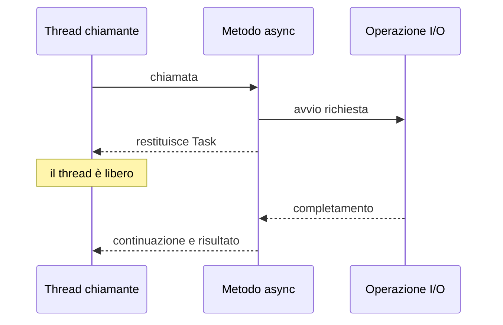
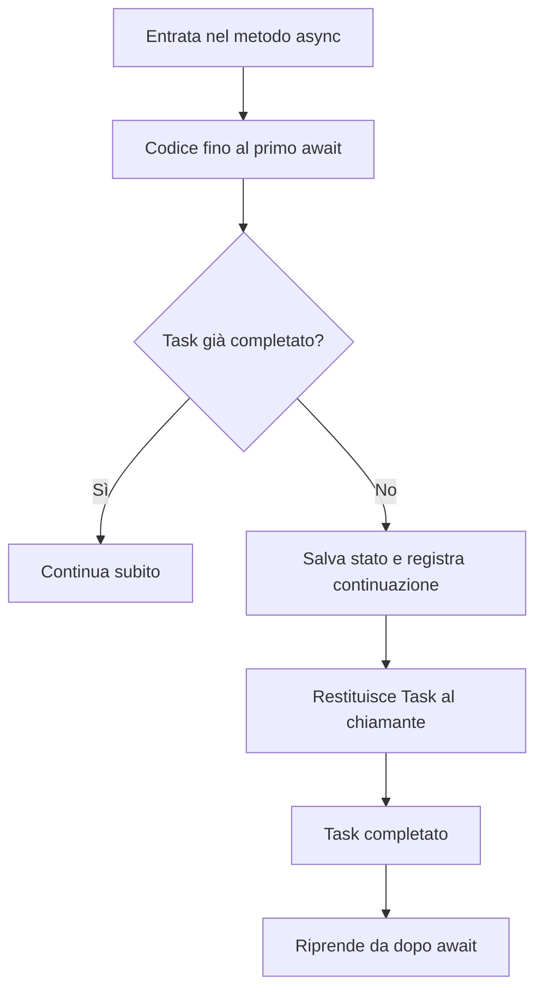
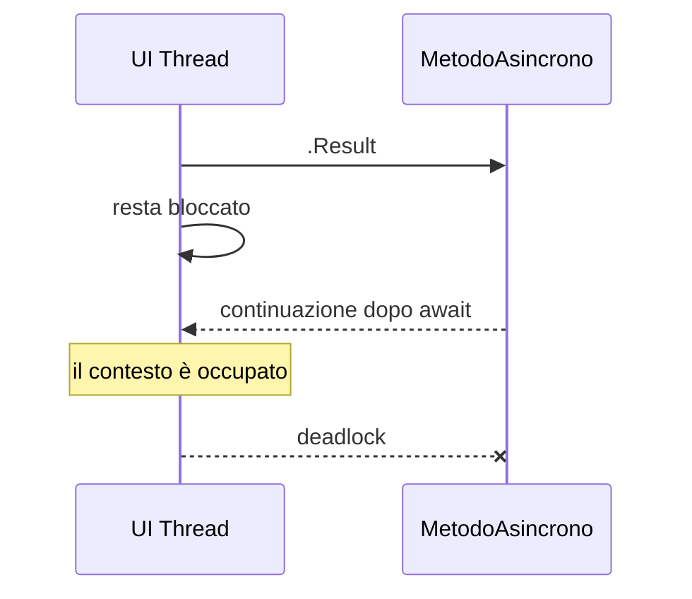

## 1. Introduzione

La programmazione **asincrona** in C# serve a gestire operazioni con latenza significativa senza occupare inutilmente il thread chiamante. Il caso tipico è l'I/O: rete, file system, database, chiamate HTTP. In questi scenari il costo principale non è il calcolo, ma il tempo di attesa:

$$
T_{totale} = T_{cpu} + T_{attesa}
$$

Se $T_{attesa} \gg T_{cpu}$, usare `await` migliora la **reattività**: durante l'attesa il thread torna al chiamante e può fare altro (in una UI evita finestre bloccate, in un server permette di servire più richieste con meno thread).

I tre pilastri sono:

- `async`: dichiara che un metodo può sospendersi e riprendere;
- `await`: sospende logicamente il metodo finché l'operazione non termina, senza bloccare il thread;
- `Task` / `Task<T>`: rappresentano il risultato futuro di un'operazione.


```mermaid
sequenceDiagram
    participant Caller as Thread chiamante
    participant Metodo as Metodo async
    participant IO as Operazione I/O

    Caller->>Metodo: chiamata
    Metodo->>IO: avvio richiesta
    Metodo-->>Caller: restituisce Task
    Note over Caller: il thread è libero
    IO-->>Metodo: completamento
    Metodo-->>Caller: continuazione e risultato
```

<Aside variant="info">
Asincronia, concorrenza e parallelismo non sono sinonimi: **asincronia** significa non bloccare mentre si aspetta, **concorrenza** avere più operazioni in corso nello stesso intervallo, **parallelismo** eseguirle davvero insieme su più core. Un metodo async non crea automaticamente un nuovo thread: durante un'attesa di I/O spesso non usa alcun thread.
</Aside>

## 2. Task e Task\<T\>

`Task` è l'astrazione centrale dell'asincronia in .NET: `Task` rappresenta un'operazione senza valore finale, `Task<T>` un'operazione che restituisce un valore di tipo `T`. Un task termina in uno di tre modi: **completato**, **fallito** con eccezione oppure **cancellato**.

```cs
Task task = Task.Run(() => Console.WriteLine("Eseguito nel thread pool"));

Task<int> taskConRitorno = Task.Run(() => 42);
int valore = await taskConRitorno; // 42
```

I task restituiti dai metodi `async` sono "caldi": il corpo parte subito e viene eseguito in modo sincrono fino al primo `await` che non è già completato.

```cs
public async Task<int> CalcolaAsync()
{
    Console.WriteLine("Parte subito");
    await Task.Delay(1000);
    Console.WriteLine("Ripreso dopo 1 secondo");
    return 10;
}

Task<int> t = CalcolaAsync();  // stampa subito "Parte subito"
Console.WriteLine("Faccio altro...");
int r = await t;               // poi "Ripreso dopo 1 secondo"
```

### CPU-bound vs I/O-bound

`Task.Run` accoda lavoro al **thread pool**, un insieme di thread worker riutilizzabili gestito da .NET. Ha senso per lavoro **CPU-bound** (calcolo); per lavoro **I/O-bound** (attesa) si usano direttamente le API async native.

| Scenario | Soluzione corretta |
|---|---|
| Chiamata HTTP, DB, file con API async disponibili | usa direttamente l'API async |
| Compressione, parsing pesante, hashing | valuta `Task.Run` |
| Wrappare `Thread.Sleep`, `.Result`, API sincrone lente | spesso è un anti-pattern |

```cs norun
// I/O-bound: l'API è già asincrona, Task.Run sarebbe inutile
public async Task<string> ScaricaHtmlAsync(HttpClient http, string url)
    => await http.GetStringAsync(url);

// CPU-bound: sposto il calcolo fuori dal thread corrente (es. UI)
public Task<long> SommaAsync(int n) => Task.Run(() =>
{
    long somma = 0;
    for (int i = 0; i < n; i++) somma += i;
    return somma;
});
```

Non "fingere" asincronia: `Task.Run(() => File.ReadAllText(path))` occupa comunque un thread del pool in attesa. Se esiste `File.ReadAllTextAsync`, usa quella.

## 3. Sintassi async / await

Un metodo `async` restituisce tipicamente `Task`, `Task<T>`, `ValueTask` o `ValueTask<T>`; `void` solo per gli event handler. Per convenzione il nome termina con `Async`.

```cs
public string LeggiDati()
{
    Thread.Sleep(2000);      // blocca il thread per 2 secondi
    return "Dati letti";
}

public async Task<string> LeggiDatiAsync()
{
    await Task.Delay(2000);  // il thread resta libero
    return "Dati letti";
}
```

### Cosa fa davvero `await`

Quando esegui `string risultato = await LeggiDatiAsync();`:

1. se il task è già completato, il metodo prosegue subito;
2. altrimenti salva il proprio stato, registra una **continuazione** e restituisce il controllo al chiamante;
3. quando il task termina, il metodo riparte dalla riga successiva all'`await`.


```mermaid
flowchart TD
    A[Entrata nel metodo async] --> B[Codice fino al primo await]
    B --> C{Task già completato?}
    C -- Sì --> D[Continua subito]
    C -- No --> E[Salva stato e registra continuazione]
    E --> F[Restituisce Task al chiamante]
    F --> G[Task completato]
    G --> H[Riprende da dopo await]
```

<Aside variant="info">
Il compilatore trasforma ogni metodo `async` in una **state machine**: ogni `await` diventa un punto di ripresa, le variabili locali che devono sopravvivere all'attesa diventano campi e un builder costruisce il `Task` restituito. Questo ha un piccolo costo di memoria e scheduling, trascurabile per l'I/O ma non per operazioni brevissime e sempre sincrone (vedi `ValueTask`).
</Aside>

### Await sequenziale vs concorrente

Dove metti l'`await` decide se le operazioni si sovrappongono o no:

```cs
// Sequenziale: ~2 secondi
await Task.Delay(1000);
await Task.Delay(1000);

// Concorrente: ~1 secondo, i due task partono insieme
Task a = Task.Delay(1000);
Task b = Task.Delay(1000);
await Task.WhenAll(a, b);
```

Con $N$ richieste indipendenti di latenza $L_i$, il tempo passa da $\sum L_i$ a circa $\max(L_i)$.

## 4. async void, fire-and-forget e `await` dimenticati

| Aspetto | `async void` | `async Task` |
|---|---|---|
| Può essere atteso | No | Sì |
| Eccezioni | non catturabili dal chiamante | rilanciate da `await` |
| Composizione con `WhenAll` / `WhenAny` | No | Sì |
| Uso corretto | event handler | quasi sempre |

```cs norun
public async void MetodoSbagliato()
{
    await Task.Delay(1000);
    throw new Exception("Nessun try/catch del chiamante la vedrà");
}

// Unico uso legittimo: event handler (la firma impone void)
private async void Button_Click(object sender, EventArgs e)
{
    try { await SalvaAsync(); }
    catch (Exception ex) { MessageBox.Show(ex.Message); }
}
```

<Aside variant="danger">
Un'eccezione non gestita in un metodo `async void` viene rilanciata sul contesto di sincronizzazione e può far terminare l'intera applicazione. Negli event handler async metti sempre un `try/catch` attorno al corpo.
</Aside>

Un errore molto comune è dimenticare `await`: il task parte, ma nessuno ne controlla esito o errori.

```cs norun
public void Metodo()
{
    SalvaAsync();       // warning CS4014: errori persi
}

public async Task MetodoCorretto()
{
    await SalvaAsync(); // eventuali eccezioni arrivano qui
}
```

Se invece vuoi davvero avviare un'operazione senza attenderla (**fire-and-forget**), rendilo esplicito con il discard `_ =` e registra gli errori:

```cs norun
_ = EseguiConLogAsync(SalvaLogAsync(), logger);

static async Task EseguiConLogAsync(Task task, ILogger logger)
{
    try { await task; }
    catch (Exception ex) { logger.LogError(ex, "Errore in background"); }
}
```

In ASP.NET Core o nei worker service, invece di lanciare task scollegati, è meglio usare `BackgroundService` o una coda interna, così il lavoro rispetta il ciclo di vita dell'app.

## 5. Gestione delle eccezioni

Le eccezioni dei metodi async vengono memorizzate nel `Task` e rilanciate quando fai `await`, quindi `try/catch/finally` funziona come nel codice sincrono.

```cs
public async Task<int> DividiAsync(int a, int b)
{
    await Task.Delay(100);
    if (b == 0)
        throw new DivideByZeroException("Divisione per zero!");
    return a / b;
}

try
{
    int risultato = await DividiAsync(10, 0);
}
catch (DivideByZeroException ex)
{
    Console.WriteLine($"Errore catturato: {ex.Message}");
}
```

Con `.Result` o `.Wait()`, invece, l'eccezione arriva avvolta in una `AggregateException` (da leggere tramite `InnerException`) e il thread resta bloccato.

### Eccezioni con Task.WhenAll

Se più task falliscono, `await Task.WhenAll(...)` rilancia **solo la prima** eccezione; l'elenco completo resta nella proprietà `Exception` del task aggregato.

```cs
Task t1 = Task.Run(() => throw new InvalidOperationException("Errore 1"));
Task t2 = Task.Run(() => throw new ArgumentException("Errore 2"));

Task all = Task.WhenAll(t1, t2);

try
{
    await all;
}
catch (Exception ex)
{
    Console.WriteLine($"Primo: {ex.Message}");
    foreach (var inner in all.Exception!.InnerExceptions)
        Console.WriteLine($"- {inner.Message}"); // Errore 1, Errore 2
}
```

## 6. Task.WhenAll e Task.WhenAny

`Task.WhenAll` attende che **tutti** i task terminino e, per `Task<T>`, restituisce un array con i risultati nello stesso ordine dei task.

```cs norun
Task<string> t1 = http.GetStringAsync("https://api1.example.com");
Task<string> t2 = http.GetStringAsync("https://api2.example.com");
Task<string> t3 = http.GetStringAsync("https://api3.example.com");

string[] risultati = await Task.WhenAll(t1, t2, t3);
Console.WriteLine($"Ricevute {risultati.Length} risposte");
```

`WhenAll` porta vantaggio solo se i task sono **indipendenti**: se ognuno dipende dal risultato del precedente, l'ordine resta sequenziale.

`Task.WhenAny` restituisce il **primo** task completato (non il suo risultato: va atteso a sua volta). È utile per timeout, fallback su più endpoint o per processare i risultati in ordine di arrivo.

```cs
async Task<string> Simula(string nome, int ms)
{
    await Task.Delay(ms);
    return nome;
}

Task<string> lento = Simula("Lento", 3000);
Task<string> veloce = Simula("Veloce", 500);

Task<string> primo = await Task.WhenAny(lento, veloce);
Console.WriteLine($"Primo completato: {await primo}"); // Veloce
```

Esempio pratico: un timeout manuale con `WhenAny`.

```cs norun
Task<string> richiesta = http.GetStringAsync(url);
Task timeout = Task.Delay(TimeSpan.FromSeconds(2));

if (await Task.WhenAny(richiesta, timeout) == timeout)
    Console.WriteLine("Timeout!");
else
    Console.WriteLine(await richiesta);
```

<Aside variant="info">
Prima di `await` si componevano i task con `ContinueWith`. Esiste ancora, ma richiede di gestire a mano scheduler, errori e cancellazione: preferisci `await`, che preserva `try/catch`, `using` e debugging. Da .NET 6 è disponibile anche `WaitAsync(timeout)`, che semplifica l'esempio sopra.
</Aside>

### Parallelismo controllato: Parallel.ForEachAsync

Con molti elementi, avviare tutti i task insieme può saturare rete o server. Da .NET 6 `Parallel.ForEachAsync` limita quante iterazioni girano in contemporanea.

```cs norun
var options = new ParallelOptions
{
    MaxDegreeOfParallelism = 4,
    CancellationToken = ct
};

await Parallel.ForEachAsync(urls, options, async (url, token) =>
{
    string html = await http.GetStringAsync(url, token);
    Console.WriteLine($"{url}: {html.Length} caratteri");
});
```

## 7. Cancellazione, progresso e async streams

### CancellationToken

Il `CancellationToken` è il modo **cooperativo** per interrompere un'operazione: chi la esegue controlla il token e si ferma da solo.

```cs
public async Task OperazioneLungaAsync(CancellationToken ct)
{
    for (int i = 0; i < 100; i++)
    {
        ct.ThrowIfCancellationRequested();
        await Task.Delay(100, ct);
        Console.WriteLine($"Step {i}");
    }
}

using var cts = new CancellationTokenSource();
cts.CancelAfter(TimeSpan.FromMilliseconds(500));

try
{
    await OperazioneLungaAsync(cts.Token);
}
catch (OperationCanceledException)
{
    Console.WriteLine("Operazione cancellata!"); // dopo circa 5 step
}
```

<Aside variant="tip">
Propaga il `CancellationToken` fino ai livelli più bassi (HTTP, database, `Task.Delay`): un token accettato ma non passato alle chiamate interne non cancella niente. Cattura `OperationCanceledException`, che include anche `TaskCanceledException`.
</Aside>

### IProgress\<T\>

Per notificare l'avanzamento usa `IProgress<T>`. `Progress<T>` invoca il callback sul contesto in cui è stato creato, quindi in una UI può aggiornare i controlli in sicurezza.

```cs
public async Task DownloadAsync(IProgress<int> progress, CancellationToken ct)
{
    for (int p = 0; p <= 100; p += 25)
    {
        await Task.Delay(100, ct);
        progress.Report(p);
    }
}

var progress = new Progress<int>(p => Console.WriteLine($"Completamento: {p}%"));
await DownloadAsync(progress, CancellationToken.None);
// Completamento: 0%, 25%, 50%, 75%, 100%
```

### Async streams: `IAsyncEnumerable<T>`

Quando i dati arrivano nel tempo (paging, eventi, lettura di file o rete) puoi produrli uno alla volta con `yield return` e consumarli con `await foreach`, senza materializzare l'intera collezione.

```cs norun
public async IAsyncEnumerable<int> GeneraValoriAsync(
    [EnumeratorCancellation] CancellationToken ct = default)
{
    for (int i = 1; i <= 5; i++)
    {
        await Task.Delay(200, ct);
        yield return i;
    }
}

await foreach (int valore in GeneraValoriAsync())
    Console.WriteLine(valore); // 1, 2, 3, 4, 5 (uno ogni 200 ms)
```

Un async stream non implica parallelismo: ogni elemento arriva in modo asincrono, ma uno dopo l'altro.

## 8. ConfigureAwait e SynchronizationContext

Il `SynchronizationContext` decide **dove** riprende un metodo dopo `await`. Per default, `await` cattura il contesto corrente e vi ritorna:

- **WPF / WinForms / MAUI**: il contesto è il thread UI, quindi dopo `await` puoi toccare i controlli;
- **ASP.NET Core e console app**: non c'è un contesto speciale, la continuazione riprende su un thread qualsiasi del pool.

```cs norun
private async void Carica_Click(object sender, RoutedEventArgs e)
{
    string testo = await http.GetStringAsync("https://example.com");
    MiaLabel.Content = testo; // ok: siamo tornati sul thread UI
}
```

`ConfigureAwait(false)` dice di **non** tornare sul contesto originale. È utile nel codice di libreria, che non ha bisogno della UI e così evita un salto di thread.

```cs norun
public async Task<string> MetodoDiLibreriaAsync()
{
    var dati = await FetchAsync().ConfigureAwait(false);
    return dati.ToUpper(); // può girare su un thread del pool
}
```

Nel codice UI, invece, evitalo se dopo l'`await` accedi ai controlli: la continuazione potrebbe girare fuori dal thread UI e lanciare `InvalidOperationException`.

<Aside variant="info">
`ExecutionContext` è un concetto diverso: non decide dove riprendere, ma quali dati ambientali (valori `AsyncLocal<T>`, cultura, identità) fluiscono attraverso gli `await`. `ConfigureAwait(false)` non lo interrompe: un `AsyncLocal<string>` impostato prima dell'`await` resta leggibile dopo.
</Aside>

## 9. Deadlock e sync over async

Un deadlock async tipico nasce quando blocchi sincronicamente (con `.Result` o `.Wait()`) il thread che serve anche alla continuazione.

```cs norun
// Event handler WPF
private void Button_Click(object sender, RoutedEventArgs e)
{
    var risultato = MetodoAsincrono().Result; // deadlock!
}

public async Task<string> MetodoAsincrono()
{
    await Task.Delay(1000);
    return "Pronto";
}
```

Cosa succede: il thread UI si blocca su `.Result`; al termine del delay `MetodoAsincrono` vuole riprendere sul thread UI (contesto catturato), che però sta aspettando. Nessuno dei due può avanzare.


```mermaid
sequenceDiagram
    participant UI as UI Thread
    participant Async as MetodoAsincrono

    UI->>Async: .Result
    UI->>UI: resta bloccato
    Async-->>UI: continuazione dopo await
    Note over UI: il contesto è occupato
    UI--x Async: deadlock
```

La soluzione è **async all the way**: rendere asincrona l'intera catena di chiamate.

```cs norun
private async void Button_Click(object sender, RoutedEventArgs e)
{
    var risultato = await MetodoAsincrono(); // nessun blocco
    MiaLabel.Content = risultato;
}
```

<Aside variant="danger">
In ASP.NET Core questo deadlock specifico è raro (non c'è contesto UI), ma `.Result` e `.Wait()` restano dannosi: ogni richiesta bloccata occupa un thread del pool e sotto carico si arriva alla **thread pool starvation**, con latenze che esplodono.
</Aside>

## 10. ValueTask

`ValueTask<T>` è utile quando un metodo completa spesso **in modo sincrono**: evita di allocare un `Task<T>` a ogni chiamata.

```cs norun
private readonly Dictionary<string, int> _cache = new();

public async ValueTask<int> LeggiDaCacheAsync(string chiave)
{
    if (_cache.TryGetValue(chiave, out int valore))
        return valore;                     // cache hit: nessuna allocazione

    int daDb = await _db.LeggiAsync(chiave);
    _cache[chiave] = daDb;
    return daDb;
}
```

Ha senso per cache hit frequenti o API ad altissima frequenza; se il metodo è quasi sempre davvero asincrono, `Task<T>` resta la scelta più semplice.

<Aside variant="warning">
Un `ValueTask` va atteso **una sola volta**. Se ti serve attenderlo più volte o conservarlo, convertilo con `.AsTask()`.
</Aside>

### Riepilogo rapido

| Problema | Strumento principale |
|---|---|
| Attesa rete/file/database | API async native + `await` |
| Calcolo pesante che non deve bloccare | `Task.Run` |
| Molti task indipendenti | `Task.WhenAll` |
| Primo risultato utile / timeout | `Task.WhenAny` |
| Interruzione | `CancellationToken` |
| Progressi | `IProgress<T>` |
| Flusso graduale di dati | `IAsyncEnumerable<T>` |
| Parallelismo limitato su collezioni | `Parallel.ForEachAsync` |
| Libreria senza bisogno del contesto | `ConfigureAwait(false)` |

## 11. Quiz

import Quiz from '../../../components/Quiz.jsx';

<Quiz client:load questions={[
{
question:"Cosa fa la keyword await in C#?",
answers:{
a:"Blocca il thread corrente fino al completamento",
b:"Sospende il metodo corrente senza bloccare il thread",
c:"Crea un nuovo thread",
d:"Cancella il task"
},
correctAnswer:"b"
},
{
question:"Quale tipo di ritorno è consigliato per un metodo asincrono?",
answers:{
a:"void",
b:"int",
c:"Task o Task<T>",
d:"object"
},
correctAnswer:"c"
},
{
question:"async void è consigliato in quale caso?",
answers:{
a:"Sempre",
b:"Mai",
c:"Solo per event handler",
d:"Per metodi di librerie"
},
correctAnswer:"c"
},
{
question:"Task.WhenAll fa:",
answers:{
a:"Esegue i task in sequenza",
b:"Attende il completamento di TUTTI i task in parallelo",
c:"Attende il primo task completato",
d:"Cancella tutti i task"
},
correctAnswer:"b"
},
{
question:"Task.WhenAny fa:",
answers:{
a:"Lancia un'eccezione se un task fallisce",
b:"Attende che TUTTI i task finiscano",
c:"Restituisce il primo task completato",
d:"Cancella i task in eccesso"
},
correctAnswer:"c"
},
{
question:"Cosa lancia ThrowIfCancellationRequested()?",
answers:{
a:"TaskCanceledException",
b:"TimeoutException",
c:"OperationCanceledException",
d:"InvalidOperationException"
},
correctAnswer:"c"
},
{
question:"ConfigureAwait(false) è particolarmente utile in:",
answers:{
a:"Applicazioni WPF",
b:"Librerie riutilizzabili",
c:"Metodi statici",
d:"Event handler"
},
correctAnswer:"b"
},
{
question:"Quale chiamata può causare un deadlock in WPF?",
answers:{
a:"await task",
b:"task.Result",
c:"Task.WhenAll",
d:"Task.Run"
},
correctAnswer:"b"
},
{
question:"ValueTask<T> è preferibile quando:",
answers:{
a:"Il metodo è sempre asincrono",
b:"Il metodo spesso completa in modo sincrono",
c:"Si usano CancellationToken",
d:"Si lavora con database"
},
correctAnswer:"b"
},
{
question:"Come si avvia un metodo asincrono senza attenderne il risultato (fire-and-forget)?",
answers:{
a:"await task",
b:"task.Wait()",
c:"_ = task (con discard)",
d:"Task.WhenAny(task)"
},
correctAnswer:"c"
}
]} />

## 12. Esercizi

### 12.1 Download simulato

**Scenario**: Vuoi simulare il download di più file in parallelo.

**Consegna**:
1. Crea un metodo `async Task<string> DownloadFileAsync(string url)` che simula un download con `Task.Delay` (delay casuale tra 500ms e 2000ms) e restituisce il nome del file.
2. Nel `Main`, avvia 5 download in parallelo con `Task.WhenAll`.
3. Confronta il tempo totale con quello di 5 `await` in sequenza (usa `Stopwatch`).

*Obiettivo: comprendere la concorrenza con Task.WhenAll e i benefici dell'async.*

### 12.2 Timeout con CancellationToken

**Scenario**: Vuoi che un'operazione lunga venga cancellata se supera un certo tempo.

**Consegna**:
1. Crea un metodo `async Task ElaboraAsync(CancellationToken ct)` che esegue 20 step con `Task.Delay(300, ct)`.
2. Nel `Main`, usa `CancellationTokenSource` con timeout di 1 secondo.
3. Gestisci `OperationCanceledException` e mostra un messaggio appropriato.

*Obiettivo: imparare a usare CancellationToken per controllare la durata delle operazioni.*

### 12.3 Gestione eccezioni async

**Scenario**: Devi chiamare più API e alcune potrebbero fallire.

**Consegna**:
1. Crea un metodo `async Task<int> ChiamaApiAsync(int id)` che lancia un'eccezione se `id % 3 == 0`.
2. Chiama 6 API con `Task.WhenAll`.
3. Cattura l'eccezione e stampa **tutti** gli errori leggendo `Exception.InnerExceptions` del task aggregato.

*Obiettivo: capire come le eccezioni si propagano in contesti di task concorrenti.*

### 12.4 Pipeline asincrona

**Scenario**: Devi costruire una pipeline: leggi dati $\rightarrow$ elabora $\rightarrow$ salva.

**Consegna**:
1. `async Task<string> LeggiAsync()` $\rightarrow$ restituisce dati grezzi dopo 500ms.
2. `async Task<string> ElaboraAsync(string dati)` $\rightarrow$ trasforma i dati dopo 300ms.
3. `async Task SalvaAsync(string dati)` $\rightarrow$ simula salvataggio dopo 200ms.
4. Nel `Main`, esegui la pipeline in sequenza con `await`.

*Obiettivo: comprendere la composizione di metodi asincroni in sequenza.*
