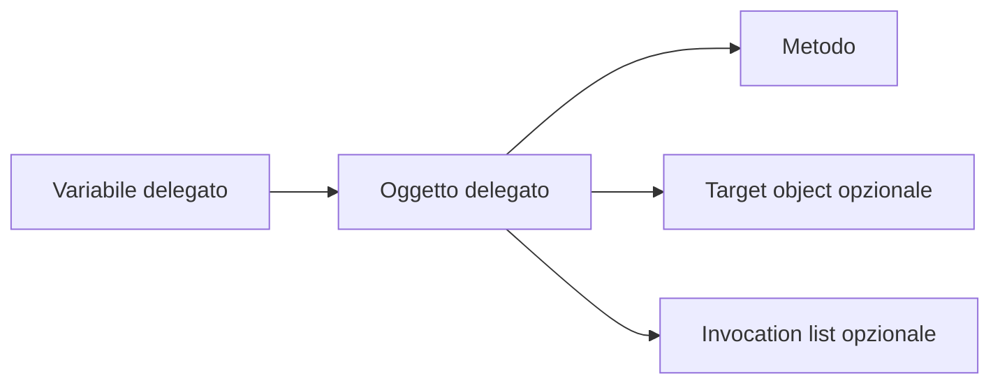
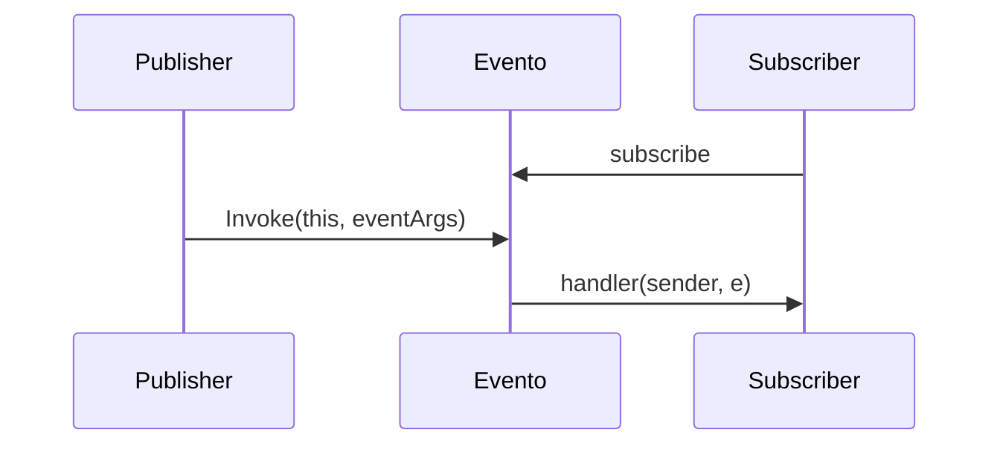

## 1. Introduzione

Un **delegato** è un tipo reference di .NET che incapsula in modo sicuro un **riferimento a uno o più metodi compatibili con una certa firma**.
Spesso viene descritto come un "puntatore a funzione tipizzato", ma in C# è qualcosa di più strutturato:

- è un **tipo vero e proprio**, generato come classe derivata da `System.MulticastDelegate`;
- conserva il **metodo da invocare** e, se necessario, anche il **target object** su cui invocarlo;
- può contenere **una lista di invocazione**;
- partecipa al type system di C#, quindi il compilatore controlla **parametri**, **tipo di ritorno** e **varianza**.

I delegati servono per:

- passare comportamenti come parametri;
- implementare **callback**, **pipeline** e **strategie**;
- costruire sistemi di **notifica** tramite **eventi**;
- alimentare API basate su **lambda expressions**, **metodi anonimi** e **LINQ**;
- separare chi esegue un'azione da chi decide *quale* azione eseguire.

### 1.1 Modello mentale corretto

Quando scrivi:

```cs
Action<string> stampa = Console.WriteLine;
```

non stai salvando "il codice del metodo" dentro una variabile.
Stai creando un **oggetto delegato** che contiene abbastanza informazioni per chiamare in sicurezza un metodo compatibile.

### 1.2 Dove i delegati compaiono nella pratica

Li incontri continuamente, anche quando non dichiari un `delegate` personalizzato:

- `List<T>.ForEach(Action<T>)`
- `Enumerable.Where(Func<T, bool>)`
- `Task.Run(Action)`
- `Comparison<T>`
- `Predicate<T>`
- eventi come `Button.Click`

In altre parole, gran parte del C# moderno usa delegati in modo esplicito o implicito.

## 2. Dichiarazione

Per dichiarare un tipo delegato si utilizza la parola chiave `delegate`:

`[modificatore] delegate [tipo_ritorno] [nome_funzione]([lista_parametri]);`

Esempio:

```cs
public class Program
{
    public delegate void Delegato(string messaggio);

    public static void MetodoStampa(string messaggio)
    {
        Console.WriteLine(messaggio);
    }

    public static void Main()
    {
        Delegato del = MetodoStampa;
        del("Hello World");
    }
}
```

In questo esempio:

- il delegato `Delegato` rappresenta un metodo che non restituisce nulla (`void`) e accetta una stringa;
- `MetodoStampa` è compatibile con la firma del delegato;
- `del("Hello World")` equivale concettualmente a `MetodoStampa("Hello World")`.

### 2.1 Compatibilità della firma

Un metodo può essere assegnato a un delegato se rispetta:

- stesso numero di parametri;
- tipi compatibili dei parametri;
- tipo di ritorno compatibile;
- corretto uso di `ref`, `out`, `in`, se presenti.

Per esempio:

```cs
public delegate int Operazione(int a, int b);

public static int Somma(int x, int y) => x + y;
public static int Moltiplica(int x, int y) => x * y;

Operazione op1 = Somma;
Operazione op2 = Moltiplica;
```

### 2.2 Delegati statici e di istanza

Un delegato può riferirsi sia a:

- un **metodo statico**;
- un **metodo di istanza**.

```cs
public delegate void Logger(string messaggio);

public class ConsoleLogger
{
    public void Log(string messaggio)
    {
        Console.WriteLine($"LOG: {messaggio}");
    }
}

public class Program
{
    public static void LogStatico(string messaggio)
    {
        Console.WriteLine($"STATICO: {messaggio}");
    }

    public static void Main()
    {
        Logger a = LogStatico;

        var logger = new ConsoleLogger();
        Logger b = logger.Log;

        a("ciao");
        b("mondo");
    }
}
```

Nel primo caso il target è assente; nel secondo il delegato memorizza anche il riferimento all'oggetto `logger`.

### 2.3 Come funziona internamente

Ogni delegato dichiarato in C# viene compilato in un tipo simile a una classe.
Concettualmente:

- eredita da `System.MulticastDelegate`;
- possiede un costruttore;
- espone il metodo `Invoke(...)`;
- può esporre anche `BeginInvoke` e `EndInvoke` nei modelli legacy.

In forma semplificata, una dichiarazione come:

```cs
public delegate int Operazione(int a, int b);
```

viene trasformata in qualcosa di equivalente a:

```cs
public sealed class Operazione : MulticastDelegate
{
    public Operazione(object target, IntPtr method);
    public int Invoke(int a, int b);
}
```

Non è codice che scrivi tu manualmente: lo genera il compilatore.

### 2.4 Cosa contiene un oggetto delegato

Un'istanza di delegato, a livello concettuale, contiene:

- il **metodo** da invocare;
- il **target object** per i metodi di istanza;
- la **invocation list** se è multicast.



### 2.5 Uno sguardo all'IL

Quando assegni un metodo a un delegato, il compilatore produce istruzioni IL che:

- caricano il target, se presente;
- caricano il puntatore al metodo;
- chiamano il costruttore del delegato.

Schema semplificato:

```text
ldnull
ldftn      void Program::MetodoStampa(string)
newobj     instance void Program/Delegato::.ctor(object, native int)
stloc.0
```

L'idea chiave è che il delegato non è una "funzione volante", ma un **oggetto** costruito a runtime con un riferimento a metodo.

### 2.6 Perché usare un delegato personalizzato

Ha senso dichiarare un tipo `delegate` dedicato quando:

- il nome del tipo comunica bene l'intenzione, ad esempio `ValidationRule`, `RetryPolicy`, `PaymentProcessor`;
- vuoi rendere più leggibile un'API di dominio;
- vuoi allegare documentazione specifica a quella firma;
- la semantica è più chiara di un generico `Func<...>`.

## 3. Multicasting di un delegato

Un **delegato multicast** può referenziare **più metodi** contemporaneamente.

Regole principali:

- si usano gli operatori `+` o `+=` per aggiungere metodi;
- si usano gli operatori `-` o `-=` per rimuoverli;
- i metodi vengono invocati in ordine di registrazione;
- se un metodo lancia un'eccezione, l'invocazione della catena si interrompe, a meno che tu non gestisca manualmente i singoli handler.

```cs
public delegate void Delegato(string messaggio);

public class Program
{
    public static void MetodoA(string msg) => Console.WriteLine("A: " + msg);
    public static void MetodoB(string msg) => Console.WriteLine("B: " + msg);
    public static void MetodoC(string msg) => Console.WriteLine("C: " + msg);

    public static void Main()
    {
        Delegato d = MetodoA;
        d += MetodoB;
        d += MetodoC;

        d("Prova di multicast");

        d -= MetodoB;
        d("Dopo rimozione di B");
    }
}
```

### 3.1 Invocation list

Un delegato multicast non contiene un solo riferimento, ma una **lista di invocazione**.
Ogni elemento della lista è, concettualmente, una coppia:

- metodo;
- target associato a quel metodo.

Con `GetInvocationList()` puoi ispezionare questa lista:

```cs
public delegate void Notifica(string messaggio);

Notifica notifica = msg => Console.WriteLine("Console: " + msg);
notifica += msg => Console.WriteLine("Audit: " + msg);

Delegate[] handlers = notifica.GetInvocationList();

foreach (Delegate handler in handlers)
{
    Console.WriteLine($"Metodo: {handler.Method.Name}");
    Console.WriteLine($"Target: {handler.Target}");
}
```

Questo è molto utile per debugging, logging avanzato o invocazione controllata dei singoli subscriber.

### 3.2 Delegate chaining

La **chaining** consiste nel comporre più handler in una sola variabile delegato:

```cs
Action pipeline = Step1;
pipeline += Step2;
pipeline += Step3;

pipeline();
```

È una tecnica comoda per:

- pipeline di logging;
- notifiche;
- hook di estensione;
- sistemi plugin molto semplici.

Tuttavia non sostituisce automaticamente pattern più strutturati come middleware, command bus o observer complessi.

### 3.3 Thread safety nei multicast delegates

I delegati sono **immutabili**: quando fai `d += Metodo`, in realtà viene creato un **nuovo delegato** con una nuova invocation list.
Questa caratteristica riduce alcuni problemi di concorrenza, ma non elimina tutti i rischi.

Il problema classico è questo:

```cs
if (OnNotifica != null)
{
    OnNotifica("messaggio");
}
```

Tra il controllo `!= null` e l'invocazione, un altro thread potrebbe rimuovere tutti gli handler.
Per questo si preferisce:

```cs
OnNotifica?.Invoke("messaggio");
```

oppure la copia locale:

```cs
var copia = OnNotifica;
copia?.Invoke("messaggio");
```

Con gli eventi, la copia locale resta una tecnica molto usata perché fotografa l'elenco dei subscriber in quel preciso istante.

### 3.4 Gestione robusta delle eccezioni in catena

Se vuoi che tutti gli handler vengano eseguiti anche se uno fallisce, puoi ispezionare la lista e invocare ogni elemento separatamente:

```cs
Action azione = HandlerA;
azione += HandlerB;
azione += HandlerC;

foreach (Action handler in azione.GetInvocationList())
{
    try
    {
        handler();
    }
    catch (Exception ex)
    {
        Console.WriteLine($"Errore in {handler.Method.Name}: {ex.Message}");
    }
}
```

### 3.5 Errori comuni con il multicast

- aspettarsi che tutti i metodi vengano eseguiti se uno lancia eccezione;
- usare delegati multicast con valori di ritorno aspettandosi risultati multipli;
- dimenticare di rimuovere subscription che mantengono vivi oggetti non più necessari;
- trattare una catena di delegati come se fosse un sistema di orchestrazione complesso.

## 4. Delegati con tipo di ritorno

Quando un delegato rappresenta metodi che **ritornano un valore**, in una lista multicast **solo il valore restituito dall'ultimo metodo** viene restituito dalla chiamata diretta al delegato.

Esempio:

```cs
public delegate int Calcola();

public class Program
{
    public static int Somma() => 10;
    public static int Moltiplica() => 5 * 2;

    public static void Main()
    {
        Calcola calc = Somma;
        calc += Moltiplica;

        int risultato = calc();
        Console.WriteLine(risultato);
    }
}
```

### 4.1 Perché è importante saperlo

Molti principianti pensano che il multicast "raccolga tutti i risultati".
Non è così: la chiamata `calc()` invoca tutti i metodi in sequenza, ma **ritorna solo l'ultimo valore**.

Se vuoi tutti i risultati, devi iterare la invocation list:

```cs
public delegate int Calcolo();

Calcolo c = () => 10;
c += () => 20;
c += () => 30;

List<int> risultati = new();

foreach (Calcolo singolo in c.GetInvocationList())
{
    risultati.Add(singolo());
}
```

### 4.2 Quando usarli davvero

I delegati con ritorno sono molto utili quando rappresentano:

- una strategia di calcolo;
- una funzione di mapping;
- una regola di validazione che restituisce un dato;
- una factory;
- un comparatore o selettore.

Esempi reali:

- `Func<HttpRequest, CancellationToken, Task<HttpResponse>>` in pipeline web;
- `Comparison<T>` per ordinamenti custom;
- `Converter<TInput, TOutput>` per trasformazioni di dati;
- funzioni di pricing, sconto, scoring, ranking.

### 4.3 Anti-pattern

Un anti-pattern frequente è usare un delegato multicast con ritorno per modellare votazioni, aggregazioni o decisioni multiple.
In quei casi è quasi sempre meglio:

- usare una collezione di strategy object;
- iterare una lista di funzioni;
- applicare un aggregatore esplicito.

## 5. Delegati predefiniti: Action, Func e Predicate

C# fornisce **delegati generici** già pronti all'uso, che evitano di dichiarare nuovi tipi `delegate`.

### 5.1 Action

Rappresenta un metodo che non restituisce valore (`void`).

```cs
Action<string> stampa = msg => Console.WriteLine(msg);
stampa("Ciao da Action!");
```

Usi reali comuni:

- logging;
- callback di completamento;
- notifiche UI;
- operazioni da eseguire su ogni elemento di una collezione;
- passaggio di "pezzi di lavoro" a scheduler o thread pool.

Caso reale:

```cs
public static void EseguiConAudit(Action operazione)
{
    Console.WriteLine("Inizio");
    operazione();
    Console.WriteLine("Fine");
}
```

### 5.2 Func

Rappresenta un metodo che restituisce un valore.

```cs
Func<int, int, int> somma = (a, b) => a + b;
int risultato = somma(5, 4);
```

L'ultimo tipo generico rappresenta il tipo di ritorno.

Esempio:
`Func<string, int>` accetta una `string` e restituisce un `int`.

Usi reali comuni:

- trasformazioni dati;
- factory;
- deferred execution;
- calcoli parametrizzabili;
- projection in LINQ.

Caso reale:

```cs
public static T Misura<T>(Func<T> operazione)
{
    var inizio = DateTime.UtcNow;
    T risultato = operazione();
    var fine = DateTime.UtcNow;

    Console.WriteLine($"Durata: {(fine - inizio).TotalMilliseconds} ms");
    return risultato;
}
```

### 5.3 Predicate

Rappresenta un metodo che restituisce un valore booleano (`bool`) e accetta un singolo parametro.

```cs
Predicate<int> pari = n => n % 2 == 0;
Console.WriteLine(pari(4));
```

Usi reali comuni:

- filtri;
- validazioni semplici;
- ricerca in collezioni (`Find`, `Exists`, `RemoveAll`);
- regole di business booleane.

Caso reale:

```cs
List<string> email = new() { "a@test.it", "b@azienda.it", "c@test.it" };
Predicate<string> dominioAziendale = e => e.EndsWith("@azienda.it");

bool presente = email.Exists(dominioAziendale);
```

### 5.4 Quando scegliere un delegate custom invece di Action/Func/Predicate

Usa `Action`, `Func` e `Predicate` quando:

- la firma è semplice;
- il contesto è chiaro;
- stai scrivendo codice tecnico o infrastrutturale.

Usa un delegate custom quando:

- vuoi un nome semanticamente forte;
- vuoi migliorare leggibilità e documentazione;
- la callback ha un significato di dominio.

Esempio:

```cs
public delegate decimal CalcoloCommissione(decimal importo, Cliente cliente);
```

Spesso comunica più di `Func<decimal, Cliente, decimal>`.

### 5.5 Confronto con le interfacce per callback

Delegati e interfacce possono entrambi modellare comportamenti, ma servono scopi diversi.

**Delegato**:

- ideale per una singola operazione;
- sintassi leggera;
- ottimo per callback brevi, strategy semplici, hook, pipeline;
- si integra perfettamente con lambda e LINQ.

**Interfaccia**:

- migliore quando il contratto ha **più metodi**;
- consente stato interno e dipendenze;
- rende più esplicito un comportamento complesso;
- favorisce estensioni più grandi e testabilità strutturata.

Esempio con delegato:

```cs
public static void ElaboraOrdine(Ordine ordine, Action<Ordine> callback)
{
    callback(ordine);
}
```

Esempio con interfaccia:

```cs
public interface IOrderProcessor
{
    void Validate(Ordine ordine);
    void Save(Ordine ordine);
    void Notify(Ordine ordine);
}
```

Regola pratica:

- **delegato** per "passami una funzione";
- **interfaccia** per "dammi un collaboratore con responsabilità articolate".

## 6. Delegati anonimi

È possibile definire un delegato senza dichiarare un metodo separato tramite **metodi anonimi**.

```cs
public delegate void Stampa(string messaggio);

Stampa stampa = delegate(string msg)
{
    Console.WriteLine($"Anonimo: {msg}");
};

stampa("Hello!");
```

Questa forma è utile quando la logica:

- è piccola;
- viene usata una sola volta;
- non merita un metodo nominato.

### 6.1 Differenza tra metodo anonimo e lambda

Entrambi servono a creare callback inline.
La lambda è in genere più compatta e oggi è la forma più usata.

Metodo anonimo:

```cs
Action<string> a = delegate(string s)
{
    Console.WriteLine(s);
};
```

Lambda:

```cs
Action<string> b = s => Console.WriteLine(s);
```

### 6.2 Closure: come vengono catturate le variabili

Quando una lambda o un metodo anonimo usa variabili del contesto esterno, il compilatore crea una **closure**.
In pratica genera un oggetto ausiliario che contiene quelle variabili come campi.

```cs
int contatore = 0;

Action incrementa = () =>
{
    contatore++;
    Console.WriteLine(contatore);
};

incrementa();
incrementa();
```

Qui la lambda non copia semplicemente il valore iniziale di `contatore`.
Cattura la **variabile**, quindi tutte le invocazioni vedono lo stesso stato condiviso.

### 6.3 Il capture trap nei cicli

Errore tipico:

```cs
List<Action> azioni = new();

for (int i = 0; i < 3; i++)
{
    azioni.Add(() => Console.WriteLine(i));
}

foreach (var azione in azioni)
{
    azione();
}
```

Molti si aspettano:

```text
0
1
2
```

ma il risultato può essere:

```text
3
3
3
```

perché tutte le lambda catturano la **stessa variabile `i`**.

La correzione consiste nel creare una variabile locale per iterazione:

```cs
List<Action> azioni = new();

for (int i = 0; i < 3; i++)
{
    int copia = i;
    azioni.Add(() => Console.WriteLine(copia));
}
```

### 6.4 Perché la closure è importante anche per memoria e bug

Le closure possono:

- mantenere vivi oggetti più del necessario;
- introdurre stato condiviso invisibile;
- rendere più difficile capire quando un valore cambia;
- causare bug in codice asincrono e concorrente.

Anti-pattern comuni:

- catturare oggetti pesanti inutilmente;
- catturare variabili mutabili in callback differite nel tempo;
- riusare la stessa variabile di loop aspettandosi copie indipendenti.

### 6.5 Best practice sulle closure

- cattura solo ciò che ti serve;
- preferisci variabili locali immutabili quando possibile;
- fai attenzione nei loop;
- in codice concorrente, evita stato catturato condiviso senza sincronizzazione.

## 7. Lambda expressions e delegati

Le **lambda expressions** sono la forma più comune per creare delegati in C# moderno.

```cs
Action<int> stampaQuadrato = n => Console.WriteLine(n * n);
stampaQuadrato(5);
```

Sono comunemente utilizzate con **LINQ** e metodi di estensione come `Select`, `Where`, `OrderBy`.

Esempio LINQ:

```cs
int[] numeri = { 1, 2, 3, 4, 5 };
var pari = numeri.Where(n => n % 2 == 0);

foreach (var n in pari)
{
    Console.WriteLine(n);
}
```

### 7.1 Lambda expression body singolo e body a blocco

```cs
Func<int, int> doppio = x => x * 2;

Func<int, int> elaborata = x =>
{
    int risultato = x * 2;
    return risultato + 1;
};
```

### 7.2 Type inference

Molto spesso il compilatore deduce automaticamente il tipo del delegato dal contesto:

```cs
var numeri = new List<int> { 1, 2, 3, 4, 5 };
var dispari = numeri.Where(n => n % 2 != 0);
```

La lambda `n => n % 2 != 0` viene convertita nel delegate richiesto da `Where`, cioè `Func<int, bool>`.

### 7.3 Lambda e closure insieme

Quasi tutte le lambda non banali usano closure.
Per esempio:

```cs
int soglia = 10;
Func<int, bool> maggioreDiSoglia = n => n > soglia;
```

Se `soglia` cambia, cambia anche il comportamento della lambda:

```cs
soglia = 100;
Console.WriteLine(maggioreDiSoglia(50));
```

### 7.4 Use case reali

Le lambda vengono usate per:

- filtrare dati;
- ordinare collezioni;
- trasformare DTO e view model;
- passare retry policy, fallback, formatter;
- eseguire task differiti;
- costruire API fluent.

Esempio più realistico:

```cs
public static IEnumerable<Ordine> FiltraOrdini(
    IEnumerable<Ordine> ordini,
    Func<Ordine, bool> filtro)
{
    return ordini.Where(filtro);
}
```

### 7.5 Anti-pattern con le lambda

- inserire logica troppo complessa in una lambda inline;
- creare lambda con side effect nascosti in query LINQ;
- catturare variabili mutabili in operazioni asincrone;
- sacrificare la leggibilità pur di scrivere tutto in una riga.

Best practice:

- estrai in un metodo nominato se la lambda cresce troppo;
- mantieni le lambda pure quando possibile;
- usa nomi chiari delle variabili per migliorare leggibilità.

## 8. Delegati ed eventi

Gli **eventi** in C# si basano sui delegati.
Un evento è un meccanismo che permette a una classe di notificare a una o più altre classi che qualcosa è successo, ma con una differenza fondamentale: dall'esterno puoi **iscriverti** o **disiscriverti**, non puoi invocare direttamente l'evento.

Esempio:

```cs
public delegate void Notifica(string message);

public class Publisher
{
    public event Notifica OnNotifica;

    public void Invia()
    {
        OnNotifica?.Invoke("Evento generato!");
    }
}

public class Subscriber
{
    public void Ricevi(string msg)
    {
        Console.WriteLine($"Ricevuto: {msg}");
    }
}

public class Program
{
    public static void Main()
    {
        Publisher pub = new Publisher();
        Subscriber sub = new Subscriber();

        pub.OnNotifica += sub.Ricevi;
        pub.Invia();
    }
}
```

### 8.1 Eventi come "wrapper controllato" su un delegato

Se dichiari:

```cs
public event Notifica OnNotifica;
```

il compilatore genera un meccanismo che espone solo:

- `add`
- `remove`

ma non l'assegnazione completa dall'esterno.

Quindi il codice client può fare:

```cs
publisher.OnNotifica += handler;
publisher.OnNotifica -= handler;
```

ma non può fare:

```cs
publisher.OnNotifica("ciao");
```

né sostituire arbitrariamente la lista di subscriber.

### 8.2 Add e remove accessors

Puoi definire esplicitamente gli accessors dell'evento:

```cs
public class Publisher
{
    private EventHandler? _notifica;

    public event EventHandler Notifica
    {
        add
        {
            Console.WriteLine("Subscriber aggiunto");
            _notifica += value;
        }
        remove
        {
            Console.WriteLine("Subscriber rimosso");
            _notifica -= value;
        }
    }

    public void Invia()
    {
        _notifica?.Invoke(this, EventArgs.Empty);
    }
}
```

Questo torna utile quando vuoi:

- loggare le subscription;
- sincronizzare manualmente l'accesso;
- delegare la gestione a un contenitore interno.

### 8.3 Pattern standard: `EventHandler` ed `EventHandler<TEventArgs>`

Il pattern idiomatico .NET per gli eventi è:

- `object? sender`
- `EventArgs e`

oppure una sottoclasse di `EventArgs`.

```cs
public class DownloadCompletedEventArgs : EventArgs
{
    public string FileName { get; }
    public long Size { get; }

    public DownloadCompletedEventArgs(string fileName, long size)
    {
        FileName = fileName;
        Size = size;
    }
}

public class Downloader
{
    public event EventHandler<DownloadCompletedEventArgs>? DownloadCompleted;

    public void Complete(string fileName, long size)
    {
        DownloadCompleted?.Invoke(
            this,
            new DownloadCompletedEventArgs(fileName, size));
    }
}
```

Vantaggi:

- convenzione standard e riconoscibile;
- compatibilità con ecosistema .NET;
- possibilità di trasportare dati nell'oggetto `EventArgs`.

### 8.4 EventArgs pattern

Il pattern classico consiste nel:

1. creare una classe dati che eredita da `EventArgs`;
2. dichiarare un evento `EventHandler<TEventArgs>`;
3. invocare l'evento passando `this` come `sender`.



### 8.5 Thread safety negli eventi

Gli eventi ereditano i problemi di concorrenza dei delegati multicast.
La forma consigliata di invocazione resta:

```cs
var handler = DownloadCompleted;
handler?.Invoke(this, new DownloadCompletedEventArgs("report.pdf", 1200));
```

Perché:

- fotografa la lista attuale dei subscriber;
- evita race condition tra null-check e invoke;
- rende più chiaro il punto di lettura del delegato sottostante.

### 8.6 Errori comuni con gli eventi

- dimenticare di fare unsubscribe quando il subscriber ha ciclo di vita più breve del publisher;
- usare eventi per orchestrazioni troppo complesse;
- invocare eventi senza protezione in ambienti multi-thread;
- usare `Action` al posto di `EventHandler<TEventArgs>` in API pubbliche, perdendo chiarezza semantica;
- esporre eventi con dati insufficienti o troppo generici.

### 8.7 Best practice sugli eventi

- per API pubbliche preferisci `EventHandler` o `EventHandler<TEventArgs>`;
- usa `EventArgs.Empty` quando non devi trasportare dati;
- passa `this` come `sender`;
- valuta l'unsubscribe per evitare memory leak logici;
- mantieni gli handler rapidi, soprattutto in UI o server.

## 9. Covarianza e controvarianza dei delegati

I delegati supportano **covarianza** e **controvarianza**, cioè la possibilità di usare tipi derivati o base in modo compatibile con la firma del delegato.

- **Covarianza**: permette a un delegato di restituire un tipo derivato rispetto a quello dichiarato.
- **Controvarianza**: permette a un delegato di accettare un tipo più generico come parametro.

```cs
public class Animale { }
public class Cane : Animale { }

public delegate Animale CreaAnimale();
public delegate void GestisciAnimale(Cane c);

CreaAnimale d1 = () => new Cane();
GestisciAnimale d2 = (Animale a) => Console.WriteLine(a.GetType().Name);
```

### 9.1 Perché questa flessibilità è utile

Permette di riusare callback in gerarchie di tipi senza dover creare adattatori inutili.

Esempi reali:

- una factory che promette `Animale` può restituire un `Cane`;
- un handler che sa gestire `Animale` può essere riusato dove serve un handler per `Cane`;
- molte API generiche di framework sfruttano questa flessibilità.

### 9.2 Delegate vs interface: sintesi finale

Nel design reale, il dubbio più frequente non è "covarianza o controvarianza", ma:

- passo una **funzione**;
- oppure passo un **oggetto collaboratore**?

Usa un **delegato** quando:

- ti basta una singola operazione;
- vuoi composizione rapida;
- vuoi sfruttare lambda e sintassi compatta;
- vuoi passare comportamento "al volo".

Usa un'**interfaccia** quando:

- servono più operazioni correlate;
- serve stato persistente;
- servono dipendenze interne o lifecycle management;
- il comportamento è una responsabilità importante del dominio.

### 9.3 Anti-pattern e errori ricorrenti

Errori tipici con i delegati:

- abusarne per evitare di modellare bene il dominio;
- nascondere logica importante dentro lambda anonime difficili da leggere;
- usare callback dove sarebbe più chiaro un oggetto strategy;
- ignorare il problema delle closure e del capture trap;
- dimenticare che gli eventi sono delegati multicast con regole di accesso specifiche;
- usare delegati multicast con ritorno aspettandosi aggregazione.

### 9.4 Best practice generali

- scegli `Action`, `Func` e `Predicate` per casi semplici e tecnici;
- usa delegate custom quando il nome migliora davvero l'API;
- preferisci metodi nominati se la callback cresce;
- fai attenzione alla cattura delle variabili;
- per eventi pubblici adotta `EventHandler<TEventArgs>`;
- se devi invocare più subscriber con isolamento degli errori, usa `GetInvocationList()`;
- valuta interfacce quando il callback non è più "solo una funzione".

## 10. Quiz

import Quiz from '../../../components/Quiz.jsx';

<Quiz client:load questions={[
{
question:"Cos'è un delegato in C#?",
answers:{
a:"Una classe che eredita da Object",
b:"Un tipo che incapsula un riferimento a uno o più metodi",
c:"Un'interfaccia per i metodi asincroni",
d:"Un tipo di ciclo"
},
correctAnswer:"b"
},
{
question:"Quale keyword si usa per dichiarare un tipo delegato?",
answers:{
a:"event",
b:"func",
c:"delegate",
d:"action"
},
correctAnswer:"c"
},
{
question:"Cosa fa l'operatore += su un delegato?",
answers:{
a:"Somma due valori",
b:"Aggiunge un metodo alla lista di invocazione (multicast)",
c:"Crea un nuovo delegato",
d:"Rimuove un metodo dal delegato"
},
correctAnswer:"b"
},
{
question:"In un delegato multicast con tipo di ritorno, quale valore viene mantenuto?",
answers:{
a:"Il primo",
b:"La media",
c:"Tutti i valori in una lista",
d:"L'ultimo"
},
correctAnswer:"d"
},
{
question:"Quale delegato predefinito rappresenta un metodo che non restituisce valore?",
answers:{
a:"Func",
b:"Predicate",
c:"Action",
d:"Delegate"
},
correctAnswer:"c"
},
{
question:"Func<string, int> rappresenta:",
answers:{
a:"Un metodo che accetta int e restituisce string",
b:"Un metodo che accetta string e restituisce int",
c:"Un metodo che accetta due stringhe",
d:"Un metodo senza parametri"
},
correctAnswer:"b"
},
{
question:"Qual è la differenza tra un metodo anonimo e una lambda expression?",
answers:{
a:"Non c'è differenza",
b:"La lambda è più compatta e usa la sintassi =>",
c:"Il metodo anonimo usa =>",
d:"La lambda richiede un tipo di ritorno esplicito"
},
correctAnswer:"b"
},
{
question:"Gli eventi in C# si basano su:",
answers:{
a:"Interfacce",
b:"Classi astratte",
c:"Delegati",
d:"Struct"
},
correctAnswer:"c"
},
{
question:"La covarianza in un delegato permette di:",
answers:{
a:"Accettare un tipo più generico come parametro",
b:"Restituire un tipo derivato rispetto a quello dichiarato",
c:"Usare metodi statici come delegati",
d:"Eliminare il tipo di ritorno"
},
correctAnswer:"b"
},
{
question:"Quale operatore si usa per rimuovere un metodo da un delegato multicast?",
answers:{
a:"--",
b:"/=",
c:"-=",
d:"remove"
},
correctAnswer:"c"
}
]} />

## 11. Esercizi

### 10.1 Esercizio
**Scenario**:
Vuoi creare un piccolo motore di calcolo personalizzabile, dove l'utente può scegliere che tipo di operazione applicare su due numeri.

**Consegna**:

1. Crea un delegato `Operazione(int a, int b)` che restituisce un int.
2. Implementa tre metodi statici:
    - `Somma(int a, int b)`
    - `Differenza(int a, int b)`
    - `Moltiplicazione(int a, int b)`
3. Scrivi un metodo `EseguiOperazione(int a, int b, Operazione op)` che invoca il delegato passato.
4. Nel `Main`, chiedi all'utente di scegliere l'operazione da eseguire e usa il delegato corrispondente.

*Obiettivo didattico: capire come passare comportamenti come parametri, e come cambiare la logica di un metodo a runtime.*

### 10.2 Esercizio

**Scenario**:
Hai un'applicazione che deve registrare log in modo diverso a seconda del contesto (console, file, o rete).
Vuoi che il tipo di logging sia pluggabile tramite delegati.

**Consegna**:

1. Crea un delegato `Logger(string messaggio)`.
2. Implementa tre metodi diversi:
    - `LogConsole(string msg)` → scrive in console.
    - `LogFile(string msg)` → scrive su file log.txt.
    - `LogNetwork(string msg)` → simula l'invio di un log in rete (es. `Console.WriteLine("Inviato: " + msg)`).
3. Crea un metodo `RegistraOperazione(string azione, Logger log)` che invoca il logger passato.
4. Nel `Main`, esegui varie chiamate con diversi logger e mostra come cambia il comportamento.

*Obiettivo didattico: imparare a decouplare la logica di logging dal codice principale, passando comportamenti dinamici tramite delegati.*

### 10.3 Esercizio

**Scenario**:
Hai una lista di numeri interi e vuoi filtrarla in modo dinamico (pari, dispari, maggiori di N, ecc.) usando delegati o `Predicate<int>`.

**Consegna**:

1. Crea una lista di interi da 1 a 20.
2. Crea un metodo `Filtra(List<int> numeri, Predicate<int> condizione)` che restituisce una nuova lista contenente solo gli elementi che rispettano la condizione.
3. Usa il metodo tre volte con filtri diversi:
    - Numeri pari
    - Maggiori di 10
    - Multipli di 3
4. Stampa i risultati a video.

*Obiettivo didattico: comprendere come usare delegati predefiniti (Predicate, Func) per scrivere codice generico e riutilizzabile.*

### 10.4 Esercizio

**Scenario**:
Vuoi simulare un contatore di download che notifica gli utenti quando viene raggiunto un certo numero di download.

**Consegna**:

1. Crea un delegato `DownloadHandler(string messaggio)`.
2. Crea una classe `DownloadManager` con:
    - Un evento `OnLimiteRaggiunto`
    - Un campo `conteggio`
    - Un metodo `RegistraDownload()` che incrementa il contatore e, se arriva a 5, genera l'evento.
3. Crea due classi "ascoltatrici":
    - `EmailNotifier` che stampa: "Email inviata: messaggio"
    - `ConsoleNotifier` che stampa: "Notifica: messaggio"
4. Nel `Main`, collega entrambe le classi all'evento e simula più download.

*Obiettivo didattico: collegare il concetto di delegato → evento → subscriber, come accade nei sistemi reali.*
