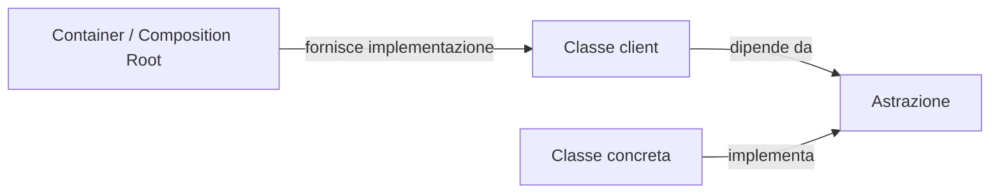
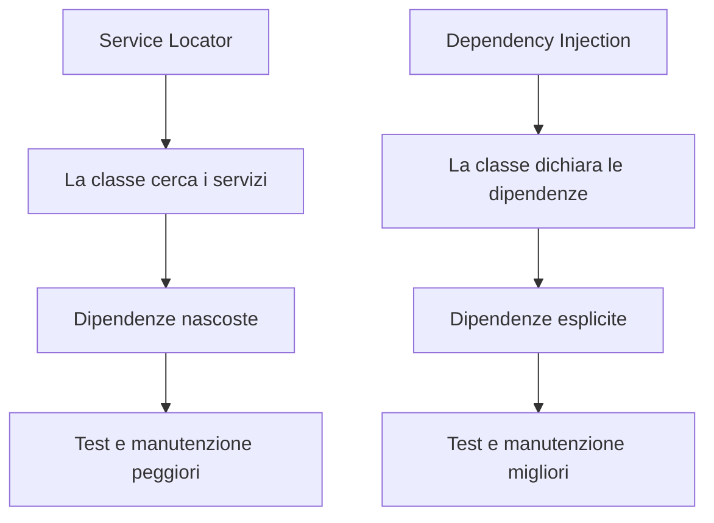
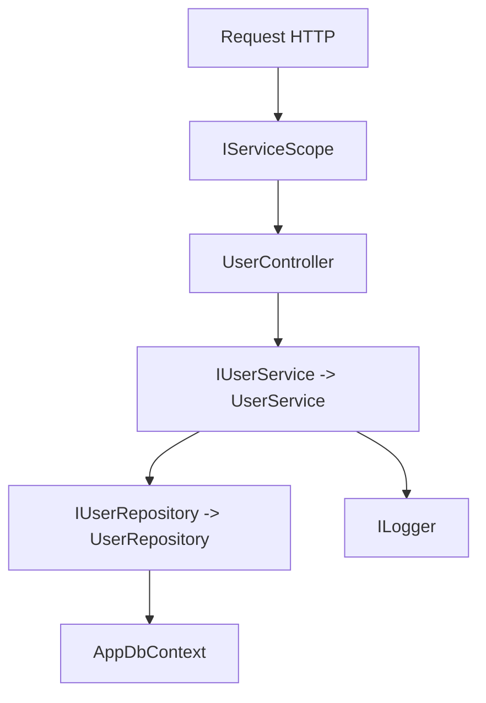
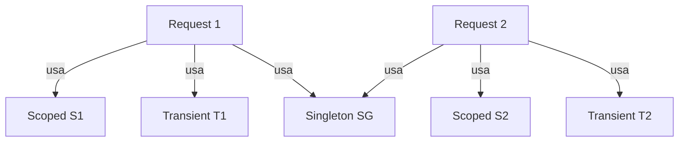
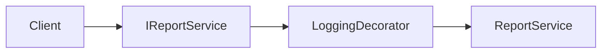
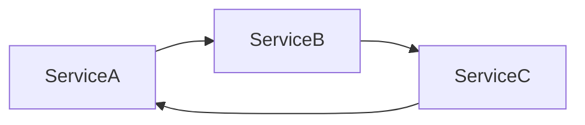

## 1. Introduzione

La **Dependency Injection (DI)** è un pattern che realizza il principio di **Inversion of Control (IoC)**: una classe non costruisce da sola ciò di cui ha bisogno, ma riceve le dipendenze dall'esterno.

In altre parole, il codice applicativo smette di dire:

- "creo io i miei collaboratori"

e inizia a dire:

- "dichiaro di cosa ho bisogno, qualcun altro me lo fornisce"

Questo "qualcun altro" può essere:

- il chiamante, in codice puro;
- un composition root;
- un **contenitore DI** come quello integrato in .NET.

Vantaggi principali:

- **Testabilità**: dipendenze sostituibili con fake, stub o mock.
- **Manutenibilità**: minore accoppiamento tra moduli.
- **Estendibilità**: nuove implementazioni senza toccare il codice client.
- **Separazione delle responsabilità**: la creazione degli oggetti è separata dal loro uso.



### 1.1 IoC in profondità

**Inversion of Control** significa che il flusso di creazione e collegamento degli oggetti non è più controllato dalle singole classi, ma da un livello superiore.

Senza IoC:

- ogni classe decide **come** creare le proprie dipendenze;
- ogni classe conosce dettagli concreti di costruzione;
- il grafo degli oggetti è sparso nel codice.

Con IoC:

- le classi dichiarano **cosa** serve loro;
- il wiring viene centralizzato;
- l'applicazione è più componibile.

Dal punto di vista architetturale:

$$
\text{Modulo ad alto livello} \rightarrow \text{Astrazione} \leftarrow \text{Modulo a basso livello}
$$

Il punto chiave è che i moduli importanti del dominio non dovrebbero dipendere da dettagli infrastrutturali.

### 1.2 Hollywood Principle

Un modo intuitivo per capire IoC è il **Hollywood Principle**:

> "Don't call us, we'll call you."

Tradotto nel contesto DI:

- una classe non va a cercare le sue dipendenze;
- è il framework/container che le fornisce quando serve.

Esempio mentale:

- il controller ASP.NET Core non crea `ILogger`, `DbContext` o servizi applicativi;
- li dichiara nel costruttore;
- il framework li inietta quando costruisce il controller.

Questa inversione del controllo rende il codice meno "imperativo" nella costruzione e più dichiarativo nelle dipendenze.

### 1.3 Relazione con il DIP di SOLID

La DI è spesso il meccanismo pratico che permette di applicare il **DIP - Dependency Inversion Principle**.

Il DIP afferma:

1. I moduli ad alto livello non devono dipendere da moduli a basso livello. Entrambi devono dipendere da astrazioni.
2. Le astrazioni non devono dipendere dai dettagli. Sono i dettagli che devono dipendere dalle astrazioni.

Esempio:

- `OrdineService` è modulo ad alto livello;
- `EmailService` è un dettaglio infrastrutturale;
- `INotificaService` è l'astrazione.

Se `OrdineService` dipende da `INotificaService`, allora il dominio resta stabile anche se cambiamo il canale di notifica.

La DI da sola non garantisce una buona architettura, ma rende molto più naturale rispettare il DIP.

## 2. Il problema senza DI

### 2.1 Accoppiamento forte

```cs
// SENZA DI: accoppiamento forte
public class OrdineService
{
    private readonly EmailService _emailService;

    public OrdineService()
    {
        // La classe crea la dipendenza -> hard-coded
        _emailService = new EmailService();
    }

    public void ConfermaOrdine(int ordineId)
    {
        // logica ordine...
        _emailService.InviaEmail("Ordine confermato");
    }
}
```

Problemi:

- `OrdineService` conosce una classe concreta.
- Il costruttore nasconde una dipendenza reale.
- Nei test non puoi sostituire facilmente `EmailService`.
- Se domani vuoi inviare SMS o push notification, devi modificare la classe.

Quando una classe usa spesso `new` per creare collaboratori, sta mescolando due responsabilità:

- logica di business;
- costruzione dell'object graph.

### 2.2 Il Service Locator è un anti-pattern

Un errore comune è pensare: "va bene, non uso `new`, allora chiedo tutto a un contenitore globale".

```cs
public class OrdineService
{
    public void ConfermaOrdine(int ordineId)
    {
        var notificaService = ServiceLocator.Current.GetRequiredService<INotificaService>();
        notificaService.Invia("Ordine confermato");
    }
}
```

Questo approccio è chiamato **Service Locator** ed è considerato un **anti-pattern**.

Perché?

1. **Nasconde le dipendenze**  
   Dal costruttore non si capisce più di cosa ha bisogno la classe.

2. **Riduce la leggibilità**  
   Le dipendenze diventano implicite e disperse nel codice.

3. **Rende i test più difficili**  
   Serve spesso configurare un contenitore globale o simulare un resolver.

4. **Viola il principio di explicit dependencies**  
   Una buona API dovrebbe dichiarare chiaramente le collaborazioni necessarie.

5. **Introduce coupling al container**  
   La classe dipende dal meccanismo di risoluzione, non solo dall'astrazione.

Con la DI corretta:

- la classe riceve ciò che serve nel costruttore;
- il container viene usato nel composition root, non dentro il dominio.



## 3. Soluzione con DI

```cs
// Interfaccia -> astrazione
public interface INotificaService
{
    void Invia(string messaggio);
}

// Implementazione concreta
public class EmailService : INotificaService
{
    public void Invia(string messaggio)
        => Console.WriteLine($"Email inviata: {messaggio}");
}

// CON DI: dipende dall'interfaccia, non dall'implementazione
public class OrdineService
{
    private readonly INotificaService _notificaService;

    // La dipendenza viene INIETTATA nel costruttore
    public OrdineService(INotificaService notificaService)
    {
        _notificaService = notificaService;
    }

    public void ConfermaOrdine(int ordineId)
    {
        // logica ordine...
        _notificaService.Invia("Ordine confermato");
    }
}
```

Qui la classe:

- non sa quale implementazione riceverà;
- non conosce il container;
- dichiara esplicitamente il proprio contratto di collaborazione.

### 3.1 Constructor Injection

È la forma più raccomandata perché:

- rende obbligatorie le dipendenze;
- favorisce oggetti immutabili;
- rende subito visibili i requisiti della classe.

```cs
public class MioServizio
{
    private readonly IRepository _repo;

    public MioServizio(IRepository repo)
    {
        _repo = repo;
    }
}
```

Se una classe ha troppi parametri nel costruttore, spesso non è un limite della DI ma un segnale architetturale: probabilmente la classe ha troppe responsabilità.

### 3.2 Property Injection

```cs
public class MioServizio
{
    public ILogger Logger { get; set; } = NullLogger.Instance;
}
```

È meno sicura perché:

- la dipendenza può mancare;
- l'oggetto può essere usato in stato incompleto;
- le dipendenze non sono evidenti quanto nel costruttore.

Va bene solo in scenari molto specifici.

### 3.3 Method Injection

```cs
public class MioServizio
{
    public void Esegui(ILogger logger)
    {
        logger.Log("Eseguito");
    }
}
```

È utile quando la dipendenza serve solo per una singola operazione, non per tutta la vita dell'oggetto.

## 4. DI in .NET: `IServiceCollection`, `IServiceProvider` e object graph

.NET include un contenitore DI nativo minimalista ma molto efficace, basato su:

- `IServiceCollection`: descrive **come registrare** i servizi;
- `IServiceProvider`: sa **come risolverli**;
- `IServiceScope`: delimita uno scope di vita per i servizi scoped.

```cs
// Program.cs
var builder = WebApplication.CreateBuilder(args);

builder.Services.AddScoped<IOrdineService, OrdineService>();
builder.Services.AddTransient<IEmailService, EmailService>();
builder.Services.AddSingleton<IConfigService, ConfigService>();

var app = builder.Build();
```

### 4.1 Come nasce il container

Il flusso tipico è:

1. Popoli `builder.Services`.
2. Alla `Build()`, il framework crea il provider radice.
3. Per ogni request HTTP viene creato uno scope figlio.
4. Quando serve un controller o un servizio, il provider costruisce il relativo object graph.

### 4.2 Come `IServiceProvider` risolve il grafo degli oggetti

Supponiamo:

- `UserController` dipende da `IUserService`;
- `UserService` dipende da `IUserRepository` e `ILogger<UserService>`;
- `UserRepository` dipende da `AppDbContext`.

Quando il framework deve creare `UserController`, il container:

1. individua il costruttore selezionato;
2. legge i parametri richiesti;
3. per ogni parametro cerca la registrazione corrispondente;
4. risolve ricorsivamente tutte le dipendenze;
5. costruisce l'intero object graph;
6. memorizza o riusa l'istanza in base al lifetime;
7. gestisce il `Dispose()` a fine scope, se necessario.



In termini concettuali:

$$
\text{Resolve}(A) = A(B, C), \quad \text{Resolve}(B) = B(D), \quad \text{Resolve}(C) = C()
$$

Il container attraversa il grafo fino alle foglie, poi costruisce gli oggetti dal basso verso l'alto.

### 4.3 Provider radice e scope

Il **provider radice** vive per tutta l'applicazione. Da esso vengono creati gli scope:

- in ASP.NET Core uno scope per request;
- in console/background service puoi crearli manualmente;
- i servizi `Scoped` non dovrebbero essere risolti direttamente dal provider radice.

```cs
using var scope = app.Services.CreateScope();
var service = scope.ServiceProvider.GetRequiredService<IMioServizio>();
```

### 4.4 Validazione del container

Il container può intercettare alcuni problemi:

- servizi mancanti;
- dipendenze circolari;
- mismatch di lifetime, ad esempio singleton che cattura uno scoped.

Questa validazione è preziosa perché sposta molti errori dalla produzione all'avvio o alla prima risoluzione.

## 5. Lifetime dei servizi

Il **lifetime** determina per quanto tempo vive un'istanza.



### 5.1 Transient

Nuova istanza **ogni volta** che il servizio viene richiesto.

```cs
builder.Services.AddTransient<IMioServizio, MioServizio>();
```

Usalo per:

- servizi leggeri;
- componenti stateless;
- oggetti che non devono condividere stato.

Rischio:

- troppe allocazioni se la costruzione è costosa.

### 5.2 Scoped

Una sola istanza **per scope**. In ASP.NET Core di solito significa una richiesta HTTP.

```cs
builder.Services.AddScoped<IMioServizio, MioServizio>();
```

È ideale per:

- `DbContext`;
- unit of work;
- servizi che devono condividere contesto nella stessa richiesta.

### 5.3 Singleton

Una sola istanza **per tutta la vita dell'applicazione**.

```cs
builder.Services.AddSingleton<IMioServizio, MioServizio>();
```

È adatto a:

- cache;
- configurazione;
- servizi costosi da creare e thread-safe.

Un singleton deve essere progettato con attenzione:

- può essere usato da thread diversi;
- non deve dipendere da servizi con lifetime più breve.

### 5.4 Tabella riepilogativa

| Lifetime | Istanze create | Durata | Uso tipico |
|---|---|---|---|
| Transient | Ogni richiesta al container | Brevissima | Mapper, strategy stateless |
| Scoped | Una per scope | Durata request/scope | `DbContext`, servizi applicativi request-bound |
| Singleton | Una sola | Vita dell'app | Cache, provider condivisi |

### 5.5 Captive Dependency

Un errore classico: un singleton che trattiene uno scoped.

```cs
public class MioSingleton
{
    private readonly IMioScoped _scoped;

    public MioSingleton(IMioScoped scoped)
    {
        _scoped = scoped;
    }
}

// builder.Services.AddSingleton<MioSingleton>();
// builder.Services.AddScoped<IMioScoped, MioScoped>();
```

Perché è sbagliato?

- lo scoped nasce per vivere poco;
- il singleton lo conserva troppo a lungo;
- si rompe il modello di lifetime.

In sviluppo, .NET può lanciare `InvalidOperationException` quando rileva questo pattern.

## 6. Registrazioni avanzate nel container

### 6.1 Factory registration

Non sempre un servizio si costruisce bene con il semplice mapping interfaccia-implementazione. In questi casi puoi registrarlo con una factory:

```cs
builder.Services.AddTransient<ReportService>(sp =>
{
    var logger = sp.GetRequiredService<ILogger<ReportService>>();
    var clock = sp.GetRequiredService<ISystemClock>();
    var culture = CultureInfo.GetCultureInfo("it-IT");

    return new ReportService(logger, clock, culture);
});
```

Questa tecnica è utile quando:

- servono parametri calcolati;
- vuoi combinare servizi risolti dal container con valori manuali;
- l'inizializzazione è più complessa del normale.

Va usata con disciplina: se la factory diventa molto lunga, probabilmente la composizione andrebbe spostata in una classe dedicata.

### 6.2 Open generics

Il container .NET supporta la registrazione di **generici aperti**.

```cs
builder.Services.AddScoped(typeof(IRepository<>), typeof(Repository<>));
```

Questo significa che:

- quando chiedi `IRepository<User>`, il container crea `Repository<User>`;
- quando chiedi `IRepository<Order>`, crea `Repository<Order>`.

È molto utile per repository, validator, handler, mapper e pipeline generiche.

```cs
public interface IRepository<T>
{
    T? GetById(int id);
}

public class Repository<T> : IRepository<T>
{
    public T? GetById(int id) => default;
}
```

### 6.3 Keyed services in .NET 8

Con .NET 8 puoi registrare più implementazioni della stessa interfaccia usando una **chiave**.

```cs
builder.Services.AddKeyedScoped<IPagamentoService, CartaPagamentoService>("carta");
builder.Services.AddKeyedScoped<IPagamentoService, PaypalPagamentoService>("paypal");
builder.Services.AddKeyedScoped<IPagamentoService, BonificoPagamentoService>("bonifico");
```

Risoluzione in un controller:

```cs
[ApiController]
[Route("api/pagamenti")]
public class PagamentiController : ControllerBase
{
    [HttpPost("carta")]
    public IActionResult PagaConCarta(
        [FromKeyedServices("carta")] IPagamentoService pagamentoService)
    {
        pagamentoService.Paga(100m);
        return Ok();
    }
}
```

Oppure manualmente:

```cs
var pagamento = serviceProvider.GetRequiredKeyedService<IPagamentoService>("paypal");
```

Quando usarli:

- più strategie della stessa interfaccia;
- scelta dell'implementazione in base a contesto funzionale;
- sostituzione di `switch` o `if` annidati su tipi concreti.

Attenzione: i keyed services non devono diventare un pretesto per reintrodurre logica di selezione caotica nel dominio.

### 6.4 Options Pattern: `IOptions<T>`, `IOptionsMonitor<T>`, `IOptionsSnapshot<T>`

In .NET la configurazione si integra con la DI tramite l'**Options Pattern**.

Classe di configurazione:

```cs
public class MailOptions
{
    public string Host { get; set; } = "";
    public int Port { get; set; }
    public string Sender { get; set; } = "";
}
```

Registrazione:

```cs
builder.Services.Configure<MailOptions>(
    builder.Configuration.GetSection("Mail"));
```

Uso con `IOptions<T>`:

```cs
public class MailService
{
    private readonly MailOptions _options;

    public MailService(IOptions<MailOptions> options)
    {
        _options = options.Value;
    }
}
```

Differenze fondamentali:

| Tipo | Lifetime tipico | Aggiornamenti config | Scenario |
|---|---|---|---|
| `IOptions<T>` | Singleton-like wrapper | No refresh per richiesta | Config quasi statica |
| `IOptionsSnapshot<T>` | Scoped | Valori ricalcolati per scope/request | Web app con config riletta a ogni request |
| `IOptionsMonitor<T>` | Singleton | Supporta change notification e accesso al valore corrente | Background service, singleton, hot reload config |

#### `IOptions<T>`

- semplice;
- economico;
- ottimo per configurazioni stabili.

#### `IOptionsSnapshot<T>`

- disponibile in contesti scoped;
- in ASP.NET Core fornisce un "snapshot" per request;
- utile quando la configurazione può cambiare e vuoi leggere la versione corrente a ogni richiesta.

#### `IOptionsMonitor<T>`

- usabile anche nei singleton;
- espone `CurrentValue`;
- permette `OnChange(...)`.

```cs
public class CacheWarmupService
{
    private readonly IOptionsMonitor<MailOptions> _optionsMonitor;

    public CacheWarmupService(IOptionsMonitor<MailOptions> optionsMonitor)
    {
        _optionsMonitor = optionsMonitor;
    }

    public void StampaHostCorrente()
    {
        Console.WriteLine(_optionsMonitor.CurrentValue.Host);
    }
}
```

È buona pratica affiancare anche:

- validazione con `Validate(...)`;
- `ValidateOnStart()` per fallire subito se la configurazione è errata.

### 6.5 Decorator pattern con DI

Il **Decorator** permette di avvolgere un servizio con un altro che implementa la stessa interfaccia, aggiungendo comportamento senza modificare il servizio originale.

```cs
public interface IReportService
{
    Task GeneraAsync();
}

public class ReportService : IReportService
{
    public Task GeneraAsync() => Task.CompletedTask;
}

public class LoggingReportDecorator : IReportService
{
    private readonly IReportService _inner;
    private readonly ILogger<LoggingReportDecorator> _logger;

    public LoggingReportDecorator(
        IReportService inner,
        ILogger<LoggingReportDecorator> logger)
    {
        _inner = inner;
        _logger = logger;
    }

    public async Task GeneraAsync()
    {
        _logger.LogInformation("Inizio generazione report");
        await _inner.GeneraAsync();
        _logger.LogInformation("Fine generazione report");
    }
}
```

Concettualmente:



Con il container built-in, il decorator puro non è comodo quanto in container più avanzati. Per questo spesso si usa **Scrutor**, che aggiunge assembly scanning e decorator registration:

```cs
builder.Services.AddScoped<IReportService, ReportService>();
builder.Services.Decorate<IReportService, LoggingReportDecorator>();
```

### 6.6 Scrutor e assembly scanning

La libreria **Scrutor** estende `Microsoft.Extensions.DependencyInjection` e consente:

- assembly scanning;
- registrazioni convenzionali;
- decorator registration.

Esempio:

```cs
builder.Services.Scan(scan => scan
    .FromAssemblyOf<IUserService>()
    .AddClasses(classes => classes.InNamespaces("MyApp.Services"))
    .AsImplementedInterfaces()
    .WithScopedLifetime());
```

È utile in progetti grandi, ma va usata con moderazione: le registrazioni troppo implicite possono rendere meno chiaro il composition root.

## 7. Errori comuni, dipendenze circolari e test

### 7.1 Circular dependencies

Una dipendenza circolare avviene quando:

- `A` dipende da `B`;
- `B` dipende da `C`;
- `C` dipende da `A`.



Esempio:

```cs
public class ServiceA
{
    public ServiceA(ServiceB b) { }
}

public class ServiceB
{
    public ServiceB(ServiceA a) { }
}
```

Il container in genere le rileva durante la risoluzione e lancia un'eccezione.

Come evitarle:

1. **Rivedi il design**: spesso indica responsabilità intrecciate.
2. **Estrai un servizio terzo**: logica condivisa in una nuova astrazione.
3. **Usa eventi, callback o mediator** quando la comunicazione è bidirezionale.
4. **Riduci il coupling** tra servizi applicativi.

La soluzione corretta quasi mai è "forzare" il container: di solito bisogna migliorare il design.

### 7.2 Unit testing con DI

La DI rende i test molto più facili perché puoi sostituire le implementazioni reali con finte implementazioni o mock.

Esempio con fake:

```cs
public class FakeNotificaService : INotificaService
{
    public string? UltimoMessaggio { get; private set; }

    public void Invia(string messaggio)
    {
        UltimoMessaggio = messaggio;
    }
}
```

Test con `Microsoft.Extensions.DependencyInjection`:

```cs
var services = new ServiceCollection();

services.AddScoped<INotificaService, FakeNotificaService>();
services.AddScoped<OrdineService>();

using var provider = services.BuildServiceProvider();
using var scope = provider.CreateScope();

var ordineService = scope.ServiceProvider.GetRequiredService<OrdineService>();
var fake = (FakeNotificaService)scope.ServiceProvider.GetRequiredService<INotificaService>();

ordineService.ConfermaOrdine(10);

Assert.Equal("Ordine confermato", fake.UltimoMessaggio);
```

Con un framework di mocking puoi registrare direttamente un mock dell'interfaccia:

```cs
services.AddSingleton<INotificaService>(mock.Object);
```

Buone pratiche nei test:

- testa il comportamento, non l'implementazione interna;
- usa interfacce ai confini esterni;
- mantieni piccolo il composition root del test;
- evita di usare il provider come service locator dentro il codice di produzione.

### 7.3 DI nei test di integrazione

Nei test di integrazione puoi costruire un container quasi reale e sostituire solo alcune dipendenze:

- database reale con database in-memory;
- servizi esterni con fake server o stub;
- clock reale con `ISystemClock` finto.

Questo approccio consente di verificare non solo la logica, ma anche il wiring dell'applicazione.

### 7.4 Confronto tra container DI

#### `Microsoft.Extensions.DependencyInjection`

Punti forti:

- integrato nativamente in ASP.NET Core;
- semplice e standard;
- ottima scelta per la maggior parte dei progetti.

Limiti:

- meno funzionalità avanzate out-of-the-box;
- decorator e convention scanning richiedono spesso librerie esterne come Scrutor;
- meno espressivo di container più sofisticati.

#### Autofac

Punti forti:

- molto ricco di funzionalità;
- ottimo supporto per moduli, named/keyed services, decorator, assembly scanning;
- molto flessibile per scenari complessi.

Contro:

- aggiunge dipendenza esterna;
- può introdurre configurazioni più complesse del necessario.

#### Simple Injector

Punti forti:

- molto rigoroso sulla correttezza delle configurazioni;
- forte focus su diagnosi, validazione e best practice;
- eccellente per applicazioni che vogliono massima disciplina architetturale.

Contro:

- integrazione meno "naturale" del container built-in in alcuni scenari ASP.NET Core moderni;
- filosofia più rigida, che richiede comprensione architetturale.

#### Regola pratica

- Se vuoi semplicità e integrazione con il framework: **container built-in**.
- Se ti servono molte feature avanzate di composizione: **Autofac**.
- Se vuoi massima verifica e disciplina architetturale: **Simple Injector**.

## 8. Esempio completo

```cs
// Interfacce
public interface IUserRepository
{
    User? GetById(int id);
}

public interface IUserService
{
    string GetNomeUtente(int id);
}

public interface IAuditService
{
    void Traccia(string messaggio);
}

// Implementazioni
public class UserRepository : IUserRepository
{
    public User? GetById(int id)
    {
        // simulazione DB
        return new User { Id = id, Nome = "Mario" };
    }
}

public class ConsoleAuditService : IAuditService
{
    public void Traccia(string messaggio)
    {
        Console.WriteLine($"AUDIT: {messaggio}");
    }
}

public class UserService : IUserService
{
    private readonly IUserRepository _userRepo;
    private readonly IAuditService _auditService;

    public UserService(IUserRepository userRepo, IAuditService auditService)
    {
        _userRepo = userRepo;
        _auditService = auditService;
    }

    public string GetNomeUtente(int id)
    {
        _auditService.Traccia($"Richiesto utente {id}");
        var user = _userRepo.GetById(id);
        return user?.Nome ?? "Sconosciuto";
    }
}

public class User
{
    public int Id { get; set; }
    public string Nome { get; set; } = "";
}

// Program.cs
var builder = WebApplication.CreateBuilder(args);

builder.Services.AddScoped<IUserRepository, UserRepository>();
builder.Services.AddScoped<IUserService, UserService>();
builder.Services.AddSingleton<IAuditService, ConsoleAuditService>();
builder.Services.AddControllers();

var app = builder.Build();

app.MapControllers();
app.Run();

// Controller
[ApiController]
[Route("api/users")]
public class UserController : ControllerBase
{
    private readonly IUserService _userService;

    public UserController(IUserService userService)
    {
        _userService = userService;
    }

    [HttpGet("{id}")]
    public IActionResult Get(int id)
    {
        var nome = _userService.GetNomeUtente(id);
        return Ok(nome);
    }
}
```

In questo esempio:

- il controller dipende da `IUserService`;
- `UserService` dipende da due astrazioni;
- il repository è sostituibile;
- l'audit è separato dalla logica di business;
- tutto il wiring è centralizzato in `Program.cs`.

## 9. Quiz

import Quiz from '../../../components/Quiz.jsx';

<Quiz client:load questions={[
{
question:"Cosa significa Dependency Injection?",
answers:{
a:"Creare le dipendenze all'interno della classe",
b:"Iniettare le dipendenze dall'esterno invece di crearle internamente",
c:"Ereditare da una classe base",
d:"Usare metodi statici"
},
correctAnswer:"b"
},
{
question:"Quale tipo di iniezione è generalmente raccomandato?",
answers:{
a:"Property Injection",
b:"Method Injection",
c:"Constructor Injection",
d:"Field Injection"
},
correctAnswer:"c"
},
{
question:"Un servizio Transient viene creato:",
answers:{
a:"Una volta sola per tutta l'applicazione",
b:"Una volta per richiesta HTTP",
c:"Ogni volta che viene richiesto al container",
d:"Solo all'avvio dell'app"
},
correctAnswer:"c"
},
{
question:"Un servizio Scoped in ASP.NET Core vive:",
answers:{
a:"Per tutta la vita dell'applicazione",
b:"Per la durata di una singola richiesta HTTP",
c:"Solo per la chiamata al metodo",
d:"Fino alla prima garbage collection"
},
correctAnswer:"b"
},
{
question:"AddSingleton registra un servizio che:",
answers:{
a:"Viene ricreato ad ogni richiesta",
b:"Ha una sola istanza per tutta la vita dell'app",
c:"Viene registrato senza interfaccia",
d:"È accessibile solo in lettura"
},
correctAnswer:"b"
},
{
question:"Cosa si intende per 'captive dependency'?",
answers:{
a:"Un servizio che non può essere risolto",
b:"Un Singleton che dipende da un Scoped (il Scoped viene catturato e vive troppo a lungo)",
c:"Un servizio registrato due volte",
d:"Una dipendenza circolare"
},
correctAnswer:"b"
},
{
question:"Dipendere da un'interfaccia piuttosto che da una classe concreta segue quale principio SOLID?",
answers:{
a:"Single Responsibility",
b:"Liskov Substitution",
c:"Dependency Inversion",
d:"Open/Closed"
},
correctAnswer:"c"
},
{
question:"In .NET, dove si registrano tipicamente i servizi?",
answers:{
a:"Nel costruttore del controller",
b:"In appsettings.json",
c:"In Program.cs (o Startup.cs) tramite IServiceCollection",
d:"Nel file di migrazione"
},
correctAnswer:"c"
},
{
question:"Quale lifetime è più adatto per un DbContext in ASP.NET Core?",
answers:{
a:"Singleton",
b:"Transient",
c:"Scoped",
d:"Static"
},
correctAnswer:"c"
},
{
question:"Qual è il principale vantaggio della DI per i test?",
answers:{
a:"I test girano più velocemente",
b:"Si possono sostituire le dipendenze reali con mock",
c:"Non servono più interfacce",
d:"I test non richiedono un framework"
},
correctAnswer:"b"
}
]} />

## 10. Esercizi

### 10.1 Servizio di notifica pluggabile

**Scenario**: Vuoi un sistema di notifiche che supporti Email, SMS e Push.

**Consegna**:
1. Crea l'interfaccia `INotificaService` con metodo `Invia(string messaggio)`.
2. Implementa tre classi: `EmailNotifica`, `SmsNotifica`, `PushNotifica`.
3. Crea una classe `NotificaManager` che accetta `INotificaService` via constructor injection.
4. Registra i servizi con `IServiceCollection` e risolvi `NotificaManager` tramite il container.

*Obiettivo: capire il pattern DI e come scambiare le implementazioni senza modificare il codice client.*

### 10.2 Repository pattern con DI

**Scenario**: Vuoi separare la logica di accesso ai dati dalla logica di business.

**Consegna**:
1. Crea `IProductRepository` con metodi `GetAll()` e `GetById(int id)`.
2. Implementa `InMemoryProductRepository` che usa una lista in memoria.
3. Crea `ProductService` che usa `IProductRepository` via constructor injection.
4. Registra tutto in `IServiceCollection` e testa la risoluzione.

*Obiettivo: praticare il Repository Pattern combinato con DI.*

### 10.3 Lifetime a confronto

**Scenario**: Vuoi verificare visivamente la differenza tra i lifetime.

**Consegna**:
1. Crea tre classi: `TransientService`, `ScopedService`, `SingletonService`, ognuna con un `Guid` generato nel costruttore.
2. Registra ognuna con il lifetime corrispondente.
3. Risolvi ogni servizio due volte dallo stesso scope e poi da scope diversi.
4. Stampa i Guid e osserva quali cambiano.

*Obiettivo: capire concretamente la differenza tra Transient, Scoped e Singleton.*
