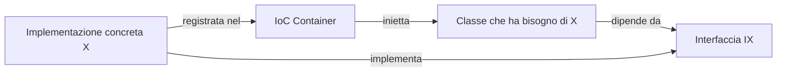
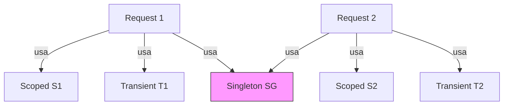

## 1. Introduzione

La **Dependency Injection (DI)** è un pattern di design che implementa il principio **Inversion of Control (IoC)**: invece di creare le dipendenze all'interno di una classe, queste vengono **fornite dall'esterno**.

Vantaggi principali:
- **Testabilità**: si possono sostituire le dipendenze reali con mock nei test.
- **Manutenibilità**: le classi dipendono da astrazioni, non da implementazioni concrete.
- **Flessibilità**: cambiare implementazione senza modificare il codice che la usa.



## 2. Il problema senza DI

```cs
// ❌ SENZA DI: accoppiamento forte
public class OrdineService
{
    private readonly EmailService _emailService;

    public OrdineService()
    {
        // La classe crea la dipendenza → hard-coded
        _emailService = new EmailService();
    }

    public void ConfermaOrdine(int ordineId)
    {
        // logica ordine...
        _emailService.InviaEmail("Ordine confermato");
    }
}
```

Problemi:
- Non si può testare `OrdineService` senza usare anche `EmailService`.
- Sostituire `EmailService` con `SmsService` richiede modifica del codice.

## 3. Soluzione con DI

```cs
// Interfaccia → astrazione
public interface INotificaService
{
    void Invia(string messaggio);
}

// Implementazione concreta
public class EmailService : INotificaService
{
    public void Invia(string messaggio)
        => Console.WriteLine($"Email inviata: {messaggio}");
}

// ✅ CON DI: dipende dall'interfaccia, non dall'implementazione
public class OrdineService
{
    private readonly INotificaService _notificaService;

    // La dipendenza viene INIETTATA nel costruttore
    public OrdineService(INotificaService notificaService)
    {
        _notificaService = notificaService;
    }

    public void ConfermaOrdine(int ordineId)
    {
        // logica ordine...
        _notificaService.Invia("Ordine confermato");
    }
}
```

## 4. Tipi di iniezione

### 4.1 Constructor Injection (raccomandato)

```cs
public class MioServizio
{
    private readonly IRepository _repo;

    public MioServizio(IRepository repo) // ← iniettato nel costruttore
    {
        _repo = repo;
    }
}
```

### 4.2 Property Injection

```cs
public class MioServizio
{
    public ILogger Logger { get; set; } // ← iniettato come proprietà
}
```

### 4.3 Method Injection

```cs
public class MioServizio
{
    public void Esegui(ILogger logger) // ← iniettato nel metodo
    {
        logger.Log("Eseguito");
    }
}
```

## 5. DI in .NET — IServiceCollection

.NET include un IoC container nativo. La registrazione avviene in `Program.cs` (o `Startup.cs`).

```cs
// Program.cs
var builder = WebApplication.CreateBuilder(args);

// Registrazione dei servizi
builder.Services.AddScoped<IOrdineService, OrdineService>();
builder.Services.AddTransient<IEmailService, EmailService>();
builder.Services.AddSingleton<IConfigService, ConfigService>();

var app = builder.Build();
```

## 6. Lifetime dei servizi

Il **lifetime** determina per quanto tempo vive un'istanza del servizio.



### 6.1 Transient

Nuova istanza **ogni volta** che il servizio viene richiesto.

```cs
builder.Services.AddTransient<IMioServizio, MioServizio>();
```

- ✅ Servizi leggeri e stateless.
- ❌ Costoso se il servizio ha setup complesso.

### 6.2 Scoped

Una sola istanza **per richiesta HTTP** (o per scope definito).

```cs
builder.Services.AddScoped<IMioServizio, MioServizio>();
```

- ✅ Servizi che devono condividere stato nella stessa richiesta (es. DbContext).
- ❌ Non usare fuori da uno scope (es. singleton che dipende da scoped).

### 6.3 Singleton

Una sola istanza **per tutta la vita dell'applicazione**.

```cs
builder.Services.AddSingleton<IMioServizio, MioServizio>();
```

- ✅ Servizi costosi da creare e thread-safe (es. cache, configurazione).
- ❌ Non può dipendere da Transient o Scoped (captive dependency).

### Tabella riepilogativa

| Lifetime | Istanze create | Durata |
|---|---|---|
| Transient | Ogni richiesta al container | Brevissima |
| Scoped | Una per scope (HTTP request) | Durata request |
| Singleton | Una sola | Vita dell'app |

## 7. Captive Dependency

Un errore comune: un **Singleton** che dipende da un **Scoped** crea una *captive dependency* — il Scoped viene "catturato" dal Singleton e vive più a lungo del previsto.

```cs
// ❌ PROBLEMA: Singleton cattura uno Scoped
public class MioSingleton
{
    private readonly IMioScoped _scoped; // ← questo scoped vivrà per sempre!

    public MioSingleton(IMioScoped scoped)
    {
        _scoped = scoped;
    }
}

// builder.Services.AddSingleton<MioSingleton>();
// builder.Services.AddScoped<IMioScoped, MioScoped>();
```

.NET lancia `InvalidOperationException` in development se rileva questo pattern.

## 8. Esempio completo

```cs
// Interfacce
public interface IUserRepository
{
    User? GetById(int id);
}

public interface IUserService
{
    string GetNomeUtente(int id);
}

// Implementazioni
public class UserRepository : IUserRepository
{
    public User? GetById(int id)
    {
        // simulazione DB
        return new User { Id = id, Nome = "Mario" };
    }
}

public class UserService : IUserService
{
    private readonly IUserRepository _userRepo;

    public UserService(IUserRepository userRepo)
    {
        _userRepo = userRepo;
    }

    public string GetNomeUtente(int id)
    {
        var user = _userRepo.GetById(id);
        return user?.Nome ?? "Sconosciuto";
    }
}

// Program.cs
var builder = WebApplication.CreateBuilder(args);
builder.Services.AddScoped<IUserRepository, UserRepository>();
builder.Services.AddScoped<IUserService, UserService>();
builder.Services.AddControllers();

var app = builder.Build();
app.MapControllers();
app.Run();

// Controller
[ApiController]
[Route("api/users")]
public class UserController : ControllerBase
{
    private readonly IUserService _userService;

    public UserController(IUserService userService) // ← iniettato automaticamente
    {
        _userService = userService;
    }

    [HttpGet("{id}")]
    public IActionResult Get(int id)
    {
        var nome = _userService.GetNomeUtente(id);
        return Ok(nome);
    }
}
```

## 9. Quiz

import Quiz from '../../../components/Quiz.jsx';

<Quiz client:load questions={[
{
question:"Cosa significa Dependency Injection?",
answers:{
a:"Creare le dipendenze all'interno della classe",
b:"Iniettare le dipendenze dall'esterno invece di crearle internamente",
c:"Ereditare da una classe base",
d:"Usare metodi statici"
},
correctAnswer:"b"
},
{
question:"Quale tipo di iniezione è generalmente raccomandato?",
answers:{
a:"Property Injection",
b:"Method Injection",
c:"Constructor Injection",
d:"Field Injection"
},
correctAnswer:"c"
},
{
question:"Un servizio Transient viene creato:",
answers:{
a:"Una volta sola per tutta l'applicazione",
b:"Una volta per richiesta HTTP",
c:"Ogni volta che viene richiesto al container",
d:"Solo all'avvio dell'app"
},
correctAnswer:"c"
},
{
question:"Un servizio Scoped in ASP.NET Core vive:",
answers:{
a:"Per tutta la vita dell'applicazione",
b:"Per la durata di una singola richiesta HTTP",
c:"Solo per la chiamata al metodo",
d:"Fino alla prima garbage collection"
},
correctAnswer:"b"
},
{
question:"AddSingleton registra un servizio che:",
answers:{
a:"Viene ricreato ad ogni richiesta",
b:"Ha una sola istanza per tutta la vita dell'app",
c:"Viene registrato senza interfaccia",
d:"È accessibile solo in lettura"
},
correctAnswer:"b"
},
{
question:"Cosa si intende per 'captive dependency'?",
answers:{
a:"Un servizio che non può essere risolto",
b:"Un Singleton che dipende da un Scoped (il Scoped viene catturato e vive troppo a lungo)",
c:"Un servizio registrato due volte",
d:"Una dipendenza circolare"
},
correctAnswer:"b"
},
{
question:"Dipendere da un'interfaccia piuttosto che da una classe concreta segue quale principio SOLID?",
answers:{
a:"Single Responsibility",
b:"Liskov Substitution",
c:"Dependency Inversion",
d:"Open/Closed"
},
correctAnswer:"c"
},
{
question:"In .NET, dove si registrano tipicamente i servizi?",
answers:{
a:"Nel costruttore del controller",
b:"In appsettings.json",
c:"In Program.cs (o Startup.cs) tramite IServiceCollection",
d:"Nel file di migrazione"
},
correctAnswer:"c"
},
{
question:"Quale lifetime è più adatto per un DbContext in ASP.NET Core?",
answers:{
a:"Singleton",
b:"Transient",
c:"Scoped",
d:"Static"
},
correctAnswer:"c"
},
{
question:"Qual è il principale vantaggio della DI per i test?",
answers:{
a:"I test girano più velocemente",
b:"Si possono sostituire le dipendenze reali con mock",
c:"Non servono più interfacce",
d:"I test non richiedono un framework"
},
correctAnswer:"b"
}
]} />

## 10. Esercizi

### 10.1 Servizio di notifica pluggabile

**Scenario**: Vuoi un sistema di notifiche che supporti Email, SMS e Push.

**Consegna**:
1. Crea l'interfaccia `INotificaService` con metodo `Invia(string messaggio)`.
2. Implementa tre classi: `EmailNotifica`, `SmsNotifica`, `PushNotifica`.
3. Crea una classe `NotificaManager` che accetta `INotificaService` via constructor injection.
4. Registra i servizi con `IServiceCollection` e risolvi `NotificaManager` tramite il container.

*Obiettivo: capire il pattern DI e come scambiare le implementazioni senza modificare il codice client.*

### 10.2 Repository pattern con DI

**Scenario**: Vuoi separare la logica di accesso ai dati dalla logica di business.

**Consegna**:
1. Crea `IProductRepository` con metodi `GetAll()` e `GetById(int id)`.
2. Implementa `InMemoryProductRepository` che usa una lista in memoria.
3. Crea `ProductService` che usa `IProductRepository` via constructor injection.
4. Registra tutto in `IServiceCollection` e testa la risoluzione.

*Obiettivo: praticare il Repository Pattern combinato con DI.*

### 10.3 Lifetime a confronto

**Scenario**: Vuoi verificare visivamente la differenza tra i lifetime.

**Consegna**:
1. Crea tre classi: `TransientService`, `ScopedService`, `SingletonService`, ognuna con un `Guid` generato nel costruttore.
2. Registra ognuna con il lifetime corrispondente.
3. Risolvi ogni servizio due volte dallo stesso scope e poi da scope diversi.
4. Stampa i Guid e osserva quali cambiano.

*Obiettivo: capire concretamente la differenza tra Transient, Scoped e Singleton.*
