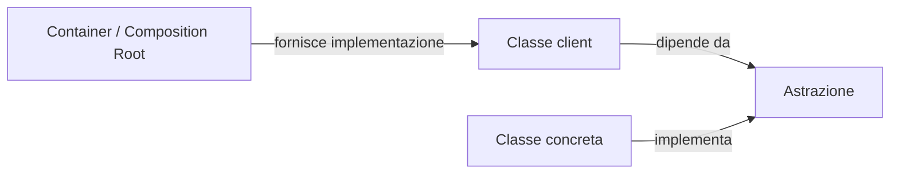
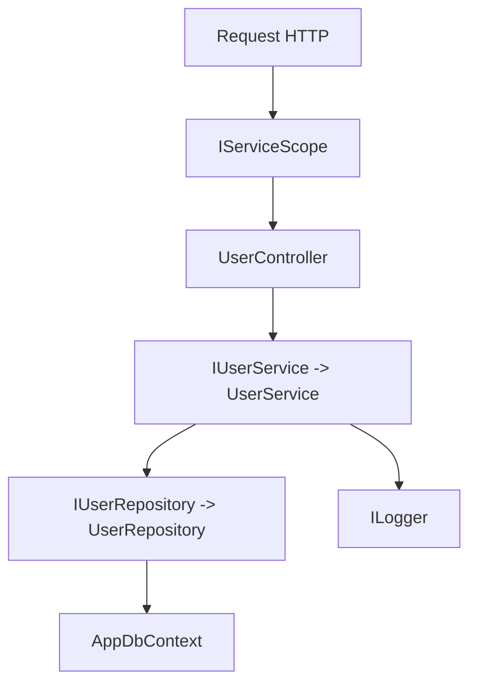
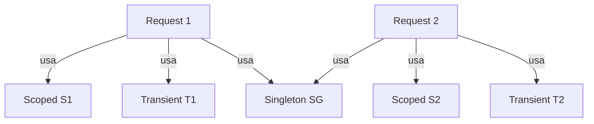

## 1. Introduzione

La **Dependency Injection (DI)** è un pattern che realizza il principio di **Inversion of Control (IoC)**: una classe non costruisce da sola ciò di cui ha bisogno, ma **riceve le dipendenze dall'esterno**. Il codice smette di dire "creo io i miei collaboratori" e inizia a dire "dichiaro di cosa ho bisogno, qualcun altro me lo fornisce".

Quel "qualcun altro" può essere il chiamante, un **composition root** (il punto unico in cui l'applicazione collega gli oggetti) oppure un **contenitore DI** come quello integrato in .NET.

Vantaggi principali:

- **Testabilità**: le dipendenze si sostituiscono con fake o mock.
- **Manutenibilità ed estendibilità**: meno accoppiamento, nuove implementazioni senza toccare il codice client.
- **Separazione delle responsabilità**: la creazione degli oggetti è separata dal loro uso.


```mermaid
graph LR
    A[Classe client] -->|dipende da| B[Astrazione]
    C[Container / Composition Root] -->|fornisce implementazione| A
    D[Classe concreta] -->|implementa| B
```

<Aside variant="info">
IoC è spesso riassunto con l'**Hollywood Principle**: "Don't call us, we'll call you". Un controller ASP.NET Core non crea `ILogger` o `DbContext`: li dichiara nel costruttore e il framework glieli fornisce.
</Aside>

### 1.1 Relazione con il DIP di SOLID

La DI è il meccanismo pratico con cui si applica il **DIP - Dependency Inversion Principle**:

1. I moduli ad alto livello non devono dipendere da moduli a basso livello: entrambi dipendono da astrazioni.
2. Le astrazioni non dipendono dai dettagli: sono i dettagli a dipendere dalle astrazioni.

Esempio: `OrdineService` (alto livello, dominio) non deve dipendere da `EmailService` (dettaglio infrastrutturale), ma da `INotificaService` (astrazione). Così il dominio resta stabile anche se cambia il canale di notifica.

## 2. Il problema senza DI

```cs
// SENZA DI: accoppiamento forte
public class OrdineService
{
    private readonly EmailService _emailService;

    public OrdineService()
    {
        _emailService = new EmailService(); // dipendenza hard-coded
    }

    public void ConfermaOrdine(int ordineId)
    {
        // logica ordine...
        _emailService.InviaEmail("Ordine confermato");
    }
}
```

Problemi:

- `OrdineService` conosce una classe concreta e il costruttore **nasconde** una dipendenza reale.
- Nei test non puoi sostituire `EmailService` (ogni test manderebbe una "vera" email).
- Per passare a SMS o push notification devi modificare la classe.

In sostanza la classe mescola due responsabilità: logica di business e costruzione dell'object graph.

### 2.1 Il Service Locator è un anti-pattern

Un errore comune è sostituire `new` con una richiesta a un contenitore globale:

```cs
public class OrdineService
{
    public void ConfermaOrdine(int ordineId)
    {
        var notifica = ServiceLocator.Current.GetRequiredService<INotificaService>();
        notifica.Invia("Ordine confermato");
    }
}
```

Questo è il **Service Locator**: le dipendenze diventano implicite (dal costruttore non si capisce di cosa ha bisogno la classe), i test richiedono di configurare un resolver globale e la classe resta accoppiata al meccanismo di risoluzione.

<Aside variant="warning">
Iniettare `IServiceProvider` in una classe di dominio e chiamare `GetRequiredService` dentro i metodi è un Service Locator travestito. Il container va usato nel composition root (es. `Program.cs`), non dentro la logica applicativa.
</Aside>

## 3. Soluzione con DI

```cs
public interface INotificaService
{
    void Invia(string messaggio);
}

public class EmailService : INotificaService
{
    public void Invia(string messaggio)
        => Console.WriteLine($"Email inviata: {messaggio}");
}

public class OrdineService
{
    private readonly INotificaService _notificaService;

    // La dipendenza viene INIETTATA nel costruttore
    public OrdineService(INotificaService notificaService)
    {
        _notificaService = notificaService;
    }

    public void ConfermaOrdine(int ordineId)
        => _notificaService.Invia($"Ordine {ordineId} confermato");
}
```

Ora la classe non sa quale implementazione riceverà, non conosce il container e dichiara esplicitamente le sue collaborazioni. La DI **non richiede un container**: si può fare "a mano" (Pure DI) nel composition root.

```cs
// Composition root manuale: scegli l'implementazione in un solo punto
INotificaService notifica = args.Contains("--sms")
    ? new SmsService()
    : new EmailService();

var ordini = new OrdineService(notifica);
ordini.ConfermaOrdine(42);
// Output: Email inviata: Ordine 42 confermato
```

### 3.1 Forme di iniezione

| Forma | Come | Quando |
|---|---|---|
| **Constructor Injection** | parametri del costruttore | caso standard: dipendenze obbligatorie, campi `readonly`, requisiti visibili |
| **Property Injection** | proprietà pubblica con setter | dipendenze opzionali con un default sensato |
| **Method Injection** | parametro del metodo | dipendenza necessaria a una sola operazione |

```cs
public class MioServizio
{
    // Property injection: default sicuro se nessuno la imposta
    public ILogger Logger { get; set; } = NullLogger.Instance;

    // Method injection: serve solo per questa chiamata
    public void Esporta(IFormatter formatter) { /* ... */ }
}
```

<Aside variant="tip">
Preferisci sempre la constructor injection. Se un costruttore arriva a 6-7 parametri non è un limite della DI ma un segnale architetturale: la classe ha probabilmente troppe responsabilità e va divisa.
</Aside>

## 4. Il container DI di .NET

.NET include un contenitore DI nativo basato su tre tipi:

- `IServiceCollection`: **registra** i servizi (cosa implementa cosa, con quale lifetime);
- `IServiceProvider`: **risolve** i servizi costruendo l'object graph;
- `IServiceScope`: delimita la vita dei servizi scoped.

```cs
// Program.cs
var builder = WebApplication.CreateBuilder(args);

builder.Services.AddScoped<IOrdineService, OrdineService>();
builder.Services.AddTransient<INotificaService, EmailService>();
builder.Services.AddSingleton<IConfigService, ConfigService>();

var app = builder.Build(); // crea il provider radice
```

### 4.1 Come viene risolto l'object graph

Quando il framework deve creare un `UserController`, il container legge i parametri del costruttore, cerca la registrazione di ognuno, li risolve **ricorsivamente** fino alle foglie e costruisce gli oggetti dal basso verso l'alto, riusando o creando istanze in base al lifetime. A fine scope chiama `Dispose()` sui servizi che lo implementano.


```mermaid
graph TD
    A[Request HTTP] --> B[IServiceScope]
    B --> C[UserController]
    C --> D[IUserService -> UserService]
    D --> E[IUserRepository -> UserRepository]
    D --> F[ILogger<UserService>]
    E --> G[AppDbContext]
```

In ASP.NET Core viene creato uno scope per ogni request. In un'app console o in un background service lo scope si crea a mano:

```cs
using var scope = app.Services.CreateScope();
var service = scope.ServiceProvider.GetRequiredService<IOrdineService>();
service.ConfermaOrdine(10);
// all'uscita dal using lo scope viene chiuso e i servizi scoped disposti
```

<Aside variant="tip">
Fuori da ASP.NET Core attiva la validazione esplicitamente con `services.BuildServiceProvider(new ServiceProviderOptions { ValidateScopes = true, ValidateOnBuild = true })`: servizi mancanti e mismatch di lifetime emergono all'avvio invece che in produzione.
</Aside>

## 5. Lifetime dei servizi

Il **lifetime** determina per quanto tempo vive un'istanza.

| Lifetime | Registrazione | Istanze | Uso tipico |
|---|---|---|---|
| Transient | `AddTransient` | una nuova a ogni richiesta al container | servizi leggeri e stateless, mapper, strategy |
| Scoped | `AddScoped` | una per scope (in web: per request HTTP) | `DbContext`, unit of work, servizi request-bound |
| Singleton | `AddSingleton` | una sola per tutta l'app | cache, configurazione, servizi costosi e thread-safe |


```mermaid
graph TD
    A[Request 1] -->|usa| B[Scoped S1]
    A -->|usa| C[Transient T1]
    A -->|usa| D[Singleton SG]
    E[Request 2] -->|usa| F[Scoped S2]
    E -->|usa| G[Transient T2]
    E -->|usa| D
```

Esempio concreto: ogni servizio genera un `Guid` nel costruttore.

```cs
public class Contatore { public Guid Id { get; } = Guid.NewGuid(); }

var services = new ServiceCollection();
services.AddScoped<Contatore>();
using var provider = services.BuildServiceProvider();

using (var s1 = provider.CreateScope())
{
    var a = s1.ServiceProvider.GetRequiredService<Contatore>();
    var b = s1.ServiceProvider.GetRequiredService<Contatore>();
    Console.WriteLine(a.Id == b.Id); // True: stesso scope, stessa istanza
}

using var s2 = provider.CreateScope();
var c = s2.ServiceProvider.GetRequiredService<Contatore>();
// c.Id è diverso: nuovo scope, nuova istanza
// Con AddTransient: a.Id != b.Id. Con AddSingleton: sempre uguali.
```

<Aside variant="warning">
Un singleton è condiviso da tutti i thread: deve essere thread-safe e non deve contenere stato legato a un singolo utente o a una singola richiesta.
</Aside>

### 5.1 Captive Dependency

Errore classico: un **singleton che dipende da uno scoped**. Lo scoped nasce per vivere una request, ma il singleton lo trattiene per tutta la vita dell'app (con un `DbContext` significa connessioni e change tracker condivisi tra richieste e thread).

```cs
// SBAGLIATO: AddSingleton<ReportCache>() + AddScoped<AppDbContext>()
public class ReportCache
{
    public ReportCache(AppDbContext db) { /* db "catturato" per sempre */ }
}
```

La soluzione è iniettare `IServiceScopeFactory` e creare uno scope solo quando serve:

```cs
public class ReportCache
{
    private readonly IServiceScopeFactory _scopeFactory;

    public ReportCache(IServiceScopeFactory scopeFactory)
        => _scopeFactory = scopeFactory;

    public async Task AggiornaAsync()
    {
        using var scope = _scopeFactory.CreateScope();
        var db = scope.ServiceProvider.GetRequiredService<AppDbContext>();
        // usa db... poi lo scope viene chiuso e il DbContext disposto
    }
}
```

<Aside variant="danger">
Con la validazione degli scope attiva (default in ambiente Development) .NET lancia `InvalidOperationException` quando rileva una captive dependency. In produzione la validazione è spenta: il bug passa silenzioso e causa errori di concorrenza o dati obsoleti difficili da riprodurre.
</Aside>

## 6. Registrazioni avanzate

### 6.1 Factory e open generics

Quando il costruttore richiede valori non risolvibili dal container, si registra una **factory**:

```cs
builder.Services.AddTransient<ReportService>(sp =>
{
    var logger = sp.GetRequiredService<ILogger<ReportService>>();
    var culture = CultureInfo.GetCultureInfo("it-IT");
    return new ReportService(logger, TimeProvider.System, culture);
});
```

I **generici aperti** permettono una sola registrazione per tutti i tipi: chiedendo `IRepository<User>` il container crea `Repository<User>`.

```cs
public interface IRepository<T> { T? GetById(int id); }
public class Repository<T> : IRepository<T> { public T? GetById(int id) => default; }

builder.Services.AddScoped(typeof(IRepository<>), typeof(Repository<>));
```

### 6.2 Più implementazioni e keyed services

Se registri più implementazioni della stessa interfaccia, iniettando l'interfaccia ottieni **l'ultima registrata**, mentre iniettando `IEnumerable<T>` le ottieni **tutte**:

```cs
builder.Services.AddTransient<INotificaService, EmailService>();
builder.Services.AddTransient<INotificaService, SmsService>();

public class NotificaBroadcaster(IEnumerable<INotificaService> canali)
{
    public void InviaATutti(string msg)
    {
        foreach (var c in canali) c.Invia(msg); // Email e poi SMS
    }
}
```

Da .NET 8 puoi anche distinguere le implementazioni con una **chiave**:

```cs
builder.Services.AddKeyedScoped<IPagamentoService, CartaPagamentoService>("carta");
builder.Services.AddKeyedScoped<IPagamentoService, PaypalPagamentoService>("paypal");

// Nel controller o in un costruttore
public IActionResult PagaConCarta(
    [FromKeyedServices("carta")] IPagamentoService pagamento)
{
    pagamento.Paga(100m);
    return Ok();
}

// Oppure manualmente
var paypal = serviceProvider.GetRequiredKeyedService<IPagamentoService>("paypal");
```

I keyed services sostituiscono bene `switch` su tipi concreti per scegliere una strategia, ma non devono diventare un modo per spargere logica di selezione nel dominio.

### 6.3 Options Pattern

La configurazione si integra con la DI tramite l'**Options Pattern**: una sezione di `appsettings.json` viene mappata su una classe e iniettata.

```cs
public class MailOptions
{
    public string Host { get; set; } = "";
    public int Port { get; set; }
}

builder.Services.AddOptions<MailOptions>()
    .Bind(builder.Configuration.GetSection("Mail"))
    .Validate(o => o.Port > 0, "Porta non valida")
    .ValidateOnStart(); // fallisce all'avvio se la config è errata

public class MailService(IOptions<MailOptions> options)
{
    private readonly MailOptions _opt = options.Value;
}
```

| Tipo | Lifetime | Aggiornamenti config | Scenario |
|---|---|---|---|
| `IOptions<T>` | Singleton | letti una volta | config stabile |
| `IOptionsSnapshot<T>` | Scoped | ricalcolati per request | web app con config che può cambiare |
| `IOptionsMonitor<T>` | Singleton | `CurrentValue` sempre aggiornato, `OnChange(...)` | singleton e background service con hot reload |

<Aside variant="warning">
`IOptionsSnapshot<T>` è scoped: non può essere iniettato in un singleton (sarebbe una captive dependency). In un singleton usa `IOptionsMonitor<T>` e leggi `CurrentValue` quando serve.
</Aside>

### 6.4 Decorator e Scrutor

Il **Decorator** avvolge un servizio con un altro che implementa la stessa interfaccia, aggiungendo comportamento (logging, cache, retry) senza toccare l'originale.

```cs
public class LoggingReportDecorator : IReportService
{
    private readonly IReportService _inner;
    private readonly ILogger<LoggingReportDecorator> _logger;

    public LoggingReportDecorator(IReportService inner, ILogger<LoggingReportDecorator> logger)
        => (_inner, _logger) = (inner, logger);

    public async Task GeneraAsync()
    {
        _logger.LogInformation("Inizio report");
        await _inner.GeneraAsync();
        _logger.LogInformation("Fine report");
    }
}
```

Il container built-in non ha un supporto diretto ai decorator: si usa la libreria **Scrutor**, che aggiunge anche l'**assembly scanning**:

```cs
builder.Services.AddScoped<IReportService, ReportService>();
builder.Services.Decorate<IReportService, LoggingReportDecorator>();

// Registra per convenzione tutte le classi di un namespace
builder.Services.Scan(scan => scan
    .FromAssemblyOf<IUserService>()
    .AddClasses(c => c.InNamespaces("MyApp.Services"))
    .AsImplementedInterfaces()
    .WithScopedLifetime());
```

<Aside variant="info">
Oltre al container built-in esistono **Autofac** (moduli, decorator e scanning nativi, molto flessibile) e **Simple Injector** (rigoroso, con diagnostica avanzata). Per la maggior parte dei progetti il container di .NET, eventualmente con Scrutor, è più che sufficiente.
</Aside>

## 7. Dipendenze circolari e test

### 7.1 Circular dependencies

Una dipendenza circolare si ha quando `A` dipende da `B` e `B` (direttamente o tramite altri servizi) dipende da `A`. Il container la rileva durante la risoluzione e lancia un'eccezione.

```cs
public class ServiceA { public ServiceA(ServiceB b) { } }
public class ServiceB { public ServiceB(ServiceA a) { } }
// InvalidOperationException: A circular dependency was detected...
```

Quasi sempre è un problema di design, non del container: estrai la logica condivisa in un terzo servizio da cui dipendono entrambi, oppure usa eventi/mediator quando la comunicazione è davvero bidirezionale.

```cs
// Prima: A <-> B. Dopo: A -> C e B -> C
public class ServiceC { /* logica condivisa */ }
public class ServiceA { public ServiceA(ServiceC c) { } }
public class ServiceB { public ServiceB(ServiceC c) { } }
```

### 7.2 Unit testing con DI

Con la constructor injection, per testare una classe non serve nemmeno il container: basta passarle un fake.

```cs
public class FakeNotificaService : INotificaService
{
    public string? UltimoMessaggio { get; private set; }
    public void Invia(string messaggio) => UltimoMessaggio = messaggio;
}

[Fact]
public void ConfermaOrdine_InviaNotifica()
{
    var fake = new FakeNotificaService();
    var service = new OrdineService(fake);

    service.ConfermaOrdine(10);

    Assert.Equal("Ordine 10 confermato", fake.UltimoMessaggio);
}
```

Con un framework di mocking (es. Moq) passi direttamente `mock.Object`. Nei **test di integrazione**, invece, si costruisce il container quasi reale e si sostituiscono solo alcune dipendenze (database in-memory, servizi esterni finti, `TimeProvider` controllabile), verificando così anche il wiring.

```cs
var services = new ServiceCollection();
services.AddScoped<OrdineService>();
services.AddSingleton<INotificaService, FakeNotificaService>();

using var provider = services.BuildServiceProvider();
var ordini = provider.GetRequiredService<OrdineService>(); // wiring verificato
```

<Aside variant="tip">
Se per testare una classe devi configurare un container intero, è un indizio che la classe usa il provider come service locator. Una classe ben progettata si testa con un semplice `new` e i suoi fake.
</Aside>

## 8. Esempio completo

```cs
public record User(int Id, string Nome);

public interface IUserRepository { User? GetById(int id); }
public interface IUserService { string GetNomeUtente(int id); }
public interface IAuditService { void Traccia(string messaggio); }

public class UserRepository : IUserRepository
{
    public User? GetById(int id) => new User(id, "Mario"); // simulazione DB
}

public class ConsoleAuditService : IAuditService
{
    public void Traccia(string messaggio) => Console.WriteLine($"AUDIT: {messaggio}");
}

public class UserService : IUserService
{
    private readonly IUserRepository _userRepo;
    private readonly IAuditService _audit;

    public UserService(IUserRepository userRepo, IAuditService audit)
    {
        _userRepo = userRepo;
        _audit = audit;
    }

    public string GetNomeUtente(int id)
    {
        _audit.Traccia($"Richiesto utente {id}");
        return _userRepo.GetById(id)?.Nome ?? "Sconosciuto";
    }
}

[ApiController]
[Route("api/users")]
public class UserController : ControllerBase
{
    private readonly IUserService _userService;

    public UserController(IUserService userService) => _userService = userService;

    [HttpGet("{id}")]
    public IActionResult Get(int id) => Ok(_userService.GetNomeUtente(id));
}

// Program.cs: tutto il wiring in un solo punto
var builder = WebApplication.CreateBuilder(args);

builder.Services.AddScoped<IUserRepository, UserRepository>();
builder.Services.AddScoped<IUserService, UserService>();
builder.Services.AddSingleton<IAuditService, ConsoleAuditService>(); // stateless: ok singleton
builder.Services.AddControllers();

var app = builder.Build();
app.MapControllers();
app.Run();
```

Il controller dipende solo da `IUserService`, repository e audit sono sostituibili, e il singleton `ConsoleAuditService` non dipende da servizi scoped: nessuna captive dependency.

## 9. Quiz

import Quiz from '../../../components/Quiz.jsx';

<Quiz client:load questions={[
{
question:"Cosa significa Dependency Injection?",
answers:{
a:"Creare le dipendenze all'interno della classe",
b:"Iniettare le dipendenze dall'esterno invece di crearle internamente",
c:"Ereditare da una classe base",
d:"Usare metodi statici"
},
correctAnswer:"b"
},
{
question:"Quale tipo di iniezione è generalmente raccomandato?",
answers:{
a:"Property Injection",
b:"Method Injection",
c:"Constructor Injection",
d:"Field Injection"
},
correctAnswer:"c"
},
{
question:"Perché il Service Locator è considerato un anti-pattern?",
answers:{
a:"Perché è più lento della constructor injection",
b:"Perché nasconde le dipendenze della classe e la accoppia al container",
c:"Perché non funziona con le interfacce",
d:"Perché non è supportato da .NET"
},
correctAnswer:"b"
},
{
question:"Un servizio Transient viene creato:",
answers:{
a:"Una volta sola per tutta l'applicazione",
b:"Una volta per richiesta HTTP",
c:"Ogni volta che viene richiesto al container",
d:"Solo all'avvio dell'app"
},
correctAnswer:"c"
},
{
question:"Un servizio Scoped in ASP.NET Core vive:",
answers:{
a:"Per tutta la vita dell'applicazione",
b:"Per la durata di una singola richiesta HTTP",
c:"Solo per la chiamata al metodo",
d:"Fino alla prima garbage collection"
},
correctAnswer:"b"
},
{
question:"Cosa si intende per 'captive dependency'?",
answers:{
a:"Un servizio che non può essere risolto",
b:"Un Singleton che dipende da uno Scoped (lo Scoped viene catturato e vive troppo a lungo)",
c:"Un servizio registrato due volte",
d:"Una dipendenza circolare"
},
correctAnswer:"b"
},
{
question:"Un singleton ha bisogno di un DbContext (scoped). Qual è la soluzione corretta?",
answers:{
a:"Registrare il DbContext come Singleton",
b:"Iniettare IServiceScopeFactory e creare uno scope quando serve",
c:"Disattivare la validazione degli scope",
d:"Registrare il singleton come Transient senza modificarlo"
},
correctAnswer:"b"
},
{
question:"Dipendere da un'interfaccia piuttosto che da una classe concreta segue quale principio SOLID?",
answers:{
a:"Single Responsibility",
b:"Liskov Substitution",
c:"Dependency Inversion",
d:"Open/Closed"
},
correctAnswer:"c"
},
{
question:"Registrando due implementazioni di INotificaService, cosa ottieni iniettando IEnumerable<INotificaService>?",
answers:{
a:"Solo la prima registrata",
b:"Solo l'ultima registrata",
c:"Tutte le implementazioni registrate",
d:"Un'eccezione"
},
correctAnswer:"c"
},
{
question:"Quale lifetime è più adatto per un DbContext in ASP.NET Core?",
answers:{
a:"Singleton",
b:"Transient",
c:"Scoped",
d:"Static"
},
correctAnswer:"c"
}
]} />

## 10. Esercizi

### 10.1 Servizio di notifica pluggabile

**Scenario**: Vuoi un sistema di notifiche che supporti Email, SMS e Push.

**Consegna**:
1. Crea l'interfaccia `INotificaService` con metodo `Invia(string messaggio)`.
2. Implementa tre classi: `EmailNotifica`, `SmsNotifica`, `PushNotifica`.
3. Crea una classe `NotificaManager` che accetta `INotificaService` via constructor injection.
4. Registra i servizi con `IServiceCollection` e risolvi `NotificaManager` tramite il container.
5. Bonus: modifica `NotificaManager` per ricevere `IEnumerable<INotificaService>` e inviare su tutti i canali.

*Obiettivo: capire il pattern DI e come scambiare le implementazioni senza modificare il codice client.*

### 10.2 Repository pattern con DI

**Scenario**: Vuoi separare la logica di accesso ai dati dalla logica di business.

**Consegna**:
1. Crea `IProductRepository` con metodi `GetAll()` e `GetById(int id)`.
2. Implementa `InMemoryProductRepository` che usa una lista in memoria.
3. Crea `ProductService` che usa `IProductRepository` via constructor injection.
4. Scrivi un unit test di `ProductService` passando un fake del repository, senza usare il container.

*Obiettivo: praticare il Repository Pattern combinato con DI e testabilità.*

### 10.3 Lifetime a confronto

**Scenario**: Vuoi verificare visivamente la differenza tra i lifetime.

**Consegna**:
1. Crea tre classi: `TransientService`, `ScopedService`, `SingletonService`, ognuna con un `Guid` generato nel costruttore.
2. Registra ognuna con il lifetime corrispondente.
3. Risolvi ogni servizio due volte dallo stesso scope e poi da scope diversi.
4. Stampa i Guid e osserva quali cambiano.

*Obiettivo: capire concretamente la differenza tra Transient, Scoped e Singleton.*

### 10.4 Correggere una captive dependency

**Scenario**: Un `StatisticheCache` registrato come Singleton riceve nel costruttore un servizio Scoped `IOrdiniRepository`.

**Consegna**:
1. Riproduci il problema con `ValidateScopes = true` e osserva l'eccezione.
2. Correggi `StatisticheCache` usando `IServiceScopeFactory`.
3. Verifica che ogni aggiornamento della cache usi un'istanza nuova di `IOrdiniRepository`.

*Obiettivo: riconoscere e risolvere un mismatch di lifetime.*
