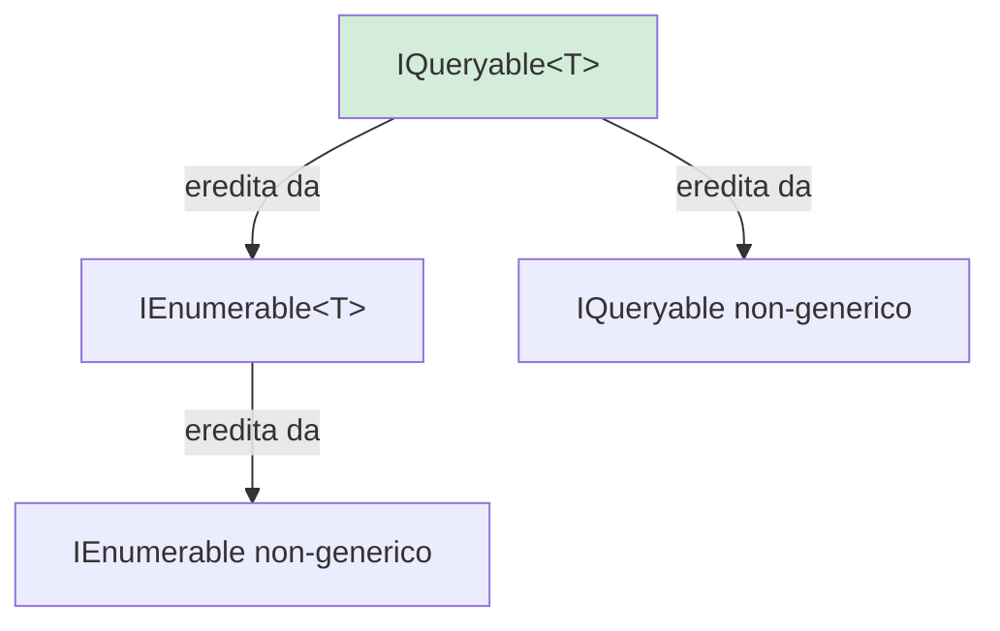
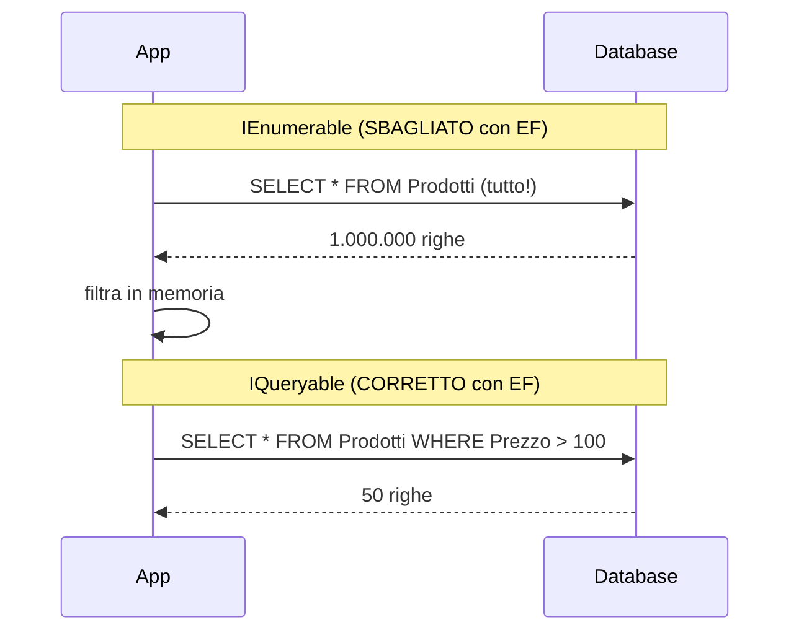

## 1. Introduzione

`IEnumerable<T>` e `IQueryable<T>` sono due interfacce fondamentali in C# per lavorare con collezioni di dati. Scegliere quella giusta ha un impatto diretto sulle **performance**, soprattutto quando si lavora con database.



## 2. IEnumerable\<T\>

`IEnumerable<T>` è la base di tutte le collezioni in C#. Supporta l'iterazione con `foreach`.

```cs
public interface IEnumerable<out T>
{
    IEnumerator<T> GetEnumerator();
}
```

- Esegue le query **in memoria** (client-side).
- Usa **LINQ to Objects**.
- Adatto per: List, Array, Dictionary, qualsiasi collezione in memoria.

```cs
List<int> numeri = new List<int> { 1, 2, 3, 4, 5, 6, 7, 8, 9, 10 };

IEnumerable<int> query = numeri
    .Where(n => n > 5)   // filtra in memoria
    .OrderBy(n => n);    // ordina in memoria

foreach (var n in query)
    Console.WriteLine(n); // 6, 7, 8, 9, 10
```

## 3. IQueryable\<T\>

`IQueryable<T>` estende `IEnumerable<T>` e rappresenta una query che può essere **tradotta ed eseguita su una sorgente esterna** (es. SQL Server).

```cs
public interface IQueryable<out T> : IEnumerable<T>
{
    Expression Body { get; }
    Type ElementType { get; }
    IQueryProvider Provider { get; }
}
```

- Esegue le query **sul server** (server-side).
- Usa **Expression Trees** → traduce LINQ in SQL.
- Adatto per: Entity Framework Core, LINQ to SQL, database remoti.

```cs
// Con EF Core
IQueryable<Prodotto> query = _context.Prodotti
    .Where(p => p.Prezzo > 100)    // NON eseguito ancora
    .OrderBy(p => p.Nome);          // NON eseguito ancora

// La query SQL viene generata ed eseguita SOLO qui:
List<Prodotto> prodotti = await query.ToListAsync();
// SQL: SELECT * FROM Prodotti WHERE Prezzo > 100 ORDER BY Nome
```

## 4. Execution Deferred (esecuzione differita)

Sia `IEnumerable` che `IQueryable` supportano la **deferred execution**: la query non viene eseguita finché non si itera i risultati.

```cs
// La query non viene eseguita in questo punto
var query = numeri.Where(n => n > 5);

Console.WriteLine("Query definita, non ancora eseguita");

// Viene eseguita qui (prima iterazione)
foreach (var n in query)
    Console.WriteLine(n);
```

I metodi che **forzano l'esecuzione immediata** sono:
- `ToList()`, `ToArray()`, `ToDictionary()`
- `Count()`, `First()`, `Single()`, `Any()`, `All()`
- `Sum()`, `Max()`, `Min()`, `Average()`

## 5. La differenza chiave: dove avviene il filtro

Questa è la differenza più importante in termini di performance.

```cs
// ❌ IEnumerable con EF Core (CARICA TUTTO IN MEMORIA)
IEnumerable<Prodotto> prodottiEnum = _context.Prodotti;
var costosi = prodottiEnum.Where(p => p.Prezzo > 100).ToList();
// SQL generato: SELECT * FROM Prodotti  ← tutto il DB!
// Il filtro WHERE viene applicato in C# dopo aver letto tutto

// ✅ IQueryable con EF Core (FILTRA SUL DATABASE)
IQueryable<Prodotto> prodottiQuery = _context.Prodotti;
var costosi = prodottiQuery.Where(p => p.Prezzo > 100).ToList();
// SQL generato: SELECT * FROM Prodotti WHERE Prezzo > 100 ← solo i dati necessari
```



## 6. Expression Trees

`IQueryable` funziona grazie agli **Expression Trees**: le lambda non vengono eseguite in C#, ma rappresentate come strutture dati che possono essere tradotte in SQL.

```cs
// Con IEnumerable: questa lambda è del codice C# compilato
Func<Prodotto, bool> predicate = p => p.Prezzo > 100;

// Con IQueryable: questa lambda è un Expression Tree (dati, non codice)
Expression<Func<Prodotto, bool>> expression = p => p.Prezzo > 100;
// EF Core può "leggere" questa espressione e tradurla in SQL
```

## 7. Estendere IQueryable dinamicamente

Un vantaggio di `IQueryable` è poter costruire query in modo dinamico e applicare filtri in modo condizionale **senza eseguire query intermedie**.

```cs
public async Task<List<Prodotto>> CercaAsync(
    string? nomeContieneParola,
    decimal? prezzoMin,
    decimal? prezzoMax)
{
    IQueryable<Prodotto> query = _context.Prodotti.AsQueryable();

    if (!string.IsNullOrEmpty(nomeContieneParola))
        query = query.Where(p => p.Nome.Contains(nomeContieneParola));

    if (prezzoMin.HasValue)
        query = query.Where(p => p.Prezzo >= prezzoMin.Value);

    if (prezzoMax.HasValue)
        query = query.Where(p => p.Prezzo <= prezzoMax.Value);

    // UNA SOLA query SQL con tutti i filtri applicati
    return await query.ToListAsync();
}
```

## 8. Quando usare quale

| Situazione | Usa |
|---|---|
| Dati già in memoria (List, Array) | `IEnumerable<T>` |
| Query su database con EF Core | `IQueryable<T>` |
| Filtri dinamici su database | `IQueryable<T>` |
| Operazioni in memoria su risultati già recuperati | `IEnumerable<T>` |
| Paginazione su database | `IQueryable<T>` |
| Metodi di libreria generici (non DB) | `IEnumerable<T>` |

## 9. AsEnumerable() e AsQueryable()

Puoi passare da uno all'altro esplicitamente.

```cs
// Porta l'esecuzione dal DB alla memoria
var query = _context.Prodotti
    .Where(p => p.Prezzo > 100)   // eseguito in SQL
    .AsEnumerable()                // da qui in poi: in memoria
    .Where(p => AlgoritmoComplesso(p)); // non traducibile in SQL

// Da IEnumerable a IQueryable (utile per testabilità)
List<int> lista = new List<int> { 1, 2, 3 };
IQueryable<int> q = lista.AsQueryable();
```

## 10. Quiz

import Quiz from '../../../components/Quiz.jsx';

<Quiz client:load questions={[
{
question:"IQueryable<T> estende:",
answers:{
a:"ICollection<T>",
b:"IEnumerable<T>",
c:"IList<T>",
d:"IObservable<T>"
},
correctAnswer:"b"
},
{
question:"Dove vengono eseguiti i filtri LINQ su IEnumerable?",
answers:{
a:"Nel database",
b:"In memoria sul client",
c:"Su un server remoto",
d:"In un thread separato"
},
correctAnswer:"b"
},
{
question:"Dove vengono eseguiti i filtri LINQ su IQueryable con EF Core?",
answers:{
a:"In memoria C#",
b:"Nel browser",
c:"Nel database tramite SQL",
d:"In un servizio cloud"
},
correctAnswer:"c"
},
{
question:"Quale metodo forza l'esecuzione immediata di una query LINQ?",
answers:{
a:"Where()",
b:"Select()",
c:"OrderBy()",
d:"ToList()"
},
correctAnswer:"d"
},
{
question:"Cosa sono gli Expression Trees?",
answers:{
a:"Strutture dati che rappresentano codice traducibile (es. in SQL)",
b:"Alberi di ereditarietà delle classi",
c:"Strutture per gestire le eccezioni",
d:"Tipi di collezioni ad albero"
},
correctAnswer:"a"
},
{
question:"Se usi IEnumerable con EF Core invece di IQueryable:",
answers:{
a:"Le query sono più veloci",
b:"Tutti i dati vengono caricati in memoria prima del filtro",
c:"Non funziona il metodo Include()",
d:"Non si possono usare metodi LINQ"
},
correctAnswer:"b"
},
{
question:"AsEnumerable() su una IQueryable serve per:",
answers:{
a:"Convertire in lista",
b:"Passare l'esecuzione dal DB alla memoria",
c:"Aggiungere un indice al database",
d:"Ordinare la collezione"
},
correctAnswer:"b"
},
{
question:"Qual è il vantaggio di costruire query dinamiche con IQueryable?",
answers:{
a:"Vengono eseguite più query separate, una per filtro",
b:"Si genera una sola query SQL con tutti i filtri combinati",
c:"Non serve il database",
d:"Le query sono immutabili"
},
correctAnswer:"b"
},
{
question:"La deferred execution significa che:",
answers:{
a:"La query viene eseguita immediatamente alla definizione",
b:"La query viene eseguita solo quando si itera i risultati",
c:"La query viene eseguita in un altro thread",
d:"La query non viene mai eseguita"
},
correctAnswer:"b"
},
{
question:"Quale interfaccia è più adatta per la paginazione su database?",
answers:{
a:"IList<T>",
b:"IEnumerable<T>",
c:"ICollection<T>",
d:"IQueryable<T>"
},
correctAnswer:"d"
}
]} />

## 11. Esercizi

### 11.1 Confronto di performance

**Scenario**: Vuoi vedere concretamente la differenza tra IEnumerable e IQueryable.

**Consegna**:
1. Crea un'applicazione con EF Core e una tabella `Prodotto` (con 1000+ record di test).
2. Scrivi la stessa query con `IEnumerable` e con `IQueryable` per filtrare prodotti con prezzo > 50.
3. Usa il logging di EF Core (`optionsBuilder.LogTo(Console.WriteLine)`) per vedere le query SQL generate.
4. Osserva la differenza tra le due query SQL.

*Obiettivo: vedere visivamente l'impatto di IEnumerable vs IQueryable.*

### 11.2 Ricerca dinamica

**Scenario**: Vuoi costruire un endpoint di ricerca prodotti con filtri opzionali.

**Consegna**:
1. Crea un metodo `CercaProdottiAsync(string? nome, decimal? prezzoMin, decimal? prezzoMax, string? categoria)`.
2. Usa `IQueryable<Prodotto>` e applica i filtri solo se il parametro è valorizzato.
3. Aggiungi anche ordinamento e paginazione (`Skip` / `Take`).
4. Stampa la query SQL generata tramite il logging di EF Core.

*Obiettivo: costruire query dinamiche efficienti con IQueryable.*

### 11.3 AsEnumerable per logica custom

**Scenario**: Hai una query su DB che vuoi completare con un algoritmo C# non traducibile in SQL.

**Consegna**:
1. Recupera i prodotti con prezzo > 10 dal DB tramite `IQueryable`.
2. Usa `AsEnumerable()` per passare in memoria.
3. Applica un ulteriore filtro con un metodo C# complesso (es. una logica basata su regex).
4. Mostra le query SQL generate per verificare che il filtro SQL sia corretto.

*Obiettivo: capire quando e come usare AsEnumerable() per separare l'esecuzione DB da quella in memoria.*
