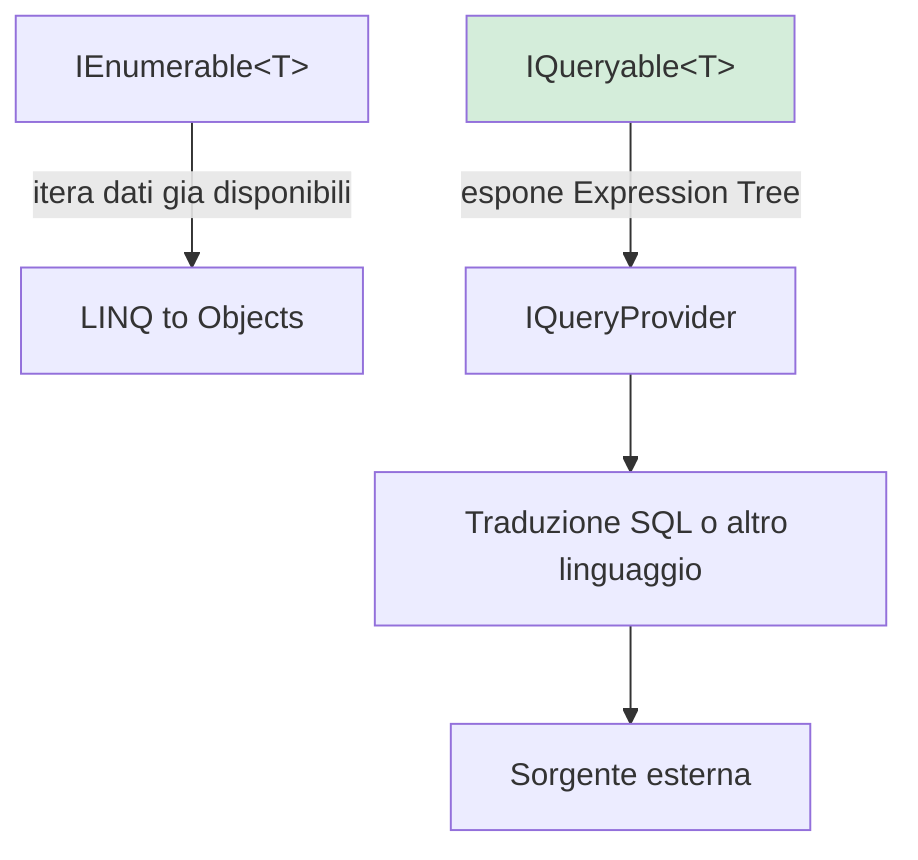
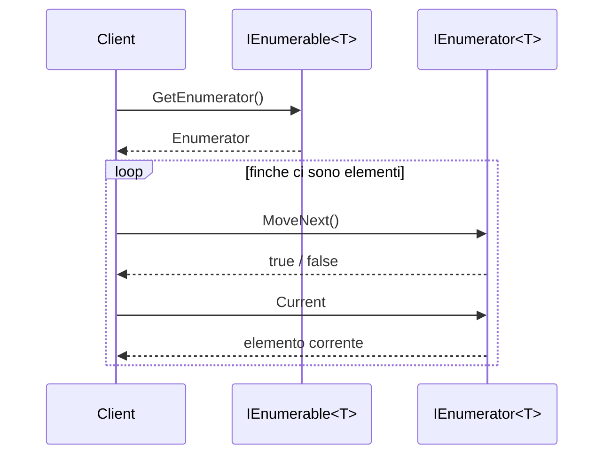
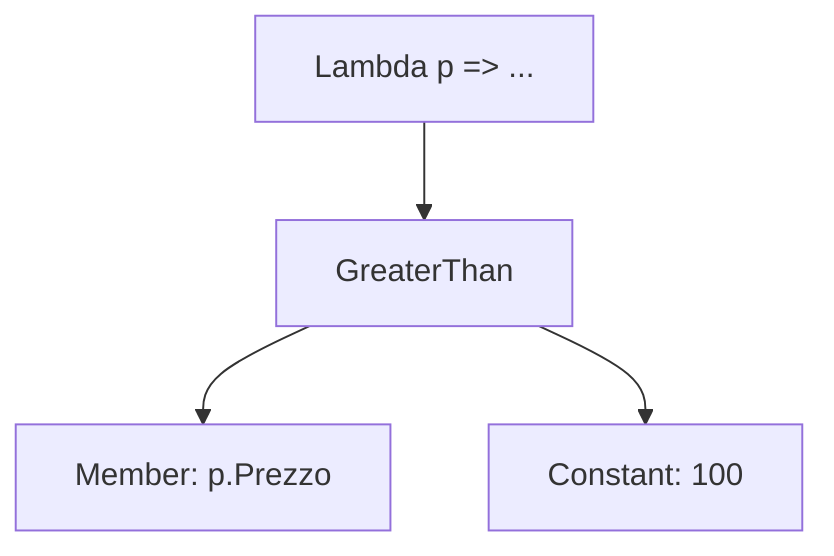
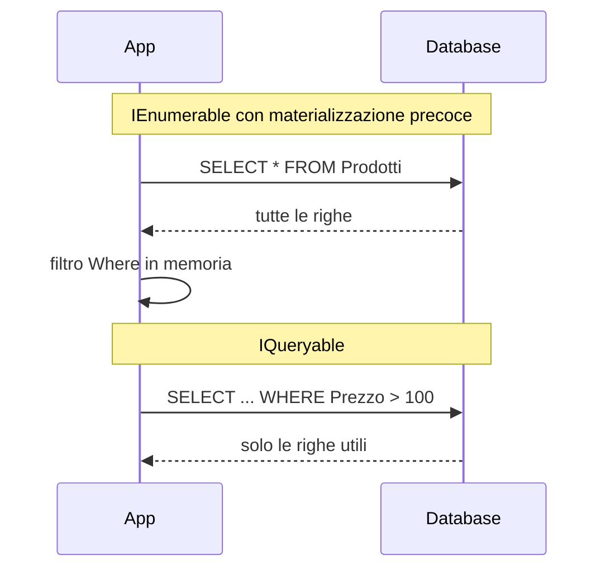

## 1. Introduzione

`IEnumerable<T>` e `IQueryable<T>` sembrano simili perché entrambe si usano con LINQ, ma descrivono due modelli di esecuzione molto diversi:

- `IEnumerable<T>` descrive una sequenza che il runtime C# sa **iterare elemento per elemento**.
- `IQueryable<T>` descrive una query che un provider esterno può **analizzare, trasformare e tradurre**.

La differenza pratica è: con `IEnumerable<T>` il lavoro avviene tipicamente **in memoria**, con `IQueryable<T>` il lavoro può essere spostato **verso la sorgente dati** (database, provider remoto, motore custom).



In termini di costo, il confronto tipico è:

$$
T_{IEnumerable}(n) = O(n)
$$

quando bisogna leggere e filtrare tutti gli elementi in memoria, mentre una query ben indicizzata può avvicinarsi a:

$$
T_{IQueryable+indice}(n) = O(\log n + k)
$$

con $k$ pari al numero di righe realmente restituite.

## 2. IEnumerable\<T\> e pattern Iterator

`IEnumerable<T>` è la base dell'iterazione in .NET. Il punto centrale non è il filtro, ma il fatto che una sequenza sappia produrre un **enumeratore**.

```cs
public interface IEnumerable<out T>
{
    IEnumerator<T> GetEnumerator();
}
```

### 2.1 Come funziona davvero `foreach`

Quando scrivi:

```cs
foreach (var valore in collezione)
{
    Console.WriteLine(valore);
}
```

il compilatore lo trasforma concettualmente in qualcosa di molto vicino a:

```cs
using IEnumerator<int> enumerator = collezione.GetEnumerator();

while (enumerator.MoveNext())
{
    int valore = enumerator.Current;
    Console.WriteLine(valore);
}
```

I tre membri chiave del pattern iterator sono:

- `GetEnumerator()`: crea l'oggetto che sa attraversare la sequenza.
- `MoveNext()`: avanza alla posizione successiva e restituisce `true` se esiste un elemento.
- `Current`: espone l'elemento corrente.



### 2.2 `yield return` e la state machine generata dal compilatore

Una delle caratteristiche più importanti di `IEnumerable<T>` è che puoi implementarlo senza scrivere manualmente un enumeratore completo.

```cs
public static IEnumerable<int> NumeriPari(int max)
{
    for (int i = 0; i <= max; i++)
    {
        if (i % 2 == 0)
            yield return i;
    }
}
```

Con `yield return` il compilatore genera una **state machine**:

- una classe nascosta che implementa `IEnumerable<int>` e `IEnumerator<int>`;
- un campo interno per salvare lo stato corrente dell'iterazione;
- campi per conservare variabili locali e parametri del metodo;
- una logica in `MoveNext()` che riprende l'esecuzione dal punto dell'ultimo `yield return`.

Schema concettuale:

```cs
private sealed class NumeriPariStateMachine : IEnumerable<int>, IEnumerator<int>
{
    private int _state;
    private int _current;
    private int _max;
    private int _i;

    public bool MoveNext()
    {
        switch (_state)
        {
            case 0:
                _i = 0;
                _state = 1;
                goto case 1;

            case 1:
                while (_i <= _max)
                {
                    if (_i % 2 == 0)
                    {
                        _current = _i;
                        _i++;
                        return true;
                    }

                    _i++;
                }
                break;
        }

        return false;
    }

    public int Current => _current;
}
```

Questo spiega perché `IEnumerable<T>` può essere molto efficiente quando vuoi **streaming** di dati uno alla volta invece di creare subito una lista completa.

### 2.3 LINQ to Objects su `IEnumerable<T>`

Su collezioni in memoria, gli operatori LINQ lavorano come composizione di iteratori:

```cs
List<int> numeri = new() { 1, 2, 3, 4, 5, 6, 7, 8, 9, 10 };

IEnumerable<int> query = numeri
    .Where(n => n > 5)
    .OrderBy(n => n);

foreach (var n in query)
    Console.WriteLine(n);
```

Qui non esiste alcuna traduzione SQL: la lambda è codice .NET compilato e la sequenza viene percorsa in memoria.

### 2.4 Implicazioni di memoria

Se la sequenza è lazy, spesso la memoria aggiuntiva è circa:

$$
M_{streaming} = O(1)
$$

oltre allo stato dell'enumeratore. Se invece materializzi con `ToList()`, la memoria cresce con il numero di elementi:

$$
M_{buffering} = O(n)
$$

Questo è il motivo per cui `yield return` e catene LINQ lazy possono essere molto più leggere di una materializzazione anticipata.

## 3. IQueryable\<T\> e architettura dei provider LINQ

`IQueryable<T>` estende `IEnumerable<T>`, ma aggiunge tre concetti fondamentali:

```cs
public interface IQueryable<out T> : IEnumerable<T>
{
    Expression Expression { get; }
    Type ElementType { get; }
    IQueryProvider Provider { get; }
}
```

- `Expression`: l'albero sintattico della query.
- `ElementType`: il tipo degli elementi finali.
- `Provider`: il componente che sa interpretare l'albero.

### 3.1 Il ruolo di `IQueryProvider`

Un provider LINQ riceve un `Expression Tree` e decide come eseguirlo. In Entity Framework Core il flusso concettuale è:

1. costruzione della query LINQ;
2. creazione di un `Expression Tree`;
3. visita dell'albero con il **visitor pattern**;
4. traduzione in una forma intermedia;
5. generazione del comando SQL;
6. esecuzione sul database;
7. materializzazione dei risultati in oggetti .NET.


### 3.2 Esempio concreto con EF Core

```cs
IQueryable<Prodotto> query = _context.Prodotti
    .Where(p => p.Prezzo > 100)
    .OrderBy(p => p.Nome);

List<Prodotto> prodotti = await query.ToListAsync();
```

Fino a `ToListAsync()` non stai ancora leggendo righe: stai solo accumulando nodi nell'albero di espressione. Il provider osserva qualcosa di concettualmente simile a:

- sorgente: `Prodotti`;
- filtro: `p => p.Prezzo > 100`;
- ordinamento: `p => p.Nome`.

E poi genera SQL del tipo:

```sql
SELECT *
FROM Prodotti
WHERE Prezzo > 100
ORDER BY Nome
```

### 3.3 Visitor pattern sugli Expression Tree

Gli expression tree sono composti da nodi (`MethodCallExpression`, `BinaryExpression`, `MemberExpression`, `ConstantExpression`, ecc.). Un provider li percorre con un visitatore:

```cs
public class SqlLikeVisitor : ExpressionVisitor
{
    protected override Expression VisitMethodCall(MethodCallExpression node)
    {
        if (node.Method.Name == "Where")
        {
            // legge il predicato e prepara il frammento WHERE
        }

        return base.VisitMethodCall(node);
    }

    protected override Expression VisitBinary(BinaryExpression node)
    {
        if (node.NodeType == ExpressionType.GreaterThan)
        {
            // prepara qualcosa come: colonna > valore
        }

        return base.VisitBinary(node);
    }
}
```

Non è il tuo codice applicativo a eseguire direttamente la lambda: il provider la **interpreta come struttura dati**.

## 4. Deferred execution e classificazione degli operatori LINQ

Sia `IEnumerable<T>` sia `IQueryable<T>` supportano spesso la **deferred execution**: la query viene definita adesso, ma eseguita solo quando servono davvero i risultati.

```cs
var query = Enumerable.Range(1, 10)
    .Where(n => n > 5)
    .Select(n => n * 10);

Console.WriteLine("Query costruita");

foreach (var n in query)
    Console.WriteLine(n);
```

### 4.1 Deferred vs immediate

- **Deferred**: l'operatore restituisce un'altra sequenza o query componibile.
- **Immediate**: l'operatore produce subito un valore finale oppure materializza tutti i risultati.

### 4.2 Tabella dei principali operatori

| Operatore | Tipo di esecuzione | Note principali |
|---|---|---|
| `Where` | Deferred | Filtra; con `IQueryable` diventa spesso `WHERE` SQL |
| `Select` | Deferred | Proiezione; spesso `SELECT` SQL |
| `SelectMany` | Deferred | Flatten di sequenze; spesso traducibile in join/apply |
| `OrderBy` / `OrderByDescending` | Deferred | Imposta ordinamento; in SQL `ORDER BY` |
| `ThenBy` / `ThenByDescending` | Deferred | Estende l'ordinamento |
| `Skip` | Deferred | In SQL di solito `OFFSET` |
| `Take` | Deferred | In SQL di solito `TOP` o `FETCH NEXT` |
| `Distinct` | Deferred | In SQL `DISTINCT` |
| `GroupBy` | Deferred | Su `IEnumerable` raggruppa in memoria; su `IQueryable` la traduzione dipende dalla forma della query |
| `Join` | Deferred | Spesso traducibile in `JOIN` |
| `GroupJoin` | Deferred | Traduzione più delicata; spesso base di left join |
| `Union` | Deferred | In SQL `UNION` |
| `Concat` | Deferred | In SQL `UNION ALL` o composizione equivalente |
| `Append` / `Prepend` | Deferred | Tipico su `IEnumerable`; non sempre traducibile su provider SQL |
| `DefaultIfEmpty` | Deferred | Utile per left join |
| `Reverse` | Deferred | In memoria è semplice; su SQL non sempre traducibile |
| `AsEnumerable` | Deferred | Cambia il tipo statico e sposta le operazioni successive in memoria |
| `AsQueryable` | Deferred | Espone una sequenza come `IQueryable` |
| `ToList` / `ToListAsync` | Immediate | Materializza tutti gli elementi |
| `ToArray` | Immediate | Materializza in array |
| `ToDictionary` | Immediate | Materializza e indicizza per chiave |
| `Count` / `LongCount` | Immediate | Restituisce un numero; su SQL spesso `COUNT(*)` |
| `Any` | Immediate | Restituisce `bool`; su SQL spesso `EXISTS` |
| `All` | Immediate | Restituisce `bool`; su SQL viene riscritto in forma equivalente |
| `First` / `FirstOrDefault` | Immediate | Restituisce il primo elemento |
| `Single` / `SingleOrDefault` | Immediate | Verifica cardinalità attesa |
| `Last` / `LastOrDefault` | Immediate | Su SQL può richiedere ordinamento esplicito |
| `Contains` | Immediate se terminale | In SQL può diventare `IN` o `EXISTS` |
| `Sum` / `Min` / `Max` / `Average` | Immediate | Operazioni di aggregazione |
| `Aggregate` | Immediate | Molto comune in memoria, raramente traducibile in SQL |
| `ForEach` su `List<T>` | Immediate | Non è un operatore LINQ standard |

### 4.3 Conseguenze pratiche

Ogni volta che chiami un operatore terminale come `ToList()`, `Count()`, `Any()` o `First()`, stai chiudendo la pipeline. Se la sorgente è `IQueryable<T>`, quello è il punto in cui il provider deve generare e lanciare una query reale.

## 5. Expression Trees in profondità

Gli expression tree sono il cuore di `IQueryable<T>`.

### 5.1 `Func<T, bool>` vs `Expression<Func<T, bool>>`

```cs
Func<Prodotto, bool> filtroCompilato = p => p.Prezzo > 100;
Expression<Func<Prodotto, bool>> filtroEspressione = p => p.Prezzo > 100;
```

Differenza concettuale:

- `Func<Prodotto, bool>` è **codice compilato**: puoi solo eseguirlo.
- `Expression<Func<Prodotto, bool>>` è **una descrizione dell'espressione**: puoi ispezionarla, riscriverla, combinarla, tradurla.

Con `IEnumerable<T>` il metodo `Where` riceve tipicamente una `Func<T, bool>`. Con `IQueryable<T>`, l'overload usa `Expression<Func<T, bool>>`.

### 5.2 Anatomia di un expression tree

Per l'espressione `p => p.Prezzo > 100`, l'albero contiene in genere:

- un `ParameterExpression` per `p`;
- un `MemberExpression` per `p.Prezzo`;
- un `ConstantExpression` per `100`;
- un `BinaryExpression` di tipo `GreaterThan`;
- un nodo `LambdaExpression` come radice.



### 5.3 Costruzione programmatica

Gli expression tree possono essere generati a runtime.

```cs
using System.Linq.Expressions;

ParameterExpression parametro = Expression.Parameter(typeof(Prodotto), "p");
MemberExpression proprietaPrezzo = Expression.Property(parametro, nameof(Prodotto.Prezzo));
ConstantExpression valore = Expression.Constant(100m);
BinaryExpression corpo = Expression.GreaterThan(proprietaPrezzo, valore);
Expression<Func<Prodotto, bool>> filtro =
    Expression.Lambda<Func<Prodotto, bool>>(corpo, parametro);
```

Questo è fondamentale per filtri dinamici, specification pattern, builder di query, API di ricerca avanzata.

### 5.4 Come EF Core visita l'albero

EF Core applica vari passaggi interni, concettualmente simili a questi:

1. normalizzazione dell'espressione;
2. sostituzione di parametri e chiusure catturate;
3. riconoscimento dei metodi LINQ standard;
4. tentativo di traduzione di membri e metodi in costrutti SQL;
5. generazione dell'albero di query relazionale;
6. compilazione della query in un delegate riusabile.

Se il provider incontra un nodo non traducibile in una parte che deve restare server-side, lancia un'eccezione oppure richiede di passare esplicitamente in memoria con `AsEnumerable()`.

## 6. Dove avviene il lavoro: performance, proiezione, N+1 e complessità

La differenza più importante è **dove** applichi il filtro, la proiezione e l'aggregazione.

### 6.1 Filtro in memoria vs filtro sul database

```cs
// Carica tutto, poi filtra in memoria
IEnumerable<Prodotto> prodottiEnum = _context.Prodotti;
var costosiMemoria = prodottiEnum.Where(p => p.Prezzo > 100).ToList();

// Compone SQL e filtra sul database
IQueryable<Prodotto> prodottiQuery = _context.Prodotti;
var costosiDb = await prodottiQuery.Where(p => p.Prezzo > 100).ToListAsync();
```



### 6.2 Proiezione: `Select` contro entità complete

Spesso l'ottimizzazione più importante non è solo filtrare, ma **caricare meno colonne**.

```cs
// Carica l'entità completa
var prodotti = await _context.Prodotti
    .Where(p => p.Prezzo > 100)
    .ToListAsync();

// Carica solo le colonne necessarie
var cards = await _context.Prodotti
    .Where(p => p.Prezzo > 100)
    .Select(p => new ProdottoCardDto
    {
        Id = p.Id,
        Nome = p.Nome,
        Prezzo = p.Prezzo
    })
    .ToListAsync();
```

Con `Select`:

- diminuisci I/O dal database;
- riduci il payload di rete;
- riduci il costo di materializzazione;
- eviti tracking inutile di campi che non userai.

### 6.3 Il problema N+1

Il problema **N+1** nasce quando fai una query per ottenere N entità principali e poi, per ciascuna, scateni un'altra query per caricare dati correlati.

```cs
var ordini = await _context.Ordini.ToListAsync();

foreach (var ordine in ordini)
{
    Console.WriteLine(ordine.Cliente.Nome);
}
```

Se `Cliente` viene caricato in lazy loading, puoi ottenere:

- 1 query per gli ordini;
- N query aggiuntive per i clienti.

Totale: `1 + N` round-trip.

Relazione con `IEnumerable<T>` e `IQueryable<T>`:

- se materializzi presto (`ToList`) e poi navighi proprietà non caricate, il rischio di N+1 aumenta;
- con `IQueryable<T>` puoi fare `Include`, join o proiezioni per evitare round-trip ripetuti.

```cs
var ordini = await _context.Ordini
    .Select(o => new
    {
        o.Id,
        ClienteNome = o.Cliente.Nome,
        Totale = o.Totale
    })
    .ToListAsync();
```

### 6.4 Complessità asintotica e benchmark concettuale

Caso semplice: cercare prodotti con `Prezzo > 100`.

Se hai già caricato tutti i prodotti in memoria, devi spesso attraversare tutti gli elementi:

$$
T_{scan}(n) = O(n)
$$

Su database con indice sulla colonna filtrata, il motore può usare una struttura dati che riduce la ricerca iniziale a:

$$
T_{indice}(n) = O(\log n + k)
$$

con $k$ righe risultanti. In pratica il guadagno reale dipende da:

- selettività del filtro;
- presenza di indice;
- quantità di colonne lette;
- latenza di rete;
- costo di materializzazione lato applicazione.

### 6.5 Memoria: streaming vs buffering

```cs
// Buffering completo
List<Prodotto> lista = await _context.Prodotti.ToListAsync();

// Streaming asincrono elemento per elemento
await foreach (var prodotto in _context.Prodotti.AsAsyncEnumerable())
{
    Console.WriteLine(prodotto.Nome);
}
```

In termini semplificati:

$$
M_{ToList}(n) = O(n)
$$

mentre lo streaming tende a mantenere memoria addizionale proporzionale a pochi elementi alla volta, anche se il provider può avere buffer interni.

## 7. Query dinamiche e Specification pattern

Uno dei vantaggi principali di `IQueryable<T>` è costruire query senza eseguire step intermedi.

### 7.1 Composizione dinamica

```cs
public async Task<List<Prodotto>> CercaAsync(
    string? nomeContieneParola,
    decimal? prezzoMin,
    decimal? prezzoMax)
{
    IQueryable<Prodotto> query = _context.Prodotti.AsQueryable();

    if (!string.IsNullOrWhiteSpace(nomeContieneParola))
        query = query.Where(p => p.Nome.Contains(nomeContieneParola));

    if (prezzoMin.HasValue)
        query = query.Where(p => p.Prezzo >= prezzoMin.Value);

    if (prezzoMax.HasValue)
        query = query.Where(p => p.Prezzo <= prezzoMax.Value);

    return await query.ToListAsync();
}
```

Il database vede una sola query finale, non tre query separate.

### 7.2 Specification pattern

Lo **Specification pattern** incapsula regole di filtro in oggetti riusabili invece di duplicare lambda sparse nel codice.

```cs
public abstract class Specification<T>
{
    public abstract Expression<Func<T, bool>> ToExpression();

    public IQueryable<T> Apply(IQueryable<T> query)
        => query.Where(ToExpression());
}

public sealed class ProdottiCostosiSpecification : Specification<Prodotto>
{
    private readonly decimal _prezzoMinimo;

    public ProdottiCostosiSpecification(decimal prezzoMinimo)
    {
        _prezzoMinimo = prezzoMinimo;
    }

    public override Expression<Func<Prodotto, bool>> ToExpression()
        => p => p.Prezzo >= _prezzoMinimo;
}
```

Uso:

```cs
Specification<Prodotto> spec = new ProdottiCostosiSpecification(100);
var query = spec.Apply(_context.Prodotti);
var risultati = await query.ToListAsync();
```

Vantaggi:

- riuso di logica di business;
- testabilità delle regole;
- combinazione di filtri complessi;
- mantenimento del filtro in forma traducibile (`Expression<Func<T, bool>>`).

Se al posto di `Expression<Func<T, bool>>` usassi una `Func<T, bool>`, perderesti la possibilità di tradurre la regola in SQL.

## 8. Limiti di IQueryable e client evaluation

`IQueryable<T>` non significa che qualsiasi codice C# possa diventare SQL. Il provider può tradurre solo ciò che conosce.

### 8.1 Esempi comuni di elementi difficili o impossibili da tradurre

Questi casi sono spesso problematici o provider-specific:

- metodi custom dell'applicazione (`CalcolaPunteggio(p)`);
- delegate locali e `Func<T, bool>` già compilate;
- overload con `StringComparison` non supportati dal provider;
- logica con cicli, `try/catch`, variabili mutate;
- `Regex.IsMatch(...)` se il provider non ha traduzione dedicata;
- `Aggregate` arbitrari;
- comparatori custom passati a `OrderBy`, `Distinct`, `GroupBy`;
- alcuni overload indicizzati come `Where((x, index) => ...)`;
- qualunque accesso a servizi esterni o stato non serializzabile in SQL.

```cs
// In genere non traducibile in SQL
var query = _context.Prodotti
    .Where(p => AlgoritmoComplesso(p));
```

### 8.2 Client evaluation

Storicamente alcuni provider spostavano in silenzio parti della query sul client. In EF Core moderno, se una porzione centrale della query non è traducibile, nella maggior parte dei casi viene lanciata un'eccezione per evitare degradazioni nascoste di performance.

Il passaggio corretto, se ti serve logica solo C#, è rendere esplicito il confine:

```cs
var risultati = _context.Prodotti
    .Where(p => p.Prezzo > 10)
    .AsEnumerable()
    .Where(p => AlgoritmoComplesso(p))
    .ToList();
```

Da quel punto in poi accetti volutamente che il resto del lavoro avvenga in memoria.

### 8.3 Regola pratica

- tutto ciò che può essere espresso in SQL: lascialo in `IQueryable<T>`;
- tutto ciò che è puramente .NET e non traducibile: portalo dopo `AsEnumerable()` oppure dopo materializzazione.

## 9. AsEnumerable(), AsQueryable() e IAsyncEnumerable\<T\>

Questi metodi segnano il confine tra mondi diversi.

### 9.1 `AsEnumerable()`

`AsEnumerable()` non esegue la query da solo: cambia il tipo statico della pipeline e fa sì che gli operatori successivi vengano risolti come LINQ to Objects.

```cs
var query = _context.Prodotti
    .Where(p => p.Prezzo > 100)
    .AsEnumerable()
    .Where(p => AlgoritmoComplesso(p));
```

Qui:

- il primo `Where` può diventare SQL;
- il secondo `Where` è sicuramente C# in memoria.

### 9.2 `AsQueryable()`

`AsQueryable()` è utile per esporre una sorgente come query componibile, spesso in test o in librerie generiche.

```cs
List<int> lista = new() { 1, 2, 3 };
IQueryable<int> q = lista.AsQueryable();
```

Attenzione: questo non crea un vero provider SQL. Hai solo un `IQueryable<T>` basato su LINQ to Objects.

### 9.3 `IAsyncEnumerable<T>` e `await foreach`

Con dati remoti o stream lunghi, oggi è molto importante anche `IAsyncEnumerable<T>`, che rappresenta una sequenza asincrona.

```cs
await foreach (var prodotto in _context.Prodotti
    .Where(p => p.Prezzo > 100)
    .AsAsyncEnumerable())
{
    Console.WriteLine($"{prodotto.Nome} - {prodotto.Prezzo}");
}
```

Concetti chiave:

- `IEnumerable<T>`: iterazione sincrona.
- `IAsyncEnumerable<T>`: iterazione asincrona elemento per elemento.
- `await foreach`: consuma la sequenza senza bloccare il thread durante le attese I/O.

A livello di pattern, `IAsyncEnumerable<T>` usa l'equivalente asincrono dell'iterator pattern:

- `GetAsyncEnumerator()`;
- `MoveNextAsync()`;
- `Current`.

```cs
public async IAsyncEnumerable<int> LeggiNumeriAsync()
{
    for (int i = 1; i <= 3; i++)
    {
        await Task.Delay(100);
        yield return i;
    }
}
```

Il compilatore genera anche qui una state machine, ma stavolta combina:

- semantica iterator (`yield return`);
- semantica async (`await`);
- avanzamento tramite `ValueTask<bool>` in `MoveNextAsync()`.

### 9.4 Quando usare cosa

| Situazione | Scelta consigliata |
|---|---|
| Dati già in memoria (`List`, `Array`) | `IEnumerable<T>` |
| Query su database con filtro, sort, paging | `IQueryable<T>` |
| Regole riusabili traducibili in SQL | `Expression<Func<T, bool>>` o Specification |
| Logica non traducibile | `AsEnumerable()` o materializzazione esplicita |
| Stream asincroni di risultati | `IAsyncEnumerable<T>` |
| Riduzione payload e performance | `Select` con DTO/proiezioni |

In sintesi:

- `IEnumerable<T>` significa iterazione e composizione in memoria.
- `IQueryable<T>` significa descrizione di query traducibile.
- `IAsyncEnumerable<T>` significa streaming asincrono.
- `ToList()` e simili trasformano una pipeline lazy in risultati bufferizzati.
- `Select` è spesso l'ottimizzazione più sottovalutata.
- il vero problema non è solo la sintassi, ma **dove** paghi CPU, RAM, rete e round-trip.
## 10. Quiz

import Quiz from '../../../components/Quiz.jsx';

<Quiz client:load questions={[
{
question:"IQueryable<T> estende:",
answers:{
a:"ICollection<T>",
b:"IEnumerable<T>",
c:"IList<T>",
d:"IObservable<T>"
},
correctAnswer:"b"
},
{
question:"Dove vengono eseguiti i filtri LINQ su IEnumerable?",
answers:{
a:"Nel database",
b:"In memoria sul client",
c:"Su un server remoto",
d:"In un thread separato"
},
correctAnswer:"b"
},
{
question:"Dove vengono eseguiti i filtri LINQ su IQueryable con EF Core?",
answers:{
a:"In memoria C#",
b:"Nel browser",
c:"Nel database tramite SQL",
d:"In un servizio cloud"
},
correctAnswer:"c"
},
{
question:"Quale metodo forza l'esecuzione immediata di una query LINQ?",
answers:{
a:"Where()",
b:"Select()",
c:"OrderBy()",
d:"ToList()"
},
correctAnswer:"d"
},
{
question:"Cosa sono gli Expression Trees?",
answers:{
a:"Strutture dati che rappresentano codice traducibile (es. in SQL)",
b:"Alberi di ereditarietà delle classi",
c:"Strutture per gestire le eccezioni",
d:"Tipi di collezioni ad albero"
},
correctAnswer:"a"
},
{
question:"Se usi IEnumerable con EF Core invece di IQueryable:",
answers:{
a:"Le query sono più veloci",
b:"Tutti i dati vengono caricati in memoria prima del filtro",
c:"Non funziona il metodo Include()",
d:"Non si possono usare metodi LINQ"
},
correctAnswer:"b"
},
{
question:"AsEnumerable() su una IQueryable serve per:",
answers:{
a:"Convertire in lista",
b:"Passare l'esecuzione dal DB alla memoria",
c:"Aggiungere un indice al database",
d:"Ordinare la collezione"
},
correctAnswer:"b"
},
{
question:"Qual è il vantaggio di costruire query dinamiche con IQueryable?",
answers:{
a:"Vengono eseguite più query separate, una per filtro",
b:"Si genera una sola query SQL con tutti i filtri combinati",
c:"Non serve il database",
d:"Le query sono immutabili"
},
correctAnswer:"b"
},
{
question:"La deferred execution significa che:",
answers:{
a:"La query viene eseguita immediatamente alla definizione",
b:"La query viene eseguita solo quando si itera i risultati",
c:"La query viene eseguita in un altro thread",
d:"La query non viene mai eseguita"
},
correctAnswer:"b"
},
{
question:"Quale interfaccia è più adatta per la paginazione su database?",
answers:{
a:"IList<T>",
b:"IEnumerable<T>",
c:"ICollection<T>",
d:"IQueryable<T>"
},
correctAnswer:"d"
}
]} />

## 11. Esercizi

### 11.1 Confronto di performance

**Scenario**: Vuoi vedere concretamente la differenza tra IEnumerable e IQueryable.

**Consegna**:
1. Crea un'applicazione con EF Core e una tabella `Prodotto` (con 1000+ record di test).
2. Scrivi la stessa query con `IEnumerable` e con `IQueryable` per filtrare prodotti con prezzo > 50.
3. Usa il logging di EF Core (`optionsBuilder.LogTo(Console.WriteLine)`) per vedere le query SQL generate.
4. Osserva la differenza tra le due query SQL.

*Obiettivo: vedere visivamente l'impatto di IEnumerable vs IQueryable.*

### 11.2 Ricerca dinamica

**Scenario**: Vuoi costruire un endpoint di ricerca prodotti con filtri opzionali.

**Consegna**:
1. Crea un metodo `CercaProdottiAsync(string? nome, decimal? prezzoMin, decimal? prezzoMax, string? categoria)`.
2. Usa `IQueryable<Prodotto>` e applica i filtri solo se il parametro è valorizzato.
3. Aggiungi anche ordinamento e paginazione (`Skip` / `Take`).
4. Stampa la query SQL generata tramite il logging di EF Core.

*Obiettivo: costruire query dinamiche efficienti con IQueryable.*

### 11.3 AsEnumerable per logica custom

**Scenario**: Hai una query su DB che vuoi completare con un algoritmo C# non traducibile in SQL.

**Consegna**:
1. Recupera i prodotti con prezzo > 10 dal DB tramite `IQueryable`.
2. Usa `AsEnumerable()` per passare in memoria.
3. Applica un ulteriore filtro con un metodo C# complesso (es. una logica basata su regex).
4. Mostra le query SQL generate per verificare che il filtro SQL sia corretto.

*Obiettivo: capire quando e come usare AsEnumerable() per separare l'esecuzione DB da quella in memoria.*
