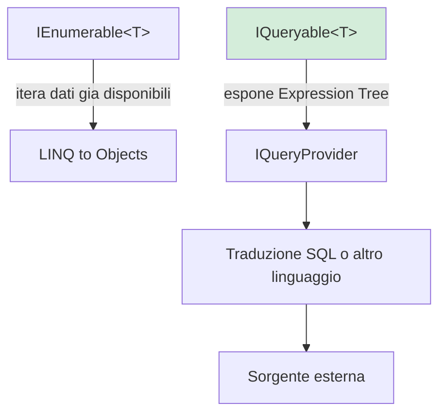
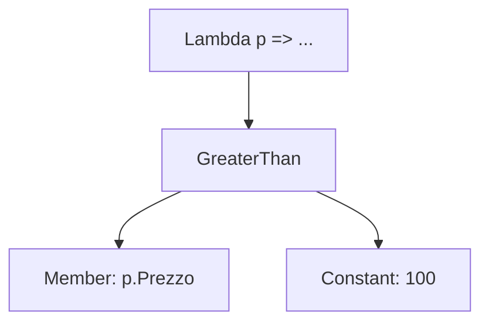
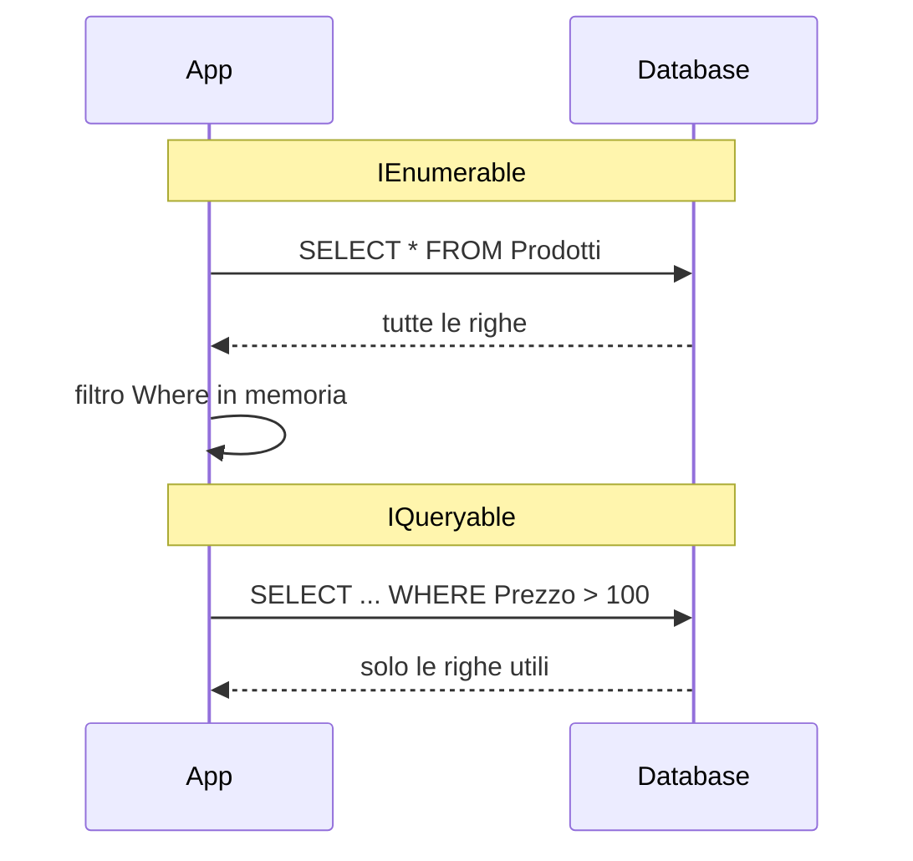

## 1. Introduzione

`IEnumerable<T>` e `IQueryable<T>` si usano entrambe con LINQ, ma descrivono due modelli di esecuzione molto diversi:

- `IEnumerable<T>` è una sequenza che il runtime C# sa **iterare elemento per elemento**, tipicamente **in memoria**.
- `IQueryable<T>` è una query che un provider esterno può **analizzare e tradurre** (ad esempio in SQL), spostando il lavoro **verso la sorgente dati**.


```mermaid
graph TD
    A[IEnumerable&lt;T&gt;] -->|itera dati gia disponibili| B[LINQ to Objects]
    C[IQueryable&lt;T&gt;] -->|espone Expression Tree| D[IQueryProvider]
    D --> E[Traduzione SQL o altro linguaggio]
    E --> F[Sorgente esterna]
    style C fill:#d4edda
```

Filtrare in memoria richiede di scorrere tutti gli elementi, $O(n)$; una query su database con un indice sulla colonna filtrata può avvicinarsi a $O(\log n + k)$, con $k$ pari alle righe effettivamente restituite.

## 2. IEnumerable\<T\> e pattern Iterator

`IEnumerable<T>` ha un solo compito: produrre un **enumeratore** capace di attraversare la sequenza.

```cs
public interface IEnumerable<out T>
{
    IEnumerator<T> GetEnumerator();
}
```

Un `foreach` viene trasformato dal compilatore in qualcosa di molto simile a:

```cs norun
using IEnumerator<int> enumerator = collezione.GetEnumerator();

while (enumerator.MoveNext())       // avanza, true se c'è un elemento
{
    int valore = enumerator.Current; // elemento corrente
    Console.WriteLine(valore);
}
```

### 2.1 `yield return` e lazy evaluation

Con `yield return` puoi implementare una sequenza senza scrivere a mano l'enumeratore. Gli elementi vengono prodotti **uno alla volta, solo quando richiesti**:

```cs
static IEnumerable<int> NumeriPari(int max)
{
    for (int i = 0; i <= max; i += 2)
    {
        Console.WriteLine($"produco {i}");
        yield return i;
    }
}

foreach (var n in NumeriPari(4))
    Console.WriteLine($"uso {n}");

// produco 0
// uso 0
// produco 2
// uso 2
// produco 4
// uso 4
```

L'output alternato mostra lo **streaming**: non esiste mai una lista completa in memoria. Per questo una catena lazy richiede memoria aggiuntiva $O(1)$, mentre materializzare con `ToList()` costa $O(n)$.

<Aside variant="info">
Dietro `yield return` il compilatore genera una classe nascosta (una **state machine**) che implementa `IEnumerator<T>`, salva variabili locali e parametri in campi e, a ogni `MoveNext()`, riprende l'esecuzione dal punto dell'ultimo `yield`.
</Aside>

### 2.2 LINQ to Objects

Su collezioni in memoria gli operatori LINQ sono una composizione di iteratori. Le lambda sono normale codice .NET compilato, nessuna traduzione:

```cs
List<int> numeri = new() { 1, 2, 3, 4, 5, 6, 7, 8, 9, 10 };

IEnumerable<int> query = numeri
    .Where(n => n > 5)
    .OrderBy(n => n);

Console.WriteLine(string.Join(", ", query)); // 6, 7, 8, 9, 10
```

## 3. IQueryable\<T\> e provider LINQ

`IQueryable<T>` estende `IEnumerable<T>` aggiungendo tre membri:

```cs norun
public interface IQueryable<out T> : IEnumerable<T>
{
    Expression Expression { get; }    // albero sintattico della query
    Type ElementType { get; }         // tipo degli elementi finali
    IQueryProvider Provider { get; }  // chi sa interpretare l'albero
}
```

Ogni operatore applicato a un `IQueryable<T>` non esegue nulla: **aggiunge un nodo all'albero**. Solo all'esecuzione il provider (ad esempio EF Core) lo traduce in SQL, lancia il comando e materializza i risultati in oggetti .NET.


```mermaid
flowchart LR
    A[Query LINQ] --> B[Expression Tree]
    B --> C[Provider]
    C --> D[SQL]
    D --> E[Database]
    E --> F[Materializzazione oggetti]
```

Esempio con EF Core:

```cs norun
IQueryable<Prodotto> query = _context.Prodotti
    .Where(p => p.Prezzo > 100)
    .OrderBy(p => p.Nome);

Console.WriteLine(query.ToQueryString()); // mostra lo SQL senza eseguirlo

List<Prodotto> prodotti = await query.ToListAsync(); // ora parte la query
```

SQL generato (semplificato):

```sql norun
SELECT p.Id, p.Nome, p.Prezzo
FROM Prodotti AS p
WHERE p.Prezzo > 100
ORDER BY p.Nome
```

<Aside variant="tip">
`ToQueryString()` (EF Core 5+) e `optionsBuilder.LogTo(Console.WriteLine)` sono i modi più rapidi per verificare quale SQL viene realmente generato. Usali spesso mentre impari.
</Aside>

<Aside variant="info">
Internamente il provider percorre l'albero con il **visitor pattern** (classe `ExpressionVisitor`), visitando nodi come `MethodCallExpression` per `Where` o `BinaryExpression` per `>`, e li converte in frammenti SQL.
</Aside>

## 4. Deferred execution

Sia `IEnumerable<T>` sia `IQueryable<T>` usano la **deferred execution**: la query viene definita subito ma eseguita solo quando servono i risultati.

- **Operatori deferred** (restituiscono una nuova sequenza componibile): `Where`, `Select`, `SelectMany`, `OrderBy`, `ThenBy`, `Skip`, `Take`, `Distinct`, `GroupBy`, `Join`, `AsEnumerable`.
- **Operatori immediate** (producono un valore o materializzano): `ToList`, `ToArray`, `ToDictionary`, `Count`, `Any`, `All`, `First`, `Single`, `Sum`, `Min`, `Max`, `Average`.

Con `IQueryable<T>` molti di questi hanno un equivalente SQL diretto: `Where` diventa `WHERE`, `Skip`/`Take` diventano `OFFSET`/`FETCH`, `Any` diventa `EXISTS`, `Count` diventa `COUNT(*)`.

Un effetto della deferred execution: la query vede lo stato della sorgente **al momento dell'iterazione**, non della definizione.

```cs
var numeri = new List<int> { 1, 2, 3 };
var grandi = numeri.Where(n => n > 1);

numeri.Add(10);

Console.WriteLine(string.Join(", ", grandi)); // 2, 3, 10
```

<Aside variant="warning">
Ogni enumerazione riesegue la query. Su un `IQueryable<T>` chiamare `Count()` e poi `foreach` significa **due round-trip** al database. Se ti servono i dati più volte, materializza una sola volta con `ToList()`.
</Aside>

```cs norun
IQueryable<Ordine> query = _context.Ordini.Where(o => o.Totale > 50);

int quanti = query.Count();      // query SQL n. 1
foreach (var o in query) { }     // query SQL n. 2

var lista = query.ToList();      // una sola query
int quantiInMemoria = lista.Count;
```

## 5. Expression Trees

Gli expression tree sono il cuore di `IQueryable<T>`. La stessa lambda può diventare due cose diverse a seconda del tipo di destinazione:

```cs norun
Func<Prodotto, bool> filtroCompilato = p => p.Prezzo > 100;
Expression<Func<Prodotto, bool>> filtroEspressione = p => p.Prezzo > 100;
```

- `Func<Prodotto, bool>` è **codice compilato**: puoi solo eseguirlo. È ciò che riceve `Enumerable.Where`.
- `Expression<Func<Prodotto, bool>>` è **una struttura dati** che descrive il codice: puoi ispezionarla, combinarla e tradurla. È ciò che riceve `Queryable.Where`.

Puoi esplorare l'albero direttamente:

```cs norun
Expression<Func<Prodotto, bool>> expr = p => p.Prezzo > 100;

var corpo = (BinaryExpression)expr.Body;
Console.WriteLine(corpo.NodeType); // GreaterThan
Console.WriteLine(corpo.Left);     // p.Prezzo
Console.WriteLine(corpo.Right);    // 100

Func<Prodotto, bool> eseguibile = expr.Compile(); // da albero a delegate
```


```mermaid
graph TD
    A[Lambda p => ...] --> B[GreaterThan]
    B --> C[Member: p.Prezzo]
    B --> D[Constant: 100]
```

Gli alberi si possono anche costruire a runtime, utile per filtri dinamici e builder di ricerca:

```cs norun
using System.Linq.Expressions;

ParameterExpression p = Expression.Parameter(typeof(Prodotto), "p");
BinaryExpression corpo = Expression.GreaterThan(
    Expression.Property(p, nameof(Prodotto.Prezzo)),
    Expression.Constant(100m));

var filtro = Expression.Lambda<Func<Prodotto, bool>>(corpo, p);
var costosi = _context.Prodotti.Where(filtro); // traducibile in SQL
```

## 6. Dove avviene il lavoro

La differenza più importante è **dove** applichi filtro, proiezione e aggregazione.

### 6.1 Filtro in memoria vs filtro sul database

```cs norun
// Carica TUTTA la tabella, poi filtra in memoria
IEnumerable<Prodotto> prodottiEnum = _context.Prodotti;
var costosiMemoria = prodottiEnum.Where(p => p.Prezzo > 100).ToList();

// Compone SQL e filtra sul database
IQueryable<Prodotto> prodottiQuery = _context.Prodotti;
var costosiDb = await prodottiQuery.Where(p => p.Prezzo > 100).ToListAsync();
```

È il **tipo statico** della variabile a decidere quale `Where` viene scelto: `Enumerable.Where` (in memoria) o `Queryable.Where` (tradotto in SQL).


```mermaid
sequenceDiagram
    participant App
    participant DB as Database

    Note over App,DB: IEnumerable
    App->>DB: SELECT * FROM Prodotti
    DB-->>App: tutte le righe
    App->>App: filtro Where in memoria

    Note over App,DB: IQueryable
    App->>DB: SELECT ... WHERE Prezzo > 100
    DB-->>App: solo le righe utili
```

<Aside variant="danger">
Un metodo di repository che restituisce `IEnumerable<T>` invece di `IQueryable<T>` "spezza" la query: ogni `Where`, `Skip` o `Take` aggiunto dal chiamante viene eseguito in memoria dopo aver scaricato l'intera tabella. Con milioni di righe può saturare RAM e rete.
</Aside>

```cs norun
// Firma problematica
public IEnumerable<Prodotto> GetAll() => _context.Prodotti;

// Il chiamante crede di paginare, ma scarica tutto
var pagina = repo.GetAll().Skip(100).Take(20).ToList();
```

### 6.2 Proiezione con `Select`

Spesso l'ottimizzazione più efficace è **caricare meno colonne**: meno I/O, meno payload di rete, meno materializzazione e nessun change tracking inutile.

```cs norun
var cards = await _context.Prodotti
    .Where(p => p.Prezzo > 100)
    .Select(p => new ProdottoCardDto
    {
        Id = p.Id,
        Nome = p.Nome,
        Prezzo = p.Prezzo
    })
    .ToListAsync();
// SELECT p.Id, p.Nome, p.Prezzo FROM Prodotti AS p WHERE p.Prezzo > 100
```

### 6.3 Il problema N+1

Si verifica quando una query carica N entità e poi, per ciascuna, ne parte un'altra per i dati correlati (ad esempio con lazy loading):

```cs norun
var ordini = await _context.Ordini.ToListAsync();   // 1 query

foreach (var ordine in ordini)
    Console.WriteLine(ordine.Cliente.Nome);          // N query (lazy loading)
```

La soluzione è restare su `IQueryable<T>` e far caricare tutto in un'unica query, con `Include` oppure con una proiezione:

```cs norun
var ordini = await _context.Ordini
    .Select(o => new
    {
        o.Id,
        ClienteNome = o.Cliente.Nome,  // diventa una JOIN
        o.Totale
    })
    .ToListAsync();                    // 1 sola query
```

### 6.4 Streaming vs buffering

`ToListAsync()` bufferizza tutto ($O(n)$ in memoria). Per elaborare molte righe una alla volta usa lo streaming asincrono:

```cs norun
await foreach (var prodotto in _context.Prodotti
    .Where(p => p.Prezzo > 100)
    .AsAsyncEnumerable())
{
    Console.WriteLine($"{prodotto.Nome} - {prodotto.Prezzo}");
}
```

## 7. Query dinamiche e Specification pattern

`IQueryable<T>` permette di comporre una query in più passi senza eseguire nulla nel frattempo:

```cs norun
public async Task<List<Prodotto>> CercaAsync(
    string? nome, decimal? prezzoMin, decimal? prezzoMax)
{
    IQueryable<Prodotto> query = _context.Prodotti;

    if (!string.IsNullOrWhiteSpace(nome))
        query = query.Where(p => p.Nome.Contains(nome));

    if (prezzoMin.HasValue)
        query = query.Where(p => p.Prezzo >= prezzoMin.Value);

    if (prezzoMax.HasValue)
        query = query.Where(p => p.Prezzo <= prezzoMax.Value);

    return await query.OrderBy(p => p.Nome).ToListAsync();
}
```

Il database riceve **una sola query** con tutti i filtri combinati in `AND`.

Lo **Specification pattern** incapsula una regola di filtro in un oggetto riusabile e testabile, mantenendola in forma traducibile:

```cs norun
public abstract class Specification<T>
{
    public abstract Expression<Func<T, bool>> ToExpression();

    public IQueryable<T> Apply(IQueryable<T> query) => query.Where(ToExpression());
}

public sealed class ProdottiCostosi(decimal prezzoMinimo) : Specification<Prodotto>
{
    public override Expression<Func<Prodotto, bool>> ToExpression()
        => p => p.Prezzo >= prezzoMinimo;
}

// Uso
var risultati = await new ProdottiCostosi(100)
    .Apply(_context.Prodotti)
    .ToListAsync();
```

<Aside variant="warning">
Se la specification restituisse una `Func<T, bool>` invece di una `Expression<Func<T, bool>>`, `query.Where(...)` sceglierebbe l'overload di `Enumerable`: la query compilerebbe lo stesso, ma il filtro verrebbe applicato in memoria su tutta la tabella.
</Aside>

## 8. Limiti di IQueryable e `AsEnumerable()`

`IQueryable<T>` non significa che qualsiasi codice C# diventi SQL: il provider traduce solo ciò che conosce. Tipicamente **non traducibili**:

- metodi custom dell'applicazione (`CalcolaPunteggio(p)`);
- delegate già compilati (`Func<T, bool>`);
- `Regex`, comparatori custom, `Aggregate` arbitrari;
- accesso a servizi esterni o a stato dell'applicazione.

```cs norun
// EF Core lancia InvalidOperationException: "could not be translated"
var query = _context.Prodotti
    .Where(p => AlgoritmoComplesso(p))
    .ToList();
```

<Aside variant="info">
Le vecchie versioni di EF spostavano in silenzio sul client le parti non traducibili (client evaluation), con degradi di performance nascosti. EF Core 3+ lancia invece un'eccezione, tranne che nella `Select` finale.
</Aside>

Quando ti serve logica solo C#, rendi esplicito il confine con `AsEnumerable()`. Non esegue nulla da solo: cambia il tipo statico, così gli operatori successivi diventano LINQ to Objects.

```cs norun
var risultati = _context.Prodotti
    .Where(p => p.Prezzo > 10)        // SQL: WHERE Prezzo > 10
    .AsEnumerable()                   // da qui in poi: memoria
    .Where(p => AlgoritmoComplesso(p))
    .ToList();
```

<Aside variant="tip">
Regola pratica: filtra, ordina e pagina il più possibile **prima** di `AsEnumerable()`, così in memoria arrivano solo le righe già ridotte dal database.
</Aside>

## 9. AsQueryable, IAsyncEnumerable e quando usare cosa

`AsQueryable()` espone una collezione come `IQueryable<T>`, utile in test o librerie generiche. Non crea però un provider SQL: sotto c'è ancora LINQ to Objects.

```cs
IQueryable<int> q = new List<int> { 1, 2, 3 }.AsQueryable();
Console.WriteLine(q.Provider.GetType().Name); // EnumerableQuery
```

`IAsyncEnumerable<T>` è la versione asincrona di `IEnumerable<T>` (`GetAsyncEnumerator`, `MoveNextAsync`, `Current`): si consuma con `await foreach` e si produce combinando `async` e `yield return`.

```cs
static async IAsyncEnumerable<int> LeggiNumeriAsync()
{
    for (int i = 1; i <= 3; i++)
    {
        await Task.Delay(100); // simula I/O
        yield return i;
    }
}

await foreach (var n in LeggiNumeriAsync())
    Console.WriteLine(n); // 1, 2, 3 (uno ogni 100 ms)
```

| Situazione | Scelta consigliata |
|---|---|
| Dati già in memoria (`List`, array) | `IEnumerable<T>` |
| Query su database con filtro, sort, paging | `IQueryable<T>` |
| Regole riusabili traducibili in SQL | `Expression<Func<T, bool>>` o Specification |
| Logica non traducibile | `AsEnumerable()` dopo i filtri SQL |
| Stream asincroni di risultati | `IAsyncEnumerable<T>` |
| Ridurre payload e tempi | `Select` con DTO/proiezioni |

## 10. Quiz

import Quiz from '../../../components/Quiz.jsx';

<Quiz client:load questions={[
{
question:"IQueryable<T> estende:",
answers:{
a:"ICollection<T>",
b:"IEnumerable<T>",
c:"IList<T>",
d:"IObservable<T>"
},
correctAnswer:"b"
},
{
question:"Dove vengono eseguiti i filtri LINQ su IQueryable con EF Core?",
answers:{
a:"In memoria C#",
b:"Nel browser",
c:"Nel database tramite SQL",
d:"In un servizio cloud"
},
correctAnswer:"c"
},
{
question:"Quale metodo forza l'esecuzione immediata di una query LINQ?",
answers:{
a:"Where()",
b:"Select()",
c:"OrderBy()",
d:"ToList()"
},
correctAnswer:"d"
},
{
question:"Cosa sono gli Expression Trees?",
answers:{
a:"Strutture dati che rappresentano codice traducibile (es. in SQL)",
b:"Alberi di ereditarietà delle classi",
c:"Strutture per gestire le eccezioni",
d:"Tipi di collezioni ad albero"
},
correctAnswer:"a"
},
{
question:"Se usi IEnumerable con EF Core invece di IQueryable:",
answers:{
a:"Le query sono più veloci",
b:"Tutti i dati vengono caricati in memoria prima del filtro",
c:"Non funziona il metodo Include()",
d:"Non si possono usare metodi LINQ"
},
correctAnswer:"b"
},
{
question:"AsEnumerable() su una IQueryable serve per:",
answers:{
a:"Convertire in lista",
b:"Passare l'esecuzione dal DB alla memoria",
c:"Aggiungere un indice al database",
d:"Ordinare la collezione"
},
correctAnswer:"b"
},
{
question:"Qual è il vantaggio di costruire query dinamiche con IQueryable?",
answers:{
a:"Vengono eseguite più query separate, una per filtro",
b:"Si genera una sola query SQL con tutti i filtri combinati",
c:"Non serve il database",
d:"Le query sono immutabili"
},
correctAnswer:"b"
},
{
question:"La deferred execution significa che:",
answers:{
a:"La query viene eseguita immediatamente alla definizione",
b:"La query viene eseguita solo quando si itera i risultati",
c:"La query viene eseguita in un altro thread",
d:"La query non viene mai eseguita"
},
correctAnswer:"b"
},
{
question:"Su un IQueryable chiami prima Count() e poi fai foreach. Quante query SQL partono?",
answers:{
a:"Nessuna",
b:"Una",
c:"Due",
d:"Dipende dal numero di righe"
},
correctAnswer:"c"
},
{
question:"Quale interfaccia è più adatta per la paginazione su database?",
answers:{
a:"IList<T>",
b:"IEnumerable<T>",
c:"ICollection<T>",
d:"IQueryable<T>"
},
correctAnswer:"d"
}
]} />

## 11. Esercizi

### 11.1 Confronto di performance

**Scenario**: Vuoi vedere concretamente la differenza tra IEnumerable e IQueryable.

**Consegna**:
1. Crea un'applicazione con EF Core e una tabella `Prodotto` (con 1000+ record di test).
2. Scrivi la stessa query con `IEnumerable` e con `IQueryable` per filtrare prodotti con prezzo > 50.
3. Usa il logging di EF Core (`optionsBuilder.LogTo(Console.WriteLine)`) o `ToQueryString()` per vedere le query SQL generate.
4. Osserva la differenza tra le due query SQL.

*Obiettivo: vedere visivamente l'impatto di IEnumerable vs IQueryable.*

### 11.2 Ricerca dinamica

**Scenario**: Vuoi costruire un endpoint di ricerca prodotti con filtri opzionali.

**Consegna**:
1. Crea un metodo `CercaProdottiAsync(string? nome, decimal? prezzoMin, decimal? prezzoMax, string? categoria)`.
2. Usa `IQueryable<Prodotto>` e applica i filtri solo se il parametro è valorizzato.
3. Aggiungi anche ordinamento e paginazione (`Skip` / `Take`) e una proiezione con `Select` su un DTO.
4. Stampa la query SQL generata tramite il logging di EF Core.

*Obiettivo: costruire query dinamiche efficienti con IQueryable.*

### 11.3 AsEnumerable per logica custom

**Scenario**: Hai una query su DB che vuoi completare con un algoritmo C# non traducibile in SQL.

**Consegna**:
1. Recupera i prodotti con prezzo > 10 dal DB tramite `IQueryable`.
2. Prova ad applicare direttamente un filtro con un metodo C# (es. una logica basata su regex) e osserva l'eccezione.
3. Usa `AsEnumerable()` per passare in memoria e applica lì il filtro custom.
4. Mostra le query SQL generate per verificare che il filtro SQL sia corretto.

*Obiettivo: capire quando e come usare AsEnumerable() per separare l'esecuzione DB da quella in memoria.*
