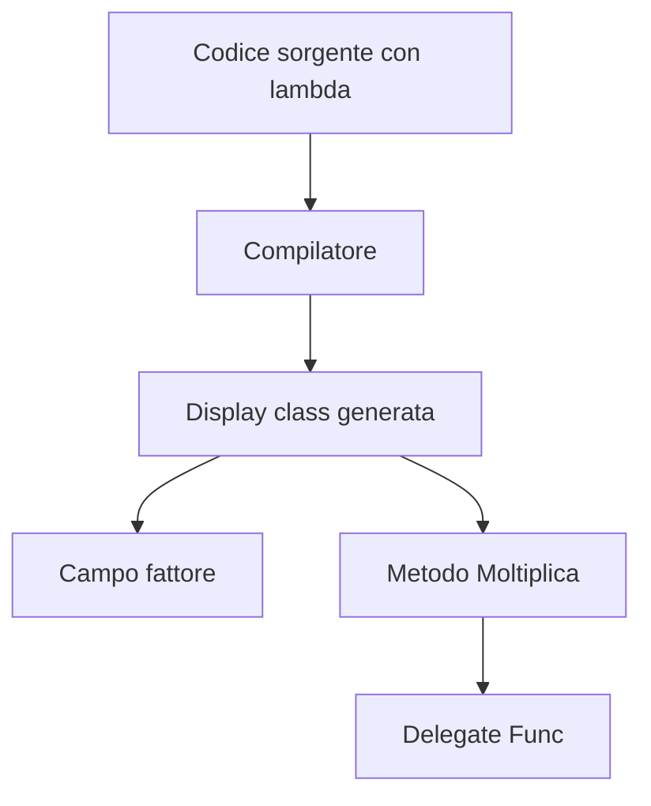
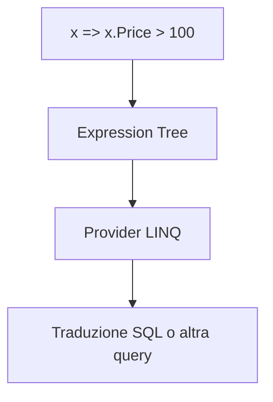

## 1. Introduzione

Le **lambda expressions** sono il modo più compatto e potente con cui il C# moderno rappresenta una funzione anonima.
Quando scrivi una lambda, stai descrivendo un comportamento che può essere:

- assegnato a un **delegate**;
- passato come **parametro**;
- restituito da un metodo;
- trasformato in un **expression tree**;
- usato per costruire query **LINQ**.

Dal punto di vista storico, l'idea non nasce in C#, ma nella logica matematica.

### 1.1 Origine matematica: lambda calculus

Nel 1936 **Alonzo Church** introdusse il **lambda calculus**, un formalismo matematico per descrivere funzioni, applicazione di funzioni e computazione.

Le due idee fondamentali sono:

- **astrazione**: definire una funzione;
- **applicazione**: applicare una funzione a un argomento.

La forma classica è:

$$
\lambda x . e
$$

dove:

- $x$ è il parametro;
- $e$ è il corpo dell'espressione.

Applicare la funzione a un valore significa sostituire il parametro con l'argomento:

$$
(\lambda x . e)(v) \to e[x := v]
$$

Esempio:

$$
(\lambda x . x + 1)(4) \to 5
$$

Questo formalismo è la base teorica di gran parte della **programmazione funzionale**.

### 1.2 Relazione con la programmazione funzionale

In programmazione funzionale una funzione è trattata come **valore di prima classe**:

- può essere passata come argomento;
- può essere restituita;
- può essere composta con altre funzioni;
- può catturare il contesto in cui è stata creata.

Le lambda expressions in C# portano proprio questa idea nel linguaggio object-oriented di .NET.

### 1.3 Introduzione in C#

Le lambda expressions sono state introdotte con **C# 3.0** nel **2007**, insieme a:

- **LINQ**;
- type inference migliorata;
- extension methods;
- anonymous types;
- expression trees.

Da quel momento il C# ha adottato un modello ibrido: orientato agli oggetti, ma con forti strumenti funzionali.

## 2. Sintassi

La sintassi base di una lambda è:

```cs
(parametri) => espressione
```

L'operatore `=>` si legge spesso come "va in" oppure "produce".

### 2.1 Expression lambda

Una **expression lambda** ha come corpo una singola espressione:

```cs
Func<int, int> raddoppia = x => x * 2;
Func<int, int, int> somma = (x, y) => x + y;
```

Se il corpo è una singola espressione, il valore viene restituito implicitamente.

### 2.2 Statement lambda

Una **statement lambda** usa un blocco di istruzioni:

```cs
Action<string> saluta = nome =>
{
    string messaggio = $"Ciao {nome}";
    Console.WriteLine(messaggio);
};
```

In questo caso, se il delegate ha un tipo di ritorno, devi usare `return` esplicito:

```cs
Func<int, int, int> max = (a, b) =>
{
    if (a > b)
        return a;

    return b;
};
```

### 2.3 Parentesi opzionali e lambda senza parametri

Con un solo parametro le parentesi possono essere omesse:

```cs
Func<int, int> quadrato = x => x * x;
```

Senza parametri servono sempre le parentesi vuote:

```cs
Action saluto = () => Console.WriteLine("ciao");
```

Con più parametri le parentesi sono obbligatorie:

```cs
Func<int, int, int> prodotto = (x, y) => x * y;
```

### 2.4 Tipo inferito dal contesto

Una lambda non ha un tipo "da sola".
Il tipo viene **inferito dal contesto di destinazione**:

```cs
Func<int, bool> pari = x => x % 2 == 0;
Predicate<string> vuota = s => string.IsNullOrWhiteSpace(s);
```

Qui è il compilatore che deduce:

- che `x` è un `int`;
- che il risultato deve essere `bool`;
- che la lambda deve essere convertita a `Func<int, bool>` o `Predicate<string>`.

### 2.5 Tipo esplicito dei parametri

Se vuoi puoi dichiarare esplicitamente i tipi:

```cs
Func<int, int, int> somma = (int x, int y) => x + y;
```

Questo è utile quando:

- vuoi rendere il codice più leggibile;
- l'inferenza non è immediata;
- stai lavorando con overload complessi.

### 2.6 Esempio panoramico

```cs
Action stampa = () => Console.WriteLine("Nessun parametro");
Func<int, int> doppio = x => x * 2;
Func<int, int, int> differenza = (x, y) => x - y;
Func<int, int> assoluto = (int x) => x < 0 ? -x : x;

stampa();
Console.WriteLine(doppio(5));
Console.WriteLine(differenza(10, 3));
Console.WriteLine(assoluto(-9));
```

## 3. Lambda e delegate

Una lambda in C# non vive nel vuoto: viene quasi sempre convertita in un **delegate** o in un **expression tree**.

### 3.1 Shorthand per delegate anonimo

Queste due forme sono concettualmente equivalenti:

```cs
Func<int, int> doppio1 = delegate (int x)
{
    return x * 2;
};

Func<int, int> doppio2 = x => x * 2;
```

La lambda è quindi una **shorthand sintattica** per rappresentare un delegate anonimo in modo più compatto.

### 3.2 Assegnazione a `Func`, `Action` e `Predicate`

Le lambda sono usate continuamente con i delegati generici predefiniti:

```cs
Action<string> log = messaggio => Console.WriteLine($"LOG: {messaggio}");
Func<decimal, decimal, decimal> sconto = (prezzo, percentuale) => prezzo * (1 - percentuale);
Predicate<int> positivo = n => n > 0;

log("Operazione completata");
Console.WriteLine(sconto(100m, 0.15m));
Console.WriteLine(positivo(42));
```

Riepilogo:

- `Action<T...>`: nessun valore di ritorno;
- `Func<T..., TResult>`: restituisce un valore;
- `Predicate<T>`: restituisce `bool`.

### 3.3 Assegnazione a un delegate personalizzato

Una lambda può essere assegnata anche a un delegato dichiarato da te:

```cs
public delegate decimal CalcoloPrezzo(decimal imponibile, decimal iva);

CalcoloPrezzo totale = (imponibile, iva) => imponibile + iva;

decimal risultato = totale(100m, 22m);
Console.WriteLine(risultato);
```

Questo è utile quando vuoi dare un **nome semantico** alla firma.

### 3.4 Lambda come callback

Molti metodi ricevono lambda come parametri:

```cs
public static void EseguiOperazione(int valore, Action<int> callback)
{
    Console.WriteLine("Elaborazione...");
    callback(valore);
}

EseguiOperazione(10, x => Console.WriteLine($"Risultato: {x * 3}"));
```

Qui la lambda è una **callback inline**: il chiamante definisce direttamente il comportamento da eseguire.

### 3.5 Conversione implicita e overload

La stessa lambda può essere compatibile con più target, ma il contesto decide la conversione:

```cs
Func<int, bool> filtro = x => x > 10;
Expression<Func<int, bool>> filtroEspressione = x => x > 10;
```

La sintassi è uguale, ma il risultato semantico è diverso:

- nel primo caso ottieni **codice eseguibile**;
- nel secondo una **struttura dati** che descrive il codice.

## 4. Closures

Una **closure** si verifica quando una lambda cattura variabili definite nel suo **outer scope**.

### 4.1 Definizione

```cs
int fattore = 3;
Func<int, int> moltiplica = x => x * fattore;

Console.WriteLine(moltiplica(10)); // 30
```

La lambda non usa solo il parametro `x`, ma anche la variabile esterna `fattore`.
Questo significa che la lambda "chiude sopra" il contesto in cui è nata.

### 4.2 Come funziona internamente

Quando una lambda cattura variabili, il compilatore genera una classe nascosta, spesso chiamata concettualmente **display class**, con:

- un campo per ogni variabile catturata;
- un metodo che contiene il corpo della lambda.

Esempio concettuale:

```cs
int fattore = 3;
Func<int, int> moltiplica = x => x * fattore;
```

viene trasformato in qualcosa di simile a:

```cs
private sealed class DisplayClass
{
    public int fattore;

    public int Moltiplica(int x)
    {
        return x * fattore;
    }
}

DisplayClass closure = new DisplayClass();
closure.fattore = 3;
Func<int, int> moltiplica = closure.Moltiplica;
```



### 4.3 La variabile catturata non viene copiata

Uno degli aspetti più importanti è questo: di solito viene catturata la **variabile**, non il suo valore al momento della creazione.

```cs
int contatore = 0;
Action incrementa = () => contatore++;

incrementa();
incrementa();

Console.WriteLine(contatore); // 2
```

La lambda sta lavorando sulla stessa variabile `contatore`.

### 4.4 Captured variable trap nei loop

Il problema classico compare nei cicli:

```cs
var azioni = new List<Action>();

for (int i = 0; i < 3; i++)
{
    azioni.Add(() => Console.WriteLine(i));
}

foreach (var azione in azioni)
{
    azione();
}
```

Molti principianti si aspettano:

```text
0
1
2
```

ma l'output tipico è:

```text
3
3
3
```

perché tutte le lambda catturano la stessa variabile `i`, che al termine del ciclo vale `3`.

### 4.5 Soluzione: variabile temporanea

La soluzione è creare una nuova variabile locale per ogni iterazione:

```cs
var azioni = new List<Action>();

for (int i = 0; i < 3; i++)
{
    int copia = i;
    azioni.Add(() => Console.WriteLine(copia));
}
```

Così ogni lambda cattura una variabile distinta.

### 4.6 `for` e `foreach`

Storicamente il problema era molto noto con `foreach`.
Le versioni moderne di C# hanno corretto il comportamento di `foreach`, ma con `for` la regola resta concettualmente importante:

- se catturi una variabile che cambia, tutte le lambda osserveranno quel cambiamento;
- se vuoi congelare il valore, crea una variabile temporanea.

### 4.7 Lifetime della variabile catturata

Una variabile locale normale vive sullo stack del metodo.
Una variabile catturata, invece, deve sopravvivere finché la lambda esiste.

In termini concettuali:

$$
Lifetime(captured\ variable) \ge Lifetime(delegate)
$$

Questo significa che la closure può estendere la vita di oggetti che altrimenti sarebbero stati rilasciati prima.

### 4.8 Implicazioni pratiche

Le closure sono utilissime, ma possono introdurre:

- allocazioni aggiuntive;
- riferimenti indesiderati a oggetti grandi;
- bug difficili da vedere;
- comportamento sorprendente in codice asincrono o nei loop.

## 5. Expression lambda vs Statement lambda

Non tutte le lambda sono equivalenti.
La differenza più importante è tra **expression lambda** e **statement lambda**.

### 5.1 Expression lambda

Una expression lambda ha un solo nodo espressivo:

```cs
Func<int, bool> pari = x => x % 2 == 0;
```

Questa forma può essere convertita sia in un delegate sia, in molti casi, in un **expression tree**:

```cs
Expression<Func<int, bool>> expr = x => x % 2 == 0;
```

Un expression tree non esegue direttamente il codice: lo rappresenta come struttura ad albero.



### 5.2 Statement lambda

Una statement lambda usa un blocco:

```cs
Func<int, bool> test = x =>
{
    Console.WriteLine($"Controllo {x}");
    return x % 2 == 0;
};
```

Questa forma è perfetta per callback e logica in memoria, ma **non** può essere convertita nello stesso modo a un expression tree traducibile da provider come Entity Framework Core.

### 5.3 `Func<T, TResult>` vs `Expression<Func<T, TResult>>`

Questa è una distinzione fondamentale:

```cs
Func<Prodotto, bool> filtroInMemoria = p => p.Prezzo > 100;
Expression<Func<Prodotto, bool>> filtroTraducibile = p => p.Prezzo > 100;
```

Nel primo caso:

- il codice viene eseguito dal runtime .NET;
- tipico di `IEnumerable<T>` e LINQ to Objects.

Nel secondo caso:

- il provider legge la struttura dell'espressione;
- può tradurla in SQL, API query, regole, filtri remoti;
- tipico di `IQueryable<T>` ed **EF Core**.

### 5.4 Perché EF Core usa expression tree

Con EF Core:

```cs
var query = db.Prodotti.Where(p => p.Prezzo > 100);
```

se `Prodotti` è `IQueryable<Prodotto>`, la lambda non viene eseguita subito su ogni record.
Viene prima analizzata e tradotta in qualcosa di simile a:

```sql
SELECT *
FROM Prodotti
WHERE Prezzo > 100
```

Se usassi una lambda non traducibile, per esempio con logica arbitraria o statement body, il provider potrebbe:

- lanciare un'eccezione;
- oppure spostare parte del lavoro lato client, con impatto prestazionale.

## 6. Lambda con LINQ

LINQ è il terreno naturale delle lambda expressions.

### 6.1 `Where`, `Select` e chaining

Supponiamo di avere:

```cs
public class Studente
{
    public string Nome { get; set; } = "";
    public int Eta { get; set; }
    public string Corso { get; set; } = "";
    public List<int> Voti { get; set; } = new();
}

var studenti = new List<Studente>
{
    new() { Nome = "Anna", Eta = 21, Corso = "Informatica", Voti = new() { 28, 30, 27 } },
    new() { Nome = "Luca", Eta = 19, Corso = "Matematica", Voti = new() { 18, 24, 21 } },
    new() { Nome = "Marta", Eta = 23, Corso = "Informatica", Voti = new() { 30, 29, 30 } },
    new() { Nome = "Paolo", Eta = 22, Corso = "Fisica", Voti = new() { 25, 26, 24 } }
};

var risultati = studenti
    .Where(s => s.Corso == "Informatica")
    .Select(s => new
    {
        s.Nome,
        Media = s.Voti.Average()
    })
    .OrderByDescending(s => s.Media)
    .ToList();
```

Qui le lambda descrivono l'intera pipeline:

- filtro con `Where`;
- proiezione con `Select`;
- ordinamento con `OrderByDescending`.

Costo concettuale in memoria:

$$
T_{Where+Select}(n) = O(n)
$$

mentre un ordinamento aggiunge tipicamente:

$$
T_{OrderBy}(n) = O(n \log n)
$$

### 6.2 `GroupBy`

```cs
var gruppiPerCorso = studenti
    .GroupBy(s => s.Corso)
    .Select(g => new
    {
        Corso = g.Key,
        NumeroStudenti = g.Count(),
        MediaCorso = g.SelectMany(s => s.Voti).Average()
    });
```

La lambda di `GroupBy` sceglie la chiave di raggruppamento.

### 6.3 `Join`

```cs
var docenti = new[]
{
    new { Corso = "Informatica", Docente = "Prof.ssa Rinaldi" },
    new { Corso = "Matematica", Docente = "Prof. Greco" },
    new { Corso = "Fisica", Docente = "Prof. Neri" }
};

var piano = studenti.Join(
    docenti,
    studente => studente.Corso,
    docente => docente.Corso,
    (studente, docente) => new
    {
        studente.Nome,
        studente.Corso,
        docente.Docente
    });
```

Le lambda del `Join` definiscono:

- chiave sinistra;
- chiave destra;
- proiezione finale.

### 6.4 `Aggregate`

`Aggregate` è uno dei metodi più "funzionali" di LINQ:

```cs
int sommaVotiAnna = studenti
    .First(s => s.Nome == "Anna")
    .Voti
    .Aggregate(0, (acc, voto) => acc + voto);
```

Qui la lambda riceve:

- l'accumulatore corrente;
- l'elemento corrente;
- e produce il nuovo accumulatore.

### 6.5 Query syntax vs method syntax

La query syntax:

```cs
var query =
    from s in studenti
    where s.Eta >= 21
    orderby s.Nome
    select s.Nome;
```

viene tradotta dal compilatore in method syntax:

```cs
var query = studenti
    .Where(s => s.Eta >= 21)
    .OrderBy(s => s.Nome)
    .Select(s => s.Nome);
```

La query syntax è spesso più leggibile in query complesse con join multipli.
La method syntax è più uniforme e mette in primo piano le lambda.

### 6.6 Esempio completo con collezioni complesse

```cs
public class Ordine
{
    public int Id { get; set; }
    public string Cliente { get; set; } = "";
    public string Citta { get; set; } = "";
    public List<RigaOrdine> Righe { get; set; } = new();
}

public class RigaOrdine
{
    public string Prodotto { get; set; } = "";
    public int Quantita { get; set; }
    public decimal PrezzoUnitario { get; set; }
}

var ordini = new List<Ordine>
{
    new()
    {
        Id = 1,
        Cliente = "Alfa Srl",
        Citta = "Milano",
        Righe = new()
        {
            new() { Prodotto = "Monitor", Quantita = 2, PrezzoUnitario = 180m },
            new() { Prodotto = "Mouse", Quantita = 5, PrezzoUnitario = 20m }
        }
    },
    new()
    {
        Id = 2,
        Cliente = "Beta Spa",
        Citta = "Roma",
        Righe = new()
        {
            new() { Prodotto = "Notebook", Quantita = 1, PrezzoUnitario = 1200m },
            new() { Prodotto = "Dock", Quantita = 2, PrezzoUnitario = 90m }
        }
    },
    new()
    {
        Id = 3,
        Cliente = "Gamma Srl",
        Citta = "Milano",
        Righe = new()
        {
            new() { Prodotto = "Monitor", Quantita = 1, PrezzoUnitario = 220m },
            new() { Prodotto = "Tastiera", Quantita = 3, PrezzoUnitario = 45m }
        }
    }
};

var report = ordini
    .Where(o => o.Citta == "Milano")
    .Select(o => new
    {
        o.Cliente,
        Totale = o.Righe.Sum(r => r.Quantita * r.PrezzoUnitario),
        Prodotti = o.Righe.Select(r => r.Prodotto).ToList()
    })
    .OrderByDescending(x => x.Totale)
    .ToList();
```

Questo esempio mostra lambda annidate in:

- `Where`;
- `Select`;
- `Sum`;
- `Select` interno;
- `OrderByDescending`.

## 7. Lambda ricorsive

Le lambda in C# non hanno un nome intrinseco come i metodi.
Per questo non puoi scrivere una ricorsione diretta "naturale" nel corpo senza un appoggio esterno.

### 7.1 Perché non si ricorre direttamente

Questa forma non è praticabile come un metodo nominato:

```cs
// concettualmente desiderato, ma non esiste un nome interno della lambda
// n => n <= 1 ? 1 : n * ???(n - 1)
```

Serve una variabile locale che contenga il delegate.

### 7.2 Pattern per lambda ricorsiva

```cs
Func<int, int>? fattoriale = null;

fattoriale = n => n <= 1 ? 1 : n * fattoriale!(n - 1);

Console.WriteLine(fattoriale(5)); // 120
```

Oppure con una firma più esplicita:

```cs
Func<int, long>? fibonacci = null;

fibonacci = n =>
{
    if (n <= 1)
        return n;

    return fibonacci!(n - 1) + fibonacci!(n - 2);
};
```

Funziona, ma non è sempre la soluzione più leggibile.

### 7.3 Confronto con le local functions

Lo stesso fattoriale con una local function:

```cs
static int Fattoriale(int n)
{
    if (n <= 1)
        return 1;

    return n * Fattoriale(n - 1);
}
```

oppure dentro un metodo:

```cs
int Calcola(int valore)
{
    static int Fattoriale(int n)
    {
        if (n <= 1)
            return 1;

        return n * Fattoriale(n - 1);
    }

    return Fattoriale(valore);
}
```

Per ricorsione vera, la local function di solito è più naturale.

## 8. Local functions vs lambda

Lambda e local functions non sono intercambiabili in tutto.

### 8.1 Quando preferire una local function

Una **local function** è spesso migliore quando:

- hai bisogno di **ricorsione**;
- vuoi usare parametri `ref`, `out` o `in`;
- vuoi un nome locale che renda il codice più leggibile;
- vuoi evitare closure con una `static local function`.

Esempio con `ref`:

```cs
void Incrementa(ref int x)
{
    x++;
}
```

Una lambda non può esporre la stessa ergonomia in tutti questi scenari.

### 8.2 Quando preferire una lambda

La lambda è ideale quando:

- devi passare un comportamento inline;
- stai scrivendo una query LINQ;
- vuoi una callback breve;
- il codice è piccolo e locale al punto d'uso.

```cs
var nomi = new[] { "anna", "luca", "marta" };
var maiuscoli = nomi.Select(n => n.ToUpperInvariant()).ToList();
```

### 8.3 `static local function`

Una `static local function` non può catturare variabili esterne.
Questo porta due vantaggi:

- evita closure accidentali;
- può eliminare allocazioni inutili.

```cs
int[] dati = [1, 2, 3, 4];
int soglia = 2;

var filtrati = dati.Where(static x => x > 2).ToArray();
```

La stessa idea vale per le **static lambda** introdotte in C# 9:

```cs
Func<int, int> triplo = static x => x * 3;
```

Se provi a catturare variabili esterne, il compilatore segnala errore.

### 8.4 Sintesi pratica

- **Local function**: logica locale strutturata, ricorsione, ref/out, migliore nominazione.
- **Lambda**: callback inline, LINQ, composizione rapida, codice breve.

## 9. Performance delle lambda

Le lambda sono comode, ma non sono sempre "gratis".

### 9.1 Lambda senza closure

Se una lambda **non cattura** variabili esterne:

```cs
Func<int, int> doppio = x => x * 2;
```

il compilatore/runtime può spesso ottimizzare la situazione e riusare istanze delegate già create.

Costo concettuale:

$$
M_{no\ capture} \approx 0\ allocazioni\ per\ invocazione
$$

ovvero nessuna nuova allocazione ad ogni chiamata del delegate.

### 9.2 Lambda con closure

Se invece catturi variabili esterne:

```cs
int fattore = 2;
Func<int, int> moltiplica = x => x * fattore;
```

in genere servono:

- una display class;
- un delegate che punta al metodo generato.

Costo concettuale:

$$
M_{capture} = O(1)\ allocazioni\ addizionali
$$

per ogni creazione della closure, non per ogni singola invocazione.

### 9.3 Benchmark concettuale

Confronto tipico:

```cs
Func<int, int> senzaCapture = static x => x * 2;

int fattore = 2;
Func<int, int> conCapture = x => x * fattore;
```

In un benchmark reale, la seconda forma può mostrare:

- più allocazioni;
- maggiore pressione sul GC;
- overhead visibile in codice molto caldo.

Questo non significa "non usare mai closure", ma **usarle consapevolmente**.

### 9.4 Static lambda in C# 9

La `static lambda` serve proprio a impedire catture accidentali:

```cs
var numeri = Enumerable.Range(1, 5);
var quadrati = numeri.Select(static n => n * n).ToList();
```

Se scrivessi:

```cs
int offset = 10;
var valori = numeri.Select(static n => n + offset).ToList();
```

il compilatore lo rifiuterebbe, perché una lambda `static` non può catturare `offset`.

### 9.5 Regola pratica

Le lambda sono quasi sempre perfette nel codice applicativo.
L'attenzione alle allocazioni diventa importante soprattutto in:

- librerie;
- hot path;
- elaborazione massiva;
- codice realtime o ad altissima frequenza.

## 10. Lambda in programmazione funzionale in C#

Le lambda permettono di applicare vari pattern funzionali anche in C#.

### 10.1 Currying manuale

Il **currying** trasforma una funzione con più argomenti in una catena di funzioni con un argomento alla volta.

```cs
Func<int, Func<int, int>> sommaCurried = x => y => x + y;

var aggiungi10 = sommaCurried(10);
Console.WriteLine(aggiungi10(5)); // 15
```

In notazione teorica:

$$
f : (A \times B) \to C
$$

può essere trasformata in:

$$
f' : A \to (B \to C)
$$

### 10.2 Partial application

La **partial application** consiste nel fissare alcuni argomenti per ottenere una funzione più specializzata.

```cs
Func<decimal, decimal, decimal> applicaSconto = (prezzo, percentuale) => prezzo * (1 - percentuale);
Func<decimal, decimal> scontoBlackFriday = prezzo => applicaSconto(prezzo, 0.30m);

Console.WriteLine(scontoBlackFriday(200m)); // 140
```

### 10.3 Composizione di funzioni

Una utility di composizione:

```cs
static Func<TInput, TOutput> Compose<TInput, TMiddle, TOutput>(
    Func<TMiddle, TOutput> g,
    Func<TInput, TMiddle> f)
{
    return x => g(f(x));
}

Func<int, int> doppio = x => x * 2;
Func<int, string> formatta = x => $"Valore: {x}";

var pipeline = Compose(formatta, doppio);
Console.WriteLine(pipeline(5)); // Valore: 10
```

Formalmente:

$$
(g \circ f)(x) = g(f(x))
$$

### 10.4 Pipeline operator pattern

Il C# non ha un vero pipeline operator come altri linguaggi, ma puoi simulare il pattern:

```cs
public static class FunctionalExtensions
{
    public static TResult Pipe<TSource, TResult>(
        this TSource value,
        Func<TSource, TResult> func)
    {
        return func(value);
    }
}

string output = 5
    .Pipe(x => x * 2)
    .Pipe(x => x + 1)
    .Pipe(x => $"Risultato finale: {x}");

Console.WriteLine(output);
```

Questa tecnica rende visibile il flusso trasformativo dei dati.

## 11. Anti-pattern e best practice

Le lambda sono uno strumento molto espressivo, ma possono rendere il codice peggiore se usate male.

### 11.1 Anti-pattern comuni

- usare lambda molto lunghe dentro una query, rendendo il codice illeggibile;
- catturare variabili mutate nei loop senza volerlo;
- mettere logica di business complessa in callback anonime sparse;
- usare lambda quando una local function nominata sarebbe più chiara;
- passare lambda non traducibili a provider `IQueryable`;
- ignorare il costo delle closure in punti critici.

### 11.2 Best practice

- tieni le lambda **brevi e focalizzate**;
- usa nomi espliciti nelle variabili che contengono delegate;
- se il corpo cresce, estrai in **metodo** o **local function**;
- usa `static` quando vuoi impedire capture accidentali;
- con `IQueryable`, scrivi lambda **traducibili**;
- nei loop, crea una copia locale del valore da catturare;
- preferisci delegate standard (`Func`, `Action`, `Predicate`) quando la firma è banale;
- usa delegate personalizzati quando il significato semantico della firma conta.

### 11.3 Modello mentale finale

Una lambda in C# può essere vista come uno di questi tre ruoli:

1. **codice eseguibile** convertito in delegate;
2. **struttura dati** convertita in expression tree;
3. **closure** che porta con sé parte dell'ambiente esterno.

Capire quale dei tre stai usando, in ogni punto del codice, è la chiave per non sbagliare.

## 12. Quiz

import Quiz from '../../../components/Quiz.jsx';

<Quiz client:load questions={[
{
question:"Da quale formalismo matematico deriva il concetto moderno di lambda expression?",
answers:{
a:"Teoria dei grafi",
b:"Lambda calculus di Alonzo Church",
c:"Macchine di Turing a stati finiti",
d:"Calcolo vettoriale"
},
correctAnswer:"b"
},
{
question:"Quale sintassi rappresenta correttamente una lambda expression in C#?",
answers:{
a:"function(x) -> x * 2",
b:"lambda x: x * 2",
c:"x => x * 2",
d:"x -> x * 2"
},
correctAnswer:"c"
},
{
question:"Quale forma è una statement lambda?",
answers:{
a:"x => x + 1",
b:"() => Console.WriteLine(\"ciao\")",
c:"x => { Console.WriteLine(x); return x + 1; }",
d:"delegate int x => x + 1"
},
correctAnswer:"c"
},
{
question:"Una lambda in C# viene tipicamente convertita in:",
answers:{
a:"Solo una classe astratta",
b:"Un delegate o un expression tree",
c:"Solo un metodo statico globale",
d:"Una struct stack-only"
},
correctAnswer:"b"
},
{
question:"Cosa significa che una lambda crea una closure?",
answers:{
a:"Che non può essere assegnata a Func",
b:"Che viene sempre eseguita asincronamente",
c:"Che cattura variabili dell'outer scope",
d:"Che può essere usata solo in LINQ"
},
correctAnswer:"c"
},
{
question:"Qual è il problema classico quando si cattura la variabile di un ciclo for?",
answers:{
a:"La lambda non compila",
b:"Tutte le lambda possono vedere lo stesso valore finale della variabile",
c:"La lambda diventa automaticamente static",
d:"Il delegate perde il tipo di ritorno"
},
correctAnswer:"b"
},
{
question:"Qual è la differenza chiave tra Func<T, bool> ed Expression<Func<T, bool>>?",
answers:{
a:"La seconda può descrivere il codice come albero di espressione",
b:"La prima non può essere invocata",
c:"La seconda è sempre più veloce",
d:"La prima funziona solo con IEnumerable"
},
correctAnswer:"a"
},
{
question:"Perché EF Core usa spesso Expression<Func<T, TResult>>?",
answers:{
a:"Per generare automaticamente interfacce",
b:"Per tradurre le lambda in query come SQL",
c:"Per evitare qualsiasi allocazione",
d:"Per eseguire il codice solo sul client"
},
correctAnswer:"b"
},
{
question:"Quando una local function è spesso preferibile a una lambda?",
answers:{
a:"Quando serve ricorsione o maggiore leggibilità locale",
b:"Quando si usa sempre LINQ",
c:"Quando si vuole catturare più variabili possibili",
d:"Quando si vuole evitare nomi nel codice"
},
correctAnswer:"a"
},
{
question:"Cosa garantisce una static lambda?",
answers:{
a:"Che venga eseguita in parallelo",
b:"Che non catturi variabili esterne",
c:"Che sia traducibile in SQL",
d:"Che non restituisca mai null"
},
correctAnswer:"b"
}
]} />

## 13. Esercizi

### 13.1 Esercizio

**Scenario**:
Stai sviluppando un pannello amministrativo per un e-commerce e vuoi permettere agli operatori di applicare filtri dinamici ai prodotti.

**Consegna**:

1. Crea una classe `Prodotto` con proprietà `Nome`, `Categoria`, `Prezzo`, `Disponibile`.
2. Crea una lista di almeno 8 prodotti.
3. Implementa un metodo `FiltraProdotti(List<Prodotto> prodotti, Func<Prodotto, bool> filtro)`.
4. Usa il metodo con tre lambda diverse:
   - prodotti disponibili;
   - prodotti con prezzo maggiore di 100;
   - prodotti della categoria "Monitor" con prezzo inferiore a 300.
5. Stampa il risultato di ogni filtro.

*Obiettivo didattico: usare le lambda come callback riutilizzabili e capire il ruolo di `Func<T, bool>` nei filtri dinamici.*

### 13.2 Esercizio

**Scenario**:
Vuoi costruire un piccolo modulo analytics per analizzare gli ordini di un gestionale.

**Consegna**:

1. Crea le classi `Ordine` e `RigaOrdine`.
2. Ogni ordine deve avere `Cliente`, `Citta` e una lista di righe con `Prodotto`, `Quantita`, `PrezzoUnitario`.
3. Usa LINQ con lambda per ottenere:
   - il totale di ogni ordine;
   - gli ordini della città "Milano";
   - il fatturato totale per cliente;
   - il prodotto più venduto in quantità.
4. Riscrivi almeno una delle query usando query syntax e confrontala con la method syntax.

*Obiettivo didattico: consolidare `Where`, `Select`, `GroupBy`, `SelectMany` e `Aggregate` in uno scenario realistico.*

### 13.3 Esercizio

**Scenario**:
Stai implementando un motore di regole per assegnare sconti a clienti premium.

**Consegna**:

1. Crea un delegate o usa `Func<decimal, decimal>` per rappresentare una trasformazione di prezzo.
2. Implementa tre lambda:
   - sconto del 10%;
   - sconto del 20%;
   - sconto del 10% seguito da IVA al 22%.
3. Crea una utility `Compose` per comporre due funzioni.
4. Mostra come ottenere una pipeline di trasformazioni da applicare a un prezzo iniziale.
5. Spiega, nel codice o a voce, dove stai facendo currying, partial application o composizione.

*Obiettivo didattico: applicare pattern funzionali reali con lambda annidate e composizione di funzioni.*

### 13.4 Esercizio

**Scenario**:
Hai una coda di job da eseguire in background e vuoi registrare callback diverse per successo, errore e retry.

**Consegna**:

1. Crea una classe `JobRunner` con un metodo `Esegui(string nomeJob, Action<string> onSuccess, Action<string> onError)`.
2. Simula l'esecuzione di più job, facendo fallire almeno uno.
3. Usa lambda inline come callback per:
   - scrivere su console;
   - incrementare contatori esterni;
   - salvare i job falliti in una lista.
4. Riproduci volontariamente un caso di closure in un ciclo e osserva il problema.
5. Correggi il bug introducendo una variabile temporanea locale nel loop.

*Obiettivo didattico: comprendere callback, closure, lifetime delle variabili catturate e bug classici nei loop.*
