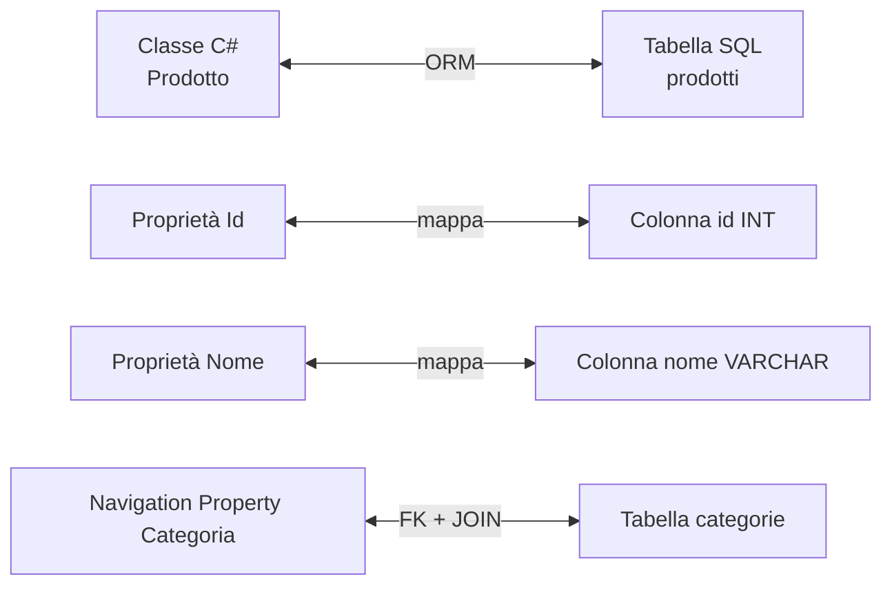
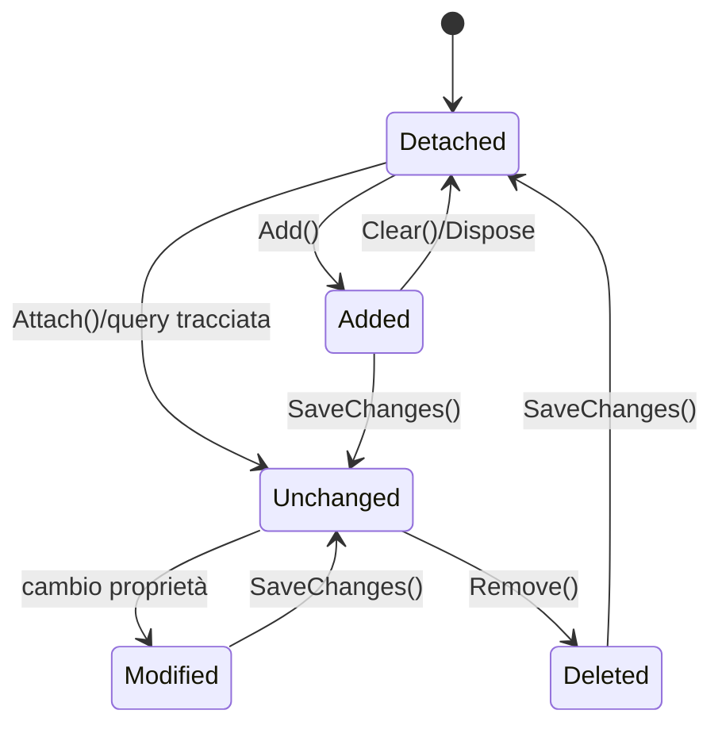
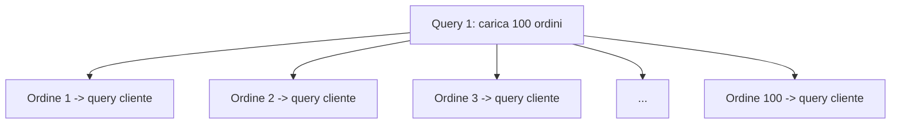

## 1. Cos'è un ORM

Un **ORM (Object-Relational Mapper)** è un livello software che traduce il mondo **object-oriented** del codice C# nel mondo **relazionale** del database. In pratica, invece di ragionare direttamente in termini di `SELECT`, `INSERT`, `UPDATE` e `DELETE`, lavori con **classi**, **oggetti**, **collezioni** e **query LINQ**.



Il principale ORM in C# è **Entity Framework Core (EF Core)**, sviluppato da Microsoft.

### 1.1 Perché usare un ORM

Un ORM riduce il codice ripetitivo e centralizza la logica di accesso ai dati:

- Scrivi **C#** invece di SQL manuale nella maggior parte dei casi.
- Ottieni **type safety**: rinominare una proprietà in C# può far emergere errori in compilazione, invece che a runtime.
- Puoi usare **LINQ**, che esprime query in modo dichiarativo.
- Gestisci l'evoluzione dello schema tramite **migrazioni**.
- Mantieni una separazione più netta tra **modello di dominio** e accesso ai dati.

### 1.2 Cosa fa davvero EF Core

EF Core non è semplicemente un generatore di SQL. Al suo interno:

1. costruisce un **modello** delle entity;
2. traduce una query LINQ in SQL;
3. esegue il comando sul provider del database;
4. materializza i risultati in oggetti C#;
5. opzionalmente **traccia** gli oggetti nel `ChangeTracker`;
6. calcola le modifiche e produce gli `UPDATE`/`INSERT`/`DELETE` necessari.

### 1.3 Trade-off

Un ORM accelera lo sviluppo, ma non elimina la necessità di capire il database:

- una query LINQ può generare SQL inefficiente se scritta male;
- alcune operazioni avanzate restano più semplici in SQL puro;
- il tracking ha un costo in memoria e CPU;
- per scenari ad altissima performance può servire una strategia ibrida.

In termini teorici, se materializzi `n` righe con `p` proprietà tracciate, il costo minimo è almeno proporzionale a:

$$
T(n, p) \in \Omega(n \cdot p)
$$

perché ogni riga e ogni proprietà significativa devono essere lette, convertite e assegnate.

## 2. Approcci in EF Core

| Approccio | Descrizione |
|---|---|
| **Code First** | Definisci le classi C# e la configurazione → EF genera o aggiorna il database |
| **Database First** | Parti da un database esistente → EF genera classi e configurazioni |

Il più comune è **Code First**, perché si integra bene con Git, review del codice, test e migrazioni versionate.

### 2.1 Code First

È ideale quando il dominio dell'applicazione nasce nel codice. Le entity diventano la fonte principale della struttura dati.

Vantaggi:
- modello vicino al dominio applicativo;
- schema tracciato nel repository;
- migrazioni ripetibili in ogni ambiente;
- refactoring più naturale.

### 2.2 Database First

È utile quando lavori su un database legacy o condiviso con altri sistemi. In questo caso EF Core si adatta allo schema esistente invece di guidarlo.

### 2.3 Approccio ibrido

Molti progetti reali usano un approccio misto:
- **EF Core** per CRUD, aggregati, relazioni e migrazioni;
- **SQL raw** o strumenti come **Dapper** per reportistica o query iper-ottimizzate.

## 3. Installazione

```bash
dotnet add package Microsoft.EntityFrameworkCore
dotnet add package Microsoft.EntityFrameworkCore.SqlServer   # per SQL Server
dotnet add package Microsoft.EntityFrameworkCore.Sqlite      # per SQLite
dotnet add package Microsoft.EntityFrameworkCore.Tools       # per le migrazioni
```

Pacchetti spesso utili in progetti reali:

```bash
dotnet add package Microsoft.EntityFrameworkCore.Design
dotnet add package Microsoft.EntityFrameworkCore.Proxies      # per lazy loading tramite proxy
```

### 3.1 Provider

EF Core è composto da un nucleo comune e da provider specifici:

- SQL Server
- PostgreSQL
- SQLite
- MySQL/MariaDB
- provider in-memory per test

Il provider influisce su:
- SQL generato;
- tipi supportati;
- traduzioni LINQ disponibili;
- funzionalità avanzate come savepoint o strategie di concorrenza.

## 4. Entity (Modello)

Le **entity** sono classi C# che rappresentano i dati persistiti. In genere corrispondono a tabelle, ma il mapping non è sempre 1:1: EF Core può gestire proprietà ombra, owned types, ereditarietà e persino più tipi sulla stessa tabella.

```cs
public class Prodotto
{
    public int Id { get; set; }           // PK (per convenzione: Id o ProdottoId)
    public string Nome { get; set; } = "";
    public decimal Prezzo { get; set; }
    public int QuantitaInStock { get; set; }

    // Navigation property → relazione con Categoria
    public int CategoriaId { get; set; }
    public Categoria? Categoria { get; set; }
}

public class Categoria
{
    public int Id { get; set; }
    public string Nome { get; set; } = "";

    // Collection navigation property
    public ICollection<Prodotto> Prodotti { get; set; } = new List<Prodotto>();
}
```

### 4.1 Convenzioni, chiavi e proprietà

EF Core usa molte **convenzioni**:

- `Id` o `NomeClasseId` come chiave primaria;
- proprietà scalari come colonne;
- reference navigation come relazione uno-a-uno o molti-a-uno;
- collection navigation come relazione uno-a-molti o molti-a-molti.

Quando le convenzioni non bastano, intervengono **Data Annotations** o **Fluent API**.

### 4.2 Shadow properties

Una **shadow property** è una proprietà presente nel modello EF ma **non dichiarata nella classe C#**. È utile quando vuoi memorizzare dati infrastrutturali senza sporcare il dominio.

Esempi tipici:
- `CreatedAt`
- `UpdatedAt`
- `TenantId`
- `IsDeleted`

```cs
protected override void OnModelCreating(ModelBuilder modelBuilder)
{
    modelBuilder.Entity<Prodotto>()
        .Property<DateTime>("CreatedAt");

    modelBuilder.Entity<Prodotto>()
        .Property<bool>("IsDeleted")
        .HasDefaultValue(false);
}
```

Accesso a runtime:

```cs
var entry = _context.Entry(prodotto);
entry.Property("CreatedAt").CurrentValue = DateTime.UtcNow;
```

Sono comode, ma vanno usate con criterio: essendo invisibili nella classe, il codice è meno esplicito.

### 4.3 Owned entities

Le **owned entities** permettono di mappare un **Value Object** del dominio senza trasformarlo in un aggregate root separato. Sono molto utili quando un oggetto ha significato solo all'interno del proprietario.

```cs
public class Ordine
{
    public int Id { get; set; }
    public IndirizzoSpedizione IndirizzoSpedizione { get; set; } = new();
}

public class IndirizzoSpedizione
{
    public string Via { get; set; } = "";
    public string Citta { get; set; } = "";
    public string CAP { get; set; } = "";
}
```

```cs
protected override void OnModelCreating(ModelBuilder modelBuilder)
{
    modelBuilder.Entity<Ordine>().OwnsOne(o => o.IndirizzoSpedizione, owned =>
    {
        owned.Property(i => i.Via).HasMaxLength(150);
        owned.Property(i => i.Citta).HasMaxLength(100);
        owned.Property(i => i.CAP).HasMaxLength(10);
    });
}
```

Per default le proprietà owned vengono spesso salvate nella stessa tabella del proprietario, con colonne tipo:
- `IndirizzoSpedizione_Via`
- `IndirizzoSpedizione_Citta`
- `IndirizzoSpedizione_CAP`

Questo approccio è molto vicino al concetto di **Value Object** di Domain-Driven Design.

### 4.4 Table splitting

Con il **table splitting** più tipi .NET condividono la **stessa tabella**. È utile quando vuoi dividere logicamente un'entità grande in componenti più leggibili senza cambiare la struttura fisica del database.

```cs
modelBuilder.Entity<Ordine>(entity =>
{
    entity.ToTable("Ordini");
    entity.OwnsOne(o => o.IndirizzoSpedizione);
});
```

Dal punto di vista fisico hai una tabella sola; dal punto di vista del modello hai un oggetto composto.

### 4.5 Ereditarietà: TPH, TPT, TPC

EF Core supporta varie strategie di mapping dell'ereditarietà.

#### TPH - Table Per Hierarchy

Tutta la gerarchia in una singola tabella con una colonna discriminatore.

Vantaggi:
- meno join;
- query spesso più veloci.

Svantaggi:
- molte colonne nullable.

```cs
public abstract class Pagamento
{
    public int Id { get; set; }
    public decimal Importo { get; set; }
}

public class PagamentoCarta : Pagamento
{
    public string Circuito { get; set; } = "";
}

public class PagamentoBonifico : Pagamento
{
    public string Iban { get; set; } = "";
}
```

#### TPT - Table Per Type

Una tabella per il tipo base e una per ogni tipo derivato.

Vantaggi:
- schema più normalizzato.

Svantaggi:
- query più costose per via dei join.

Se `k` è il numero di tabelle coinvolte nella gerarchia, il costo logico di una query completa cresce con i join richiesti, quindi in pratica tende ad aumentare con `k`.

#### TPC - Table Per Concrete Type

Ogni tipo concreto ha una propria tabella completa, con duplicazione delle colonne ereditate.

Vantaggi:
- nessun join tra base e derivato.

Svantaggi:
- duplicazione dello schema.

Regola pratica:
- **TPH** per semplicità e performance generali;
- **TPT** se la leggibilità relazionale è più importante dei costi di join;
- **TPC** in casi specifici dove vuoi tabelle separate e query su tipi concreti.

## 5. DbContext

Il `DbContext` è il **cuore di EF Core**: rappresenta la sessione con il database, mantiene il **modello**, espone i `DbSet<T>` e contiene il **Change Tracker**.

```cs
public class AppDbContext : DbContext
{
    public DbSet<Prodotto> Prodotti { get; set; }
    public DbSet<Categoria> Categorie { get; set; }

    public AppDbContext(DbContextOptions<AppDbContext> options)
        : base(options) { }

    protected override void OnModelCreating(ModelBuilder modelBuilder)
    {
        // Configurazione Fluent API (alternativa alle Data Annotations)
        modelBuilder.Entity<Prodotto>(entity =>
        {
            entity.HasKey(p => p.Id);
            entity.Property(p => p.Nome)
                  .IsRequired()
                  .HasMaxLength(100);
            entity.Property(p => p.Prezzo)
                  .HasColumnType("decimal(18,2)");
        });

        modelBuilder.Entity<Categoria>()
            .HasMany(c => c.Prodotti)
            .WithOne(p => p.Categoria)
            .HasForeignKey(p => p.CategoriaId);
    }
}
```

### Registrazione in Program.cs

```cs
builder.Services.AddDbContext<AppDbContext>(options =>
    options.UseSqlite("Data Source=app.db")); // o UseSqlServer(...)
```

### 5.1 Ciclo di vita del DbContext

In applicazioni web il `DbContext` viene normalmente registrato come **scoped**: una istanza per richiesta HTTP. È importante non trattarlo come singleton.

Motivi:
- non è progettato per uso concorrente tra thread;
- accumula entità tracciate;
- un contesto troppo longevo aumenta memoria e rischio di bug logici.

### 5.2 Change Tracker in profondità

Il **Change Tracker** memorizza lo stato delle entità note al contesto. Ogni entità può trovarsi in uno di questi stati:

| Stato | Significato |
|---|---|
| **Added** | L'entità è nuova e verrà inserita con `INSERT` |
| **Modified** | L'entità esiste già e una o più proprietà sono cambiate |
| **Deleted** | L'entità verrà rimossa con `DELETE` |
| **Unchanged** | L'entità è tracciata ma non ha modifiche |
| **Detached** | L'entità non è tracciata dal contesto |



Quando chiami `SaveChangesAsync()`, EF Core:

1. esegue il rilevamento delle modifiche;
2. calcola i comandi SQL necessari;
3. li invia in transazione;
4. aggiorna gli stati delle entità.

### 5.3 Identity map

Il `DbContext` mantiene una **identity map**: per una certa chiave primaria, nella stessa istanza di contesto esiste una sola istanza tracciata dell'entità.

Esempio concettuale:

```cs
var p1 = await _context.Prodotti.FindAsync(1);
var p2 = await _context.Prodotti.FirstAsync(p => p.Id == 1);

Console.WriteLine(ReferenceEquals(p1, p2)); // true se entrambe sono tracciate
```

Questo evita incoerenze in memoria. Se due query restituissero due oggetti diversi per la stessa riga, capire quale versione aggiornare diventerebbe ambiguo.

### 5.4 Come EF rileva le modifiche

EF Core conserva valori originali e correnti per le proprietà rilevanti. Quando rileva differenze, marca la proprietà o l'entità come modificata.

In forma semplificata, se hai `n` entità tracciate con `p` proprietà confrontabili, il rilevamento completo può costare fino a:

$$
T_{detect}(n, p) \approx O(n \cdot p)
$$

Per questo un contesto con migliaia di entità tracciate peggiora le performance.

### 5.5 Attach, Update, Remove e scenari disconnected

In API web è frequente ricevere DTO dal client in un contesto diverso da quello che ha letto i dati. In quel caso le entità arrivano spesso **Detached**.

```cs
_context.Attach(prodotto);           // presume esistente, inizialmente Unchanged
_context.Update(prodotto);           // marca tutto come Modified
_context.Remove(prodotto);           // marca come Deleted
```

`Update()` è comodo ma spesso troppo aggressivo: può generare `UPDATE` su colonne non cambiate. Meglio, quando possibile, caricare l'entità dal database e aggiornare solo i campi necessari.

### 5.6 AsNoTracking e AsNoTrackingWithIdentityResolution

Per query di sola lettura, il tracking è spesso inutile. `AsNoTracking()` dice a EF Core di **non inserire** le entità nel Change Tracker.

```cs
var prodotti = await _context.Prodotti
    .AsNoTracking()
    .Where(p => p.QuantitaInStock > 0)
    .ToListAsync();
```

Quando usarlo:
- pagine lista;
- dashboard;
- report;
- API read-only;
- query molto frequenti dove non salverai modifiche.

Vantaggi:
- meno memoria;
- meno lavoro del Change Tracker;
- minore overhead CPU.

Costo teorico della memoria tracciata, in prima approssimazione:

$$
M(n) = O(n)
$$

con un fattore costante più alto rispetto a query non tracciate, perché EF deve conservare metadati e snapshot.

Se vuoi evitare tracking ma mantenere la deduplicazione delle entità duplicate nello stesso risultato, esiste `AsNoTrackingWithIdentityResolution()`.

## 6. Data Annotations

In alternativa alla Fluent API si possono usare attributi direttamente sulle entity.

```cs
using System.ComponentModel.DataAnnotations;
using System.ComponentModel.DataAnnotations.Schema;

public class Prodotto
{
    [Key]
    public int Id { get; set; }

    [Required]
    [MaxLength(100)]
    public string Nome { get; set; } = "";

    [Column(TypeName = "decimal(18,2)")]
    public decimal Prezzo { get; set; }
}
```

### 6.1 Quando usare Data Annotations e quando Fluent API

**Data Annotations**:
- ottime per vincoli semplici;
- leggibili vicino alla proprietà;
- comode per demo e modelli piccoli.

**Fluent API**:
- più potente;
- migliore per mapping complessi;
- centralizza la configurazione infrastrutturale.

### 6.2 Concurrency tokens e optimistic concurrency

La **concorrenza ottimistica** parte dall'idea che i conflitti siano rari. Quindi due utenti possono leggere la stessa riga, ma al salvataggio EF verifica se la riga è cambiata nel frattempo.

Due strumenti comuni:

#### `[ConcurrencyCheck]`

Indica che una proprietà deve essere confrontata al momento dell'`UPDATE`.

```cs
public class Prodotto
{
    public int Id { get; set; }

    [ConcurrencyCheck]
    public string Nome { get; set; } = "";

    public decimal Prezzo { get; set; }
}
```

#### `[Timestamp]`

Tipicamente usato con una colonna `rowversion`/`timestamp` in SQL Server.

```cs
public class Prodotto
{
    public int Id { get; set; }
    public string Nome { get; set; } = "";
    public decimal Prezzo { get; set; }

    [Timestamp]
    public byte[] VersioneRiga { get; set; } = Array.Empty<byte>();
}
```

Quando EF genera l'`UPDATE`, aggiunge anche il token nella clausola `WHERE`. Se nessuna riga viene aggiornata, lancia `DbUpdateConcurrencyException`.

```cs
try
{
    await _context.SaveChangesAsync();
}
catch (DbUpdateConcurrencyException)
{
    // gestire merge, reload o messaggio all'utente
}
```

Questo protegge dall'errore classico di **lost update**.

## 7. Migrazioni

Le migrazioni tracciano le modifiche allo schema del database nel tempo.

```bash
# Crea una nuova migrazione
dotnet ef migrations add InitialCreate

# Applica le migrazioni al database
dotnet ef database update

# Rimuove l'ultima migrazione (se non ancora applicata)
dotnet ef migrations remove
```


### 7.1 Cosa contengono

Una migrazione contiene in genere:
- un metodo `Up()` con le modifiche da applicare;
- un metodo `Down()` per il rollback;
- uno snapshot del modello.

### 7.2 Buone pratiche

- creare migrazioni piccole e frequenti;
- revisionare il codice SQL/logico generato;
- evitare di modificarle a mano senza capire l'impatto;
- testarle su database realistici.

## 8. Operazioni CRUD

```cs
public class ProdottoService
{
    private readonly AppDbContext _context;

    public ProdottoService(AppDbContext context)
    {
        _context = context;
    }

    // CREATE
    public async Task<Prodotto> CreaAsync(Prodotto prodotto)
    {
        _context.Prodotti.Add(prodotto);
        await _context.SaveChangesAsync();
        return prodotto;
    }

    // READ - tutti
    public async Task<List<Prodotto>> GetTuttiAsync()
    {
        return await _context.Prodotti
            .Include(p => p.Categoria) // eager loading
            .ToListAsync();
    }

    // READ - per id
    public async Task<Prodotto?> GetByIdAsync(int id)
    {
        return await _context.Prodotti
            .Include(p => p.Categoria)
            .FirstOrDefaultAsync(p => p.Id == id);
    }

    // UPDATE
    public async Task AggiornaAsync(Prodotto prodotto)
    {
        _context.Prodotti.Update(prodotto);
        await _context.SaveChangesAsync();
    }

    // DELETE
    public async Task EliminaAsync(int id)
    {
        var prodotto = await _context.Prodotti.FindAsync(id);
        if (prodotto is not null)
        {
            _context.Prodotti.Remove(prodotto);
            await _context.SaveChangesAsync();
        }
    }
}
```

### 8.1 Query LINQ e traduzione SQL

Una query EF Core passa in genere da queste fasi:

1. costruzione dell'espressione LINQ;
2. traduzione in SQL da parte del provider;
3. esecuzione sul server;
4. materializzazione dei risultati.

Non tutto ciò che scrivi in LINQ può essere tradotto. Se una parte non è traducibile, EF può fallire o portare parte del lavoro lato client, con impatti pesanti sulle performance.

### 8.2 Proiezioni con `Select`

Se ti servono solo pochi campi, evita di caricare l'intera entity.

```cs
var lista = await _context.Prodotti
    .AsNoTracking()
    .Select(p => new
    {
        p.Id,
        p.Nome,
        Categoria = p.Categoria!.Nome
    })
    .ToListAsync();
```

Vantaggi:
- meno dati trasferiti;
- meno memoria;
- query spesso più semplici;
- niente tracking di oggetti inutili.

Se una riga ha `c` colonne totali ma ne usi solo `k`, con `k << c`, il trasferimento si riduce sensibilmente.

### 8.3 Paginazione

Non fare `ToListAsync()` su tabelle grandi senza limiti.

```cs
int pagina = 3;
int dimensionePagina = 20;

var prodotti = await _context.Prodotti
    .AsNoTracking()
    .OrderBy(p => p.Id)
    .Skip((pagina - 1) * dimensionePagina)
    .Take(dimensionePagina)
    .ToListAsync();
```

Con offset pagination, il costo logico cresce con il numero di righe saltate:

$$
T(skip, take) \approx O(skip + take)
$$

Per dataset molto grandi è spesso preferibile la **keyset pagination**:

```cs
var prodotti = await _context.Prodotti
    .AsNoTracking()
    .Where(p => p.Id > ultimoIdVisto)
    .OrderBy(p => p.Id)
    .Take(20)
    .ToListAsync();
```

### 8.4 Compiled queries

Per query eseguite moltissime volte nei **hot path**, EF Core permette di compilare la query una volta e riutilizzarla.

```cs
private static readonly Func<AppDbContext, int, IAsyncEnumerable<Prodotto>> GetProdottiPerCategoria =
    EF.CompileAsyncQuery(
        (AppDbContext context, int categoriaId) =>
            context.Prodotti
                .AsNoTracking()
                .Where(p => p.CategoriaId == categoriaId)
                .OrderBy(p => p.Nome));
```

Uso:

```cs
var risultati = new List<Prodotto>();
await foreach (var prodotto in GetProdottiPerCategoria(_context, 5))
{
    risultati.Add(prodotto);
}
```

Le compiled queries sono utili quando:
- la forma della query è sempre la stessa;
- cambia solo il parametro;
- la query è invocata moltissime volte.

Non sono una scorciatoia universale: prima si misurano i colli di bottiglia.

### 8.5 Raw SQL queries

Quando LINQ non basta o vuoi controllo totale, puoi eseguire SQL raw.

#### `FromSqlRaw`

Per query che restituiscono entity o tipi configurati nel modello.

```cs
var prodottiCostosi = await _context.Prodotti
    .FromSqlRaw("SELECT * FROM Prodotti WHERE Prezzo > {0}", 1000)
    .AsNoTracking()
    .ToListAsync();
```

#### `ExecuteSqlRaw`

Per comandi che non restituiscono righe, come update massivi o stored procedure.

```cs
int righeCoinvolte = await _context.Database.ExecuteSqlRawAsync(
    "UPDATE Prodotti SET QuantitaInStock = 0 WHERE QuantitaInStock < 0");
```

Attenzione:
- preferisci parametri invece di concatenare stringhe;
- il SQL raw aggira parte dell'astrazione di EF;
- se modifichi dati fuori dal Change Tracker, le entità già tracciate possono diventare incoerenti.

### 8.6 EF Core vs Dapper

**EF Core**:
- ORM completo;
- tracking, relazioni, migrazioni, modello ricco;
- ottimo per logica applicativa e produttività.

**Dapper**:
- micro-ORM;
- mapping leggero di query SQL a oggetti;
- controllo esplicito del SQL;
- overhead inferiore, ma niente change tracking o modello relazionale ricco.

Strategia realistica:
- EF Core per la maggior parte del sistema;
- Dapper o SQL raw per query specialistiche dove il tuning è critico.

## 9. Relazioni

### 9.1 One-to-Many (uno a molti)

```cs
// Una Categoria ha molti Prodotti
public class Categoria
{
    public int Id { get; set; }
    public string Nome { get; set; } = "";
    public ICollection<Prodotto> Prodotti { get; set; } = new List<Prodotto>();
}

public class Prodotto
{
    public int Id { get; set; }
    public int CategoriaId { get; set; }    // FK
    public Categoria? Categoria { get; set; } // navigation property
}
```

È il caso più comune: il lato "molti" contiene la chiave esterna.

### 9.2 Many-to-Many (molti a molti)

```cs
public class Studente
{
    public int Id { get; set; }
    public string Nome { get; set; } = "";
    public ICollection<Corso> Corsi { get; set; } = new List<Corso>();
}

public class Corso
{
    public int Id { get; set; }
    public string Titolo { get; set; } = "";
    public ICollection<Studente> Studenti { get; set; } = new List<Studente>();
}
// EF Core 5+ gestisce automaticamente la tabella di join
```

Se la tabella di join ha campi propri, conviene modellarla come entity esplicita.

### 9.3 One-to-One (uno a uno)

```cs
public class Utente
{
    public int Id { get; set; }
    public string Email { get; set; } = "";
    public Profilo? Profilo { get; set; }
}

public class Profilo
{
    public int Id { get; set; }
    public string Bio { get; set; } = "";
    public int UtenteId { get; set; }    // FK
    public Utente? Utente { get; set; }
}
```

Va usata quando il dato è realmente 1:1 dal punto di vista del dominio e del database.

### 9.4 Global Query Filters

I **Global Query Filters** applicano automaticamente un filtro a ogni query di una entity.

#### Soft delete

```cs
protected override void OnModelCreating(ModelBuilder modelBuilder)
{
    modelBuilder.Entity<Prodotto>()
        .HasQueryFilter(p => !EF.Property<bool>(p, "IsDeleted"));
}
```

Così tutte le query escludono i record eliminati logicamente.

#### Multi-tenancy

```cs
private readonly int _tenantId;

public AppDbContext(DbContextOptions<AppDbContext> options, TenantProvider tenantProvider)
    : base(options)
{
    _tenantId = tenantProvider.TenantId;
}

protected override void OnModelCreating(ModelBuilder modelBuilder)
{
    modelBuilder.Entity<Ordine>()
        .HasQueryFilter(o => EF.Property<int>(o, "TenantId") == _tenantId);
}
```

Vantaggi:
- riduce errori ripetitivi;
- centralizza le regole trasversali.

Attenzione:
- il filtro si applica sempre, salvo `IgnoreQueryFilters()`;
- può rendere meno immediato capire perché una query restituisce meno righe del previsto.

## 10. Loading delle relazioni

| Strategia | Come | Quando |
|---|---|---|
| **Eager Loading** | `.Include()` | Quando sai che ti serve la relazione |
| **Lazy Loading** | automatico (richiede configurazione) | Quando non sai se ti serve |
| **Explicit Loading** | `.Entry().Collection().Load()` | Quando vuoi caricare in un secondo momento |

```cs
// Eager Loading
var prodotti = await _context.Prodotti
    .Include(p => p.Categoria)
    .ThenInclude(c => c.Sottocategorie) // carica relazione annidata
    .ToListAsync();

// Explicit Loading
var prodotto = await _context.Prodotti.FindAsync(1);
await _context.Entry(prodotto!)
    .Reference(p => p.Categoria)
    .LoadAsync();
```

### 10.1 N+1 problem

Il problema **N+1** si verifica quando esegui:
- 1 query per caricare gli elementi principali;
- poi **N** query aggiuntive, una per ogni elemento, per caricare una relazione.



Numero di round-trip:

$$
Q(n) = 1 + n
$$

Se `n` cresce, la latenza totale cresce rapidamente anche se ogni query singola è veloce.

### 10.2 Come rilevarlo

Di solito si scopre tramite:
- logging SQL di EF Core;
- profiler del database;
- tempi anomali in endpoint che leggono collezioni.

Configurazione tipica del logging:

```cs
builder.Services.AddDbContext<AppDbContext>(options =>
    options
        .UseSqlServer(connectionString)
        .LogTo(Console.WriteLine, LogLevel.Information)
        .EnableSensitiveDataLogging());
```

Se vedi la stessa query ripetersi decine o centinaia di volte con parametri diversi, è un forte segnale di N+1.

### 10.3 Come risolverlo

#### `Include`

```cs
var ordini = await _context.Ordini
    .Include(o => o.Cliente)
    .ToListAsync();
```

#### Proiezioni

```cs
var ordini = await _context.Ordini
    .AsNoTracking()
    .Select(o => new
    {
        o.Id,
        ClienteNome = o.Cliente!.Nome,
        Totale = o.Righe.Sum(r => r.Quantita * r.PrezzoUnitario)
    })
    .ToListAsync();
```

#### `AsSplitQuery`

Quando usi più `Include`, una singola mega-query con join può duplicare righe e gonfiare il result set. `AsSplitQuery()` spezza il caricamento in più query coordinate.

```cs
var ordini = await _context.Ordini
    .Include(o => o.Righe)
    .Include(o => o.Pagamenti)
    .AsSplitQuery()
    .ToListAsync();
```

È un compromesso:
- meno duplicazione dati rispetto a un join gigante;
- più query rispetto a una sola query.

### 10.4 Transazioni

`SaveChanges()` usa già una transazione per le modifiche di quella singola chiamata, ma in scenari complessi potresti voler controllare esplicitamente la transazione.

#### `BeginTransactionAsync`

```cs
await using var transaction = await _context.Database.BeginTransactionAsync();

try
{
    _context.Ordini.Add(ordine);
    await _context.SaveChangesAsync();

    _context.MovimentiMagazzino.Add(movimento);
    await _context.SaveChangesAsync();

    await transaction.CommitAsync();
}
catch
{
    await transaction.RollbackAsync();
    throw;
}
```

#### Savepoint

I **savepoint** permettono rollback parziali dentro una transazione più ampia.

```cs
await using var transaction = await _context.Database.BeginTransactionAsync();

await _context.SaveChangesAsync();
await transaction.CreateSavepointAsync("DopoOrdine");

try
{
    await _context.SaveChangesAsync();
    await transaction.CommitAsync();
}
catch
{
    await transaction.RollbackToSavepointAsync("DopoOrdine");
    await transaction.CommitAsync();
}
```

Sono utili quando vuoi salvare una parte consistente del lavoro ma recuperare da un errore successivo.

#### Ambient transactions

Con `TransactionScope` puoi usare una **transazione ambientale**, condivisa da più componenti che partecipano implicitamente alla stessa transazione.

```cs
using var scope = new TransactionScope(
    TransactionScopeAsyncFlowOption.Enabled);

await servizioOrdini.CreaOrdineAsync(dto);
await servizioPagamenti.RegistraPagamentoAsync(dto);

scope.Complete();
```

Da usare con attenzione:
- aumenta l'accoppiamento implicito;
- può complicare il debugging;
- il supporto dipende dal provider e dallo scenario.

### 10.5 Best practice di performance

Linee guida molto importanti:

- usa `AsNoTracking()` per query di sola lettura;
- proietta con `Select()` invece di caricare entity complete quando non servono;
- applica paginazione su dataset grandi;
- evita contesti troppo longevi;
- osserva il SQL generato e misura con log/profiler;
- usa compiled queries solo nei veri hot path;
- evita lazy loading non controllato in endpoint che iterano collezioni;
- valuta `AsSplitQuery()` quando più `Include` creano esplosione combinatoria di righe.

Se una query unisce molte relazioni 1:N, il numero di righe restituite dal database può crescere molto più velocemente del numero di entità logiche richieste. In casi estremi il result set effettivo si comporta come un prodotto cartesiano parziale, con un costo che cresce rapidamente all'aumentare delle cardinalità coinvolte.

## 11. Quiz

import Quiz from '../../../components/Quiz.jsx';

<Quiz client:load questions={[
{
question:"Cosa significa ORM?",
answers:{
a:"Object Runtime Manager",
b:"Object-Relational Mapper",
c:"Output Record Model",
d:"Online Repository Manager"
},
correctAnswer:"b"
},
{
question:"Nell'approccio Code First:",
answers:{
a:"Il database genera le classi C#",
b:"Si scrive SQL direttamente",
c:"Si definiscono le classi C# e EF genera il database",
d:"Si usa solo SQLite"
},
correctAnswer:"c"
},
{
question:"Cosa è il DbContext?",
answers:{
a:"Una classe che rappresenta una singola tabella",
b:"Un file di configurazione",
c:"La sessione con il database che contiene i DbSet",
d:"Il file delle migrazioni"
},
correctAnswer:"c"
},
{
question:"Il comando per creare una migrazione è:",
answers:{
a:"dotnet ef migrate create",
b:"dotnet ef migrations add",
c:"dotnet ef schema update",
d:"dotnet ef database create"
},
correctAnswer:"b"
},
{
question:"Il metodo Include() in EF Core serve per:",
answers:{
a:"Includere un file di configurazione",
b:"Eseguire l'eager loading delle navigation property",
c:"Aggiungere una colonna alla tabella",
d:"Filtrare i risultati"
},
correctAnswer:"b"
},
{
question:"SaveChangesAsync() fa:",
answers:{
a:"Cancella tutte le modifiche in sospeso",
b:"Carica i dati dal database",
c:"Persiste nel DB tutte le modifiche tracciate dal DbContext",
d:"Crea una nuova migrazione"
},
correctAnswer:"c"
},
{
question:"Per convenzione, EF Core usa come chiave primaria:",
answers:{
a:"Il primo campo della classe",
b:"Una proprietà chiamata Id o NomeClasseId",
c:"Una proprietà marcata [Primary]",
d:"Solo tipi Guid"
},
correctAnswer:"b"
},
{
question:"Una relazione One-to-Many si modella con:",
answers:{
a:"Due classi senza navigation property",
b:"Una FK nella classe 'molti' e ICollection<T> nella classe 'uno'",
c:"Una tabella di join intermedia",
d:"Solo l'attributo [ForeignKey]"
},
correctAnswer:"b"
},
{
question:"Quale strategia di loading usa .Include()?",
answers:{
a:"Lazy Loading",
b:"Explicit Loading",
c:"Eager Loading",
d:"Deferred Loading"
},
correctAnswer:"c"
},
{
question:"La Fluent API in EF Core si configura in:",
answers:{
a:"Il costruttore del DbContext",
b:"Il metodo OnModelCreating(ModelBuilder)",
c:"Il file appsettings.json",
d:"Le Data Annotations sulle entity"
},
correctAnswer:"b"
}
]} />

## 12. Esercizi

### 12.1 Catalogo prodotti

**Scenario**: Costruisci un piccolo catalogo di prodotti con categorie.

**Consegna**:
1. Crea le entity `Prodotto` e `Categoria` con relazione One-to-Many.
2. Configura `AppDbContext` con SQLite.
3. Crea e applica le migrazioni.
4. Scrivi metodi CRUD per `Prodotto` (Create, Read, Update, Delete).
5. Stampa tutti i prodotti con la loro categoria usando `Include()`.

*Obiettivo: padroneggiare le operazioni CRUD base con EF Core.*

### 12.2 Sistema di prenotazioni

**Scenario**: Studenti si iscrivono a corsi (relazione Many-to-Many).

**Consegna**:
1. Crea `Studente` e `Corso` con relazione Many-to-Many.
2. Aggiungi almeno 3 studenti e 3 corsi.
3. Iscrivi ogni studente a più corsi.
4. Stampa per ogni corso la lista degli studenti iscritti.

*Obiettivo: comprendere le relazioni Many-to-Many in EF Core.*

### 12.3 Soft delete

**Scenario**: Vuoi eliminare i record logicamente (non fisicamente) aggiungendo un campo `IsDeleted`.

**Consegna**:
1. Aggiungi `bool IsDeleted` alle entity.
2. Sovrascrivi `SaveChangesAsync` nel `DbContext` per impostare automaticamente `IsDeleted = true` invece di eliminare.
3. Configura un **Global Query Filter** per escludere automaticamente i record eliminati dalle query.

*Obiettivo: capire come personalizzare il comportamento di EF Core con query filter e override.*
