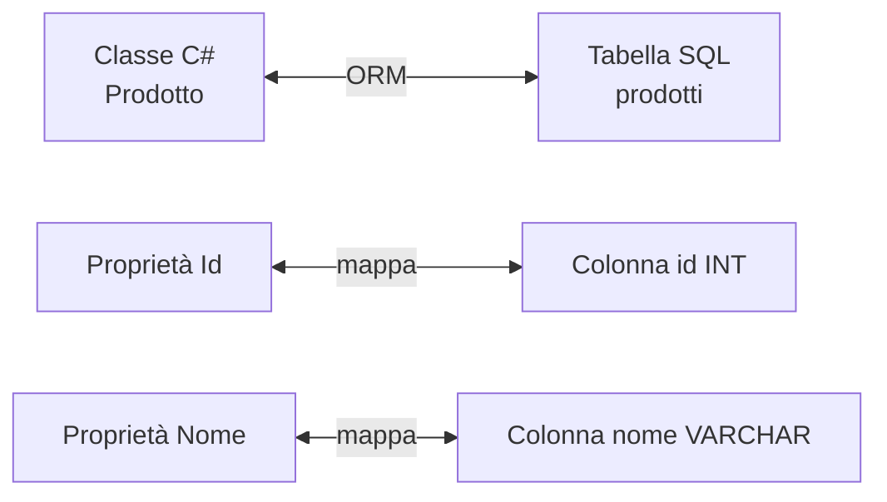
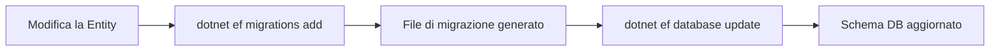

## 1. Cos'è un ORM

Un **ORM (Object-Relational Mapper)** è uno strumento che permette di interagire con un database relazionale usando **oggetti del linguaggio di programmazione**, eliminando la necessità di scrivere SQL manualmente.



Il principale ORM in C# è **Entity Framework Core (EF Core)**, sviluppato da Microsoft.

Vantaggi:
- Scrivi C# invece di SQL.
- Le migrazioni gestiscono automaticamente gli aggiornamenti dello schema.
- Supporta LINQ per le query.
- Astratto dal tipo di database (SQL Server, PostgreSQL, SQLite, ecc.).

## 2. Approcci in EF Core

| Approccio | Descrizione |
|---|---|
| **Code First** | Definisci le classi C# → EF genera il database |
| **Database First** | Hai già un DB → EF genera le classi |

Il più comune è **Code First**.

## 3. Installazione

```bash
dotnet add package Microsoft.EntityFrameworkCore
dotnet add package Microsoft.EntityFrameworkCore.SqlServer   # per SQL Server
dotnet add package Microsoft.EntityFrameworkCore.Sqlite      # per SQLite
dotnet add package Microsoft.EntityFrameworkCore.Tools       # per le migrazioni
```

## 4. Entity (Modello)

Le **entity** sono classi C# che rappresentano le tabelle del database.

```cs
public class Prodotto
{
    public int Id { get; set; }           // PK (per convenzione: Id o ProdottoId)
    public string Nome { get; set; } = "";
    public decimal Prezzo { get; set; }
    public int QuantitaInStock { get; set; }

    // Navigation property → relazione con Categoria
    public int CategoriaId { get; set; }
    public Categoria? Categoria { get; set; }
}

public class Categoria
{
    public int Id { get; set; }
    public string Nome { get; set; } = "";

    // Collection navigation property
    public ICollection<Prodotto> Prodotti { get; set; } = new List<Prodotto>();
}
```

## 5. DbContext

Il `DbContext` è il **cuore di EF Core**: rappresenta la sessione con il database e contiene i `DbSet<T>` per ogni entity.

```cs
public class AppDbContext : DbContext
{
    public DbSet<Prodotto> Prodotti { get; set; }
    public DbSet<Categoria> Categorie { get; set; }

    public AppDbContext(DbContextOptions<AppDbContext> options)
        : base(options) { }

    protected override void OnModelCreating(ModelBuilder modelBuilder)
    {
        // Configurazione Fluent API (alternativa alle Data Annotations)
        modelBuilder.Entity<Prodotto>(entity =>
        {
            entity.HasKey(p => p.Id);
            entity.Property(p => p.Nome)
                  .IsRequired()
                  .HasMaxLength(100);
            entity.Property(p => p.Prezzo)
                  .HasColumnType("decimal(18,2)");
        });

        modelBuilder.Entity<Categoria>()
            .HasMany(c => c.Prodotti)
            .WithOne(p => p.Categoria)
            .HasForeignKey(p => p.CategoriaId);
    }
}
```

### Registrazione in Program.cs

```cs
builder.Services.AddDbContext<AppDbContext>(options =>
    options.UseSqlite("Data Source=app.db")); // o UseSqlServer(...)
```

## 6. Data Annotations

In alternativa alla Fluent API si possono usare attributi direttamente sulle entity.

```cs
using System.ComponentModel.DataAnnotations;
using System.ComponentModel.DataAnnotations.Schema;

public class Prodotto
{
    [Key]
    public int Id { get; set; }

    [Required]
    [MaxLength(100)]
    public string Nome { get; set; } = "";

    [Column(TypeName = "decimal(18,2)")]
    public decimal Prezzo { get; set; }
}
```

## 7. Migrazioni

Le migrazioni tracciano le modifiche allo schema del database nel tempo.

```bash
# Crea una nuova migrazione
dotnet ef migrations add InitialCreate

# Applica le migrazioni al database
dotnet ef database update

# Rimuove l'ultima migrazione (se non ancora applicata)
dotnet ef migrations remove
```



## 8. Operazioni CRUD

```cs
public class ProdottoService
{
    private readonly AppDbContext _context;

    public ProdottoService(AppDbContext context)
    {
        _context = context;
    }

    // CREATE
    public async Task<Prodotto> CreaAsync(Prodotto prodotto)
    {
        _context.Prodotti.Add(prodotto);
        await _context.SaveChangesAsync();
        return prodotto;
    }

    // READ - tutti
    public async Task<List<Prodotto>> GetTuttiAsync()
    {
        return await _context.Prodotti
            .Include(p => p.Categoria) // eager loading
            .ToListAsync();
    }

    // READ - per id
    public async Task<Prodotto?> GetByIdAsync(int id)
    {
        return await _context.Prodotti
            .Include(p => p.Categoria)
            .FirstOrDefaultAsync(p => p.Id == id);
    }

    // UPDATE
    public async Task AggiornaAsync(Prodotto prodotto)
    {
        _context.Prodotti.Update(prodotto);
        await _context.SaveChangesAsync();
    }

    // DELETE
    public async Task EliminaAsync(int id)
    {
        var prodotto = await _context.Prodotti.FindAsync(id);
        if (prodotto is not null)
        {
            _context.Prodotti.Remove(prodotto);
            await _context.SaveChangesAsync();
        }
    }
}
```

## 9. Relazioni

### 9.1 One-to-Many (uno a molti)

```cs
// Una Categoria ha molti Prodotti
public class Categoria
{
    public int Id { get; set; }
    public string Nome { get; set; } = "";
    public ICollection<Prodotto> Prodotti { get; set; } = new List<Prodotto>();
}

public class Prodotto
{
    public int Id { get; set; }
    public int CategoriaId { get; set; }    // FK
    public Categoria? Categoria { get; set; } // navigation property
}
```

### 9.2 Many-to-Many (molti a molti)

```cs
public class Studente
{
    public int Id { get; set; }
    public string Nome { get; set; } = "";
    public ICollection<Corso> Corsi { get; set; } = new List<Corso>();
}

public class Corso
{
    public int Id { get; set; }
    public string Titolo { get; set; } = "";
    public ICollection<Studente> Studenti { get; set; } = new List<Studente>();
}
// EF Core 5+ gestisce automaticamente la tabella di join
```

### 9.3 One-to-One (uno a uno)

```cs
public class Utente
{
    public int Id { get; set; }
    public string Email { get; set; } = "";
    public Profilo? Profilo { get; set; }
}

public class Profilo
{
    public int Id { get; set; }
    public string Bio { get; set; } = "";
    public int UtenteId { get; set; }    // FK
    public Utente? Utente { get; set; }
}
```

## 10. Loading delle relazioni

| Strategia | Come | Quando |
|---|---|---|
| **Eager Loading** | `.Include()` | Quando sai che ti serve la relazione |
| **Lazy Loading** | automatico (richiede configurazione) | Quando non sai se ti serve |
| **Explicit Loading** | `.Entry().Collection().Load()` | Quando vuoi caricare in un secondo momento |

```cs
// Eager Loading
var prodotti = await _context.Prodotti
    .Include(p => p.Categoria)
    .ThenInclude(c => c.Sottocategorie) // carica relazione annidata
    .ToListAsync();

// Explicit Loading
var prodotto = await _context.Prodotti.FindAsync(1);
await _context.Entry(prodotto!)
    .Reference(p => p.Categoria)
    .LoadAsync();
```

## 11. Quiz

import Quiz from '../../../components/Quiz.jsx';

<Quiz client:load questions={[
{
question:"Cosa significa ORM?",
answers:{
a:"Object Runtime Manager",
b:"Object-Relational Mapper",
c:"Output Record Model",
d:"Online Repository Manager"
},
correctAnswer:"b"
},
{
question:"Nell'approccio Code First:",
answers:{
a:"Il database genera le classi C#",
b:"Si scrive SQL direttamente",
c:"Si definiscono le classi C# e EF genera il database",
d:"Si usa solo SQLite"
},
correctAnswer:"c"
},
{
question:"Cosa è il DbContext?",
answers:{
a:"Una classe che rappresenta una singola tabella",
b:"Un file di configurazione",
c:"La sessione con il database che contiene i DbSet",
d:"Il file delle migrazioni"
},
correctAnswer:"c"
},
{
question:"Il comando per creare una migrazione è:",
answers:{
a:"dotnet ef migrate create",
b:"dotnet ef migrations add",
c:"dotnet ef schema update",
d:"dotnet ef database create"
},
correctAnswer:"b"
},
{
question:"Il metodo Include() in EF Core serve per:",
answers:{
a:"Includere un file di configurazione",
b:"Eseguire l'eager loading delle navigation property",
c:"Aggiungere una colonna alla tabella",
d:"Filtrare i risultati"
},
correctAnswer:"b"
},
{
question:"SaveChangesAsync() fa:",
answers:{
a:"Cancella tutte le modifiche in sospeso",
b:"Carica i dati dal database",
c:"Persiste nel DB tutte le modifiche tracciate dal DbContext",
d:"Crea una nuova migrazione"
},
correctAnswer:"c"
},
{
question:"Per convenzione, EF Core usa come chiave primaria:",
answers:{
a:"Il primo campo della classe",
b:"Una proprietà chiamata Id o NomeClasseId",
c:"Una proprietà marcata [Primary]",
d:"Solo tipi Guid"
},
correctAnswer:"b"
},
{
question:"Una relazione One-to-Many si modella con:",
answers:{
a:"Due classi senza navigation property",
b:"Una FK nella classe 'molti' e ICollection<T> nella classe 'uno'",
c:"Una tabella di join intermedia",
d:"Solo l'attributo [ForeignKey]"
},
correctAnswer:"b"
},
{
question:"Quale strategia di loading usa .Include()?",
answers:{
a:"Lazy Loading",
b:"Explicit Loading",
c:"Eager Loading",
d:"Deferred Loading"
},
correctAnswer:"c"
},
{
question:"La Fluent API in EF Core si configura in:",
answers:{
a:"Il costruttore del DbContext",
b:"Il metodo OnModelCreating(ModelBuilder)",
c:"Il file appsettings.json",
d:"Le Data Annotations sulle entity"
},
correctAnswer:"b"
}
]} />

## 12. Esercizi

### 12.1 Catalogo prodotti

**Scenario**: Costruisci un piccolo catalogo di prodotti con categorie.

**Consegna**:
1. Crea le entity `Prodotto` e `Categoria` con relazione One-to-Many.
2. Configura `AppDbContext` con SQLite.
3. Crea e applica le migrazioni.
4. Scrivi metodi CRUD per `Prodotto` (Create, Read, Update, Delete).
5. Stampa tutti i prodotti con la loro categoria usando `Include()`.

*Obiettivo: padroneggiare le operazioni CRUD base con EF Core.*

### 12.2 Sistema di prenotazioni

**Scenario**: Studenti si iscrivono a corsi (relazione Many-to-Many).

**Consegna**:
1. Crea `Studente` e `Corso` con relazione Many-to-Many.
2. Aggiungi almeno 3 studenti e 3 corsi.
3. Iscrivi ogni studente a più corsi.
4. Stampa per ogni corso la lista degli studenti iscritti.

*Obiettivo: comprendere le relazioni Many-to-Many in EF Core.*

### 12.3 Soft delete

**Scenario**: Vuoi eliminare i record logicamente (non fisicamente) aggiungendo un campo `IsDeleted`.

**Consegna**:
1. Aggiungi `bool IsDeleted` alle entity.
2. Sovrascrivi `SaveChangesAsync` nel `DbContext` per impostare automaticamente `IsDeleted = true` invece di eliminare.
3. Configura un **Global Query Filter** per escludere automaticamente i record eliminati dalle query.

*Obiettivo: capire come personalizzare il comportamento di EF Core con query filter e override.*
