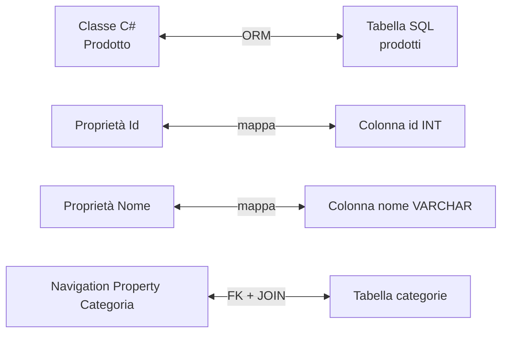
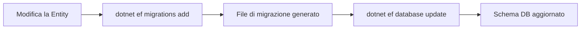

## 1. Cos'è un ORM

Un **ORM (Object-Relational Mapper)** è un livello software che traduce il mondo **object-oriented** del codice C# nel mondo **relazionale** del database. Invece di scrivere `SELECT`, `INSERT`, `UPDATE` e `DELETE`, lavori con **classi**, **oggetti**, **collezioni** e **query LINQ**.


```mermaid
graph LR
    A[Classe C# \nProdotto] <-->|ORM| B[Tabella SQL\nprodotti]
    C[Proprietà Id] <-->|mappa| D[Colonna id INT]
    E[Proprietà Nome] <-->|mappa| F[Colonna nome VARCHAR]
    G[Navigation Property Categoria] <-->|FK + JOIN| H[Tabella categorie]
```

Il principale ORM in C# è **Entity Framework Core (EF Core)**, sviluppato da Microsoft. In sintesi EF Core:

1. costruisce un **modello** delle entity;
2. traduce le query LINQ in SQL e le esegue sul database;
3. **materializza** i risultati in oggetti C#;
4. **traccia** gli oggetti caricati e, al salvataggio, genera gli `INSERT`/`UPDATE`/`DELETE` necessari.

I vantaggi principali sono **type safety** (un errore di nome emerge in compilazione), query LINQ dichiarative, **migrazioni** versionate dello schema e meno codice ripetitivo. Un ORM però non elimina la necessità di conoscere il database: una query LINQ scritta male può generare SQL inefficiente.

## 2. Approcci e installazione

| Approccio | Descrizione |
|---|---|
| **Code First** | Definisci le classi C# e la configurazione → EF genera o aggiorna il database |
| **Database First** | Parti da un database esistente (es. legacy) → EF genera classi e configurazioni |

Il più comune è **Code First**: lo schema vive nel codice, quindi è versionato in Git, revisionabile e riproducibile in ogni ambiente tramite migrazioni.

```bash
dotnet add package Microsoft.EntityFrameworkCore
dotnet add package Microsoft.EntityFrameworkCore.Sqlite      # provider SQLite
dotnet add package Microsoft.EntityFrameworkCore.SqlServer   # provider SQL Server
dotnet add package Microsoft.EntityFrameworkCore.Design      # necessario per le migrazioni
dotnet tool install --global dotnet-ef                       # CLI "dotnet ef"
```

EF Core è composto da un nucleo comune e da **provider** specifici (SQL Server, PostgreSQL, SQLite, MySQL, in-memory per i test). Il provider determina il SQL generato, i tipi supportati e quali espressioni LINQ sono traducibili.

<Aside variant="info">
Molti progetti reali usano un approccio **ibrido**: EF Core per CRUD, relazioni e migrazioni, e **Dapper** (un micro-ORM leggero, senza change tracking) o SQL raw per report e query critiche per le performance.
</Aside>

## 3. Entity e DbContext

Le **entity** sono classi C# che rappresentano i dati persistiti, in genere una per tabella.

```cs
public class Prodotto
{
    public int Id { get; set; }           // PK per convenzione (Id o ProdottoId)
    public string Nome { get; set; } = "";
    public decimal Prezzo { get; set; }
    public int QuantitaInStock { get; set; }

    public int CategoriaId { get; set; }  // FK
    public Categoria? Categoria { get; set; } // navigation property
}

public class Categoria
{
    public int Id { get; set; }
    public string Nome { get; set; } = "";
    public ICollection<Prodotto> Prodotti { get; set; } = new List<Prodotto>();
}
```

EF Core applica molte **convenzioni**: `Id` o `NomeClasseId` diventa chiave primaria, le proprietà scalari diventano colonne, le navigation property diventano relazioni. Quando le convenzioni non bastano si usano **Data Annotations** o **Fluent API**.

Il `DbContext` è il **cuore di EF Core**: rappresenta la sessione con il database, espone i `DbSet<T>` (uno per tabella) e contiene il **Change Tracker**.

```cs
public class AppDbContext : DbContext
{
    public DbSet<Prodotto> Prodotti => Set<Prodotto>();
    public DbSet<Categoria> Categorie => Set<Categoria>();

    public AppDbContext(DbContextOptions<AppDbContext> options) : base(options) { }

    protected override void OnModelCreating(ModelBuilder modelBuilder)
    {
        modelBuilder.Entity<Prodotto>(entity =>
        {
            entity.Property(p => p.Nome).IsRequired().HasMaxLength(100);
            entity.Property(p => p.Prezzo).HasColumnType("decimal(18,2)");
        });

        modelBuilder.Entity<Categoria>()
            .HasMany(c => c.Prodotti)
            .WithOne(p => p.Categoria)
            .HasForeignKey(p => p.CategoriaId);
    }
}
```

Registrazione in `Program.cs`:

```cs
builder.Services.AddDbContext<AppDbContext>(options =>
    options.UseSqlite("Data Source=app.db")); // o UseSqlServer(...)
```

<Aside variant="danger">
Il `DbContext` **non è thread-safe** e accumula entità tracciate. `AddDbContext` lo registra come **scoped** (un'istanza per richiesta HTTP): non registrarlo mai come singleton e non usarlo da più task in parallelo.
</Aside>

## 4. Configurazione del modello

### 4.1 Data Annotations e Fluent API

La stessa configurazione della sezione 3 si può scrivere con attributi direttamente sulla entity:

```cs
using System.ComponentModel.DataAnnotations;
using System.ComponentModel.DataAnnotations.Schema;

public class Prodotto
{
    [Key]
    public int Id { get; set; }

    [Required, MaxLength(100)]
    public string Nome { get; set; } = "";

    [Column(TypeName = "decimal(18,2)")]
    public decimal Prezzo { get; set; }
}
```

Le **Data Annotations** sono comode per vincoli semplici e leggibili accanto alla proprietà; la **Fluent API** (in `OnModelCreating`) è più potente, gestisce i mapping complessi e tiene le entity pulite da dettagli infrastrutturali.

### 4.2 Shadow properties e owned entities

Una **shadow property** esiste nel modello EF ma **non nella classe C#**: utile per dati infrastrutturali (`CreatedAt`, `IsDeleted`, `TenantId`) che non vuoi nel dominio.

```cs
modelBuilder.Entity<Prodotto>().Property<DateTime>("CreatedAt");
modelBuilder.Entity<Prodotto>().Property<bool>("IsDeleted").HasDefaultValue(false);

// Accesso a runtime
_context.Entry(prodotto).Property("CreatedAt").CurrentValue = DateTime.UtcNow;
```

Le **owned entities** mappano un **Value Object** (un oggetto che ha senso solo dentro il proprietario) nella stessa tabella del proprietario:

```cs
public class Ordine
{
    public int Id { get; set; }
    public Indirizzo Spedizione { get; set; } = new();
}

public class Indirizzo
{
    public string Via { get; set; } = "";
    public string Citta { get; set; } = "";
}

modelBuilder.Entity<Ordine>().OwnsOne(o => o.Spedizione);
// Tabella Ordini: Id | Spedizione_Via | Spedizione_Citta
```

### 4.3 Ereditarietà: TPH, TPT, TPC

```cs
public abstract class Pagamento
{
    public int Id { get; set; }
    public decimal Importo { get; set; }
}

public class PagamentoCarta    : Pagamento { public string Circuito { get; set; } = ""; }
public class PagamentoBonifico : Pagamento { public string Iban { get; set; } = ""; }
```

| Strategia | Tabelle | Pro | Contro |
|---|---|---|---|
| **TPH** (Table Per Hierarchy, default) | Una sola, con colonna `Discriminator` | Niente join, veloce | Molte colonne nullable |
| **TPT** (Table Per Type) | Una per il tipo base + una per derivato | Schema normalizzato | Join a ogni query |
| **TPC** (Table Per Concrete type) | Una completa per ogni tipo concreto | Niente join base/derivato | Colonne duplicate |

```cs
modelBuilder.Entity<Pagamento>().UseTptMappingStrategy(); // oppure UseTpcMappingStrategy()
```

Regola pratica: parti da **TPH**, il default e in genere il più performante; passa a TPT o TPC solo con un motivo concreto.

## 5. Migrazioni

Le migrazioni tracciano le modifiche allo schema del database nel tempo.

```bash
dotnet ef migrations add InitialCreate   # crea una migrazione dalle differenze del modello
dotnet ef database update                # applica le migrazioni al database
dotnet ef migrations remove              # rimuove l'ultima (se non ancora applicata)
```


```mermaid
graph LR
    A[Modifica la Entity] --> B[dotnet ef migrations add]
    B --> C[File di migrazione generato]
    C --> D[dotnet ef database update]
    D --> E[Schema DB aggiornato]
```

Ogni migrazione contiene un metodo `Up()` (modifiche da applicare), un metodo `Down()` (rollback) e aggiorna lo **snapshot** del modello. Ad esempio, aggiungendo `public string? Descrizione { get; set; }` a `Prodotto` e lanciando `migrations add AggiuntaDescrizione`, si ottiene:

```cs
protected override void Up(MigrationBuilder migrationBuilder)
{
    migrationBuilder.AddColumn<string>(
        name: "Descrizione", table: "Prodotti", nullable: true);
}

protected override void Down(MigrationBuilder migrationBuilder)
{
    migrationBuilder.DropColumn(name: "Descrizione", table: "Prodotti");
}
```

<Aside variant="warning">
Rileggi sempre la migrazione generata prima di applicarla: rinominare una proprietà può essere interpretato come `DropColumn` + `AddColumn`, con **perdita dei dati** della colonna. Preferisci migrazioni piccole e frequenti.
</Aside>

## 6. Change Tracker

Il **Change Tracker** memorizza lo stato delle entità note al contesto:

| Stato | Significato |
|---|---|
| **Added** | Nuova, verrà inserita con `INSERT` |
| **Unchanged** | Tracciata, senza modifiche |
| **Modified** | Esiste già e una o più proprietà sono cambiate |
| **Deleted** | Verrà rimossa con `DELETE` |
| **Detached** | Non tracciata dal contesto |

Quando chiami `SaveChangesAsync()`, EF confronta i valori originali con quelli correnti, genera i comandi SQL, li esegue **in una transazione** e aggiorna gli stati.

```cs
var p = await _context.Prodotti.FirstAsync(p => p.Id == 1);
Console.WriteLine(_context.Entry(p).State); // Unchanged

p.Prezzo = 9.99m;
_context.ChangeTracker.DetectChanges();
Console.WriteLine(_context.Entry(p).State); // Modified

await _context.SaveChangesAsync();          // UPDATE Prodotti SET Prezzo = ... WHERE Id = 1
Console.WriteLine(_context.Entry(p).State); // Unchanged
```

Il contesto mantiene anche una **identity map**: per una certa chiave esiste una sola istanza tracciata, quindi due query sulla stessa riga restituiscono lo stesso oggetto.

```cs
var p1 = await _context.Prodotti.FindAsync(1);
var p2 = await _context.Prodotti.FirstAsync(p => p.Id == 1);
Console.WriteLine(ReferenceEquals(p1, p2)); // True
```

### 6.1 AsNoTracking

Per query di sola lettura (liste, dashboard, report, API read-only) il tracking è lavoro sprecato. `AsNoTracking()` evita di inserire le entità nel Change Tracker, riducendo memoria e CPU.

```cs
var disponibili = await _context.Prodotti
    .AsNoTracking()
    .Where(p => p.QuantitaInStock > 0)
    .ToListAsync();
```

<Aside variant="warning">
Le entità caricate con `AsNoTracking()` non vengono salvate: se modifichi una loro proprietà e chiami `SaveChangesAsync()`, non succede nulla. Se ti serve la deduplicazione delle istanze senza tracking, usa `AsNoTrackingWithIdentityResolution()`.
</Aside>

### 6.2 Scenari disconnected

In una API web l'oggetto arriva dal client già **Detached**. `Attach()` lo marca `Unchanged`, `Update()` marca **tutte** le proprietà come `Modified`, `Remove()` lo marca `Deleted`.

```cs
// Aggressivo: UPDATE su tutte le colonne, anche quelle non inviate dal client
_context.Prodotti.Update(prodottoDalClient);

// Preferibile: carica e aggiorna solo i campi necessari
var p = await _context.Prodotti.FindAsync(dto.Id);
if (p is null) return;
p.Prezzo = dto.Prezzo;            // UPDATE solo della colonna Prezzo
await _context.SaveChangesAsync();
```

Nella [parte 2](/informatica/csharp/orm-entity-framework-2) useremo questo modello per scrivere query e operazioni CRUD, gestire le relazioni, evitare il problema N+1 e controllare concorrenza e transazioni.

## 7. Quiz

import Quiz from '../../../components/Quiz.jsx';

<Quiz client:load questions={[
{
question:"Cosa significa ORM?",
answers:{
a:"Object Runtime Manager",
b:"Object-Relational Mapper",
c:"Output Record Model",
d:"Online Repository Manager"
},
correctAnswer:"b"
},
{
question:"Nell'approccio Code First:",
answers:{
a:"Il database genera le classi C#",
b:"Si scrive SQL direttamente",
c:"Si definiscono le classi C# e EF genera il database",
d:"Si usa solo SQLite"
},
correctAnswer:"c"
},
{
question:"Cosa è il DbContext?",
answers:{
a:"Una classe che rappresenta una singola tabella",
b:"Un file di configurazione",
c:"La sessione con il database che contiene i DbSet",
d:"Il file delle migrazioni"
},
correctAnswer:"c"
},
{
question:"Con quale ciclo di vita AddDbContext registra il DbContext?",
answers:{
a:"Singleton, una sola istanza per tutta l'applicazione",
b:"Scoped, un'istanza per richiesta HTTP",
c:"Transient, una nuova istanza a ogni accesso a una proprietà",
d:"Static, condiviso tra tutti i thread"
},
correctAnswer:"b"
},
{
question:"Per convenzione, EF Core usa come chiave primaria:",
answers:{
a:"Il primo campo della classe",
b:"Una proprietà chiamata Id o NomeClasseId",
c:"Una proprietà marcata [Primary]",
d:"Solo tipi Guid"
},
correctAnswer:"b"
},
{
question:"Qual è la strategia di mapping dell'ereditarietà predefinita in EF Core?",
answers:{
a:"TPT, una tabella per ogni tipo",
b:"TPC, una tabella completa per ogni tipo concreto",
c:"TPH, una sola tabella con colonna Discriminator",
d:"Nessuna: l'ereditarietà non è supportata"
},
correctAnswer:"c"
},
{
question:"Il comando per creare una migrazione è:",
answers:{
a:"dotnet ef migrate create",
b:"dotnet ef migrations add",
c:"dotnet ef schema update",
d:"dotnet ef database create"
},
correctAnswer:"b"
},
{
question:"A cosa serve AsNoTracking()?",
answers:{
a:"A disattivare il logging del SQL",
b:"A non inserire le entità caricate nel Change Tracker, utile per query di sola lettura",
c:"A eliminare le entità dopo la lettura",
d:"A rendere il DbContext thread-safe"
},
correctAnswer:"b"
}
]} />

## 8. Esercizi

### 8.1 Modello del catalogo e migrazioni

**Scenario**: Prepari lo schema di un piccolo catalogo di prodotti con categorie.

**Consegna**:
1. Crea le entity `Prodotto` e `Categoria` con relazione One-to-Many.
2. Configura `AppDbContext` con SQLite e usa la Fluent API per rendere `Nome` obbligatorio (massimo 100 caratteri).
3. Crea e applica la migrazione `InitialCreate`.
4. Aggiungi la proprietà `Descrizione` a `Prodotto`, genera una seconda migrazione e leggi i metodi `Up()` e `Down()`.
5. Rinomina una proprietà, genera la migrazione e verifica se EF produce un rename o un `DropColumn` + `AddColumn`.

*Obiettivo: padroneggiare il flusso Code First e imparare a rileggere le migrazioni generate.*

### 8.2 Osservare il Change Tracker

**Scenario**: Vuoi vedere concretamente come cambiano gli stati delle entità.

**Consegna**:
1. Carica un prodotto e stampa `_context.Entry(p).State`.
2. Modifica il prezzo, chiama `DetectChanges()` e stampa di nuovo lo stato; poi salva e ristampalo.
3. Crea un nuovo prodotto con `Add()` e uno esistente con `Remove()`: stampa gli stati prima di `SaveChangesAsync()`.
4. Carica due volte lo stesso prodotto (con e senza `AsNoTracking()`) e confronta le istanze con `ReferenceEquals`.

*Obiettivo: capire gli stati Added, Unchanged, Modified, Deleted e Detached e l'identity map.*

### 8.3 Soft delete con shadow property

**Scenario**: Vuoi eliminare i prodotti logicamente (non fisicamente) senza aggiungere `IsDeleted` alla classe C#.

**Consegna**:
1. Aggiungi a `Prodotto` una shadow property `bool IsDeleted` con valore di default `false` e crea la migrazione.
2. Sovrascrivi `SaveChangesAsync` nel `DbContext`: per ogni entry di `Prodotto` in stato `Deleted`, imposta lo stato a `Modified` e `IsDeleted` a `true`.
3. Elimina un prodotto con `Remove()` e verifica che la riga resti nel database con `IsDeleted = 1`.

*Obiettivo: usare shadow properties e Change Tracker per personalizzare il salvataggio.*
