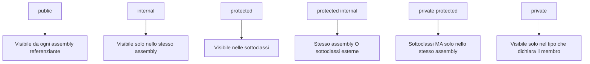
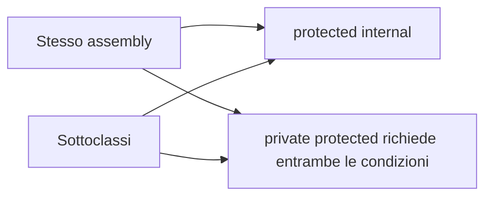
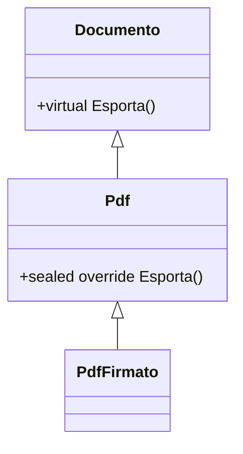
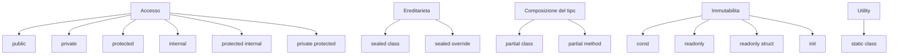

## 1. Introduzione

In C# parole chiave come `internal`, `sealed`, `partial`, `readonly`, `const`, `static`, `protected internal` e `private protected` non sono dettagli cosmetici: definiscono i **confini** del codice.

Con questi modificatori puoi decidere:

- chi vede un tipo o un membro;
- chi può ereditarlo o ridefinirlo;
- se una definizione è divisa su più file;
- se un dato può cambiare;
- se un'API è pensata per uso pubblico, interno al progetto o solo per generatori e designer.

Questa lezione mette insieme i tre concetti principali richiesti dal titolo:

- **internal**: visibilità limitata all'assembly;
- **sealed**: blocco dell'ereditarietà o di ulteriori override;
- **partial**: suddivisione della stessa definizione in più parti.

Alla fine collegheremo anche i modificatori correlati più importanti: `protected internal`, `private protected`, `readonly`, `const`, `init` e `static class`.

## 2. Riepilogo dei modificatori di accesso in C#

I modificatori di accesso stabiliscono **da dove** un tipo o un membro può essere usato.

Quelli fondamentali sono:

- `public`
- `private`
- `protected`
- `internal`
- `protected internal`
- `private protected`

### 2.1 Significato rapido

- `public`: accessibile ovunque il tipo sia referenziabile.
- `private`: accessibile solo nel tipo che lo dichiara.
- `protected`: accessibile nel tipo base e nelle sottoclassi.
- `internal`: accessibile solo dentro lo **stesso assembly**.
- `protected internal`: accessibile dalle sottoclassi **oppure** da qualsiasi codice dello stesso assembly.
- `private protected`: accessibile solo dalle sottoclassi **dello stesso assembly**.

Un dettaglio importante:

- per i **tipi top-level** (classi non annidate, struct, interfacce, record) il default è `internal`;
- per i **membri di classe** il default è `private`.

### 2.2 Assembly e namespace non sono la stessa cosa

Molti principianti li confondono, ma sono concetti diversi.

**Namespace**:

- è un raggruppamento logico di nomi;
- organizza il codice;
- evita collisioni tra tipi con lo stesso nome;
- non è un confine di sicurezza o di accessibilità.

**Assembly**:

- è l'unità compilata (`.dll` o `.exe`);
- è il vero confine usato da `internal`;
- contiene metadata, manifest e tipi compilati;
- può includere uno o più namespace.

Esempio concettuale:

- `MyApp.Core.Services` e `MyApp.Core.Models` possono stare nello **stesso assembly** ma in namespace diversi;
- `MyApp.Core` e `MyApp.Tests` possono avere namespace simili ma essere **assembly diversi**.

Quindi `internal` guarda l'assembly, non il namespace.

### 2.3 Tabella completa di visibilità

| Modificatore | Stessa classe | Stesso namespace, stesso assembly | Altro namespace, stesso assembly | Sottoclasse stesso assembly | Sottoclasse altro assembly | Altro assembly non derivato |
| --- | --- | --- | --- | --- | --- | --- |
| `public` | Sì | Sì | Sì | Sì | Sì | Sì |
| `private` | Sì | No | No | No | No | No |
| `protected` | Sì | No | No | Sì | Sì | No |
| `internal` | Sì | Sì | Sì | Sì | No | No |
| `protected internal` | Sì | Sì | Sì | Sì | Sì | No |
| `private protected` | Sì | No | No | Sì | No | No |

La colonna "stesso namespace" serve solo a chiarire i casi tipici di lettura del codice, ma il namespace **da solo** non apre accessi speciali.

### 2.4 Diagramma Mermaid dei livelli di visibilità



### 2.5 Esempio minimo

```cs
public class Documento
{
    private int _versione;
    protected string Titolo { get; set; } = string.Empty;
    internal DateTime LastSavedAt { get; set; }
    public void Salva() { }
}
```

In questo esempio:

- `_versione` è visibile solo dentro `Documento`;
- `Titolo` è visibile anche alle classi derivate;
- `LastSavedAt` è visibile a tutto l'assembly;
- `Salva()` è pubblico.

## 3. internal

`internal` significa: **accessibile solo all'interno dell'assembly corrente**.

È molto usato quando vuoi esporre pubblicamente solo ciò che serve davvero e tenere nascosti i dettagli di implementazione.

```cs
internal class SqlConnectionFactory
{
    public string BuildConnectionString()
    {
        return "Server=.;Database=School;Trusted_Connection=True;";
    }
}
```

Se `SqlConnectionFactory` sta dentro l'assembly `School.Data.dll`, il codice nello stesso assembly può usarlo. Un altro assembly referenziante non può istanziarlo direttamente.

### 3.1 Perché `internal` è utile

`internal` serve per:

- ridurre la superficie pubblica di una libreria;
- evitare che chiamanti esterni dipendano da dettagli interni;
- proteggere il codice da accoppiamenti inutili;
- separare meglio API pubbliche e meccanismi interni;
- consentire refactoring più sicuri.

Più un'API è `public`, più diventa difficile cambiarla senza rompere codice esterno.

### 3.2 `public` vs `internal` in librerie e applicazioni

#### In una libreria

In una libreria, `public` dovrebbe essere riservato a:

- contratti stabili;
- interfacce per gli utenti della libreria;
- DTO o tipi necessari all'integrazione;
- entry point ufficiali.

Tutto il resto è spesso meglio tenerlo `internal`.

```cs
public interface IPaymentGateway
{
    Task ChargeAsync(decimal amount);
}

internal sealed class StripePaymentGateway : IPaymentGateway
{
    public Task ChargeAsync(decimal amount)
    {
        return Task.CompletedTask;
    }
}
```

Qui chi consuma la libreria conosce l'interfaccia `IPaymentGateway`, ma non la classe concreta `StripePaymentGateway`.

#### In un'applicazione

In una normale applicazione business, `internal` è comunque utile per:

- separare il modulo pubblico dal resto;
- evitare accessi casuali tra progetti della soluzione;
- indicare che un tipo serve solo come dettaglio locale.

Se però il codice non deve essere consumato da altri assembly, la differenza tra `public` e `internal` diventa più di **intenzione architetturale** che di distribuzione pubblica.

### 3.3 Esempio pratico con più assembly

Immagina questa soluzione:

- `School.Domain.dll`
- `School.Infrastructure.dll`
- `School.Web.exe`
- `School.Tests.dll`

In `School.Infrastructure`:

```cs
namespace School.Infrastructure.Persistence;

internal sealed class SqlStudentRepository : IStudentRepository
{
    public Task<Student?> GetByIdAsync(int id)
    {
        return Task.FromResult<Student?>(null);
    }
}
```

In `School.Web` questo codice **non** compila:

```cs
using School.Infrastructure.Persistence;

var repo = new SqlStudentRepository();
```

Perché `SqlStudentRepository` è `internal` all'assembly `School.Infrastructure`.

Il modo corretto è esporre un contratto pubblico o una factory pubblica:

```cs
public interface IStudentRepository
{
    Task<Student?> GetByIdAsync(int id);
}

public static class InfrastructureModule
{
    public static IServiceCollection AddInfrastructure(this IServiceCollection services)
    {
        services.AddScoped<IStudentRepository, SqlStudentRepository>();
        return services;
    }
}
```

Così il dettaglio concreto rimane nascosto, ma l'applicazione può comunque usarlo tramite dependency injection.

### 3.4 `InternalsVisibleTo`: assembly amici

A volte vuoi mantenere un tipo `internal`, ma renderlo visibile a un assembly specifico, per esempio ai test.

Per questo esiste l'attributo `InternalsVisibleTo`.

```cs
using System.Runtime.CompilerServices;

[assembly: InternalsVisibleTo("School.Tests")]
```

Dopo questa dichiarazione, l'assembly `School.Tests` può accedere ai membri `internal` di quell'assembly.

Esempio:

```cs
internal class DiscountCalculator
{
    internal decimal ApplyStudentDiscount(decimal amount)
    {
        return amount * 0.8m;
    }
}
```

Nel progetto di test:

```cs
public class DiscountCalculatorTests
{
    [Fact]
    public void ApplyStudentDiscount_ShouldReduceBy20Percent()
    {
        var calculator = new DiscountCalculator();
        decimal result = calculator.ApplyStudentDiscount(100m);

        Assert.Equal(80m, result);
    }
}
```

#### Quando si usa davvero

Scenario tipico:

- vuoi testare componenti interni senza renderli `public` solo per i test;
- vuoi mantenere pulita l'API pubblica;
- vuoi dare accesso solo a assembly fidati.

Se l'assembly è firmato con strong name, `InternalsVisibleTo` deve includere anche la public key dell'assembly amico.

### 3.5 `internal` nei design pattern

`internal` compare spesso quando vuoi **nascondere implementazioni concrete** dietro contratti pubblici.

#### Factory + implementazione interna

```cs
public interface IMessageFormatter
{
    string Format(string message);
}

internal sealed class HtmlMessageFormatter : IMessageFormatter
{
    public string Format(string message) => $"<strong>{message}</strong>";
}

public static class MessageFormatterFactory
{
    public static IMessageFormatter CreateHtml()
    {
        return new HtmlMessageFormatter();
    }
}
```

Il chiamante usa il contratto pubblico, ma non può dipendere direttamente dalla classe concreta.

#### Repository o service nascosti

```cs
public interface ITokenGenerator
{
    string Generate();
}

internal sealed class JwtTokenGenerator : ITokenGenerator
{
    public string Generate() => Guid.NewGuid().ToString("N");
}
```

Questo approccio aiuta a:

- evitare `new ConcreteType()` fuori dal modulo;
- sostituire implementazioni senza rompere il codice esterno;
- guidare l'uso corretto dell'API.

### 3.6 `internal` e versioning

Per le librerie pubblicate a terzi, `internal` è prezioso anche per il versioning.

Se un membro è `public`, chiunque può iniziare a usarlo.
Se è `internal`, puoi cambiarlo più liberamente senza creare un contratto pubblico implicito.

In pratica:

- `public` = promessa verso i consumatori;
- `internal` = dettaglio interno del modulo.

## 4. `protected internal` vs `private protected`

Questi due modificatori sono spesso confusi perché combinano ereditarietà e assembly.

### 4.1 `protected internal`

`protected internal` significa:

- accessibile da qualsiasi codice nello stesso assembly;
- accessibile anche da sottoclassi in assembly diversi.

La logica è una **unione**:

- stesso assembly **oppure** sottoclasse.

```cs
public class BaseReport
{
    protected internal void WriteAudit()
    {
        Console.WriteLine("Audit interno o derivato");
    }
}
```

Può chiamarlo:

- una classe non derivata nello stesso assembly;
- una classe derivata nello stesso assembly;
- una classe derivata in un altro assembly.

Non può chiamarlo una classe non derivata in un altro assembly.

### 4.2 `private protected`

`private protected` significa:

- accessibile solo da sottoclassi;
- e solo se stanno nello stesso assembly.

La logica è una **intersezione**:

- sottoclasse **e** stesso assembly.

```cs
public class BaseReport
{
    private protected void WriteSensitiveAudit()
    {
        Console.WriteLine("Solo derivati interni all'assembly");
    }
}
```

Può chiamarlo:

- la classe base;
- una sottoclasse nello stesso assembly.

Non può chiamarlo:

- una classe non derivata nello stesso assembly;
- una sottoclasse in un assembly diverso.

### 4.3 Diagramma Mermaid stile Venn



Il diagramma va letto così:

- `protected internal` è la somma di due possibilità;
- `private protected` richiede contemporaneamente ereditarietà e stesso assembly.

### 4.4 Tabella riepilogativa

| Modificatore | Stesso assembly, classe non derivata | Sottoclasse stesso assembly | Sottoclasse altro assembly | Altro assembly non derivato |
| --- | --- | --- | --- | --- |
| `protected internal` | Sì | Sì | Sì | No |
| `private protected` | No | Sì | No | No |

### 4.5 Esempio completo

Assembly `School.Core`:

```cs
public class DocumentoBase
{
    protected internal void MetodoA()
    {
        Console.WriteLine("protected internal");
    }

    private protected void MetodoB()
    {
        Console.WriteLine("private protected");
    }
}

public class DocumentoSpeciale : DocumentoBase
{
    public void Test()
    {
        MetodoA(); // OK
        MetodoB(); // OK
    }
}

public class Helper
{
    public void Test(DocumentoBase doc)
    {
        doc.MetodoA(); // OK: stesso assembly
        // doc.MetodoB(); // Errore: non è una sottoclasse
    }
}
```

Assembly `School.Plugins`:

```cs
public class DocumentoPlugin : DocumentoBase
{
    public void Test()
    {
        MetodoA(); // OK: è una sottoclasse
        // MetodoB(); // Errore: assembly diverso
    }
}
```

### 4.6 Quando usare quale

Usa `protected internal` quando:

- il membro serve sia dentro il modulo sia nelle estensioni derivate;
- vuoi dare libertà alle sottoclassi anche esterne.

Usa `private protected` quando:

- il membro è pensato per l'infrastruttura interna della gerarchia;
- non vuoi che librerie esterne derivate vi accedano;
- vuoi tenere stretta la superficie di estensione.

## 5. sealed

`sealed` significa "chiuso".

Può essere usato soprattutto in due modi:

- `sealed class`: impedisce che la classe venga ereditata;
- `sealed override`: impedisce ulteriori override di un membro già virtuale.

### 5.1 `sealed class`

```cs
public sealed class CurrencyCode
{
    public string Value { get; }

    public CurrencyCode(string value)
    {
        Value = value;
    }
}
```

Questo codice impedisce:

```cs
public class ExtendedCurrencyCode : CurrencyCode
{
}
```

Il compilatore segnalerà errore.

### 5.2 Perché usare una classe `sealed`

Una classe `sealed` è utile quando vuoi:

- impedire estensioni non previste;
- garantire invarianti di dominio;
- ridurre superfici di attacco o override pericolosi;
- segnalare che il tipo è "finale" e non progettato per l'ereditarietà;
- consentire al runtime alcune ottimizzazioni.

### 5.3 `sealed override`

`sealed override` si usa solo su un membro che sta già facendo `override` di un membro virtuale.

```cs
public class Documento
{
    public virtual string Esporta() => "Documento base";
}

public class Pdf : Documento
{
    public sealed override string Esporta() => "PDF";
}

public class PdfFirmato : Pdf
{
    // public override string Esporta() => "PDF firmato"; // Errore
}
```

In questo caso:

- `Documento.Esporta()` è virtuale;
- `Pdf.Esporta()` fa override;
- `Pdf` blocca ulteriori override con `sealed override`.

### 5.4 Diagramma Mermaid della catena di override



La relazione di ereditarietà esiste ancora, ma il metodo marcato `sealed override` non può più essere ridefinito.

### 5.5 `sealed` e performance

Una delle ragioni tecniche più citate è la performance, ma va capita bene.

#### Dispatch virtuale

I metodi virtuali richiedono un meccanismo di dispatch dinamico a runtime. Se invece il runtime sa con certezza quale implementazione verrà usata, può fare ottimizzazioni migliori.

#### Devirtualizzazione JIT

Se il JIT vede che:

- il tipo è `sealed`, oppure
- un override è chiuso in modo prevedibile,

può spesso trasformare una chiamata virtuale in una chiamata più diretta. Questo processo si chiama **devirtualizzazione**.

#### Inlining

Se una chiamata è più prevedibile, il JIT può anche decidere più facilmente di fare **inlining**, cioè incorporare il corpo del metodo nel punto di chiamata.

```cs
public sealed class PriceCalculator
{
    public decimal AddVat(decimal amount) => amount * 1.22m;
}
```

Non significa che ogni uso di `sealed` renda automaticamente tutto più veloce, ma può aiutare il JIT in scenari caldi.

Regola pratica:

- usa `sealed` per correttezza del design;
- considera il guadagno prestazionale come beneficio secondario;
- misura sempre con benchmark reali.

### 5.6 Quando usare `sealed`

Casi tipici:

- **classi immutabili** che non vuoi vedere alterate tramite ereditarietà;
- **tipi di valore semantico** o utility che devono restare stabili;
- **classi di sicurezza** in cui override esterni potrebbero violare invarianti;
- **implementazioni concrete interne** che non sono punti di estensione;
- **ottimizzazioni** in percorsi molto usati.

### 5.7 `sealed` e design delle API

Se rendi una classe estendibile, stai dicendo implicitamente:

- quali metodi possono essere ridefiniti;
- quali invarianti una sottoclasse deve preservare;
- come si comporta il costruttore durante l'ereditarietà;
- come gestire versioni future senza rompere le sottoclassi.

Se non vuoi assumerti questo contratto, meglio `sealed`.

Per questo molte API moderne preferiscono:

- interfacce per l'estensione;
- composizione;
- classi concrete `sealed`.

### 5.8 Esempi reali nel framework

`string` in .NET è `sealed`.

Questo ha molto senso perché:

- è immutabile;
- è usatissima dal runtime;
- ereditarla potrebbe rompere assunzioni di performance e correttezza;
- non è progettata come base class.

Lo stesso ragionamento vale per molte classi di supporto che rappresentano concetti chiusi e stabili.

### 5.9 `sealed struct` e `record sealed`

#### Struct

Gli `struct` non possono essere ereditati da altri tipi user-defined. In pratica sono già "sealed" per natura.

Quindi non scrivi:

```cs
public sealed struct Coordinate
{
    public int X { get; set; }
    public int Y { get; set; }
}
```

Questo non è consentito perché `sealed` su `struct` sarebbe ridondante: il linguaggio vieta già l'ereditarietà degli struct.

#### Record sealed

Per i record class puoi invece usare `sealed`:

```cs
public sealed record ApiToken(string Value, DateTime ExpiresAt);
```

È utile quando vuoi i vantaggi del record:

- uguaglianza per valore;
- sintassi compatta;
- `with` expression;

ma non vuoi ereditarietà.

### 5.10 `sealed` e sicurezza

A volte una sottoclasse può alterare un comportamento sensibile, per esempio:

- validazione;
- autorizzazione;
- caching;
- auditing;
- gestione delle risorse.

Rendere `sealed` una classe o un override può evitare estensioni impreviste che aggirano il comportamento previsto.

## 6. partial

`partial` permette di dividere la **stessa definizione logica** in più file.

Il compilatore poi unisce tutte le parti in un solo tipo finale.

### 6.1 `partial class`

```cs
// File: Student.cs
public partial class Student
{
    public int Id { get; set; }
    public string Name { get; set; } = string.Empty;
}
```

```cs
// File: Student.Validation.cs
public partial class Student
{
    public bool IsValid()
    {
        return !string.IsNullOrWhiteSpace(Name);
    }
}
```

A compile time, per il compilatore è come se la classe fosse stata scritta tutta insieme.

### 6.2 Quando si usa davvero

I casi d'uso principali sono:

- **designer** WinForms/WPF;
- **code generation**;
- **source generators**;
- **Entity Framework scaffolding**;
- separazione ordinata di responsabilità in file diversi.

#### WinForms / WPF designer

Nei progetti desktop spesso trovi:

- `MainForm.cs`
- `MainForm.Designer.cs`

Il file designer contiene codice generato automaticamente.
Il file principale contiene la logica scritta a mano.

```cs
// File: MainForm.cs
public partial class MainForm : Form
{
    public MainForm()
    {
        InitializeComponent();
    }

    private void SaveButton_Click(object sender, EventArgs e)
    {
        MessageBox.Show("Salvato");
    }
}
```

```cs
// File: MainForm.Designer.cs
public partial class MainForm
{
    private Button saveButton = null!;

    private void InitializeComponent()
    {
        saveButton = new Button();
        saveButton.Text = "Salva";
        saveButton.Click += SaveButton_Click;
    }
}
```

Il vantaggio è chiaro: il designer può rigenerare la sua parte senza distruggere il codice applicativo.

#### Source generators

I source generator generano codice C# durante la compilazione. `partial` è il meccanismo perfetto per completare un tipo definito manualmente.

```cs
public partial class SearchEndpoint
{
    public partial bool Validate(string term);
}
```

Il generatore può aggiungere l'implementazione in un altro file generato.

### 6.3 Regole fondamentali di `partial`

Le parti di un tipo `partial` devono rispettare alcune regole.

- Devono stare nello **stesso assembly**.
- Devono stare nello **stesso namespace**.
- Devono avere lo **stesso nome**.
- Devono avere la stessa **generic arity** se il tipo è generico.
- Se il tipo è annidato, devono stare nello stesso tipo contenitore.
- Tutte le parti devono essere marcate con `partial`.

Esempio errato:

```cs
namespace School.Core.Models;
public partial class Student { }
```

```cs
namespace School.Core.Entities;
public partial class Student { }
```

Qui non è lo stesso tipo: il namespace cambia, quindi il compilatore li tratta come due tipi diversi.

### 6.4 Come vengono uniti i membri

Il compilatore unisce:

- campi;
- proprietà;
- metodi;
- eventi;
- attributi;
- interfacce implementate nelle varie parti.

Per esempio:

```cs
[Serializable]
public partial class Report
{
}
```

```cs
public partial class Report : IDisposable
{
    public void Dispose() { }
}
```

Il tipo finale `Report` sarà una sola classe, con attributo `Serializable` e implementazione di `IDisposable`.

### 6.5 Attenzione a base class e duplicazioni

Le dichiarazioni devono essere coerenti.

- Non puoi avere due base class diverse.
- Non puoi definire due membri identici in conflitto.
- I modificatori di accesso del tipo devono essere compatibili.

### 6.6 `partial method`

Le `partial method` nascono per permettere a codice generato e codice manuale di agganciarsi senza accoppiarsi troppo.

Forma classica:

```cs
public partial class StudentImporter
{
    partial void OnBeforeSave(Student student);

    public void Save(Student student)
    {
        OnBeforeSave(student);
        Console.WriteLine("Salvataggio...");
    }
}
```

```cs
public partial class StudentImporter
{
    partial void OnBeforeSave(Student student)
    {
        if (string.IsNullOrWhiteSpace(student.Name))
        {
            throw new InvalidOperationException("Nome obbligatorio");
        }
    }
}
```

Se nella forma classica manca l'implementazione, il compilatore può eliminare la chiamata.

### 6.7 Evoluzione delle `partial method` in C# 9+

Originariamente le partial method avevano forti limiti:

- implicite `private`;
- ritorno `void`;
- niente `out`;
- implementazione facoltativa.

Da C# 9 in poi possono essere molto più espressive. Se specifichi visibilità esplicita o un tipo di ritorno non `void`, allora l'implementazione deve esistere.

```cs
public partial class SearchValidator
{
    public partial bool IsAllowed(string query);
}

public partial class SearchValidator
{
    public partial bool IsAllowed(string query)
    {
        return !string.IsNullOrWhiteSpace(query) && query.Length >= 3;
    }
}
```

Questo è particolarmente utile per source generators e codice generato da framework.

### 6.8 `partial property` (C# 13, accenno)

Nelle versioni più recenti del linguaggio si parla anche di **partial properties**, pensate soprattutto per scenari di generation avanzata.

L'idea è simile:

- una parte dichiara il contratto;
- un'altra parte lo completa o lo genera.

È un'area ancora recente e da verificare in base alla versione del compilatore/progetto. Da ricordare soprattutto come evoluzione della famiglia `partial` per scenari di code generation.

### 6.9 Esempio con Entity Framework scaffolding

Quando fai scaffolding da un database, il tool può generare:

```cs
// File generato
public partial class Student
{
    public int Id { get; set; }
    public string Name { get; set; } = null!;
}
```

Tu puoi aggiungere comportamento senza toccare il file generato:

```cs
// File manuale
public partial class Student
{
    public string DisplayLabel => $"{Id} - {Name}";
}
```

Quando rigeneri lo scaffolding, il tuo file resta intatto.

### 6.10 Quando `partial` è una buona idea e quando no

Usa `partial` quando:

- c'è davvero una divisione tra codice generato e codice manuale;
- il tipo è grande ma ha una separazione naturale;
- il tooling del framework lo richiede.

Evitalo quando:

- lo usi solo per spargere casualmente una classe enorme in dieci file;
- rende difficile capire dove sta la logica;
- nasconde una classe che andrebbe rifattorizzata in più tipi.

## 7. `readonly`, `const`, `readonly struct` e `init`

Questi non sono sinonimi, ma sono collegati all'idea di **limitare la mutabilità**.

### 7.1 `const`

`const` definisce un valore noto a compile time.

Caratteristiche:

- il valore deve essere assegnato subito;
- è implicitamente `static`;
- vale per costanti compile-time;
- è adatto soprattutto a numeri, `char`, `bool`, `string`, `enum` e `null`.

```cs
public class TaxRules
{
    public const decimal Vat = 0.22m;
    public const string CountryCode = "IT";
}
```

#### Attenzione nelle librerie

Le `const` pubbliche vengono spesso **inlineate** nei consumer in fase di compilazione.
Se cambi il valore nella libreria ma non ricompili il progetto chiamante, quest'ultimo può continuare a usare il valore vecchio.

Per questo, nelle librerie condivise, spesso una costante pubblica stabile è preferibile come `static readonly` se il versioning è delicato.

### 7.2 `readonly`

`readonly` indica che il campo può essere assegnato:

- al momento della dichiarazione;
- nel costruttore dell'istanza;
- nel costruttore statico se è `static readonly`.

```cs
public class StudentCard
{
    public readonly Guid Id;
    public static readonly DateTime BuildDate = DateTime.UtcNow;

    public StudentCard()
    {
        Id = Guid.NewGuid();
    }
}
```

A differenza di `const`:

- il valore può essere deciso a runtime;
- il tipo non deve essere limitato a costanti compile-time;
- può rappresentare oggetti complessi.

### 7.3 Tabella `const` vs `readonly`

| Aspetto | `const` | `readonly` |
| --- | --- | --- |
| Momento di valutazione | Compile time | Runtime |
| Static implicito | Sì | No |
| Tipi adatti | Costanti compile-time | Qualsiasi tipo |
| Può cambiare nel costruttore | No | Sì |
| Rischio di inlining tra assembly | Sì | No |

### 7.4 `readonly` non rende immutabile l'oggetto referenziato

Questo è fondamentale.

```cs
public class Settings
{
    public readonly List<string> Roles = new();
}
```

Qui `Roles` non può essere riassegnata a un'altra lista, ma la lista stessa può comunque essere modificata:

```cs
var settings = new Settings();
settings.Roles.Add("Admin");
```

Quindi `readonly` blocca il riferimento, non necessariamente lo stato interno dell'oggetto.

### 7.5 `readonly struct`

Un `readonly struct` dichiara che la struttura è immutabile dal punto di vista dell'istanza.

```cs
public readonly struct Money
{
    public decimal Amount { get; }
    public string Currency { get; }

    public Money(decimal amount, string currency)
    {
        Amount = amount;
        Currency = currency;
    }
}
```

Benefici:

- comunica chiaramente l'intenzione immutabile;
- evita mutazioni accidentali;
- riduce copie difensive in certi contesti.

Poiché gli struct sono value type, l'immutabilità è particolarmente importante per evitare comportamenti confusi su copie e passaggi di valore.

### 7.6 `init`-only properties (C# 9)

Le proprietà `init` possono essere assegnate:

- nel costruttore;
- durante l'object initializer;
- ma non dopo la costruzione completa dell'oggetto.

```cs
public class StudentProfile
{
    public string Name { get; init; } = string.Empty;
    public int Age { get; init; }
}
```

Uso:

```cs
var profile = new StudentProfile
{
    Name = "Luca",
    Age = 17
};

// profile.Age = 18; // Errore dopo l'inizializzazione
```

`init` è molto utile per modelli immutabili o quasi immutabili, specialmente con record.

## 8. static class

Una `static class` è una classe che:

- può contenere solo membri statici;
- non può essere istanziata;
- non può essere ereditata.

```cs
public static class MathHelpers
{
    public static int Double(int value) => value * 2;
}
```

Uso:

```cs
int result = MathHelpers.Double(21);
```

### 8.1 Regole importanti

In una `static class`:

- non puoi dichiarare costruttori di istanza;
- tutti i membri devono essere statici;
- il compilatore la tratta concettualmente come una combinazione `abstract sealed`.

### 8.2 Metodi di estensione

I metodi di estensione devono stare in una classe statica.

```cs
public static class StringExtensions
{
    public static string Truncate(this string value, int maxLength)
    {
        if (string.IsNullOrEmpty(value) || value.Length <= maxLength)
        {
            return value;
        }

        return value[..maxLength];
    }
}
```

### 8.3 `static class` vs `sealed class`

Sembrano simili perché entrambe non possono essere ereditate, ma non sono la stessa cosa.

| Aspetto | `static class` | `sealed class` |
| --- | --- | --- |
| Istanziabile | No | Sì |
| Membri di istanza | No | Sì |
| Membri statici | Sì | Sì |
| Ereditarietà | No | No |
| Uso tipico | Utility, extension methods | Tipo concreto finale |

Esempio `sealed class`:

```cs
public sealed class TokenParser
{
    public string Parse(string raw) => raw.Trim();
}
```

Questa classe si può istanziare. Una `static class` no.

## 9. Mappa finale: come si collegano `internal`, `sealed`, `partial` e i modificatori correlati



### 9.1 Linee guida pratiche

- Usa `public` solo per il contratto che vuoi davvero mantenere nel tempo.
- Usa `internal` per implementazioni e dettagli di modulo.
- Usa `protected internal` solo quando vuoi davvero supportare sia il modulo sia l'estensione tramite ereditarietà.
- Preferisci `private protected` se vuoi estensione controllata solo internamente all'assembly.
- Usa `sealed` quando il tipo non è progettato per l'ereditarietà.
- Usa `partial` soprattutto per codice generato, designer e source generators.
- Usa `const` solo per veri valori compile-time stabili.
- Usa `readonly` e `init` per modelli più sicuri e meno mutabili.
- Usa `static class` per utility e extension methods, non come contenitore generico di logica casuale.

### 9.2 Errori frequenti

Errori tipici:

- usare `public` per comodità invece che per design;
- confondere namespace e assembly;
- esporre dettagli interni di una libreria solo per testare più facilmente;
- abusare di `partial` per nascondere classi troppo grandi;
- usare `sealed` ovunque pensando che sia sempre un'ottimizzazione gratuita;
- usare `const` pubbliche in librerie condivise senza considerare l'inlining;
- pensare che `readonly` renda immutabile qualunque oggetto referenziato.

### 9.3 Sintesi finale

In una frase:

- `internal` controlla **chi vede**;
- `sealed` controlla **chi eredita o overridea**;
- `partial` controlla **come il tipo è distribuito nel codice sorgente**.

Capire bene questi modificatori ti permette di scrivere codice più leggibile, più sicuro, più manutenibile e più adatto a crescere in progetti reali.

## 10. Quiz

import Quiz from '../../../components/Quiz.jsx';

<Quiz client:load questions={[
{
question:"Cosa limita il modificatore internal?",
answers:{
a:"L'accesso al solo namespace corrente",
b:"L'accesso al solo assembly corrente",
c:"L'accesso alle sole sottoclassi",
d:"L'accesso alla sola classe base"
},
correctAnswer:"b"
},
{
question:"Qual è la differenza corretta tra namespace e assembly?",
answers:{
a:"Sono sinonimi",
b:"Il namespace è l'unità compilata, l'assembly è il contenitore logico",
c:"L'assembly è l'unità compilata, il namespace è un contenitore logico di nomi",
d:"Entrambi controllano il modificatore private"
},
correctAnswer:"c"
},
{
question:"protected internal significa:",
answers:{
a:"Solo sottoclassi nello stesso assembly",
b:"Stesso assembly oppure sottoclassi anche esterne",
c:"Solo classi dello stesso namespace",
d:"Solo la classe che dichiara il membro"
},
correctAnswer:"b"
},
{
question:"private protected significa:",
answers:{
a:"Sottoclassi e solo nello stesso assembly",
b:"Qualsiasi classe nello stesso assembly",
c:"Qualsiasi sottoclasse in qualunque assembly",
d:"Qualsiasi codice pubblico"
},
correctAnswer:"a"
},
{
question:"Cosa fa sealed su una classe?",
answers:{
a:"La rende astratta",
b:"Impedisce l'istanziazione",
c:"Impedisce l'ereditarietà",
d:"Rende tutti i membri statici"
},
correctAnswer:"c"
},
{
question:"Cosa fa sealed override su un metodo?",
answers:{
a:"Lo rende private",
b:"Blocca ulteriori override nelle classi derivate",
c:"Lo trasforma in metodo statico",
d:"Lo rende abstract"
},
correctAnswer:"b"
},
{
question:"Perché partial è molto usato con designer e source generator?",
answers:{
a:"Perché evita il compilatore",
b:"Perché permette di dividere la stessa definizione tra codice generato e codice manuale",
c:"Perché rende il tipo automaticamente public",
d:"Perché sostituisce l'ereditarietà"
},
correctAnswer:"b"
},
{
question:"Quale affermazione su const è corretta?",
answers:{
a:"Può essere assegnato nel costruttore",
b:"È sempre di istanza",
c:"È valutato a compile time ed è implicitamente static",
d:"Può essere usato solo con classi sealed"
},
correctAnswer:"c"
},
{
question:"Quale affermazione su readonly è corretta?",
answers:{
a:"Rende immutabile qualsiasi oggetto referenziato",
b:"Permette assegnazione alla dichiarazione o nel costruttore",
c:"È sempre compile-time",
d:"È sinonimo di const"
},
correctAnswer:"b"
},
{
question:"Dove devono essere dichiarati i metodi di estensione?",
answers:{
a:"In una partial class",
b:"In una sealed class",
c:"In una static class",
d:"In una private class"
},
correctAnswer:"c"
}
]} />

## 11. Esercizi

### 11.1 Catalogo prodotti in una libreria condivisa

**Scenario**:
Stai creando una libreria `Shop.Core` usata da una web app e da una console admin. Vuoi esporre pubblicamente solo il contratto `IProductRepository`, ma tenere nascosta l'implementazione SQL.

**Consegna**:

1. Crea un'interfaccia `public IProductRepository` con un metodo `GetByIdAsync(int id)`.
2. Crea una classe `internal sealed SqlProductRepository` che implementa l'interfaccia.
3. Crea una classe pubblica o un metodo di registrazione DI che restituisca l'interfaccia senza esporre la classe concreta.
4. Spiega in un commento perché `internal` è migliore di `public` in questo caso.

*Obiettivo didattico: capire come usare `internal` per nascondere dettagli di implementazione in soluzioni multi-assembly.*

### 11.2 Gerarchia documenti con `sealed override`

**Scenario**:
Hai una gerarchia di documenti esportabili. La classe `PdfDocument` deve fissare definitivamente il comportamento di firma digitale e non vuoi che sottoclassi future lo alterino.

**Consegna**:

1. Crea una classe base `Document` con metodo `virtual string Export()`.
2. Crea una classe `PdfDocument` che faccia `override` del metodo.
3. Trasforma l'override in `sealed override`.
4. Crea una classe `SignedPdfDocument : PdfDocument` e verifica che un ulteriore override generi errore di compilazione.
5. Spiega quando una scelta del genere protegge invarianti o sicurezza.

*Obiettivo didattico: distinguere tra ereditarietà del tipo e blocco di un singolo punto di override.*

### 11.3 WinForms o WPF designer con `partial`

**Scenario**:
Stai simulando la struttura di una finestra desktop gestita in parte dal designer e in parte dal tuo codice applicativo.

**Consegna**:

1. Crea un file `MainForm.cs` con una `partial class MainForm` e un event handler `SaveButton_Click`.
2. Crea un file `MainForm.Designer.cs` con un'altra parte della stessa classe che definisce un bottone e `InitializeComponent()`.
3. Fai in modo che il click del bottone richiami l'handler definito nel file principale.
4. Spiega perché `partial` evita conflitti quando il designer rigenera il codice.

*Obiettivo didattico: vedere il caso d'uso reale più comune di `partial class`.*

### 11.4 Configurazione immutabile con `readonly`, `const` e `init`

**Scenario**:
Devi modellare la configurazione di un servizio scolastico. Alcuni valori sono costanti, altri si decidono a runtime ma non devono più cambiare dopo l'avvio.

**Consegna**:

1. Definisci una costante `const int MaxStudentsPerClass = 30`.
2. Definisci un campo `static readonly DateTime StartupTime` inizializzato a runtime.
3. Crea una classe `SchoolOptions` con proprietà `init` come `Name` e `Region`.
4. Se vuoi approfondire, trasforma un value object `SchoolYear` in `readonly struct`.
5. Spiega perché `const`, `readonly` e `init` risolvono problemi diversi.

*Obiettivo didattico: collegare i modificatori di immutabilità ai casi d'uso reali di configurazione e dominio.*
