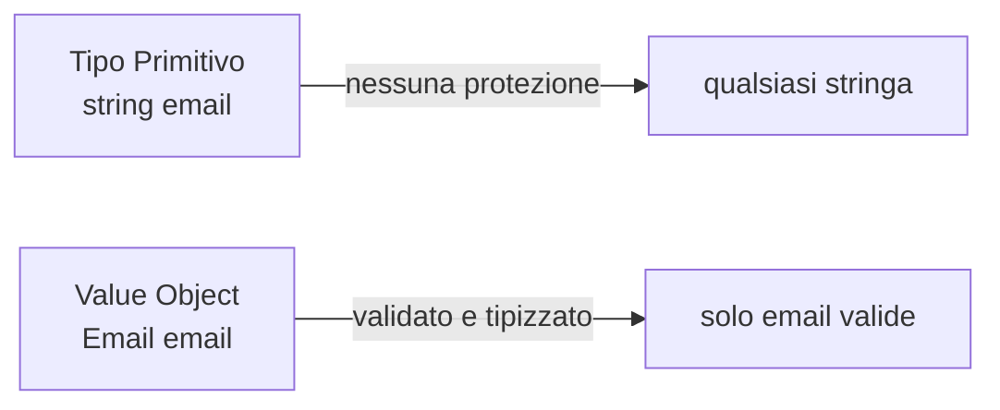

## 1. Il problema con i tipi primitivi

Immagina questo codice:

```cs
public void ProcessaOrdine(int ordineId, int clienteId, int prodottoId)
{
    // ❌ Niente impedisce di chiamarlo così:
    ProcessaOrdine(prodottoId, ordineId, clienteId); // parametri invertiti!
}
```

I tipi primitivi come `int`, `string`, `Guid` non portano con sé **significato semantico**. Questo porta a:

- **Parametri invertiti** senza errori di compilazione.
- **ID di entità diverse interscambiabili** (un `OrdineId` assegnato a un campo `ClienteId`).
- **Business rules sparse** invece di centralizzate.

## 2. Cos'è un Value Object (DDD)

Nel **Domain-Driven Design (DDD)**, un **Value Object** è un oggetto che:

- È identificato dal suo **valore**, non da un'identità.
- È **immutabile** (non cambia dopo la creazione).
- Ha **uguaglianza per valore** (due Value Objects con gli stessi dati sono uguali).
- Può contenere **regole di validazione** (invarianti).



Esempi classici di Value Objects:
- `Email`, `Indirizzo`, `Denaro`, `Intervallo di Date`
- `OrdineId`, `ClienteId`, `ProdottoId`

## 3. Strongly Typed IDs

Gli **Strongly Typed IDs** sono un caso speciale di Value Object che wrappa un ID primitivo per dargli un tipo semantico.

```cs
// ❌ SENZA strongly typed IDs
public void AssegnaOrdineACliente(int ordineId, int clienteId) { }

// ✅ CON strongly typed IDs
public void AssegnaOrdineACliente(OrdineId ordineId, ClienteId clienteId) { }
// Non si può più invertire i parametri: il compilatore lo impedisce!
```

## 4. Implementazione con struct

```cs
public readonly struct OrdineId : IEquatable<OrdineId>
{
    public int Value { get; }

    public OrdineId(int value)
    {
        if (value <= 0)
            throw new ArgumentException("OrdineId deve essere positivo", nameof(value));
        Value = value;
    }

    public bool Equals(OrdineId other) => Value == other.Value;
    public override bool Equals(object? obj) => obj is OrdineId id && Equals(id);
    public override int GetHashCode() => Value.GetHashCode();
    public override string ToString() => $"OrdineId({Value})";

    public static bool operator ==(OrdineId left, OrdineId right) => left.Equals(right);
    public static bool operator !=(OrdineId left, OrdineId right) => !left.Equals(right);
}

// Uso
var ordineId = new OrdineId(42);
Console.WriteLine(ordineId); // OrdineId(42)
```

## 5. Implementazione con record (C# 9+)

I **record** semplificano enormemente l'implementazione di Value Objects grazie all'**uguaglianza strutturale built-in**.

```cs
// Record struct — zero allocazioni heap, uguaglianza per valore
public readonly record struct OrdineId(int Value)
{
    // Validazione nel costruttore
    public OrdineId(int value) : this(value)
    {
        if (value <= 0)
            throw new ArgumentException("OrdineId deve essere positivo");
    }
}

public readonly record struct ClienteId(Guid Value);
public readonly record struct ProdottoId(int Value);

// Uso
var ordineId  = new OrdineId(1);
var clienteId = new ClienteId(Guid.NewGuid());

// L'uguaglianza funziona automaticamente
var a = new OrdineId(1);
var b = new OrdineId(1);
Console.WriteLine(a == b); // true ✅
```

## 6. Value Objects con business rules

```cs
public readonly record struct Email
{
    public string Value { get; }

    public Email(string value)
    {
        if (string.IsNullOrWhiteSpace(value))
            throw new ArgumentException("L'email non può essere vuota");

        if (!value.Contains('@'))
            throw new ArgumentException($"'{value}' non è un indirizzo email valido");

        Value = value.ToLowerInvariant();
    }

    public override string ToString() => Value;
}

// Uso
var email = new Email("utente@esempio.com"); // ✅
var invalida = new Email("non-una-email");   // ❌ lancia eccezione
```

### Value Object Money

```cs
public record Money(decimal Amount, string Currency)
{
    public static Money Euro(decimal amount) => new(amount, "EUR");
    public static Money Dollaro(decimal amount) => new(amount, "USD");

    public Money Aggiungi(Money altro)
    {
        if (Currency != altro.Currency)
            throw new InvalidOperationException("Non si possono sommare valute diverse");
        return this with { Amount = Amount + altro.Amount };
    }

    public override string ToString() => $"{Amount:F2} {Currency}";
}

// Uso
var prezzo1 = Money.Euro(10.50m);
var prezzo2 = Money.Euro(5.00m);
var totale  = prezzo1.Aggiungi(prezzo2);
Console.WriteLine(totale); // 15.50 EUR
```

## 7. Strongly Typed IDs con EF Core

EF Core ha bisogno di sapere come convertire i Strongly Typed IDs da/verso il database.

```cs
// Configura il Value Converter
public class AppDbContext : DbContext
{
    public DbSet<Ordine> Ordini { get; set; }

    protected override void OnModelCreating(ModelBuilder modelBuilder)
    {
        modelBuilder.Entity<Ordine>(entity =>
        {
            // Dice a EF come convertire OrdineId <-> int
            entity.Property(o => o.Id)
                  .HasConversion(
                      v => v.Value,             // OrdineId → int (salvataggio)
                      v => new OrdineId(v));    // int → OrdineId (lettura)

            entity.Property(o => o.ClienteId)
                  .HasConversion(
                      v => v.Value,
                      v => new ClienteId(v));
        });
    }
}

public class Ordine
{
    public OrdineId Id { get; set; }
    public ClienteId ClienteId { get; set; }
    public decimal Totale { get; set; }
}
```

## 8. Pattern con factory method

Un pattern comune è usare un **factory method** per la creazione, nascondendo il costruttore.

```cs
public readonly record struct Email
{
    private Email(string value) => Value = value;

    public string Value { get; }

    // Factory method con Result pattern
    public static (Email? Email, string? Errore) Crea(string input)
    {
        if (string.IsNullOrWhiteSpace(input))
            return (null, "L'email non può essere vuota");

        if (!input.Contains('@'))
            return (null, $"'{input}' non è un'email valida");

        return (new Email(input.ToLowerInvariant()), null);
    }

    public override string ToString() => Value;
}

// Uso
var (email, errore) = Email.Crea("user@example.com");
if (errore is not null)
    Console.WriteLine($"Errore: {errore}");
else
    Console.WriteLine($"Email valida: {email}");
```

## 9. Confronto approcci

| Approccio | Uguaglianza | Allocazione heap | Validazione | Codice |
|---|---|---|---|---|
| `struct` classico | Manuale | ❌ nessuna | ✅ | Verboso |
| `record struct` | ✅ automatica | ❌ nessuna | ✅ | Compatto |
| `record class` | ✅ automatica | Sì | ✅ | Compatto |

## 10. Quiz

import Quiz from '../../../components/Quiz.jsx';

<Quiz client:load questions={[
{
question:"Qual è il problema principale degli ID con tipo primitivo (int, Guid)?",
answers:{
a:"Occupano troppa memoria",
b:"Non possono essere usati come chiavi",
c:"Non hanno significato semantico, i parametri possono essere invertiti senza errori",
d:"Non funzionano con EF Core"
},
correctAnswer:"c"
},
{
question:"Un Value Object in DDD è identificato da:",
answers:{
a:"Un ID univoco",
b:"Un indirizzo di memoria",
c:"Il suo valore (uguaglianza strutturale)",
d:"Il nome della classe"
},
correctAnswer:"c"
},
{
question:"Quale caratteristica fondamentale ha un Value Object?",
answers:{
a:"È mutabile nel tempo",
b:"È immutabile",
c:"Ha sempre un ID intero",
d:"Deve ereditare da Entity"
},
correctAnswer:"b"
},
{
question:"I `record struct` in C# 9+ hanno l'uguaglianza:",
answers:{
a:"Per riferimento (reference equality)",
b:"Non supportata",
c:"Per valore (value equality), built-in",
d:"Solo con Equals() manuale"
},
correctAnswer:"c"
},
{
question:"Cosa vantaggio principale offrono gli Strongly Typed IDs?",
answers:{
a:"Riducono la memoria usata",
b:"Il compilatore impedisce la confusione tra ID di tipi diversi",
c:"Rendono le query più veloci",
d:"Eliminano la necessità di migrazioni"
},
correctAnswer:"b"
},
{
question:"Per usare Strongly Typed IDs con EF Core è necessario:",
answers:{
a:"Implementare IComparable",
b:"Usare solo Guid come tipo interno",
c:"Configurare un Value Converter",
d:"Creare una tabella separata"
},
correctAnswer:"c"
},
{
question:"Il Value Object Money con metodo Aggiungi() che lancia eccezione se le valute sono diverse è un esempio di:",
answers:{
a:"Lazy loading",
b:"Invariante di dominio (business rule)",
c:"Dependency Injection",
d:"Factory pattern"
},
correctAnswer:"b"
},
{
question:"Quale tipo ha zero allocazioni heap in C#?",
answers:{
a:"record class",
b:"class",
c:"record struct",
d:"interface"
},
correctAnswer:"c"
},
{
question:"Il factory method pattern nei Value Objects serve per:",
answers:{
a:"Creare il DbContext",
b:"Nascondere il costruttore e restituire errori senza eccezioni",
c:"Registrare i servizi nel container DI",
d:"Convertire i tipi nel database"
},
correctAnswer:"b"
},
{
question:"Due oggetti Email con lo stesso valore sono uguali in un record struct?",
answers:{
a:"No, mai",
b:"Solo con ReferenceEquals",
c:"Sì, per via dell'uguaglianza strutturale automatica",
d:"Solo se implementano IEquatable"
},
correctAnswer:"c"
}
]} />

## 11. Esercizi

### 11.1 ID tipizzati per un e-commerce

**Scenario**: Vuoi proteggere un sistema e-commerce dalla confusione tra ID diversi.

**Consegna**:
1. Crea `OrdineId`, `ClienteId`, `ProdottoId` come `readonly record struct` con un `int Value`.
2. Aggiungi validazione (es. valore positivo).
3. Scrivi un metodo `ProcessaOrdine(OrdineId ordineId, ClienteId clienteId)` e verifica che il compilatore impedisca di invertire i parametri.
4. Testa l'uguaglianza: due `OrdineId(1)` devono essere uguali.

*Obiettivo: comprendere come i Strongly Typed IDs proteggono il codice a compile time.*

### 11.2 Value Object Email

**Scenario**: Vuoi un tipo `Email` che garantisce sempre un valore valido.

**Consegna**:
1. Crea `Email` come `readonly record struct` con validazione nel costruttore (non vuota, contiene @, dominio valido).
2. Implementa il factory method `Crea(string input)` che restituisce `(Email?, string?)`.
3. Scrivi test per: email valida, email senza @, email vuota.
4. Usa `Email` come proprietà di una classe `Utente`.

*Obiettivo: costruire un Value Object con business rules e gestione errori senza eccezioni.*

### 11.3 Value Object Money

**Scenario**: Gestisci importi monetari in modo sicuro.

**Consegna**:
1. Crea `Money` con `Amount (decimal)` e `Currency (string)`.
2. Implementa `Aggiungi(Money altro)` e `Sottrai(Money altro)` con controllo valuta.
3. Aggiungi factory method `Euro(decimal)` e `Dollaro(decimal)`.
4. Dimostra che due `Money(10, "EUR")` sono uguali.

*Obiettivo: implementare un Value Object multi-proprietà con operazioni di dominio.*
