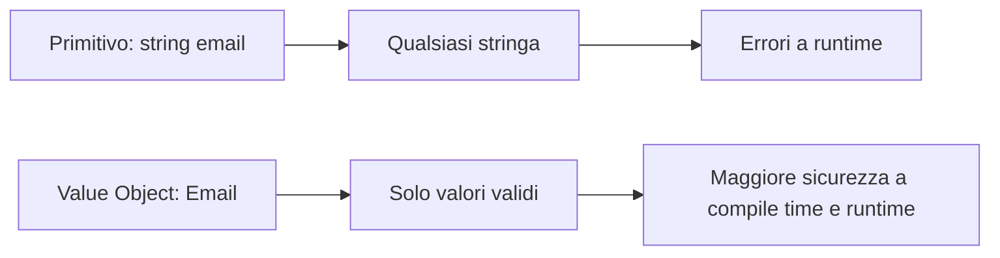
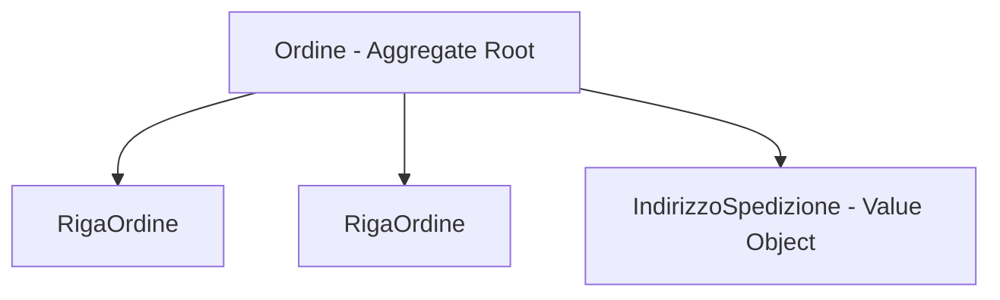

## 1. Il problema con i tipi primitivi

Immagina questo codice:

```cs
public void ProcessaOrdine(int ordineId, int clienteId, int prodottoId)
{
    // Il compilatore accetta la chiamata anche se semanticamente è sbagliata
    ProcessaOrdine(prodottoId, ordineId, clienteId);
}
```

Dal punto di vista del compilatore, tre `int` sono semplicemente tre `int`. Dal punto di vista del dominio, invece, `OrdineId`, `ClienteId` e `ProdottoId` rappresentano concetti diversi.

Questo è un caso classico di **Primitive Obsession**: si usano tipi primitivi per rappresentare concetti di dominio più ricchi di quanto il tipo riesca a esprimere.

Le conseguenze pratiche sono:

- **Parametri invertiti** senza errori di compilazione.
- **Mescolanza di identità diverse**: un ID ordine può finire in un campo cliente.
- **Validazioni duplicate** in controller, service, repository e metodi helper.
- **Regole di dominio disperse** invece di essere centralizzate dentro il tipo giusto.
- **API meno leggibili**: `string email` dice meno di `Email email`.



Il punto chiave è questo: un tipo non dovrebbe contenere solo dati, ma anche **significato semantico**.

## 2. DDD in profondità: Entity, Value Object, Aggregate Root

Nel **Domain-Driven Design (DDD)**, non tutti gli oggetti del dominio hanno lo stesso ruolo.

### Entity

Una **Entity** è un oggetto definito dalla sua **identità**, non solo dai suoi dati.

Esempio: un `Ordine` può cambiare stato, totale, righe, indirizzo di spedizione, ma rimane sempre lo stesso ordine se il suo `OrdineId` è lo stesso.

```cs
public class Ordine
{
    public OrdineId Id { get; private set; }
    public Email EmailCliente { get; private set; }
    public decimal Totale { get; private set; }
}
```

Due `Ordine` con lo stesso ID rappresentano concettualmente la stessa entità, anche se alcuni campi cambiano nel tempo.

### Value Object

Un **Value Object** è definito dai suoi **valori interni**:

- non ha identità autonoma;
- in genere è **immutabile**;
- possiede **uguaglianza per valore**;
- incapsula regole di validazione e comportamento locale.

Esempi tipici:

- `Email`
- `Money`
- `Address`
- `DateRange`
- `OrdineId`, `ClienteId`, `ProdottoId`

Se due `Email` contengono lo stesso valore normalizzato, sono uguali. Non interessa "quale istanza" siano, ma "quale valore" rappresentino.

### Aggregate Root

Un **Aggregate Root** è, in breve, l'entità principale di un aggregato: il punto di ingresso attraverso cui il resto del sistema modifica in modo consistente un gruppo di oggetti correlati.

Per esempio:



L'idea è che le invarianti dell'aggregato vengano protette passando dal root (`Ordine`), non modificando direttamente ogni oggetto interno in modo arbitrario.

### Identità vs valore

La distinzione più importante è:

- **Equality basata su identità**: tipica delle Entity.
- **Equality basata sul valore**: tipica dei Value Objects.

In forma intuitiva:

- Entity: "sono la stessa cosa nel tempo?"
- Value Object: "contengo gli stessi valori?"

## 3. Uguaglianza strutturale e proprietà matematiche

Quando diciamo che un Value Object usa **uguaglianza strutturale**, intendiamo che due istanze sono uguali se tutti i loro componenti significativi sono uguali.

Per esempio:

```cs
var a = new Email("utente@example.com");
var b = new Email("UTENTE@example.com");
```

Se il tipo normalizza il valore in lowercase, `a` e `b` possono risultare uguali perché rappresentano lo stesso valore di dominio.

### Equality basata su identità vs equality basata su valore

Per le Entity:

```cs
public sealed class Cliente
{
    public ClienteId Id { get; init; }
    public string Nome { get; init; } = "";
}
```

di solito interessa:

```cs
cliente1.Id == cliente2.Id
```

Per un Value Object:

```cs
public readonly record struct Money(decimal Amount, string Currency);
```

interessa invece:

```cs
new Money(10m, "EUR") == new Money(10m, "EUR")
```

### Definizione matematica: relazione di equivalenza

L'uguaglianza corretta di un Value Object dovrebbe comportarsi come una **relazione di equivalenza**.

Una relazione `~` su un insieme `S` è una relazione di equivalenza se vale:

$$
\forall x \in S,\ x \sim x
$$

Questa proprietà si chiama **riflessività**: ogni valore deve essere uguale a sé stesso.

$$
\forall x, y \in S,\ x \sim y \Rightarrow y \sim x
$$

Questa proprietà si chiama **simmetria**: se `x` è uguale a `y`, allora `y` è uguale a `x`.

$$
\forall x, y, z \in S,\ (x \sim y \land y \sim z) \Rightarrow x \sim z
$$

Questa proprietà si chiama **transitività**: se `x` è uguale a `y` e `y` è uguale a `z`, allora `x` deve essere uguale a `z`.

Inoltre, in .NET vale una regola pratica fondamentale:

$$
x = y \Rightarrow hash(x) = hash(y)
$$

cioè se due oggetti sono uguali, devono produrre lo stesso `GetHashCode()`.

### Perché è importante

Se queste proprietà non valgono, si rompono collezioni e algoritmi:

- `HashSet<T>`
- `Dictionary<TKey, TValue>`
- ordinamenti
- comparazioni
- eliminazione duplicati

Per questo un buon Value Object non deve solo "sembrare" corretto: deve rispettare formalmente il contratto dell'uguaglianza.

## 4. Implementazione manuale: `struct`, `IEquatable<T>` e `IComparable<T>`

Se implementi un Value Object manualmente, i due contratti più importanti sono spesso:

- `IEquatable<T>` per l'uguaglianza tipizzata efficiente;
- `IComparable<T>` per l'ordinamento naturale.

### Perché `IEquatable<T>` è utile

`Equals(object?)` accetta un `object`, quindi può introdurre:

- boxing nel caso dei value type;
- controlli di tipo a runtime;
- meno efficienza nelle collezioni generiche.

`IEquatable<T>` permette invece una comparazione fortemente tipizzata.

### Perché `IComparable<T>` è utile

Serve quando vuoi:

- ordinare liste di Value Objects;
- usare `Sort()`;
- definire un ordine coerente;
- supportare operatori come `<`, `>`, `<=`, `>=`.

### Esempio completo

```cs
public readonly struct OrdineId : IEquatable<OrdineId>, IComparable<OrdineId>
{
    public int Value { get; }

    public OrdineId(int value)
    {
        if (value <= 0)
            throw new ArgumentOutOfRangeException(nameof(value), "OrdineId deve essere positivo");

        Value = value;
    }

    public bool Equals(OrdineId other) => Value == other.Value;

    public override bool Equals(object? obj) =>
        obj is OrdineId other && Equals(other);

    public override int GetHashCode() => Value.GetHashCode();

    public int CompareTo(OrdineId other) => Value.CompareTo(other.Value);

    public override string ToString() => Value.ToString();

    public static bool operator ==(OrdineId left, OrdineId right) => left.Equals(right);
    public static bool operator !=(OrdineId left, OrdineId right) => !left.Equals(right);
    public static bool operator <(OrdineId left, OrdineId right) => left.CompareTo(right) < 0;
    public static bool operator >(OrdineId left, OrdineId right) => left.CompareTo(right) > 0;
    public static bool operator <=(OrdineId left, OrdineId right) => left.CompareTo(right) <= 0;
    public static bool operator >=(OrdineId left, OrdineId right) => left.CompareTo(right) >= 0;

    public static explicit operator int(OrdineId id) => id.Value;
    public static explicit operator OrdineId(int value) => new(value);
}
```

### Note importanti

- `readonly struct` evita mutazioni indesiderate.
- Se ridefinisci `Equals`, devi ridefinire anche `GetHashCode`.
- `CompareTo` dovrebbe essere coerente con l'uguaglianza: se `x.Equals(y)` allora `x.CompareTo(y) == 0`.
- Gli operatori di confronto sono opzionali, ma rendono il tipo più naturale da usare.

## 5. `record` e `record struct`: come funziona davvero l'uguaglianza

I `record` sono stati introdotti per semplificare i modelli basati su dati. In DDD light sono spesso perfetti per i Value Objects.

### `record class` e `record struct`

- `record class`: reference type, allocazione su heap, value equality sintetizzata.
- `record struct`: value type, di norma nessuna allocazione heap se non viene boxato, value equality sintetizzata.

### Cosa genera automaticamente il compilatore

Per un record, il compilatore genera tipicamente:

- `Equals`
- `GetHashCode`
- operatori `==` e `!=`
- `Deconstruct(...)`
- `ToString()`
- supporto al `with`

Esempio:

```cs
public readonly record struct ClienteId(Guid Value);

var id1 = new ClienteId(Guid.Parse("aaaaaaaa-aaaa-aaaa-aaaa-aaaaaaaaaaaa"));
var id2 = new ClienteId(Guid.Parse("aaaaaaaa-aaaa-aaaa-aaaa-aaaaaaaaaaaa"));

Console.WriteLine(id1 == id2); // true

var (rawGuid) = id1; // Deconstruct automatico
Console.WriteLine(rawGuid);
```

### `EqualityContract`

Nei **record class** esiste anche il concetto di `EqualityContract`, usato per far sì che l'uguaglianza tenga conto del tipo runtime corretto nelle gerarchie di ereditarietà.

```cs
public record Documento(string Numero);
public record Fattura(string Numero) : Documento(Numero);
```

Qui il compilatore usa internamente `EqualityContract` per evitare che record di tipi diversi risultino uguali solo perché hanno gli stessi valori.

In pratica:

- `record class` con ereditarietà: il tipo concreto conta;
- `record struct`: niente ereditarietà, quindi niente problema di `EqualityContract` nello stesso senso.

### `Deconstruct`

Il metodo `Deconstruct` consente di spacchettare il record:

```cs
public readonly record struct Money(decimal Amount, string Currency);

var money = new Money(10m, "EUR");
var (amount, currency) = money;
```

È utile per pattern matching, test, assegnazioni multiple e codice molto leggibile.

### `with` expression

Il `with` crea una nuova istanza copiando quella esistente e cambiando solo alcuni membri.

```cs
public record Money(decimal Amount, string Currency);

var originale = new Money(10m, "EUR");
var aggiornato = originale with { Amount = 15m };
```

Per i Value Objects questo ha senso solo se il tipo rimane valido dopo la copia. Per questo spesso:

- si usano proprietà init-only;
- oppure si espongono metodi di dominio invece di affidarsi troppo al `with`.

### Esempio di `record struct` con validazione

```cs
public readonly record struct ProdottoId
{
    public int Value { get; }

    public ProdottoId(int value)
    {
        if (value <= 0)
            throw new ArgumentOutOfRangeException(nameof(value), "ProdottoId deve essere positivo");

        Value = value;
    }

    public static explicit operator int(ProdottoId id) => id.Value;
    public static explicit operator ProdottoId(int value) => new(value);

    public override string ToString() => $"ProdottoId({Value})";
}
```

## 6. Validazione robusta: factory, conversioni e pattern `Result<T>` / `Either`

Lanciare eccezioni va bene quando hai davvero una situazione eccezionale. Ma per input utente o dati esterni spesso è meglio rappresentare il fallimento come un valore esplicito.

### Conversioni implicite ed esplicite

Gli operatori di conversione permettono a un Value Object di convivere con tipi primitivi senza perdere ergonomia.

- `implicit`: conversione automatica, da usare con cautela.
- `explicit`: richiede cast esplicito, più sicura quando c'è rischio di ambiguità o validazione.

```cs
public readonly record struct Email
{
    public string Value { get; }

    private Email(string value) => Value = value;

    public static Result<Email> Create(string input)
    {
        if (string.IsNullOrWhiteSpace(input))
            return Result<Email>.Failure("L'email non può essere vuota");

        var normalized = input.Trim().ToLowerInvariant();

        if (!normalized.Contains('@'))
            return Result<Email>.Failure("Formato email non valido");

        return Result<Email>.Success(new Email(normalized));
    }

    public static implicit operator string(Email email) => email.Value;

    public static explicit operator Email(string value) =>
        Create(value).ValueOrThrow();

    public override string ToString() => Value;
}
```

Qui:

- `Email -> string` può essere implicita perché non fallisce;
- `string -> Email` è meglio esplicita perché può fallire.

### Pattern `Result<T>`

Un `Result<T>` modella il fatto che un'operazione può riuscire o fallire.

```cs
public sealed class Result<T>
{
    private Result(bool isSuccess, T? value, string? error)
    {
        IsSuccess = isSuccess;
        Value = value;
        Error = error;
    }

    public bool IsSuccess { get; }
    public bool IsFailure => !IsSuccess;
    public T? Value { get; }
    public string? Error { get; }

    public static Result<T> Success(T value) => new(true, value, null);
    public static Result<T> Failure(string error) => new(false, default, error);

    public T ValueOrThrow() =>
        IsSuccess ? Value! : throw new InvalidOperationException(Error);
}
```

Uso:

```cs
var result = Email.Create("utente@example.com");

if (result.IsFailure)
{
    Console.WriteLine(result.Error);
}
else
{
    Email email = result.Value!;
    Console.WriteLine(email);
}
```

### Variante `Either`

Lo stesso concetto può essere espresso come `Either<Errore, Valore>`:

- lato sinistro: errore;
- lato destro: successo.

È molto usato in stili più funzionali, ma il concetto è lo stesso: il fallimento è un dato, non un'eccezione.

### Esempio: `Money`

```cs
public readonly record struct Money(decimal Amount, string Currency)
{
    public static Result<Money> Create(decimal amount, string currency)
    {
        if (amount < 0)
            return Result<Money>.Failure("L'importo non può essere negativo");

        if (string.IsNullOrWhiteSpace(currency))
            return Result<Money>.Failure("La valuta è obbligatoria");

        return Result<Money>.Success(new Money(amount, currency.ToUpperInvariant()));
    }

    public Result<Money> Add(Money other)
    {
        if (Currency != other.Currency)
            return Result<Money>.Failure("Non si possono sommare valute diverse");

        return Result<Money>.Success(this with { Amount = Amount + other.Amount });
    }
}
```

## 7. Attraversare i confini applicativi: JSON e ASP.NET Core model binding

Un Value Object non vive solo nel dominio. Prima o poi deve passare da:

- JSON
- HTTP route/query string
- model binding di ASP.NET Core
- database


### `System.Text.Json` e custom converter

Se hai un Value Object come:

```cs
public readonly record struct OrdineId(int Value);
```

potresti voler serializzare solo il valore interno:

```json
42
```

invece di:

```json
{ "value": 42 }
```

Puoi farlo con un converter personalizzato:

```cs
using System.Text.Json;
using System.Text.Json.Serialization;

public sealed class OrdineIdJsonConverter : JsonConverter<OrdineId>
{
    public override OrdineId Read(ref Utf8JsonReader reader, Type typeToConvert, JsonSerializerOptions options)
    {
        var value = reader.GetInt32();
        return new OrdineId(value);
    }

    public override void Write(Utf8JsonWriter writer, OrdineId value, JsonSerializerOptions options)
    {
        writer.WriteNumberValue(value.Value);
    }
}
```

Registrazione:

```cs
builder.Services.ConfigureHttpJsonOptions(options =>
{
    options.SerializerOptions.Converters.Add(new OrdineIdJsonConverter());
});
```

Per Value Objects basati su stringa, il converter legge e scrive stringhe; per `Guid`, usa `WriteStringValue` o parsing dedicato.

### ASP.NET Core model binding con `TypeConverter`

Per route e query param semplici, un `TypeConverter` è spesso la soluzione più leggera:

```cs
using System.ComponentModel;
using System.Globalization;

[TypeConverter(typeof(OrdineIdTypeConverter))]
public readonly record struct OrdineId(int Value);

public sealed class OrdineIdTypeConverter : TypeConverter
{
    public override bool CanConvertFrom(ITypeDescriptorContext? context, Type sourceType) =>
        sourceType == typeof(string) || base.CanConvertFrom(context, sourceType);

    public override object? ConvertFrom(ITypeDescriptorContext? context, CultureInfo? culture, object value)
    {
        if (value is string s && int.TryParse(s, out var parsed))
            return new OrdineId(parsed);

        throw new FormatException("OrdineId non valido");
    }
}
```

A quel punto puoi scrivere:

```cs
[HttpGet("{id}")]
public IActionResult GetById(OrdineId id)
{
    return Ok(id.Value);
}
```

### Quando usare `IModelBinder`

Se la logica di binding è più complessa, puoi creare un binder personalizzato:

- gestione errori dettagliata;
- dipendenze dal container DI;
- parsing complesso;
- mapping verso `Result<T>`.

```cs
using Microsoft.AspNetCore.Mvc.ModelBinding;

public sealed class EmailModelBinder : IModelBinder
{
    public Task BindModelAsync(ModelBindingContext bindingContext)
    {
        var raw = bindingContext.ValueProvider.GetValue(bindingContext.ModelName).FirstValue;

        if (raw is null)
            return Task.CompletedTask;

        var result = Email.Create(raw);

        if (result.IsSuccess)
        {
            bindingContext.Result = ModelBindingResult.Success(result.Value);
        }
        else
        {
            bindingContext.ModelState.AddModelError(bindingContext.ModelName, result.Error!);
        }

        return Task.CompletedTask;
    }
}
```

Idea pratica:

- `TypeConverter` per tipi semplici;
- `IModelBinder` quando serve controllo completo.

## 8. Persistenza e automazione: EF Core e source generator `AndrewLock.StronglyTypedId`

### EF Core

EF Core deve sapere come mappare un Value Object sul tipo persistito.

```cs
public class AppDbContext : DbContext
{
    public DbSet<Ordine> Ordini => Set<Ordine>();

    protected override void OnModelCreating(ModelBuilder modelBuilder)
    {
        modelBuilder.Entity<Ordine>(entity =>
        {
            entity.Property(o => o.Id)
                  .HasConversion(
                      id => id.Value,
                      value => new OrdineId(value));

            entity.Property(o => o.ClienteId)
                  .HasConversion(
                      id => id.Value,
                      value => new ClienteId(value));
        });
    }
}

public class Ordine
{
    public OrdineId Id { get; set; }
    public ClienteId ClienteId { get; set; }
    public decimal Totale { get; set; }
}

public readonly record struct ClienteId(Guid Value);
```

Questo evita di perdere i vantaggi dei tipi forti solo perché il database salva primitivi.

### `AndrewLock.StronglyTypedId`

Se devi creare molti strongly typed IDs, scrivere a mano sempre:

- wrapper;
- `Equals`;
- `GetHashCode`;
- `ToString`;
- converter JSON;
- supporto EF Core;
- parsers

diventa ripetitivo.

La libreria **AndrewLock.StronglyTypedId** usa un **source generator** per generare automaticamente il codice boilerplate.

Esempio concettuale:

```cs
using StronglyTypedIds;

[StronglyTypedId]
public partial struct OrdineId;
```

Oppure con tipo sottostante specifico:

```cs
using StronglyTypedIds;

[StronglyTypedId(Template.Guid)]
public partial struct ClienteId;
```

In base al template scelto, il generatore può produrre codice per:

- `int`
- `long`
- `Guid`
- `string`

e spesso integrare:

- `System.Text.Json`
- `TypeConverter`
- `Newtonsoft.Json`
- EF Core converters

Il vantaggio principale è ridurre il codice ripetitivo mantenendo un modello coerente in tutta la soluzione.

### Quando usare generatori

Un source generator ha senso quando:

- hai molti ID tipizzati;
- vuoi convenzioni uniformi;
- vuoi evitare errori di copia-incolla;
- vuoi centralizzare il comportamento.

Se invece hai solo 1 o 2 tipi, una implementazione manuale può essere più semplice e leggibile.

## 9. Confronto tra approcci e quando non usare Value Objects

### Confronto tecnico

| Approccio | Categoria | Uguaglianza di default | Allocazione | Boxing | Note |
|---|---|---|---|---|---|
| `struct` | Value type | Manuale o `ValueType.Equals` | In genere stack/inlined | Possibile | Molto efficiente, ma più verboso |
| `record struct` | Value type | Automatica per valore | In genere stack/inlined | Possibile | Ottimo compromesso per VO piccoli |
| `class` | Reference type | Per riferimento, salvo override | Heap | No per il tipo stesso | Flessibile, ma richiede più disciplina |
| `record class` | Reference type | Automatica per valore | Heap | No per il tipo stesso | Ottimo per VO grandi o gerarchie dati |

### Memoria, allocazioni e copying

Osservazioni pratiche:

- `struct` e `record struct` evitano allocazioni heap nella maggior parte dei casi.
- Se un value type viene trattato come `object` o interfaccia non generica, può avvenire **boxing**.
- Un value type molto grande può essere costoso da copiare.
- `record class` e `class` allocano su heap, ma evitano copie implicite dell'intera struttura.

Regola pratica:

- VO piccoli e semplici: spesso `readonly record struct`.
- VO con più campi o semantica più ricca: valuta `record class`.
- Gerarchie o ereditarietà: `record class`.
- Massimo controllo low-level: `readonly struct`.

### Quando NON usare Value Objects

Non ogni `string` merita un tipo dedicato. Alcuni segnali di over-engineering:

- il tipo non incapsula nessuna regola;
- non aumenta davvero la leggibilità;
- viene usato una sola volta e non rappresenta un concetto di dominio stabile;
- aggiunge conversioni, binder e converter senza un beneficio reale;
- rallenta il team perché il dominio è banale.

Esempi in cui potresti evitare un Value Object:

- script molto piccoli;
- prototipi veloci;
- campi tecnici senza semantica di dominio;
- applicazioni CRUD semplicissime dove il costo architetturale supera il beneficio.

Il criterio corretto non è "usare sempre Value Objects", ma:

> usare un Value Object quando aggiunge significato, sicurezza e coesione delle regole.

### Sintesi finale

Gli Strongly Typed IDs sono un caso particolare di Value Object. Servono a spostare errori:

- da runtime a compile time;
- da logica dispersa a tipi espliciti;
- da convenzioni informali a modelli verificabili.

Se implementati bene, combinano:

- teoria DDD;
- uguaglianza formale corretta;
- integrazione con .NET moderno;
- miglior leggibilità delle API;
- riduzione degli errori semantici.

## 10. Quiz

import Quiz from '../../../components/Quiz.jsx';

<Quiz client:load questions={[
{
question:"Qual è il problema principale degli ID con tipo primitivo (int, Guid)?",
answers:{
a:"Occupano troppa memoria",
b:"Non possono essere usati come chiavi",
c:"Non hanno significato semantico, i parametri possono essere invertiti senza errori",
d:"Non funzionano con EF Core"
},
correctAnswer:"c"
},
{
question:"Un Value Object in DDD è identificato da:",
answers:{
a:"Un ID univoco",
b:"Un indirizzo di memoria",
c:"Il suo valore (uguaglianza strutturale)",
d:"Il nome della classe"
},
correctAnswer:"c"
},
{
question:"Quale caratteristica fondamentale ha un Value Object?",
answers:{
a:"È mutabile nel tempo",
b:"È immutabile",
c:"Ha sempre un ID intero",
d:"Deve ereditare da Entity"
},
correctAnswer:"b"
},
{
question:"I `record struct` in C# 9+ hanno l'uguaglianza:",
answers:{
a:"Per riferimento (reference equality)",
b:"Non supportata",
c:"Per valore (value equality), built-in",
d:"Solo con Equals() manuale"
},
correctAnswer:"c"
},
{
question:"Cosa vantaggio principale offrono gli Strongly Typed IDs?",
answers:{
a:"Riducono la memoria usata",
b:"Il compilatore impedisce la confusione tra ID di tipi diversi",
c:"Rendono le query più veloci",
d:"Eliminano la necessità di migrazioni"
},
correctAnswer:"b"
},
{
question:"Per usare Strongly Typed IDs con EF Core è necessario:",
answers:{
a:"Implementare IComparable",
b:"Usare solo Guid come tipo interno",
c:"Configurare un Value Converter",
d:"Creare una tabella separata"
},
correctAnswer:"c"
},
{
question:"Il Value Object Money con metodo Aggiungi() che lancia eccezione se le valute sono diverse è un esempio di:",
answers:{
a:"Lazy loading",
b:"Invariante di dominio (business rule)",
c:"Dependency Injection",
d:"Factory pattern"
},
correctAnswer:"b"
},
{
question:"Quale tipo ha zero allocazioni heap in C#?",
answers:{
a:"record class",
b:"class",
c:"record struct",
d:"interface"
},
correctAnswer:"c"
},
{
question:"Il factory method pattern nei Value Objects serve per:",
answers:{
a:"Creare il DbContext",
b:"Nascondere il costruttore e restituire errori senza eccezioni",
c:"Registrare i servizi nel container DI",
d:"Convertire i tipi nel database"
},
correctAnswer:"b"
},
{
question:"Due oggetti Email con lo stesso valore sono uguali in un record struct?",
answers:{
a:"No, mai",
b:"Solo con ReferenceEquals",
c:"Sì, per via dell'uguaglianza strutturale automatica",
d:"Solo se implementano IEquatable"
},
correctAnswer:"c"
}
]} />

## 11. Esercizi

### 11.1 ID tipizzati per un e-commerce

**Scenario**: Vuoi proteggere un sistema e-commerce dalla confusione tra ID diversi.

**Consegna**:
1. Crea `OrdineId`, `ClienteId`, `ProdottoId` come `readonly record struct` con un `int Value`.
2. Aggiungi validazione (es. valore positivo).
3. Scrivi un metodo `ProcessaOrdine(OrdineId ordineId, ClienteId clienteId)` e verifica che il compilatore impedisca di invertire i parametri.
4. Testa l'uguaglianza: due `OrdineId(1)` devono essere uguali.

*Obiettivo: comprendere come i Strongly Typed IDs proteggono il codice a compile time.*

### 11.2 Value Object Email

**Scenario**: Vuoi un tipo `Email` che garantisce sempre un valore valido.

**Consegna**:
1. Crea `Email` come `readonly record struct` con validazione nel costruttore (non vuota, contiene @, dominio valido).
2. Implementa il factory method `Crea(string input)` che restituisce `(Email?, string?)`.
3. Scrivi test per: email valida, email senza @, email vuota.
4. Usa `Email` come proprietà di una classe `Utente`.

*Obiettivo: costruire un Value Object con business rules e gestione errori senza eccezioni.*

### 11.3 Value Object Money

**Scenario**: Gestisci importi monetari in modo sicuro.

**Consegna**:
1. Crea `Money` con `Amount (decimal)` e `Currency (string)`.
2. Implementa `Aggiungi(Money altro)` e `Sottrai(Money altro)` con controllo valuta.
3. Aggiungi factory method `Euro(decimal)` e `Dollaro(decimal)`.
4. Dimostra che due `Money(10, "EUR")` sono uguali.

*Obiettivo: implementare un Value Object multi-proprietà con operazioni di dominio.*
