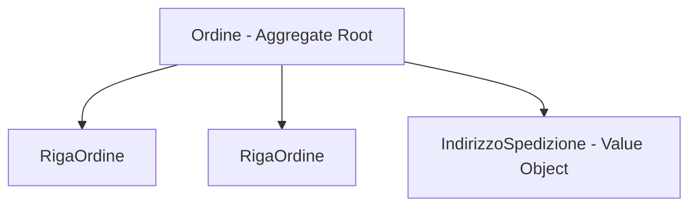

## 1. Il problema con i tipi primitivi

Immagina questo codice:

```cs
public void ProcessaOrdine(int ordineId, int clienteId, int prodottoId) { /* ... */ }

// Il compilatore accetta la chiamata anche se semanticamente è sbagliata
ProcessaOrdine(prodottoId, ordineId, clienteId);
```

Per il compilatore tre `int` sono solo tre `int`. Per il dominio, invece, `OrdineId`, `ClienteId` e `ProdottoId` sono concetti diversi.

Questo è un caso classico di **Primitive Obsession**: usare tipi primitivi per concetti di dominio più ricchi. Le conseguenze tipiche sono parametri invertiti senza errori, validazioni duplicate in più punti e API meno leggibili (`string email` dice meno di `Email email`).

Con uno **strongly typed ID** l'errore emerge a compile time:

```cs
public readonly record struct OrdineId(int Value);
public readonly record struct ClienteId(int Value);

public void ProcessaOrdine(OrdineId ordineId, ClienteId clienteId) { /* ... */ }

var ordine = new OrdineId(42);
var cliente = new ClienteId(7);

ProcessaOrdine(ordine, cliente);   // OK
ProcessaOrdine(cliente, ordine);   // errore CS1503: impossibile convertire da 'ClienteId' a 'OrdineId'
```

Il punto chiave: un tipo non dovrebbe contenere solo dati, ma anche **significato semantico**.

## 2. Entity, Value Object e Aggregate Root

Nel **Domain-Driven Design (DDD)** non tutti gli oggetti hanno lo stesso ruolo:

- **Entity**: definita dalla sua **identità**. Un `Ordine` può cambiare stato e totale, ma resta lo stesso ordine finché ha lo stesso `OrdineId`.
- **Value Object**: definito dai suoi **valori**. Non ha identità propria, in genere è **immutabile**, ha **uguaglianza per valore** e incapsula le proprie regole di validazione. Esempi: `Email`, `Money`, `Address`, `DateRange` e gli stessi `OrdineId`, `ClienteId`.
- **Aggregate Root**: l'entità principale di un gruppo di oggetti correlati, unico punto di ingresso per modificarli mantenendo le invarianti.

```cs
// Entity: conta l'identità
public sealed class Cliente
{
    public ClienteId Id { get; init; }
    public string Nome { get; set; } = "";
}

// Value Object: conta il valore
public readonly record struct Money(decimal Amount, string Currency);

var c1 = new Cliente { Id = new ClienteId(1), Nome = "Mario" };
var c2 = new Cliente { Id = new ClienteId(1), Nome = "Mario Rossi" };
Console.WriteLine(c1.Id == c2.Id);                                   // True: stesso cliente

Console.WriteLine(new Money(10m, "EUR") == new Money(10m, "EUR"));   // True: stesso valore
```


```mermaid
graph TD
    A[Ordine - Aggregate Root]
    B[RigaOrdine]
    C[RigaOrdine]
    D[IndirizzoSpedizione - Value Object]

    A --> B
    A --> C
    A --> D
```

<Aside variant="tip">
Una domanda rapida per distinguere i due casi: per una Entity chiediti "è la stessa cosa nel tempo?", per un Value Object "contiene gli stessi valori?".
</Aside>

## 3. Il contratto dell'uguaglianza

L'uguaglianza di un Value Object deve essere una **relazione di equivalenza**:

- **riflessiva**: `x.Equals(x)` è sempre vero;
- **simmetrica**: se `x.Equals(y)` allora `y.Equals(x)`;
- **transitiva**: se `x.Equals(y)` e `y.Equals(z)` allora `x.Equals(z)`.

In più, in .NET vale una regola fondamentale: se due oggetti sono uguali, devono avere lo **stesso `GetHashCode()`**. Se il contratto si rompe, `HashSet<T>`, `Dictionary<TKey, TValue>`, `Distinct()` e gli ordinamenti iniziano a comportarsi in modo imprevedibile.

Esempio con un `Email` che normalizza il valore: chiavi diverse nella forma, uguali nel dominio.

```cs
var set = new HashSet<Email>
{
    new Email("utente@example.com"),
    new Email("UTENTE@Example.com"),   // normalizzata in lowercase: duplicato
};

Console.WriteLine(set.Count); // 1
```

<Aside variant="danger">
Se ridefinisci `Equals` ma non `GetHashCode` (o li calcoli su campi diversi), un oggetto inserito in un `Dictionary` può diventare "irrintracciabile": `ContainsKey` restituisce `false` anche per una chiave uguale.
</Aside>

## 4. Implementazione manuale: `IEquatable<T>` e `IComparable<T>`

Scrivendo un Value Object a mano, i due contratti principali sono:

- `IEquatable<T>`: uguaglianza tipizzata, senza boxing né cast a runtime (a differenza di `Equals(object?)`);
- `IComparable<T>`: ordinamento naturale, per `Sort()`, `OrderBy` e gli operatori `<`, `>`.

```cs
public readonly struct OrdineId : IEquatable<OrdineId>, IComparable<OrdineId>
{
    public int Value { get; }

    public OrdineId(int value)
    {
        if (value <= 0)
            throw new ArgumentOutOfRangeException(nameof(value), "OrdineId deve essere positivo");
        Value = value;
    }

    public bool Equals(OrdineId other) => Value == other.Value;
    public override bool Equals(object? obj) => obj is OrdineId other && Equals(other);
    public override int GetHashCode() => Value.GetHashCode();
    public int CompareTo(OrdineId other) => Value.CompareTo(other.Value);
    public override string ToString() => Value.ToString();

    public static bool operator ==(OrdineId l, OrdineId r) => l.Equals(r);
    public static bool operator !=(OrdineId l, OrdineId r) => !l.Equals(r);
    public static bool operator <(OrdineId l, OrdineId r) => l.CompareTo(r) < 0;
    public static bool operator >(OrdineId l, OrdineId r) => l.CompareTo(r) > 0;

    public static explicit operator int(OrdineId id) => id.Value;
    public static explicit operator OrdineId(int value) => new(value);
}
```

Uso:

```cs
var ids = new List<OrdineId> { new(30), new(10), new(20) };
ids.Sort();                                         // usa CompareTo
Console.WriteLine(string.Join(", ", ids));          // 10, 20, 30
Console.WriteLine(new OrdineId(10) < new OrdineId(20)); // True
```

<Aside variant="warning">
`CompareTo` deve essere coerente con `Equals`: se `x.Equals(y)` allora `x.CompareTo(y) == 0`. Altrimenti un `SortedSet<T>` e un `HashSet<T>` possono dare risultati diversi sugli stessi dati.
</Aside>

## 5. `record` e `record struct`

I `record` eliminano quasi tutto il boilerplate visto sopra. Esistono in due forme:

- `record class` (o solo `record`): reference type, allocato su heap, uguaglianza per valore;
- `record struct`: value type, di norma nessuna allocazione heap (salvo boxing), uguaglianza per valore.

Il compilatore genera automaticamente `Equals`, `GetHashCode`, `==` / `!=`, `ToString()`, `Deconstruct(...)` (per i parametri posizionali) e il supporto a `with`.

```cs
public readonly record struct Money(decimal Amount, string Currency);

var a = new Money(10m, "EUR");
var b = new Money(10m, "EUR");

Console.WriteLine(a == b);          // True
Console.WriteLine(a);               // Money { Amount = 10, Currency = EUR }

var (amount, currency) = a;         // Deconstruct
var c = a with { Amount = 15m };    // nuova istanza, a resta invariato
Console.WriteLine(c.Amount);        // 15
```

Se serve validazione, si rinuncia alla sintassi posizionale e si scrive il costruttore:

```cs
public readonly record struct ProdottoId
{
    public int Value { get; }

    public ProdottoId(int value)
    {
        if (value <= 0)
            throw new ArgumentOutOfRangeException(nameof(value), "ProdottoId deve essere positivo");
        Value = value;
    }

    public override string ToString() => $"ProdottoId({Value})";
}
```

<Aside variant="warning">
Una `struct` ha sempre un valore di default: `default(ProdottoId)` o `new ProdottoId()` producono `Value = 0` **senza passare dalla validazione**. Lo stesso vale per `with`, che copia i campi senza richiamare il costruttore. Se l'invariante è critica, valuta un `record class` o controlla il valore anche nei metodi di dominio.
</Aside>

<Aside variant="info">
Nei `record class` con ereditarietà il compilatore usa una proprietà nascosta `EqualityContract`: così un `Fattura("1")` non risulta mai uguale a un `Documento("1")`, anche con gli stessi valori. I `record struct` non hanno ereditarietà, quindi il problema non si pone.
</Aside>

## 6. Validazione con factory e `Result<T>`

Per input utente o dati esterni, un valore non valido non è davvero "eccezionale": meglio rappresentare il fallimento come un valore esplicito. Lo schema tipico è **costruttore privato + factory method** che restituisce un `Result<T>`.

```cs
public sealed class Result<T>
{
    private Result(bool ok, T? value, string? error) => (IsSuccess, Value, Error) = (ok, value, error);

    public bool IsSuccess { get; }
    public bool IsFailure => !IsSuccess;
    public T? Value { get; }
    public string? Error { get; }

    public static Result<T> Success(T value) => new(true, value, null);
    public static Result<T> Failure(string error) => new(false, default, error);

    public T ValueOrThrow() => IsSuccess ? Value! : throw new InvalidOperationException(Error);
}
```

```cs
public readonly record struct Email
{
    public string Value { get; }
    private Email(string value) => Value = value;

    public static Result<Email> Create(string input)
    {
        if (string.IsNullOrWhiteSpace(input))
            return Result<Email>.Failure("L'email non può essere vuota");

        var normalized = input.Trim().ToLowerInvariant();
        if (!normalized.Contains('@'))
            return Result<Email>.Failure("Formato email non valido");

        return Result<Email>.Success(new Email(normalized));
    }

    public static implicit operator string(Email email) => email.Value;        // non può fallire
    public static explicit operator Email(string value) => Create(value).ValueOrThrow(); // può fallire

    public override string ToString() => Value;
}
```

Uso:

```cs
foreach (var input in new[] { "Utente@Example.com", "", "senza-chiocciola" })
{
    var result = Email.Create(input);
    Console.WriteLine(result.IsSuccess ? $"OK: {result.Value}" : $"Errore: {result.Error}");
}
// OK: utente@example.com
// Errore: L'email non può essere vuota
// Errore: Formato email non valido
```

<Aside variant="tip">
Regola per le conversioni: `implicit` solo se la conversione non può mai fallire (`Email` verso `string`), `explicit` quando può fallire o perdere informazione (`string` verso `Email`). Lo stesso concetto di `Result<T>` nei linguaggi funzionali si chiama `Either<Errore, Valore>`.
</Aside>

I Value Objects possono anche ospitare **invarianti di dominio**. Esempio con `Money`:

```cs
public readonly record struct Money(decimal Amount, string Currency)
{
    public static Result<Money> Create(decimal amount, string currency)
    {
        if (amount < 0) return Result<Money>.Failure("L'importo non può essere negativo");
        if (string.IsNullOrWhiteSpace(currency)) return Result<Money>.Failure("La valuta è obbligatoria");
        return Result<Money>.Success(new Money(amount, currency.ToUpperInvariant()));
    }

    public Result<Money> Add(Money other) =>
        Currency != other.Currency
            ? Result<Money>.Failure("Non si possono sommare valute diverse")
            : Result<Money>.Success(this with { Amount = Amount + other.Amount });
}

var eur = Money.Create(10m, "eur").ValueOrThrow();
var usd = Money.Create(5m, "USD").ValueOrThrow();

Console.WriteLine(eur.Add(eur).Value);  // Money { Amount = 20, Currency = EUR }
Console.WriteLine(eur.Add(usd).Error);  // Non si possono sommare valute diverse
```

## 7. Attraversare i confini: JSON e model binding

Prima o poi un Value Object deve passare da JSON, route, query string e database.

### 7.1 `System.Text.Json`

Senza configurazione, `OrdineId(42)` viene serializzato come `{ "Value": 42 }`. Di solito si vuole il solo valore `42`, e si ottiene con un converter:

```cs
using System.Text.Json;
using System.Text.Json.Serialization;

public sealed class OrdineIdJsonConverter : JsonConverter<OrdineId>
{
    public override OrdineId Read(ref Utf8JsonReader reader, Type typeToConvert, JsonSerializerOptions options)
        => new(reader.GetInt32());

    public override void Write(Utf8JsonWriter writer, OrdineId value, JsonSerializerOptions options)
        => writer.WriteNumberValue(value.Value);
}

// Registrazione (Minimal API)
builder.Services.ConfigureHttpJsonOptions(o =>
    o.SerializerOptions.Converters.Add(new OrdineIdJsonConverter()));
```

In alternativa puoi decorare il tipo con `[JsonConverter(typeof(OrdineIdJsonConverter))]`, così il converter vale ovunque, anche fuori da ASP.NET Core. Per ID basati su `Guid` o `string` usa `GetGuid` / `GetString` e `WriteStringValue`.

### 7.2 Route e query string

Per parametri semplici basta un `TypeConverter`:

```cs
using System.ComponentModel;
using System.Globalization;

[TypeConverter(typeof(OrdineIdTypeConverter))]
public readonly record struct OrdineId(int Value);

public sealed class OrdineIdTypeConverter : TypeConverter
{
    public override bool CanConvertFrom(ITypeDescriptorContext? context, Type sourceType) =>
        sourceType == typeof(string) || base.CanConvertFrom(context, sourceType);

    public override object? ConvertFrom(ITypeDescriptorContext? context, CultureInfo? culture, object value) =>
        value is string s && int.TryParse(s, out var n) ? new OrdineId(n) : throw new FormatException("OrdineId non valido");
}

// Ora il binding funziona direttamente
[HttpGet("{id}")]
public IActionResult GetById(OrdineId id) => Ok(id.Value);
```

<Aside variant="info">
Da .NET 7 esiste anche `IParsable<T>`: se il tipo espone un metodo statico `TryParse(string, IFormatProvider?, out T)`, Minimal API e controller MVC lo usano per il binding senza bisogno di `TypeConverter`.
</Aside>

Quando serve controllo completo (errori dettagliati in `ModelState`, dipendenze dal DI, mapping da `Result<T>`) si usa un `IModelBinder`:

```cs
using Microsoft.AspNetCore.Mvc.ModelBinding;

public sealed class EmailModelBinder : IModelBinder
{
    public Task BindModelAsync(ModelBindingContext ctx)
    {
        var raw = ctx.ValueProvider.GetValue(ctx.ModelName).FirstValue;
        if (raw is null) return Task.CompletedTask;

        var result = Email.Create(raw);
        if (result.IsSuccess)
            ctx.Result = ModelBindingResult.Success(result.Value);
        else
            ctx.ModelState.AddModelError(ctx.ModelName, result.Error!);

        return Task.CompletedTask;
    }
}
```

## 8. Persistenza e automazione

### 8.1 EF Core e Value Converter

Il database salva primitivi, quindi EF Core deve sapere come convertire avanti e indietro:

```cs
public class Ordine
{
    public OrdineId Id { get; set; }
    public ClienteId ClienteId { get; set; }
    public decimal Totale { get; set; }
}

public readonly record struct ClienteId(Guid Value);

public class AppDbContext : DbContext
{
    public DbSet<Ordine> Ordini => Set<Ordine>();

    protected override void OnModelCreating(ModelBuilder modelBuilder)
    {
        modelBuilder.Entity<Ordine>(e =>
        {
            e.Property(o => o.Id).HasConversion(id => id.Value, v => new OrdineId(v));
            e.Property(o => o.ClienteId).HasConversion(id => id.Value, v => new ClienteId(v));
        });
    }
}
```

Le query restano tipizzate: `db.Ordini.Where(o => o.ClienteId == clienteId)` viene tradotta in SQL sul `Guid` sottostante.

Con molti ID tipizzati, invece di ripetere `HasConversion` per ogni proprietà, puoi registrare un `ValueConverter` una sola volta in `ConfigureConventions` con `Properties<OrdineId>().HaveConversion<OrdineIdConverter>()`.

### 8.2 Source generator: `AndrewLock.StronglyTypedId`

Scrivere a mano wrapper, `Equals`, `GetHashCode`, converter JSON, `TypeConverter` ed EF Core per ogni ID diventa ripetitivo. La libreria **AndrewLock.StronglyTypedId** usa un **source generator** per produrre tutto questo codice:

```cs
using StronglyTypedIds;

[StronglyTypedId]                    // Guid di default
public partial struct OrdineId;

[StronglyTypedId(Template.Int)]      // anche Long, String, ...
public partial struct ProdottoId;
```

Conviene quando hai molti ID e vuoi convenzioni uniformi senza errori di copia-incolla. Con 1 o 2 tipi, l'implementazione manuale con `readonly record struct` resta più semplice da leggere.

## 9. Quale tipo scegliere e quando non usarli

| Approccio | Categoria | Uguaglianza di default | Allocazione | Note |
|---|---|---|---|---|
| `struct` | Value type | Manuale (o `ValueType.Equals`, lento) | In genere nessuna su heap | Massimo controllo, molto verboso |
| `record struct` | Value type | Automatica per valore | In genere nessuna su heap | Ottimo per VO piccoli e ID |
| `class` | Reference type | Per riferimento, salvo override | Heap | Flessibile, richiede disciplina |
| `record class` | Reference type | Automatica per valore | Heap | VO grandi o con gerarchie |

Regola pratica: ID e VO piccoli come `readonly record struct`; VO con molti campi, ereditarietà o invarianti che non devono essere aggirabili con `default` come `record class`.

<Aside variant="warning">
I value type vengono **boxati** quando passano per `object` o per un'interfaccia non generica, e un value type grande è costoso da copiare a ogni passaggio. Sopra i 16-24 byte circa conviene valutare un `record class`.
</Aside>

Non ogni `string` merita un tipo dedicato. Segnali di over-engineering: il tipo non incapsula nessuna regola, non migliora la leggibilità, è usato una sola volta, oppure il dominio è un CRUD banale dove converter e binder costano più del beneficio.

> Usa un Value Object quando aggiunge significato, sicurezza e coesione delle regole.

## 10. Quiz

import Quiz from '../../../components/Quiz.jsx';

<Quiz client:load questions={[
{
question:"Qual è il problema principale degli ID con tipo primitivo (int, Guid)?",
answers:{
a:"Occupano troppa memoria",
b:"Non possono essere usati come chiavi",
c:"Non hanno significato semantico, i parametri possono essere invertiti senza errori",
d:"Non funzionano con EF Core"
},
correctAnswer:"c"
},
{
question:"Un Value Object in DDD è identificato da:",
answers:{
a:"Un ID univoco",
b:"Un indirizzo di memoria",
c:"Il suo valore (uguaglianza strutturale)",
d:"Il nome della classe"
},
correctAnswer:"c"
},
{
question:"Se due oggetti sono uguali secondo Equals(), cosa deve valere per GetHashCode()?",
answers:{
a:"Deve restituire valori diversi",
b:"Deve restituire lo stesso valore",
c:"Non ha alcun vincolo",
d:"Deve restituire sempre 0"
},
correctAnswer:"b"
},
{
question:"I `record struct` in C# hanno l'uguaglianza:",
answers:{
a:"Per riferimento (reference equality)",
b:"Non supportata",
c:"Per valore (value equality), generata dal compilatore",
d:"Solo con Equals() manuale"
},
correctAnswer:"c"
},
{
question:"Quale vantaggio principale offrono gli Strongly Typed IDs?",
answers:{
a:"Riducono la memoria usata",
b:"Il compilatore impedisce la confusione tra ID di tipi diversi",
c:"Rendono le query più veloci",
d:"Eliminano la necessità di migrazioni"
},
correctAnswer:"b"
},
{
question:"Per usare Strongly Typed IDs con EF Core è necessario:",
answers:{
a:"Implementare IComparable",
b:"Usare solo Guid come tipo interno",
c:"Configurare un Value Converter",
d:"Creare una tabella separata"
},
correctAnswer:"c"
},
{
question:"Il metodo Money.Add() che rifiuta la somma di valute diverse è un esempio di:",
answers:{
a:"Lazy loading",
b:"Invariante di dominio (business rule)",
c:"Dependency Injection",
d:"Model binding"
},
correctAnswer:"b"
},
{
question:"Il factory method con costruttore privato nei Value Objects serve per:",
answers:{
a:"Creare il DbContext",
b:"Controllare la creazione e restituire errori senza eccezioni",
c:"Registrare i servizi nel container DI",
d:"Convertire i tipi nel database"
},
correctAnswer:"b"
},
{
question:"Cosa produce `default(ProdottoId)` se ProdottoId è un readonly record struct con validazione nel costruttore?",
answers:{
a:"Un'eccezione ArgumentOutOfRangeException",
b:"Un errore di compilazione",
c:"Un'istanza con Value = 0, senza passare dalla validazione",
d:"null"
},
correctAnswer:"c"
},
{
question:"Quale conversione è corretto rendere implicit per il Value Object Email?",
answers:{
a:"Da Email a string, perché non può fallire",
b:"Da string a Email, perché è la più usata",
c:"Entrambe",
d:"Nessuna, le conversioni implicit non sono ammesse sui record"
},
correctAnswer:"a"
}
]} />

## 11. Esercizi

### 11.1 ID tipizzati per un e-commerce

**Scenario**: Vuoi proteggere un sistema e-commerce dalla confusione tra ID diversi.

**Consegna**:
1. Crea `OrdineId`, `ClienteId`, `ProdottoId` come `readonly record struct` con un `int Value`.
2. Aggiungi validazione (es. valore positivo).
3. Scrivi un metodo `ProcessaOrdine(OrdineId ordineId, ClienteId clienteId)` e verifica che il compilatore impedisca di invertire i parametri.
4. Testa l'uguaglianza: due `OrdineId(1)` devono essere uguali.

*Obiettivo: comprendere come i Strongly Typed IDs proteggono il codice a compile time.*

### 11.2 Value Object Email

**Scenario**: Vuoi un tipo `Email` che garantisce sempre un valore valido.

**Consegna**:
1. Crea `Email` come `readonly record struct` con costruttore privato.
2. Implementa il factory method `Create(string input)` che restituisce `Result<Email>` (non vuota, contiene @, dominio con almeno un punto).
3. Verifica con un `HashSet<Email>` che `"A@B.it"` e `"a@b.it"` siano considerate uguali.
4. Usa `Email` come proprietà di una classe `Utente`.

*Obiettivo: costruire un Value Object con business rules e gestione errori senza eccezioni.*

### 11.3 Value Object Money

**Scenario**: Gestisci importi monetari in modo sicuro.

**Consegna**:
1. Crea `Money` con `Amount (decimal)` e `Currency (string)`.
2. Implementa `Add(Money altro)` e `Subtract(Money altro)` con controllo valuta, restituendo `Result<Money>`.
3. Aggiungi factory method `Euro(decimal)` e `Dollaro(decimal)`.
4. Dimostra che due `Money(10, "EUR")` sono uguali.

*Obiettivo: implementare un Value Object multi-proprietà con operazioni di dominio.*

### 11.4 ID tipizzato end-to-end

**Scenario**: Vuoi usare `OrdineId` in tutta l'applicazione, dalla route HTTP al database.

**Consegna**:
1. Crea un `JsonConverter<OrdineId>` che serializzi l'ID come numero semplice.
2. Aggiungi un `TypeConverter` (o implementa `IParsable<OrdineId>`) per usarlo come parametro di route.
3. Configura il Value Converter in EF Core.
4. Esponi un endpoint `GET /ordini/{id}` che restituisce l'ordine in JSON con `"id": 42` e non `"id": { "Value": 42 }`.

*Obiettivo: far attraversare a un Value Object tutti i confini applicativi senza perdere la tipizzazione.*
