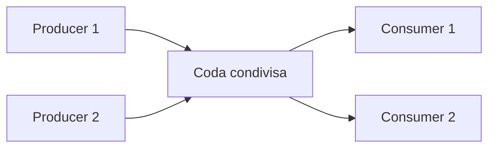

Nella parte 1 abbiamo visto che quando più thread scrivono sullo stesso stato senza sincronizzazione si ha una **race condition**, e che `lock` la risolve rendendo la sezione critica esclusiva. Qui vediamo strumenti più leggeri o più specifici: operazioni atomiche, dati per thread, collezioni thread-safe e gestione degli errori.

## 1. `Interlocked` e `volatile`

Per operazioni semplici su una singola variabile esistono strumenti più leggeri di `lock`.

### 1.1 `Interlocked`

La classe `Interlocked` offre operazioni **atomiche**: `Increment`, `Decrement`, `Add`, `Exchange`, `CompareExchange`.

```cs norun
int counter = 0;

void Work()
{
    for (int i = 0; i < 100_000; i++)
        Interlocked.Increment(ref counter);
}

Thread t1 = new Thread(Work), t2 = new Thread(Work);
t1.Start(); t2.Start();
t1.Join();  t2.Join();

Console.WriteLine(counter); // 200000, sempre
```

`CompareExchange` aggiorna il valore **solo se** è uguale a quello atteso, ed è la base degli algoritmi lock-free. Esempio: un'inizializzazione eseguita una sola volta anche se più thread ci provano insieme.

```cs
int stato = 0; // 0 = non inizializzato, 1 = inizializzato

void InizializzaUnaVolta()
{
    // "porta stato a 1 solo se ora vale 0"; restituisce il valore precedente
    if (Interlocked.CompareExchange(ref stato, 1, 0) == 0)
        Console.WriteLine($"Inizializzato dal thread {Environment.CurrentManagedThreadId}");
}
```

### 1.2 `volatile`

`volatile` garantisce la **visibilità** di una variabile tra thread: impedisce al compilatore e alla CPU di "ricordarsi" un valore vecchio. Tipico uso: una flag di stop.

```cs norun
private static volatile bool _stopRequested;

// Thread worker
while (!_stopRequested) { /* lavoro */ }

// Altro thread
_stopRequested = true;   // il worker lo vedrà
```

Senza `volatile`, in Release il JIT può spostare la lettura fuori dal ciclo e il worker non si ferma mai.

<Aside variant="warning">
`volatile` **non** rende atomico `x++`: garantisce visibilità, non atomicità. Per i contatori usa `Interlocked`, per invarianti composte usa `lock`.
</Aside>

| Aspetto | `Interlocked` | `lock` |
|---|---|---|
| Tipo di operazione | singola operazione atomica | sezione critica arbitraria |
| Overhead | molto basso | più alto |
| Protegge più variabili insieme | no | sì |
| Rischio deadlock | no | sì, se usato male |

Esempio: incrementare un contatore globale → `Interlocked.Increment`; aggiornare saldo e cronologia insieme → `lock`.

## 2. `ThreadLocal<T>`

`ThreadLocal<T>` dà a **ogni thread la propria copia** di un valore, evitando condivisione e lock. Utile per statistiche per thread, buffer temporanei o un `Random` per thread.

```cs norun
using System;
using System.Threading;

ThreadLocal<int> localCounter = new(() => 0);

void Work()
{
    for (int i = 0; i < 3; i++)
        localCounter.Value++;

    Console.WriteLine($"Thread {Environment.CurrentManagedThreadId}: {localCounter.Value}");
}

Thread t1 = new Thread(Work), t2 = new Thread(Work);
t1.Start(); t2.Start();
t1.Join();  t2.Join();
// Thread 5: 3
// Thread 6: 3   -> ogni thread ha il suo contatore
```

Attenzione: con async/await il lavoro può spostarsi su un altro thread dopo un `await`, quindi `ThreadLocal<T>` non segue l'operazione logica. Per quello esiste `AsyncLocal<T>`.

## 3. Collezioni concorrenti

`List<T>` e `Dictionary<TKey, TValue>` **non** sono sicure per letture e scritture concorrenti. Il namespace `System.Collections.Concurrent` offre alternative thread-safe:

| Collezione | Struttura |
|---|---|
| `ConcurrentDictionary<TKey, TValue>` | mappa chiave-valore |
| `ConcurrentQueue<T>` | coda FIFO |
| `ConcurrentStack<T>` | pila LIFO |
| `ConcurrentBag<T>` | insieme non ordinato |
| `BlockingCollection<T>` | coda bloccante per producer-consumer |

### 3.1 `ConcurrentDictionary` e `ConcurrentQueue`

I metodi sono pensati per evitare la sequenza "controlla poi agisci", che tra thread non è sicura:

```cs norun
using System;
using System.Collections.Concurrent;
using System.Threading.Tasks;

ConcurrentDictionary<string, int> visite = new();

Parallel.For(0, 1000, i =>
{
    string pagina = i % 2 == 0 ? "home" : "about";
    visite.AddOrUpdate(pagina, 1, (_, old) => old + 1);  // atomico
});

Console.WriteLine($"home: {visite["home"]}, about: {visite["about"]}"); // 500, 500

ConcurrentQueue<int> queue = new();
queue.Enqueue(10);
if (queue.TryDequeue(out int value))   // Try*: nessuna eccezione se vuota
    Console.WriteLine(value);          // 10
```

<Aside variant="warning">
`if (!dict.ContainsKey(k)) dict[k] = v;` è una race condition anche con `ConcurrentDictionary`: tra il controllo e la scrittura un altro thread può intervenire. Usa `TryAdd`, `GetOrAdd` o `AddOrUpdate`.
</Aside>

### 3.2 Producer-Consumer con `BlockingCollection<T>`

Il pattern **producer-consumer** separa chi produce dati da chi li elabora, collegandoli con una coda thread-safe. È alla base di logging, code di job e pipeline di elaborazione file.



`BlockingCollection<T>` gestisce da sola attese e risvegli, senza `Wait/Pulse` manuali:

```cs norun
using System;
using System.Collections.Concurrent;
using System.Threading;

using BlockingCollection<string> jobs = new(boundedCapacity: 3);

Thread producer = new Thread(() =>
{
    foreach (string job in new[] { "A", "B", "C", "D", "E" })
    {
        jobs.Add(job);               // si blocca se la coda è piena (3)
        Console.WriteLine($"Accodato {job}");
    }
    jobs.CompleteAdding();           // segnala: non arriverà altro
});

Thread consumer = new Thread(() =>
{
    foreach (string job in jobs.GetConsumingEnumerable())  // attende nuovi elementi
    {
        Console.WriteLine($"Elaboro {job}");
        Thread.Sleep(500);
    }
    Console.WriteLine("Coda esaurita");
});

producer.Start(); consumer.Start();
producer.Join();  consumer.Join();
```

Vantaggi: ritmo di produzione e consumo disaccoppiati, buffering con capacità limitata, possibilità di aggiungere consumer per scalare.

<Aside variant="danger">
Se dimentichi `CompleteAdding()`, `GetConsumingEnumerable()` resta in attesa per sempre e il consumer non termina mai: il `Join` finale blocca il programma.
</Aside>

## 4. Eccezioni nei thread

Un'eccezione non gestita in un thread secondario **non** si propaga al thread che ha chiamato `Start()`: termina il thread e, di norma, l'intero processo. Un `try/catch` attorno a `Start()` o `Join()` non serve a nulla.

La soluzione è catturarla **dentro il worker** e comunicarla esplicitamente:

```cs norun
using System;
using System.Threading;

Exception? workerError = null;

Thread t = new Thread(() =>
{
    try
    {
        throw new InvalidOperationException("Errore di elaborazione");
    }
    catch (Exception ex)
    {
        workerError = ex;   // la salvo per il thread principale
    }
});

t.Start();
t.Join();

if (workerError is not null)
    Console.WriteLine($"Errore dal worker: {workerError.Message}");
```

<Aside variant="tip">
Con `Task` il problema sparisce: l'eccezione viene conservata nel task e rilanciata al chiamante con `await`. È uno dei motivi principali per preferire `Task` a `Thread` nel codice applicativo.
</Aside>

## 5. Best practice e riepilogo

- Preferisci `Task`, async/await e collezioni concorrenti alle primitive manuali.
- Per un singolo contatore o una singola variabile usa `Interlocked`; per invarianti che coinvolgono più campi usa `lock`.
- `volatile` serve solo per la visibilità (es. una flag di stop), mai per rendere atomico `x++`.
- Con le collezioni concorrenti evita "controlla poi agisci": usa `TryAdd`, `GetOrAdd`, `AddOrUpdate`, `TryDequeue`.
- Nel producer-consumer chiama sempre `CompleteAdding()` quando il producer ha finito.
- Cattura le eccezioni dentro il worker, oppure usa `Task` e `await`.

Riepilogo delle due parti:

| Problema | Strumento consigliato |
|---|---|
| contatore condiviso | `Interlocked` |
| stato condiviso complesso | `lock` |
| molte letture, poche scritture | `ReaderWriterLockSlim` |
| massimo N accessi concorrenti | `SemaphoreSlim` |
| producer-consumer | `BlockingCollection<T>` |
| sincronizzare processi diversi | `Mutex` con nome |
| flag di stop condivisa | `volatile` o `CancellationToken` |
| valore separato per ogni thread | `ThreadLocal<T>` |
| thread dedicato a lunga vita | `Thread` |
| lavoro breve riusabile | `ThreadPool` / `Task` |

## 6. Quiz

import Quiz from '../../../components/Quiz.jsx';

<Quiz client:load questions={[
{
question:"Quando è più adatto Interlocked rispetto a lock?",
answers:{
a:"Quando devi proteggere più strutture dati correlate",
b:"Quando devi fare una singola operazione atomica come incrementare un contatore",
c:"Quando devi sincronizzare processi diversi",
d:"Quando vuoi bloccare una sezione critica lunga"
},
correctAnswer:"b"
},
{
question:"Cosa restituisce Interlocked.CompareExchange(ref stato, 1, 0)?",
answers:{
a:"Sempre il nuovo valore 1",
b:"true se lo scambio è avvenuto, false altrimenti",
c:"Il valore che stato aveva prima della chiamata",
d:"Il numero di thread in attesa su stato"
},
correctAnswer:"c"
},
{
question:"Cosa garantisce volatile?",
answers:{
a:"Che tutte le operazioni sulla variabile siano atomiche",
b:"Che il thread venga eseguito su un core dedicato",
c:"Visibilità aggiornata del valore tra thread, non atomicità di operazioni complesse",
d:"Che non si verifichino deadlock"
},
correctAnswer:"c"
},
{
question:"Cosa ottiene ogni thread da un ThreadLocal<int> creato con new(() => 0)?",
answers:{
a:"Un riferimento allo stesso contatore condiviso, protetto da lock",
b:"Una propria copia del valore, inizializzata a 0",
c:"Un valore che segue l'operazione logica anche dopo un await",
d:"Un contatore incrementato in modo atomico da tutti i thread"
},
correctAnswer:"b"
},
{
question:"Perché if (!dict.ContainsKey(k)) dict[k] = v; non è sicuro neanche con ConcurrentDictionary?",
answers:{
a:"Perché ConcurrentDictionary non supporta l'indicizzatore",
b:"Perché tra il controllo e la scrittura un altro thread può intervenire",
c:"Perché ContainsKey lancia un'eccezione se la chiave manca",
d:"Perché ConcurrentDictionary accetta solo chiavi di tipo int"
},
correctAnswer:"b"
},
{
question:"Quale collezione è pensata esplicitamente per producer-consumer con semantica di blocco?",
answers:{
a:"List<T>",
b:"Dictionary<TKey, TValue>",
c:"BlockingCollection<T>",
d:"HashSet<T>"
},
correctAnswer:"c"
},
{
question:"Cosa succede se il producer non chiama mai CompleteAdding() su una BlockingCollection?",
answers:{
a:"Gli elementi vengono scartati automaticamente",
b:"Il consumer termina appena la coda è vuota",
c:"GetConsumingEnumerable() resta in attesa per sempre e il consumer non termina",
d:"Viene lanciata subito un'InvalidOperationException"
},
correctAnswer:"c"
},
{
question:"Come vanno gestite correttamente le eccezioni nei thread manuali?",
answers:{
a:"Si propagano automaticamente al thread che chiama Start()",
b:"Vanno catturate dentro il worker e comunicate esplicitamente",
c:"Si ignorano perché il runtime le converte in warning",
d:"Si catturano sempre con try/catch attorno a Join()"
},
correctAnswer:"b"
}
]} />

## 7. Esercizi

### 7.1 Coda ordini di un e-commerce

**Scenario**:
Gli ordini arrivano rapidamente dal sito web, ma la generazione delle etichette di spedizione richiede tempo. Il thread che riceve gli ordini non deve restare bloccato.

**Consegna**:

1. Crea una classe `OrderQueueService` che usi `BlockingCollection<int>` come coda di ordini.
2. Implementa un producer che inserisce 20 ID ordine e poi chiama `CompleteAdding()`.
3. Implementa due consumer su thread separati che simulano l'elaborazione con `Thread.Sleep(300)`.
4. Stampa quale thread elabora ogni ordine e conta il totale elaborato con `Interlocked.Increment`.

*Obiettivo didattico: applicare il pattern producer-consumer con `BlockingCollection<T>`.*

### 7.2 Statistiche di accesso alle pagine

**Scenario**:
Un server registra le visite alle pagine da molti thread contemporaneamente. Le statistiche finali risultano a volte incoerenti o il programma va in errore.

**Consegna**:

1. Simula 8 thread che registrano 10.000 visite ciascuno su 5 pagine, usando un normale `Dictionary<string, int>` non protetto, e osserva totali errati o eccezioni.
2. Sostituiscilo con `ConcurrentDictionary<string, int>` e aggiorna i conteggi con `AddOrUpdate`.
3. Tieni un contatore globale delle visite con `Interlocked.Increment` e verifica che coincida con la somma dei valori del dizionario (80.000).
4. Con `ThreadLocal<int>` conta quante visite ha registrato ciascun thread e stampalo alla fine del suo lavoro.

*Obiettivo didattico: scegliere tra collezione concorrente, operazione atomica e dato per thread.*

### 7.3 Worker robusto agli errori

**Scenario**:
Un servizio elabora file su più thread. Se un file è corrotto il worker lancia un'eccezione e l'intero processo si chiude.

**Consegna**:

1. Avvia 4 thread che elaborano una lista di nomi di file; per alcuni nomi (es. quelli che contengono "bad") lancia `InvalidDataException`.
2. Cattura le eccezioni dentro ogni worker e raccoglile in una `ConcurrentQueue<Exception>`.
3. Aggiungi una flag `volatile bool _stopRequested` che fermi tutti i worker dopo 3 errori, contati con `Interlocked.Increment`.
4. Dopo i `Join`, stampa l'elenco degli errori; poi riscrivi la soluzione con `Task.Run` e `await Task.WhenAll(...)` e confronta come arrivano le eccezioni.

*Obiettivo didattico: gestire le eccezioni nei thread manuali e capire perché `Task` semplifica il problema.*
