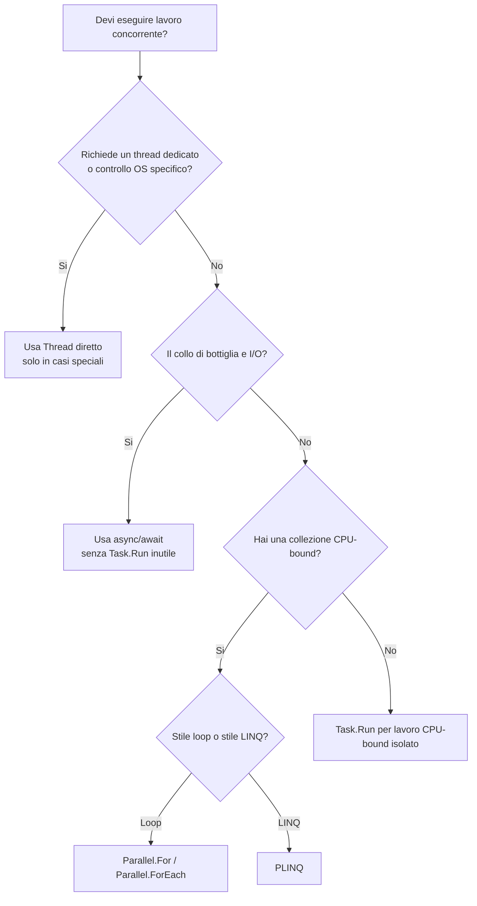

Nella [parte 1](/informatica/csharp/thread-vs-task) abbiamo visto che `Thread` è un'unità di esecuzione del sistema operativo, costosa e poco componibile, mentre `Task` rappresenta un lavoro e il suo completamento futuro, con risultato tipizzato ed eccezioni propagate. Qui vediamo cosa rende `Task` davvero superiore nella pratica: cancellazione, composizione e parallelismo.

## 1. Cancellazione

`Thread.Abort()` è deprecato (e non supportato in .NET moderno) perché interrompe l'esecuzione in un punto arbitrario, lasciando risorse e invarianti in stato incerto. Con `Thread` si usa quindi un **flag manuale**:

```cs norun
static volatile bool fermati;

Thread worker = new Thread(() =>
{
    while (!fermati) { Console.WriteLine("Lavoro..."); Thread.Sleep(200); }
});
worker.Start();
Thread.Sleep(1000);
fermati = true;
worker.Join();
```

Con `Task` la cancellazione è sempre **cooperativa**, ma standardizzata tramite `CancellationTokenSource` e `CancellationToken`:

```cs
using System;
using System.Threading;
using System.Threading.Tasks;

class Program
{
    static async Task Main()
    {
        using CancellationTokenSource cts = new();
        cts.CancelAfter(800); // timeout

        try
        {
            await LavoroAsync(cts.Token);
        }
        catch (OperationCanceledException)
        {
            Console.WriteLine("Operazione cancellata");
        }
    }

    static async Task LavoroAsync(CancellationToken ct)
    {
        for (int i = 0; i < 10; i++)
        {
            ct.ThrowIfCancellationRequested();
            await Task.Delay(200, ct);
            Console.WriteLine($"Passo {i}");
        }
    }
}
// Output: Passo 0, Passo 1, Passo 2, poi "Operazione cancellata"
```

<Aside variant="tip">
Propaga sempre il `CancellationToken` lungo tutta la catena di chiamate e passalo alle API .NET che lo accettano (`Task.Delay`, `HttpClient`, `Stream.ReadAsync`): è così che la cancellazione arriva davvero fino all'I/O.
</Aside>

## 2. Composizione di Task

La differenza più grande tra `Thread` e `Task` è che **i task si compongono**. Con thread grezzi dovresti costruire a mano join multipli, raccolta risultati, errori aggregati e timeout.

### `WhenAll`: attendere tutte le operazioni

```cs
using System;
using System.Linq;
using System.Threading.Tasks;

class Program
{
    static async Task Main()
    {
        int[] input = [1, 2, 3, 4];

        // Avvia tutte le operazioni, poi attendile insieme
        Task<int>[] tasks = input.Select(async n =>
        {
            await Task.Delay(100);
            return n * n;
        }).ToArray();

        int[] quadrati = await Task.WhenAll(tasks);
        Console.WriteLine(string.Join(", ", quadrati)); // 1, 4, 9, 16 (in circa 100 ms, non 400)
    }
}
```

Per latenze indipendenti il tempo totale passa dalla somma al massimo:

$$
T_{seq} \approx \sum_{i=1}^{n} T_i \qquad T_{WhenAll} \approx \max(T_1, T_2, \dots, T_n)
$$

<Aside variant="warning">
Scrivere `await A(); await B();` esegue le operazioni **in sequenza**. Per ottenere il beneficio di `WhenAll` devi prima avviare tutti i task e solo dopo attenderli.
</Aside>

### `WhenAny`: reagire al primo completamento

Un uso tipico di `WhenAny` è implementare un timeout:

```cs
using System;
using System.Threading.Tasks;

class Program
{
    static async Task Main()
    {
        Task<string> download = ScaricaAsync();
        Task timeout = Task.Delay(500);

        Task vincitore = await Task.WhenAny(download, timeout);

        Console.WriteLine(vincitore == download
            ? $"Dati: {await download}"
            : "Timeout scaduto"); // Output: Timeout scaduto
    }

    static async Task<string> ScaricaAsync()
    {
        await Task.Delay(2000);
        return "contenuto";
    }
}
```

In .NET 6+ puoi scrivere lo stesso in una riga con `await ScaricaAsync().WaitAsync(TimeSpan.FromMilliseconds(500))`, che lancia `TimeoutException`.

### `WhenEach` (.NET 9): risultati in ordine di completamento

```cs
List<Task<int>> tasks = [SimulaAsync(1, 900), SimulaAsync(2, 200), SimulaAsync(3, 500)];

await foreach (Task<int> completato in Task.WhenEach(tasks))
{
    Console.WriteLine(await completato); // 2, 3, 1
}

static async Task<int> SimulaAsync(int valore, int delay)
{
    await Task.Delay(delay);
    return valore;
}
```

## 3. Parallelismo CPU-bound: Parallel e PLINQ

### La classe `Parallel`

`Parallel.For`, `Parallel.ForEach` e `Parallel.Invoke` servono a **spremere i core** su lavoro CPU-bound. Sono chiamate **sincrone**: bloccano finché tutte le iterazioni non terminano.

```cs norun
using System;
using System.Threading.Tasks;

class Program
{
    static void Main()
    {
        string[] immagini = ["a.png", "b.png", "c.png", "d.png"];
        var opzioni = new ParallelOptions { MaxDegreeOfParallelism = Environment.ProcessorCount };

        Parallel.ForEach(immagini, opzioni, file =>
        {
            Console.WriteLine($"Elaboro {file} sul thread {Environment.CurrentManagedThreadId}");
        });

        Parallel.Invoke(
            () => Console.WriteLine("A"),
            () => Console.WriteLine("B"));
    }
}
```

L'ordine di esecuzione delle iterazioni **non è garantito**. Il problema più comune, però, è lo stato condiviso:

```cs norun
using System;
using System.Threading;
using System.Threading.Tasks;

int sbagliato = 0;
Parallel.For(0, 100_000, i => sbagliato++); // race condition
Console.WriteLine(sbagliato);               // es. 63412, cambia a ogni esecuzione

long totale = 0;
Parallel.For(0, 100_000,
    () => 0L,                                   // accumulatore locale per thread
    (i, stato, locale) => locale + 1,           // nessuna contesa
    locale => Interlocked.Add(ref totale, locale)); // unione finale atomica
Console.WriteLine(totale);                      // 100000
```

<Aside variant="danger">
`totale += i` dentro `Parallel.For` non è un'operazione atomica: produce risultati errati e diversi a ogni esecuzione. Usa accumulatori locali con `Interlocked`, un `lock`, oppure una riduzione PLINQ come `.Sum()`.
</Aside>

`Parallel.ForEach` e `Task.WhenAll` non sono sinonimi: il primo distribuisce **lavoro CPU-bound** su una collezione, il secondo compone **task già esistenti**, spesso I/O-bound. Per dataset molto grandi con lavoro leggero, `Partitioner.Create(0, n, chunkSize)` permette di processare blocchi di indici e ridurre l'overhead per elemento.

<Aside variant="tip">
Per I/O asincrono su una collezione con concorrenza limitata esiste `Parallel.ForEachAsync` (.NET 6+), che accetta una lambda `async` e un `MaxDegreeOfParallelism`. Non passare mai una lambda async a `Parallel.ForEach`.
</Aside>

### PLINQ

PLINQ aggiunge parallelismo alle query LINQ con `AsParallel()`:

```cs norun
using System;
using System.Linq;

long sommaPrimi = Enumerable.Range(2, 2_000_000)
    .AsParallel()
    .WithDegreeOfParallelism(Environment.ProcessorCount / 2)
    .Where(EPrimo)
    .Sum(n => (long)n);

Console.WriteLine(sommaPrimi);

int[] ordinati = Enumerable.Range(1, 10)
    .AsParallel()
    .AsOrdered()          // senza, l'ordine del risultato non è garantito
    .Select(n => n * 10)
    .ToArray();           // 10, 20, ..., 100

static bool EPrimo(int n)
{
    for (int d = 2; d * d <= n; d++)
        if (n % d == 0) return false;
    return true;
}
```

Esiste anche `WithCancellation(token)` per interrompere la query. PLINQ rende quando la query è CPU-bound, i dati sono numerosi e ogni elemento richiede abbastanza calcolo; è controproducente su dataset piccoli con lavoro banale, con forte contesa su risorse condivise o per I/O.

## 4. Quando usare cosa

La domanda chiave è: **il lavoro è CPU-bound, I/O-bound o richiede un thread dedicato?**



- **Thread diretto**: quasi mai; interop OS, infrastruttura, loop dedicati.
- **`Task.Run`**: lavoro CPU-bound isolato da delegare al pool.
- **`async/await`**: lavoro I/O-bound.
- **`Parallel.ForEach`** / **PLINQ**: lavoro CPU-bound su collezioni.

### Legge di Amdahl: perché più core non bastano

Se $p$ è la frazione parallelizzabile e $n$ il numero di processori, lo speedup massimo è:

$$
S(n) = \frac{1}{(1-p) + \frac{p}{n}}
$$

Con $p = 0.9$ e $n = 8$ si ottiene $S(8) \approx 4.71$: non 8x. La parte seriale satura presto il guadagno, quindi **misura sempre** prima di parallelizzare.

La legge di Gustafson, $S_G(n) = n - \alpha(n - 1)$ con $\alpha$ frazione seriale, è più ottimista: misura quanto problema in più si gestisce nello stesso tempo, e descrive meglio batch e analytics che crescono con le risorse.

## 5. Anti-pattern da evitare

**`Task.Run` sopra I/O già asincrono**: aggiunge solo overhead.

```cs norun
await Task.Run(() => httpClient.GetStringAsync(url)); // inutile
string html = await httpClient.GetStringAsync(url);    // corretto
```

**Blocco sincrono su codice async**: `.Result` e `.Wait()` sprecano un thread e possono causare deadlock.

```cs norun
// In un'app UI: il thread UI si blocca aspettando il task,
// ma il task deve tornare sul thread UI per completarsi -> deadlock
string dati = CaricaAsync().Result;
```

<Aside variant="danger">
Con un `SynchronizationContext` (UI, vecchio ASP.NET) `.Result` su un metodo async può bloccare l'applicazione per sempre. Regola: **async fino in cima**, usa `await` anche nel chiamante.
</Aside>

Altri errori frequenti: creare un thread per ogni elemento di una lista grande, usare `StartNew` come sostituto "più professionale" di `Task.Run`, usare `Parallel.ForEach` per codice I/O-bound o PLINQ su liste minuscole.

In una frase: **non scegliere in base al nome dell'API, ma in base alla natura del lavoro**.

## 6. Quiz

import Quiz from '../../../components/Quiz.jsx';

<Quiz client:load questions={[
{
question:"Perche Thread.Abort() non va usato per fermare un thread?",
answers:{
a:"Perche e troppo lento",
b:"Perche interrompe l'esecuzione in un punto arbitrario e non e supportato in .NET moderno",
c:"Perche funziona solo sui thread in background",
d:"Perche richiede un CancellationToken"
},
correctAnswer:"b"
},
{
question:"Quale strumento e piu adatto per cancellare cooperativamente un Task?",
answers:{
a:"Thread.Abort",
b:"CancellationToken",
c:"lock",
d:"Join"
},
correctAnswer:"b"
},
{
question:"Quale API attende il completamento di tutti i task indipendenti?",
answers:{
a:"Task.WhenAny",
b:"Task.WhenAll",
c:"Task.Delay",
d:"Parallel.Invoke"
},
correctAnswer:"b"
},
{
question:"Combinando Task.WhenAny con Task.Delay(500), cosa si ottiene?",
answers:{
a:"Un timeout: si reagisce a chi finisce per primo tra operazione e attesa",
b:"L'esecuzione in sequenza delle due operazioni",
c:"La cancellazione automatica dell'operazione lenta",
d:"Un ritardo di 500 ms prima di avviare l'operazione"
},
correctAnswer:"a"
},
{
question:"Perche totale += i dentro Parallel.For produce risultati errati?",
answers:{
a:"Perche Parallel.For esegue solo meta delle iterazioni",
b:"Perche l'incremento non e atomico e piu thread lo eseguono insieme (race condition)",
c:"Perche le variabili locali non sono accessibili dalle lambda",
d:"Perche Parallel.For e asincrono"
},
correctAnswer:"b"
},
{
question:"Quando PLINQ tende a essere controproducente?",
answers:{
a:"Su workload CPU-bound grandi",
b:"Quando ogni elemento richiede molto calcolo",
c:"Su dataset piccoli con lavoro minimo per elemento",
d:"Quando usi Select e Where"
},
correctAnswer:"c"
},
{
question:"Secondo la legge di Amdahl, con il 90% di codice parallelizzabile e 8 core, lo speedup massimo e circa:",
answers:{
a:"8x",
b:"7.2x",
c:"4.71x",
d:"0.9x"
},
correctAnswer:"c"
},
{
question:"Perche chiamare .Result su un metodo async in un'app UI e pericoloso?",
answers:{
a:"Perche restituisce sempre null",
b:"Perche puo causare un deadlock: il thread UI attende il task, che deve tornare sul thread UI per completarsi",
c:"Perche avvia il task due volte",
d:"Perche disattiva la cancellazione"
},
correctAnswer:"b"
}
]} />

## 7. Esercizi

### 7.1 Motore di reportistica batch

**Scenario**:
Hai un servizio che deve generare 500 report PDF da dati già presenti in memoria. Ogni report richiede calcolo CPU-bound intenso e il server ha 8 core.

**Consegna**:

1. Implementa una versione con `Task.Run` per ogni report e `Task.WhenAll`, misurando il tempo totale.
2. Implementa una seconda versione con `Parallel.ForEach` e `MaxDegreeOfParallelism`.
3. Evita scritture concorrenti sulla stessa lista finale (accumulatori locali o `ConcurrentBag<T>`).
4. Confronta throughput, consumo CPU e semplicità del codice.

*Obiettivo didattico: capire quando un carico CPU-bound su collezioni è più naturale con Parallel rispetto a Task.WhenAll.*

### 7.2 Gateway verso API esterne

**Scenario**:
Un backend deve interrogare 6 API esterne indipendenti per costruire una dashboard. Le chiamate sono I/O-bound e devono essere cancellate se l'utente abbandona la pagina o se superano 2 secondi.

**Consegna**:

1. Crea 6 metodi `async Task<string>` che simulano chiamate HTTP con `Task.Delay`.
2. Passa un `CancellationToken` a tutte le chiamate e imposta il timeout con `CancelAfter`.
3. Usa `Task.WhenAll` per attendere tutti i risultati.
4. Gestisci sia il caso in cui una chiamata fallisca sia quello in cui l'operazione venga cancellata.

*Obiettivo didattico: distinguere chiaramente async I/O da parallelismo CPU-bound.*

### 7.3 Pipeline di elaborazione ordini

**Scenario**:
Un sistema e-commerce riceve ordini, calcola promozioni CPU-bound, verifica la disponibilità via API e salva il risultato su database.

**Consegna**:

1. Modella verifica disponibilità e salvataggio come operazioni async I/O-bound.
2. Sposta il calcolo promozioni pesante su `Task.Run`.
3. Componi la pipeline con `await`.
4. Elabora una lista di ordini con `Task.WhenEach` e mostra i risultati nell'ordine di completamento.

*Obiettivo didattico: combinare correttamente CPU-bound, I/O-bound e composizione moderna a task.*
