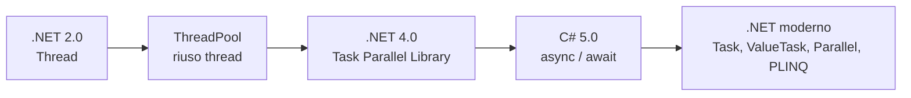
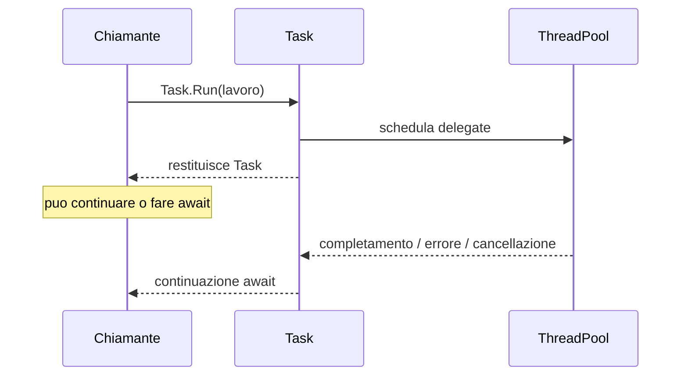
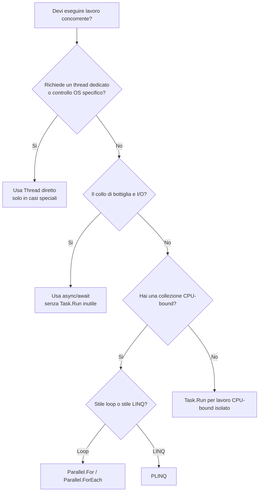

## 1. Panoramica del modello di concorrenza in .NET

In C# moderno, parlare di concorrenza significa distinguere bene quattro concetti:

- **thread**: unità di esecuzione schedulata dal sistema operativo;
- **concorrenza**: più attività in avanzamento nello stesso intervallo di tempo;
- **parallelismo**: più attività eseguite davvero insieme su core distinti;
- **asincronia**: evitare di bloccare un thread mentre si aspetta un evento esterno, tipicamente I/O.

Storicamente .NET è passato da un modello molto vicino al sistema operativo a un modello sempre più dichiarativo e componibile:

- **.NET 2.0**: uso esplicito di `Thread`, `ThreadStart`, `ParameterizedThreadStart`;
- **ThreadPool**: riuso di thread esistenti per ridurre i costi di creazione;
- **.NET 4.0**: **Task Parallel Library** con `Task`, `Task<T>`, `Parallel`, PLINQ;
- **C# 5.0 / .NET 4.5**: `async` / `await`, che rende naturale scrivere asincronia composibile.



L'idea centrale è questa:

- `Thread` controlla **il mezzo fisico di esecuzione**;
- `Task` rappresenta **un lavoro e il suo completamento futuro**;
- `async/await` descrive **come comporre** quel completamento;
- `Parallel` e PLINQ descrivono **come distribuire lavoro CPU-bound** su più core.

Se hai un carico con parte seriale e parte parallelizzabile, il limite teorico del guadagno è vincolato dalla frazione seriale:

$$
T = T_{seriale} + T_{parallelo}
$$

Più avanti formalizzeremo questo limite con la legge di Amdahl.

## 2. Thread: caratteristiche, costi, limiti

`System.Threading.Thread` è l'astrazione più vicina al thread OS. Creare un thread significa chiedere al runtime e al sistema operativo una nuova unità schedulabile.

### Costo di creazione

Un thread non è gratis:

- ha uno **stack dedicato**; come ordine di grandezza, spesso si ragiona su circa **1 MB di stack riservato** per thread;
- richiede **OS-level scheduling**;
- aumenta il numero di **context switch**;
- consuma memoria anche se resta inattivo;
- peggiora la scalabilità se usato in massa.

Se crei 1000 thread per 1000 richieste lente, la memoria e il costo di scheduling esplodono molto prima che il problema sia il codice applicativo.

### Esempio base con `Thread`

```cs
using System;
using System.Threading;

class Program
{
    static void Main()
    {
        Thread worker = new Thread(Lavoro);
        worker.Start();

        Console.WriteLine("Thread principale: attendo...");
        worker.Join();
        Console.WriteLine("Lavoro completato");
    }

    static void Lavoro()
    {
        Thread.Sleep(1000);
        Console.WriteLine("Lavoro su thread dedicato");
    }
}
```

### Quando ha senso usare `Thread` direttamente

Oggi succede raramente. I casi realistici sono:

- integrazione con API legacy o primitive OS che richiedono un thread dedicato;
- necessità di un **foreground thread** che tenga vivo il processo;
- loop dedicati molto particolari, con priorità o affinità gestite esplicitamente;
- scenari infrastrutturali dove vuoi controllare direttamente `IsBackground`, `Priority`, apartment state o il ciclo di vita del thread.

Per il normale lavoro applicativo, `Thread` è quasi sempre troppo basso livello.

### `Join`: attendere il completamento

`Thread.Join()` blocca il thread chiamante finché il thread target non termina.

```cs
using System;
using System.Threading;

class Program
{
    static int risultato;

    static void Main()
    {
        Thread worker = new Thread(() =>
        {
            risultato = 21 * 2;
        });

        worker.Start();
        worker.Join();

        Console.WriteLine(risultato);
    }
}
```

Funziona, ma nota subito i limiti:

- il risultato deve essere scritto in variabili condivise;
- devi coordinare manualmente visibilità, sincronizzazione e gestione errori;
- il thread chiamante resta **bloccato**.

### Nessun valore di ritorno nativo

`Thread` non ha un equivalente naturale di `Task<T>`. Se vuoi un risultato, devi passarlo attraverso:

- variabili condivise;
- oggetti wrapper;
- callback;
- code concorrenti (`BlockingCollection<T>`, `Channel<T>`, ecc.).

Questo aumenta l'accoppiamento e il rischio di bug.

### Nessuna propagazione automatica delle eccezioni al chiamante

Con `Thread` non puoi fare:

```cs
int valore = await qualcosa;
```

Se il lavoro nel thread fallisce, il chiamante non riceve automaticamente l'errore come parte di una composizione strutturata. Devi catturarlo e propagarlo manualmente.

```cs
using System;
using System.Threading;

class Program
{
    static Exception? errore;

    static void Main()
    {
        Thread worker = new Thread(() =>
        {
            try
            {
                throw new InvalidOperationException("Errore nel worker");
            }
            catch (Exception ex)
            {
                errore = ex;
            }
        });

        worker.Start();
        worker.Join();

        if (errore is not null)
        {
            Console.WriteLine($"Gestione manuale: {errore.Message}");
        }
    }
}
```

Questa assenza di composizione è uno dei motivi principali per cui `Task` ha sostituito `Thread` nella maggior parte dei casi.

## 3. Task: astrazione ad alto livello

`Task` non rappresenta necessariamente un thread. Rappresenta un'operazione che:

- è stata avviata o verrà avviata;
- potrà completarsi in futuro;
- potrà produrre un risultato, fallire o essere cancellata;
- potrà essere attesa e composta con altre operazioni.

È una **promessa di completamento futuro**.

```cs
using System;
using System.Threading.Tasks;

class Program
{
    static async Task Main()
    {
        Task lavoro = Task.Run(() =>
        {
            Console.WriteLine("CPU-bound sul ThreadPool");
        });

        await lavoro;
    }
}
```

### `Task.Run`: esecuzione sul ThreadPool

`Task.Run` è il modo più comune per spostare lavoro **CPU-bound** sul ThreadPool.

```cs
using System;
using System.Threading.Tasks;

class Program
{
    static async Task Main()
    {
        int somma = await Task.Run(() =>
        {
            int totale = 0;
            for (int i = 0; i < 1_000_000; i++)
            {
                totale += i;
            }
            return totale;
        });

        Console.WriteLine(somma);
    }
}
```

Qui il vantaggio non è "creare un thread", ma:

- usare un thread già presente nel pool;
- avere un oggetto componibile;
- ottenere un valore di ritorno;
- propagare eccezioni e cancellazione in modo strutturato.

### `Task<T>` per i valori di ritorno

`Task<T>` risolve elegantemente il limite storico di `Thread`.

```cs
using System;
using System.Threading.Tasks;

class Program
{
    static async Task Main()
    {
        Task<decimal> prezzoTask = CalcolaPrezzoAsync();
        decimal prezzo = await prezzoTask;
        Console.WriteLine(prezzo);
    }

    static async Task<decimal> CalcolaPrezzoAsync()
    {
        await Task.Delay(300);
        return 149.90m;
    }
}
```

### `Task.Factory.StartNew`: opzioni avanzate

`Task.Factory.StartNew` è più potente ma più facile da usare male. Ti permette di specificare:

- `TaskCreationOptions.LongRunning`;
- `TaskCreationOptions.AttachedToParent`;
- scheduler esplicito;
- token di cancellazione;
- opzioni di continuazione più fini.

```cs
using System;
using System.Threading;
using System.Threading.Tasks;

class Program
{
    static async Task Main()
    {
        Task task = Task.Factory.StartNew(
            action: () =>
            {
                Thread.Sleep(2000);
                Console.WriteLine("Task lungo");
            },
            cancellationToken: CancellationToken.None,
            creationOptions: TaskCreationOptions.LongRunning,
            scheduler: TaskScheduler.Default);

        await task;
    }
}
```

`LongRunning` suggerisce al runtime che quel lavoro non dovrebbe occupare un thread del pool per molto tempo. Tipicamente il runtime usa un thread dedicato.

Per il codice applicativo generale:

- usa **`Task.Run`** per la maggior parte dei casi;
- usa **`StartNew`** solo quando ti servono davvero opzioni avanzate.

### Attenzione a `StartNew` con lambda async

Questo è un anti-pattern classico:

```cs
Task<Task<int>> doppioTask = Task.Factory.StartNew(async () =>
{
    await Task.Delay(500);
    return 42;
});
```

Il risultato è `Task<Task<int>>`, non `Task<int>`. Devi fare `Unwrap()` oppure, più semplicemente, evitare `StartNew` per lambda async e preferire `Task.Run`.

```cs
int valore = await Task.Run(async () =>
{
    await Task.Delay(500);
    return 42;
});
```

### Continuations: `ContinueWith` e `await`

Prima di `await`, la composizione si faceva spesso con `ContinueWith`.

```cs
using System;
using System.Threading.Tasks;

class Program
{
    static Task<int> CalcolaAsync() => Task.Run(() => 21 * 2);

    static async Task Main()
    {
        Task continuazione = CalcolaAsync().ContinueWith(t =>
        {
            Console.WriteLine($"Risultato: {t.Result}");
        });

        await continuazione;
    }
}
```

Oggi `await` è quasi sempre preferibile:

```cs
using System;
using System.Threading.Tasks;

class Program
{
    static Task<int> CalcolaAsync() => Task.Run(() => 21 * 2);

    static async Task Main()
    {
        int risultato = await CalcolaAsync();
        Console.WriteLine($"Risultato: {risultato}");
    }
}
```

`await` è:

- più leggibile;
- più corretto rispetto al flusso di eccezioni;
- più facile da comporre;
- meno incline a deadlock e errori di scheduler.

### Gestione eccezioni: `AggregateException` e unwrapping con `await`

Quando blocchi con `.Wait()` o `.Result`, le eccezioni vengono in genere incapsulate in `AggregateException`.

```cs
using System;
using System.Threading.Tasks;

class Program
{
    static Task FallisciAsync() => Task.Run(() => throw new InvalidOperationException("Boom"));

    static void Main()
    {
        try
        {
            FallisciAsync().Wait();
        }
        catch (AggregateException ex)
        {
            Console.WriteLine(ex.InnerException?.Message);
        }
    }
}
```

Con `await`, invece, l'eccezione viene "scartata" e rilanciata nel suo tipo originale:

```cs
using System;
using System.Threading.Tasks;

class Program
{
    static Task FallisciAsync() => Task.Run(() => throw new InvalidOperationException("Boom"));

    static async Task Main()
    {
        try
        {
            await FallisciAsync();
        }
        catch (InvalidOperationException ex)
        {
            Console.WriteLine(ex.Message);
        }
    }
}
```



## 4. Tabella comparativa dettagliata: Thread vs Task

| Aspetto | Thread | Task |
|---|---|---|
| Livello di astrazione | Basso livello | Alto livello |
| Modello mentale | Unita di esecuzione OS | Operazione futura componibile |
| Costo di creazione | Alto | Basso o nullo se usa ThreadPool |
| Scheduling | Sistema operativo | `TaskScheduler` |
| Stack dedicato | Si | Non necessariamente |
| Valore di ritorno | No supporto nativo | `Task<T>` |
| Eccezioni | Gestione manuale | Propagazione strutturata |
| Cancellazione | Nessun meccanismo nativo moderno | `CancellationToken` |
| Composizione | Manuale | `await`, `WhenAll`, `WhenAny`, continuations |
| Scalabilita | Scarsa se usato in massa | Molto migliore |
| Uso ideale | Casi speciali e infrastrutturali | Quasi tutto il codice moderno |
| Supporto async I/O | No | Si, naturalmente |
| Integrazione con linguaggio | Minima | Totale con `async/await` |

In sintesi:

- `Thread` controlla *come* un'unità gira;
- `Task` descrive *cosa* deve completarsi.

## 5. TaskScheduler

`TaskScheduler` decide dove e come un task viene eseguito.

### Default scheduler: ThreadPool

Se usi `Task.Run` o `TaskScheduler.Default`, il lavoro finisce normalmente sul **ThreadPool**.

```cs
Task task = Task.Run(() => Console.WriteLine("ThreadPool"));
```

È l'opzione ideale per:

- piccoli lavori CPU-bound;
- brevi continuazioni;
- carichi che beneficiano del riuso dei thread.

### Scheduler legato al `SynchronizationContext`

Nelle app UI esiste spesso un `SynchronizationContext` che rappresenta il thread della finestra. Se fai `await` senza `ConfigureAwait(false)`, la continuazione prova a tornare su quel contesto.

Questo è utile perché permette di aggiornare la UI in sicurezza:

```cs
// Esempio concettuale WPF / WinForms
private async Task CaricaAsync()
{
    string dati = await httpClient.GetStringAsync(url);
    testoLabel.Text = dati; // ripresa sul contesto UI
}
```

Con `ContinueWith`, invece, devi stare molto attento allo scheduler usato:

```cs
TaskScheduler uiScheduler = TaskScheduler.FromCurrentSynchronizationContext();

Task.Run(() => "dati")
    .ContinueWith(
        t => label.Text = t.Result,
        CancellationToken.None,
        TaskContinuationOptions.None,
        uiScheduler);
```

### Custom scheduler

Puoi anche definire un `TaskScheduler` custom quando vuoi:

- limitare la concorrenza;
- serializzare certi task;
- instradare lavori su code dedicate;
- applicare regole molto particolari di fairness o priorita.

Molto spesso, pero, basta usare strumenti gia pronti come `ConcurrentExclusiveSchedulerPair`.

```cs
using System;
using System.Threading.Tasks;

class Program
{
    static async Task Main()
    {
        var pair = new ConcurrentExclusiveSchedulerPair(TaskScheduler.Default, maxConcurrencyLevel: 2);
        TaskFactory factory = new TaskFactory(pair.ConcurrentScheduler);

        Task[] tasks =
        [
            factory.StartNew(() => Console.WriteLine("A")),
            factory.StartNew(() => Console.WriteLine("B")),
            factory.StartNew(() => Console.WriteLine("C"))
        ];

        await Task.WhenAll(tasks);
    }
}
```

### `Task.Run` vs `Task.Factory.StartNew(..., LongRunning)`

Per un task molto lungo:

- `Task.Run` usa il ThreadPool;
- `StartNew(..., TaskCreationOptions.LongRunning, ...)` segnala che potrebbe servire un thread dedicato.

Regola pratica:

- **breve lavoro CPU-bound**: `Task.Run`;
- **loop lungo, bloccante, quasi-da-servizio**: valuta `LongRunning`.

Non usare `LongRunning` in modo indiscriminato: se tutto e "long running", hai semplicemente perso i benefici del pool.

## 6. Cancellazione

### Thread: nessun meccanismo nativo moderno

Storicamente esisteva `Thread.Abort()`, ma e deprecato e concettualmente pericoloso perché interrompe l'esecuzione in modo asincrono, lasciando invarianti e risorse in stato incerto.

Con `Thread` oggi si lavora quasi sempre con un **flag manuale**:

```cs
using System;
using System.Threading;

class Program
{
    static volatile bool fermati;

    static void Main()
    {
        Thread worker = new Thread(() =>
        {
            while (!fermati)
            {
                Console.WriteLine("Lavoro...");
                Thread.Sleep(200);
            }
        });

        worker.Start();
        Thread.Sleep(1000);
        fermati = true;
        worker.Join();
    }
}
```

Funziona, ma e un protocollo completamente manuale.

### Task: `CancellationToken` e `CancellationTokenSource`

Con `Task` la cancellazione e cooperativa ma standardizzata.

```cs
using System;
using System.Threading;
using System.Threading.Tasks;

class Program
{
    static async Task Main()
    {
        using CancellationTokenSource cts = new();

        Task task = LavoroAsync(cts.Token);

        cts.CancelAfter(800);

        try
        {
            await task;
        }
        catch (OperationCanceledException)
        {
            Console.WriteLine("Operazione cancellata");
        }
    }

    static async Task LavoroAsync(CancellationToken ct)
    {
        for (int i = 0; i < 10; i++)
        {
            ct.ThrowIfCancellationRequested();
            await Task.Delay(200, ct);
        }
    }
}
```

Vantaggi:

- propagazione chiara attraverso la call chain;
- interoperabilita con API .NET;
- timeout semplici con `CancelAfter`;
- semantica standard per `TaskStatus.Canceled`.

## 7. Composizione

La differenza piu grande tra `Thread` e `Task` e che **i task si compongono**.

### Thread: non componibili nativamente

Con thread grezzi devi costruire da solo:

- join multipli;
- raccolta risultati;
- gestione errori aggregati;
- cancellazione coordinata;
- timeout;
- completamento del primo o di tutti.

### Task: `WhenAll`

`Task.WhenAll` e ideale quando vuoi attendere tutte le operazioni indipendenti.

```cs
using System;
using System.Threading.Tasks;

class Program
{
    static async Task Main()
    {
        Task<int> t1 = Task.Run(() => 10);
        Task<int> t2 = Task.Run(() => 20);
        Task<int> t3 = Task.Run(() => 30);

        int[] risultati = await Task.WhenAll(t1, t2, t3);
        Console.WriteLine(string.Join(", ", risultati));
    }
}
```

Per latenze indipendenti:

$$
T_{WhenAll} \approx \max(T_1, T_2, \dots, T_n)
$$

mentre in sequenza:

$$
T_{seq} \approx \sum_{i=1}^{n} T_i
$$

### `WhenAny`

`Task.WhenAny` permette di reagire al primo completamento:

```cs
using System;
using System.Threading.Tasks;

class Program
{
    static async Task Main()
    {
        Task<int> veloce = Task.Run(async () => { await Task.Delay(200); return 1; });
        Task<int> lenta = Task.Run(async () => { await Task.Delay(1000); return 2; });

        Task<int> prima = await Task.WhenAny(veloce, lenta);
        Console.WriteLine(await prima);
    }
}
```

### `WhenEach` in .NET 9

Con `.NET 9`, `Task.WhenEach` permette di consumare i risultati nell'ordine di completamento, senza aspettare tutti subito.

```cs
using System;
using System.Collections.Generic;
using System.Threading.Tasks;

class Program
{
    static async Task Main()
    {
        List<Task<int>> tasks =
        [
            SimulaAsync(1, 900),
            SimulaAsync(2, 200),
            SimulaAsync(3, 500)
        ];

        await foreach (Task<int> completato in Task.WhenEach(tasks))
        {
            Console.WriteLine(await completato);
        }
    }

    static async Task<int> SimulaAsync(int valore, int delay)
    {
        await Task.Delay(delay);
        return valore;
    }
}
```

### Pipeline con `Select` e `await`

`Task` permette di costruire pipeline molto leggibili:

```cs
using System;
using System.Linq;
using System.Threading.Tasks;

class Program
{
    static async Task Main()
    {
        int[] input = [1, 2, 3, 4];

        Task<int>[] tasks = input
            .Select(async n =>
            {
                await Task.Delay(100);
                return n * n;
            })
            .ToArray();

        int[] quadrati = await Task.WhenAll(tasks);
        Console.WriteLine(string.Join(", ", quadrati));
    }
}
```

Con thread grezzi, la stessa espressivita richiede molto piu codice infrastrutturale.

## 8. Parallel class

La classe `Parallel` serve al **parallelismo CPU-bound** su collezioni o insiemi di azioni.

### `Parallel.For`

```cs
using System;
using System.Threading.Tasks;

class Program
{
    static void Main()
    {
        Parallel.For(0, 10, i =>
        {
            Console.WriteLine($"Iterazione {i}");
        });
    }
}
```

### `Parallel.ForEach`

```cs
using System;
using System.Collections.Generic;
using System.Threading.Tasks;

class Program
{
    static void Main()
    {
        List<int> numeri = [1, 2, 3, 4, 5];

        Parallel.ForEach(numeri, n =>
        {
            Console.WriteLine($"{n} -> {n * n}");
        });
    }
}
```

### `Parallel.Invoke`

```cs
using System;
using System.Threading.Tasks;

class Program
{
    static void Main()
    {
        Parallel.Invoke(
            () => Console.WriteLine("A"),
            () => Console.WriteLine("B"),
            () => Console.WriteLine("C"));
    }
}
```

### Differenza con `Task.WhenAll`

`Parallel` e `Task.WhenAll` non sono sinonimi:

- `Parallel.For/ForEach/Invoke` puntano a **spremere i core** per lavoro CPU-bound;
- `Task.WhenAll` compone **task gia esistenti**, spesso I/O-bound o misti.

Regola utile:

- se hai una collezione e vuoi processarla in parallelo a basso livello CPU-bound, pensa a `Parallel`;
- se hai operazioni asincrone gia modellate come task, pensa a `Task.WhenAll`.

### `Partitioner`

Quando i dati sono tanti, il partizionamento influisce molto sulle prestazioni. `Partitioner` permette di controllare come il lavoro viene suddiviso.

```cs
using System;
using System.Collections.Concurrent;
using System.Threading.Tasks;

class Program
{
    static void Main()
    {
        var rangePartitioner = Partitioner.Create(0, 1_000_000, 50_000);

        Parallel.ForEach(rangePartitioner, range =>
        {
            long sommaLocale = 0;

            for (int i = range.Item1; i < range.Item2; i++)
            {
                sommaLocale += i;
            }

            Console.WriteLine($"{range.Item1}-{range.Item2}: {sommaLocale}");
        });
    }
}
```

`Partitioner` e utile quando:

- il lavoro per elemento non e uniforme;
- vuoi chunk piu grandi o piu piccoli;
- vuoi ridurre overhead di scheduling.

## 9. PLINQ (Parallel LINQ)

PLINQ aggiunge parallelismo alle query LINQ con `AsParallel()`.

```cs
using System;
using System.Linq;

class Program
{
    static void Main()
    {
        int[] risultati = Enumerable.Range(1, 1000)
            .AsParallel()
            .Select(n => n * n)
            .Where(n => n % 2 == 0)
            .ToArray();

        Console.WriteLine(risultati.Length);
    }
}
```

### `WithDegreeOfParallelism`

Permette di limitare il numero massimo di worker:

```cs
var query = Enumerable.Range(1, 1_000_000)
    .AsParallel()
    .WithDegreeOfParallelism(Environment.ProcessorCount / 2)
    .Select(n => n * n);
```

### `WithCancellation`

```cs
using CancellationTokenSource cts = new();

var query = Enumerable.Range(1, 1_000_000)
    .AsParallel()
    .WithCancellation(cts.Token)
    .Select(n => Math.Sqrt(n));
```

### `AsOrdered()`

Per default PLINQ puo perdere l'ordine originale perché privilegia le prestazioni. Se ti serve l'ordine:

```cs
var ordinati = Enumerable.Range(1, 20)
    .AsParallel()
    .AsOrdered()
    .Select(n => n * 10)
    .ToArray();
```

### Quando PLINQ e utile

PLINQ e forte quando:

- la query e **CPU-bound**;
- ogni elemento richiede abbastanza lavoro da compensare l'overhead;
- i dati sono numerosi;
- le operazioni sono pure o quasi pure.

### Quando e controproducente

PLINQ puo peggiorare le cose se:

- il dataset e piccolo;
- il lavoro per elemento e banale;
- c'e forte contesa su lock o risorse condivise;
- l'ordine e essenziale e costringe a costi extra;
- stai facendo I/O, dove `async/await` e spesso piu adatto.

## 10. Quando usare cosa: decision tree

La scelta corretta dipende soprattutto da una domanda: **il lavoro e CPU-bound, I/O-bound o richiede un thread dedicato?**



### Regola pratica

- **Thread diretto**: quasi mai; ha senso solo per interop OS, infrastruttura o loop dedicati foreground/background molto particolari.
- **`Task.Run`**: lavoro **CPU-bound** che vuoi delegare al pool.
- **`async/await`**: lavoro **I/O-bound**.
- **`Parallel.ForEach`**: lavoro CPU-bound su collezioni.
- **PLINQ**: trasformazioni CPU-bound espresse bene come query LINQ.

### Errori di scelta frequenti

- usare `Task.Run` per semplice I/O async, ottenendo solo overhead;
- usare thread grezzi per decine o centinaia di unità di lavoro piccole;
- usare `Parallel.ForEach` con codice fortemente I/O-bound;
- usare PLINQ su liste minuscole.

## 11. Formule matematiche: Amdahl e Gustafson

### Legge di Amdahl

Se $p$ e la frazione parallelizzabile del programma e $n$ e il numero di processori, lo speedup teorico massimo e:

$$
S(n) = \frac{1}{(1-p) + \frac{p}{n}}
$$

Interpretazione:

- se la parte seriale $(1-p)$ resta significativa, il guadagno si satura presto;
- aggiungere thread oltre un certo punto non aiuta quasi piu;
- questo spiega perché "piu thread" non significa automaticamente "molto piu veloce".

Esempio con $p = 0.9$ e $n = 8$:

$$
S(8) = \frac{1}{0.1 + \frac{0.9}{8}} \approx 4.71
$$

Non ottieni 8x, ma circa 4.71x.

### Legge di Gustafson

Quando il problema cresce con il numero di processori, Gustafson fornisce un modello piu ottimista:

$$
S_G(n) = n - \alpha (n - 1)
$$

dove $\alpha$ e la frazione seriale osservata.

Interpretazione:

- Amdahl risponde a: "quanto accelero un problema di dimensione fissa?";
- Gustafson risponde a: "quanto problema in piu posso gestire nello stesso tempo?"

Per sistemi data-parallel, analytics o batch molto grandi, Gustafson descrive spesso meglio la realta operativa.

## 12. Best practice e anti-pattern

### Best practice

1. Usa `Task` come default e `Thread` solo per casi eccezionali.
2. Per I/O-bound usa API realmente async e `await`.
3. Per CPU-bound breve usa `Task.Run`.
4. Per CPU-bound massivo su collezioni valuta `Parallel` o PLINQ.
5. Propaga sempre `CancellationToken` quando disponibile.
6. Preferisci `await` a `.Wait()` e `.Result`.
7. Usa `Task.WhenAll` per operazioni indipendenti.
8. Misura: non assumere che il parallelismo migliori sempre il tempo totale.
9. Riduci al minimo stato condiviso, lock e side effect.
10. Per task lunghi e bloccanti valuta `LongRunning` invece di saturare il pool.

### Anti-pattern

#### 1. `Task.Run` sopra I/O async

```cs
// Anti-pattern
await Task.Run(() => httpClient.GetStringAsync(url));
```

Se l'API e gia asincrona, fai semplicemente:

```cs
string html = await httpClient.GetStringAsync(url);
```

#### 2. Blocco sincrono su codice async

```cs
// Anti-pattern
var risultato = servizio.CalcolaAsync().Result;
```

Puoi causare deadlock in ambienti con `SynchronizationContext` e peggiori l'uso dei thread.

#### 3. Troppi thread dedicati

Creare un thread per ogni elemento di una lista grande e quasi sempre una cattiva idea.

#### 4. Condivisione incontrollata di stato

```cs
// Anti-pattern
int totale = 0;
Parallel.For(0, 1000, i => totale += i);
```

Qui hai race condition. Devi usare riduzioni corrette, lock o accumulatori locali.

#### 5. `StartNew` usato come sostituto universale di `Task.Run`

`StartNew` non e la scelta "piu professionale" per default; e piu pericoloso e piu facile da usare male, soprattutto con lambda async.

### Sintesi finale

Se vuoi ricordare una sola regola:

- **non scegliere in base al nome API, ma in base alla natura del lavoro**.

`Thread` riguarda l'infrastruttura.
`Task` riguarda il completamento.
`async/await` riguarda la composizione.
`Parallel` e PLINQ riguardano il throughput CPU-bound.

## 13. Quiz

import Quiz from '../../../components/Quiz.jsx';

<Quiz client:load questions={[
{
question:"Qual e la differenza concettuale principale tra Thread e Task?",
answers:{
a:"Thread e per database, Task e per file",
b:"Thread rappresenta un thread OS, Task rappresenta un completamento futuro",
c:"Task crea sempre un nuovo thread",
d:"Non c e alcuna differenza reale"
},
correctAnswer:"b"
},
{
question:"Quale opzione descrive meglio il costo di un Thread?",
answers:{
a:"Praticamente nullo",
b:"Alto, per stack dedicato e scheduling OS",
c:"Uguale a un Task completato",
d:"Inferiore a ThreadPool"
},
correctAnswer:"b"
},
{
question:"Quale API e normalmente consigliata per spostare lavoro CPU-bound breve sul pool?",
answers:{
a:"new Thread(...)",
b:"Task.Run(...)",
c:"Thread.Abort()",
d:"await foreach"
},
correctAnswer:"b"
},
{
question:"Quale tipo permette un valore di ritorno asincrono tipizzato?",
answers:{
a:"Thread",
b:"TaskScheduler",
c:"Task<T>",
d:"ParallelLoopState"
},
correctAnswer:"c"
},
{
question:"Con await, un eccezione lanciata da un Task viene tipicamente:",
answers:{
a:"Ignorata",
b:"Sempre convertita in AggregateException",
c:"Rilanciata nel suo tipo originale",
d:"Gestita dal GC"
},
correctAnswer:"c"
},
{
question:"Quando ha piu senso usare TaskCreationOptions.LongRunning?",
answers:{
a:"Per qualsiasi lambda async",
b:"Per operazioni I/O brevissime",
c:"Per lavoro lungo e bloccante che non dovrebbe occupare il ThreadPool",
d:"Per sostituire sempre Task.Run"
},
correctAnswer:"c"
},
{
question:"Quale strumento e piu adatto per cancellare cooperativamente un Task?",
answers:{
a:"Thread.Abort",
b:"CancellationToken",
c:"lock",
d:"Join"
},
correctAnswer:"b"
},
{
question:"Quale API attende il completamento di tutti i task indipendenti?",
answers:{
a:"Task.WhenAny",
b:"Task.WhenAll",
c:"Task.Delay",
d:"Parallel.Invoke"
},
correctAnswer:"b"
},
{
question:"Qual e la differenza piu importante tra Parallel.ForEach e Task.WhenAll?",
answers:{
a:"Nessuna, fanno la stessa cosa",
b:"Parallel.ForEach e pensato per CPU-bound, Task.WhenAll per comporre task",
c:"Task.WhenAll funziona solo con array",
d:"Parallel.ForEach funziona solo in ASP.NET"
},
correctAnswer:"b"
},
{
question:"Quando PLINQ tende a essere controproducente?",
answers:{
a:"Su workload CPU-bound grandi",
b:"Quando ogni elemento richiede molto calcolo",
c:"Su dataset piccoli con lavoro minimo per elemento",
d:"Quando usi Select e Where"
},
correctAnswer:"c"
}
]} />

## 14. Esercizi

### 14.1 Motore di reportistica batch

**Scenario**:
Hai un servizio che deve generare 500 report PDF da dati gia presenti in memoria. Ogni report richiede calcolo CPU-bound intenso e il server ha 8 core.

**Consegna**:

1. Implementa una versione con `Task.Run` per ogni report e misura il tempo totale.
2. Implementa una seconda versione con `Parallel.ForEach`.
3. Riduci la contesa evitando scritture concorrenti sulla stessa lista finale.
4. Confronta throughput, consumo CPU e semplicita del codice.

*Obiettivo didattico: capire quando un carico CPU-bound su collezioni e piu naturale con Parallel rispetto a Task.WhenAll.*

### 14.2 Gateway verso API esterne

**Scenario**:
Un backend deve interrogare 6 API esterne indipendenti per costruire una dashboard. Le chiamate sono tutte I/O-bound e ognuna puo essere cancellata se l'utente abbandona la pagina.

**Consegna**:

1. Crea 6 metodi `async Task<string>` che simulano chiamate HTTP con `Task.Delay`.
2. Passa un `CancellationToken` a tutte le chiamate.
3. Usa `Task.WhenAll` per attendere tutti i risultati.
4. Gestisci il caso in cui una chiamata fallisca e il caso in cui l'operazione venga cancellata.

*Obiettivo didattico: distinguere chiaramente async I/O da parallelismo CPU-bound.*

### 14.3 Servizio legacy con thread dedicato

**Scenario**:
Devi integrare una libreria legacy che richiede un thread dedicato in foreground, con un loop che resta attivo fino allo shutdown del processo.

**Consegna**:

1. Implementa un `Thread` dedicato con `IsBackground = false`.
2. Gestisci l'arresto con un flag cooperativo o `CancellationToken` adattato al loop.
3. Aggiungi log dell'avvio, del ciclo di lavoro e dello shutdown.
4. Spiega perche questo scenario non e un buon candidato per `Task.Run`.

*Obiettivo didattico: riconoscere i pochi casi in cui Thread diretto ha ancora senso.*

### 14.4 Pipeline di elaborazione ordini

**Scenario**:
Un sistema e-commerce riceve ordini, calcola promozioni CPU-bound, verifica disponibilita via API e salva il risultato su database.

**Consegna**:

1. Modella la verifica disponibilita e il salvataggio come operazioni async I/O-bound.
2. Sposta il calcolo promozioni pesante su `Task.Run`.
3. Componi la pipeline con `await`.
4. Estendi la soluzione per elaborare una lista di ordini con `Task.WhenEach` e mostra i risultati nell'ordine di completamento.

*Obiettivo didattico: combinare correttamente CPU-bound, I/O-bound e composizione moderna a task.*
