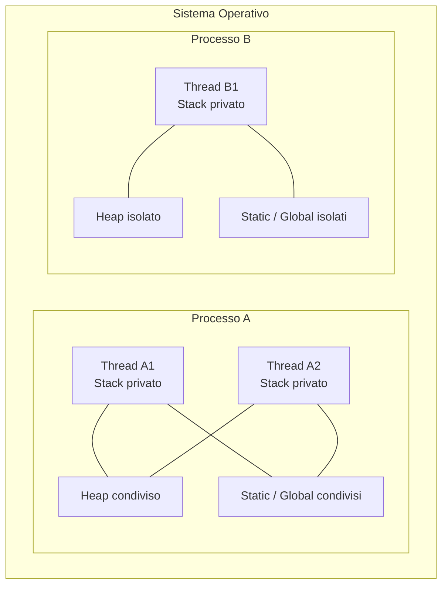
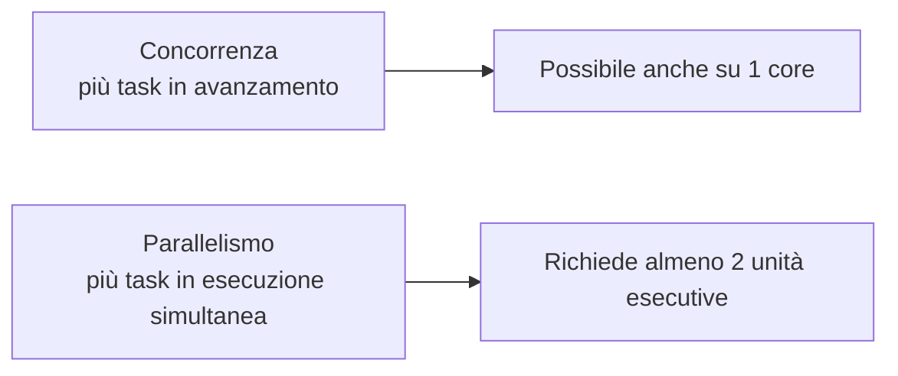
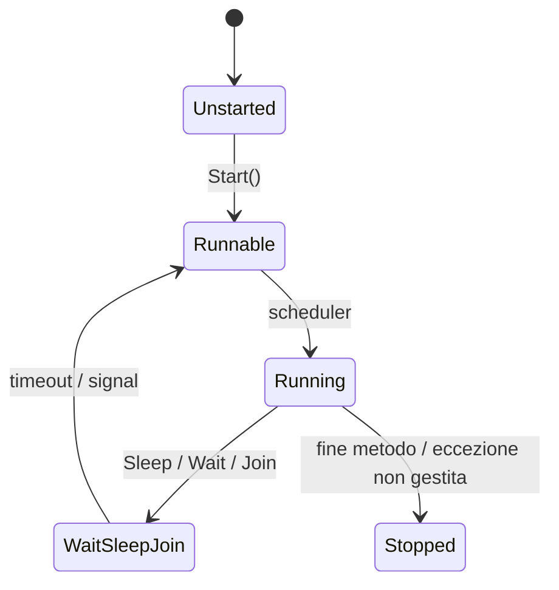
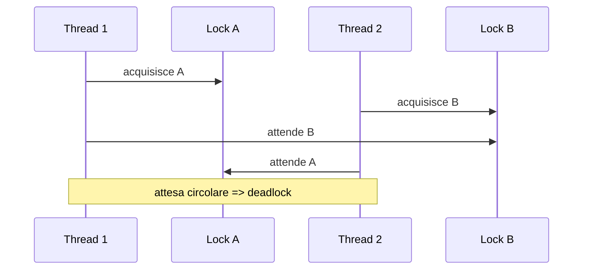
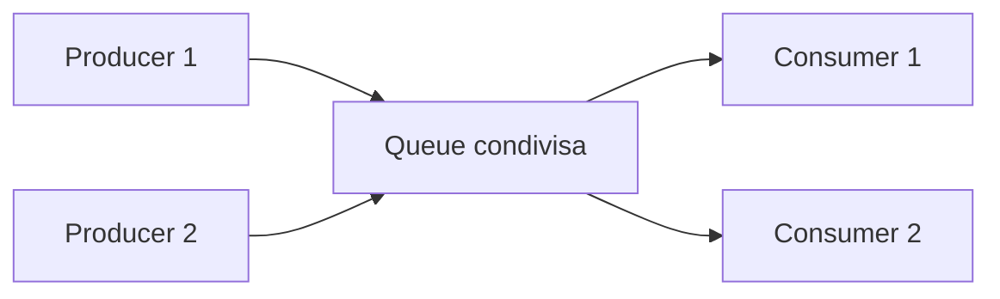

## 1. Introduzione alla concorrenza

Quando un programma cresce, quasi sempre incontra almeno uno di questi problemi:

- deve fare più cose nello stesso intervallo di tempo;
- non deve bloccare la UI mentre aspetta;
- deve servire più richieste contemporaneamente;
- deve sfruttare più core della CPU;
- deve coordinare accessi concorrenti agli stessi dati.

Qui entra in gioco il tema dei **thread**. Un thread è un'unità di esecuzione interna a un processo. Più thread dello stesso processo condividono gran parte delle risorse del processo stesso, ma mantengono un proprio flusso di esecuzione.

### 1.1 Processo vs Thread

Un **processo** è un'istanza in esecuzione di un programma. Ha:

- uno spazio di memoria virtuale isolato dagli altri processi;
- handle, risorse di sistema, descrittori di file, socket;
- uno o più thread;
- un proprio contesto di sicurezza.

Un **thread** è invece il percorso effettivo di esecuzione del codice dentro un processo. Ogni thread ha:

- un proprio stack;
- registri CPU dedicati nel momento in cui viene schedulato;
- un instruction pointer;
- uno stato di esecuzione.

La distinzione fondamentale è questa:

- **processi diversi**: memoria isolata;
- **thread dello stesso processo**: memoria condivisa, ma stack separati.



Conseguenze pratiche:

- comunicare tra processi richiede meccanismi IPC, socket, pipe, shared memory;
- comunicare tra thread è più semplice perché vedono gli stessi oggetti in heap;
- proprio perché condividono memoria, i thread introducono **race condition**, **deadlock** e problemi di visibilità.

### 1.2 Concorrenza vs Parallelismo

I due concetti sono collegati ma non identici.

- **Concorrenza**: più attività fanno progresso nello stesso intervallo temporale.
- **Parallelismo**: più attività vengono eseguite davvero nello stesso istante fisico, tipicamente su core distinti.

Distinzione formale:

- la concorrenza è una proprietà del **modello di esecuzione**;
- il parallelismo è una proprietà dell'**esecuzione hardware effettiva**.

Un singolo core con time slicing può offrire concorrenza senza vero parallelismo: il sistema operativo alterna i thread così rapidamente da dare l'impressione di simultaneità.

Su macchina multicore puoi avere parallelismo reale.



Una formula utile per capire il limite teorico del parallelismo è la **legge di Amdahl**:

$$
S(N) = \frac{1}{(1 - P) + \frac{P}{N}}
$$

dove:

- $S(N)$ è lo speedup usando $N$ unità di esecuzione;
- $P$ è la frazione parallelizzabile del programma.

Se solo il 70% del codice è parallelizzabile, anche con infiniti core il guadagno massimo resta:

$$
S(\infty) = \frac{1}{1 - 0.7} = 3.33
$$

Quindi i thread non sono una bacchetta magica: servono quando il problema è davvero concorrente o parallelizzabile.

## 2. La classe `Thread`

La classe `System.Threading.Thread` rappresenta un thread gestito esplicito. Oggi, per molta programmazione applicativa moderna, si preferiscono `Task`, async/await e il thread pool; tuttavia `Thread` resta importante per capire i fondamenti e per alcuni scenari specifici.

### 2.1 Creazione e avvio

Il costruttore di `Thread` accetta tipicamente:

- un delegato `ThreadStart`, se il metodo non ha parametri;
- un delegato `ParameterizedThreadStart`, se il metodo riceve un parametro `object?`.

```cs
using System;
using System.Threading;

public class Program
{
    public static void Lavoro()
    {
        Console.WriteLine($"Eseguito da: {Thread.CurrentThread.ManagedThreadId}");
    }

    public static void Main()
    {
        Thread thread = new Thread(Lavoro);
        thread.Start();
        thread.Join();
    }
}
```

`Start()` mette il thread nello scheduler del runtime/OS. Non significa "inizia esattamente adesso", ma "è pronto a essere eseguito".

### 2.2 `Start`, `Join`, `Sleep`, `Abort`

#### `Thread.Start()`

Avvia il thread una sola volta. Un thread terminato non può essere riavviato.

```cs
Thread t = new Thread(() => Console.WriteLine("Partito"));
t.Start();
```

#### `Thread.Join()`

Blocca il thread chiamante finché il thread target non termina.

```cs
Thread worker = new Thread(() =>
{
    Thread.Sleep(1000);
    Console.WriteLine("Lavoro completato");
});

worker.Start();
worker.Join();

Console.WriteLine("Continuo solo dopo la fine del worker");
```

Esistono anche overload con timeout:

```cs
bool terminato = worker.Join(500);
Console.WriteLine($"Terminato entro 500ms? {terminato}");
```

#### `Thread.Sleep()`

Sospende il thread corrente per almeno il tempo specificato. Il thread non esegue lavoro utile durante la pausa.

```cs
Thread.Sleep(2000);
```

`Sleep` non è uno strumento di sincronizzazione preciso. È spesso un anti-pattern quando viene usato per "aspettare che l'altro thread finisca". In quei casi è meglio usare `Join`, `Monitor`, `SemaphoreSlim`, `Task`, eventi di sincronizzazione o strutture concorrenti.

#### `Thread.Abort()`

Storicamente tentava di interrompere forzatamente un thread lanciando un'eccezione asincrona nel thread target. Oggi è considerato **deprecato e pericoloso**:

- può lasciare stato condiviso incoerente;
- può interrompere codice dentro una sezione critica;
- non è supportato nei moderni runtime .NET come meccanismo raccomandato.

In pratica:

- **non usarlo**;
- preferisci cancellazione cooperativa, flag condivisi, `CancellationToken`, timeout o primitive di sincronizzazione.

### 2.3 Proprietà utili

#### `Thread.IsBackground`

Determina se il thread è **foreground** o **background**.

```cs
Thread t = new Thread(Lavoro);
t.IsBackground = true;
t.Start();
```

#### `Thread.IsAlive`

Indica se il thread è stato avviato e non è ancora terminato.

```cs
Console.WriteLine(t.IsAlive);
```

#### `Thread.Name`

Assegna un nome descrittivo utile per debugging e logging.

```cs
Thread t = new Thread(Lavoro);
t.Name = "ImportWorker";
t.Start();
```

### 2.4 Foreground vs Background

La differenza è cruciale:

- i **foreground thread** tengono vivo il processo;
- i **background thread** non impediscono al processo di terminare.

Se tutti i thread foreground finiscono, il processo termina anche se restano thread background ancora in esecuzione.

```cs
using System;
using System.Threading;

public class Program
{
    public static void Main()
    {
        Thread bg = new Thread(() =>
        {
            for (int i = 0; i < 10; i++)
            {
                Console.WriteLine($"Background step {i}");
                Thread.Sleep(500);
            }
        });

        bg.IsBackground = true;
        bg.Start();

        Console.WriteLine("Main termina subito");
    }
}
```

Questo programma può chiudersi prima che il thread stampi tutti i messaggi, perché il thread è background.

### 2.5 `ThreadStart` e `ParameterizedThreadStart`

`ThreadStart` rappresenta un metodo senza parametri:

```cs
ThreadStart start = () => Console.WriteLine("Senza parametri");
Thread t = new Thread(start);
```

`ParameterizedThreadStart` rappresenta un metodo con un singolo parametro `object?`:

```cs
void Stampa(object? value)
{
    Console.WriteLine($"Valore: {value}");
}

Thread t = new Thread(new ParameterizedThreadStart(Stampa));
t.Start(42);
```

Il limite è evidente:

- il parametro è solo uno;
- è tipizzato come `object?`;
- richiede cast;
- è più fragile a runtime.

Per questo spesso è preferibile catturare i parametri con una lambda:

```cs
string file = "report.csv";
int retry = 3;

Thread t = new Thread(() => Processa(file, retry));
t.Start();
```

### 2.6 Passaggio di parametri ai thread

Hai tre strategie principali:

1. `ParameterizedThreadStart`
2. lambda con capture
3. oggetto dedicato che contiene lo stato del lavoro

Esempio con oggetto dedicato:

```cs
using System;
using System.Threading;

public class JobData
{
    public string FileName { get; set; } = "";
    public int Priority { get; set; }
}

public class Program
{
    public static void Main()
    {
        JobData job = new JobData
        {
            FileName = "report.csv",
            Priority = 2
        };

        Thread thread = new Thread(() =>
        {
            Console.WriteLine($"File: {job.FileName}, Priority: {job.Priority}");
        });

        thread.Start();
        thread.Join();
    }
}
```

Questa soluzione è più leggibile e type-safe.

### 2.7 Ciclo di vita di un thread



Nota importante: gli stati precisi esposti dall'API (`ThreadState`) sono storici e non sempre ideali per ragionare su sistemi moderni. Il diagramma qui sopra è più utile come modello mentale operativo.

## 3. Thread Pool

Creare thread manualmente è costoso. Per questo .NET mette a disposizione il **ThreadPool**, un insieme di worker thread riutilizzabili gestiti dal runtime.

### 3.1 Cos'è il `ThreadPool`

Il thread pool:

- mantiene worker thread pronti al riuso;
- evita il costo di creare/distruggere thread frequentemente;
- regola dinamicamente il numero di thread attivi;
- è la base di molte API moderne, incluse gran parte delle `Task`.

Quando hai lavori brevi, indipendenti e numerosi, il pool è quasi sempre migliore del creare thread manualmente.

### 3.2 `ThreadPool.QueueUserWorkItem`

Il modo classico per accodare lavoro al pool è `QueueUserWorkItem`.

```cs
using System;
using System.Threading;

public class Program
{
    public static void Main()
    {
        ThreadPool.QueueUserWorkItem(_ =>
        {
            Console.WriteLine($"Worker pool: {Thread.CurrentThread.ManagedThreadId}");
        });

        Thread.Sleep(500);
    }
}
```

Con stato:

```cs
ThreadPool.QueueUserWorkItem(state =>
{
    Console.WriteLine($"Elaboro ordine {state}");
}, 12345);
```

### 3.3 Quando usarlo

Il thread pool è appropriato quando:

- il lavoro è **breve o medio**;
- il lavoro è **CPU-bound** o callback di completamento;
- non hai bisogno di un thread dedicato a lunga vita;
- vuoi massimizzare il riuso delle risorse.

Non è ideale quando:

- il thread deve vivere molto a lungo in loop dedicato;
- serve priorità o affinità molto specifica;
- il thread deve essere isolato per comportamento particolare;
- vuoi bloccare a lungo i worker con `Sleep`, I/O bloccante o lock molto lunghi.

### 3.4 Perché è più efficiente di `new Thread(...)`

Creare un thread comporta costi non banali:

- allocazione stack;
- inizializzazione del contesto;
- registrazione presso il runtime e il sistema operativo;
- costi di scheduling;
- costi di context switch.

Una stima utile è:

$$
M_{stack} \approx N_{thread} \cdot 1\text{ MB}
$$

dove molti thread managed hanno stack iniziale dell'ordine del megabyte. Con 500 thread puoi facilmente arrivare a centinaia di MB di memoria riservata.

Anche il costo di context switch cresce:

$$
T_{overhead} \approx N_{switch} \cdot C_{switch}
$$

dove $C_{switch}$ dipende dall'hardware, dalla cache e dal carico del sistema. Se i thread sono troppi rispetto ai core, il tempo speso a cambiare contesto può diventare dominante.

Quindi:

- **pochi thread ben usati** > **molti thread creati a mano**;
- **riuso tramite pool** > **creazione continua**.

### 3.5 Limiti del pool: `SetMinThreads` e `SetMaxThreads`

Puoi influenzare il comportamento del pool:

```cs
ThreadPool.GetMinThreads(out int minWorker, out int minIo);
ThreadPool.GetMaxThreads(out int maxWorker, out int maxIo);

Console.WriteLine($"Min worker: {minWorker}, Max worker: {maxWorker}");
```

E puoi impostare limiti:

```cs
ThreadPool.SetMinThreads(workerThreads: 8, completionPortThreads: 8);
ThreadPool.SetMaxThreads(workerThreads: 200, completionPortThreads: 200);
```

Attenzione:

- modificare questi valori raramente è necessario;
- farlo senza misure può peggiorare throughput e latenza;
- aumentare troppo i thread può causare oversubscription.

Nella pratica si interviene solo dopo profiling serio.

### 3.6 Regola pratica moderna

Se stai scrivendo codice moderno:

- per I/O usa async/await;
- per lavoro CPU-bound usa spesso `Task.Run` o API TPL;
- usa `Thread` manuale solo se hai davvero bisogno di un thread dedicato.

## 4. Sincronizzazione

Quando più thread accedono agli stessi dati, il problema principale non è "farli partire", ma **coordinarli correttamente**.

### 4.1 Race condition

Una **race condition** si verifica quando il risultato dipende dall'ordine o dall'interleaving temporale di operazioni concorrenti non sincronizzate.

Definizione formale semplificata:

- due o più thread accedono allo stesso stato condiviso;
- almeno uno dei thread scrive;
- non esiste un meccanismo di sincronizzazione che imponga un ordine corretto.

Esempio classico con contatore:

```cs
using System;
using System.Threading;

public class Program
{
    private static int _counter = 0;

    public static void Main()
    {
        Thread t1 = new Thread(Incrementa);
        Thread t2 = new Thread(Incrementa);

        t1.Start();
        t2.Start();

        t1.Join();
        t2.Join();

        Console.WriteLine(_counter);
    }

    private static void Incrementa()
    {
        for (int i = 0; i < 100_000; i++)
        {
            _counter++;
        }
    }
}
```

Potresti aspettarti `200000`, ma il valore finale può essere inferiore.

Perché `_counter++` non è atomico: concettualmente equivale a:

1. leggere `_counter`;
2. aggiungere 1;
3. scrivere il nuovo valore.

Interleaving possibile:

```text
T1 legge 10
T2 legge 10
T1 scrive 11
T2 scrive 11
```

Un incremento viene perso.

### 4.2 `lock` e `Monitor.Enter/Exit`

In C#, `lock` è la forma più usata per proteggere una **sezione critica**, cioè la parte di codice che deve essere eseguita da un solo thread alla volta.

```cs
private static readonly object _sync = new();
private static int _counter = 0;

private static void Incrementa()
{
    for (int i = 0; i < 100_000; i++)
    {
        lock (_sync)
        {
            _counter++;
        }
    }
}
```

`lock` è sintassi comoda sopra `Monitor.Enter` e `Monitor.Exit`:

```cs
bool lockTaken = false;

try
{
    Monitor.Enter(_sync, ref lockTaken);
    _counter++;
}
finally
{
    if (lockTaken)
        Monitor.Exit(_sync);
}
```

Regole importanti:

- usa un oggetto privato dedicato come lock;
- non fare lock su `this`;
- non fare lock su stringhe;
- non fare lock su tipi pubblicamente accessibili;
- mantieni la sezione critica breve.

### 4.3 Sezione critica

Una sezione critica deve:

- proteggere solo lo stato condiviso necessario;
- essere il più piccola possibile;
- evitare I/O, `Sleep`, chiamate lente o callback verso codice esterno.

Più la sezione critica è lunga, più aumentano:

- contesa;
- latenza;
- rischio di deadlock.

### 4.4 Deadlock

Un **deadlock** è una situazione in cui un insieme di thread resta bloccato per sempre perché ognuno attende una risorsa detenuta da un altro.

Esempio classico:

```cs
using System;
using System.Threading;

public class Program
{
    private static readonly object LockA = new();
    private static readonly object LockB = new();

    public static void Main()
    {
        Thread t1 = new Thread(() =>
        {
            lock (LockA)
            {
                Thread.Sleep(100);
                lock (LockB)
                {
                    Console.WriteLine("T1 completato");
                }
            }
        });

        Thread t2 = new Thread(() =>
        {
            lock (LockB)
            {
                Thread.Sleep(100);
                lock (LockA)
                {
                    Console.WriteLine("T2 completato");
                }
            }
        });

        t1.Start();
        t2.Start();
        t1.Join();
        t2.Join();
    }
}
```



#### Condizioni di Coffman

Un deadlock può verificarsi se coesistono queste quattro condizioni:

1. **Mutua esclusione**: almeno una risorsa non è condivisibile.
2. **Hold and wait**: un thread trattiene una risorsa mentre ne aspetta altre.
3. **No preemption**: la risorsa non può essere tolta forzatamente.
4. **Circular wait**: esiste un ciclo di attesa tra thread e risorse.

Per prevenire deadlock, basta rompere almeno una di queste condizioni. La strategia pratica più comune è imporre un **ordine globale di acquisizione dei lock**.

### 4.5 `Monitor.Wait`, `Pulse`, `PulseAll`

`Monitor` non serve solo per mutua esclusione. Permette anche di coordinare thread che devono aspettare una condizione logica.

- `Wait`: rilascia temporaneamente il lock e sospende il thread;
- `Pulse`: risveglia un thread in attesa su quel monitor;
- `PulseAll`: risveglia tutti i thread in attesa.

Esempio producer-consumer minimale con buffer singolo:

```cs
using System;
using System.Threading;

public class SingleSlotBuffer
{
    private readonly object _sync = new();
    private int _value;
    private bool _hasValue;

    public void Produce(int value)
    {
        lock (_sync)
        {
            while (_hasValue)
                Monitor.Wait(_sync);

            _value = value;
            _hasValue = true;
            Monitor.PulseAll(_sync);
        }
    }

    public int Consume()
    {
        lock (_sync)
        {
            while (!_hasValue)
                Monitor.Wait(_sync);

            int result = _value;
            _hasValue = false;
            Monitor.PulseAll(_sync);
            return result;
        }
    }
}
```

Osserva il pattern corretto:

- `Wait` dentro un ciclo `while`, non `if`;
- la condizione va ricontrollata dopo il risveglio;
- il monitor usato per `Wait/Pulse` deve essere lo stesso del `lock`.

### 4.6 `Mutex`

`Mutex` è una primitiva di mutua esclusione simile concettualmente a `lock`, ma con una differenza importante: può essere **cross-process**.

```cs
using System;
using System.Threading;

public class Program
{
    private static readonly Mutex Mutex = new(false, "Global\\ImparareFacileMutex");

    public static void Main()
    {
        Mutex.WaitOne();
        try
        {
            Console.WriteLine("Sezione esclusiva anche tra processi");
        }
        finally
        {
            Mutex.ReleaseMutex();
        }
    }
}
```

Differenze principali:

- `lock`/`Monitor`: leggero, intra-processo, molto usato;
- `Mutex`: più pesante, può sincronizzare anche processi diversi.

Se non ti serve sincronizzazione tra processi, `lock` è in genere preferibile.

### 4.7 `Semaphore` e `SemaphoreSlim`

Un **semaforo** non dà accesso esclusivo a uno solo, ma a un massimo di **N thread contemporaneamente**.

```cs
using System;
using System.Threading;

public class Program
{
    private static readonly SemaphoreSlim Gate = new(3);

    public static void Main()
    {
        for (int i = 0; i < 10; i++)
        {
            int jobId = i;
            ThreadPool.QueueUserWorkItem(_ =>
            {
                Gate.Wait();
                try
                {
                    Console.WriteLine($"Job {jobId} entra");
                    Thread.Sleep(1000);
                }
                finally
                {
                    Console.WriteLine($"Job {jobId} esce");
                    Gate.Release();
                }
            });
        }

        Thread.Sleep(5000);
    }
}
```

Usi tipici:

- limitare accessi concorrenti a una risorsa;
- throttling di richieste verso API esterne;
- limitare il parallelismo di una pipeline.

Differenza:

- `Semaphore`: più vicino alla primitiva OS, anche cross-process in certi scenari;
- `SemaphoreSlim`: più leggero, ottimizzato per uso intra-processo e molto comune in .NET moderno.

### 4.8 `ReaderWriterLockSlim`

Quando hai molte letture e poche scritture, un semplice `lock` può essere troppo restrittivo perché serializza tutto.

`ReaderWriterLockSlim` consente:

- più lettori contemporanei;
- uno scrittore esclusivo;
- nessun lettore mentre scrive.

```cs
using System;
using System.Collections.Generic;
using System.Threading;

public class Cache
{
    private readonly Dictionary<int, string> _data = new();
    private readonly ReaderWriterLockSlim _rw = new();

    public string? Get(int key)
    {
        _rw.EnterReadLock();
        try
        {
            return _data.TryGetValue(key, out string? value) ? value : null;
        }
        finally
        {
            _rw.ExitReadLock();
        }
    }

    public void Set(int key, string value)
    {
        _rw.EnterWriteLock();
        try
        {
            _data[key] = value;
        }
        finally
        {
            _rw.ExitWriteLock();
        }
    }
}
```

È utile quando il carico è fortemente read-heavy. Va però usato con criterio: introduce complessità maggiore rispetto a un normale `lock`.

## 5. Variabili atomiche e `volatile`

Non sempre serve bloccare intere sezioni critiche. Per operazioni molto semplici esistono strumenti più leggeri.

### 5.1 `Interlocked`

La classe `Interlocked` offre operazioni atomiche su variabili condivise.

Operazioni comuni:

- `Increment`
- `Decrement`
- `Exchange`
- `CompareExchange`

#### `Interlocked.Increment` e `Decrement`

```cs
using System;
using System.Threading;

public class Program
{
    private static int _counter;

    public static void Main()
    {
        Thread t1 = new Thread(Work);
        Thread t2 = new Thread(Work);

        t1.Start();
        t2.Start();
        t1.Join();
        t2.Join();

        Console.WriteLine(_counter);
    }

    private static void Work()
    {
        for (int i = 0; i < 100_000; i++)
        {
            Interlocked.Increment(ref _counter);
        }
    }
}
```

Qui il valore finale sarà corretto.

#### `Interlocked.Exchange`

Sostituisce atomicamente il valore:

```cs
int stato = 0;
Interlocked.Exchange(ref stato, 1);
```

#### `Interlocked.CompareExchange`

È la base di molti algoritmi lock-free. Aggiorna il valore solo se coincide con un valore atteso.

```cs
int stato = 0;
int originale = Interlocked.CompareExchange(ref stato, 1, 0);

if (originale == 0)
{
    Console.WriteLine("Transizione eseguita");
}
```

Questo significa: "porta `stato` a 1 solo se adesso è 0".

### 5.2 `volatile`

La keyword `volatile` non rende un'operazione complessa atomica. Serve invece a imporre garanzie di **visibilità** tra thread.

```cs
using System;
using System.Threading;

public class Program
{
    private static volatile bool _stopRequested = false;

    public static void Main()
    {
        Thread worker = new Thread(() =>
        {
            while (!_stopRequested)
            {
            }

            Console.WriteLine("Stop ricevuto");
        });

        worker.Start();
        Thread.Sleep(500);
        _stopRequested = true;
        worker.Join();
    }
}
```

`volatile` comunica al compilatore e al runtime che:

- i read e write non devono essere ottimizzati come se il valore fosse locale al thread;
- bisogna rispettare certe barriere di memoria per la visibilità tra thread.

In breve:

- garantisce **visibility**;
- non garantisce **atomicità** di operazioni come `x++`.

### 5.3 `volatile` e memory barrier

Quando si parla di concorrenza, non basta sapere "chi esegue per primo". Conta anche l'ordine con cui letture e scritture diventano visibili agli altri core.

Una semplificazione utile è:

- write volatile: forza la pubblicazione del valore;
- read volatile: forza il recupero aggiornato del valore.

Non è una soluzione universale. Nella maggior parte dei casi:

- usa `lock` per invarianti composte;
- usa `Interlocked` per aggiornamenti atomici semplici;
- usa `volatile` solo quando hai davvero bisogno di una flag di visibilità o pattern molto specifici.

### 5.4 Differenza tra `Interlocked` e `lock`

| Aspetto | `Interlocked` | `lock` |
|---|---|---|
| Tipo di operazione | atomica singola | sezione critica arbitraria |
| Overhead | molto basso | più alto |
| Componibilità | limitata | alta |
| Protezione di invarianti multiple | no | sì |
| Rischio deadlock | no diretto | sì, se usato male |

Esempio:

- incrementare un contatore globale: `Interlocked.Increment`;
- aggiornare saldo + cronologia + validazione insieme: `lock`.

## 6. `ThreadLocal<T>`

`ThreadLocal<T>` consente di mantenere dati locali a ogni thread, evitando condivisione accidentale.

### 6.1 Dati locali al thread

Ogni thread vede la propria istanza del valore:

```cs
using System;
using System.Threading;

public class Program
{
    private static readonly ThreadLocal<int> LocalCounter = new(() => 0);

    public static void Main()
    {
        Thread t1 = new Thread(Work);
        Thread t2 = new Thread(Work);

        t1.Start();
        t2.Start();
        t1.Join();
        t2.Join();
    }

    private static void Work()
    {
        for (int i = 0; i < 3; i++)
        {
            LocalCounter.Value++;
        }

        Console.WriteLine(
            $"Thread {Thread.CurrentThread.ManagedThreadId}: {LocalCounter.Value}");
    }
}
```

Ogni thread stamperà il proprio valore senza interferire con gli altri.

### 6.2 Quando è utile

Scenari tipici:

- accumulare statistiche per thread;
- buffer temporanei riusabili;
- cache locale thread-bound;
- random generator dedicato al thread.

### 6.3 Confronto con `static` e con i parametri

| Strumento | Visibilità | Condivisione |
|---|---|---|
| campo `static` | globale al processo | condiviso da tutti i thread |
| parametro di metodo | locale alla chiamata | esplicito, non condiviso se non passato |
| `ThreadLocal<T>` | locale al thread | una copia per thread |

`ThreadLocal<T>` è utile quando:

- vuoi evitare lock su piccoli stati per-thread;
- non vuoi propagare un parametro lungo molte chiamate;
- vuoi isolare dati di supporto senza creare stato globale condiviso.

Attenzione però: con thread pool e `Task`, il lavoro può spostarsi tra thread diversi. Quindi `ThreadLocal<T>` è perfetto per thread veri e propri o logiche thread-bound, ma non va confuso con il concetto di "contesto logico dell'operazione".

## 7. Thread safety delle collezioni

Le collezioni standard come `List<T>` e `Dictionary<TKey, TValue>` non sono sicure per accesso concorrente in lettura/scrittura senza sincronizzazione esterna.

Per questo .NET offre collezioni concorrenti in `System.Collections.Concurrent`.

### 7.1 `ConcurrentDictionary`

Pensato per accessi concorrenti a mappa chiave-valore.

```cs
using System;
using System.Collections.Concurrent;
using System.Threading.Tasks;

public class Program
{
    public static async Task Main()
    {
        ConcurrentDictionary<string, int> counts = new();

        await Task.WhenAll(
            Task.Run(() => counts.AddOrUpdate("ok", 1, (_, old) => old + 1)),
            Task.Run(() => counts.AddOrUpdate("ok", 1, (_, old) => old + 1))
        );

        Console.WriteLine(counts["ok"]);
    }
}
```

### 7.2 `ConcurrentQueue`

Coda FIFO thread-safe.

```cs
using System;
using System.Collections.Concurrent;

ConcurrentQueue<int> queue = new();
queue.Enqueue(10);
queue.Enqueue(20);

if (queue.TryDequeue(out int value))
{
    Console.WriteLine(value);
}
```

### 7.3 `ConcurrentBag`

Collezione non ordinata ottimizzata per scenari con molti producer/consumer e accessi locali per thread.

```cs
using System;
using System.Collections.Concurrent;

ConcurrentBag<string> bag = new();
bag.Add("A");
bag.Add("B");

if (bag.TryTake(out string? item))
{
    Console.WriteLine(item);
}
```

### 7.4 `ConcurrentStack`

Stack LIFO thread-safe.

```cs
using System;
using System.Collections.Concurrent;

ConcurrentStack<int> stack = new();
stack.Push(1);
stack.Push(2);

if (stack.TryPop(out int item))
{
    Console.WriteLine(item);
}
```

### 7.5 `BlockingCollection<T>` per producer-consumer

`BlockingCollection<T>` aggiunge semantica di blocco e completamento sopra una collezione concorrente sottostante.

```cs
using System;
using System.Collections.Concurrent;
using System.Threading;

public class Program
{
    public static void Main()
    {
        using BlockingCollection<int> queue = new(new ConcurrentQueue<int>());

        Thread producer = new Thread(() =>
        {
            for (int i = 1; i <= 5; i++)
            {
                queue.Add(i);
                Console.WriteLine($"Prodotto: {i}");
            }

            queue.CompleteAdding();
        });

        Thread consumer = new Thread(() =>
        {
            foreach (int item in queue.GetConsumingEnumerable())
            {
                Console.WriteLine($"Consumato: {item}");
            }
        });

        producer.Start();
        consumer.Start();
        producer.Join();
        consumer.Join();
    }
}
```

Punti forti:

- producer e consumer non devono gestire a mano `Wait/Pulse`;
- puoi imporre bounded capacity;
- puoi segnalare fine produzione con `CompleteAdding()`.

## 8. Eccezioni nei thread

Una delle insidie classiche è pensare che un'eccezione lanciata dentro un thread si propaghi automaticamente al thread chiamante. Non funziona così.

### 8.1 Come si propagano

Se un thread secondario lancia un'eccezione non gestita:

- l'eccezione avviene in quel thread;
- non viene "presa" automaticamente dal thread che ha fatto `Start()`;
- può terminare il thread;
- a seconda dell'ambiente può anche terminare il processo.

Esempio:

```cs
using System;
using System.Threading;

public class Program
{
    public static void Main()
    {
        Thread t = new Thread(() =>
        {
            throw new InvalidOperationException("Errore nel worker");
        });

        t.Start();
        t.Join();

        Console.WriteLine("Main non cattura automaticamente l'eccezione del worker");
    }
}
```

Un `try/catch` attorno a `t.Start()` o `t.Join()` non basta per catturare quell'errore.

### 8.2 Come catturarle correttamente

La strategia corretta è catturare l'eccezione **dentro il thread** e comunicarla in modo esplicito.

```cs
using System;
using System.Threading;

public class Program
{
    private static Exception? _workerException;

    public static void Main()
    {
        Thread t = new Thread(() =>
        {
            try
            {
                Esegui();
            }
            catch (Exception ex)
            {
                _workerException = ex;
            }
        });

        t.Start();
        t.Join();

        if (_workerException is not null)
        {
            Console.WriteLine($"Errore catturato dal worker: {_workerException.Message}");
        }
    }

    private static void Esegui()
    {
        throw new InvalidOperationException("Errore di elaborazione");
    }
}
```

Alternative migliori nel codice moderno:

- usare `Task`, che propaga eccezioni attraverso `await`;
- usare code concorrenti per risultati ed errori;
- centralizzare logging e fault handling.

## 9. Pattern Producer-Consumer

Il pattern **producer-consumer** separa chi produce dati da chi li consuma.

È fondamentale in:

- sistemi di logging;
- code di messaggi;
- pipeline ETL;
- elaborazione file;
- job queue web/server.

Idea:

- uno o più producer generano elementi;
- uno o più consumer li elaborano;
- una coda thread-safe li collega.



Versione moderna e pulita con `BlockingCollection<T>`:

```cs
using System;
using System.Collections.Concurrent;
using System.Threading;

public class Program
{
    public static void Main()
    {
        using BlockingCollection<string> jobs = new(boundedCapacity: 3);

        Thread producer = new Thread(() =>
        {
            foreach (string job in new[] { "A", "B", "C", "D", "E" })
            {
                jobs.Add(job);
                Console.WriteLine($"Accodato {job}");
            }

            jobs.CompleteAdding();
        });

        Thread consumer = new Thread(() =>
        {
            foreach (string job in jobs.GetConsumingEnumerable())
            {
                Console.WriteLine($"Elaboro {job}");
                Thread.Sleep(500);
            }
        });

        producer.Start();
        consumer.Start();
        producer.Join();
        consumer.Join();
    }
}
```

Perché è un pattern così importante:

- isola il ritmo di produzione da quello di consumo;
- permette buffering;
- riduce accoppiamento;
- consente scalare producer e consumer separatamente.

## 10. Best practice e anti-pattern

### 10.1 Best practice

- preferisci `Task`, async/await e collezioni concorrenti per la maggior parte del codice applicativo;
- usa `Thread` solo quando ti serve davvero un thread dedicato;
- mantieni le sezioni critiche piccole;
- proteggi ogni stato condiviso con una strategia coerente;
- usa `Interlocked` per contatori e stati semplici;
- imponi un ordine globale di lock per prevenire deadlock;
- dai nomi significativi ai thread quando serve debugging;
- misura prima di toccare `ThreadPool.SetMinThreads` o `SetMaxThreads`;
- separa chiaramente lavoro CPU-bound, I/O-bound e coordinamento;
- cattura le eccezioni nel worker o usa `Task` per propagarle.

### 10.2 Anti-pattern

- creare un thread per ogni richiesta o ogni elemento di una collezione;
- usare `Thread.Sleep` come meccanismo di sincronizzazione;
- fare `lock(this)` o `lock("stringa")`;
- tenere un lock mentre fai I/O o chiami codice esterno;
- usare `volatile` pensando che renda atomico `x++`;
- mescolare più primitive senza una strategia precisa;
- ignorare oversubscription e saturare il sistema con troppi thread;
- usare `Thread.Abort`;
- condividere `List<T>` o `Dictionary<TKey, TValue>` tra thread senza protezione;
- non documentare quali campi sono thread-safe e quali no.

### 10.3 Schema decisionale rapido

| Problema | Strumento consigliato |
|---|---|
| contatore condiviso | `Interlocked` |
| stato condiviso complesso | `lock` |
| molte letture, poche scritture | `ReaderWriterLockSlim` |
| limite massimo di accessi concorrenti | `SemaphoreSlim` |
| coordinare producer-consumer | `BlockingCollection<T>` |
| sincronizzare processi diversi | `Mutex` |
| thread dedicato a lunga vita | `Thread` |
| lavoro breve riusabile | `ThreadPool` / `Task` |

### 10.4 Sintesi finale

Studiare `Thread` in C# serve a capire tre livelli diversi:

1. **esecuzione**: come nasce e vive un flusso di codice;
2. **condivisione**: come più thread vedono lo stesso stato;
3. **coordinamento**: come evitare errori di sincronizzazione.

Se memorizzi solo una regola, che sia questa:

- il problema dei thread non è "farli partire";
- il problema vero è **condividere e coordinare correttamente lo stato**.

## 11. Quiz

import Quiz from '../../../components/Quiz.jsx';

<Quiz client:load questions={[
{
question:"Qual è la differenza fondamentale tra processi e thread?",
answers:{
a:"I thread hanno memoria isolata, i processi condivisa",
b:"I processi non possono avere più unità di esecuzione",
c:"I processi hanno memoria isolata, i thread dello stesso processo condividono heap e static",
d:"Non esiste alcuna differenza reale"
},
correctAnswer:"c"
},
{
question:"Cosa fa Thread.Join()?",
answers:{
a:"Crea un nuovo thread nel pool",
b:"Blocca il thread chiamante finché il thread target termina",
c:"Sospende definitivamente il thread target",
d:"Rende il thread background"
},
correctAnswer:"b"
},
{
question:"Perché Thread.Abort() è sconsigliato?",
answers:{
a:"Perché è troppo lento ma sempre sicuro",
b:"Perché può lasciare stato condiviso incoerente",
c:"Perché funziona solo sui thread background",
d:"Perché non genera eccezioni"
},
correctAnswer:"b"
},
{
question:"Quale affermazione descrive meglio il ThreadPool?",
answers:{
a:"Crea un nuovo processo per ogni lavoro",
b:"È un insieme di thread riutilizzabili gestiti dal runtime",
c:"Serve solo per la UI",
d:"Garantisce un thread dedicato permanente per ogni task"
},
correctAnswer:"b"
},
{
question:"Una race condition richiede tipicamente che:",
answers:{
a:"Ci siano due thread che leggono dati immutabili",
b:"Ci sia accesso concorrente a stato condiviso con almeno una scrittura non sincronizzata",
c:"Ci sia sempre un deadlock",
d:"Venga usato un SemaphoreSlim"
},
correctAnswer:"b"
},
{
question:"Quale insieme rappresenta le condizioni di Coffman per il deadlock?",
answers:{
a:"Mutua esclusione, hold and wait, no preemption, circular wait",
b:"Timeout, starvation, overflow, race condition",
c:"Atomicità, consistenza, isolamento, durabilità",
d:"Fork, join, merge, cancel"
},
correctAnswer:"a"
},
{
question:"Quando è più adatto Interlocked rispetto a lock?",
answers:{
a:"Quando devi proteggere più strutture dati correlate",
b:"Quando devi fare una singola operazione atomica come incrementare un contatore",
c:"Quando devi sincronizzare processi diversi",
d:"Quando vuoi bloccare una sezione critica lunga"
},
correctAnswer:"b"
},
{
question:"Cosa garantisce volatile?",
answers:{
a:"Che tutte le operazioni sulla variabile siano atomiche",
b:"Che il thread venga eseguito su un core dedicato",
c:"Visibilità aggiornata del valore tra thread, non atomicità di operazioni complesse",
d:"Che non si verifichino deadlock"
},
correctAnswer:"c"
},
{
question:"Quale collezione è pensata esplicitamente per producer-consumer con semantica di blocco?",
answers:{
a:"List<T>",
b:"Dictionary<TKey, TValue>",
c:"BlockingCollection<T>",
d:"HashSet<T>"
},
correctAnswer:"c"
},
{
question:"Come vanno gestite correttamente le eccezioni nei thread manuali?",
answers:{
a:"Si propagano automaticamente al thread che chiama Start()",
b:"Vanno catturate dentro il worker e comunicate esplicitamente",
c:"Si ignorano perché il runtime le converte in warning",
d:"Si catturano sempre con try/catch attorno a Join()"
},
correctAnswer:"b"
}
]} />

## 12. Esercizi

### 12.1 Coda ordini di un e-commerce

**Scenario**:
Stai sviluppando il backend di un e-commerce. Gli ordini arrivano rapidamente dal sito web, ma la generazione delle etichette di spedizione richiede tempo. Vuoi evitare che il thread che riceve gli ordini resti bloccato.

**Consegna**:

1. Crea una classe `OrderQueueService` che usi `BlockingCollection<int>` come coda di ordini.
2. Implementa un producer che inserisce 20 ID ordine nella coda.
3. Implementa due consumer su thread separati che simulano l'elaborazione dell'ordine con `Thread.Sleep(300)`.
4. Chiudi correttamente la produzione con `CompleteAdding()`.
5. Registra su console quale thread elabora ogni ordine.
6. Estendi il programma in modo che gli ordini non elaborati in tempo possano essere contati con `Interlocked`.

*Obiettivo didattico: capire il pattern producer-consumer, l'uso di `BlockingCollection<T>` e la differenza tra produzione e consumo concorrente.*

### 12.2 Cache in memoria con molte letture

**Scenario**:
Hai una cache di configurazioni applicative letta migliaia di volte al secondo da thread diversi, ma aggiornata solo occasionalmente da un processo di refresh.

**Consegna**:

1. Crea una classe `ConfigurationCache` basata su `Dictionary<string, string>`.
2. Proteggi le letture e scritture con `ReaderWriterLockSlim`.
3. Implementa:
   - `Get(string key)`
   - `Set(string key, string value)`
   - `RefreshDefaults()`
4. Simula 10 thread lettori che interrogano la cache in loop.
5. Simula 1 thread scrittore che aggiorna alcuni valori ogni secondo.
6. Mostra a video come più letture possano procedere insieme mentre la scrittura resta esclusiva.

*Obiettivo didattico: imparare quando `ReaderWriterLockSlim` è preferibile a un semplice `lock` in scenari read-heavy.*

### 12.3 Servizio di import CSV con throttling

**Scenario**:
Un'applicazione desktop deve importare centinaia di file CSV, ma il database di destinazione può gestire al massimo 3 scritture concorrenti senza degradare drasticamente.

**Consegna**:

1. Crea una lista di 30 file fittizi.
2. Accoda il lavoro al `ThreadPool` con `ThreadPool.QueueUserWorkItem`.
3. Usa `SemaphoreSlim(3)` per limitare a 3 il numero massimo di import simultanei.
4. Dentro ogni job, simula:
   - lettura file;
   - validazione;
   - scrittura su database;
   ciascuna con `Thread.Sleep`.
5. Traccia in console quando un job entra ed esce dal semaforo.
6. Calcola il numero totale di file importati usando `Interlocked.Increment`.

*Obiettivo didattico: combinare ThreadPool, semafori e variabili atomiche per modellare un limite reale di concorrenza.*

### 12.4 Diagnosi e correzione di una race condition bancaria

**Scenario**:
Una banca digitale ha un bug intermittente: due operazioni concorrenti sullo stesso conto producono a volte un saldo finale errato.

**Consegna**:

1. Crea una classe `BankAccount` con campo `_balance`.
2. Implementa inizialmente `Deposit(decimal amount)` e `Withdraw(decimal amount)` senza sincronizzazione.
3. Avvia due thread che eseguono migliaia di depositi e prelievi concorrenti e mostra che il saldo finale può essere sbagliato.
4. Correggi il problema con un `lock` privato.
5. Aggiungi logging che mostri quando il thread entra nella sezione critica.
6. Scrivi una breve analisi finale:
   - dov'era la race condition;
   - perché `volatile` non basta;
   - perché `Interlocked` non è sufficiente se devi proteggere invarianti più complesse del semplice incremento.

*Obiettivo didattico: riconoscere una race condition reale e scegliere la primitiva di sincronizzazione corretta in base all'invariante da proteggere.*
