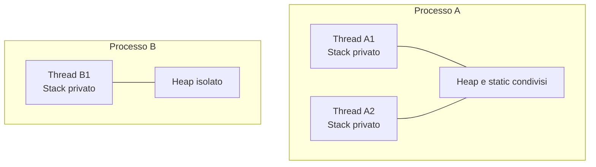
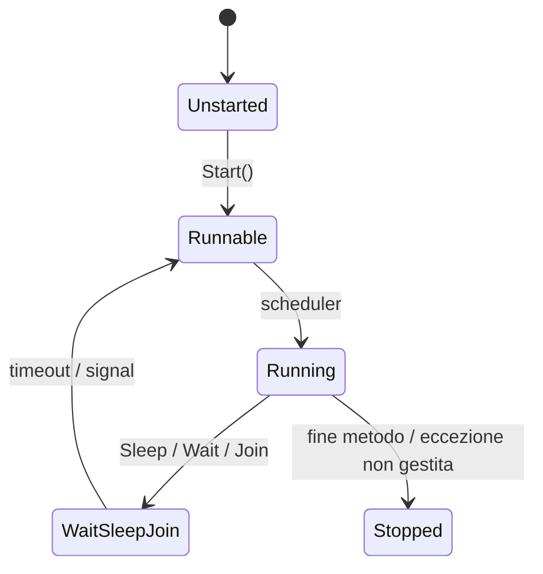

## 1. Introduzione alla concorrenza

Prima o poi un programma deve fare più cose nello stesso intervallo di tempo: non bloccare la UI, servire più richieste, sfruttare più core. Qui entrano in gioco i **thread**: unità di esecuzione interne a un processo, che condividono le risorse del processo ma hanno un proprio flusso di esecuzione.

### 1.1 Processo vs Thread

- Un **processo** è un'istanza in esecuzione di un programma: ha uno spazio di memoria isolato, le proprie risorse di sistema (file, socket, handle) e uno o più thread.
- Un **thread** è il percorso effettivo di esecuzione del codice dentro un processo: ha un proprio **stack**, un instruction pointer e uno stato, ma **condivide heap e campi static** con gli altri thread dello stesso processo.


```mermaid
flowchart TB
    subgraph P1["Processo A"]
        H1["Heap e static condivisi"]
        T1["Thread A1\nStack privato"]
        T2["Thread A2\nStack privato"]
        T1 --- H1
        T2 --- H1
    end
    subgraph P2["Processo B"]
        H2["Heap isolato"]
        T3["Thread B1\nStack privato"]
        T3 --- H2
    end
```

Comunicare tra processi richiede IPC (pipe, socket, shared memory); tra thread basta condividere oggetti in heap. Proprio questa condivisione è la fonte di **race condition** e **deadlock**.

### 1.2 Concorrenza vs Parallelismo

- **Concorrenza**: più attività fanno progresso nello stesso intervallo di tempo. È possibile anche su un solo core, alternando i thread (time slicing).
- **Parallelismo**: più attività sono eseguite davvero nello stesso istante, su core distinti.

La **legge di Amdahl** ricorda che lo speedup è limitato dalla parte sequenziale del programma:

$$
S(N) = \frac{1}{(1 - P) + \frac{P}{N}}
$$

dove $P$ è la frazione parallelizzabile e $N$ il numero di core. Se $P = 0.7$, anche con infiniti core il guadagno massimo è circa 3.33x: i thread non sono una bacchetta magica.

## 2. La classe `Thread`

`System.Threading.Thread` rappresenta un thread gestito esplicito. Nel codice moderno si preferiscono `Task` e async/await, ma `Thread` resta fondamentale per capire le basi e utile quando serve un thread dedicato a lunga vita.

### 2.1 Creazione, `Start` e `Join`

```cs norun
using System;
using System.Threading;

Thread worker = new Thread(() =>
{
    Console.WriteLine($"Worker su thread {Thread.CurrentThread.ManagedThreadId}");
    Thread.Sleep(1000);
    Console.WriteLine("Lavoro completato");
});

worker.Name = "ImportWorker";   // utile in debug e logging
worker.Start();                 // pronto per lo scheduler, non "parte adesso"
worker.Join();                  // attende la fine del worker

Console.WriteLine($"Ancora vivo? {worker.IsAlive}");  // False
```

- `Start()` si può chiamare **una sola volta**: un thread terminato non si riavvia.
- `Join()` blocca il chiamante fino alla fine del thread; `Join(500)` restituisce `bool` e permette un timeout.
- `Thread.Sleep(ms)` sospende il thread **corrente** per almeno quel tempo.

<Aside variant="warning">
`Thread.Sleep` non è uno strumento di sincronizzazione: "aspettare un po' che l'altro thread finisca" è un anti-pattern. Usa `Join`, `SemaphoreSlim`, `Task` o collezioni bloccanti.
</Aside>

### 2.2 Passare parametri

Il costruttore accetta un `ThreadStart` (nessun parametro) o un `ParameterizedThreadStart` (un solo parametro `object?`, che richiede cast). In pratica è più comodo e type-safe **catturare i valori con una lambda**:

```cs norun
void Processa(string file, int retry) =>
    Console.WriteLine($"Processo {file} con {retry} tentativi");

// ParameterizedThreadStart: un solo object?, poco sicuro
Thread t1 = new Thread(obj => Console.WriteLine($"Valore: {obj}"));
t1.Start(42);

// Lambda con capture: più parametri, tipizzati
Thread t2 = new Thread(() => Processa("report.csv", 3));
t2.Start();
```

<Aside variant="warning">
La variabile di un ciclo `for` è **unica** per tutto il ciclo: se la catturi in una lambda, i thread possono vedere il valore già incrementato. Copiala prima in una variabile locale.
</Aside>

```cs norun
for (int i = 0; i < 3; i++)
    new Thread(() => Console.Write(i)).Start();     // può stampare 3 3 3, 1 3 3...

for (int i = 0; i < 3; i++)
{
    int copia = i;
    new Thread(() => Console.Write(copia)).Start(); // 0 1 2 (in ordine qualsiasi)
}
```

### 2.3 Foreground vs Background

- I thread **foreground** (default) tengono vivo il processo.
- I thread **background** (`IsBackground = true`) vengono terminati quando finiscono tutti i foreground.

```cs norun
Thread bg = new Thread(() =>
{
    for (int i = 0; i < 10; i++)
    {
        Console.WriteLine($"Background step {i}");
        Thread.Sleep(500);
    }
});

bg.IsBackground = true;
bg.Start();
Console.WriteLine("Main termina subito");
// Il processo può chiudersi dopo pochi step: il thread background viene troncato
```

### 2.4 Fermare un thread: cancellazione cooperativa

`Thread.Abort()` interrompeva forzatamente un thread, ma è **deprecato** e non supportato nel .NET moderno. Il modo corretto è chiedere al thread di fermarsi e lasciare che sia lui a uscire in modo pulito:

```cs norun
using CancellationTokenSource cts = new();

Thread worker = new Thread(() =>
{
    while (!cts.Token.IsCancellationRequested)
    {
        Console.WriteLine("Lavoro...");
        Thread.Sleep(200);
    }
    Console.WriteLine("Fermato in modo pulito");
});

worker.Start();
Thread.Sleep(700);
cts.Cancel();   // richiesta di stop
worker.Join();
```

<Aside variant="danger">
Non usare `Thread.Abort()`: può interrompere il thread a metà di una sezione critica e lasciare lo stato condiviso incoerente. Su .NET 5+ lancia `PlatformNotSupportedException`.
</Aside>

### 2.5 Ciclo di vita


```mermaid
stateDiagram-v2
    [*] --> Unstarted
    Unstarted --> Runnable : Start()
    Runnable --> Running : scheduler
    Running --> WaitSleepJoin : Sleep / Wait / Join
    WaitSleepJoin --> Runnable : timeout / signal
    Running --> Stopped : fine metodo / eccezione non gestita
```

## 3. Thread Pool

Creare un thread costa: allocazione dello stack (dell'ordine di 1 MB ciascuno), registrazione presso l'OS, context switch. Con centinaia di thread il sistema spende più tempo a cambiare contesto che a lavorare. Il **ThreadPool** risolve il problema con un insieme di worker thread **riutilizzabili**, dimensionato dinamicamente dal runtime. È anche la base di `Task.Run`.

```cs
using System;
using System.Threading;

ThreadPool.QueueUserWorkItem(_ =>
    Console.WriteLine($"Worker pool: {Thread.CurrentThread.ManagedThreadId}"));

// Con stato
ThreadPool.QueueUserWorkItem(state =>
    Console.WriteLine($"Elaboro ordine {state}"), 12345);

Thread.Sleep(500); // solo per la demo: i thread del pool sono background
```

**Quando usarlo**: lavori brevi o medi, numerosi e indipendenti. **Quando evitarlo**: loop dedicati a lunga vita, o lavoro che blocca a lungo i worker (I/O sincrono, lock lunghi), perché il pool si satura.

| Scenario | Scelta |
|---|---|
| I/O (rete, file, database) | async/await |
| lavoro CPU-bound breve | `Task.Run` / ThreadPool |
| thread dedicato a lunga vita | `new Thread(...)` |

Esistono anche `ThreadPool.SetMinThreads` e `SetMaxThreads`, ma modificarli senza profiling peggiora spesso throughput e latenza: i valori di default vanno quasi sempre bene.

## 4. Sincronizzazione

Far partire i thread è facile; il problema vero è **coordinarli** quando accedono agli stessi dati.

### 4.1 Race condition

Si ha una **race condition** quando più thread accedono allo stesso stato condiviso, almeno uno scrive, e non c'è sincronizzazione: il risultato dipende dall'ordine di esecuzione.

```cs norun
using System;
using System.Threading;

int counter = 0;

void Incrementa()
{
    for (int i = 0; i < 100_000; i++)
        counter++;
}

Thread t1 = new Thread(Incrementa);
Thread t2 = new Thread(Incrementa);
t1.Start(); t2.Start();
t1.Join();  t2.Join();

Console.WriteLine(counter); // atteso 200000, spesso esce meno (es. 137512)
```

`counter++` non è atomico: è **leggi, aggiungi 1, scrivi**. Se due thread leggono entrambi 10 e scrivono 11, un incremento va perso.

### 4.2 `lock`

`lock` protegge una **sezione critica**, eseguibile da un solo thread alla volta. È zucchero sintattico per `Monitor.Enter`/`Monitor.Exit` dentro un `try/finally`.

```cs norun
private static readonly object _sync = new();
private static int _counter = 0;

private static void Incrementa()
{
    for (int i = 0; i < 100_000; i++)
    {
        lock (_sync)
        {
            _counter++;   // ora il risultato è sempre 200000
        }
    }
}
```

<Aside variant="warning">
Usa sempre un oggetto **privato dedicato** come lock. Mai `lock(this)`, `lock("stringa")` o `lock(typeof(...))`: sono raggiungibili da codice esterno, che potrebbe bloccarli a sua volta.
</Aside>

Tieni la sezione critica il più breve possibile: niente I/O, `Sleep` o chiamate a codice esterno dentro un `lock`. Più dura, più aumentano contesa e rischio di deadlock.

### 4.3 Deadlock

Un **deadlock** si ha quando due o più thread restano bloccati per sempre, ognuno in attesa di una risorsa tenuta da un altro.

```cs norun
object lockA = new(), lockB = new();

Thread t1 = new Thread(() =>
{
    lock (lockA) { Thread.Sleep(100); lock (lockB) Console.WriteLine("T1 ok"); }
});

Thread t2 = new Thread(() =>
{
    lock (lockB) { Thread.Sleep(100); lock (lockA) Console.WriteLine("T2 ok"); }
});

t1.Start(); t2.Start();
t1.Join();  t2.Join();   // non termina mai: T1 aspetta B, T2 aspetta A
```

Un deadlock richiede che coesistano le quattro **condizioni di Coffman**: mutua esclusione, hold and wait, no preemption, attesa circolare. Basta romperne una. La soluzione più pratica è eliminare l'attesa circolare imponendo un **ordine globale di acquisizione**:

```cs norun
// Entrambi i thread prendono sempre prima A, poi B: nessun ciclo possibile
Thread t1 = new Thread(() => { lock (lockA) lock (lockB) Console.WriteLine("T1 ok"); });
Thread t2 = new Thread(() => { lock (lockA) lock (lockB) Console.WriteLine("T2 ok"); });
```

In alternativa, `Monitor.TryEnter(lockB, TimeSpan.FromSeconds(1))` permette di rinunciare al lock dopo un timeout invece di restare bloccati.

### 4.4 `Monitor.Wait` e `Pulse`

`Monitor` permette anche di **attendere una condizione**: `Wait` rilascia temporaneamente il lock e sospende il thread, `Pulse`/`PulseAll` risvegliano chi è in attesa. Esempio: buffer a un solo slot.

```cs
public class SingleSlotBuffer
{
    private readonly object _sync = new();
    private int _value;
    private bool _hasValue;

    public void Produce(int value)
    {
        lock (_sync)
        {
            while (_hasValue) Monitor.Wait(_sync);  // attende che lo slot si liberi
            _value = value;
            _hasValue = true;
            Monitor.PulseAll(_sync);
        }
    }

    public int Consume()
    {
        lock (_sync)
        {
            while (!_hasValue) Monitor.Wait(_sync); // attende un valore
            _hasValue = false;
            Monitor.PulseAll(_sync);
            return _value;
        }
    }
}
```

`Wait` va sempre messo in un `while`, non in un `if`: dopo il risveglio la condizione va ricontrollata. In pratica, per producer-consumer conviene `BlockingCollection<T>` (vedi la parte 2).

### 4.5 `SemaphoreSlim`, `Mutex` e `ReaderWriterLockSlim`

Un **semaforo** lascia entrare al massimo **N thread contemporaneamente**: utile per limitare l'accesso a una risorsa (es. massimo 3 connessioni a un database o a un'API).

```cs
using System;
using System.Threading;

SemaphoreSlim gate = new(3);   // massimo 3 job insieme

for (int i = 0; i < 10; i++)
{
    int jobId = i;
    ThreadPool.QueueUserWorkItem(_ =>
    {
        gate.Wait();
        try
        {
            Console.WriteLine($"Job {jobId} entra");
            Thread.Sleep(1000);
        }
        finally
        {
            Console.WriteLine($"Job {jobId} esce");
            gate.Release();   // sempre nel finally
        }
    });
}

Thread.Sleep(5000);
```

`ReaderWriterLockSlim` consente **più lettori contemporanei** ma **un solo scrittore esclusivo**: utile quando le letture dominano nettamente le scritture.

```cs
public class Cache
{
    private readonly Dictionary<int, string> _data = new();
    private readonly ReaderWriterLockSlim _rw = new();

    public string? Get(int key)
    {
        _rw.EnterReadLock();
        try { return _data.TryGetValue(key, out var v) ? v : null; }
        finally { _rw.ExitReadLock(); }
    }

    public void Set(int key, string value)
    {
        _rw.EnterWriteLock();
        try { _data[key] = value; }
        finally { _rw.ExitWriteLock(); }
    }
}
```

`Mutex` funziona come un `lock`, ma è più pesante e può essere **cross-process** se ha un nome. Un uso tipico è impedire di avviare due istanze della stessa applicazione:

```cs
using Mutex mutex = new(false, "Global\\AppuntiFaciliMutex");

if (!mutex.WaitOne(TimeSpan.Zero))
{
    Console.WriteLine("Applicazione già in esecuzione");
    return;
}

Console.WriteLine("Unica istanza attiva");
// ... lavoro ...
mutex.ReleaseMutex();
```

<Aside variant="tip">
Regole pratiche per le basi: usa `Thread` solo per thread dedicati a lunga vita e il ThreadPool (o `Task`) per il resto, senza creare un thread per ogni richiesta. Proteggi ogni stato condiviso con una strategia coerente: lock privati, sezioni critiche brevi, ordine globale di acquisizione. Niente `Thread.Sleep` come sincronizzazione e niente `Thread.Abort`.
</Aside>

## 5. Quiz

import Quiz from '../../../components/Quiz.jsx';

<Quiz client:load questions={[
{
question:"Qual è la differenza fondamentale tra processi e thread?",
answers:{
a:"I thread hanno memoria isolata, i processi condivisa",
b:"I processi non possono avere più unità di esecuzione",
c:"I processi hanno memoria isolata, i thread dello stesso processo condividono heap e static",
d:"Non esiste alcuna differenza reale"
},
correctAnswer:"c"
},
{
question:"Cosa fa Thread.Join()?",
answers:{
a:"Crea un nuovo thread nel pool",
b:"Blocca il thread chiamante finché il thread target termina",
c:"Sospende definitivamente il thread target",
d:"Rende il thread background"
},
correctAnswer:"b"
},
{
question:"Cosa succede a un thread con IsBackground = true quando terminano tutti i thread foreground?",
answers:{
a:"Continua finché non completa il suo lavoro",
b:"Diventa automaticamente foreground",
c:"Viene terminato insieme al processo",
d:"Viene spostato nel ThreadPool"
},
correctAnswer:"c"
},
{
question:"Qual è il modo corretto per fermare un thread che esegue un ciclo?",
answers:{
a:"Chiamare Thread.Abort()",
b:"Impostare IsBackground = true mentre è in esecuzione",
c:"Usare una cancellazione cooperativa, ad esempio con CancellationToken",
d:"Chiamare Start() una seconda volta"
},
correctAnswer:"c"
},
{
question:"Quale affermazione descrive meglio il ThreadPool?",
answers:{
a:"Crea un nuovo processo per ogni lavoro",
b:"È un insieme di thread riutilizzabili gestiti dal runtime",
c:"Serve solo per la UI",
d:"Garantisce un thread dedicato permanente per ogni task"
},
correctAnswer:"b"
},
{
question:"Una race condition richiede tipicamente che:",
answers:{
a:"Ci siano due thread che leggono dati immutabili",
b:"Ci sia accesso concorrente a stato condiviso con almeno una scrittura non sincronizzata",
c:"Ci sia sempre un deadlock",
d:"Venga usato un SemaphoreSlim"
},
correctAnswer:"b"
},
{
question:"Qual è la strategia più pratica per prevenire un deadlock tra due lock?",
answers:{
a:"Aggiungere Thread.Sleep prima di ogni lock",
b:"Acquisire i lock sempre nello stesso ordine globale",
c:"Rendere volatile l'oggetto usato come lock",
d:"Usare lock(this) invece di un oggetto privato"
},
correctAnswer:"b"
},
{
question:"Devi permettere al massimo 3 accessi contemporanei a un'API esterna. Quale primitiva è più adatta?",
answers:{
a:"lock",
b:"SemaphoreSlim(3)",
c:"Mutex con nome",
d:"Monitor.PulseAll"
},
correctAnswer:"b"
}
]} />

## 6. Esercizi

### 6.1 Race condition bancaria

**Scenario**:
Due operazioni concorrenti sullo stesso conto producono a volte un saldo finale errato.

**Consegna**:

1. Crea una classe `BankAccount` con campo `_balance` e metodi `Deposit` e `Withdraw` senza sincronizzazione.
2. Avvia due thread che eseguono migliaia di depositi e prelievi e mostra che il saldo può risultare sbagliato.
3. Correggi con un `lock` privato; `Withdraw` deve rifiutare il prelievo se il saldo è insufficiente.
4. Spiega in poche righe perché `_balance += importo` non è atomico e perché il controllo "saldo sufficiente" e il prelievo devono stare nello stesso `lock`.

*Obiettivo didattico: riconoscere una race condition e proteggere un'invariante con `lock`.*

### 6.2 Cache in memoria con molte letture

**Scenario**:
Una cache di configurazioni viene letta migliaia di volte al secondo da thread diversi, ma aggiornata solo occasionalmente.

**Consegna**:

1. Crea una classe `ConfigurationCache` basata su `Dictionary<string, string>` protetta da `ReaderWriterLockSlim`.
2. Implementa `Get(string key)` e `Set(string key, string value)`.
3. Simula 10 thread lettori in loop e 1 thread scrittore che aggiorna alcuni valori ogni secondo.
4. Ferma tutti i thread dopo 5 secondi con un `CancellationToken`.

*Obiettivo didattico: capire quando `ReaderWriterLockSlim` è preferibile a un semplice `lock`.*

### 6.3 Import CSV con throttling

**Scenario**:
Un'applicazione deve importare 30 file CSV, ma il database regge al massimo 3 scritture concorrenti.

**Consegna**:

1. Accoda un job per ogni file con `ThreadPool.QueueUserWorkItem` (attento alla cattura della variabile del ciclo).
2. Usa `SemaphoreSlim(3)` per limitare gli import simultanei, rilasciandolo in un `finally`.
3. Simula lettura, validazione e scrittura con `Thread.Sleep`, stampando quando un job entra ed esce.
4. Conta i file importati in un contatore condiviso protetto da `lock` e stampa il totale alla fine.

*Obiettivo didattico: combinare ThreadPool, semafori e sezioni critiche.*

---

Nella parte 2 vedremo alternative più leggere o specifiche al `lock`: `Interlocked`, `volatile`, `ThreadLocal<T>`, le collezioni concorrenti e la gestione delle eccezioni nei thread.
