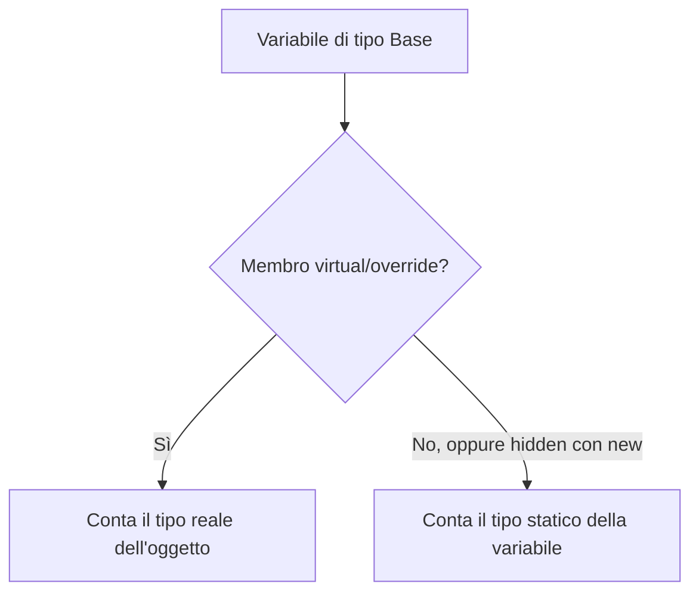
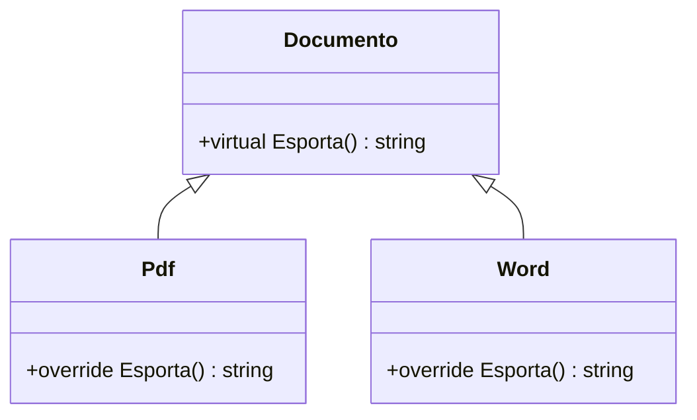
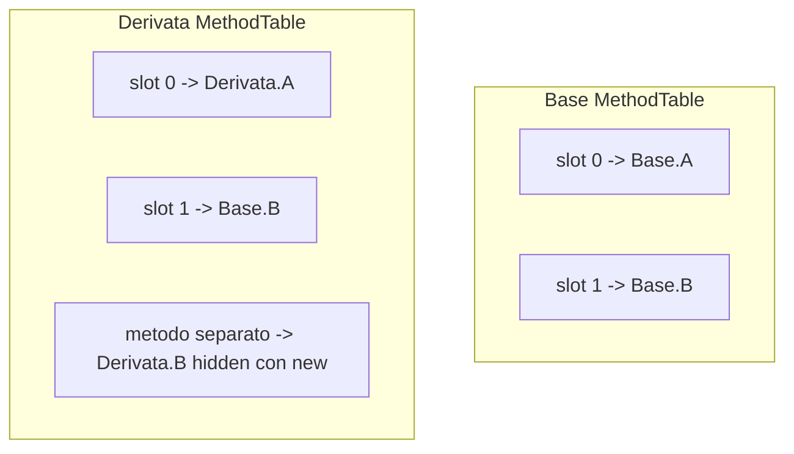
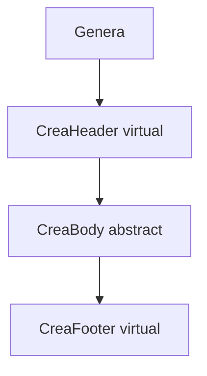
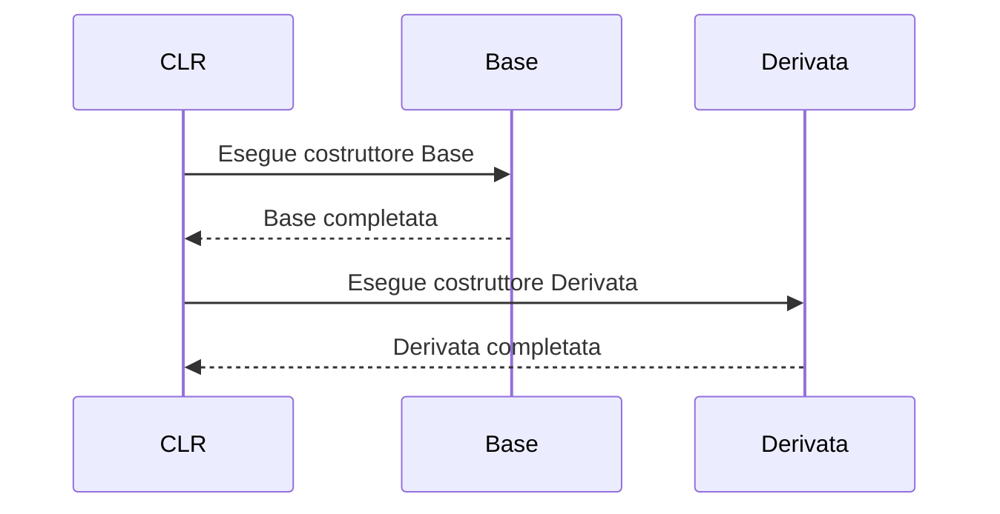
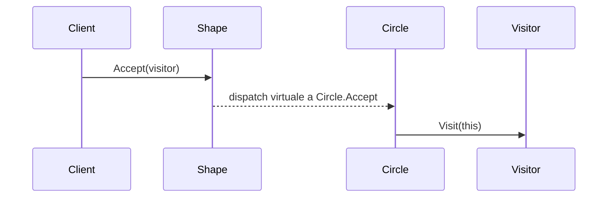

## 1. Introduzione al polimorfismo in C#

In C#, quando una classe deriva da un'altra, possono succedere tre cose diverse:

- **Overloading**: stesso nome, firma diversa.
- **Overriding** (`virtual` / `override`): la classe derivata **sostituisce davvero** il comportamento della base nel modello polimorfico.
- **Hiding** (`new`): la classe derivata **nasconde** un membro della base, ma non entra nella stessa catena di dispatch virtuale.

La distinzione cruciale è tra:

- **tipo statico** della variabile: quello noto al compilatore;
- **tipo dinamico** dell'oggetto: quello reale a runtime.

Con `override`, vince il tipo dinamico. Con `new`, vince il tipo statico.

```cs
public class Animale
{
    public virtual string FaiVerso() => "...";
}

public class Cane : Animale
{
    public override string FaiVerso() => "Bau!";
}

public class Lupo : Animale
{
    public new string FaiVerso() => "Auuuu";
}
```

```cs
Animale a1 = new Cane();
Animale a2 = new Lupo();
Lupo l = new Lupo();

Console.WriteLine(a1.FaiVerso()); // Bau!
Console.WriteLine(a2.FaiVerso()); // ...
Console.WriteLine(l.FaiVerso());  // Auuuu
```

Nel secondo caso l'oggetto è `Lupo`, ma la chiamata passa dalla variabile `Animale`, quindi il metodo nascosto con `new` non partecipa al polimorfismo della base.



## 2. virtual e override — Method Overriding

Un metodo `virtual` definisce un comportamento ereditabile e ridefinibile. Un metodo `override` non crea un metodo indipendente: **riempie lo stesso slot virtuale** della classe base con un'implementazione più specifica.

```cs
public class Documento
{
    public virtual string Esporta()
    {
        return "Documento generico";
    }
}

public class Pdf : Documento
{
    public override string Esporta()
    {
        return "Esportazione PDF";
    }
}

public class Word : Documento
{
    public override string Esporta()
    {
        return "Esportazione Word";
    }
}
```

### Polimorfismo a runtime

```cs
Documento[] documenti =
{
    new Pdf(),
    new Word(),
    new Documento()
};

foreach (var doc in documenti)
{
    Console.WriteLine(doc.Esporta());
}
```

Il compilatore controlla che `Esporta` esista sul tipo statico `Documento`; il CLR sceglie poi l'implementazione concreta in base al tipo reale dell'istanza.

### override non è un nuovo contratto

Quando fai `override`, mantieni la stessa firma logica del metodo base:

- stesso nome;
- stessa lista di parametri;
- stessa accessibilità compatibile;
- stesso significato semantico atteso;
- stesso slot virtuale.

Questo è il motivo per cui `override` è adatto al polimorfismo vero: tutte le classi derivate vengono trattate come sostituti della base.



## 3. Dispatch virtuale interno: vtable, slot e IL/CLR

Dietro `virtual` / `override` c'è un meccanismo di runtime spesso descritto come **vtable** (*virtual method table*). Nel CLR il termine tecnico più vicino è **MethodTable** del tipo, ma a livello didattico si può pensare a una vtable.

### Un'unica tabella virtuale per ogni tipo runtime

Ogni tipo concreto caricato dal CLR possiede una struttura dati che contiene, tra le altre cose, i riferimenti ai metodi virtuali risolvibili su quel tipo. In forma semplificata:

- c'è **una tabella per tipo**;
- ogni metodo virtuale occupa uno **slot**;
- un `override` **riusa lo slot** della base;
- un metodo `new` crea un membro distinto e **non sostituisce lo slot** esistente.

Formalmente, se il metodo virtuale occupa lo slot $i$, per un tipo $T$ possiamo immaginare:

$$
VTable(T)[i] = \text{implementazione piu specifica del metodo virtuale nello slot } i \text{ per } T
$$

Se `Base.M()` è virtuale e `Derivata.M()` è `override`, allora:

$$
slot(Base.M) = slot(Derivata.M)
$$

Se invece `Derivata.M()` usa `new`, in generale:

$$
slot(Derivata.M) \neq slot(Base.M)
$$

oppure, più precisamente, il metodo nascosto non sostituisce affatto lo slot della base.

### Esempio concettuale di slot

```cs
public class Base
{
    public virtual void A() { }
    public virtual void B() { }
}

public class Derivata : Base
{
    public override void A() { }
    public new void B() { }
}
```

Possiamo immaginare la situazione così:



La chiamata virtuale a `B` passando da una reference `Base` continuerà a usare `slot 1`, che in `Derivata` punta ancora a `Base.B`, perché `new` non ha fatto override di quello slot.

### IL: call vs callvirt

A livello IL ci sono due istruzioni molto importanti:

- `call`: chiamata diretta al metodo specificato;
- `callvirt`: chiamata virtuale, che usa l'istanza per trovare la destinazione a runtime.

Esempio concettuale:

```cs
Base x = new Derivata();
x.A(); // virtual
x.B(); // non virtual oppure hidden
```

IL semplificato:

```cs
ldloc x
callvirt instance void Base::A()

ldloc x
call instance void Base::B()
```

Attenzione a una sottigliezza importante: il compilatore C# emette spesso `callvirt` anche per metodi di istanza non virtuali, perché così ottiene anche il controllo di `null`. Quindi:

- **non ogni `callvirt` significa vero dispatch virtuale**;
- il vero dispatch dinamico avviene solo se il metodo chiamato è virtuale nel metadata del tipo.

### Come il CLR arriva al metodo giusto

Dal punto di vista concettuale:

1. il compilatore determina quale **membro** stai tentando di chiamare usando il tipo statico;
2. per i metodi virtuali, quel membro corrisponde a uno **slot**;
3. a runtime l'oggetto contiene un riferimento al proprio tipo concreto;
4. il CLR legge la MethodTable del tipo concreto;
5. nello slot richiesto trova il puntatore al metodo corretto;
6. esegue quel metodo.

Quindi, nella pratica moderna del CLR, la ricerca non richiede di "scansionare" tutta la gerarchia a ogni chiamata: la gerarchia viene consolidata nella MethodTable del tipo, e la chiamata usa direttamente lo slot già risolto.

## 4. Ordine di risoluzione dei metodi nella gerarchia

Quando scrivi `obj.Metodo()`, la risoluzione avviene in due fasi diverse: una a compile time, una a runtime.

### Fase 1: selezione del membro a compile time

Il compilatore parte dal **tipo statico** della variabile:

```cs
Base obj = new Derivata();
obj.Metodo();
```

Il compilatore vede solo che `obj` è di tipo `Base`, quindi controlla:

- esiste `Metodo` in `Base`?
- è accessibile?
- è virtuale o no?

Se `Metodo` non esiste su `Base`, la chiamata non compila, anche se l'oggetto reale è `Derivata`.

### Fase 2: dispatch a runtime

Se il metodo selezionato è virtuale, il CLR usa il tipo dinamico dell'oggetto.

Concettualmente la regola è:

1. parti dal tipo reale dell'istanza;
2. cerca se quel tipo ha un override dello slot richiesto;
3. se non lo ha, eredita l'implementazione del tipo base più vicino;
4. continua finché trovi l'implementazione effettiva.

Di nuovo: concettualmente si parla di "salire o scendere nella gerarchia", ma l'implementazione reale usa slot già materializzati nella MethodTable del tipo.

### Esempio con più livelli

```cs
public class A
{
    public virtual string Nome() => "A";
}

public class B : A
{
    public override string Nome() => "B";
}

public class C : B
{
}
```

```cs
A x = new C();
Console.WriteLine(x.Nome()); // "B"
```

`C` non ridefinisce `Nome`, quindi nello slot virtuale eredita il puntatore a `B.Nome`.

### base. non usa il normale dispatch virtuale

Quando in un override scrivi `base.Nome()`, non stai dicendo "scegli a runtime il più derivato". Stai dicendo:

- invoca l'implementazione del **tipo base immediato**.

```cs
public class Veicolo
{
    public virtual string Descrizione() => "Veicolo";
}

public class Auto : Veicolo
{
    public override string Descrizione() => base.Descrizione() + " -> Auto";
}

public class Sportiva : Auto
{
    public override string Descrizione() => base.Descrizione() + " -> Sportiva";
}
```

`base.Descrizione()` in `Sportiva` chiama `Auto.Descrizione`, non "qualunque implementazione più derivata".

## 5. new — Method Hiding, warning del compilatore e re-implementazione delle interfacce

`new` indica esplicitamente che stai **nascondendo** un membro ereditato. Non stai facendo override. Stai creando un nuovo punto di accesso con lo stesso nome.

```cs
public class Forma
{
    public string Descrizione()
    {
        return "Sono una forma";
    }
}

public class Cerchio : Forma
{
    public new string Descrizione()
    {
        return "Sono un cerchio";
    }
}
```

```cs
Cerchio c = new Cerchio();
Forma f = c;

Console.WriteLine(c.Descrizione()); // Sono un cerchio
Console.WriteLine(f.Descrizione()); // Sono una forma
```

### Il warning quando dimentichi new

Se in una classe derivata dichiari un membro con lo stesso nome e la stessa firma di uno della base ma **senza** scrivere `new`, il compilatore segnala un warning simile a:

> Il membro nasconde un membro ereditato; usare la parola chiave new se l'occultamento era intenzionale.

Perché esiste questo warning?

- perché molto spesso il programmatore voleva fare `override` ma ha dimenticato `virtual` nella base o `override` nella derivata;
- perché il comportamento di `new` è meno intuitivo nel codice polimorfico;
- perché il cambio di comportamento dipende dal tipo della variabile e può generare bug silenziosi.

In altre parole, il warning serve a farti dichiarare apertamente l'intenzione.

### Nascondere un metodo virtuale con new

È possibile anche nascondere un metodo virtuale:

```cs
public class Base
{
    public virtual void Stampa() => Console.WriteLine("Base");
}

public class Derivata : Base
{
    public new void Stampa() => Console.WriteLine("Derivata");
}
```

```cs
Base b = new Derivata();
Derivata d = new Derivata();

b.Stampa(); // Base
d.Stampa(); // Derivata
```

Questo è uno dei casi più pericolosi: il metodo della derivata sembra "sostituire" quello base, ma in realtà vive fuori dalla catena di override.

### Interfacce e re-implementazione nella classe derivata

Con le interfacce la storia si complica. Una classe base può già implementare un'interfaccia, e una classe derivata può decidere di:

- ereditare semplicemente quella implementazione;
- fare `override` se il membro base è virtuale;
- **re-implementare l'interfaccia** nella classe derivata;
- usare `new` insieme alla nuova dichiarazione dell'interfaccia.

Esempio:

```cs
public interface IFormatter
{
    string Format();
}

public class BaseFormatter : IFormatter
{
    public string Format() => "Base";
}

public class JsonFormatter : BaseFormatter, IFormatter
{
    public new string Format() => "Json";
}
```

```cs
JsonFormatter jf = new JsonFormatter();
BaseFormatter bf = jf;
IFormatter f = jf;

Console.WriteLine(jf.Format()); // Json
Console.WriteLine(bf.Format()); // Base
Console.WriteLine(f.Format());  // Json
```

La parte sorprendente è l'ultima riga: ripetendo `IFormatter` nella lista delle interfacce, la classe derivata **re-mappa** l'interfaccia al proprio metodo `Format`, anche se quel metodo usa `new`.

Se invece la derivata **non** re-dichiara l'interfaccia, in molti casi eredita la mappatura della base.

### Conclusione operativa su new

Usa `new` solo quando vuoi davvero uno di questi effetti:

- separare intenzionalmente due API con lo stesso nome;
- adattare un tipo legacy senza cambiare il suo comportamento polimorfico;
- re-implementare esplicitamente un'interfaccia nella classe derivata.

Se vuoi polimorfismo normale, `new` è quasi sempre la scelta sbagliata.

## 6. abstract, sealed, covarianza del tipo di ritorno e pattern Template Method

### abstract: contratto incompleto ma polimorfico

Un metodo `abstract` occupa uno slot virtuale ma non ha corpo. Le classi concrete derivate devono completarlo.

```cs
public abstract class Forma
{
    public abstract double Area();
    public virtual string Tipo() => "Forma generica";
}

public class Rettangolo : Forma
{
    public double Base { get; }
    public double Altezza { get; }

    public Rettangolo(double @base, double altezza)
    {
        Base = @base;
        Altezza = altezza;
    }

    public override double Area() => Base * Altezza;
}
```

`abstract` è quindi "più forte" di `virtual`: non solo permette l'override, ma lo rende obbligatorio prima di poter istanziare il tipo concreto.

### sealed override: chiude la catena

Un metodo può essere virtuale nella base, overridden in una derivata, e poi chiuso con `sealed override`.

```cs
public class Animale
{
    public virtual string FaiVerso() => "...";
}

public class Cane : Animale
{
    public sealed override string FaiVerso() => "Bau!";
}
```

Lo slot rimane lo stesso, ma non può più essere ridefinito nelle classi successive.

### Covariant return types (C# 9+)

Da C# 9 in poi, un `override` può restituire un tipo più derivato del tipo di ritorno del metodo base, purché sia compatibile per sostituzione.

```cs
public class Documento
{
    public virtual Stream ApriStream()
    {
        return Stream.Null;
    }
}

public class DocumentoInMemoria : Documento
{
    public override MemoryStream ApriStream()
    {
        return new MemoryStream();
    }
}
```

Qui `MemoryStream` deriva da `Stream`, quindi la sostituzione è lecita. Il chiamante che vede un `Documento` continua a ricevere almeno uno `Stream`; il chiamante che conosce `DocumentoInMemoria` può beneficiare del tipo più specifico.

### Template Method Pattern

Un pattern classico che sfrutta `abstract` e `virtual` è il **Template Method**: la classe base definisce lo scheletro dell'algoritmo, mentre le derivate personalizzano alcuni passi.

```cs
public abstract class ReportGenerator
{
    public string Genera()
    {
        string header = CreaHeader();
        string body = CreaBody();
        string footer = CreaFooter();

        return header + "\n" + body + "\n" + footer;
    }

    protected virtual string CreaHeader() => "Header standard";
    protected abstract string CreaBody();
    protected virtual string CreaFooter() => "Footer standard";
}

public class SalesReportGenerator : ReportGenerator
{
    protected override string CreaHeader() => "Header vendite";
    protected override string CreaBody() => "Corpo report vendite";
}
```

Qui il metodo `Genera` non dovrebbe essere ridefinito liberamente: rappresenta il flusso dell'algoritmo. Le estensioni controllate avvengono tramite i metodi virtuali/astratti.



## 7. Costruttori, ordine di inizializzazione, classi astratte e interfacce

## 7.1 Ordine di esecuzione dei costruttori

In una gerarchia di ereditarietà, il corpo del costruttore della base viene eseguito prima del corpo del costruttore della derivata.

In forma semplificata:

1. viene allocato l'oggetto;
2. l'istanza viene inizialmente azzerata;
3. si eseguono inizializzatori e costruttore della base;
4. poi inizializzatori e costruttore della derivata.

```cs
public class Base
{
    public Base()
    {
        Console.WriteLine("Costruttore Base");
    }
}

public class Derivata : Base
{
    public Derivata()
    {
        Console.WriteLine("Costruttore Derivata");
    }
}
```

Output:

```cs
Costruttore Base
Costruttore Derivata
```



### Chiamare metodi virtuali nel costruttore è pericoloso

Questo è un gotcha molto serio:

```cs
public class Base
{
    public Base()
    {
        Inizializza();
    }

    protected virtual void Inizializza()
    {
        Console.WriteLine("Base");
    }
}

public class Derivata : Base
{
    private string nome = "Pronto";

    protected override void Inizializza()
    {
        Console.WriteLine(nome.Length);
    }
}
```

Sembra innocuo, ma durante l'esecuzione del costruttore di `Base`, la parte `Derivata` potrebbe non essere ancora completamente inizializzata. In casi reali, campi, dipendenze o invarianti della derivata possono essere ancora in stato non valido.

Regola pratica:

- evita chiamate a metodi virtuali da costruttori;
- evita anche chiamate virtuali da distruttori/finalizer o da logica di inizializzazione delicata.

## 7.2 Classi astratte vs interfacce

Sia le classi astratte sia le interfacce possono descrivere un contratto, ma servono a scopi diversi.

### Preferisci una classe abstract quando:

- vuoi condividere **stato** tramite campi;
- vuoi condividere **implementazione base** non banale;
- vuoi imporre una forte relazione "is-a";
- vuoi usare il Template Method Pattern.

### Preferisci un'interfaccia quando:

- vuoi definire solo una **capacità** o un ruolo;
- vuoi supportare implementazioni eterogenee;
- ti serve ereditarietà multipla di contratto;
- non vuoi imporre una gerarchia concreta comune.

### Default interface implementations (C# 8+)

Da C# 8, un'interfaccia può avere implementazioni di default:

```cs
public interface ILogger
{
    void Log(string message);

    void LogWarning(string message)
    {
        Log("[WARN] " + message);
    }
}
```

Questo riduce la necessità di classi base solo per condividere piccoli pezzi di comportamento.

Però attenzione:

- le interfacce non diventano automaticamente un sostituto perfetto delle classi astratte;
- non gestiscono stato di istanza come una classe base normale;
- il modello di dispatch delle interfacce è distinto da quello dei virtual method di classe.

In pratica:

- **classe abstract**: stessa famiglia, stato condiviso, algoritmo base;
- **interfaccia**: contratto trasversale, capacità, accoppiamento minore.

## 8. Prestazioni, devirtualizzazione del JIT e Principio di Sostituzione di Liskov

## 8.1 Prestazioni: virtual call vs non-virtual call

Una chiamata non virtuale è, concettualmente, più semplice:

- il target è noto direttamente;
- il runtime può emettere una chiamata diretta.

Una chiamata virtuale richiede invece un livello di indirezione:

1. leggere il tipo reale dell'oggetto;
2. recuperare la MethodTable;
3. leggere il puntatore nello slot corretto;
4. invocare il metodo trovato.

In forma ideale:

$$
\text{direct call} \approx \text{salto diretto a un indirizzo noto}
$$

$$
\text{virtual call} \approx \text{indirizzo letto indirettamente da uno slot}
$$

Questo comporta in genere:

- un piccolo overhead in più;
- meno opportunità immediate di inline;
- analisi più complessa per il JIT.

### Ma il costo reale moderno è spesso piccolo

Nei programmi reali, la differenza è spesso trascurabile rispetto a:

- allocazioni;
- accesso a memoria;
- I/O;
- query database;
- serializzazione;
- rete.

Quindi non bisogna evitare `virtual` per paura prematura delle prestazioni.

### Devirtualizzazione del JIT

Il JIT del .NET runtime può spesso **devirtualizzare** una chiamata, cioè trasformarla in pratica in una chiamata diretta quando riesce a dimostrare il target effettivo.

Esempi comuni:

- il tipo concreto è noto nel punto di chiamata;
- il metodo è `sealed` oppure la classe è `sealed`;
- analisi di profilo o di tipo consente di dedurre il target;
- il metodo viene poi anche inline-ato.

Quindi il quadro reale è:

- `virtual` non significa automaticamente "lento";
- `non-virtual` non significa automaticamente "più veloce in modo misurabile";
- prima si progetta correttamente, poi eventualmente si misura.

### Interfacce e costi

Anche il dispatch tramite interfaccia può essere più costoso di una chiamata diretta, ma il runtime moderno usa cache e ottimizzazioni. Dal punto di vista del design, l'interfaccia va scelta per il modello di astrazione, non come micro-ottimizzazione.

## 8.2 Principio di Sostituzione di Liskov (LSP)

Il **Liskov Substitution Principle** afferma, in forma informale, che un oggetto di una classe derivata deve poter essere usato al posto di un oggetto della classe base senza rompere la correttezza del programma.

Una formulazione compatta è:

$$
S <: T \implies \forall P,\; P(T) \text{ corretto } \Rightarrow P(S) \text{ corretto}
$$

dove:

- `S` indica il sottotipo;
- `T` indica il supertipo;
- `P` indica un programma che usa oggetti di tipo `T`.

### Cosa significa per virtual/override

Un override corretto non dovrebbe:

- richiedere precondizioni più forti della base;
- garantire postcondizioni più deboli della base;
- violare invarianti attesi dalla base;
- sorprendere il chiamante con effetti collaterali incompatibili.

Esempio di cattivo override:

```cs
public class FileRepository
{
    public virtual void Save(string value)
    {
        if (string.IsNullOrWhiteSpace(value))
            throw new ArgumentException("value");
    }
}

public class ReadOnlyRepository : FileRepository
{
    public override void Save(string value)
    {
        throw new NotSupportedException();
    }
}
```

Se il contratto di `FileRepository` promette che `Save` salva dati validi, la derivata `ReadOnlyRepository` rompe il principio di sostituzione: il chiamante che si aspetta un `FileRepository` funzionante riceve un oggetto che non rispetta più il contratto operativo.

Per questo motivo `virtual` non è solo sintassi: è un impegno di design.

## 9. Pattern avanzati: double dispatch / Visitor e linee guida pratiche

## 9.1 Double dispatch e Visitor

Il dispatch virtuale classico usa una sola dimensione dinamica: il tipo dell'oggetto su cui chiami il metodo. Ma a volte vuoi scegliere il comportamento in base a **due tipi runtime**.

Esempio tipico: una forma geometrica che deve essere elaborata da un visitor specializzato.

```cs
public interface IShapeVisitor
{
    void Visit(Circle circle);
    void Visit(Rectangle rectangle);
}

public abstract class Shape
{
    public abstract void Accept(IShapeVisitor visitor);
}

public class Circle : Shape
{
    public override void Accept(IShapeVisitor visitor)
    {
        visitor.Visit(this);
    }
}

public class Rectangle : Shape
{
    public override void Accept(IShapeVisitor visitor)
    {
        visitor.Visit(this);
    }
}
```

Qui succede un doppio passaggio:

1. `shape.Accept(visitor)` usa dispatch virtuale sul tipo reale di `shape`;
2. dentro `Accept`, la chiamata `visitor.Visit(this)` seleziona l'overload corretto in base al tipo statico noto di `this` in quella classe concreta.

Questo pattern simula il **double dispatch** ed è il cuore del **Visitor pattern**.



## 9.2 Quando usare davvero new

`new` ha senso solo in casi mirati:

- compatibilità con librerie esistenti;
- re-implementazione di un'interfaccia nella derivata;
- API separata volutamente non polimorfica;
- casi in cui vuoi rompere esplicitamente la catena di override.

Se stai modellando comportamento sostituibile, usa:

- `virtual` nella base;
- `override` nella derivata;
- `sealed override` quando vuoi chiudere ulteriormente la gerarchia.

## 9.3 Tabella riepilogativa estesa

| Tema | `virtual` / `override` | `new` |
|---|---|---|
| Catena polimorfica | Sì | No |
| Risoluzione principale | Tipo dinamico dell'oggetto | Tipo statico della variabile |
| Slot vtable | Riutilizzato | Non sostituito |
| Compatibilità con LSP | Attesa e raccomandata | Spesso problematica |
| Prestazioni | Indirette ma spesso ottimizzabili | Simili a un normale metodo non virtuale |
| Uso tipico | Estensibilità corretta | Compatibilità o occultamento intenzionale |

## 9.4 Regole pratiche finali

1. Se vuoi polimorfismo, usa `virtual` / `override`.
2. Se usi `new`, fallo solo con un motivo preciso e documentabile.
3. Non chiamare metodi virtuali dai costruttori.
4. Usa classi astratte per condividere stato e algoritmo; interfacce per definire capacità.
5. Verifica che ogni override rispetti il contratto della base: LSP prima della sintassi.
6. Non ottimizzare prematuramente: misura prima di evitare `virtual`.

## 10. Quiz

import Quiz from '../../../components/Quiz.jsx';

<Quiz client:load questions={[
{
question:"Cosa fa la keyword virtual su un metodo?",
answers:{
a:"Rende il metodo privato",
b:"Impedisce l'override",
c:"Permette alle classi derivate di sovrascrivere il metodo",
d:"Rende il metodo astratto"
},
correctAnswer:"c"
},
{
question:"Cosa fa la keyword override su un metodo?",
answers:{
a:"Nasconde il metodo della classe base",
b:"Ridefinisce un metodo virtual della classe base",
c:"Crea un nuovo metodo indipendente",
d:"Rende il metodo non ereditabile"
},
correctAnswer:"b"
},
{
question:"Con virtual/override, il metodo chiamato dipende da:",
answers:{
a:"Il tipo della variabile",
b:"Il tipo dell'oggetto a runtime",
c:"L'ordine di dichiarazione",
d:"Il namespace"
},
correctAnswer:"b"
},
{
question:"Con new (method hiding), il metodo chiamato dipende da:",
answers:{
a:"Il tipo dell'oggetto a runtime",
b:"Il metodo override più vicino",
c:"Il tipo della variabile a compile time",
d:"Il costruttore usato"
},
correctAnswer:"c"
},
{
question:"Dato: Base b = new Derivata(); con 'new' su Derivata, quale metodo viene chiamato?",
answers:{
a:"Quello di Derivata",
b:"Quello di Base",
c:"Dipende dal runtime",
d:"Viene lanciata un'eccezione"
},
correctAnswer:"b"
},
{
question:"Un metodo abstract:",
answers:{
a:"Ha un'implementazione nella classe base",
b:"Non può essere ereditato",
c:"Non ha implementazione e deve essere implementato nelle classi derivate",
d:"È equivalente a sealed"
},
correctAnswer:"c"
},
{
question:"sealed su un metodo override fa:",
answers:{
a:"Rende il metodo privato",
b:"Impedisce ulteriori override nelle classi derivate",
c:"Crea una copia statica del metodo",
d:"Equivale a virtual"
},
correctAnswer:"b"
},
{
question:"Come si chiama l'implementazione del metodo della classe base da una classe derivata?",
answers:{
a:"this.Metodo()",
b:"parent.Metodo()",
c:"base.Metodo()",
d:"super.Metodo()"
},
correctAnswer:"c"
},
{
question:"Una classe abstract può essere istanziata direttamente?",
answers:{
a:"Sì, sempre",
b:"Solo con new()",
c:"No, non può essere istanziata",
d:"Solo se tutti i metodi abstract sono implementati"
},
correctAnswer:"c"
},
{
question:"Quale keyword è raccomandata per il polimorfismo dinamico in C#?",
answers:{
a:"new",
b:"static",
c:"virtual + override",
d:"sealed"
},
correctAnswer:"c"
}
]} />

## 11. Esercizi

### 11.1 Gerarchia veicoli con polimorfismo

**Scenario**: Modella una gerarchia di veicoli che calcolano il costo del carburante in modo diverso.

**Consegna**:
1. Crea una classe base `Veicolo` con metodo `virtual decimal CalcolaCostoCarburante(double km)`.
2. Crea `Auto`, `Camion`, `Moto` che fanno `override` con formule diverse.
3. Crea un array `Veicolo[]` con istanze miste e chiama `CalcolaCostoCarburante` su ognuna.
4. Verifica che venga chiamato il metodo della classe corretta (polimorfismo a runtime).

*Obiettivo: vedere il polimorfismo virtual/override in azione con un array di tipo base.*

### 11.2 Method hiding — trappola del new

**Scenario**: Capire perché `new` può portare a comportamenti inaspettati.

**Consegna**:
1. Crea `Notifica` con metodo `string GetTipo()` che restituisce "Generica".
2. Crea `NotificaEmail : Notifica` con `new string GetTipo()` che restituisce "Email".
3. Crea una lista `List<Notifica>` con oggetti `NotificaEmail`.
4. Chiama `GetTipo()` su ogni elemento e osserva il risultato (dovrebbe sempre essere "Generica").
5. Ripeti l'esperimento usando `override` invece di `new` e confronta.

*Obiettivo: capire la differenza pratica tra method hiding e method overriding.*

### 11.3 Gerarchia con abstract e sealed

**Scenario**: Costruisci un sistema di calcolo area per forme geometriche.

**Consegna**:
1. Crea una classe `abstract Forma` con metodo `abstract double CalcolaArea()` e metodo concreto `virtual string Descrizione()`.
2. Implementa `Cerchio`, `Rettangolo`, `Triangolo` con i rispettivi calcoli.
3. Su `Cerchio`, aggiungi `sealed override` su `Descrizione()`.
4. Verifica che non si possa fare override di `Descrizione()` in una classe che estende `Cerchio`.
5. Usa un array `Forma[]` per calcolare l'area totale di tutte le forme.

*Obiettivo: combinare abstract, virtual, override e sealed in un esempio reale.*
