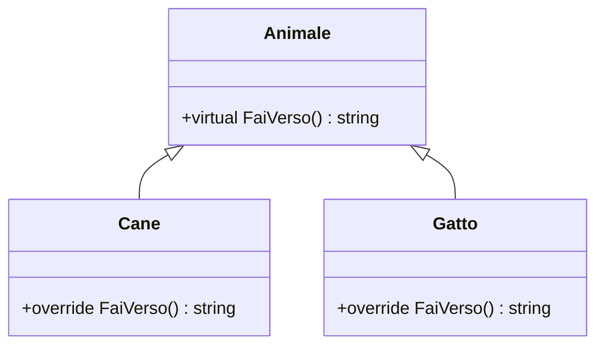
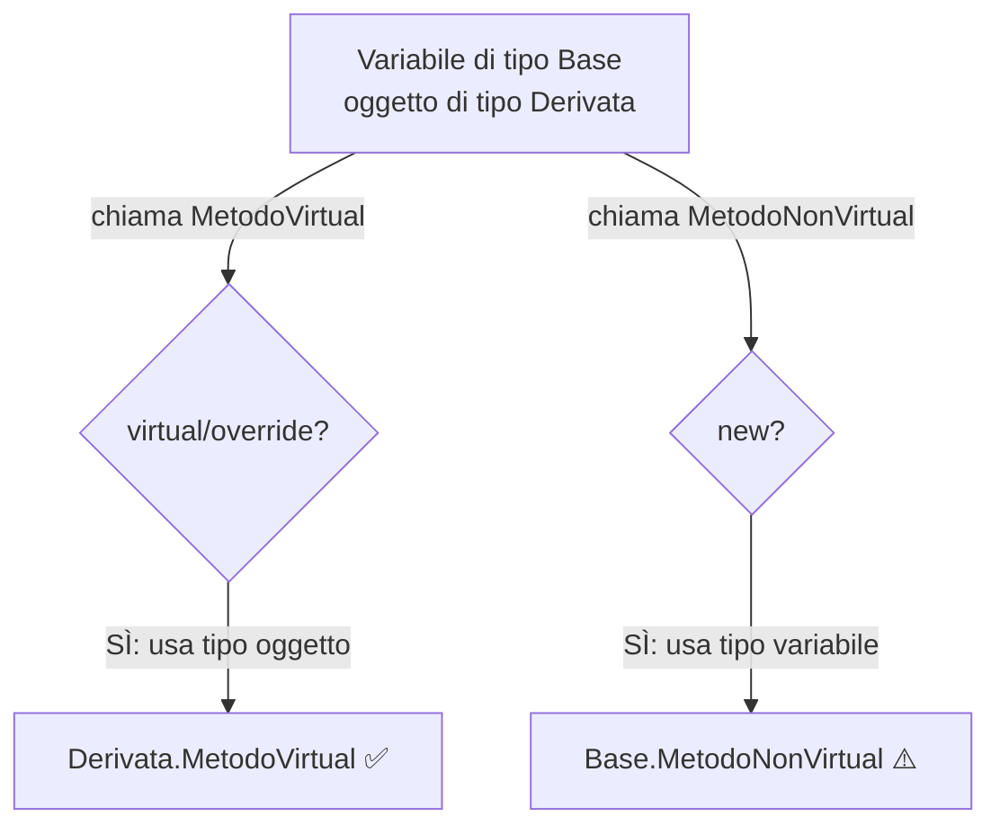

## 1. Introduzione al polimorfismo in C#

Il **polimorfismo** in C# permette a una classe derivata di fornire la propria implementazione di un metodo definito nella classe base. C# distingue due approcci:

- **Method Overriding** (`virtual` / `override`) → il metodo della classe derivata **sostituisce** quello della base a runtime.
- **Method Hiding** (`new`) → il metodo della classe derivata **nasconde** quello della base, ma non lo sostituisce.

La differenza è sottile ma ha conseguenze importanti quando si usa il **polimorfismo**.

## 2. virtual e override — Method Overriding

`virtual` dichiara un metodo **sovrascrivibile** nella classe base. `override` lo **ridefinisce** nella classe derivata.

```cs
public class Animale
{
    public virtual string FaiVerso()
    {
        return "...";
    }
}

public class Cane : Animale
{
    public override string FaiVerso()
    {
        return "Bau!";
    }
}

public class Gatto : Animale
{
    public override string FaiVerso()
    {
        return "Miao!";
    }
}
```

### Polimorfismo a runtime

Con `virtual` / `override`, il metodo giusto viene scelto a **runtime** in base al tipo effettivo dell'oggetto:

```cs
Animale[] animali = { new Cane(), new Gatto(), new Animale() };

foreach (var a in animali)
{
    Console.WriteLine(a.FaiVerso());
}
// Output:
// Bau!
// Miao!
// ...
```



## 3. new — Method Hiding

La keyword `new` **nasconde** il metodo della classe base invece di sovrascriverlo. Il metodo scelto dipende dal **tipo della variabile**, non dal tipo dell'oggetto.

```cs
public class Forma
{
    public string Descrizione()
    {
        return "Sono una forma";
    }
}

public class Cerchio : Forma
{
    // new NASCONDE il metodo della base
    public new string Descrizione()
    {
        return "Sono un cerchio";
    }
}
```

```cs
Cerchio c = new Cerchio();
Console.WriteLine(c.Descrizione()); // "Sono un cerchio" ← tipo variabile: Cerchio

Forma f = new Cerchio();
Console.WriteLine(f.Descrizione()); // "Sono una forma" ← tipo variabile: Forma
// ⚠️ Anche se l'oggetto è un Cerchio, viene usato il metodo di Forma!
```

## 4. Il confronto chiave

Questa è la differenza fondamentale:

```cs
public class Base
{
    public virtual void MetodoVirtual()
        => Console.WriteLine("Base.MetodoVirtual");

    public void MetodoNonVirtual()
        => Console.WriteLine("Base.MetodoNonVirtual");
}

public class Derivata : Base
{
    public override void MetodoVirtual()
        => Console.WriteLine("Derivata.MetodoVirtual");

    public new void MetodoNonVirtual()
        => Console.WriteLine("Derivata.MetodoNonVirtual");
}
```

```cs
Base obj = new Derivata(); // variabile di tipo Base, oggetto di tipo Derivata

obj.MetodoVirtual();    // "Derivata.MetodoVirtual"   ← override: tipo oggetto vince
obj.MetodoNonVirtual(); // "Base.MetodoNonVirtual"    ← new: tipo variabile vince
```



## 5. abstract — Forza l'override

`abstract` è come `virtual` ma **non ha implementazione** nella classe base e **deve** essere implementato nelle classi derivate.

```cs
public abstract class Forma
{
    // Deve essere implementato dalle sottoclassi
    public abstract double Area();

    // Metodo concreto che può essere usato o sovrascritto
    public virtual string Tipo() => "Forma generica";
}

public class Cerchio : Forma
{
    public double Raggio { get; }

    public Cerchio(double raggio) => Raggio = raggio;

    public override double Area() => Math.PI * Raggio * Raggio; // obbligatorio
    public override string Tipo() => "Cerchio"; // opzionale
}

public class Rettangolo : Forma
{
    public double Base { get; }
    public double Altezza { get; }

    public Rettangolo(double b, double h) { Base = b; Altezza = h; }

    public override double Area() => Base * Altezza; // obbligatorio
    // Tipo() non sovrascritto → usa "Forma generica"
}
```

## 6. sealed — Blocca l'override

`sealed` su una classe impedisce l'ereditarietà. `sealed override` su un metodo impedisce ulteriori override nelle classi derivate.

```cs
public class Animale
{
    public virtual string FaiVerso() => "...";
}

public class Cane : Animale
{
    // sealed: nessuna classe derivata da Cane può più sovrascrivere FaiVerso
    public sealed override string FaiVerso() => "Bau!";
}

public class Labrador : Cane
{
    // ❌ ERRORE DI COMPILAZIONE: non può fare override di un metodo sealed
    // public override string FaiVerso() => "WOof!";
}
```

## 7. Chiamare il metodo base con base.

Quando si fa override, si può chiamare l'implementazione della classe base con `base.`:

```cs
public class Veicolo
{
    public virtual string Descrizione()
    {
        return "Veicolo";
    }
}

public class Auto : Veicolo
{
    public override string Descrizione()
    {
        string baseDescrizione = base.Descrizione(); // chiama Veicolo.Descrizione
        return $"{baseDescrizione} - Auto";
    }
}

public class AutoEletrica : Auto
{
    public override string Descrizione()
    {
        string baseDescrizione = base.Descrizione(); // chiama Auto.Descrizione
        return $"{baseDescrizione} - Elettrica";
    }
}

// Output
var auto = new AutoEletrica();
Console.WriteLine(auto.Descrizione()); // "Veicolo - Auto - Elettrica"
```

## 8. Tabella riepilogativa

| | `virtual` + `override` | `new` |
|---|---|---|
| Nome tecnico | Method Overriding | Method Hiding |
| Polimorfismo | ✅ dinamico (runtime) | ❌ statico (compile time) |
| Metodo scelto in base a | Tipo dell'**oggetto** | Tipo della **variabile** |
| Richiede `virtual` nella base | ✅ | ❌ |
| Può essere `sealed` | ✅ | ❌ |
| Raccomandato | ✅ Quasi sempre | ⚠️ Solo casi specifici |

## 9. Quando usare new

La keyword `new` è utile quando:
- Si vuole aggiungere un metodo con lo stesso nome in una gerarchia esistente **senza modificare il comportamento polimorfico**.
- Si lavora con codice legacy dove non si può modificare la classe base.
- Si vuole esplicitamente **rompere la catena del polimorfismo** per un motivo preciso.

```cs
// Caso d'uso reale: adattare un metodo di una libreria esterna
public class MioLogger : BaseLogger
{
    // Nasconde il metodo della libreria con uno più avanzato
    public new void Log(string messaggio)
    {
        // Aggiunge timestamp prima di delegare al metodo base
        base.Log($"[{DateTime.Now:HH:mm:ss}] {messaggio}");
    }
}
```

## 10. Quiz

import Quiz from '../../../components/Quiz.jsx';

<Quiz client:load questions={[
{
question:"Cosa fa la keyword virtual su un metodo?",
answers:{
a:"Rende il metodo privato",
b:"Impedisce l'override",
c:"Permette alle classi derivate di sovrascrivere il metodo",
d:"Rende il metodo astratto"
},
correctAnswer:"c"
},
{
question:"Cosa fa la keyword override su un metodo?",
answers:{
a:"Nasconde il metodo della classe base",
b:"Ridefinisce un metodo virtual della classe base",
c:"Crea un nuovo metodo indipendente",
d:"Rende il metodo non ereditabile"
},
correctAnswer:"b"
},
{
question:"Con virtual/override, il metodo chiamato dipende da:",
answers:{
a:"Il tipo della variabile",
b:"Il tipo dell'oggetto a runtime",
c:"L'ordine di dichiarazione",
d:"Il namespace"
},
correctAnswer:"b"
},
{
question:"Con new (method hiding), il metodo chiamato dipende da:",
answers:{
a:"Il tipo dell'oggetto a runtime",
b:"Il metodo override più vicino",
c:"Il tipo della variabile a compile time",
d:"Il costruttore usato"
},
correctAnswer:"c"
},
{
question:"Dato: Base b = new Derivata(); con 'new' su Derivata, quale metodo viene chiamato?",
answers:{
a:"Quello di Derivata",
b:"Quello di Base",
c:"Dipende dal runtime",
d:"Viene lanciata un'eccezione"
},
correctAnswer:"b"
},
{
question:"Un metodo abstract:",
answers:{
a:"Ha un'implementazione nella classe base",
b:"Non può essere ereditato",
c:"Non ha implementazione e deve essere implementato nelle classi derivate",
d:"È equivalente a sealed"
},
correctAnswer:"c"
},
{
question:"sealed su un metodo override fa:",
answers:{
a:"Rende il metodo privato",
b:"Impedisce ulteriori override nelle classi derivate",
c:"Crea una copia statica del metodo",
d:"Equivale a virtual"
},
correctAnswer:"b"
},
{
question:"Come si chiama l'implementazione del metodo della classe base da una classe derivata?",
answers:{
a:"this.Metodo()",
b:"parent.Metodo()",
c:"base.Metodo()",
d:"super.Metodo()"
},
correctAnswer:"c"
},
{
question:"Una classe abstract può essere istanziata direttamente?",
answers:{
a:"Sì, sempre",
b:"Solo con new()",
c:"No, non può essere istanziata",
d:"Solo se tutti i metodi abstract sono implementati"
},
correctAnswer:"c"
},
{
question:"Quale keyword è raccomandata per il polimorfismo dinamico in C#?",
answers:{
a:"new",
b:"static",
c:"virtual + override",
d:"sealed"
},
correctAnswer:"c"
}
]} />

## 11. Esercizi

### 11.1 Gerarchia veicoli con polimorfismo

**Scenario**: Modella una gerarchia di veicoli che calcolano il costo del carburante in modo diverso.

**Consegna**:
1. Crea una classe base `Veicolo` con metodo `virtual decimal CalcolaCostoCarburante(double km)`.
2. Crea `Auto`, `Camion`, `Moto` che fanno `override` con formule diverse.
3. Crea un array `Veicolo[]` con istanze miste e chiama `CalcolaCostoCarburante` su ognuna.
4. Verifica che venga chiamato il metodo della classe corretta (polimorfismo a runtime).

*Obiettivo: vedere il polimorfismo virtual/override in azione con un array di tipo base.*

### 11.2 Method hiding — trappola del new

**Scenario**: Capire perché `new` può portare a comportamenti inaspettati.

**Consegna**:
1. Crea `Notifica` con metodo `string GetTipo()` che restituisce "Generica".
2. Crea `NotificaEmail : Notifica` con `new string GetTipo()` che restituisce "Email".
3. Crea una lista `List<Notifica>` con oggetti `NotificaEmail`.
4. Chiama `GetTipo()` su ogni elemento e osserva il risultato (dovrebbe sempre essere "Generica").
5. Ripeti l'esperimento usando `override` invece di `new` e confronta.

*Obiettivo: capire la differenza pratica tra method hiding e method overriding.*

### 11.3 Gerarchia con abstract e sealed

**Scenario**: Costruisci un sistema di calcolo area per forme geometriche.

**Consegna**:
1. Crea una classe `abstract Forma` con metodo `abstract double CalcolaArea()` e metodo concreto `virtual string Descrizione()`.
2. Implementa `Cerchio`, `Rettangolo`, `Triangolo` con i rispettivi calcoli.
3. Su `Cerchio`, aggiungi `sealed override` su `Descrizione()`.
4. Verifica che non si possa fare override di `Descrizione()` in una classe che estende `Cerchio`.
5. Usa un array `Forma[]` per calcolare l'area totale di tutte le forme.

*Obiettivo: combinare abstract, virtual, override e sealed in un esempio reale.*
