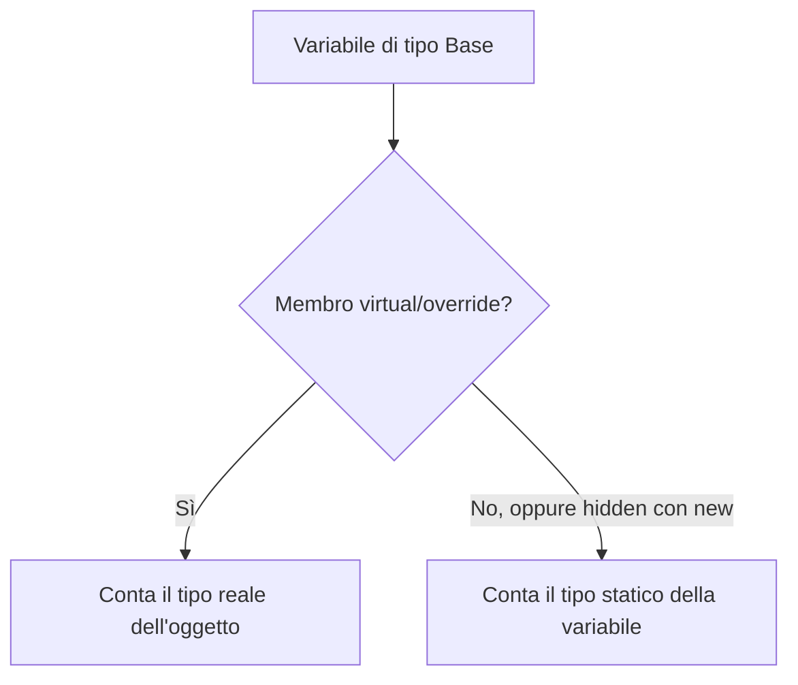
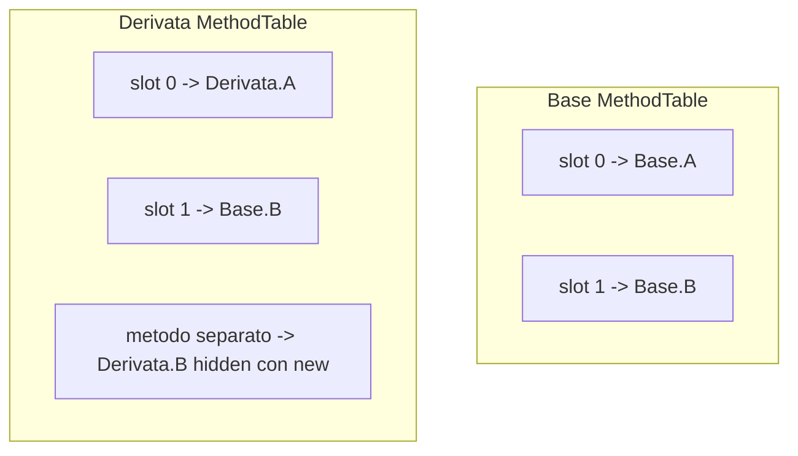

## 1. Introduzione: tipo statico e tipo dinamico

Quando una classe deriva da un'altra e ridichiara un metodo con lo stesso nome, in C# possono succedere due cose molto diverse:

- **Overriding** (`virtual` / `override`): la derivata **sostituisce davvero** il comportamento della base nel modello polimorfico.
- **Hiding** (`new`): la derivata **nasconde** il membro della base, ma resta fuori dalla catena di dispatch virtuale.

Per capire la differenza bisogna distinguere il **tipo statico** della variabile (quello noto al compilatore) dal **tipo dinamico** dell'oggetto (quello reale a runtime). Con `override` vince il tipo dinamico, con `new` vince il tipo statico.

```cs
public class Animale
{
    public virtual string FaiVerso() => "...";
}

public class Cane : Animale
{
    public override string FaiVerso() => "Bau!";
}

public class Lupo : Animale
{
    public new string FaiVerso() => "Auuuu";
}
```

```cs norun
Animale a1 = new Cane();
Animale a2 = new Lupo();
Lupo l = new Lupo();

Console.WriteLine(a1.FaiVerso()); // Bau!
Console.WriteLine(a2.FaiVerso()); // ...
Console.WriteLine(l.FaiVerso());  // Auuuu
```

Nel secondo caso l'oggetto è un `Lupo`, ma la chiamata passa da una variabile `Animale`: il metodo nascosto con `new` non partecipa al polimorfismo della base.


```mermaid
graph TD
    A[Variabile di tipo Base] --> B{Membro virtual/override?}
    B -->|Sì| C[Conta il tipo reale dell'oggetto]
    B -->|No, oppure hidden con new| D[Conta il tipo statico della variabile]
```

## 2. virtual e override — Method Overriding

Un metodo `virtual` definisce un comportamento ereditabile e ridefinibile. Un metodo `override` non crea un metodo indipendente: **riempie lo stesso slot virtuale** della base con un'implementazione più specifica.

```cs
public class Documento
{
    public virtual string Esporta() => "Documento generico";
}

public class Pdf : Documento
{
    public override string Esporta() => "Esportazione PDF";
}

public class Word : Documento
{
    public override string Esporta() => "Esportazione Word";
}
```

```cs norun
Documento[] documenti = { new Pdf(), new Word(), new Documento() };

foreach (var doc in documenti)
    Console.WriteLine(doc.Esporta());

// Esportazione PDF
// Esportazione Word
// Documento generico
```

Il compilatore controlla che `Esporta` esista sul tipo statico `Documento`; il CLR sceglie poi l'implementazione concreta in base al tipo reale di ogni istanza.

<Aside variant="info">
Un `override` deve avere stesso nome, stessi parametri, stesso tipo di ritorno (salvo la covarianza vista più avanti) e la stessa accessibilità del metodo base. Non introduce un nuovo contratto: lo implementa.
</Aside>

Un esempio che userai ogni giorno: `ToString()` è virtuale in `object`, quindi ogni classe può ridefinirlo e `Console.WriteLine` o l'interpolazione di stringhe useranno automaticamente la tua versione.

```cs
public class Prodotto
{
    public string Nome { get; init; } = "";
    public decimal Prezzo { get; init; }

    public override string ToString() => $"{Nome} ({Prezzo:C})";
}

object o = new Prodotto { Nome = "Mouse", Prezzo = 19.90m };
Console.WriteLine(o); // Mouse (19,90 €)
```

### Gerarchie a più livelli e base.

Se una classe intermedia non ridefinisce il metodo, eredita l'implementazione del tipo base più vicino che lo fa:

```cs
public class A { public virtual string Nome() => "A"; }
public class B : A { public override string Nome() => "B"; }
public class C : B { }

A x = new C();
Console.WriteLine(x.Nome()); // B
```

Dentro un override, `base.Metodo()` invoca l'implementazione del **tipo base immediato**, senza dispatch virtuale. È il modo standard per estendere invece di sostituire:

```cs
public class Veicolo
{
    public virtual string Descrizione() => "Veicolo";
}

public class Auto : Veicolo
{
    public override string Descrizione() => base.Descrizione() + " -> Auto";
}

public class Sportiva : Auto
{
    public override string Descrizione() => base.Descrizione() + " -> Sportiva";
}

Veicolo v = new Sportiva();
Console.WriteLine(v.Descrizione()); // Veicolo -> Auto -> Sportiva
```

<Aside variant="warning">
La risoluzione avviene in due fasi: a compile time il compilatore sceglie il membro guardando **solo** il tipo statico; a runtime, se il membro è virtuale, il CLR sceglie l'implementazione in base al tipo dinamico. Se un metodo esiste solo in `Derivata`, `Base b = new Derivata(); b.Metodo();` non compila.
</Aside>

## 3. Come funziona: vtable e slot

Dietro `virtual` / `override` c'è una **tabella dei metodi virtuali** (*vtable*; nel CLR fa parte della *MethodTable* del tipo). In forma semplificata:

- ogni tipo concreto ha **una tabella**;
- ogni metodo virtuale occupa uno **slot**;
- un `override` **riusa lo slot** della base;
- un metodo `new` è un membro distinto e **non sostituisce** lo slot esistente.

```cs
public class Base
{
    public virtual void A() { }
    public virtual void B() { }
}

public class Derivata : Base
{
    public override void A() { }
    public new void B() { }
}
```


```mermaid
graph TD
    subgraph Base MethodTable
        B0[slot 0 -> Base.A]
        B1[slot 1 -> Base.B]
    end

    subgraph Derivata MethodTable
        D0[slot 0 -> Derivata.A]
        D1[slot 1 -> Base.B]
        D2[metodo separato -> Derivata.B hidden con new]
    end
```

Una chiamata a `B` tramite una reference `Base` legge lo slot 1, che in `Derivata` punta ancora a `Base.B`. La gerarchia viene "consolidata" nella tabella al caricamento del tipo, quindi a runtime non si scansiona la catena di ereditarietà: si legge direttamente lo slot.

<Aside variant="info">
In IL esistono `call` (chiamata diretta) e `callvirt` (chiamata tramite l'istanza). Il compilatore C# emette `callvirt` anche per metodi non virtuali, per ottenere gratis il controllo su `null`: il vero dispatch dinamico avviene solo se il metodo è virtuale nei metadata.
</Aside>

## 4. new — Method Hiding

`new` dichiara esplicitamente che stai **nascondendo** un membro ereditato: crei un nuovo punto di accesso con lo stesso nome, non un override.

```cs
public class Forma
{
    public string Descrizione() => "Sono una forma";
}

public class Cerchio : Forma
{
    public new string Descrizione() => "Sono un cerchio";
}

Cerchio c = new Cerchio();
Forma f = c;

Console.WriteLine(c.Descrizione()); // Sono un cerchio
Console.WriteLine(f.Descrizione()); // Sono una forma
```

<Aside variant="warning">
Se ridichiari un membro con la stessa firma **senza** scrivere `new`, ottieni il warning CS0108 ("il membro nasconde un membro ereditato"). Spesso significa che volevi un `override` e hai dimenticato `virtual` nella base: non zittire il warning con `new` senza averci pensato.
</Aside>

Si può nascondere anche un metodo **virtuale**, ed è il caso più insidioso: il metodo della derivata sembra sostituire quello base, ma vive fuori dalla catena di override.

```cs
public class Base
{
    public virtual void Stampa() => Console.WriteLine("Base");
}

public class Derivata : Base
{
    public new void Stampa() => Console.WriteLine("Derivata");
}

Base b = new Derivata();
Derivata d = new Derivata();

b.Stampa(); // Base
d.Stampa(); // Derivata
```

Il bug tipico emerge con le collezioni, dove gli elementi sono quasi sempre visti tramite il tipo base:

```cs norun
var lista = new List<Base> { new Derivata(), new Derivata() };

foreach (var item in lista)
    item.Stampa(); // Base, Base  (non "Derivata"!)
```

### Interfacce e re-implementazione

Se la classe derivata **ripete** l'interfaccia nella propria lista di base, ne re-mappa i membri ai propri metodi, anche se questi usano `new`:

```cs
public interface IFormatter
{
    string Format();
}

public class BaseFormatter : IFormatter
{
    public string Format() => "Base";
}

public class JsonFormatter : BaseFormatter, IFormatter
{
    public new string Format() => "Json";
}
```

```cs norun
JsonFormatter jf = new JsonFormatter();
BaseFormatter bf = jf;
IFormatter f = jf;

Console.WriteLine(jf.Format()); // Json
Console.WriteLine(bf.Format()); // Base
Console.WriteLine(f.Format());  // Json
```

Senza `, IFormatter` nella dichiarazione di `JsonFormatter`, anche l'ultima riga stamperebbe `Base`, perché la mappatura dell'interfaccia verrebbe ereditata dalla base.

<Aside variant="tip">
Usa `new` solo con un motivo preciso: compatibilità con una libreria che non puoi modificare, re-implementazione di un'interfaccia o un'API volutamente non polimorfica. Se vuoi un comportamento sostituibile, la risposta è quasi sempre `virtual` + `override`.
</Aside>

## 5. abstract, sealed e covarianza del tipo di ritorno

### abstract

Un metodo `abstract` occupa uno slot virtuale ma non ha corpo: le classi concrete derivate **devono** implementarlo, e la classe astratta non può essere istanziata.

```cs
public abstract class Forma
{
    public abstract double Area();
    public virtual string Tipo() => "Forma generica";
}

public class Rettangolo : Forma
{
    public double Base { get; }
    public double Altezza { get; }

    public Rettangolo(double @base, double altezza) => (Base, Altezza) = (@base, altezza);

    public override double Area() => Base * Altezza;
}

// var f = new Forma();          // errore CS0144: classe astratta
Forma r = new Rettangolo(3, 4);
Console.WriteLine(r.Area());     // 12
```

### sealed override

`sealed override` mantiene lo stesso slot ma impedisce ulteriori ridefinizioni nelle classi successive:

```cs norun
public class Cane : Animale
{
    public sealed override string FaiVerso() => "Bau!";
}

public class Labrador : Cane
{
    // public override string FaiVerso() => "Woof"; // errore CS0239: membro sealed
}
```

### Covariant return types (C# 9+)

Da C# 9 un `override` può restituire un tipo **più derivato** di quello del metodo base:

```cs
public class Documento
{
    public virtual Stream ApriStream() => Stream.Null;
}

public class DocumentoInMemoria : Documento
{
    public override MemoryStream ApriStream() => new MemoryStream();
}

DocumentoInMemoria d = new DocumentoInMemoria();
MemoryStream ms = d.ApriStream(); // nessun cast necessario
```

Chi vede un `Documento` riceve comunque uno `Stream`; chi conosce il tipo concreto ottiene direttamente il `MemoryStream`.

### Template Method Pattern

Un pattern classico che combina `abstract` e `virtual`: la base definisce lo scheletro dell'algoritmo (non virtuale), le derivate personalizzano solo alcuni passi.

```cs
public abstract class ReportGenerator
{
    public string Genera() => $"{CreaHeader()}\n{CreaBody()}\n{CreaFooter()}";

    protected virtual string CreaHeader() => "Header standard";
    protected abstract string CreaBody();
    protected virtual string CreaFooter() => "Footer standard";
}

public class SalesReportGenerator : ReportGenerator
{
    protected override string CreaHeader() => "Header vendite";
    protected override string CreaBody() => "Corpo report vendite";
}

Console.WriteLine(new SalesReportGenerator().Genera());
// Header vendite
// Corpo report vendite
// Footer standard
```

## 6. Costruttori, classi astratte e interfacce

### Ordine dei costruttori e chiamate virtuali

Il corpo del costruttore della base viene eseguito **prima** di quello della derivata. Ma il tipo dinamico dell'oggetto è già quello della derivata: se la base chiama un metodo virtuale nel costruttore, viene eseguito l'override su un oggetto non ancora inizializzato.

```cs
public class Base
{
    public Base()
    {
        Console.WriteLine("Costruttore Base");
        Inizializza();
    }

    protected virtual void Inizializza() { }
}

public class Derivata : Base
{
    private string nome;

    public Derivata()
    {
        Console.WriteLine("Costruttore Derivata");
        nome = "Pronto";
    }

    protected override void Inizializza() => Console.WriteLine(nome.Length);
}

new Derivata();
// Costruttore Base
// NullReferenceException: nome non è ancora stato assegnato
```

<Aside variant="danger">
Non chiamare metodi virtuali da costruttori (né da finalizer): l'override gira prima che il costruttore della derivata abbia impostato campi e invarianti. Il risultato sono `NullReferenceException` o, peggio, stati incoerenti silenziosi.
</Aside>

<Aside variant="info">
Gli inizializzatori di campo (`private string nome = "Pronto";`) vengono eseguiti **prima** della chiamata al costruttore base: per questo il bug si manifesta tipicamente con i campi assegnati nel corpo del costruttore o tramite dependency injection.
</Aside>

### Classe astratta o interfaccia?

| | Classe `abstract` | Interfaccia |
|---|---|---|
| Stato (campi di istanza) | Sì | No |
| Implementazione condivisa | Sì, anche complessa | Solo default methods (C# 8+) |
| Ereditarietà multipla | No | Sì |
| Uso tipico | Stessa famiglia, algoritmo base, Template Method | Capacità o ruolo trasversale |

Da C# 8 un'interfaccia può avere implementazioni di default, utili per piccoli comportamenti comuni:

```cs
public interface ILogger
{
    void Log(string message);

    void LogWarning(string message) => Log("[WARN] " + message);
}
```

Questo non trasforma le interfacce in classi astratte: restano senza stato di istanza e il loro dispatch è distinto da quello dei metodi virtuali di classe.

## 7. Prestazioni e Principio di Sostituzione di Liskov

Una chiamata virtuale richiede un'indirezione in più (leggere il tipo dell'oggetto, poi lo slot) e rende più difficile l'inlining. Nella pratica però il costo è trascurabile rispetto ad allocazioni, I/O, rete o database, e il JIT moderno spesso **devirtualizza** la chiamata quando conosce il tipo concreto.

<Aside variant="tip">
Non evitare `virtual` per paura delle prestazioni: prima progetta correttamente, poi misura. Se una classe non è pensata per essere estesa, marcala `sealed`: comunichi l'intenzione e aiuti il JIT a devirtualizzare.
</Aside>

Più importante delle prestazioni è il **Liskov Substitution Principle**: un oggetto derivato deve poter sostituire la base senza rompere la correttezza del programma. Un override non dovrebbe richiedere precondizioni più forti, garantire meno della base o violarne gli invarianti.

```cs
public class FileRepository
{
    public virtual void Save(string value)
    {
        if (string.IsNullOrWhiteSpace(value))
            throw new ArgumentException("Valore non valido", nameof(value));
        // ... salva su file
    }
}

public class ReadOnlyRepository : FileRepository
{
    public override void Save(string value) => throw new NotSupportedException();
}
```

Chi riceve un `FileRepository` si aspetta che `Save` salvi dati validi: `ReadOnlyRepository` rompe il contratto. Meglio separare le capacità (ad esempio `IReadRepository` e `IWriteRepository`) invece di forzare un'ereditarietà sbagliata. `virtual` non è solo sintassi: è un impegno di design.

## 8. Riepilogo

| Tema | `virtual` / `override` | `new` |
|---|---|---|
| Catena polimorfica | Sì | No |
| Risoluzione | Tipo dinamico dell'oggetto | Tipo statico della variabile |
| Slot vtable | Riutilizzato | Non sostituito |
| Compatibilità con LSP | Attesa e raccomandata | Spesso problematica |
| Uso tipico | Estensibilità corretta | Compatibilità o occultamento intenzionale |

Regole pratiche: per il polimorfismo usa `virtual` / `override` (e `sealed override` per chiudere la catena); usa `new` solo con un motivo documentabile; non chiamare metodi virtuali dai costruttori; verifica che ogni override rispetti il contratto della base.

## 9. Quiz

import Quiz from '../../../components/Quiz.jsx';

<Quiz client:load questions={[
{
question:"Cosa fa la keyword virtual su un metodo?",
answers:{
a:"Rende il metodo privato",
b:"Impedisce l'override",
c:"Permette alle classi derivate di sovrascrivere il metodo",
d:"Rende il metodo astratto"
},
correctAnswer:"c"
},
{
question:"Cosa fa la keyword override su un metodo?",
answers:{
a:"Nasconde il metodo della classe base",
b:"Ridefinisce un metodo virtual della classe base",
c:"Crea un nuovo metodo indipendente",
d:"Rende il metodo non ereditabile"
},
correctAnswer:"b"
},
{
question:"Con virtual/override, il metodo chiamato dipende da:",
answers:{
a:"Il tipo della variabile",
b:"Il tipo dell'oggetto a runtime",
c:"L'ordine di dichiarazione",
d:"Il namespace"
},
correctAnswer:"b"
},
{
question:"Con new (method hiding), il metodo chiamato dipende da:",
answers:{
a:"Il tipo dell'oggetto a runtime",
b:"Il metodo override più vicino",
c:"Il tipo della variabile a compile time",
d:"Il costruttore usato"
},
correctAnswer:"c"
},
{
question:"Dato: Base b = new Derivata(); con 'new' su Derivata, quale metodo viene chiamato?",
answers:{
a:"Quello di Derivata",
b:"Quello di Base",
c:"Dipende dal runtime",
d:"Viene lanciata un'eccezione"
},
correctAnswer:"b"
},
{
question:"Un metodo abstract:",
answers:{
a:"Ha un'implementazione nella classe base",
b:"Non può essere ereditato",
c:"Non ha implementazione e deve essere implementato nelle classi derivate",
d:"È equivalente a sealed"
},
correctAnswer:"c"
},
{
question:"sealed su un metodo override fa:",
answers:{
a:"Rende il metodo privato",
b:"Impedisce ulteriori override nelle classi derivate",
c:"Crea una copia statica del metodo",
d:"Equivale a virtual"
},
correctAnswer:"b"
},
{
question:"Come si chiama l'implementazione del metodo della classe base da una classe derivata?",
answers:{
a:"this.Metodo()",
b:"parent.Metodo()",
c:"base.Metodo()",
d:"super.Metodo()"
},
correctAnswer:"c"
},
{
question:"Perché è pericoloso chiamare un metodo virtuale dal costruttore della classe base?",
answers:{
a:"Perché il compilatore non lo permette",
b:"Perché viene sempre eseguita la versione della base",
c:"Perché viene eseguito l'override della derivata prima che il suo costruttore abbia inizializzato i campi",
d:"Perché i metodi virtuali non possono essere protected"
},
correctAnswer:"c"
},
{
question:"Quale keyword è raccomandata per il polimorfismo dinamico in C#?",
answers:{
a:"new",
b:"static",
c:"virtual + override",
d:"sealed"
},
correctAnswer:"c"
}
]} />

## 10. Esercizi

### 10.1 Gerarchia veicoli con polimorfismo

**Scenario**: Modella una gerarchia di veicoli che calcolano il costo del carburante in modo diverso.

**Consegna**:
1. Crea una classe base `Veicolo` con metodo `virtual decimal CalcolaCostoCarburante(double km)`.
2. Crea `Auto`, `Camion`, `Moto` che fanno `override` con formule diverse.
3. Crea un array `Veicolo[]` con istanze miste e chiama `CalcolaCostoCarburante` su ognuna.
4. Verifica che venga chiamato il metodo della classe corretta (polimorfismo a runtime).

*Obiettivo: vedere il polimorfismo virtual/override in azione con un array di tipo base.*

### 10.2 Method hiding — trappola del new

**Scenario**: Capire perché `new` può portare a comportamenti inaspettati.

**Consegna**:
1. Crea `Notifica` con metodo `string GetTipo()` che restituisce "Generica".
2. Crea `NotificaEmail : Notifica` con `new string GetTipo()` che restituisce "Email".
3. Crea una lista `List<Notifica>` con oggetti `NotificaEmail`.
4. Chiama `GetTipo()` su ogni elemento e osserva il risultato (dovrebbe sempre essere "Generica").
5. Ripeti l'esperimento usando `override` invece di `new` e confronta.

*Obiettivo: capire la differenza pratica tra method hiding e method overriding.*

### 10.3 Gerarchia con abstract e sealed

**Scenario**: Costruisci un sistema di calcolo area per forme geometriche.

**Consegna**:
1. Crea una classe `abstract Forma` con metodo `abstract double CalcolaArea()` e metodo concreto `virtual string Descrizione()`.
2. Implementa `Cerchio`, `Rettangolo`, `Triangolo` con i rispettivi calcoli.
3. Su `Cerchio`, aggiungi `sealed override` su `Descrizione()`.
4. Verifica che non si possa fare override di `Descrizione()` in una classe che estende `Cerchio`.
5. Usa un array `Forma[]` per calcolare l'area totale di tutte le forme.

*Obiettivo: combinare abstract, virtual, override e sealed in un esempio reale.*

### 10.4 Template Method per l'esportazione

**Scenario**: Implementa un esportatore di dati che segue sempre lo stesso flusso.

**Consegna**:
1. Crea una classe `abstract Esportatore` con un metodo non virtuale `string Esporta(IEnumerable<string> righe)` che chiama in ordine `Intestazione()`, `FormattaRiga(string)` per ogni riga e `Chiusura()`.
2. Rendi `FormattaRiga` `abstract` e gli altri due `virtual` con un'implementazione vuota di default.
3. Implementa `EsportatoreCsv` e `EsportatoreHtml` (quest'ultimo ridefinisce anche intestazione e chiusura con i tag `table`).
4. Verifica che `Esporta` produca output diversi senza essere mai ridefinito.

*Obiettivo: applicare il Template Method Pattern combinando abstract e virtual.*
