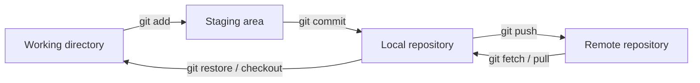
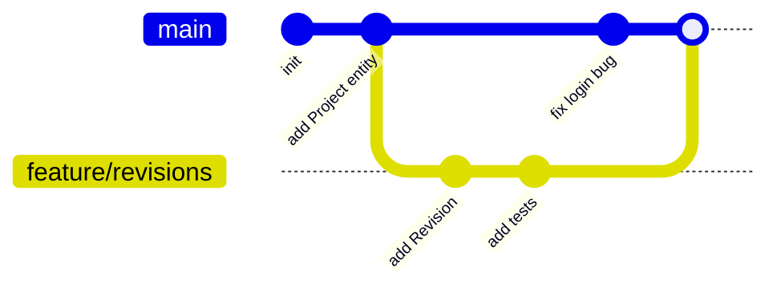

## 1. Introduction

**Version control** is a system that records every change to your code over time. You can see who changed what, when, and why. You can go back to an old version, and many developers can work on the same codebase in parallel.

**Git** is the most used version control system today. It is **distributed**: every developer has a full copy of the repository, with the complete history, on their own machine. Platforms like GitHub, GitLab and Azure DevOps host a shared **remote** copy and add features like pull requests and CI pipelines.

In a team that builds a product like an engineering data management tool, Git is the backbone of collaboration: every feature, bug fix and release goes through it.

## 2. The core model

Git has three local areas, plus the remote:

- **Working directory**: the files you see and edit.
- **Staging area** (or **index**): the changes you have selected for the next commit.
- **Repository**: the history of **commits**, stored in the `.git` folder.



A **commit** is a snapshot of the whole project at a point in time. It has a unique **hash** (SHA), an author, a message and a pointer to its parent commit(s). Commits form a chain: the history.

**HEAD** is a pointer to "where you are now", normally the latest commit of the current branch.

```bash
git init                      # create a new repository
git clone https://github.com/acme/projects-api.git
git status                    # what changed? what is staged?
git add src/DocumentService.cs
git commit -m "Add revision check to DocumentService"
git log --oneline --graph     # compact history
git diff                      # unstaged changes
git diff --staged             # staged changes
```

<Aside variant="tip">
The staging area lets you build a clean commit even if you changed many things. Use `git add -p` to stage only some parts of a file: one commit for the bug fix, another for the refactoring.
</Aside>

## 3. Branching

A **branch** is just a lightweight, movable pointer to a commit. Creating a branch is instant and cheap, so teams create one for every feature or bug fix.

```bash
git switch -c feature/document-revisions   # create and move to a new branch
git branch                                  # list local branches
git switch main                             # go back to main
git branch -d feature/document-revisions    # delete a merged branch
```



### 3.1 Working with the remote

```bash
git remote -v                         # show remotes (usually "origin")
git fetch origin                      # download new commits, do not touch your files
git pull                              # fetch + merge (or rebase) into current branch
git push -u origin feature/document-revisions   # publish your branch
```

<Aside variant="info">
`git fetch` is always safe: it only updates your view of the remote. `git pull` also integrates the changes into your branch, so it can create conflicts.
</Aside>

## 4. Merge vs rebase

Both commands bring changes from one branch into another, but in different ways.

**Merge** creates a new **merge commit** that joins the two histories. The history is true and complete, but it can look busy.

```bash
git switch main
git merge feature/document-revisions
```

**Rebase** moves your commits and replays them on top of another branch. The result is a **linear history**, as if you started your work from the latest `main`.

```bash
git switch feature/document-revisions
git rebase main
# solve conflicts if any, then:
git rebase --continue
```

| | Merge | Rebase |
|---|---|---|
| History | Keeps real history, adds merge commits | Linear, cleaner |
| Commit hashes | Unchanged | Rewritten (new hashes) |
| Safe on shared branches | Yes | No |
| Typical use | Integrating a finished feature | Updating your local feature branch |

<Aside variant="danger">
The golden rule of rebase: never rebase commits that other people already pulled. Rebase rewrites history, and your teammates will end up with duplicated or conflicting commits. If you must push a rebased branch, use `git push --force-with-lease`, not `--force`.
</Aside>

**Squash merge** is a third option, common on GitHub and Azure DevOps: all commits of the pull request become a single commit on `main`.

## 5. Resolving conflicts

A **merge conflict** happens when two branches change the same lines of the same file. Git cannot decide which version is correct, so it asks you.

```text
<<<<<<< HEAD
    public string Status { get; set; } = "Draft";
=======
    public RevisionStatus Status { get; set; } = RevisionStatus.Draft;
>>>>>>> feature/document-revisions
```

Steps to resolve:

1. Run `git status` to see the conflicted files.
2. Open each file and choose the right code (often a mix of both). Remove the markers.
3. Build and run the tests.
4. `git add` the fixed files, then `git commit` (merge) or `git rebase --continue` (rebase).
5. If it goes wrong, abort: `git merge --abort` or `git rebase --abort`.

<Aside variant="tip">
Small, short-lived branches mean fewer conflicts. Pull or rebase from `main` often, and talk with teammates when you both need to touch the same file.
</Aside>

## 6. Branching workflows

### 6.1 Feature-branch workflow

The most common workflow: `main` is always deployable. Every change starts in a new branch, is pushed, reviewed in a pull request, and merged into `main`.

### 6.2 GitFlow

**GitFlow** uses several long-lived branches: `main` (production releases), `develop` (integration), plus `feature/*`, `release/*` and `hotfix/*` branches. It fits products with planned, versioned releases, but it is heavy and creates long-lived branches that drift apart.

### 6.3 Trunk-based development

In **trunk-based development** everyone integrates into `main` (the "trunk") at least once a day. Branches live hours, not weeks. Unfinished features are hidden behind **feature flags**. It works best with strong automated tests and CI, and it is the approach recommended by most DevOps literature (see [CI/CD and DevOps](/informatica/dev-practices/3_ci-cd-devops)).

| | GitFlow | Trunk-based |
|---|---|---|
| Long-lived branches | `main`, `develop` | Only `main` |
| Branch lifetime | Days to weeks | Hours to 1-2 days |
| Release style | Scheduled releases | Continuous delivery |
| Merge conflicts | More frequent, bigger | Rare, small |

## 7. Pull requests and code review

A **pull request (PR)** (called **merge request** in GitLab) asks to merge your branch into another one. It is the place for **code review**: teammates read the diff, leave comments and approve. CI runs build and tests automatically on the PR.

A good PR:

- Is **small** and does one thing (ideally under 400 changed lines).
- Has a clear title and a description: what, why, how to test, link to the work item.
- Passes the build and tests before you ask for review.

As a reviewer, focus on correctness, readability, tests and design. Be kind and specific: "This query runs inside the loop, could we load all tags once?" is better than "This is slow".

<Aside variant="tip">
Interview tip: when asked "how do you work with Git in a team?", describe the full flow in one breath: "I create a feature branch from main, commit small logical changes, push and open a pull request, CI runs the tests, a colleague reviews it, and after approval we squash-merge into main."
</Aside>

## 8. Good commit messages

A commit message explains **why** a change was made. The code already shows what changed.

```text
Add optimistic concurrency to Document updates

Two users editing the same document could overwrite each other.
Add a RowVersion column and return 409 Conflict when the version
does not match.

Refs: #482
```

Common conventions:

- Short **subject line** (about 50 characters), imperative mood: "Add", "Fix", "Remove", not "Added" or "Fixes".
- Blank line, then a body with the reason and context.
- **Conventional Commits** is a popular format: `feat: add revision history endpoint`, `fix: handle null tag number`.
- One logical change per commit. Avoid "WIP" or "fix stuff" on shared branches.

## 9. Undoing changes

| Situation | Command |
|---|---|
| Discard local changes in a file | `git restore src/Tag.cs` |
| Unstage a file (keep changes) | `git restore --staged src/Tag.cs` |
| Fix the last commit (not pushed) | `git commit --amend` |
| Undo local commits, keep changes | `git reset --soft HEAD~1` |
| Undo local commits and changes | `git reset --hard HEAD~1` |
| Undo a pushed commit safely | `git revert a1b2c3d` |
| Save work temporarily | `git stash` / `git stash pop` |

The key difference:

- `git reset` moves the branch pointer back: it **rewrites history**. Use it only on local commits.
- `git revert` creates a **new commit** that applies the opposite change. History is preserved, so it is safe on shared branches.

<Aside variant="warning">
`git reset --hard` deletes uncommitted work with no confirmation. If you lose a commit, `git reflog` shows every position HEAD has been in, and you can usually recover it with `git reset --hard <hash>`.
</Aside>

## 10. .gitignore and tags

### 10.1 .gitignore

The `.gitignore` file lists files Git must not track: build output, IDE files, secrets. For .NET you can generate one with `dotnet new gitignore`.

```text
# .NET build output
bin/
obj/
# IDE
.vs/
*.user
# Secrets and local config
appsettings.Development.local.json
.env
```

Never commit passwords or connection strings. If a secret was committed, consider it leaked: rotate it, even after deleting the file, because it stays in the history.

### 10.2 Tags

A **tag** marks a specific commit, usually a release. **Annotated tags** store author, date and message, and are recommended for releases.

```bash
git tag -a v2.3.0 -m "Release 2.3.0: revision history"
git push origin v2.3.0
git tag                     # list tags
```

Tags often follow **Semantic Versioning** (`MAJOR.MINOR.PATCH`) and can trigger a release pipeline.

## 11. Interview questions

**Q: What is the difference between `git fetch` and `git pull`?**
`git fetch` downloads new commits from the remote but does not change my working branch, so it is always safe. `git pull` is a fetch followed by a merge, or a rebase if configured. I often fetch first to see what changed before integrating.

**Q: When do you use merge and when rebase?**
I use rebase to update my own feature branch with the latest main, because it keeps a clean linear history. I use merge, or squash merge through a pull request, to integrate a finished feature into main. I never rebase a branch that other people are working on, because rebase rewrites commit hashes.

**Q: How do you undo a commit that is already pushed?**
I use `git revert` with the commit hash. It creates a new commit that reverses the change, so the shared history is not rewritten and my teammates are not affected. `git reset` is only for local commits that nobody else has.

**Q: How do you resolve a merge conflict?**
I check `git status` to find the conflicted files, open them and decide the correct code, often combining both sides. Then I remove the conflict markers, build and run the tests, stage the files and complete the merge. If the conflict touches code I do not know well, I ask the author of the other change.

**Q: What branching strategy have you used, and what do you prefer?**
I have used a feature-branch workflow with pull requests into main. I like short-lived branches and trunk-based development, because small and frequent merges mean fewer conflicts and faster feedback from CI. GitFlow can make sense for products with scheduled, versioned releases.

**Q: What makes a good pull request?**
It is small and focused on one change, with a clear description of what and why, and a link to the ticket. It already passes the build and tests. Small PRs are reviewed faster and more carefully.

## 12. Quiz

import Quiz from '../../../components/Quiz.jsx';

<Quiz client:load questions={[
{
question:"Which command moves changes from the working directory to the staging area?",
answers:{ a:"`git commit`", b:"`git push`", c:"`git add`", d:"`git fetch`" },
correctAnswer:"c"
},
{
question:"What is a branch in Git?",
answers:{ a:"A full copy of all project files", b:"A lightweight movable pointer to a commit", c:"A separate remote repository", d:"A compressed backup of the history" },
correctAnswer:"b"
},
{
question:"Why should you not rebase a branch that teammates have already pulled?",
answers:{ a:"Rebase rewrites commit hashes, so their history no longer matches", b:"Rebase deletes the remote branch", c:"Rebase is slower than merge", d:"Rebase cannot resolve conflicts" },
correctAnswer:"a"
},
{
question:"You pushed a commit with a bug to main. What is the safest way to undo it?",
answers:{ a:"`git reset --hard HEAD~1` and force push", b:"Delete the main branch", c:"`git commit --amend`", d:"`git revert` with the commit hash" },
correctAnswer:"d"
},
{
question:"What does `git fetch` do?",
answers:{ a:"Downloads remote commits and merges them into your branch", b:"Downloads remote commits without changing your working branch", c:"Uploads your commits to the remote", d:"Deletes local branches that no longer exist remotely" },
correctAnswer:"b"
},
{
question:"Which statement best describes trunk-based development?",
answers:{ a:"Each release has its own long-lived branch", b:"Developers never use branches", c:"Everyone integrates small changes into main frequently, often hiding unfinished work behind feature flags", d:"Only the team lead can merge into main" },
correctAnswer:"c"
},
{
question:"Which is the best commit subject line?",
answers:{ a:"Fix null tag number in Equipment import", b:"fixed stuff", c:"WIP", d:"Changes to EquipmentImporter.cs, TagParser.cs and tests" },
correctAnswer:"a"
},
{
question:"You lost a commit after running `git reset --hard`. Which command helps you find it?",
answers:{ a:"`git log --all`", b:"`git stash list`", c:"`git status`", d:"`git reflog`" },
correctAnswer:"d"
}
]} />

## 13. Exercises

### 13.1 Feature branch and pull request

**Goal**: practice the full team workflow on your own repository.

1. Create a new repository with a small .NET console app and a `.gitignore` (`dotnet new gitignore`).
2. Create a branch `feature/tag-validation` and add a `Tag` class with a method that validates a tag number like `P-101`.
3. Make at least two small commits with good messages.
4. Push the branch to GitHub and open a pull request. Write a description with what, why and how to test.
5. Merge it with a squash merge and delete the branch.

*Hint: use `git log --oneline --graph --all` before and after the merge to see how the history changes.*

### 13.2 Create and resolve a conflict

**Goal**: get comfortable with conflict markers.

1. On `main`, create `Document.cs` with a property `public string Status { get; set; }`.
2. Create branch `a` and change the property type to an enum. Commit.
3. Go back to `main`, create branch `b` and rename the property to `State`. Commit.
4. Merge `a` into `main`, then merge `b` into `main` and resolve the conflict.
5. Repeat the scenario using `git rebase main` on branch `b` instead of merge, and compare the history.

*Hint: `git merge --abort` and `git rebase --abort` bring you back to the state before the operation.*

### 13.3 Undo like a pro

**Goal**: understand the difference between `restore`, `reset` and `revert`.

1. Edit a file and discard the change with `git restore`.
2. Make a commit, then undo it with `git reset --soft HEAD~1`: check that the changes are still staged.
3. Make a commit, push it, then undo it with `git revert`. Look at the new commit in the log.
4. Run `git reset --hard HEAD~2`, then recover the lost commit using `git reflog`.

*Hint: write down the hash of each commit before you start, so you can verify the recovery.*
