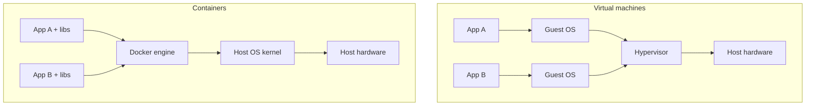

## 1. Introduction

"It works on my machine" is one of the oldest problems in software. Your API runs on your laptop, but on the test server a different .NET runtime, a missing library or a different PostgreSQL version breaks it.

**Docker** solves this by packaging an application together with everything it needs (runtime, libraries, configuration) into a standard unit called a **container**. The same container runs the same way on a developer laptop, in the CI pipeline and in production.

For a .NET developer, Docker is useful in three ways:

- Run dependencies locally (PostgreSQL, Redis, RabbitMQ) without installing them.
- Ship your ASP.NET Core API as an image that any server or cloud can run.
- Create repeatable environments for tests and CI.

## 2. Image vs container

- An **image** is a read-only template: a file system plus metadata (which command to run, which port to expose). Think of it as a **class**.
- A **container** is a running instance of an image, with its own process and a thin writable layer on top. Think of it as an **object**.
- A **registry** stores and shares images: Docker Hub, GitHub Container Registry, Azure Container Registry.

```bash
docker pull postgres:16          # download an image from Docker Hub
docker run -d --name pg postgres:16   # create and start a container from it
docker ps                        # list running containers
```

You can start many containers from the same image, and each one is isolated from the others.

<Aside variant="info">
Image names have the form `registry/repository:tag`, for example `mcr.microsoft.com/dotnet/aspnet:8.0`. If you omit the tag, Docker uses `latest`, which can change at any time. Always pin a specific tag in real projects.
</Aside>

## 3. Docker vs virtual machine

A **virtual machine (VM)** emulates a full computer and runs a complete guest operating system on top of a **hypervisor**. A container shares the **host kernel** and only isolates processes, files and network.



| | Container | Virtual machine |
|---|---|---|
| Start time | Seconds or less | Minutes |
| Size | Megabytes | Gigabytes |
| Isolation | Process level (shared kernel) | Full OS level (stronger) |
| Density | Many per host | Fewer per host |
| Typical use | Microservices, CI, dev environments | Different OS, strong isolation |

<Aside variant="tip">
On Windows and macOS, Docker Desktop runs Linux containers inside a small Linux VM (WSL 2 on Windows). This is why containers and VMs are often used together, not as enemies.
</Aside>

## 4. Writing a Dockerfile for ASP.NET Core

A **Dockerfile** is a text file with the instructions to build an image. For .NET, the best practice is a **multi-stage build**: one stage with the full SDK to compile, and a final stage with only the small runtime.

```dockerfile
# Stage 1: build
FROM mcr.microsoft.com/dotnet/sdk:8.0 AS build
WORKDIR /src
COPY ["Projects.Api/Projects.Api.csproj", "Projects.Api/"]
RUN dotnet restore "Projects.Api/Projects.Api.csproj"
COPY . .
RUN dotnet publish "Projects.Api/Projects.Api.csproj" -c Release -o /app/publish /p:UseAppHost=false

# Stage 2: runtime
FROM mcr.microsoft.com/dotnet/aspnet:8.0 AS final
WORKDIR /app
COPY --from=build /app/publish .
USER app
EXPOSE 8080
ENTRYPOINT ["dotnet", "Projects.Api.dll"]
```

Main instructions:

- `FROM`: the base image. `AS build` gives the stage a name.
- `WORKDIR`: the current folder inside the image.
- `COPY`: copy files from the **build context** (your folder) into the image.
- `RUN`: execute a command at build time.
- `EXPOSE`: documents which port the app listens on.
- `ENTRYPOINT`: the command that runs when the container starts.

The SDK image is about 800 MB, the `aspnet` runtime image about 220 MB. The final image contains only the runtime and your published DLLs: no source code, no compiler.

<Aside variant="info">
Since .NET 8, ASP.NET Core images listen on port **8080** by default (not 80), and they include a non-root user called `app`. Running as non-root with `USER app` is a good security practice.
</Aside>

### 4.1 .dockerignore

A `.dockerignore` file excludes files from the build context. It makes builds faster and avoids copying local build output or secrets into the image.

```text
**/bin/
**/obj/
**/.vs/
.git
*.user
.env
```

## 5. Layers and build cache

Each instruction in a Dockerfile creates a **layer**. Docker caches layers: if an instruction and its inputs did not change, Docker reuses the cached layer instead of running it again. When one layer changes, all the layers **after** it are rebuilt.

This is why the Dockerfile above copies the `.csproj` first and runs `dotnet restore` before copying the rest of the code:

```dockerfile
COPY ["Projects.Api/Projects.Api.csproj", "Projects.Api/"]
RUN dotnet restore "Projects.Api/Projects.Api.csproj"   # cached until .csproj changes
COPY . .                                                # changes on every code edit
RUN dotnet publish ...
```

You edit C# code many times a day, but you change NuGet packages rarely. With this order, the slow restore step is cached and the rebuild takes seconds.

<Aside variant="warning">
If you write `COPY . .` before `dotnet restore`, every small code change invalidates the cache and Docker downloads all NuGet packages again. Order instructions from the least to the most frequently changing.
</Aside>

## 6. Ports, environment variables and volumes

### 6.1 Ports

A container has its own network. To reach it from your machine, you **publish** a port with `-p HOST:CONTAINER`.

```bash
docker build -t projects-api:1.0 .
docker run -d --name api -p 5000:8080 projects-api:1.0
# the API is now available at http://localhost:5000
```

### 6.2 Environment variables

Configuration should come from outside the image, so the same image runs in every environment. ASP.NET Core reads environment variables automatically, and a double underscore `__` maps to the `:` separator in configuration keys.

```bash
docker run -d -p 5000:8080 \
  -e ASPNETCORE_ENVIRONMENT=Staging \
  -e ConnectionStrings__ProjectsDb="Host=db;Database=projects;Username=app;Password=secret" \
  projects-api:1.0
```

The second variable becomes `ConnectionStrings:ProjectsDb`, which you read with `builder.Configuration.GetConnectionString("ProjectsDb")`.

### 6.3 Volumes

A container's file system is **ephemeral**: when you remove the container, its data is lost. A **volume** stores data outside the container, managed by Docker, so it survives restarts and re-creations. This is essential for databases.

```bash
docker volume create pgdata
docker run -d --name pg -p 5432:5432 \
  -e POSTGRES_PASSWORD=secret \
  -v pgdata:/var/lib/postgresql/data \
  postgres:16
```

A **bind mount** (`-v ./init:/docker-entrypoint-initdb.d`) maps a folder of your machine into the container instead. It is useful for config files or SQL init scripts during development.

<Aside variant="danger">
Never put secrets (passwords, API keys) in the Dockerfile with `ENV`: they are stored in the image layers and anyone who pulls the image can read them. Pass them at runtime with environment variables or, better, a secret manager such as Azure Key Vault.
</Aside>

## 7. Docker Compose: API + PostgreSQL

Real applications need more than one container. **Docker Compose** describes a multi-container application in a single YAML file, `compose.yaml`, and starts everything with one command.

```yaml
services:
  db:
    image: postgres:16
    environment:
      POSTGRES_DB: projects
      POSTGRES_USER: app
      POSTGRES_PASSWORD: secret
    volumes:
      - pgdata:/var/lib/postgresql/data
    healthcheck:
      test: ["CMD-SHELL", "pg_isready -U app -d projects"]
      interval: 5s
      retries: 5

  api:
    build: .
    ports:
      - "5000:8080"
    environment:
      ConnectionStrings__ProjectsDb: "Host=db;Port=5432;Database=projects;Username=app;Password=secret"
    depends_on:
      db:
        condition: service_healthy

volumes:
  pgdata:
```

Key points:

- Compose creates a shared network. Services reach each other by **service name**: the API connects to `Host=db`, not `localhost`.
- `depends_on` with `service_healthy` waits until PostgreSQL accepts connections before starting the API.
- The named volume `pgdata` keeps the database data between `down` and `up`.

```bash
docker compose up -d --build   # build images and start all services
docker compose logs -f api     # follow API logs
docker compose ps              # status of services
docker compose down            # stop and remove containers (volume is kept)
docker compose down -v         # also remove volumes (deletes data!)
```

<Aside variant="warning">
Inside a container, `localhost` means the container itself, not your machine and not another container. A connection string with `Host=localhost` works when the API runs on your laptop, but fails inside Compose. Use the service name instead.
</Aside>

In the API you can apply EF Core migrations at startup in development (see [ORM and Entity Framework](/informatica/csharp/orm-entity-framework)), or run them as a separate step in the deployment pipeline, which is safer in production.

## 8. Common commands

| Command | What it does |
|---|---|
| `docker build -t name:tag .` | Build an image from the Dockerfile in the current folder |
| `docker images` | List local images |
| `docker run -d -p 5000:8080 name:tag` | Start a container in background with a port mapping |
| `docker ps` / `docker ps -a` | List running / all containers |
| `docker logs -f api` | Follow the logs of a container |
| `docker exec -it pg psql -U app projects` | Run a command inside a running container |
| `docker stop api` / `docker rm api` | Stop / remove a container |
| `docker rmi name:tag` | Remove an image |
| `docker push registry/name:tag` | Upload an image to a registry |
| `docker system prune` | Remove unused containers, networks and images |

<Aside variant="tip">
Interview tip: if you are asked "have you used Docker?", give a concrete story: "I ran PostgreSQL in a container for local development, wrote a multi-stage Dockerfile for our ASP.NET Core API, and used Docker Compose to start the API and the database together." A real example is worth more than a definition.
</Aside>

## 9. Interview questions

**Q: What is the difference between an image and a container?**
An image is a read-only template with the application and all its dependencies, built from a Dockerfile. A container is a running instance of that image, with its own isolated process and a writable layer. It is a bit like a class and an object: one image, many containers.

**Q: How is a container different from a virtual machine?**
A virtual machine runs a full guest operating system on a hypervisor, so it is heavy and slow to start. A container shares the host kernel and only isolates the process, so it starts in seconds and uses much less memory. VMs give stronger isolation, containers give higher density and speed.

**Q: Why do you use a multi-stage build for a .NET application?**
The first stage uses the big SDK image to restore, build and publish the app. The final stage starts from the small ASP.NET runtime image and only copies the published output. The result is a smaller and more secure image, without source code or build tools.

**Q: How do you make Docker builds faster?**
I order the Dockerfile so that things that change rarely come first. For .NET I copy only the `.csproj` files and run `dotnet restore` before copying the source code, so the restore layer stays cached. I also use a `.dockerignore` to keep `bin`, `obj` and `.git` out of the build context.

**Q: How do you persist data for a database container?**
I use a named volume mounted on the database data folder, for example `/var/lib/postgresql/data` for PostgreSQL. The volume lives outside the container, so the data survives if the container is removed or upgraded. Without a volume, all data would be lost with the container.

**Q: How do you pass configuration and secrets to a containerized ASP.NET Core app?**
I pass configuration with environment variables, using double underscores for nested keys, like `ConnectionStrings__ProjectsDb`. The same image is then promoted from test to production with different settings. For real secrets I prefer a secret store like Azure Key Vault or the orchestrator's secrets, never values baked into the image.

**Q: What does Docker Compose give you?**
It lets me describe several services, such as the API and PostgreSQL, with their networks, volumes and environment in one YAML file. With `docker compose up` the whole environment starts the same way for every developer. It is great for local development and integration tests.

## 10. Quiz

import Quiz from '../../../components/Quiz.jsx';

<Quiz client:load questions={[
{
question:"What is a Docker container?",
answers:{ a:"A running instance of an image", b:"A read-only template stored in a registry", c:"A full virtual machine with its own kernel", d:"A YAML file describing services" },
correctAnswer:"a"
},
{
question:"What is the main benefit of a multi-stage Dockerfile for ASP.NET Core?",
answers:{ a:"It runs the app on several ports", b:"The final image contains only the runtime and published output, so it is smaller", c:"It allows you to skip `dotnet publish`", d:"It makes the container start a VM" },
correctAnswer:"b"
},
{
question:"Why copy the `.csproj` and run `dotnet restore` before `COPY . .`?",
answers:{ a:"Because `dotnet restore` needs the source code", b:"It is required by the SDK image", c:"So the restore layer is cached and not repeated on every code change", d:"To reduce the number of NuGet packages" },
correctAnswer:"c"
},
{
question:"With `docker run -p 5000:8080 projects-api`, how do you call the API from your browser?",
answers:{ a:"http://localhost:8080", b:"http://projects-api:5000", c:"http://localhost:80", d:"http://localhost:5000" },
correctAnswer:"d"
},
{
question:"In a Compose file, the API must connect to the `db` service. Which host should the connection string use?",
answers:{ a:"`db`", b:"`localhost`", c:"`127.0.0.1`", d:"`host.docker.internal`" },
correctAnswer:"a"
},
{
question:"Which environment variable sets the configuration key `ConnectionStrings:ProjectsDb`?",
answers:{ a:"`ConnectionStrings.ProjectsDb`", b:"`ConnectionStrings__ProjectsDb`", c:"`ConnectionStrings:ProjectsDb`", d:"`CONNECTIONSTRINGS_PROJECTSDB`" },
correctAnswer:"b"
},
{
question:"What happens to PostgreSQL data stored inside a container without a volume when you remove the container?",
answers:{ a:"It is moved to the image", b:"It is saved automatically in Docker Hub", c:"It is lost", d:"It is kept in the build cache" },
correctAnswer:"c"
},
{
question:"Which statement about containers and virtual machines is correct?",
answers:{ a:"Containers include a full guest OS", b:"VMs start faster than containers", c:"Containers cannot run on Windows", d:"Containers share the host kernel, VMs run their own OS on a hypervisor" },
correctAnswer:"d"
}
]} />

## 11. Exercises

### 11.1 Containerize an ASP.NET Core API

**Goal**: build and run your own image.

1. Create a minimal API with `dotnet new webapi -n Projects.Api` and add a `GET /projects` endpoint that returns a hard-coded list.
2. Write a multi-stage Dockerfile like the one in section 4, plus a `.dockerignore`.
3. Build the image with `docker build -t projects-api:1.0 .` and check its size with `docker images`.
4. Run it with `-p 5000:8080` and call `http://localhost:5000/projects`.
5. Change one line of C# and rebuild: observe which steps are `CACHED`.

*Hint: if the build fails on `COPY`, check that the paths in the Dockerfile are relative to the build context (the folder you pass to `docker build`).*

### 11.2 API + PostgreSQL with Compose

**Goal**: run a two-service environment.

1. Add EF Core with the Npgsql provider to the API and a `Project` entity (see [ORM and Entity Framework](/informatica/csharp/orm-entity-framework)).
2. Write a `compose.yaml` with services `db` (postgres:16, named volume, healthcheck) and `api`.
3. Pass the connection string through an environment variable using `Host=db`.
4. Start everything with `docker compose up -d --build`, insert a project with a `POST` and read it back.
5. Run `docker compose down` and then `up` again: verify the data is still there. Then try `down -v`.

*Hint: use `docker compose logs -f api` to see connection errors, and `docker exec -it` on the db container to open `psql`.*

### 11.3 Inspect and optimize

**Goal**: understand layers and image size.

1. Run `docker history projects-api:1.0` and identify the biggest layers.
2. Build a single-stage version using only the SDK image and compare the size with the multi-stage one.
3. Move `COPY . .` before `dotnet restore`, change a C# file, rebuild and measure the time. Then restore the correct order.
4. Add `USER app` if missing and verify with `docker exec api whoami`.

*Hint: `docker build --no-cache` forces a full rebuild, which is useful to compare times fairly.*
