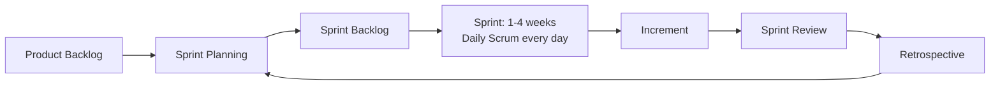

## 1. Introduction

**Agile** is a way of building software in small steps. Instead of planning everything up front and delivering after one year (the classic **Waterfall** model), an Agile team delivers working software every few weeks, gets feedback, and adapts.

**Scrum** is the most popular **framework** for doing Agile. It gives the team a small set of roles, events and artifacts. It does not tell you *how* to write code: it tells you how to organize the work around the code.

Why it matters for a developer:

- You will join a team that already works in **sprints**.
- You will estimate, demo and discuss your work every week.
- In an interview, "Do you have experience with Agile/Scrum?" is almost guaranteed.



## 2. The Agile Manifesto

The **Agile Manifesto** (2001) has four values. The items on the left are valued *more* than the items on the right, but the right side still matters.

| We value...                      | over...                         |
|----------------------------------|---------------------------------|
| Individuals and interactions     | processes and tools             |
| Working software                 | comprehensive documentation     |
| Customer collaboration           | contract negotiation            |
| Responding to change             | following a plan                |

A few of the twelve **principles** that you will hear often:

- Deliver working software frequently (weeks, not months).
- Welcome changing requirements, even late in development.
- Business people and developers work together daily.
- Simplicity: maximize the amount of work *not* done.
- At regular intervals, the team reflects and adjusts.

<Aside variant="warning">
"Working software over documentation" does not mean "no documentation". It means you write the documentation that is useful (API contracts, setup guides, decisions), not documents nobody reads.
</Aside>

## 3. Scrum roles

Scrum has three **accountabilities** (roles). There is no "project manager" in pure Scrum.

| Role | Main responsibility |
|------|---------------------|
| **Product Owner (PO)** | Maximizes the value of the product. Owns and orders the Product Backlog. Decides *what* to build. |
| **Scrum Master (SM)** | Helps the team use Scrum well. Removes **impediments** (blockers). A servant-leader, not a boss. |
| **Developers** | Everyone who builds the increment: backend, frontend, QA, DevOps. Decide *how* to build it. |

The team is **self-managing** and **cross-functional**: together it has all the skills needed to deliver a feature from database to UI. A typical Scrum team has 10 people or fewer.

<Aside variant="info">
"Developers" in Scrum is a role, not a job title. A tester or a UX designer inside the Scrum team is also a "Developer" in Scrum terms.
</Aside>

## 4. Scrum events

All events are **time-boxed**: they have a maximum duration.

### 4.1 The Sprint

A **sprint** is a fixed period (usually 2 weeks, max 1 month) in which the team creates a usable **increment**. A new sprint starts right after the previous one ends. Each sprint has a **Sprint Goal**: one sentence that explains why the sprint is valuable.

Example Sprint Goal: *"Engineers can upload a new revision of a document and see the revision history."*

### 4.2 Sprint Planning

At the start of the sprint (max 8 hours for a 1-month sprint). The team answers three questions:

1. **Why** is this sprint valuable? (Sprint Goal)
2. **What** can be done? (pick items from the Product Backlog)
3. **How** will the work get done? (split items into tasks)

### 4.3 Daily Scrum

A 15-minute meeting every day, for the Developers. The goal is to inspect progress toward the Sprint Goal and adapt the plan. A common format:

```text
Yesterday: finished the GET /documents/{id}/revisions endpoint, PR is open.
Today:     add pagination and write the integration tests.
Blockers:  I need the DBA to approve the new index on revisions(document_id).
```

<Aside variant="tip">
The Daily Scrum is not a status report to a manager. Keep it short and focused on the Sprint Goal. Long technical discussions go to a follow-up meeting with only the people involved.
</Aside>

### 4.4 Sprint Review

At the end of the sprint. The team **demos** the increment to stakeholders and the PO. They collect feedback and update the Product Backlog. It is a working session, not a slide presentation.

### 4.5 Sprint Retrospective

The last event of the sprint. The team discusses **how** it worked: people, process, tools, Definition of Done. A simple format is *Start / Stop / Continue*:

- **Start**: writing integration tests for every new endpoint.
- **Stop**: merging PRs on Friday evening without review.
- **Continue**: pairing on difficult database migrations.

The output is one or two concrete improvements for the next sprint.

## 5. Scrum artifacts

| Artifact | Commitment | Description |
|----------|-----------|-------------|
| **Product Backlog** | Product Goal | Ordered list of everything the product might need. Owned by the PO. |
| **Sprint Backlog** | Sprint Goal | Items selected for the sprint + the plan to deliver them. Owned by the Developers. |
| **Increment** | Definition of Done | The sum of all completed work. It must be usable. |

The Product Backlog is never "finished". The PO and the team regularly do **backlog refinement**: they clarify, split and estimate items so that the top of the backlog is ready for the next planning.

## 6. User stories and acceptance criteria

A **user story** describes a feature from the user's point of view:

```text
As a <role>, I want <goal>, so that <benefit>.

As a piping engineer,
I want to see all revisions of a document,
so that I can check what changed before approving it.
```

**Acceptance criteria** define when the story is correct. A popular format is **Given / When / Then** (Gherkin):

```gherkin
Scenario: Show revision history
  Given document "P&ID-001" has revisions A, B and C
  When I open the document detail page
  Then I see 3 revisions ordered from newest to oldest
  And each revision shows author, date and status

Scenario: Document without revisions
  Given document "P&ID-002" has no revisions
  When I open the document detail page
  Then I see the message "No revisions yet"
```

Good stories follow **INVEST**: Independent, Negotiable, Valuable, Estimable, Small, Testable.

Acceptance criteria map nicely to automated tests:

```cs
[Fact]
public async Task GetRevisions_ReturnsNewestFirst()
{
    // Given
    var doc = await SeedDocumentWithRevisions("P&ID-001", "A", "B", "C");

    // When
    var revisions = await _client.GetFromJsonAsync<List<RevisionDto>>(
        $"/api/documents/{doc.Id}/revisions");

    // Then
    Assert.Equal(["C", "B", "A"], revisions!.Select(r => r.Code));
}
```

<Aside variant="tip">
Interview tip: if you get a vague requirement in a coding exercise, say "I would clarify the acceptance criteria with the Product Owner" and then list your assumptions. It shows you think like a Scrum team member, not just a coder.
</Aside>

## 7. Estimation and story points

**Story points** measure the relative *size* of a story: effort, complexity and uncertainty together. They are **not hours**. Teams often use a Fibonacci-like scale: 1, 2, 3, 5, 8, 13.

**Planning Poker**: each developer picks a card in secret, then all reveal at the same time. If the numbers are very different (a 2 and a 13), the two people explain their reasoning. Often this reveals hidden work.

| Story | Points | Why |
|-------|--------|-----|
| Add a `Status` column to the document list | 1 | Small UI + DTO change |
| Filter equipment by tag | 3 | New query, index, endpoint |
| Import piping lines from an external CAD system | 13 | Unknown file format, integration risk: split it! |

**Velocity** is the number of points the team completes per sprint, on average. It helps planning, but it is not a performance metric to compare teams.

<Aside variant="warning">
A story of 13 points or more is usually too big for one sprint. Split it: for example by workflow step (parse file, validate, save, show report) or by data type.
</Aside>

## 8. Definition of Done

The **Definition of Done (DoD)** is a shared checklist. A backlog item is "done" only when it meets every point. Example for a .NET Web API team:

```text
Definition of Done
[ ] Code reviewed and approved in a pull request
[ ] Unit tests written and passing; coverage not decreased
[ ] Integration tests for new endpoints
[ ] CI pipeline green (build, tests, static analysis)
[ ] EF Core migration included and tested on PostgreSQL
[ ] OpenAPI/Swagger documentation updated
[ ] Deployed to the test environment
[ ] Acceptance criteria verified by the PO
```

The DoD is the same for every item. **Acceptance criteria** are specific to one story. Also, many teams have a **Definition of Ready (DoR)**: the conditions a story must meet before it can enter a sprint (clear, estimated, small enough).

## 9. Scrum vs Kanban

**Kanban** is another Agile approach. Work flows continuously on a board. There are no sprints and no fixed roles.

| Aspect | Scrum | Kanban |
|--------|-------|--------|
| Cadence | Fixed sprints | Continuous flow |
| Roles | PO, SM, Developers | No prescribed roles |
| Change during work | Sprint scope is stable | New items can enter any time |
| Key limit | Sprint capacity | **WIP limits** (work in progress) per column |
| Key metric | Velocity | **Lead time** / **cycle time** |
| Good for | Product development | Support, maintenance, ops |

```text
| To Do | In Progress (WIP 3) | Code Review (WIP 2) | Testing | Done |
```

Many real teams use **Scrumban**: sprints and Scrum events, plus a Kanban board with WIP limits.

## 10. Working with a Product Owner day to day

In practice, as a developer you will:

- **Ask early**: if a story is unclear, ask the PO during refinement, not on the last day of the sprint.
- **Propose options**: "We can do the full CAD import (13 points) or start with CSV import (3 points) this sprint." The PO decides on value; you explain cost and risk.
- **Talk about technical debt**: explain it in business terms ("this refactor makes the next three integration features faster").
- **Show progress**: demo small pieces early, even inside the sprint.
- **Say no politely**: if something is added mid-sprint, ask the PO what should be removed to make space.

<Aside variant="info">
The PO owns the *what* and the priority. The Developers own the *how* and the estimate. Respecting this split avoids most conflicts.
</Aside>

## 11. Interview questions

**Q: What is Scrum, in a few words?**
Scrum is a lightweight Agile framework for building products in short iterations called sprints. It has three roles: Product Owner, Scrum Master and Developers. It has five events and three artifacts. The idea is to deliver a usable increment every sprint and to inspect and adapt based on feedback.

**Q: What is the difference between the Product Owner and the Scrum Master?**
The Product Owner is responsible for the value of the product: they own the backlog and decide priorities. The Scrum Master is responsible for the process: they coach the team on Scrum and remove impediments. Neither of them is the developers' manager.

**Q: What happens in a Sprint Retrospective, and why is it useful?**
The team looks back at how the sprint went: what worked, what didn't, and what to change. We usually agree on one or two concrete actions for the next sprint. It is useful because it makes continuous improvement a habit, not something that happens by chance.

**Q: What are story points, and why not estimate in hours?**
Story points measure relative size: effort, complexity and risk. Humans are better at comparing ("this is twice as big as that") than at predicting exact hours. Over time, the team's velocity converts points into a realistic forecast.

**Q: What is the difference between the Definition of Done and acceptance criteria?**
Acceptance criteria are specific to one user story and describe the expected behavior. The Definition of Done is a quality checklist that applies to every item, like code review, tests and deployment to the test environment. A story is finished only when both are satisfied.

**Q: What do you do if the Product Owner wants to add a new item in the middle of the sprint?**
First I would understand the urgency. If it is really important, we discuss it as a team and the PO decides what to remove from the sprint to keep the scope realistic. If it is not urgent, it goes to the Product Backlog for the next planning.

**Q: When would you choose Kanban instead of Scrum?**
Kanban works well when work arrives unpredictably, for example support tickets or operations. There are no sprints, so you can pull new items at any time, and WIP limits keep the flow smooth. For planned product development, Scrum's fixed cadence usually helps more.

## 12. Quiz

import Quiz from '../../../components/Quiz.jsx';

<Quiz client:load questions={[
{
question:"Which statement is one of the four values of the Agile Manifesto?",
answers:{ a:"Processes and tools over individuals and interactions", b:"Comprehensive documentation over working software", c:"Responding to change over following a plan", d:"Contract negotiation over customer collaboration" },
correctAnswer:"c"
},
{
question:"Who is responsible for ordering the Product Backlog?",
answers:{ a:"The Product Owner", b:"The Scrum Master", c:"The Developers", d:"The project manager" },
correctAnswer:"a"
},
{
question:"What is the maximum duration of the Daily Scrum?",
answers:{ a:"5 minutes", b:"30 minutes", c:"1 hour", d:"15 minutes" },
correctAnswer:"d"
},
{
question:"In which event does the team demo the increment to stakeholders?",
answers:{ a:"Sprint Planning", b:"Sprint Review", c:"Sprint Retrospective", d:"Daily Scrum" },
correctAnswer:"b"
},
{
question:"What do story points measure?",
answers:{ a:"The exact number of hours of work", b:"The business value of a story", c:"The relative size of a story: effort, complexity and uncertainty", d:"The number of lines of code" },
correctAnswer:"c"
},
{
question:"Which statement about the Definition of Done is correct?",
answers:{ a:"It applies to every backlog item in the same way", b:"It is different for every user story", c:"It is written by the Scrum Master alone", d:"It is only checked at the end of the release" },
correctAnswer:"a"
},
{
question:"What is a key feature of Kanban compared to Scrum?",
answers:{ a:"Fixed two-week sprints", b:"A mandatory Scrum Master", c:"Velocity as the main metric", d:"Work-in-progress (WIP) limits on a continuous flow" },
correctAnswer:"d"
},
{
question:"A user story is estimated at 21 points. What should the team usually do?",
answers:{ a:"Accept it and work overtime", b:"Split it into smaller stories", c:"Give it to the most senior developer", d:"Remove the acceptance criteria" },
correctAnswer:"b"
}
]} />

## 13. Exercises

### 13.1 Write user stories with acceptance criteria

**Goal**: practice turning a requirement into stories that a team can estimate.

1. Requirement: *"Users must be able to assign tags to equipment and search equipment by tag."*
2. Write 2-3 user stories in the format "As a ..., I want ..., so that ...".
3. For each story, write at least two Given/When/Then scenarios (one happy path, one edge case).
4. Check each story against INVEST.

*Hint: think about edge cases like duplicate tags, tags with different upper/lower case, and equipment without tags.*

### 13.2 Split a big story

**Goal**: learn to split work into sprint-sized pieces.

1. Take this story: *"As a project manager, I want to import a full project (documents, revisions, equipment, piping lines) from an external system."*
2. Split it into at least four smaller stories that each deliver some value.
3. Give each one a story point estimate (1, 2, 3, 5, 8) and justify it in one sentence.
4. Order them as a PO would, and explain why.

*Hint: split by data type (documents first, then equipment) or by workflow step (upload, validate, preview, commit).*

### 13.3 Practice your interview answer

**Goal**: prepare a spoken answer about your Agile experience.

1. Write a 60-second answer to "Tell me about how your team works with Agile."
2. Mention sprint length, the events you attend, how you estimate, and one improvement that came from a retrospective.
3. Read it out loud in English and record yourself.
4. Shorten every sentence that takes more than one breath.

*Hint: use a concrete example (a feature, a blocker, a retro action). Specific stories are much more convincing than definitions.*
