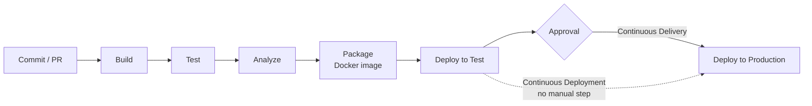

## 1. Introduction

**DevOps** is a culture and a set of practices that brings **development** (Dev) and **operations** (Ops) together. The old model was: developers write code, then "throw it over the wall" to an ops team that deploys and runs it. Problems were found late, and nobody owned the whole picture.

With DevOps, the same team builds, ships and runs the software. The key ideas:

- **Automation**: build, test and deploy with scripts, not by hand.
- **Small, frequent changes**: easier to review, test and roll back.
- **Fast feedback**: know in minutes if a change broke something.
- **Shared ownership**: "you build it, you run it".
- **Measure everything**: logs, metrics, alerts.

**CI/CD** is the technical heart of DevOps. It is a **pipeline** that takes a commit and brings it, automatically, toward production.

<Aside variant="info">
DevOps fits naturally with Agile. Scrum delivers an increment every sprint; CI/CD makes it cheap and safe to deliver that increment many times. See [Agile and Scrum](/informatica/dev-practices/2_agile-scrum).
</Aside>

## 2. CI vs Continuous Delivery vs Continuous Deployment

| Practice | What it means | Who pushes to production? |
|----------|---------------|---------------------------|
| **Continuous Integration (CI)** | Every push is merged often into the main branch, built and tested automatically. | Not covered |
| **Continuous Delivery (CD)** | Every green build produces a **release-ready** artifact, deployable at any time. | A human clicks "approve" |
| **Continuous Deployment** | Every green build goes to production automatically. | Nobody: fully automatic |



CI is about **integration**: small branches merged at least daily, so conflicts stay small. It links directly to the Git workflow in [Git and Version Control](/informatica/dev-practices/0_git).

<Aside variant="tip">
Interview tip: many people say "CI/CD" without knowing the difference between delivery and deployment. Explain it in one sentence: "Continuous delivery means every build *can* go to production with one click; continuous deployment means it *does* go automatically."
</Aside>

## 3. Pipeline stages

A typical pipeline for a .NET Web API has these stages:

1. **Build**: restore NuGet packages and compile (`dotnet restore`, `dotnet build`).
2. **Test**: run unit and integration tests (`dotnet test`). If one test fails, the pipeline stops.
3. **Analyze**: static analysis, code style, security scans (SonarQube, `dotnet format`, dependency vulnerability check).
4. **Package**: create the **artifact**: a Docker image, a zip, a NuGet package.
5. **Deploy**: push the artifact to an environment (test, staging, production).

The same commands run locally and in the pipeline:

```bash
dotnet restore
dotnet build --no-restore -c Release
dotnet test --no-build -c Release --logger trx
dotnet format --verify-no-changes
dotnet list package --vulnerable
docker build -t projects-api:local .
```

<Aside variant="warning">
"Build once, deploy many": the pipeline builds the artifact **one time** and promotes the *same* image from test to production. Never rebuild for production, or you deploy something you didn't test.
</Aside>

## 4. Example: GitHub Actions for a .NET app

**GitHub Actions** pipelines are YAML files in `.github/workflows/`. A **workflow** has **jobs**; a job has **steps**; it runs on a **runner** (a virtual machine).

### 4.1 CI job: build and test

```yaml
name: ci
on:
  push:
    branches: [main]
  pull_request:
    branches: [main]

jobs:
  build-test:
    runs-on: ubuntu-latest
    steps:
      - uses: actions/checkout@v4
      - uses: actions/setup-dotnet@v4
        with:
          dotnet-version: "8.0.x"
      - run: dotnet restore
      - run: dotnet build --no-restore -c Release
      - run: dotnet test --no-build -c Release --collect:"XPlat Code Coverage"
      - run: dotnet format --verify-no-changes
```

### 4.2 Integration tests with a PostgreSQL service

A job can start a database as a **service container**:

```yaml
  integration-tests:
    runs-on: ubuntu-latest
    needs: build-test
    services:
      postgres:
        image: postgres:16
        env:
          POSTGRES_PASSWORD: test
          POSTGRES_DB: projects_test
        ports: ["5432:5432"]
        options: --health-cmd pg_isready --health-interval 5s
    env:
      ConnectionStrings__Default: "Host=localhost;Database=projects_test;Username=postgres;Password=test"
    steps:
      - uses: actions/checkout@v4
      - uses: actions/setup-dotnet@v4
        with: { dotnet-version: "8.0.x" }
      - run: dotnet test tests/Projects.IntegrationTests -c Release
```

Note `ConnectionStrings__Default`: the double underscore maps to `ConnectionStrings:Default` in ASP.NET Core configuration.

### 4.3 Package and push a Docker image

```yaml
  docker:
    runs-on: ubuntu-latest
    needs: [build-test, integration-tests]
    if: github.ref == 'refs/heads/main'
    permissions:
      contents: read
      packages: write
    steps:
      - uses: actions/checkout@v4
      - uses: docker/login-action@v3
        with:
          registry: ghcr.io
          username: ${{ github.actor }}
          password: ${{ secrets.GITHUB_TOKEN }}
      - uses: docker/build-push-action@v6
        with:
          push: true
          tags: ghcr.io/acme/projects-api:${{ github.sha }}
```

The image is tagged with the **commit SHA**, so every running version can be traced back to exact code. The Dockerfile itself is explained in [Docker for .NET Developers](/informatica/dev-practices/1_docker).

<Aside variant="danger">
Never put passwords, API keys or connection strings in the YAML file or in Git. Use the platform's **secrets** (`secrets.MY_KEY` in GitHub, variable groups / Key Vault in Azure DevOps). Secrets are masked in logs.
</Aside>

## 5. The same idea in Azure DevOps

Many .NET companies use **Azure DevOps Pipelines**. Concepts map almost one to one: **stages** contain **jobs**, jobs contain **steps** (tasks).

```yaml
trigger:
  branches: { include: [main] }

pool:
  vmImage: ubuntu-latest

stages:
  - stage: Build
    jobs:
      - job: BuildTest
        steps:
          - task: UseDotNet@2
            inputs: { version: "8.0.x" }
          - script: dotnet build -c Release
          - task: DotNetCoreCLI@2
            inputs: { command: test, projects: "**/*Tests.csproj" }
  - stage: DeployTest
    dependsOn: Build
    jobs:
      - deployment: Deploy
        environment: test
        strategy:
          runOnce:
            deploy:
              steps:
                - script: echo "deploy image to test"
```

| GitHub Actions | Azure DevOps |
|----------------|--------------|
| workflow | pipeline |
| job / step | stage / job / step (task) |
| runner | agent (pool) |
| `secrets` | variable groups, Key Vault |
| environments + reviewers | environments + approvals and checks |

## 6. Environments

An **environment** is a place where the application runs, with its own configuration and database.

| Environment | Purpose | Data |
|-------------|---------|------|
| **Development** | Your machine, `docker compose` | Fake / seed data |
| **Test / QA** | Automatic deploy after each merge | Test data |
| **Staging** | Copy of production, final checks, demos | Anonymized copy |
| **Production** | Real users | Real data |

In ASP.NET Core, the environment is chosen with `ASPNETCORE_ENVIRONMENT`, and settings come from `appsettings.{Environment}.json` plus environment variables:

```cs
var builder = WebApplication.CreateBuilder(args);

if (builder.Environment.IsDevelopment())
{
    builder.Services.AddSwaggerGen();
}

var connString = builder.Configuration.GetConnectionString("Default")
    ?? throw new InvalidOperationException("Missing connection string");
builder.Services.AddDbContext<ProjectsDbContext>(o => o.UseNpgsql(connString));
```

Database changes need care too: apply EF Core migrations as a pipeline step (for example with a migration bundle: `dotnet ef migrations bundle`) and keep them **backward compatible**, so the old version still works while the new one rolls out. See [ORM and Entity Framework](/informatica/csharp/orm-entity-framework).

## 7. Feature flags

A **feature flag** (feature toggle) lets you deploy code that is **switched off**. You enable it later, for some users or for everyone, without a new deploy. This **separates deployment from release**.

```cs
// appsettings.json: "FeatureManagement": { "RevisionCompare": false }
builder.Services.AddFeatureManagement(); // Microsoft.FeatureManagement.AspNetCore

app.MapGet("/api/documents/{id:int}/compare", async (
    int id, string from, string to,
    IFeatureManager features, IRevisionService revisions) =>
{
    if (!await features.IsEnabledAsync("RevisionCompare"))
        return Results.NotFound();

    return Results.Ok(await revisions.CompareAsync(id, from, to));
});
```

Uses: trunk-based development with unfinished features, gradual rollout, A/B tests, quick "kill switch" if something goes wrong.

<Aside variant="warning">
Feature flags are technical debt. Remove the flag and the old code path once the feature is fully released, or the codebase fills up with dead branches.
</Aside>

Related deployment strategies: **blue-green** (two identical environments, switch traffic at once) and **canary** (send a small percentage of traffic to the new version first).

## 8. Monitoring basics

After deploy, you must know if the application is healthy. The three pillars of **observability**:

- **Logs**: what happened (structured logs with Serilog or `ILogger`).
- **Metrics**: numbers over time (requests per second, error rate, response time, CPU).
- **Traces**: the path of one request across services (OpenTelemetry). Very useful when systems are integrated.

A **health check** endpoint lets the load balancer, Docker or Kubernetes know if the app is alive:

```cs
builder.Services.AddHealthChecks()
    .AddNpgSql(connString); // package AspNetCore.HealthChecks.NpgSql

var app = builder.Build();
app.MapHealthChecks("/health");
```

```cs
public class RevisionService(ILogger<RevisionService> logger)
{
    public void Approve(int documentId, string revision)
    {
        // structured log: fields are searchable, not just text
        logger.LogInformation("Revision {Revision} of document {DocumentId} approved",
            revision, documentId);
    }
}
```

Set **alerts** on symptoms users feel (error rate above 1%, p95 latency above 500 ms), not on every small detail. Two common DevOps metrics are **MTTR** (mean time to recovery) and **deployment frequency**.

## 9. Interview questions

**Q: What is DevOps?**
DevOps is a culture where development and operations work as one team, supported by automation. The goal is to deliver small changes often and safely, with fast feedback. In practice it means CI/CD pipelines, infrastructure as code, monitoring, and developers who also care about how their code runs in production.

**Q: What is the difference between continuous delivery and continuous deployment?**
In both cases every change goes through an automated pipeline and produces a release-ready artifact. With continuous delivery, a person decides when to push it to production, usually with one click. With continuous deployment, every green build goes to production automatically, with no manual step.

**Q: Describe a CI/CD pipeline you would set up for a .NET Web API.**
On every pull request I would restore, build, run unit tests, and run static analysis and format checks. On merge to main, I would also run integration tests against a real PostgreSQL container, build a Docker image tagged with the commit SHA and push it to a registry. Then I would deploy it automatically to a test environment, and to production after an approval.

**Q: What do you do when the build breaks on the main branch?**
Fixing the main branch is the top priority, because it blocks everyone. If the fix is quick, I fix it right away; otherwise I revert the commit and fix it on a branch. Then we check why the problem was not caught earlier, for example a missing test in the PR pipeline.

**Q: How do you handle secrets and configuration across environments?**
Code is the same in every environment; only configuration changes. Non-secret settings go in `appsettings.{Environment}.json` or environment variables. Secrets go in a secret store like Azure Key Vault or the pipeline's secret variables, never in Git.

**Q: What are feature flags and why are they useful?**
A feature flag is a switch that turns a feature on or off at runtime. It lets us merge and deploy unfinished code safely, and release it later to some or all users. It also gives a quick kill switch if a feature causes problems, without a rollback.

**Q: How do you know a deployment went well?**
First, automated smoke tests and health checks after the deploy. Then I watch metrics like error rate and response time on a dashboard, and check the logs for new exceptions. If something looks wrong, a canary or blue-green strategy makes it easy to roll back.

## 10. Quiz

import Quiz from '../../../components/Quiz.jsx';

<Quiz client:load questions={[
{
question:"What is the main goal of Continuous Integration?",
answers:{ a:"Deploy to production every hour", b:"Merge small changes often and verify each one with an automated build and tests", c:"Replace code reviews", d:"Write documentation automatically" },
correctAnswer:"b"
},
{
question:"What is the difference between continuous delivery and continuous deployment?",
answers:{ a:"Continuous deployment pushes every green build to production automatically; continuous delivery needs a manual approval", b:"They are exactly the same", c:"Continuous delivery does not run tests", d:"Continuous deployment only works with Azure DevOps" },
correctAnswer:"a"
},
{
question:"What does \"build once, deploy many\" mean?",
answers:{ a:"Each environment builds its own version of the code", b:"You only deploy once per year", c:"The same artifact is promoted from test to production without rebuilding", d:"Builds run only on the developer's machine" },
correctAnswer:"c"
},
{
question:"In GitHub Actions, where should a database password be stored?",
answers:{ a:"In the workflow YAML file", b:"In appsettings.json committed to Git", c:"In the README", d:"In the repository secrets" },
correctAnswer:"d"
},
{
question:"Why tag a Docker image with the commit SHA?",
answers:{ a:"It makes the image smaller", b:"Every running version can be traced back to the exact source code", c:"Docker requires it", d:"It speeds up the build" },
correctAnswer:"b"
},
{
question:"What is a feature flag mainly used for?",
answers:{ a:"Separating deployment from release", b:"Compiling code faster", c:"Encrypting configuration", d:"Replacing unit tests" },
correctAnswer:"a"
},
{
question:"Which of these is NOT one of the three pillars of observability?",
answers:{ a:"Logs", b:"Metrics", c:"Traces", d:"Story points" },
correctAnswer:"d"
},
{
question:"In a canary deployment...",
answers:{ a:"All users switch to the new version at the same time", b:"The new version is only tested on developer machines", c:"A small percentage of traffic goes to the new version first", d:"The database is deleted before each deploy" },
correctAnswer:"c"
}
]} />

## 11. Exercises

### 11.1 Your first GitHub Actions workflow

**Goal**: run build and tests automatically on every pull request.

1. Create a small ASP.NET Core Web API and an xUnit test project in one solution.
2. Push it to a GitHub repository.
3. Add `.github/workflows/ci.yml` with restore, build and test steps (section 4.1).
4. Open a pull request with a failing test and check that the pipeline turns red. Fix it and see it turn green.

*Hint: in the repository settings, enable a branch protection rule so a PR cannot be merged if the `ci` check fails.*

### 11.2 Add PostgreSQL and a Docker image

**Goal**: extend the pipeline with integration tests and packaging.

1. Add an integration test that reads `Project` entities from PostgreSQL through EF Core.
2. Add a job with a `postgres:16` service container and pass the connection string as an environment variable.
3. Add a Dockerfile and a job that builds the image and pushes it to `ghcr.io`, only on the main branch.
4. Tag the image with `github.sha` and check that it appears under the repository's Packages.

*Hint: use `needs:` so the Docker job runs only if all test jobs pass, and `if: github.ref == 'refs/heads/main'` to skip it on PRs.*

### 11.3 Feature flag and health check

**Goal**: practice runtime safety tools.

1. Install `Microsoft.FeatureManagement.AspNetCore` and add a flag `EquipmentExport` set to `false`.
2. Create an endpoint `GET /api/equipment/export` that returns 404 when the flag is off.
3. Add `/health` with a PostgreSQL check.
4. Run the app with Docker, stop the database container, and observe how `/health` changes. Then turn the flag on via an environment variable without changing code.

*Hint: the environment variable for the flag is `FeatureManagement__EquipmentExport=true`.*
