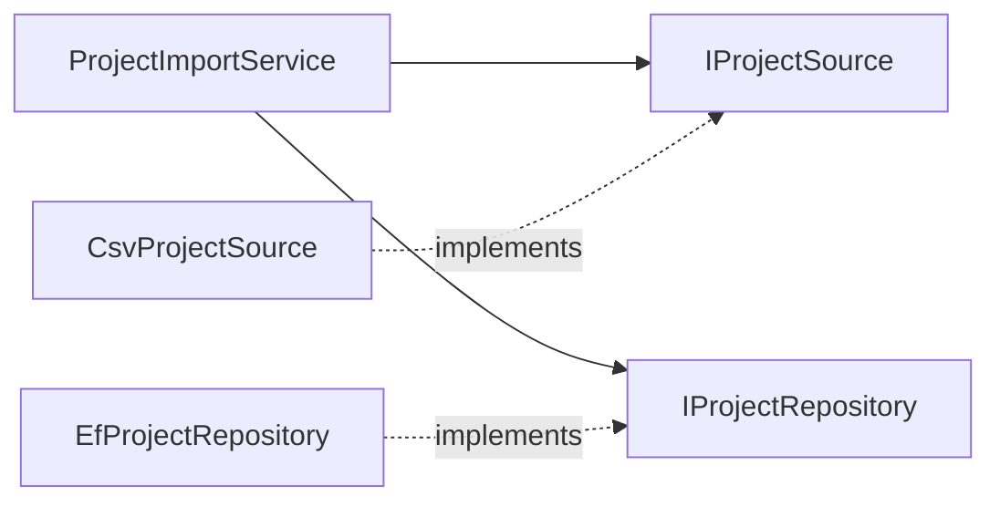

## 1. Introduction

**SOLID** is an acronym for five object-oriented design principles, made popular by Robert C. Martin ("Uncle Bob"). They help you write code that is easy to **change**, easy to **test** and easy to **understand**.

| Letter | Principle | One-line idea |
|---|---|---|
| **S** | Single Responsibility | A class should have one reason to change |
| **O** | Open/Closed | Open for extension, closed for modification |
| **L** | Liskov Substitution | Subtypes must be usable in place of their base type |
| **I** | Interface Segregation | Many small interfaces are better than one big one |
| **D** | Dependency Inversion | Depend on abstractions, not on concrete classes |

In this lesson every principle has a **bad** example and a **good** example, using an engineering data domain: projects, documents, revisions, equipment and tags.

<Aside variant="info">
SOLID is not a set of laws. It is a set of guidelines that reduce **coupling** (how much classes depend on each other) and increase **cohesion** (how well the parts of a class belong together).
</Aside>

## 2. S - Single Responsibility Principle (SRP)

> A class should have only one reason to change.

"Responsibility" means "reason to change", usually linked to one actor or one concern (business rules, persistence, formatting, notifications...).

### 2.1 Bad example

```cs
public class DocumentService
{
    public void Approve(Document doc)
    {
        doc.Status = DocumentStatus.Approved;          // business rule

        using var conn = new NpgsqlConnection("Host=..."); // persistence
        conn.Open();
        // UPDATE documents SET status = ...

        var pdf = $"<h1>{doc.Title}</h1>";              // formatting
        File.WriteAllText($"{doc.Id}.html", pdf);

        new SmtpClient("smtp.local")                    // notification
            .Send("noreply@x.com", doc.OwnerEmail, "Approved", doc.Title);
    }
}
```

This class changes if the database changes, if the report layout changes, or if the email provider changes. It is also impossible to unit test without a real database and SMTP server.

### 2.2 Good example

```cs
public class DocumentApprovalService(
    IDocumentRepository repository,
    IDocumentNotifier notifier)
{
    public async Task ApproveAsync(Guid documentId)
    {
        var doc = await repository.GetByIdAsync(documentId)
                  ?? throw new KeyNotFoundException();

        doc.Approve();                       // rule lives in the entity
        await repository.SaveAsync(doc);     // persistence is delegated
        await notifier.NotifyApprovedAsync(doc); // notification is delegated
    }
}
```

Now each class has one job. The example uses a C# 12 **primary constructor** to keep the code short.

<Aside variant="warning">
SRP does not mean "one method per class". Splitting too much creates dozens of tiny classes that are hard to navigate. Group code that changes together, separate code that changes for different reasons.
</Aside>

## 3. O - Open/Closed Principle (OCP)

> Software entities should be open for extension, but closed for modification.

You should be able to add new behavior **without editing** existing, tested code.

### 3.1 Bad example

```cs
public class TagValidator
{
    public bool IsValid(Tag tag) => tag.Type switch
    {
        "Pump"  => Regex.IsMatch(tag.Code, @"^P-\d{3}$"),
        "Valve" => Regex.IsMatch(tag.Code, @"^V-\d{4}$"),
        // every new equipment type = edit this switch
        _ => false
    };
}
```

### 3.2 Good example

```cs
public interface ITagRule
{
    bool AppliesTo(string tagType);
    bool IsValid(Tag tag);
}

public class PumpTagRule : ITagRule
{
    public bool AppliesTo(string t) => t == "Pump";
    public bool IsValid(Tag tag) => Regex.IsMatch(tag.Code, @"^P-\d{3}$");
}

public class TagValidator(IEnumerable<ITagRule> rules)
{
    public bool IsValid(Tag tag) =>
        rules.FirstOrDefault(r => r.AppliesTo(tag.Type))?.IsValid(tag) ?? false;
}
```

To support a new type you add a new `ITagRule` class and register it in DI. `TagValidator` never changes. This is the **Strategy** pattern (see [Design Patterns in .NET](/informatica/dev-practices/5_design-patterns)).

<Aside variant="tip">
In ASP.NET Core, if you register several implementations of the same interface (`AddScoped<ITagRule, PumpTagRule>()`, `AddScoped<ITagRule, ValveTagRule>()`), you can inject them all as `IEnumerable<ITagRule>`. This is a very common way to apply OCP.
</Aside>

## 4. L - Liskov Substitution Principle (LSP)

> If `S` is a subtype of `T`, objects of type `T` can be replaced with objects of type `S` without breaking the program.

A subclass must keep the **contract** of its base class: it should not throw unexpected exceptions, require stronger inputs, or return weaker results.

### 4.1 Bad example

```cs
public class Document
{
    public virtual void AddRevision(Revision r) => Revisions.Add(r);
    public List<Revision> Revisions { get; } = [];
}

public class ArchivedDocument : Document
{
    public override void AddRevision(Revision r) =>
        throw new InvalidOperationException("Archived documents are read-only");
}

// Caller code that works for Document but breaks for ArchivedDocument
void Import(Document doc, Revision rev) => doc.AddRevision(rev); // boom
```

`ArchivedDocument` "is a" `Document` in real life, but it does not **behave** like one. Every caller now needs `if (doc is ArchivedDocument)` checks, which is a classic LSP smell.

### 4.2 Good example

```cs
public interface IReadableDocument
{
    string Title { get; }
    IReadOnlyList<Revision> Revisions { get; }
}

public interface IEditableDocument : IReadableDocument
{
    void AddRevision(Revision r);
}

public class ActiveDocument : IEditableDocument { /* ... */ }
public class ArchivedDocument : IReadableDocument { /* ... */ }
```

Now the type system tells the truth: you can only call `AddRevision` on something that really supports it.

<Aside variant="info">
The famous textbook example is `Square : Rectangle`. Setting `Width` on a square also changes `Height`, so code that expects a rectangle breaks. Interviewers like it, but a domain example like the one above shows you really understand it.
</Aside>

## 5. I - Interface Segregation Principle (ISP)

> Clients should not be forced to depend on methods they do not use.

### 5.1 Bad example

```cs
public interface IEquipmentService
{
    Equipment? GetById(int id);
    IEnumerable<Equipment> Search(string text);
    void Create(Equipment e);
    void Delete(int id);
    byte[] ExportToExcel();
    void SyncWithErp();
}

// A read-only report class must implement (or depend on) everything
public class EquipmentReport(IEquipmentService service) { /* uses only Search */ }
```

A "fat" interface couples every client to every method. A fake for tests must implement six methods even if the test uses one.

### 5.2 Good example

```cs
public interface IEquipmentReader
{
    Equipment? GetById(int id);
    IEnumerable<Equipment> Search(string text);
}

public interface IEquipmentWriter
{
    void Create(Equipment e);
    void Delete(int id);
}

public interface IEquipmentExporter { byte[] ExportToExcel(); }

public class EquipmentReport(IEquipmentReader reader) { /* ... */ }
```

One class can still implement all three interfaces. The point is that each **client** depends only on what it needs. This idea is also the base of **CQRS** (separating reads from writes).

## 6. D - Dependency Inversion Principle (DIP)

> High-level modules should not depend on low-level modules. Both should depend on abstractions.

The **high-level** module is your business logic. The **low-level** modules are details: database, file system, HTTP, email.

### 6.1 Bad example

```cs
public class ProjectImportService
{
    private readonly PostgresProjectRepository _repo = new();
    private readonly CsvFileReader _reader = new();

    public void Import(string path)
    {
        foreach (var project in _reader.Read(path))
            _repo.Insert(project);
    }
}
```

Business logic is glued to PostgreSQL and CSV. You cannot import from an API or test without files and a database.

### 6.2 Good example

```cs
public interface IProjectSource { IAsyncEnumerable<Project> ReadAsync(); }
public interface IProjectRepository { Task AddAsync(Project p); }

public class ProjectImportService(IProjectSource source, IProjectRepository repo)
{
    public async Task ImportAsync()
    {
        await foreach (var project in source.ReadAsync())
            await repo.AddAsync(project);
    }
}

// Program.cs (composition root)
builder.Services.AddScoped<IProjectSource, CsvProjectSource>();
builder.Services.AddScoped<IProjectRepository, EfProjectRepository>();
```

The abstractions (`IProjectSource`, `IProjectRepository`) belong to the business layer. The infrastructure layer implements them. The dependency arrow is **inverted**.



<Aside variant="warning">
DIP (a principle) is not the same as DI (a technique) or IoC container (a tool). **Dependency Injection** is how you usually apply DIP in .NET. See the [Dependency Injection lesson](/informatica/csharp/dependency-injection) for lifetimes and the built-in container.
</Aside>

## 7. SOLID in practice

- **Don't over-engineer.** An interface with one implementation that will never change and is never mocked can be noise. Apply SOLID when change or testing is real.
- **SOLID and testing go together.** If a class is hard to unit test, it often breaks SRP or DIP. See [Unit and Integration Testing in .NET](/informatica/dev-practices/6_unit-testing).
- **Related principles:** **DRY** (Don't Repeat Yourself), **KISS** (Keep It Simple), **YAGNI** (You Aren't Gonna Need It), and "composition over inheritance".

<Aside variant="tip">
Interview tip: when asked about SOLID, don't just recite the definitions. Pick one or two principles and tell a short story from your own code: "In my last project we had a service that did X, Y and Z; we split it and it became easy to test." Real examples are much more convincing.
</Aside>

## 8. Interview questions

**Q: What does SOLID stand for?**
It's five design principles: Single Responsibility, Open/Closed, Liskov Substitution, Interface Segregation and Dependency Inversion. Together they aim to reduce coupling and make code easier to change and test. In .NET you see them everywhere, for example in how ASP.NET Core uses interfaces and dependency injection.

**Q: Can you give an example of a Single Responsibility violation?**
A typical one is a service method that validates data, writes to the database, builds a report and sends an email all in one place. It has many reasons to change, and you can't test the business rule without a database. I would move persistence into a repository and notifications into a separate service, and keep only the orchestration in the original class.

**Q: How do you apply the Open/Closed Principle in C#?**
I usually put the varying behavior behind an interface and add new implementations instead of extending a big `switch` or `if` chain. With the built-in DI container I can register several implementations and inject them as an `IEnumerable`. So adding a new case means adding a new class, not editing tested code.

**Q: What is the Liskov Substitution Principle, in simple words?**
It means a subclass must be usable anywhere the base class is expected, without surprises. If an override throws `NotSupportedException` or ignores part of the contract, callers start checking concrete types, and that's a sign the hierarchy is wrong. Usually the fix is to split the abstraction or prefer composition over inheritance.

**Q: What is the difference between Dependency Inversion and Dependency Injection?**
Dependency Inversion is the principle: business logic should depend on abstractions, and details like the database should implement those abstractions. Dependency Injection is the technique: you pass dependencies in from outside, usually through the constructor. In ASP.NET Core the built-in container does the injection for you.

**Q: Can SOLID be overused?**
Yes. If you create an interface for every class, or split logic into tiny pieces, the code becomes harder to read without real benefit. I apply the principles where there is real variation or a real need to test in isolation, and I keep things simple otherwise, following YAGNI.

## 9. Quiz

import Quiz from '../../../components/Quiz.jsx';

<Quiz client:load questions={[
{
question:"According to SRP, what is a 'responsibility'?",
answers:{ a:"A single public method", b:"A reason for the class to change", c:"A database table", d:"An interface the class implements" },
correctAnswer:"b"
},
{
question:"You must add support for a new equipment type without editing the existing validator. Which principle are you following?",
answers:{ a:"Liskov Substitution", b:"Interface Segregation", c:"Open/Closed", d:"Single Responsibility" },
correctAnswer:"c"
},
{
question:"A subclass overrides a method and throws `NotSupportedException`. Which principle is most likely violated?",
answers:{ a:"Liskov Substitution", b:"Open/Closed", c:"Dependency Inversion", d:"DRY" },
correctAnswer:"a"
},
{
question:"A test fake must implement 10 methods, but the class under test calls only 1. Which principle would help?",
answers:{ a:"Single Responsibility", b:"Liskov Substitution", c:"YAGNI", d:"Interface Segregation" },
correctAnswer:"d"
},
{
question:"In DIP, who should own the abstraction `IProjectRepository`?",
answers:{ a:"The PostgreSQL driver", b:"The infrastructure layer only", c:"The high-level business layer", d:"The UI layer" },
correctAnswer:"c"
},
{
question:"Which statement about DIP and DI is correct?",
answers:{ a:"They are exactly the same thing", b:"DI is a technique that is commonly used to apply DIP", c:"DIP requires an IoC container", d:"DI forbids interfaces" },
correctAnswer:"b"
},
{
question:"How can you inject all registered implementations of `ITagRule` in ASP.NET Core?",
answers:{ a:"Inject `IEnumerable<ITagRule>`", b:"Inject `ITagRule[]` from a static class", c:"Call `new` for each rule", d:"It is not possible" },
correctAnswer:"a"
},
{
question:"Which is a sign that SOLID is being over-applied?",
answers:{ a:"A class with one clear job", b:"Business logic depending on interfaces", c:"An interface for every class, even with a single implementation never mocked", d:"Small interfaces per client" },
correctAnswer:"c"
}
]} />

## 10. Exercises

### 10.1 Split a God service

**Goal:** apply SRP and DIP to a class that does too much.

1. Write a `RevisionService.Publish(Revision r)` method that validates the revision, saves it with `NpgsqlConnection`, writes a log file and sends an email.
2. List every "reason to change" of the class in a comment.
3. Extract `IRevisionRepository`, `IAuditLog` and `INotifier`, and inject them with a primary constructor.
4. Register the implementations in `Program.cs`.

*Hint: the final `Publish` method should be about 5 lines and contain only orchestration.*

### 10.2 Remove the switch

**Goal:** apply OCP to document numbering.

1. Create a `DocumentNumberGenerator` with a `switch` on discipline (`"Piping"`, `"Electrical"`, `"Mechanical"`) that returns different number formats.
2. Refactor it into an `INumberingRule` interface with one class per discipline.
3. Inject `IEnumerable<INumberingRule>` and pick the right rule at runtime.
4. Add a new `"Instrumentation"` rule without changing the generator.

*Hint: add an `AppliesTo(string discipline)` method to the interface.*

### 10.3 Fix the hierarchy

**Goal:** detect and fix an LSP and ISP violation.

1. Create a base class `Equipment` with `Start()`, `Stop()` and `Calibrate()`.
2. Add `Pump` (supports everything) and `Tank` (cannot start or stop, so it throws).
3. Write a method that starts a list of `Equipment` and observe the failure.
4. Redesign with small interfaces (`IStartable`, `ICalibratable`) so each class implements only what it supports.

*Hint: use `equipment.OfType<IStartable>()` to work only with items that support starting.*
