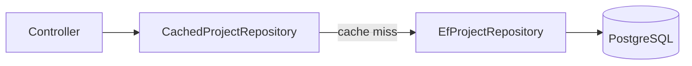

## 1. Introduction

A **design pattern** is a reusable solution to a common design problem. It is not a library you install: it is a shape of code with a name, so the team can say "let's use a Decorator here" and everyone understands.

Most patterns come from the "Gang of Four" (GoF) book (1994), grouped into three families:

| Family | Question it answers | Patterns in this lesson |
|---|---|---|
| **Creational** | How are objects created? | Factory, Singleton |
| **Structural** | How are objects composed? | Adapter, Decorator |
| **Behavioral** | How do objects communicate? | Strategy, Observer |

We also cover **Repository** and **Unit of Work**, which are not GoF patterns but are very common in .NET data access.

<Aside variant="info">
Patterns are tools, not goals. Use a pattern when you have the problem it solves. Adding patterns "just in case" makes code harder to read. Most of them build on the [SOLID principles](/informatica/dev-practices/4_solid).
</Aside>

## 2. Repository and Unit of Work

The **Repository** pattern hides data access behind a collection-like interface. The domain asks for `Project` objects and does not know about SQL or EF Core.

```cs
public interface IProjectRepository
{
    Task<Project?> GetByIdAsync(Guid id, CancellationToken ct = default);
    Task<IReadOnlyList<Project>> GetActiveAsync(CancellationToken ct = default);
    void Add(Project project);
}

public class EfProjectRepository(AppDbContext db) : IProjectRepository
{
    public Task<Project?> GetByIdAsync(Guid id, CancellationToken ct = default) =>
        db.Projects.Include(p => p.Documents).FirstOrDefaultAsync(p => p.Id == id, ct);

    public async Task<IReadOnlyList<Project>> GetActiveAsync(CancellationToken ct = default) =>
        await db.Projects.Where(p => !p.IsArchived).ToListAsync(ct);

    public void Add(Project project) => db.Projects.Add(project);
}
```

The **Unit of Work** groups several changes into **one transaction**: either all of them are saved, or none.

```cs
public interface IUnitOfWork
{
    Task<int> SaveChangesAsync(CancellationToken ct = default);
}

// Usage in an application service
projects.Add(project);
documents.Add(firstDocument);
await unitOfWork.SaveChangesAsync(); // one commit for both
```

### 2.1 The debate: do you need them with EF Core?

EF Core **already implements** both patterns: `DbSet<T>` is a repository and `DbContext` is a unit of work (`SaveChanges` is atomic).

| Use a custom repository when... | Use `DbContext` directly when... |
|---|---|
| You want to hide EF Core from the domain (Clean Architecture) | The app is small or CRUD-oriented |
| You want named, reusable queries (`GetActiveAsync`) | You need the full power of LINQ and `IQueryable` |
| You want simple fakes in unit tests | You test with a real database (Testcontainers) |

<Aside variant="warning">
Avoid a "generic repository" that returns `IQueryable<T>` from every method. It leaks EF Core to every caller and adds a layer that does nothing. If you build repositories, make them specific to an aggregate and return materialized results. See also [IEnumerable vs IQueryable](/informatica/csharp/ienumerable-vs-iqueryable) and the [EF Core lesson](/informatica/csharp/orm-entity-framework).
</Aside>

## 3. Factory

A **Factory** centralizes the creation of objects, so the caller does not need to know which concrete class to instantiate.

```cs
public interface IDocumentParser { ParsedDocument Parse(Stream file); }

public class PdfParser : IDocumentParser { /* ... */ }
public class DwgParser : IDocumentParser { /* ... */ }

public class DocumentParserFactory(IServiceProvider sp)
{
    public IDocumentParser Create(string extension) => extension.ToLowerInvariant() switch
    {
        ".pdf" => sp.GetRequiredService<PdfParser>(),
        ".dwg" => sp.GetRequiredService<DwgParser>(),
        _ => throw new NotSupportedException($"No parser for {extension}")
    };
}
```

Use it when the concrete type depends on **runtime data** (file extension, user choice, message type). Using `IServiceProvider` inside a factory is acceptable: the factory is part of the composition infrastructure.

<Aside variant="tip">
.NET 8 adds **keyed services**: `AddKeyedScoped<IDocumentParser, PdfParser>(".pdf")` and then `sp.GetRequiredKeyedService<IDocumentParser>(".pdf")`. It removes a lot of hand-written factory code.
</Aside>

## 4. Strategy

**Strategy** defines a family of algorithms behind one interface and lets you choose one at runtime. It is the most direct way to apply the Open/Closed Principle.

```cs
public interface IRevisionNumbering
{
    string Next(string? current);
}

public class LetterNumbering : IRevisionNumbering   // A, B, C...
{
    public string Next(string? current) =>
        current is null ? "A" : ((char)(current[0] + 1)).ToString();
}

public class NumericNumbering : IRevisionNumbering  // 01, 02, 03...
{
    public string Next(string? current) =>
        ((current is null ? 0 : int.Parse(current)) + 1).ToString("D2");
}

// The context: it does not care which strategy it gets
public class RevisionService(IRevisionNumbering numbering)
{
    public Revision CreateNext(Document doc) =>
        new(doc.Id, numbering.Next(doc.CurrentRevision?.Code));
}
```

Each customer project can use a different numbering scheme without any `if` in `RevisionService`.

## 5. Decorator

A **Decorator** wraps an object that implements an interface, and adds behavior **before or after** the call, without changing the original class. Typical uses: caching, logging, retry, metrics.

```cs
public class CachedProjectRepository(
    IProjectRepository inner,
    IMemoryCache cache) : IProjectRepository
{
    public Task<Project?> GetByIdAsync(Guid id, CancellationToken ct = default) =>
        cache.GetOrCreateAsync($"project:{id}", _ => inner.GetByIdAsync(id, ct));

    public Task<IReadOnlyList<Project>> GetActiveAsync(CancellationToken ct = default) =>
        inner.GetActiveAsync(ct);

    public void Add(Project project) => inner.Add(project);
}
```

The caller still depends on `IProjectRepository` and has no idea that caching exists. The built-in DI container does not support decorators directly; a library like **Scrutor** adds `services.Decorate<IProjectRepository, CachedProjectRepository>()`.



<Aside variant="info">
You already use decorators every day: ASP.NET Core **middleware** wraps the next step of the pipeline, and `DelegatingHandler` wraps `HttpClient` calls. Same idea, different shape.
</Aside>

## 6. Observer (events)

**Observer** lets an object (the **subject**) notify many other objects (the **observers**) when something happens, without knowing who they are. In C# this pattern is built into the language with **events**.

```cs
public class Document
{
    public event EventHandler<RevisionAddedEventArgs>? RevisionAdded;

    public void AddRevision(Revision r)
    {
        Revisions.Add(r);
        RevisionAdded?.Invoke(this, new RevisionAddedEventArgs(r));
    }

    public List<Revision> Revisions { get; } = [];
}

public record RevisionAddedEventArgs(Revision Revision);

// Subscribers
doc.RevisionAdded += (_, e) => Console.WriteLine($"New revision {e.Revision.Code}");
doc.RevisionAdded += (_, e) => searchIndex.Update(e.Revision);
```

In larger applications the same idea appears as **domain events** (often with a library like MediatR) or as messages on a broker (RabbitMQ, Azure Service Bus) between services. See [Delegates](/informatica/csharp/delegates) for how events work under the hood.

## 7. Adapter

An **Adapter** converts the interface of an existing class into the interface your code expects. It is the key pattern for **integration between systems**: your domain talks to your own interface, and the adapter translates to the external API.

```cs
// Our domain interface
public interface IEquipmentCatalog
{
    Task<Equipment?> FindByTagAsync(string tag);
}

// External ERP client with a different model and naming
public class ErpApiClient
{
    public Task<ErpItemDto?> GetItemAsync(string itemCode) => /* HTTP call */ default!;
}

public class ErpEquipmentAdapter(ErpApiClient erp) : IEquipmentCatalog
{
    public async Task<Equipment?> FindByTagAsync(string tag)
    {
        var item = await erp.GetItemAsync(tag.Replace("-", ""));
        return item is null ? null
            : new Equipment(Tag: tag, Name: item.Descr, WeightKg: item.WeightGr / 1000m);
    }
}
```

If the ERP changes, or you replace it with another system, you write a new adapter. The domain code stays the same.

<Aside variant="tip">
Interview tip: for an integration-focused role, the Adapter pattern is a great talking point. Explain that you keep external DTOs at the edge of the system and map them to your own model, so a change in a third-party API breaks only one class. This is also called an **anti-corruption layer**.
</Aside>

## 8. Singleton via DI

A **Singleton** guarantees that only one instance of a class exists. The classic implementation uses a static field:

```cs
public sealed class UnitConverter
{
    public static UnitConverter Instance { get; } = new();
    private UnitConverter() { }
}
```

This is hard to test (global state, cannot be replaced by a fake). In modern .NET you let the container manage the lifetime instead:

```cs
builder.Services.AddSingleton<IUnitConverter, UnitConverter>();
```

You get one instance per application, but the class is a normal class with a normal constructor, and consumers receive it through DI.

<Aside variant="danger">
A singleton must be **thread-safe** and must never depend on a scoped service such as `DbContext`. That would create a "captive dependency": one `DbContext` shared by all requests, which causes concurrency errors. See the lifetimes section in [Dependency Injection](/informatica/csharp/dependency-injection).
</Aside>

## 9. When to use each pattern

| Pattern | Use it when... | Example in engineering data software |
|---|---|---|
| Repository | You want to isolate data access | `IProjectRepository` over EF Core |
| Unit of Work | Several changes must commit together | Save project + documents in one transaction |
| Factory | The concrete type depends on runtime data | Choose a parser by file extension |
| Strategy | You have interchangeable algorithms | Revision numbering per customer |
| Decorator | You want to add cross-cutting behavior | Caching or logging around a repository |
| Observer | Many parts must react to one event | Reindex when a revision is added |
| Adapter | You integrate an external system | ERP or CAD API mapped to your model |
| Singleton (DI) | One shared, stateless or thread-safe instance | Unit converter, configuration cache |

## 10. Interview questions

**Q: What is a design pattern, and why are they useful?**
A design pattern is a named, reusable solution to a recurring design problem. The biggest value for me is the shared vocabulary: if I say "this is a decorator around the repository", the team immediately understands the structure. But I try not to force patterns where the problem doesn't exist.

**Q: Do you use the Repository pattern with Entity Framework Core?**
It depends on the project. EF Core already gives you a repository with `DbSet` and a unit of work with `DbContext`, so in small apps I use it directly. In bigger, layered applications I add specific repositories per aggregate to keep EF Core out of the domain and to have meaningful query methods, but I avoid generic repositories that just wrap `DbSet`.

**Q: What is the difference between Strategy and Factory?**
Factory is about creating the right object, while Strategy is about using interchangeable behavior. They often work together: a factory picks the right strategy based on some input, and then the client calls it through the common interface.

**Q: How does the Decorator pattern differ from inheritance?**
With inheritance you extend a specific class at compile time, and you can end up with a class explosion like `CachedLoggedRepository`. With a decorator you wrap any implementation of the interface at runtime, and you can stack decorators in any order. It follows composition over inheritance and the Open/Closed Principle.

**Q: Which pattern would you use to integrate with an external system?**
I would use an Adapter. I define an interface in my own terms, and the adapter calls the external API and maps its DTOs to my domain model. That way a change in the external system only affects the adapter, and I can fake the interface in tests.

**Q: Why is the classic static Singleton considered a problem?**
It introduces global state and hides a dependency, so it's hard to replace in tests and can cause threading issues. In .NET I prefer registering the class with `AddSingleton` in the DI container. I still get a single instance, but the dependency is explicit in the constructor.

## 11. Quiz

import Quiz from '../../../components/Quiz.jsx';

<Quiz client:load questions={[
{
question:"Which EF Core types already implement Repository and Unit of Work?",
answers:{ a:"`DbSet<T>` and `DbContext`", b:"`IQueryable<T>` and `IEnumerable<T>`", c:"`Migration` and `ModelBuilder`", d:"`NpgsqlConnection` and `NpgsqlCommand`" },
correctAnswer:"a"
},
{
question:"You need to pick a parser at runtime based on the file extension. Which pattern fits best?",
answers:{ a:"Observer", b:"Decorator", c:"Factory", d:"Singleton" },
correctAnswer:"c"
},
{
question:"You want to add caching to a repository without changing its code or its callers. Which pattern?",
answers:{ a:"Adapter", b:"Decorator", c:"Strategy", d:"Unit of Work" },
correctAnswer:"b"
},
{
question:"Which C# language feature is a built-in implementation of the Observer pattern?",
answers:{ a:"Generics", b:"Records", c:"Extension methods", d:"Events" },
correctAnswer:"d"
},
{
question:"Your domain needs equipment data from an ERP with a completely different API. Which pattern isolates the domain from it?",
answers:{ a:"Singleton", b:"Strategy", c:"Adapter", d:"Repository" },
correctAnswer:"c"
},
{
question:"What is the main problem with a classic static Singleton?",
answers:{ a:"It uses too much memory", b:"It creates global state that is hard to replace in tests", c:"It cannot have methods", d:"It is slower than a scoped service" },
correctAnswer:"b"
},
{
question:"Why is a generic repository returning `IQueryable<T>` often criticized?",
answers:{ a:"It leaks EF Core to callers and adds little value", b:"It does not compile in .NET 8", c:"It prevents transactions", d:"It makes queries run on the client" },
correctAnswer:"a"
},
{
question:"Which .NET 8 feature can replace many hand-written factories?",
answers:{ a:"Source generators", b:"Primary constructors", c:"Keyed services", d:"Minimal APIs" },
correctAnswer:"c"
}
]} />

## 12. Exercises

### 12.1 Strategy for document export

**Goal:** export a `Document` in different formats without `if` statements in the service.

1. Create an `IDocumentExporter` interface with `string Format` and `byte[] Export(Document doc)`.
2. Implement `CsvExporter` and `JsonExporter` (use `System.Text.Json`).
3. Register both in DI and inject `IEnumerable<IDocumentExporter>` into a `DocumentExportService`.
4. Add an `XmlExporter` and check that the service code did not change.

*Hint: choose the exporter with `exporters.Single(e => e.Format == format)`.*

### 12.2 Logging decorator

**Goal:** add timing logs around a repository.

1. Take the `IProjectRepository` from section 2.
2. Create `LoggingProjectRepository` that wraps another `IProjectRepository` and logs how long each method takes, using `Stopwatch` and `ILogger`.
3. Register it with Scrutor's `Decorate` method, or manually with a factory lambda.
4. Stack it with the caching decorator and think about the right order.

*Hint: logging outside caching measures cache hits too; logging inside measures only database calls.*

### 12.3 Adapter for a supplier API

**Goal:** integrate an external piping catalog.

1. Define `IPipingCatalog` with `Task<PipingLine?> GetLineAsync(string lineNumber)`.
2. Create a fake external client that returns a DTO with different names and units (e.g. diameter in inches, field `LN_NO`).
3. Write `SupplierPipingAdapter` that maps the DTO to your `PipingLine` record (diameter in mm).
4. Write a unit test for the mapping with a fake client.

*Hint: 1 inch = 25.4 mm. Keep the DTO class `internal` to the adapter project.*
