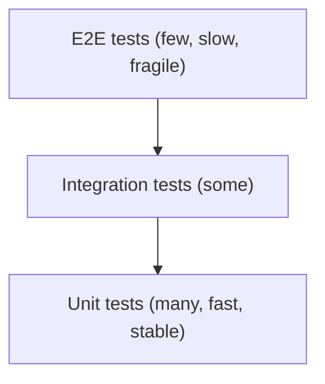

## 1. Introduction

Automated tests are code that checks other code. They give you a **safety net**: you can refactor, upgrade packages or add features and know in seconds if something broke. In a CI pipeline, tests are the gate that decides if a change can be merged (see [CI/CD and DevOps](/informatica/dev-practices/3_ci-cd-devops)).

Main kinds of tests:

- **Unit test**: tests one small unit (a class or method) in isolation, in memory, in milliseconds.
- **Integration test**: tests several parts together, often with a real database or a real HTTP pipeline.
- **End-to-end (E2E) test**: tests the whole system like a user would (browser, UI, all services).

## 2. The test pyramid



The **test pyramid** says: write **many** unit tests, **some** integration tests and **few** E2E tests. The higher you go, the more realistic the test, but also the slower and more expensive to maintain.

<Aside variant="info">
Some teams prefer the "testing trophy", with more integration tests, because modern tools (Testcontainers, `WebApplicationFactory`) make them fast enough. The key idea is the same: get good confidence for a reasonable cost.
</Aside>

## 3. xUnit basics

**xUnit** is the most common test framework for modern .NET (alternatives: NUnit, MSTest). Create a test project and reference the project under test:

```bash
dotnet new xunit -n ProjectHub.Tests
dotnet add ProjectHub.Tests reference src/ProjectHub
dotnet test
```

### 3.1 Fact and Theory

A **`[Fact]`** is a test with no parameters. A **`[Theory]`** runs the same test with different inputs, provided by `[InlineData]`.

```cs
public class RevisionCodeTests
{
    [Fact]
    public void Next_WhenNoRevision_ReturnsA()
    {
        var numbering = new LetterNumbering();

        var result = numbering.Next(null);

        Assert.Equal("A", result);
    }

    [Theory]
    [InlineData("A", "B")]
    [InlineData("B", "C")]
    [InlineData("Y", "Z")]
    public void Next_ReturnsFollowingLetter(string current, string expected)
    {
        var result = new LetterNumbering().Next(current);
        Assert.Equal(expected, result);
    }
}
```

Useful assertions: `Assert.Equal`, `Assert.True`, `Assert.Null`, `Assert.Contains`, `Assert.Throws<T>` and `await Assert.ThrowsAsync<T>(...)`.

<Aside variant="tip">
Name tests so a failure explains itself. A common convention is `Method_Scenario_ExpectedResult`, for example `Approve_WhenAlreadyApproved_Throws`. Libraries like **FluentAssertions** or **Shouldly** also make assertions more readable: `result.Should().Be("A")`.
</Aside>

## 4. Arrange-Act-Assert

Every test should follow three steps, called **AAA**:

1. **Arrange**: prepare objects and input data.
2. **Act**: call the method you are testing (usually one line).
3. **Assert**: check the result.

```cs
[Fact]
public void Approve_WhenDraft_SetsStatusApproved()
{
    // Arrange
    var doc = new Document("P-101 datasheet");

    // Act
    doc.Approve();

    // Assert
    Assert.Equal(DocumentStatus.Approved, doc.Status);
}

[Fact]
public void Approve_WhenAlreadyApproved_Throws()
{
    var doc = new Document("P-101 datasheet");
    doc.Approve();

    Assert.Throws<InvalidOperationException>(() => doc.Approve());
}
```

A good unit test is **FIRST**: Fast, Independent (no shared state between tests), Repeatable (same result every time), Self-validating (pass or fail, no manual check) and Timely (written together with the code).

## 5. Test doubles: fakes, stubs and mocks

A unit test must not touch the database, the network or the clock. You replace real dependencies with **test doubles**:

| Double | What it does |
|---|---|
| **Stub** | Returns fixed data ("when asked for project 1, return this") |
| **Mock** | Records calls so you can verify them ("was `SendAsync` called once?") |
| **Fake** | A simple working implementation (e.g. an in-memory repository) |

This only works if your classes depend on interfaces injected through the constructor. That is why testability and [Dependency Injection](/informatica/csharp/dependency-injection) go together.

### 5.1 Mocking with Moq

```cs
[Fact]
public async Task ApproveAsync_NotifiesOwner()
{
    // Arrange
    var doc = new Document("P&ID Unit 100");
    var repo = new Mock<IDocumentRepository>();
    repo.Setup(r => r.GetByIdAsync(doc.Id)).ReturnsAsync(doc);
    var notifier = new Mock<IDocumentNotifier>();
    var sut = new DocumentApprovalService(repo.Object, notifier.Object);

    // Act
    await sut.ApproveAsync(doc.Id);

    // Assert
    notifier.Verify(n => n.NotifyApprovedAsync(doc), Times.Once);
    repo.Verify(r => r.SaveAsync(doc), Times.Once);
}
```

`sut` means **System Under Test**, a common name for the object being tested.

### 5.2 The same with NSubstitute

**NSubstitute** has a shorter syntax, and many teams prefer it:

```cs
var repo = Substitute.For<IDocumentRepository>();
repo.GetByIdAsync(doc.Id).Returns(doc);
var notifier = Substitute.For<IDocumentNotifier>();

await new DocumentApprovalService(repo, notifier).ApproveAsync(doc.Id);

await notifier.Received(1).NotifyApprovedAsync(doc);
```

<Aside variant="warning">
Don't over-mock. If a test verifies every internal call, it breaks at every refactoring even when the behavior is still correct. Prefer checking **results and state**; use `Verify` only for important side effects, like "an email was sent" or "the data was saved".
</Aside>

### 5.3 Testing with a hand-written fake

For repositories, a small in-memory fake is often clearer than a mock:

```cs
public class InMemoryProjectRepository : IProjectRepository
{
    private readonly Dictionary<Guid, Project> _items = [];

    public Task<Project?> GetByIdAsync(Guid id, CancellationToken ct = default) =>
        Task.FromResult(_items.GetValueOrDefault(id));

    public Task<IReadOnlyList<Project>> GetActiveAsync(CancellationToken ct = default) =>
        Task.FromResult<IReadOnlyList<Project>>(
            _items.Values.Where(p => !p.IsArchived).ToList());

    public void Add(Project project) => _items[project.Id] = project;
}
```

Time is another hidden dependency. In .NET 8, inject **`TimeProvider`** instead of calling `DateTime.UtcNow`, and use `FakeTimeProvider` in tests to control the clock.

## 6. Integration tests with WebApplicationFactory

`WebApplicationFactory<TProgram>` (package `Microsoft.AspNetCore.Mvc.Testing`) starts your real ASP.NET Core app **in memory**, with the full pipeline: routing, middleware, model binding, DI and serialization. You call it with a normal `HttpClient`.

```cs
public class ProjectsApiTests(WebApplicationFactory<Program> factory)
    : IClassFixture<WebApplicationFactory<Program>>
{
    [Fact]
    public async Task GetProject_UnknownId_Returns404()
    {
        var client = factory.CreateClient();

        var response = await client.GetAsync($"/api/projects/{Guid.NewGuid()}");

        Assert.Equal(HttpStatusCode.NotFound, response.StatusCode);
    }
}
```

With minimal APIs, add `public partial class Program { }` at the end of `Program.cs` so the test project can see the `Program` type. You can replace services for the test with `WithWebHostBuilder(b => b.ConfigureTestServices(...))`.

<Aside variant="danger">
Avoid the EF Core **InMemory** provider for integration tests. It is not a relational database: it ignores constraints, transactions and SQL translation, so tests can pass while the real PostgreSQL query fails. Use a real database instead.
</Aside>

### 6.1 Testcontainers for PostgreSQL

**Testcontainers** starts a real PostgreSQL in Docker for your tests and removes it at the end (see [Docker for .NET Developers](/informatica/dev-practices/1_docker)).

```cs
public class PostgresFixture : IAsyncLifetime
{
    public PostgreSqlContainer Db { get; } =
        new PostgreSqlBuilder().WithImage("postgres:16-alpine").Build();

    public Task InitializeAsync() => Db.StartAsync();
    public Task DisposeAsync() => Db.DisposeAsync().AsTask();
}
```

Then pass `Db.GetConnectionString()` to `UseNpgsql(...)` in `ConfigureTestServices`, run your migrations, and the tests use the same database engine as production.

## 7. TDD and code coverage

**Test-Driven Development (TDD)** means writing the test **before** the code, in a short cycle called **Red-Green-Refactor**:

1. **Red**: write a small test that fails.
2. **Green**: write the minimum code to make it pass.
3. **Refactor**: clean up the code while the tests stay green.

TDD pushes you toward small, decoupled classes, because hard-to-test code is painful to write test-first.

**Code coverage** measures the percentage of lines (or branches) executed by tests:

```bash
dotnet test --collect:"XPlat Code Coverage"
```

This produces a Cobertura XML report (via the `coverlet.collector` package, included in the xUnit template). Tools like ReportGenerator turn it into HTML.

<Aside variant="tip">
Interview tip: if asked "what coverage do you aim for?", don't just give a number. Say that coverage shows **what is not tested**, but high coverage does not prove good tests. Many teams use around 70-80% as a guideline and focus on business logic rather than DTOs or generated code.
</Aside>

## 8. Interview questions

**Q: What is the difference between a unit test and an integration test?**
A unit test checks one class or method in isolation, with dependencies replaced by fakes or mocks, so it runs in milliseconds. An integration test checks that several real parts work together, for example the API with a real PostgreSQL database. I use unit tests for business rules and integration tests for things like queries, mapping and the HTTP pipeline.

**Q: What is the difference between a mock and a stub?**
A stub just returns predefined data so the code under test can run. A mock also lets you verify how it was used, for example that a method was called once with certain arguments. In practice, libraries like Moq create objects that can do both.

**Q: How do you test a class that depends on the database?**
For a unit test, I put the data access behind an interface and inject a fake or a mock. For the data access code itself, I write integration tests against a real PostgreSQL instance, usually with Testcontainers, because the in-memory provider doesn't behave like a real relational database.

**Q: What is the Arrange-Act-Assert pattern?**
It's a way to structure every test in three clear blocks: first you set up the data and dependencies, then you execute the single action you want to test, and finally you check the result. It makes tests easy to read, and if the Act part has many lines, it's often a sign the test is doing too much.

**Q: Have you used TDD?**
I know the Red-Green-Refactor cycle: write a failing test, make it pass with minimal code, then refactor. I find it especially useful for business logic with clear rules, like validation or calculations. For exploratory or UI code I often write tests right after the code instead.

**Q: How do you write integration tests for an ASP.NET Core API?**
I use `WebApplicationFactory`, which hosts the real application in memory and gives me an `HttpClient`. I can override services in `ConfigureTestServices`, for example to point EF Core to a test database. Then I send real HTTP requests and check status codes and response bodies.

## 9. Quiz

import Quiz from '../../../components/Quiz.jsx';

<Quiz client:load questions={[
{
question:"According to the test pyramid, which tests should you have the most of?",
answers:{ a:"End-to-end tests", b:"Unit tests", c:"Manual tests", d:"Integration tests" },
correctAnswer:"b"
},
{
question:"In xUnit, which attribute runs the same test with different input values?",
answers:{ a:"`[Fact]`", b:"`[TestMethod]`", c:"`[Theory]` with `[InlineData]`", d:"`[Repeat]`" },
correctAnswer:"c"
},
{
question:"What does the 'Act' step of AAA contain?",
answers:{ a:"Creating mocks", b:"Checking the result", c:"Cleaning up the database", d:"Calling the method under test" },
correctAnswer:"d"
},
{
question:"Which test double lets you verify that a method was called once?",
answers:{ a:"A mock", b:"A stub", c:"A dummy", d:"A DTO" },
correctAnswer:"a"
},
{
question:"In Moq, how do you get the object to pass to the class under test?",
answers:{ a:"`mock.Instance`", b:"`mock.Object`", c:"`mock.Value`", d:"`mock.Create()`" },
correctAnswer:"b"
},
{
question:"Why is the EF Core InMemory provider a poor choice for integration tests?",
answers:{ a:"It is too slow", b:"It requires Docker", c:"It does not behave like a real relational database", d:"It only works with SQL Server" },
correctAnswer:"c"
},
{
question:"What does `WebApplicationFactory` do?",
answers:{ a:"Hosts the real ASP.NET Core app in memory for tests", b:"Generates controllers automatically", c:"Deploys the app to Docker", d:"Creates mocks for every service" },
correctAnswer:"a"
},
{
question:"What is the correct order of the TDD cycle?",
answers:{ a:"Green, Red, Refactor", b:"Refactor, Red, Green", c:"Red, Refactor, Green", d:"Red, Green, Refactor" },
correctAnswer:"d"
}
]} />

## 10. Exercises

### 10.1 Unit test a domain rule

**Goal:** practice `[Fact]`, `[Theory]` and AAA.

1. Create a `Tag` record with a `Code` property and a static `IsValid(string code)` method: valid codes look like `P-101` or `V-2001` (one letter, dash, 3-4 digits).
2. Create an xUnit project and reference the domain project.
3. Write one `[Theory]` with at least 3 valid codes and one with at least 3 invalid codes (empty, lowercase, missing dash).
4. Run `dotnet test` and make all tests pass.

*Hint: a regex like `^[A-Z]-\d{3,4}$` is enough.*

### 10.2 Mock a dependency

**Goal:** test a service in isolation with Moq or NSubstitute.

1. Write a `RevisionService` that loads a `Document` from `IDocumentRepository`, adds a new `Revision` and calls `INotifier.SendAsync`.
2. Write a test that checks the document has one more revision.
3. Write a test that verifies `SendAsync` was called exactly once.
4. Write a test where the repository returns `null` and assert that `KeyNotFoundException` is thrown.

*Hint: use `await Assert.ThrowsAsync<KeyNotFoundException>(() => sut.AddRevisionAsync(id))`.*

### 10.3 Integration test with a real database

**Goal:** test an API endpoint end to end with PostgreSQL.

1. Take a minimal API with `POST /api/projects` and `GET /api/projects/{id}` using EF Core and Npgsql.
2. Add the packages `Microsoft.AspNetCore.Mvc.Testing` and `Testcontainers.PostgreSql` to the test project.
3. Create a custom `WebApplicationFactory` that replaces the `DbContext` connection string with the container one.
4. Write a test that creates a project with `POST`, reads it back with `GET`, and checks the name.

*Hint: call `db.Database.MigrateAsync()` once after the container starts, and remember `public partial class Program { }`.*
