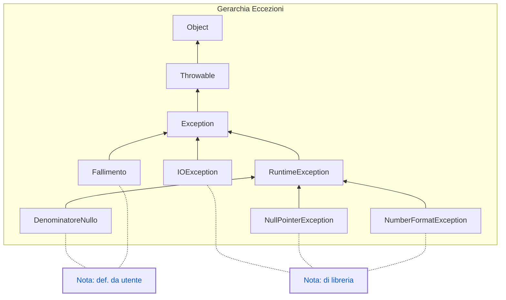

## 1. Introduzione

Le **eccezioni** sono il meccanismo di Java per gestire situazioni impreviste a **runtime**: un file non trovato, una divisione per zero, un indice fuori range...

Senza gestione degli errori il programma si interrompe bruscamente (**crash**). Con `try/catch` possiamo intercettare il problema e reagire in modo controllato.

In Java le eccezioni sono **oggetti** — istanze di classi che estendono `Throwable`.

### 1.1 Gerarchia delle eccezioni



### 1.2 Tipi di eccezioni

- **Checked exceptions** (controllate): il compilatore obbliga a gestirle o dichiararle con `throws`. Es: `IOException`.
- **Unchecked exceptions** (non controllate): derivano da `RuntimeException`, non sono obbligatorie. Es: `NullPointerException`, `ArithmeticException`.

## 2. Il blocco try/catch

### 2.1 Sintassi base

```java
try {
    // codice che potrebbe lanciare un'eccezione
} catch (TipoEccezione e) {
    // cosa fare se l'eccezione si verifica
} finally {
    // eseguito SEMPRE, con o senza eccezione
}
```

### 2.2 Esempio: divisione per zero

```java
public class Main {
    public static void main(String[] args) {

        int a = 10;
        int b = 0;

        try {
            int risultato = a / b;
            System.out.println("Risultato: " + risultato);
        } catch (ArithmeticException e) {
            System.out.println("Errore: non puoi dividere per zero!");
        }
    }
}
```

Output:
```
Errore: non puoi dividere per zero!
```

### 2.3 Esempio: NullPointerException

```java
public class Main {
    public static void main(String[] args) {
        String testo = null;
        try {
            System.out.println(testo.length());
        } catch (NullPointerException e) {
            System.out.println("Errore: accesso a un riferimento nullo!");
        }
    }
}
```

### 2.4 Più blocchi catch

Si possono gestire più tipi di eccezione:

```java
try {
    // operazioni rischiose
} catch (NullPointerException e) {
    System.out.println("Oggetto nullo!");
} catch (ArithmeticException e) {
    System.out.println("Errore matematico!");
} catch (Exception e) {
    // cattura qualsiasi altra eccezione
    System.out.println("Errore generico: " + e.getMessage());
}
```

`catch (Exception e)` va **sempre per ultimo** — è il più generico.

### 2.5 Il blocco finally

```java
try {
    System.out.println("Apro il file...");
    // lettura file
} catch (Exception e) {
    System.out.println("Errore durante la lettura.");
} finally {
    System.out.println("Chiudo le risorse."); // eseguito sempre
}
```

Usato tipicamente per chiudere file, connessioni, scanner.

## 3. Lanciare eccezioni con throw

Puoi **lanciare** un'eccezione manualmente:

```java
public static void controllaEta(int eta) {
    if (eta < 0) {
        throw new IllegalArgumentException("L'età non può essere negativa!");
    }
    System.out.println("Età valida: " + eta);
}

public class Main {
    public static void main(String[] args) {
        try {
            controllaEta(-5);
        } catch (IllegalArgumentException e) {
            System.out.println("Errore: " + e.getMessage());
        }
    }
}
```

## 4. Eccezioni personalizzate

Java permette di definire eccezioni proprie estendendo `RuntimeException` (unchecked) o `Exception` (checked).

```java
class DenominatoreNulloException extends RuntimeException {
    public DenominatoreNulloException(String message) {
        super(message);
    }
}

public class Main {
    public static void main(String[] args) {
        try {
            System.out.println(divide(10, 0));
        } catch (DenominatoreNulloException e) {
            System.out.println(e.getMessage());
        }
    }

    public static int divide(int numeratore, int denominatore) {
        if (denominatore == 0) {
            throw new DenominatoreNulloException("Denominatore uguale a 0!");
        }
        return numeratore / denominatore;
    }
}
```

## 5. getMessage() e printStackTrace()

Ogni eccezione porta informazioni sull'errore:

```java
} catch (Exception e) {
    System.out.println(e.getMessage());   // messaggio breve
    e.printStackTrace();                  // intera catena di chiamate
}
```

`printStackTrace()` produce output come:

```
java.lang.ArithmeticException: / by zero
    at Main.main(Main.java:8)
```

## 6. Leggere gli Error Log

Quando il programma crasha, Java stampa una **stack trace**. Saperla leggere è essenziale per il debug.

### 6.1 Struttura

```
Exception in thread "main" java.lang.NullPointerException: Cannot invoke "String.length()" because "str" is null
    at com.esempio.Main.stampaLunghezza(Main.java:12)   ← riga del TUO codice
    at com.esempio.Main.main(Main.java:6)               ← dove è stato chiamato
```

**Come leggerla:**

1. **Prima riga** → tipo di eccezione e messaggio
2. **Prima riga `at`** → classe e riga dove si è verificato il problema
3. **Righe successive** → catena di chiamate che ha portato all'errore

**Regola pratica**: la prima riga `at` con il tuo package è la riga da correggere.

### 6.2 Eccezioni comuni

| Eccezione                          | Causa tipica                            |
| ---------------------------------- | --------------------------------------- |
| `NullPointerException`             | Usare un oggetto `null`                 |
| `ArrayIndexOutOfBoundsException`   | Indice fuori dal range dell'array       |
| `NumberFormatException`            | Convertire una stringa non numerica     |
| `ArithmeticException`              | Divisione per zero                      |
| `ClassCastException`               | Cast non valido tra tipi                |
| `IOException`                      | Errore su file o rete                   |
| `StackOverflowError`               | Ricorsione infinita                     |

## 7. Esempio IOException (eccezione controllata)

```java
import java.io.FileReader;
import java.io.IOException;

public class Main {
    public static void main(String[] args) {
        try {
            FileReader file = new FileReader("dati.txt");
            // lettura file...
        } catch (IOException e) {
            System.out.println("File non trovato: " + e.getMessage());
        }
    }
}
```

`IOException` è **checked**: il compilatore obbliga a gestirla.

## 8. Quiz a risposta multipla

import Quiz from '../../../components/Quiz.jsx';

<Quiz client:load questions={[
{
question: "Cosa fa il blocco catch?",
answers: {
a: 'Interrompe definitivamente il programma',
b: 'Intercetta e gestisce un\'eccezione',
c: 'Lancia una nuova eccezione',
d: 'Ignora tutti gli errori'
},
correctAnswer: 'b'
},
{
question: "Quale blocco viene eseguito SEMPRE, con o senza eccezione?",
answers: {
a: 'try',
b: 'catch',
c: 'finally',
d: 'else'
},
correctAnswer: 'c'
},
{
question: "Quale metodo stampa l'intera stack trace?",
answers: {
a: 'e.getMessage()',
b: 'e.print()',
c: 'e.printStackTrace()',
d: 'e.getStack()'
},
correctAnswer: 'c'
},
{
question: "Quale eccezione si verifica dividendo per zero?",
answers: {
a: 'NullPointerException',
b: 'DivisionException',
c: 'ArithmeticException',
d: 'MathException'
},
correctAnswer: 'c'
},
{
question: "Qual è la differenza tra checked e unchecked exception?",
answers: {
a: 'Le checked sono più gravi',
b: 'Le checked devono essere gestite obbligatoriamente dal compilatore',
c: 'Le unchecked derivano da Exception',
d: 'Non c\'è differenza pratica'
},
correctAnswer: 'b'
}
]} />

## 9. Esercizi

[Gestione delle eccezioni in linguaggio Java: esercizi risolti](https://www.edutecnica.it/informatica/eccezionix/eccezionix.htm)

### 9.1 Esercizio: divisione sicura

Scrivi un metodo `dividi(int a, int b)` che gestisce la divisione per zero.

<details>
<summary>💡 Mostra soluzione</summary>

```java
public class Main {

    public static int dividi(int a, int b) {
        try {
            return a / b;
        } catch (ArithmeticException e) {
            System.out.println("Impossibile dividere per zero!");
            return 0;
        }
    }

    public static void main(String[] args) {
        System.out.println(dividi(10, 2)); // -> 5
        System.out.println(dividi(10, 0)); // -> messaggio + 0
    }
}
```

</details>

### 9.2 Esercizio: input numerico sicuro

Chiedi all'utente un numero con Scanner, gestisci il caso in cui inserisca una stringa.

<details>
<summary>💡 Mostra soluzione</summary>

```java
import java.util.Scanner;

public class Main {
    public static void main(String[] args) {

        Scanner input = new Scanner(System.in);
        System.out.print("Inserisci un numero: ");

        try {
            int numero = Integer.parseInt(input.nextLine());
            System.out.println("Numero inserito: " + numero);
        } catch (NumberFormatException e) {
            System.out.println("Errore: non è un numero valido!");
        } finally {
            input.close();
        }
    }
}
```

</details>

### 9.3 Esercizio: eccezione personalizzata

Crea un'eccezione `EtaNonValidaException` e usala in un metodo che verifica che l'età sia tra 0 e 120.

<details>
<summary>💡 Mostra soluzione</summary>

```java
class EtaNonValidaException extends RuntimeException {
    public EtaNonValidaException(String message) {
        super(message);
    }
}

public class Main {

    public static void verificaEta(int eta) {
        if (eta < 0 || eta > 120) {
            throw new EtaNonValidaException("Età non valida: " + eta);
        }
        System.out.println("Età accettata: " + eta);
    }

    public static void main(String[] args) {
        try {
            verificaEta(25);
            verificaEta(150);
        } catch (EtaNonValidaException e) {
            System.out.println("Errore: " + e.getMessage());
        }
    }
}
```

</details>
