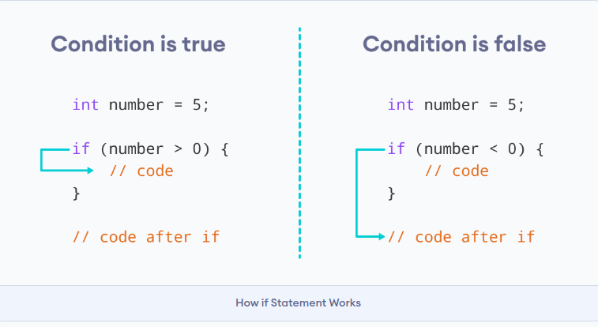

## 1. Descrizione

L'istruzione **if-else** permette di controllare il flusso di esecuzione di un programma.

Il codice contenuto nel blocco `if` viene eseguito **solo se la condizione è vera (`true`)**.

- Se la `condizione` è vera → viene eseguito il blocco `if`
- Se la `condizione` è falsa → viene eseguito il blocco `else` (se presente)

In **Java** una condizione deve restituire **obbligatoriamente** un valore booleano (`true` oppure `false`).



## 2. Sintassi

Sintassi base dell'istruzione `if`:

``` java
if (condizione) {
  // istruzioni eseguite se la condizione è vera
}
```

L'`if` statement valuta la `condizione` dentro alle parentesi `( )`.

- Se la `condizione` risulta `true`, il codice dentro al corpo dell'`if` viene *eseguito*.
- Se la `condizione` risulta `false`, il codice dentro al corpo dell'`if` viene *evitato*.

<Aside variant="info">
Il codice tra `{ }` prende il nome di corpo dell'istruzione if
</Aside>

## 3. Funzionamento

### 3.1 If semplice
L'istruzione **if** permette di verificare determinate condizioni ed ha la seguente sintassi:

``` java
//...

if (condizione) {
    //....
}

//...
```

In questo caso **se** l'espressione risulta **vera**, fa eseguire l'istruzione immediatamente successiva, **altrimenti** (se la condizione è **falsa**) si salta l'istruzione (o il blocco di istruzioni)
e si procede nell'esecuzione delle istruzioni successive.

### 3.2 If - Else

Permette di scegliere tra due alternative.

``` java
if (condizione) {
    // caso vero
} else {
    // caso falso
}
```

### 3.3 If - Else If - Else

Permette di controllare più condizioni.

``` java
if (condizione1) {
    // codice
}
else if (condizione2) {
    // codice
} else {
    // caso finale
}
```

Così si può comandare il flusso del programma decidendo di eseguire una parte di codice oppure no (nel caso del solo **if**),
di fare una scelta tra due parti di codice (nel caso **if - else**) o di fare una scelta tra più parti di codice (nel caso **if - else if - else**).

## 4. In sintesi

- Utilizzare l'`if` istruzione per specificare un blocco di codice da eseguire se una condizione è `true`.
- Utilizzare l'`else` istruzione per specificare un blocco di codice da eseguire se la condizione è `false`.
- Utilizzare l'`else if` istruzione per specificare una nuova condizione se la prima condizione è `false`.

### 4.1 Esempio

``` java
if (risultato_esame >= 18){
    printf ("Complimenti hai superato l'esame");
}
else if (risultato_esame >= 15) {
    printf ("Devi sostenere l'orale per questo esame");
}
else {
    printf ("Non hai superato l'esame");
}
```

## 5. Quiz a risposta multipla

import Quiz from '../../../components/Quiz.jsx';

<Quiz client:load questions={[
{
question: "In Java, che tipo deve restituire la condizione di un if?",
answers: {
a: 'int',
b: 'boolean',
c: 'string',
d: 'double'
},
correctAnswer: 'b'
},
{
question: "Quando viene eseguito il blocco else?",
answers: {
a: 'Sempre',
b: 'Quando la condizione è falsa',
c: 'Quando la condizione è vera',
d: 'Solo nei cicli'
},
correctAnswer: 'b'
},
{
question: "Quale sintassi è corretta in Java?",
answers: {
a: 'if condizione {}',
b: 'if(condizione) {}',
c: 'if = condizione {}',
d: 'if -> condizione {}'
},
correctAnswer: 'b'
},
{
question: "A cosa serve else if?",
answers: {
a: 'Ripetere il codice',
b: 'Controllare più condizioni',
c: 'Terminare il programma',
d: 'Stampare automaticamente'
},
correctAnswer: 'b'
},
{
question: "Quanti else può avere un if?",
answers: {
a: 'Infiniti',
b: 'Due',
c: 'Uno solo',
d: 'Nessuno'
},
correctAnswer: 'c'
}
]} />

## 6. Esercizi

[Esercizi Online](https://codegrind.it/esercizi/java/condizionali-if?srsltid=AfmBOoryAliSGe0F-gn4NyWnWFbiEFd5Qj5aecRF1XTrn3s9TME25lMT#google_vignette)

### 6.1 Esercizio

realizzare un programma che chiede all'utente 3 valori (valore1, valore2, valore3), in base ai quali il programma restituisce in output i 3 valori dal maggiore al minore.

> Esempio Output:
inserisci 3 numeri:
4
3
5
numero3 >= numero1 >= numero2
<details>
<summary>💡 Mostra soluzione</summary>

``` java
import java.util.Scanner;

public class Main {
    public static void main(String[] args) {

        Scanner input = new Scanner(System.in);

        int numero1, numero2, numero3;

        System.out.println("Inserisci 3 numeri:");
        numero1 = input.nextInt();
        numero2 = input.nextInt();
        numero3 = input.nextInt();

        if (numero1 >= numero2 && numero1 >= numero3) {
            if (numero2 >= numero3)
                System.out.println("numero1 >= numero2 >= numero3");
            else
                System.out.println("numero1 >= numero3 >= numero2");
        }
        else if (numero2 >= numero1 && numero2 >= numero3) {
            if (numero1 >= numero3)
                System.out.println("numero2 >= numero1 >= numero3");
            else
                System.out.println("numero2 >= numero3 >= numero1");
        }
        else {
            if (numero2 >= numero1)
                System.out.println("numero3 >= numero2 >= numero1");
            else
                System.out.println("numero3 >= numero1 >= numero2");
        }

        input.close();
    }
}
```

</details>

### 6.2 Esercizio

realizzare un programma che chiede all'utente 2 valori, in base ai quali il programma dice qual è il maggiore, oppure uguali nel caso.

> Esempio Output:
inserisci primo valore:  7
inserisci secondo valore: 3
il numero maggiore e':  7
<details>
<summary>💡 Mostra soluzione</summary>

``` java
import java.util.Scanner;

public class Main {
    public static void main(String[] args){

        Scanner input = new Scanner(System.in);

        int x, y;

        System.out.print("Inserisci primo valore: ");
        x = input.nextInt();

        System.out.print("Inserisci secondo valore: ");
        y = input.nextInt();

        if(x > y){
            System.out.println("Il numero maggiore e': " + x);
        }
        else if(x < y){
            System.out.println("Il numero maggiore e': " + y);
        }
        else{
            System.out.println("I numeri sono uguali");
        }

        input.close();
    }
}
```

</details>

### 6.3 Esercizio

realizzare un programma che chiede all'utente 1 valore, se il valore è:

$x>1 ∧ x < 5$  → il voto è estremamente insufficiente

$x>=5 ∧ x < 6$  → il voto è insufficiente

$x>=6 ∧ x < 7$  → il voto è sufficiente

$x>=7 ∧ x < 8$  → il voto è buono

$x>=8 ∧ x < 9$  → il voto è ottimo

$x>=9 ∧ x <= 10$  → il voto è eccellente

$x<0 ∨ x>10$  → il voto non è valido

> Esempio Output:
inserisci valore:  7
il voto e' buono
<details>
<summary>💡 Mostra soluzione</summary>

``` java
import java.util.Scanner;

public class Main {
    public static void main(String[] args){

        Scanner input = new Scanner(System.in);

        double val;

        System.out.print("Inserisci valore: ");
        val = input.nextDouble();

        if(val > 1 && val < 5){
            System.out.println("il voto e' estremamente insufficiente");
        }
        else if(val >= 5 && val < 6){
            System.out.println("il voto e' insufficiente");
        }
        else if(val >= 6 && val < 7){
            System.out.println("il voto e' sufficiente");
        }
        else if(val >= 7 && val < 8){
            System.out.println("il voto e' buono");
        }
        else if(val >= 8 && val < 9){
            System.out.println("il voto e' ottimo");
        }
        else if(val >= 9 && val <= 10){
            System.out.println("il voto e' eccellente");
        }
        else if(val < 0 || val > 10){
            System.out.println("il voto non e' valido");
        }

        input.close();
    }
}
```

</details>
