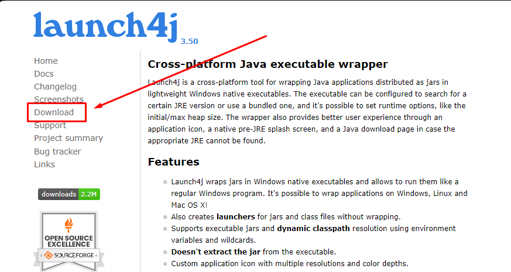

## 1. Video Tutorial

[Youtube Video Tutorial](https://www.youtube.com/watch?v=e3S3BOvpWic)

1. Scaricare [launch4j](https://launch4j.sourceforge.net)

    

2. Avviare launch4j
    1. Compilare il campo “Output file” (es. C:\Users\Altro\programma.exe)
    2. Nel campo “Jar” passare il percorso del proprio programma `.jar` da convertire (es. C:\Users\Altro\programma.jar)
    3. Attivare l'opzione “Stay alive after launching a GUI application”
    4. (Opzionale) Per dare un icona al programma, compilare il campo “Icon”, passandoci il percorso di un immagine `.ico` 
    5. Nel menu in alto, andare su JRE
        1. in “Min JRE version” inserire `1.4.0`
    6. Premere il pulsante in alto con l'icana di un ingranaggio ⚙️ per iniziare la conversione.
3. Se non si sono verificati errori, verrà generato un file .exe

<Aside variant="info">
**Attenzione**: una volta generato il file .exe esso se fa riferimenti per la sua corretta esecuzione ad immagini e/o file deve essere inserito nella root principale del progetto, altrimenti non troverà le informazioni rilevanti per il suo corretto funzionamento.
</Aside>