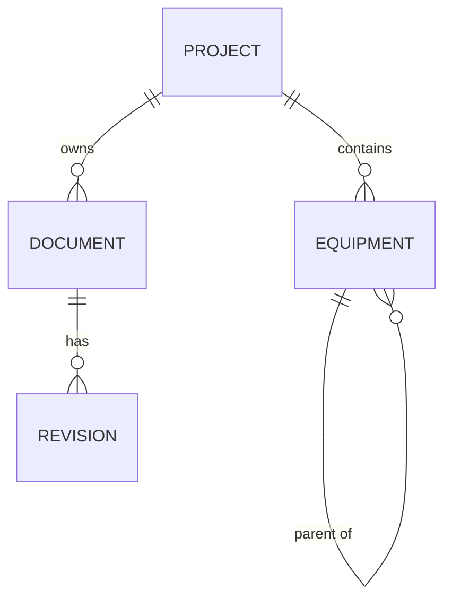
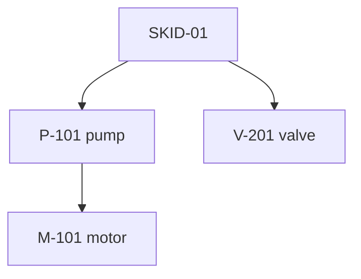

## 1. Introduction

Most developers can write a simple `SELECT ... WHERE`. In a technical interview, however, you are often asked to go one step further: combine tables, find rows that are *missing*, rank results, or walk a hierarchy. This lesson covers the SQL tools that solve those problems in **PostgreSQL 16**.

We will use a small schema taken from engineering data management: projects contain equipment, equipment can contain other equipment, and documents have revisions.

```sql
CREATE TABLE project (
    id          int GENERATED ALWAYS AS IDENTITY PRIMARY KEY,
    code        text NOT NULL UNIQUE,
    name        text NOT NULL
);

CREATE TABLE equipment (
    id          int GENERATED ALWAYS AS IDENTITY PRIMARY KEY,
    project_id  int NOT NULL REFERENCES project(id),
    parent_id   int REFERENCES equipment(id),   -- NULL = top level
    tag         text NOT NULL,                  -- e.g. 'P-101'
    kind        text NOT NULL                   -- 'pump', 'valve', ...
);

CREATE TABLE document (
    id          int GENERATED ALWAYS AS IDENTITY PRIMARY KEY,
    project_id  int NOT NULL REFERENCES project(id),
    number      text NOT NULL,
    title       text NOT NULL
);

CREATE TABLE revision (
    id           int GENERATED ALWAYS AS IDENTITY PRIMARY KEY,
    document_id  int NOT NULL REFERENCES document(id),
    rev_code     text NOT NULL,                 -- 'A', 'B', '0', '1'
    issued_at    timestamptz NOT NULL,
    issued_by    int                            -- user id
);
```



## 2. GROUP BY and HAVING recap

**GROUP BY** collapses many rows into one row per group. **Aggregate functions** (`COUNT`, `SUM`, `AVG`, `MIN`, `MAX`) compute one value per group. **HAVING** filters *groups*, while **WHERE** filters *rows* before grouping.

```sql
-- Projects with more than 50 pumps
SELECT p.code, COUNT(*) AS pump_count
FROM project p
JOIN equipment e ON e.project_id = p.id
WHERE e.kind = 'pump'          -- row filter (before grouping)
GROUP BY p.code
HAVING COUNT(*) > 50           -- group filter (after grouping)
ORDER BY pump_count DESC;
```

<Aside variant="info">
The logical order of execution is: `FROM` / `JOIN` → `WHERE` → `GROUP BY` → `HAVING` → `SELECT` → `ORDER BY` → `LIMIT`. This explains why you cannot use a `SELECT` alias inside `WHERE`, but you can use it in `ORDER BY`.
</Aside>

PostgreSQL also supports `FILTER` to compute several conditional counts in one pass:

```sql
SELECT p.code,
       COUNT(*) FILTER (WHERE e.kind = 'pump')  AS pumps,
       COUNT(*) FILTER (WHERE e.kind = 'valve') AS valves
FROM project p
JOIN equipment e ON e.project_id = p.id
GROUP BY p.code;
```

## 3. JOIN types

A **JOIN** combines rows from two tables using a condition.

| Join | Returns |
|---|---|
| `INNER JOIN` | Only rows with a match on both sides |
| `LEFT JOIN` | All rows from the left table, NULLs where there is no match on the right |
| `RIGHT JOIN` | Mirror of LEFT JOIN (rarely used; swap the tables instead) |
| `FULL JOIN` | All rows from both sides, NULLs where there is no match |
| `CROSS JOIN` | Every combination (Cartesian product) |

```sql
-- Every project, with its document count (0 if none)
SELECT p.code, COUNT(d.id) AS doc_count
FROM project p
LEFT JOIN document d ON d.project_id = p.id
GROUP BY p.code;
```

<Aside variant="warning">
With a `LEFT JOIN`, use `COUNT(d.id)` and not `COUNT(*)`. `COUNT(*)` counts the row produced for a project with no documents, so you would get 1 instead of 0.
</Aside>

### 3.1 Self-join

A **self-join** joins a table with itself. You need two different aliases.

```sql
-- Each piece of equipment with the tag of its parent
SELECT child.tag AS child_tag, parent.tag AS parent_tag
FROM equipment child
LEFT JOIN equipment parent ON parent.id = child.parent_id;
```

### 3.2 Anti-join: finding missing rows

An **anti-join** returns rows from table A that have **no** match in table B. A classic question: "find documents that have never been issued".

```sql
-- Version 1: LEFT JOIN + IS NULL
SELECT d.number
FROM document d
LEFT JOIN revision r ON r.document_id = d.id
WHERE r.id IS NULL;

-- Version 2: NOT EXISTS (usually the clearest)
SELECT d.number
FROM document d
WHERE NOT EXISTS (
    SELECT 1 FROM revision r WHERE r.document_id = d.id
);
```

<Aside variant="danger">
Avoid `NOT IN (SELECT ...)` when the subquery column can contain NULL. If a single value is NULL, `NOT IN` returns no rows at all, because `x <> NULL` is unknown. `NOT EXISTS` does not have this problem.
</Aside>

## 4. Subqueries and EXISTS

A **subquery** is a query inside another query. It can appear in three places:

```sql
-- 1. Scalar subquery in SELECT (must return one value)
SELECT d.number,
       (SELECT MAX(r.issued_at) FROM revision r
        WHERE r.document_id = d.id) AS last_issue
FROM document d;

-- 2. Subquery in WHERE with IN
SELECT * FROM document
WHERE project_id IN (SELECT id FROM project WHERE code LIKE 'OFF-%');

-- 3. Derived table in FROM
SELECT kind, avg_per_project
FROM (
    SELECT kind, COUNT(*) / COUNT(DISTINCT project_id)::numeric AS avg_per_project
    FROM equipment GROUP BY kind
) AS stats
WHERE avg_per_project > 10;
```

The first example is a **correlated subquery**: it references the outer row (`d.id`), so logically it runs once per row. PostgreSQL can often optimize it, but a JOIN or a window function is frequently faster on large tables.

**EXISTS** returns true as soon as the subquery finds *one* row. It does not care about the selected columns, so `SELECT 1` is the convention.

```sql
-- Projects that have at least one revision issued in 2026
SELECT p.code
FROM project p
WHERE EXISTS (
    SELECT 1
    FROM document d
    JOIN revision r ON r.document_id = d.id
    WHERE d.project_id = p.id
      AND r.issued_at >= '2026-01-01'
);
```

## 5. Common Table Expressions (CTE)

A **CTE** is a named, temporary result defined with `WITH`. It makes long queries readable, like extracting a variable in C#.

```sql
WITH last_revision AS (
    SELECT document_id, MAX(issued_at) AS last_issue
    FROM revision
    GROUP BY document_id
)
SELECT d.number, lr.last_issue
FROM document d
JOIN last_revision lr ON lr.document_id = d.id
WHERE lr.last_issue < now() - interval '1 year';
```

<Aside variant="info">
Since PostgreSQL 12, a CTE used only once is usually **inlined** into the main query, so it is not slower than a subquery. You can force the old behaviour with `WITH x AS MATERIALIZED (...)`.
</Aside>

### 5.1 Recursive CTE: walking the equipment tree

Hierarchies (equipment trees, folder structures, bill of materials) are stored with a `parent_id` column. A **recursive CTE** walks them in one query. It has two parts joined by `UNION ALL`: an **anchor** (the starting rows) and a **recursive member** (that references the CTE itself).

```sql
WITH RECURSIVE tree AS (
    -- anchor: the root equipment
    SELECT id, parent_id, tag, 0 AS depth, tag::text AS path
    FROM equipment
    WHERE tag = 'SKID-01'

    UNION ALL

    -- recursive member: children of rows already found
    SELECT e.id, e.parent_id, e.tag, t.depth + 1, t.path || ' > ' || e.tag
    FROM equipment e
    JOIN tree t ON e.parent_id = t.id
)
SELECT depth, path FROM tree ORDER BY path;
```



The recursion stops when the recursive member returns no new rows. If the data contains a cycle (A is parent of B, B is parent of A), the query never ends. PostgreSQL 14+ offers `CYCLE id SET is_cycle USING visited` to detect it.

<Aside variant="tip">
Interview tip: if they ask "how do you store and query a tree in a relational database?", answer with an adjacency list (`parent_id`) plus a recursive CTE. Then mention alternatives like materialized paths or the `ltree` extension to show breadth.
</Aside>

## 6. Window functions

A **window function** computes a value over a set of rows *related to the current row*, but, unlike `GROUP BY`, it **does not collapse** the rows. The syntax is `function() OVER (PARTITION BY ... ORDER BY ...)`.

- **PARTITION BY** splits rows into groups (like GROUP BY, but rows are kept).
- **ORDER BY** inside `OVER` defines the order within each partition.

### 6.1 ROW_NUMBER, RANK, DENSE_RANK

```sql
SELECT document_id, rev_code, issued_at,
       ROW_NUMBER() OVER (PARTITION BY document_id ORDER BY issued_at DESC) AS rn
FROM revision;
```

The difference is visible only with ties:

| issued_at | ROW_NUMBER | RANK | DENSE_RANK |
|---|---|---|---|
| 10 Jan | 1 | 1 | 1 |
| 10 Jan | 2 | 1 | 1 |
| 15 Jan | 3 | 3 | 2 |

### 6.2 The "latest row per group" pattern

This is one of the most common interview questions: "get the latest revision of every document".

```sql
WITH ranked AS (
    SELECT r.*,
           ROW_NUMBER() OVER (PARTITION BY document_id
                              ORDER BY issued_at DESC) AS rn
    FROM revision r
)
SELECT d.number, ranked.rev_code, ranked.issued_at
FROM ranked
JOIN document d ON d.id = ranked.document_id
WHERE rn = 1;
```

You cannot write `WHERE rn = 1` in the same query that defines `rn`, because window functions are computed after `WHERE`. That is why we wrap it in a CTE.

<Aside variant="tip">
PostgreSQL also has `SELECT DISTINCT ON (document_id) ... ORDER BY document_id, issued_at DESC`, which is shorter for "latest per group". It is PostgreSQL-specific, so in an interview show `ROW_NUMBER` first and mention `DISTINCT ON` as a bonus.
</Aside>

### 6.3 Running totals with SUM OVER

```sql
-- Cumulative number of revisions issued per project, day by day
SELECT d.project_id,
       r.issued_at::date AS day,
       COUNT(*) AS issued_today,
       SUM(COUNT(*)) OVER (PARTITION BY d.project_id
                           ORDER BY r.issued_at::date) AS running_total
FROM revision r
JOIN document d ON d.id = r.document_id
GROUP BY d.project_id, r.issued_at::date;
```

Here the window function runs *after* `GROUP BY`, so it can aggregate an aggregate.

### 6.4 LAG and LEAD

**LAG** reads a value from the previous row in the window, **LEAD** from the next one. Perfect for "time between revisions".

```sql
SELECT document_id, rev_code, issued_at,
       issued_at - LAG(issued_at) OVER (PARTITION BY document_id
                                        ORDER BY issued_at) AS time_since_prev
FROM revision;
```

For the first revision of each document, `LAG` returns NULL. You can give a default: `LAG(issued_at, 1, issued_at)`.

## 7. Interview questions

**Q: What is the difference between WHERE and HAVING?**
WHERE filters individual rows before they are grouped, so it cannot use aggregate functions. HAVING filters the groups after GROUP BY, so it can use conditions like `COUNT(*) > 5`. If a condition does not need an aggregate, I put it in WHERE because it reduces the rows earlier.

**Q: Explain the difference between INNER JOIN and LEFT JOIN.**
An inner join returns only the rows that have a match in both tables. A left join returns all rows from the left table, and fills the right-side columns with NULL when there is no match. I use a left join when the "parent" row must appear even without children, for example a project with zero documents.

**Q: How would you find customers, or documents, that have no related rows?**
That is an anti-join. I would use `NOT EXISTS` with a correlated subquery, or a `LEFT JOIN` with `WHERE child.id IS NULL`. I avoid `NOT IN` because it behaves unexpectedly if the subquery returns a NULL.

**Q: What is a CTE and when would you use a recursive one?**
A CTE is a named temporary result set defined with WITH, mainly to make complex queries readable. A recursive CTE references itself, and I use it for hierarchical data, like an equipment tree stored with a parent_id column. It has an anchor query and a recursive part combined with UNION ALL.

**Q: What is the difference between a window function and GROUP BY?**
GROUP BY collapses rows, so you get one row per group. A window function computes a value across related rows but keeps every row in the output. For example, with ROW_NUMBER over a partition I can number revisions per document and still see each revision.

**Q: How do you get the latest revision for each document?**
I would use ROW_NUMBER partitioned by document_id and ordered by issued_at descending, inside a CTE, and then filter on row number equal to 1. In PostgreSQL I could also use DISTINCT ON, which is shorter but not standard SQL.

**Q: What is the difference between ROW_NUMBER, RANK and DENSE_RANK?**
They differ only with ties. ROW_NUMBER always gives unique consecutive numbers, RANK gives the same number to ties and then skips, and DENSE_RANK gives the same number to ties without leaving gaps.

## 8. Quiz

import Quiz from '../../../components/Quiz.jsx';

<Quiz client:load questions={[
{
question:"Which clause filters groups after aggregation?",
answers:{ a:"WHERE", b:"ORDER BY", c:"HAVING", d:"LIMIT" },
correctAnswer:"c"
},
{
question:"A project has no documents. What does `COUNT(d.id)` return for it after `project LEFT JOIN document`?",
answers:{ a:"0", b:"1", c:"NULL", d:"The query fails" },
correctAnswer:"a"
},
{
question:"Why is `NOT IN (subquery)` risky?",
answers:{ a:"It is not supported in PostgreSQL", b:"If the subquery returns a NULL, no rows are returned", c:"It always does a full table scan", d:"It cannot be used with text columns" },
correctAnswer:"b"
},
{
question:"What are the two parts of a recursive CTE?",
answers:{ a:"A SELECT and an UPDATE", b:"A HAVING and a GROUP BY", c:"A window and a partition", d:"An anchor member and a recursive member joined by UNION ALL" },
correctAnswer:"d"
},
{
question:"What is the main difference between a window function and GROUP BY?",
answers:{ a:"A window function keeps all the rows in the result", b:"A window function is only available in SQL Server", c:"GROUP BY cannot use COUNT", d:"There is no difference" },
correctAnswer:"a"
},
{
question:"Three revisions have dates 10 Jan, 10 Jan, 15 Jan. What does RANK() give to the 15 Jan row (ordered by date)?",
answers:{ a:"2", b:"3", c:"1", d:"4" },
correctAnswer:"b"
},
{
question:"Which function returns the value from the previous row in the window?",
answers:{ a:"LEAD", b:"FIRST", c:"LAG", d:"PREV" },
correctAnswer:"c"
},
{
question:"Why can't you write `WHERE rn = 1` in the same SELECT that defines `rn` with ROW_NUMBER?",
answers:{ a:"Because rn is a reserved word", b:"Because ROW_NUMBER needs a HAVING clause", c:"Because WHERE only works on text", d:"Because window functions are computed after WHERE" },
correctAnswer:"d"
}
]} />

## 9. Exercises

### 9.1 Documents report

**Goal**: practice joins, GROUP BY and anti-joins on the lesson schema.

1. Create the four tables from section 1 in a local PostgreSQL 16 database and insert some sample data (3 projects, 10 documents, 20 revisions).
2. Write a query that returns, for every project, the number of documents and the number of revisions, including projects with zero documents.
3. Write a query that lists documents with no revisions, first with `NOT EXISTS`, then with `LEFT JOIN ... IS NULL`. Check that both return the same rows.

*Hint: to count revisions per project you need two joins; use `COUNT(DISTINCT d.id)` for documents to avoid duplicates.*

### 9.2 Equipment tree

**Goal**: write a recursive CTE for a real hierarchy.

1. Insert a small tree: one skid, two pumps under it, one motor under each pump.
2. Write a recursive CTE that starts from the skid and returns every descendant with its `depth` and full `path`.
3. Modify the query to go *up* the tree: given the tag of a motor, return all its ancestors.
4. Bonus: add a cycle on purpose and use the `CYCLE` clause to stop the recursion.

*Hint: going up means joining `e.id = t.parent_id` instead of `e.parent_id = t.id`.*

### 9.3 Revision analytics

**Goal**: use window functions.

1. Return the latest revision of each document using `ROW_NUMBER`.
2. Rewrite the same query with `DISTINCT ON` and compare the results.
3. For each revision, show the number of days since the previous revision of the same document using `LAG`.
4. Show the top 3 users (`issued_by`) per project by number of issued revisions, using `DENSE_RANK`.

*Hint: for step 4, first GROUP BY project and user, then apply `DENSE_RANK() OVER (PARTITION BY project_id ORDER BY COUNT(*) DESC)`.*
