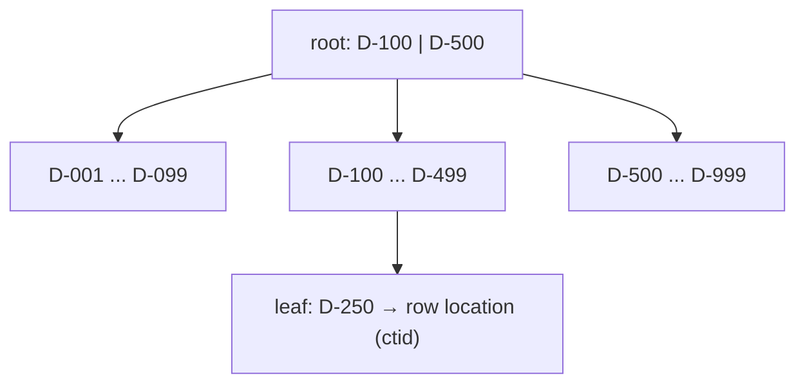

## 1. Introduction

An **index** is a separate data structure that helps the database find rows without reading the whole table. Think of the index at the end of a book: instead of reading every page to find "valve", you look it up and jump to the right page.

Indexes make reads faster, but they are not free: they use disk space and slow down every `INSERT`, `UPDATE` and `DELETE`, because the index must be updated too. Good performance work means choosing the *right* indexes, and proving with **EXPLAIN** that they are used.

We will reuse the schema from [Advanced SQL Queries](/informatica/postgresql/0_advanced-queries): `project`, `equipment`, `document` and `revision`.

## 2. How a B-tree index works

The default index type in PostgreSQL is the **B-tree** (balanced tree). Values are kept **sorted**, and the tree is shallow: even with millions of rows, the database needs only 3-4 page reads to reach a value.



```sql
CREATE INDEX ix_document_number ON document (number);
```

A B-tree supports:

- equality: `WHERE number = 'D-250'`
- ranges: `WHERE issued_at BETWEEN '2026-01-01' AND '2026-03-31'`
- prefix search: `WHERE number LIKE 'D-2%'` (with the C collation or `text_pattern_ops`)
- sorting: `ORDER BY issued_at` can read the index in order and skip the sort step

<Aside variant="info">
PostgreSQL automatically creates a unique B-tree index for every `PRIMARY KEY` and `UNIQUE` constraint. It does **not** create indexes on foreign key columns: you must add them yourself, for example on `revision.document_id`.
</Aside>

## 3. Composite indexes and column order

A **composite index** (multi-column index) covers more than one column. The column order matters a lot, because the index is sorted by the first column, then by the second inside each first value, like a phone book sorted by surname, then by name.

```sql
CREATE INDEX ix_equipment_project_kind ON equipment (project_id, kind);
```

| Query filter | Can use the index efficiently? |
|---|---|
| `project_id = 5` | Yes (leftmost column) |
| `project_id = 5 AND kind = 'pump'` | Yes (both columns) |
| `kind = 'pump'` | Usually no: the first column is missing |

This is called the **leftmost prefix rule**. General guidelines for ordering:

1. Put columns used with **equality** (`=`) first.
2. Put the column used for **ranges** or **ORDER BY** last.
3. Among equality columns, think about which queries you want to serve with the same index.

```sql
-- Serves: revisions of a document, ordered by date
CREATE INDEX ix_revision_doc_issued ON revision (document_id, issued_at DESC);

SELECT rev_code, issued_at
FROM revision
WHERE document_id = 42
ORDER BY issued_at DESC
LIMIT 1;
```

<Aside variant="tip">
Interview tip: when asked "does the column order of a composite index matter?", say yes and explain the phone book analogy. Then give the rule: equality columns first, range or sort column last.
</Aside>

## 4. Special kinds of index

### 4.1 Unique index

A **unique index** enforces that no two rows have the same value. It is both a constraint and a performance tool.

```sql
-- A document number must be unique inside a project
CREATE UNIQUE INDEX ux_document_project_number ON document (project_id, number);
```

### 4.2 Covering index (INCLUDE)

Normally an index scan finds the row location and then reads the table (the **heap**) to get the other columns. A **covering index** stores extra columns in the leaf pages with `INCLUDE`, so PostgreSQL can answer from the index alone with an **Index Only Scan**.

```sql
CREATE INDEX ix_revision_doc_cover
    ON revision (document_id) INCLUDE (rev_code, issued_at);

-- Can be answered without touching the table
SELECT rev_code, issued_at FROM revision WHERE document_id = 42;
```

### 4.3 Partial index

A **partial index** contains only the rows that match a `WHERE` condition. It is smaller and faster when queries always target the same subset.

```sql
ALTER TABLE equipment ADD COLUMN deleted_at timestamptz; -- soft delete

-- Only active (not deleted) equipment is searched by tag
CREATE INDEX ix_equipment_tag_active
    ON equipment (tag)
    WHERE deleted_at IS NULL;
```

The query must include the same condition (`WHERE deleted_at IS NULL`) for the planner to use it. A partial unique index is also a neat trick: "tag must be unique among active equipment only".

### 4.4 GIN index (briefly)

A **GIN** (Generalized Inverted Index) maps each *element* inside a value to the rows containing it. Use it for **JSONB**, **arrays** and **full-text search**, where a B-tree does not help.

```sql
ALTER TABLE equipment ADD COLUMN attributes jsonb;
CREATE INDEX ix_equipment_attributes ON equipment USING gin (attributes);

-- Uses the GIN index with the containment operator @>
SELECT tag FROM equipment WHERE attributes @> '{"material": "AISI316"}';
```

## 5. Reading EXPLAIN and EXPLAIN ANALYZE

**EXPLAIN** shows the **execution plan** chosen by the **query planner**, without running the query. **EXPLAIN ANALYZE** actually runs the query and adds real timings and row counts.

```sql
EXPLAIN (ANALYZE, BUFFERS)
SELECT * FROM revision WHERE document_id = 42;
```

```text
Index Scan using ix_revision_doc_issued on revision
    (cost=0.43..12.51 rows=8 width=48)
    (actual time=0.031..0.045 rows=7 loops=1)
  Index Cond: (document_id = 42)
  Buffers: shared hit=5
Planning Time: 0.110 ms
Execution Time: 0.071 ms
```

How to read it:

- **Node type**: `Seq Scan`, `Index Scan`, `Index Only Scan`, `Bitmap Heap Scan`, `Hash Join`, `Nested Loop`, `Sort`...
- **cost**: estimated cost in arbitrary units, `startup..total`. Compare plans, not absolute numbers.
- **rows** (estimated) vs **actual rows**: a big difference means the statistics are wrong.
- **loops**: how many times the node ran. Multiply the time by loops.
- **Buffers**: pages read from cache (`hit`) or from disk (`read`).

Plans are trees: read them from the **innermost, most indented node** upwards.

<Aside variant="warning">
`EXPLAIN ANALYZE` really executes the statement. On an `UPDATE` or `DELETE` wrap it in a transaction and roll back: `BEGIN; EXPLAIN ANALYZE DELETE ...; ROLLBACK;`.
</Aside>

### 5.1 Seq scan vs index scan

A **Sequential Scan** reads the whole table. It is not always bad: if the query returns a large part of the table (say 30% of rows), reading everything in order is cheaper than jumping around with an index.

| Scan type | When the planner picks it |
|---|---|
| Seq Scan | Small table, or many rows match, or no usable index |
| Index Scan | Few rows match; reads index, then heap |
| Index Only Scan | All needed columns are in the index |
| Bitmap Heap Scan | Medium number of rows, or several indexes combined with AND/OR |

```text
-- Before the index: the whole table is read and filtered
Seq Scan on revision  (actual time=0.015..85.2 rows=7 loops=1)
  Filter: (document_id = 42)
  Rows Removed by Filter: 1999993
```

`Rows Removed by Filter` in the millions for a handful of results is the classic signal of a missing index.

<Aside variant="info">
The planner relies on **statistics** collected by `ANALYZE` (run automatically by **autovacuum**). After a large bulk import, run `ANALYZE table_name;` manually so the estimates are correct.
</Aside>

### 5.2 Why is my index not used?

Common reasons:

- A function or cast on the column: `WHERE lower(tag) = 'p-101'` cannot use an index on `tag`. Create an **expression index**: `CREATE INDEX ON equipment (lower(tag));`.
- Leading wildcard: `LIKE '%101'` cannot use a B-tree.
- The composite index does not start with the filtered column.
- The query returns too many rows, so a seq scan is cheaper.
- Type mismatch between the parameter and the column.

## 6. The N+1 problem and ORMs

Not every performance issue is a missing index. With an ORM like EF Core, the most common problem is **N+1 queries**: one query loads N parents, then one extra query per parent loads the children. Each query is fast, but 1001 round trips are slow. See [Entity Framework part 2](/informatica/csharp/orm-entity-framework-2) for details.

```csharp
// N+1: one query for documents, then one per document (lazy loading)
var docs = await db.Documents.Where(d => d.ProjectId == projectId).ToListAsync();
foreach (var d in docs)
    Console.WriteLine(d.Revisions.Count);

// Fix: project only what you need, in a single query
var summary = await db.Documents
    .Where(d => d.ProjectId == projectId)
    .Select(d => new { d.Number, RevisionCount = d.Revisions.Count })
    .ToListAsync();
```

You can declare indexes in EF Core so that migrations create them:

```csharp
modelBuilder.Entity<Document>()
    .HasIndex(d => new { d.ProjectId, d.Number })
    .IsUnique();

modelBuilder.Entity<Revision>()
    .HasIndex(r => r.DocumentId)
    .IncludeProperties(r => new { r.RevCode, r.IssuedAt }); // Npgsql: INCLUDE

modelBuilder.Entity<Equipment>()
    .HasIndex(e => e.Tag)
    .HasFilter("deleted_at IS NULL");                        // partial index
```

<Aside variant="tip">
To find slow queries in a real system, enable `LogTo` or EF Core logging in development, and use the `pg_stat_statements` extension in PostgreSQL to see which queries take the most total time.
</Aside>

## 7. When indexes hurt

- **Write overhead**: every index is updated on each insert/update/delete. A table with 10 indexes is slow to write.
- **Storage and memory**: indexes compete with table data for the cache.
- **Unused indexes**: they cost on every write and give nothing. Check `pg_stat_user_indexes` where `idx_scan = 0`.
- **Low selectivity**: an index on a boolean column like `is_active` rarely helps (a partial index usually does).
- **Duplicates**: an index on `(project_id)` is redundant if you already have `(project_id, kind)`.
- **Locking**: `CREATE INDEX` blocks writes on the table. In production use `CREATE INDEX CONCURRENTLY`.

<Aside variant="danger">
`CREATE INDEX CONCURRENTLY` cannot run inside a transaction block, and EF Core migrations run in a transaction by default. For big production tables, create the index with a manual SQL script or a migration with the transaction disabled.
</Aside>

## 8. Interview questions

**Q: What is an index and what is the trade-off?**
An index is an extra data structure, usually a B-tree, that lets the database find rows without scanning the whole table. It makes reads much faster, but it costs disk space and slows down inserts, updates and deletes, because every index has to be maintained. So I add indexes based on the real query patterns, not on every column.

**Q: Does the order of columns in a composite index matter?**
Yes. The index is sorted by the first column, then by the second, so it can be used for filters on the leftmost columns. I put equality columns first and the range or sort column last, for example `(document_id, issued_at)`.

**Q: How do you investigate a slow query?**
First I reproduce it and run EXPLAIN ANALYZE with BUFFERS to see the actual plan. I look for sequential scans on big tables, a big difference between estimated and actual rows, and nodes with high loops. Then I try an index or rewrite the query and compare the plans again.

**Q: When would PostgreSQL choose a sequential scan even if an index exists?**
When the table is small or when the query returns a large fraction of the rows. In that case reading the table sequentially is cheaper than many random index lookups. It can also happen if the statistics are outdated, so I would run ANALYZE.

**Q: What is a covering index?**
It is an index that contains all the columns a query needs, so the database can answer with an index-only scan without reading the table. In PostgreSQL I create it with the INCLUDE clause, which adds payload columns that are not part of the search key.

**Q: What is a partial index and when is it useful?**
It indexes only the rows that match a WHERE condition, for example only non-deleted rows. It is smaller and faster to maintain, and I can also use it to enforce uniqueness only on a subset, like a tag that must be unique among active equipment.

**Q: What is the N+1 problem?**
It happens mostly with ORMs: you run one query to load a list and then one more query for each item to load a relation. I detect it by logging the generated SQL, and I fix it with eager loading using Include, or better with a projection that loads everything in one query.

## 9. Quiz

import Quiz from '../../../components/Quiz.jsx';

<Quiz client:load questions={[
{
question:"What is the default index type in PostgreSQL?",
answers:{ a:"Hash", b:"B-tree", c:"GIN", d:"BRIN" },
correctAnswer:"b"
},
{
question:"You have an index on `(project_id, kind)`. Which filter can NOT use it efficiently?",
answers:{ a:"`project_id = 5`", b:"`project_id = 5 AND kind = 'pump'`", c:"`kind = 'pump'`", d:"`project_id IN (1, 2)`" },
correctAnswer:"c"
},
{
question:"Which clause creates a covering index in PostgreSQL?",
answers:{ a:"COVER", b:"WITH", c:"USING", d:"INCLUDE" },
correctAnswer:"d"
},
{
question:"Which index type is the best choice for queries on a JSONB column with the `@>` operator?",
answers:{ a:"GIN", b:"B-tree", c:"Unique", d:"Hash" },
correctAnswer:"a"
},
{
question:"What is the main difference between EXPLAIN and EXPLAIN ANALYZE?",
answers:{ a:"EXPLAIN ANALYZE only works on SELECT", b:"EXPLAIN ANALYZE actually executes the query and shows real timings", c:"EXPLAIN shows more details", d:"There is no difference" },
correctAnswer:"b"
},
{
question:"Does PostgreSQL automatically index foreign key columns?",
answers:{ a:"Yes, always", b:"Only for integer columns", c:"No, you must create them yourself", d:"Only if the table has more than 1000 rows" },
correctAnswer:"c"
},
{
question:"Why might `WHERE lower(tag) = 'p-101'` not use an index on `tag`?",
answers:{ a:"Because lower() is not allowed in WHERE", b:"Because text columns cannot be indexed", c:"Because the index is too small", d:"Because the function changes the value; you need an expression index on lower(tag)" },
correctAnswer:"d"
},
{
question:"Which of these is a real downside of having many indexes?",
answers:{ a:"Slower inserts, updates and deletes", b:"SELECT queries stop working", c:"Primary keys are disabled", d:"The table cannot be joined" },
correctAnswer:"a"
}
]} />

## 10. Exercises

### 10.1 From seq scan to index scan

**Goal**: see the effect of an index with your own eyes.

1. Fill the `revision` table with about 2 million rows using `generate_series` (spread them over 50,000 documents).
2. Run `EXPLAIN ANALYZE SELECT * FROM revision WHERE document_id = 42;` and note the node type and the execution time.
3. Create an index on `document_id`, run `ANALYZE revision;`, and repeat the query.
4. Write down the differences: node type, `Rows Removed by Filter`, execution time.

*Hint: `INSERT INTO revision (document_id, rev_code, issued_at) SELECT (random()*49999)::int + 1, 'A', now() - random() * interval '3 years' FROM generate_series(1, 2000000);` (create the documents first because of the foreign key).*

### 10.2 Design the right composite index

**Goal**: choose column order based on a real query.

1. Take the query "latest revision of document X": `WHERE document_id = $1 ORDER BY issued_at DESC LIMIT 1`.
2. Create the index `(issued_at, document_id)` and check the plan.
3. Drop it, create `(document_id, issued_at DESC)` and check the plan again.
4. Add `INCLUDE (rev_code)` and select only `rev_code`: do you get an `Index Only Scan`?

*Hint: if you do not see an Index Only Scan, run `VACUUM revision;` to update the visibility map.*

### 10.3 Index audit in an EF Core project

**Goal**: connect database indexes with application code.

1. In an EF Core project, add indexes with `HasIndex` for every foreign key you filter on, plus a unique index on `(ProjectId, Number)` for documents.
2. Generate a migration and read the SQL it produces (`dotnet ef migrations script`).
3. Enable SQL logging, write a loop that triggers an N+1 problem, and count the queries.
4. Fix it with a projection and verify that only one query is executed.

*Hint: `optionsBuilder.LogTo(Console.WriteLine, LogLevel.Information)` prints every SQL command EF Core sends.*
