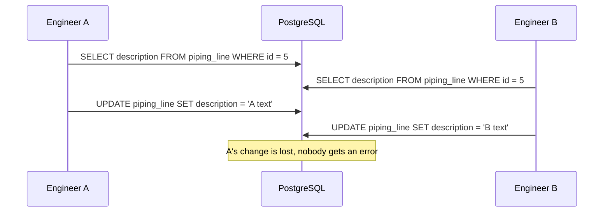
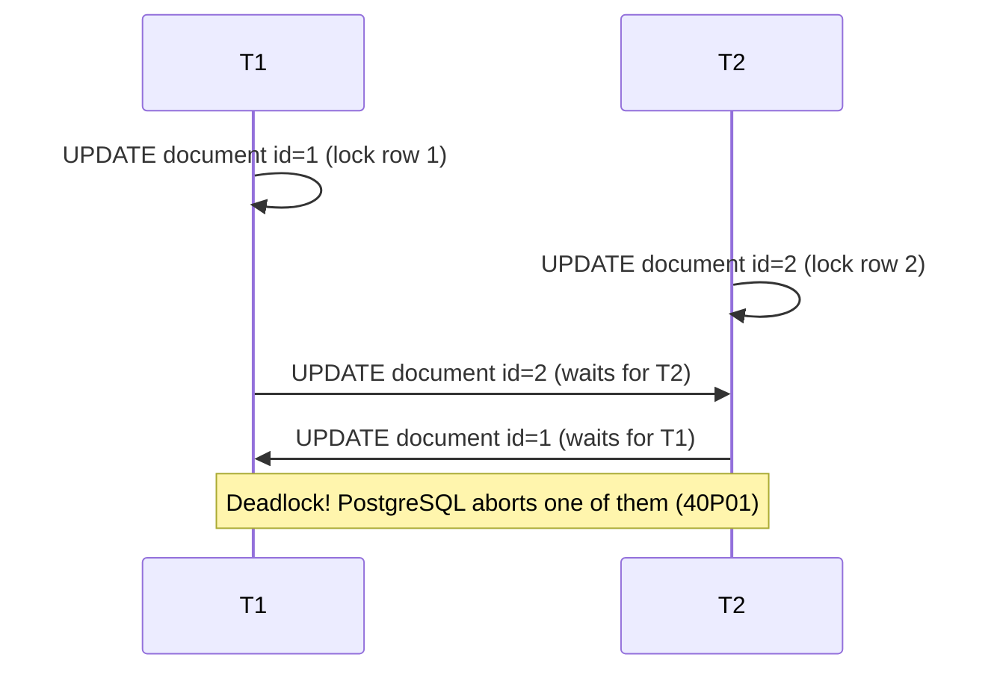

## 1. Introduction

A **transaction** is a group of SQL statements that the database treats as one single unit of work. Either all statements succeed, or none of them is applied. In an engineering data management system this is essential. Imagine you release a new **Revision** of a **Document**: you insert the revision row, mark the previous revision as superseded, and write an audit log entry. If the server crashes after the first step, you don't want a document with two "current" revisions.

In this lesson you will learn how transactions work in PostgreSQL, what happens when many users change the same data at the same time (**concurrency**), and how to handle it from EF Core.

## 2. ACID

Every relational database promises four properties, known as **ACID**:

| Property | Meaning | Example |
|---|---|---|
| **Atomicity** | All or nothing | Revision insert + audit log both succeed, or both are undone |
| **Consistency** | Constraints are always respected | A revision cannot reference a missing document (FK) |
| **Isolation** | Concurrent transactions don't see each other's half-done work | User A doesn't see User B's uncommitted revision |
| **Durability** | Once committed, data survives a crash | Written to the **WAL** (Write-Ahead Log) before `COMMIT` returns |

<Aside variant="info">
PostgreSQL guarantees durability with the **WAL**: every change is first written to a sequential log on disk. After a crash, PostgreSQL replays the log to restore committed data.
</Aside>

## 3. BEGIN, COMMIT, ROLLBACK

By default PostgreSQL runs in **autocommit** mode: each statement is its own transaction. To group statements, you open an explicit transaction.

```sql
BEGIN;

UPDATE revision
SET    status = 'Superseded'
WHERE  document_id = 42 AND status = 'Current';

INSERT INTO revision (document_id, code, status, created_by)
VALUES (42, 'B', 'Current', 7);

INSERT INTO audit_log (entity, entity_id, action)
VALUES ('Document', 42, 'NewRevision');
COMMIT;   -- or ROLLBACK; to undo everything
```

If any statement fails, you call `ROLLBACK` and the database returns to the state it had before `BEGIN`.

<Aside variant="warning">
In PostgreSQL, after an error inside a transaction, **every** following statement fails with "current transaction is aborted, commands ignored until end of transaction block". You must `ROLLBACK` (or roll back to a savepoint). SQL Server behaves differently, so this often surprises .NET developers.
</Aside>

### 3.1 Savepoints

A **savepoint** is a marker inside a transaction. You can roll back to it without losing the work done before it.

```sql
BEGIN;
INSERT INTO equipment (tag, name, project_id) VALUES ('P-101', 'Feed pump', 1);

SAVEPOINT before_optional;
INSERT INTO equipment (tag, name, project_id) VALUES ('P-101', 'Duplicate', 1); -- unique violation!
ROLLBACK TO SAVEPOINT before_optional;  -- the first insert is still there

COMMIT;
```

Savepoints are useful in import jobs: you can skip a single bad row and keep the rest of the batch.

## 4. Concurrency anomalies

When two transactions run at the same time, some strange effects can appear. The SQL standard names them **anomalies**.

| Anomaly | What happens |
|---|---|
| **Dirty read** | T1 reads data that T2 has changed but not yet committed (T2 may roll back) |
| **Non-repeatable read** | T1 reads a row twice and gets different values, because T2 committed an update in between |
| **Phantom read** | T1 runs the same `WHERE` query twice and gets new or missing rows, because T2 inserted or deleted rows |
| **Lost update** | T1 and T2 both read a value, both compute a new one, both write: the first write is silently lost |
| **Write skew** | Two transactions read overlapping data, each makes a valid decision, but together they break a rule |

### 4.1 The lost update, step by step

The lost update is the most common bug in real applications. Two engineers edit the same piping line description in the web UI:



## 5. Isolation levels

An **isolation level** decides which anomalies are allowed. Higher isolation means fewer anomalies, but more errors or waiting under load.

| Level | Dirty read | Non-repeatable read | Phantom | Lost update |
|---|---|---|---|---|
| Read Uncommitted (PG) | No | Possible | Possible | Possible |
| **Read Committed** (default) | No | Possible | Possible | Possible |
| Repeatable Read (PG) | No | No | No | No (error) |
| Serializable | No | No | No | No (error) |

```sql
BEGIN ISOLATION LEVEL REPEATABLE READ;
SELECT count(*) FROM document WHERE project_id = 1;
-- ... later in the same transaction, the count is the same,
-- even if other users inserted documents meanwhile
COMMIT;
```

Key facts about PostgreSQL:

- **Read Committed** is the default. Each *statement* sees a fresh snapshot of committed data.
- **Read Uncommitted** behaves exactly like Read Committed: PostgreSQL never shows dirty reads.
- **Repeatable Read** uses one snapshot for the *whole transaction*. In PostgreSQL it also prevents phantoms (stronger than the SQL standard requires).
- **Serializable** uses **SSI** (Serializable Snapshot Isolation). It guarantees the result is the same as if transactions ran one after another, and it also prevents write skew.

<Aside variant="danger">
At Repeatable Read and Serializable, PostgreSQL does not block the conflicting transaction forever: it aborts it with SQLSTATE `40001` ("could not serialize access"). Your application **must retry** the whole transaction. Without retry logic, users just see random errors.
</Aside>

## 6. MVCC: how PostgreSQL does it

PostgreSQL uses **MVCC** (Multi-Version Concurrency Control). An `UPDATE` does not overwrite the row. It writes a **new version** of the row and marks the old one as expired.

Every row version has hidden system columns:

- `xmin`: the ID of the transaction that created this version.
- `xmax`: the ID of the transaction that deleted or replaced it (0 if still alive).

```sql
SELECT xmin, xmax, id, tag FROM equipment WHERE id = 10;
--  xmin  | xmax | id |  tag
-- -------+------+----+-------
--  10452 |    0 | 10 | P-101
```

Each transaction has a **snapshot**: the list of transactions whose results it can see. A reader simply picks the row version that is visible in its snapshot.

The big consequence: **readers never block writers, and writers never block readers.** Only two writers on the same row wait for each other.

<Aside variant="info">
Old row versions (**dead tuples**) stay in the table until **VACUUM** removes them. **Autovacuum** does this automatically. Very long-running transactions keep old snapshots alive and prevent cleanup, so the table grows (**bloat**).
</Aside>

## 7. Explicit locking

Sometimes you need to read a row and be sure nobody changes it before you write. Use `SELECT ... FOR UPDATE`: it locks the selected rows until the transaction ends.

```sql
BEGIN;
SELECT next_number
FROM   tag_sequence
WHERE  project_id = 1 AND prefix = 'P'
FOR UPDATE;               -- other transactions wait here

UPDATE tag_sequence
SET    next_number = next_number + 1
WHERE  project_id = 1 AND prefix = 'P';

COMMIT;                   -- lock released
```

Useful variants:

| Clause | Behaviour |
|---|---|
| `FOR UPDATE` | Exclusive row lock, others wait |
| `FOR UPDATE NOWAIT` | Fail immediately if the row is locked |
| `FOR UPDATE SKIP LOCKED` | Skip locked rows (great for job queues) |
| `FOR SHARE` | Others can read-lock too, but cannot update |

### 7.1 Atomic updates: often you don't need a lock

Many lost updates disappear if you let the database compute the new value in one statement:

```sql
-- Safe: read and write happen in the same statement
UPDATE tag_sequence
SET    next_number = next_number + 1
WHERE  project_id = 1 AND prefix = 'P'
RETURNING next_number;
```

### 7.2 A simple job queue with SKIP LOCKED

```sql
BEGIN;
SELECT id, payload
FROM   integration_job
WHERE  status = 'Pending'
ORDER  BY created_at
LIMIT  10
FOR UPDATE SKIP LOCKED;   -- each worker gets different jobs
-- process jobs, then UPDATE status = 'Done'
COMMIT;
```

## 8. Deadlocks

A **deadlock** happens when two transactions each hold a lock the other one needs.



PostgreSQL checks for deadlocks after `deadlock_timeout` (default 1 second) and aborts one transaction with SQLSTATE `40P01`.

How to avoid them:

1. Always lock rows in the **same order** (for example, `ORDER BY id`).
2. Keep transactions **short**: no HTTP calls or user input inside a transaction.
3. Retry the transaction when you get `40P01`.

<Aside variant="tip">
Interview tip: if asked "how do you prevent deadlocks?", the strongest short answer is "consistent lock ordering, short transactions, and retry on deadlock errors". Mentioning all three shows real experience.
</Aside>

## 9. Transactions in EF Core

`SaveChanges()` already runs inside a transaction: all inserts, updates and deletes of one call are atomic. You need an explicit transaction only when you call `SaveChanges` more than once or mix EF with raw SQL.

```cs
await using var tx = await db.Database.BeginTransactionAsync(
    System.Data.IsolationLevel.RepeatableRead);

var current = await db.Revisions
    .SingleAsync(r => r.DocumentId == docId && r.Status == RevisionStatus.Current);
current.Status = RevisionStatus.Superseded;
await db.SaveChangesAsync();

db.Revisions.Add(new Revision { DocumentId = docId, Code = "B", Status = RevisionStatus.Current });
await db.SaveChangesAsync();

await tx.CommitAsync();   // disposing without commit = rollback
```

EF Core also supports savepoints with `tx.CreateSavepointAsync("name")` and `tx.RollbackToSavepointAsync("name")`. See the [EF Core lesson](/informatica/csharp/orm-entity-framework) for the basics of `DbContext`.

## 10. Optimistic concurrency in EF Core

**Pessimistic** locking (`FOR UPDATE`) blocks other users. In web apps we usually prefer **optimistic concurrency**: don't lock, but detect at save time if somebody else changed the row.

EF Core adds the old version to the `WHERE` clause of the `UPDATE`. If zero rows are affected, it throws `DbUpdateConcurrencyException`.

### 10.1 Using xmin (PostgreSQL-specific)

With the Npgsql provider you can map the system column `xmin` as a concurrency token. No extra column is needed: PostgreSQL changes `xmin` on every update.

```cs
public class PipingLine
{
    public int Id { get; set; }
    public string Description { get; set; } = "";

    [Timestamp]               // Npgsql maps a uint row version to xmin
    public uint Version { get; set; }
}
```

### 10.2 Using a version column (portable)

```cs
public class Document
{
    public int Id { get; set; }
    public string Title { get; set; } = "";

    [ConcurrencyCheck]
    public int Version { get; set; }   // increment it yourself on every change
}
```

### 10.3 Handling the conflict

```cs
try
{
    line.Description = dto.Description;
    db.Entry(line).Property(l => l.Version).OriginalValue = dto.Version; // from the client
    await db.SaveChangesAsync();
    return TypedResults.NoContent();
}
catch (DbUpdateConcurrencyException)
{
    return TypedResults.Conflict("The line was modified by another user. Reload and retry.");
}
```

The client sends back the version it originally loaded. This turns the lost update from section 4.1 into a clear **409 Conflict** response.

<Aside variant="tip">
In a REST API, the version can travel in an **ETag** header. The client sends it back in `If-Match`, and the server answers `412 Precondition Failed` or `409 Conflict` on mismatch. This pattern is common in data management products.
</Aside>

## 11. Interview questions

**Q: What does ACID mean?**
ACID stands for Atomicity, Consistency, Isolation and Durability. Atomicity means a transaction is all or nothing, consistency means constraints always hold, isolation means concurrent transactions don't see each other's uncommitted work, and durability means committed data survives a crash. PostgreSQL ensures durability with the write-ahead log.

**Q: What is the default isolation level in PostgreSQL, and what does it allow?**
The default is Read Committed. Each statement sees only data committed before that statement started, so there are no dirty reads. However, non-repeatable reads, phantoms and lost updates are still possible if you read and then write in separate statements.

**Q: Can you explain MVCC?**
MVCC means the database keeps multiple versions of a row. An update creates a new version instead of overwriting the old one, and each transaction reads the version visible in its snapshot. The main benefit is that readers and writers don't block each other. The cost is dead tuples, which VACUUM has to clean up.

**Q: What is a lost update and how do you prevent it?**
A lost update happens when two users read the same value, both modify it, and the second write overwrites the first without any error. You can prevent it with an atomic `UPDATE` statement, with `SELECT FOR UPDATE`, with a higher isolation level, or with optimistic concurrency using a version column. In web applications I usually prefer optimistic concurrency.

**Q: Optimistic vs pessimistic concurrency: when do you use each?**
Pessimistic locking locks the row when you read it, so it fits short, high-contention operations like generating sequence numbers. Optimistic concurrency doesn't lock anything; it checks a version at save time and fails if the row changed. It fits web apps where users keep data on screen for minutes and conflicts are rare.

**Q: What is a deadlock and how does PostgreSQL handle it?**
A deadlock is when two transactions wait for locks held by each other, so neither can continue. PostgreSQL detects it after the deadlock timeout and aborts one of the transactions with an error. To reduce deadlocks, I lock rows in a consistent order, keep transactions short, and retry on failure.

**Q: What happens at Serializable isolation when there is a conflict?**
PostgreSQL doesn't block forever; it aborts one transaction with a serialization failure, SQLSTATE 40001. The application must catch that error and retry the whole transaction from the beginning. So Serializable gives the strongest guarantees, but you need retry logic.

## 12. Quiz

import Quiz from '../../../components/Quiz.jsx';

<Quiz client:load questions={[
{
question:"Which ACID property guarantees that committed data survives a server crash?",
answers:{ a:"Atomicity", b:"Consistency", c:"Isolation", d:"Durability" },
correctAnswer:"d"
},
{
question:"What is the default isolation level in PostgreSQL?",
answers:{ a:"Read Uncommitted", b:"Read Committed", c:"Repeatable Read", d:"Serializable" },
correctAnswer:"b"
},
{
question:"What happens in PostgreSQL if you set the isolation level to Read Uncommitted?",
answers:{ a:"Dirty reads become possible", b:"The command fails", c:"It behaves like Read Committed", d:"It behaves like Serializable" },
correctAnswer:"c"
},
{
question:"In PostgreSQL MVCC, what does an UPDATE do?",
answers:{ a:"Overwrites the row in place", b:"Creates a new row version and expires the old one", c:"Locks the whole table", d:"Writes only to the WAL, never to the table" },
correctAnswer:"b"
},
{
question:"Which clause lets several workers pick different pending jobs from the same table without waiting?",
answers:{ a:"FOR UPDATE SKIP LOCKED", b:"FOR SHARE", c:"LOCK TABLE", d:"FOR UPDATE NOWAIT" },
correctAnswer:"a"
},
{
question:"What should your application do when it receives SQLSTATE 40001 (serialization failure)?",
answers:{ a:"Ignore it, the data is saved anyway", b:"Restart the database", c:"Lower the isolation level permanently", d:"Retry the whole transaction" },
correctAnswer:"d"
},
{
question:"Which exception does EF Core throw when an optimistic concurrency check fails?",
answers:{ a:"DbUpdateException with code 409", b:"InvalidOperationException", c:"DbUpdateConcurrencyException", d:"NpgsqlDeadlockException" },
correctAnswer:"c"
},
{
question:"Which is NOT a good way to reduce deadlocks?",
answers:{ a:"Lock rows in a consistent order", b:"Call external HTTP services inside the transaction", c:"Keep transactions short", d:"Retry the transaction on a deadlock error" },
correctAnswer:"b"
}
]} />

## 13. Exercises

### 13.1 Reproduce a lost update

**Goal**: see the lost update with your own eyes, then fix it.

1. Create a table `piping_line (id int primary key, description text)` and insert one row.
2. Open two `psql` sessions. In both, run `BEGIN;` and `SELECT description FROM piping_line WHERE id = 1;`.
3. In session 1 update the description and `COMMIT`. Then do the same in session 2.
4. Repeat with `BEGIN ISOLATION LEVEL REPEATABLE READ;` and observe the error in session 2.

*Hint: the error message in step 4 is "could not serialize access due to concurrent update".*

### 13.2 Tag number generator

**Goal**: generate unique equipment tags (`P-001`, `P-002`, ...) safely under concurrency.

1. Create a table `tag_sequence (project_id, prefix, next_number)` with a composite primary key.
2. Write one SQL statement that increments the number and returns the new value.
3. Call it from C# in parallel (for example with `Task.WhenAll` over 50 tasks) and check that no tag is duplicated.

*Hint: `UPDATE ... SET next_number = next_number + 1 ... RETURNING next_number` is atomic. Compare it with a read-then-write version.*

### 13.3 Optimistic concurrency in a Web API

**Goal**: return `409 Conflict` when two users edit the same document.

1. Add a `uint Version` property with `[Timestamp]` to an EF Core entity mapped with Npgsql.
2. Include `Version` in the GET response DTO and require it in the PUT request DTO.
3. Catch `DbUpdateConcurrencyException` and return `TypedResults.Conflict(...)`.
4. Test it: send two PUT requests with the same old version; the second must fail.

*Hint: set `OriginalValue` of the version property to the value sent by the client before calling `SaveChangesAsync`.*
