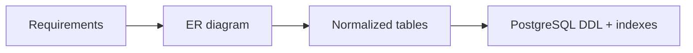
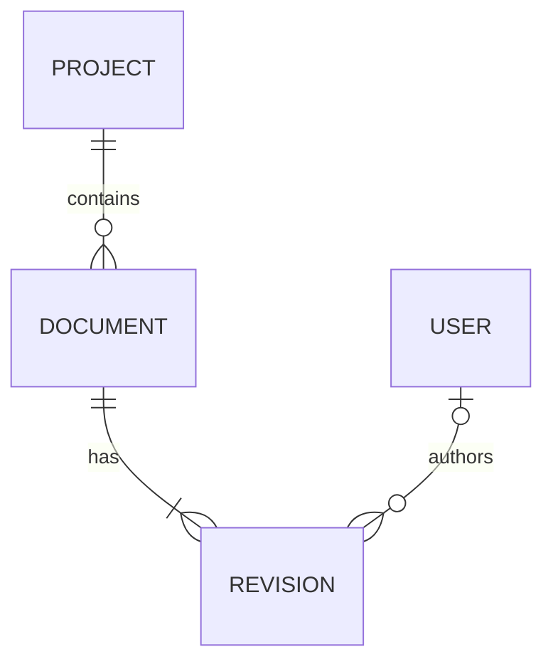
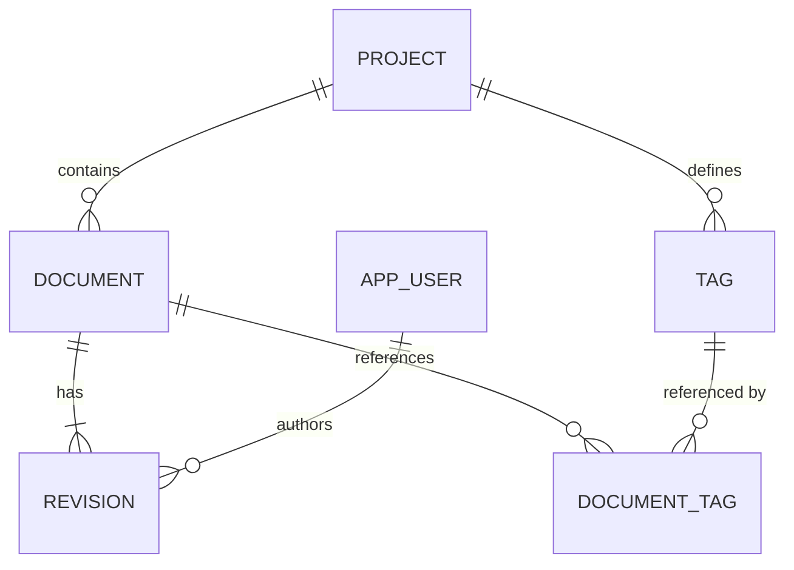
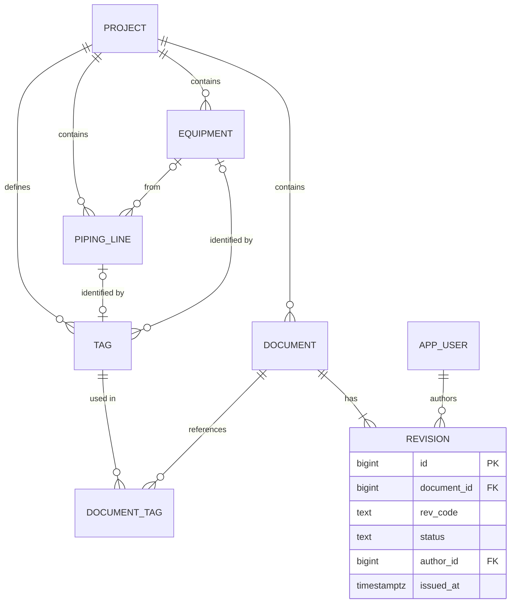

## 1. Introduction

**Database design** is the process of turning business requirements into tables, columns, keys and constraints. A good design makes queries simple and keeps data consistent. A bad design creates duplicated data, update bugs and painful migrations.

The usual path has three steps:

1. **Conceptual model**: entities and relationships, drawn as an **ER diagram** (Entity-Relationship diagram).
2. **Logical model**: tables, columns, primary and foreign keys, normalized.
3. **Physical model**: real PostgreSQL types, indexes, constraints.



In this lesson we use one domain from start to finish: **engineering project data** (projects, documents with revisions, equipment, tags, users).

## 2. Core concepts

- **Entity**: a "thing" you need to store data about (Project, Document, Equipment). It becomes a table.
- **Attribute**: a property of an entity (`title`, `created_at`). It becomes a column.
- **Relationship**: how entities are connected ("a Project *contains* Documents"). It becomes a foreign key or a junction table.
- **Cardinality**: how many instances can take part in a relationship: one-to-one (1:1), one-to-many (1:N), many-to-many (N:M).
- **Optionality** (or participation): whether the relationship is mandatory ("exactly one") or optional ("zero or one").

A quick trick: underline the **nouns** in the requirements (candidate entities or attributes) and the **verbs** (candidate relationships, like "contains" or "references").

## 3. Crow's foot notation

The most common ER notation in industry is **crow's foot**. Each end of a line shows the minimum and maximum cardinality on that side.

| Symbol (Mermaid) | Meaning |
|---|---|
| `\|\|` | exactly one |
| `o\|` | zero or one |
| `\|{` | one or more |
| `o{` | zero or more |

You read a relationship in both directions:



- A Project contains **zero or more** Documents; each Document belongs to **exactly one** Project.
- A Document has **one or more** Revisions; each Revision belongs to **exactly one** Document.
- A User authors zero or more Revisions; a Revision has **zero or one** author (for example, imported revisions without an author).

<Aside variant="info">
Other notations exist (Chen notation with diamonds, UML class diagrams with `1..*`). Crow's foot is the one you will see in tools like dbdiagram.io, DBeaver, pgAdmin ERD and draw.io, so learn it well.
</Aside>

## 4. Implementing relationships

### 4.1 One-to-many (1:N)

Put the foreign key on the "many" side. `NOT NULL` means the relationship is mandatory.

```sql norun
CREATE TABLE project (
    id          bigint GENERATED ALWAYS AS IDENTITY PRIMARY KEY,
    code        text NOT NULL UNIQUE,      -- e.g. 'PRJ-2026-014'
    name        text NOT NULL
);

CREATE TABLE document (
    id          bigint GENERATED ALWAYS AS IDENTITY PRIMARY KEY,
    project_id  bigint NOT NULL REFERENCES project(id) ON DELETE CASCADE,
    doc_number  text NOT NULL,
    title       text NOT NULL,
    UNIQUE (project_id, doc_number)
);
```

### 4.2 One-to-one (1:1)

A foreign key with a `UNIQUE` constraint. Often used to split rarely used or large data from the main table.

```sql
CREATE TABLE equipment_spec (
    equipment_id bigint PRIMARY KEY REFERENCES equipment(id) ON DELETE CASCADE,
    design_pressure_bar numeric(8,2),
    design_temp_c       numeric(6,2)
);
```

Here the primary key is also the foreign key, so each Equipment has at most one spec row.

### 4.3 Many-to-many (N:M) and junction tables

A relational database cannot store N:M directly. You need a **junction table** (also called *associative*, *bridge* or *link* table) with two foreign keys.

Example: a Tag (like `P-101`) can be referenced by many Documents, and a Document can reference many Tags.

```sql
CREATE TABLE document_tag (
    document_id bigint NOT NULL REFERENCES document(id) ON DELETE CASCADE,
    tag_id      bigint NOT NULL REFERENCES tag(id) ON DELETE CASCADE,
    PRIMARY KEY (document_id, tag_id)
);

-- the PK index covers lookups by document_id; add one for the other direction
CREATE INDEX ix_document_tag_tag ON document_tag (tag_id);
```

<Aside variant="tip">
A junction table often grows its own attributes, for example `linked_at` or `linked_by`. When that happens, it becomes a real entity (e.g. `DocumentTagLink`). In EF Core, this is the moment you switch from an implicit skip navigation to an explicit join entity. See [Entity Framework part 2](/informatica/csharp/orm-entity-framework-2).
</Aside>

## 5. Keys: natural vs surrogate

- **Natural key**: a value that already exists in the business (tag number `P-101`, email, document number).
- **Surrogate key**: a technical value with no business meaning (`bigint` identity or `uuid`).

| | Natural key | Surrogate key |
|---|---|---|
| Meaning | Business value | None |
| Can change? | Yes (renames, typos) | Never |
| Size | Often long text | Small, fixed |
| Joins / FKs | Slower, wider | Fast, compact |

Common best practice: use a **surrogate primary key** and protect the natural key with a **`UNIQUE` constraint**. You get stable foreign keys *and* no duplicates.

```sql norun
CREATE TABLE tag (
    id          bigint GENERATED ALWAYS AS IDENTITY PRIMARY KEY,
    project_id  bigint NOT NULL REFERENCES project(id),
    tag_number  text NOT NULL,                 -- natural key, e.g. 'P-101'
    UNIQUE (project_id, tag_number)
);
```

<Aside variant="warning">
"Tag numbers never change" is a classic false assumption. Engineering projects rename tags all the time. If `tag_number` were the primary key, every rename would cascade through all foreign keys.
</Aside>

A **composite key** uses more than one column (like the `document_tag` primary key). It is natural for junction tables, but avoid it for main entities: every child table would need to repeat all key columns.

## 6. Normalization (1NF, 2NF, 3NF)

**Normalization** removes redundancy so each fact is stored in **one place**. Redundancy causes **anomalies**:

- **Update anomaly**: you change a project name in one row but not in the others.
- **Insert anomaly**: you cannot store a new project until it has a document.
- **Delete anomaly**: deleting the last document also deletes the only record of the project.

### 6.1 Starting point: one flat table

Imagine someone gives you an Excel export:

| project_code | project_name | doc_number | doc_title | revision | author_email | author_name | tags |
|---|---|---|---|---|---|---|---|
| PRJ-14 | Ferry Hull | DOC-001 | Pump layout | A | anna@x.com | Anna | P-101, P-102 |
| PRJ-14 | Ferry Hull | DOC-001 | Pump layout | B | marco@x.com | Marco | P-101, P-102 |
| PRJ-14 | Ferry Hull | DOC-002 | Line list | A | anna@x.com | Anna | L-200 |

### 6.2 First Normal Form (1NF)

Rule: every column holds **atomic** values (one value per cell), and there are no repeating groups.

The `tags` column breaks 1NF: `P-101, P-102` is a list. Searching "all documents with P-101" needs string parsing. Fix: move tags to their own table, linked by a junction table.

### 6.3 Second Normal Form (2NF)

Rule: 1NF, and every non-key column depends on the **whole** primary key, not just part of it.

The key of a revision row is (`doc_number`, `revision`). But `doc_title` depends only on `doc_number`. This is a **partial dependency**. Fix: move document data to a `document` table; keep only revision data in `revision`.

### 6.4 Third Normal Form (3NF)

Rule: 2NF, and no non-key column depends on **another non-key column** (no **transitive dependency**).

- `project_name` depends on `project_code`, which depends on the document. Move it to `project`.
- `author_name` depends on `author_email`. Move it to `app_user`.

<Aside variant="info">
The classic sentence to remember 3NF: every non-key attribute must depend on "the key, the whole key, and nothing but the key". The first part is 1NF/2NF, the last part is 3NF.
</Aside>

### 6.5 Result



Now each fact lives in one place: renaming a project is one `UPDATE` on one row.

## 7. When to denormalize

**Denormalization** means adding controlled redundancy on purpose, usually for read performance. Normalize first, then denormalize only with a measured reason.

Typical cases:

- **Cached "current" values**: store `current_revision_id` on `document` to avoid finding the latest revision every time.
- **Counters and aggregates**: `document_count` on `project` for a dashboard.
- **Reporting / read models**: a separate flattened table or **materialized view** for exports.
- **Snapshots of history**: an issued revision must keep the title *as it was* at issue time, even if the document is renamed later. This is not really redundancy, it is a different fact.

```sql norun
CREATE MATERIALIZED VIEW project_summary AS
SELECT p.id, p.code, count(d.id) AS document_count
FROM project p
LEFT JOIN document d ON d.project_id = p.id
GROUP BY p.id, p.code;

REFRESH MATERIALIZED VIEW project_summary;  -- run after imports or on a schedule
```

<Aside variant="warning">
Every denormalized column needs a plan to keep it in sync (trigger, application code in the same transaction, or a scheduled refresh). If nobody owns that plan, the data will drift.
</Aside>

## 8. Full worked example: engineering project data

**Requirements** (as a Product Owner might say them):

- A project has a unique code and contains documents, equipment and tags.
- A document has a number unique within the project and one or more revisions (A, B, C...). Each revision has a status (draft, issued, superseded) and an author.
- Equipment (pumps, tanks) can have several tags. A piping line connects equipment and has its own tag.
- Documents reference many tags; a tag appears in many documents.



The revision table in PostgreSQL:

```sql norun
CREATE TYPE revision_status AS ENUM ('draft', 'issued', 'superseded');

CREATE TABLE revision (
    id          bigint GENERATED ALWAYS AS IDENTITY PRIMARY KEY,
    document_id bigint NOT NULL REFERENCES document(id) ON DELETE CASCADE,
    rev_code    text NOT NULL,
    status      revision_status NOT NULL DEFAULT 'draft',
    author_id   bigint REFERENCES app_user(id) ON DELETE SET NULL,
    issued_at   timestamptz,
    UNIQUE (document_id, rev_code),
    CHECK (status = 'draft' OR issued_at IS NOT NULL)
);
```

Notice how the design pushes rules **into the database**: uniqueness, mandatory relationships and a `CHECK` that an issued revision must have a date. The application can have bugs; constraints still protect the data.

<Aside variant="tip">
For "only one draft revision per document", use a **partial unique index**: `CREATE UNIQUE INDEX ON revision (document_id) WHERE status = 'draft';`. See [Indexes and Query Performance](/informatica/postgresql/1_indexes-and-performance).
</Aside>

## 9. Drawing an ER diagram on a whiteboard

Interviewers often say: "Design the database for X. Draw it." They care more about your **process** and your **questions** than the final picture. A step-by-step method:

1. **Ask clarifying questions** first. "Can a document belong to more than one project?" "Do we need revision history?" "Can a tag be renamed?"
2. **List the entities** (nouns). Write them as boxes. Keep 4-7 boxes, not 20.
3. **Draw the relationships** (verbs) as lines between boxes. Label each line with a verb.
4. **Add cardinalities** on both ends. Say them out loud: "one project has many documents".
5. **Resolve N:M** with junction tables.
6. **Add keys**: surrogate PK in each box, FKs on the "many" side, UNIQUE on natural keys.
7. **Add only the key attributes** (code, name, status, dates). Do not write every column.
8. **Check normalization** quickly: any lists in a cell? Any column that depends on a non-key column?
9. **Talk about trade-offs**: indexes for common queries, soft delete vs hard delete, audit columns, where you would denormalize.

<Aside variant="tip">
Interview tip: think out loud. Say "I'm assuming a document belongs to exactly one project, is that right?" A wrong assumption that you state clearly is much better than a silent one. It also shows how you would work with a Product Owner.
</Aside>

## 10. Interview questions

**Q: What is normalization and why do we do it?**
Normalization is organizing tables so that each fact is stored in exactly one place. We do it to avoid update, insert and delete anomalies, where data becomes inconsistent. In practice I aim for third normal form, and then denormalize only when there is a measured performance need.

**Q: Can you explain 1NF, 2NF and 3NF briefly?**
First normal form means atomic values, so no comma-separated lists in a column. Second normal form means every non-key column depends on the whole key, which matters with composite keys. Third normal form means no non-key column depends on another non-key column, like a project name stored next to a project code in a documents table.

**Q: How do you model a many-to-many relationship?**
With a junction table that holds two foreign keys, one to each side. Usually the primary key is the combination of both foreign keys, and I add an index on the second column for reverse lookups. If the link needs its own data, like who created it and when, it becomes a proper entity.

**Q: Natural key or surrogate key?**
I usually use a surrogate key, like a bigint identity or a UUID, as the primary key, because it never changes and keeps foreign keys small. Then I put a unique constraint on the natural key, for example the tag number within a project. That way I get stable references and still prevent duplicates.

**Q: When would you denormalize?**
When reads are much more frequent than writes and a join or aggregate becomes a real bottleneck, for example a dashboard counting documents per project. I would first check indexes and the query plan. If I denormalize, I make sure there is a clear way to keep the copy in sync, like a materialized view refresh or an update in the same transaction.

**Q: How would you design a document revision history?**
I would have a document table with stable data like the number and project, and a revision table with one row per revision, a foreign key to the document, a revision code, status and dates. A unique constraint on document and revision code avoids duplicates. Issued revisions should never be updated, only superseded by a new one, so we keep a full audit trail.

**Q: Where do you put business rules: in the database or in the application?**
Both, for different rules. Structural rules like uniqueness, foreign keys, not null and simple checks belong in the database, because they protect data from every client and every bug. Complex workflow rules, like who can approve a revision, belong in the application layer.

## 11. Quiz

import Quiz from '../../../components/Quiz.jsx';

<Quiz client:load questions={[
{
question:"In crow's foot notation, what does the Mermaid symbol `o{` mean on one end of a line?",
answers:{ a:"Exactly one", b:"Zero or more", c:"One or more", d:"Zero or one" },
correctAnswer:"b"
},
{
question:"In a one-to-many relationship between Project and Document, where does the foreign key go?",
answers:{ a:"In the project table", b:"In a junction table", c:"In the document table", d:"In both tables" },
correctAnswer:"c"
},
{
question:"A `tags` column contains the value `P-101, P-102`. Which normal form is violated?",
answers:{ a:"1NF", b:"2NF", c:"3NF", d:"None, this is fine" },
correctAnswer:"a"
},
{
question:"In a revision table with key (`doc_number`, `revision`), the column `doc_title` depends only on `doc_number`. What is this?",
answers:{ a:"A transitive dependency, violates 3NF", b:"A multi-valued attribute, violates 1NF", c:"A surrogate key", d:"A partial dependency, violates 2NF" },
correctAnswer:"d"
},
{
question:"What is the usual best practice for keys on a main entity like Tag?",
answers:{ a:"Use the tag number as primary key", b:"Surrogate primary key plus a UNIQUE constraint on the natural key", c:"No primary key, only indexes", d:"A composite key of all columns" },
correctAnswer:"b"
},
{
question:"How do you implement a many-to-many relationship between Document and Tag?",
answers:{ a:"A junction table with two foreign keys", b:"An array column of tag ids in document", c:"A foreign key in tag pointing to document", d:"A one-to-one table" },
correctAnswer:"a"
},
{
question:"Which statement about denormalization is correct?",
answers:{ a:"It should be done before normalizing", b:"It removes all redundancy", c:"It is never acceptable in PostgreSQL", d:"It adds controlled redundancy, usually for read performance, and needs a sync strategy" },
correctAnswer:"d"
},
{
question:"In an interview, what is the best FIRST step when asked to draw an ER diagram?",
answers:{ a:"Write the full CREATE TABLE statements", b:"Draw all possible columns", c:"Ask clarifying questions about the requirements", d:"Choose the indexes" },
correctAnswer:"c"
}
]} />

## 12. Exercises

### 12.1 Normalize a spreadsheet

**Goal**: turn a flat equipment list into 3NF tables.

1. Start from a table with columns: `project_code`, `project_name`, `equipment_tag`, `equipment_type`, `type_description`, `connected_lines` (e.g. `L-200, L-201`).
2. Identify the 1NF, 2NF and 3NF violations and write them down in one sentence each.
3. Split the data into normalized tables and draw the result as a Mermaid `erDiagram`.
4. Write the `CREATE TABLE` statements with PKs, FKs and UNIQUE constraints.

*Hint*: `type_description` depends on `equipment_type`, not on the equipment itself.

### 12.2 Whiteboard practice: document approvals

**Goal**: practice the 9-step method from section 9 in under 15 minutes.

1. Requirements: a revision must be approved by one or more users before it is issued. Each approval has a date, a result (approved/rejected) and a comment.
2. Write 3 clarifying questions you would ask the interviewer.
3. Draw the ER diagram (by hand or in Mermaid) with cardinalities on both ends.
4. Explain out loud, in English, why you chose your keys.

*Hint*: an approval is a link between Revision and User that has its own attributes, so it is an entity, not a simple junction table.

### 12.3 Denormalize with a materialized view

**Goal**: build a fast read model for a project dashboard.

1. Using the schema from section 8, create a materialized view with, per project: number of documents, number of issued revisions, and the date of the last issued revision.
2. Add a unique index on the view so you can use `REFRESH MATERIALIZED VIEW CONCURRENTLY`.
3. Compare `EXPLAIN ANALYZE` of the view query vs reading from the view.

*Hint*: use `count(*) FILTER (WHERE r.status = 'issued')` and `max(r.issued_at)`; see [Advanced SQL Queries](/informatica/postgresql/0_advanced-queries).
