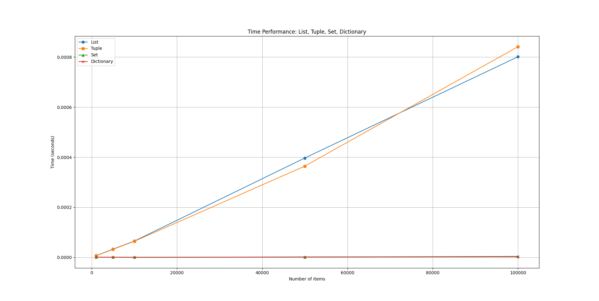
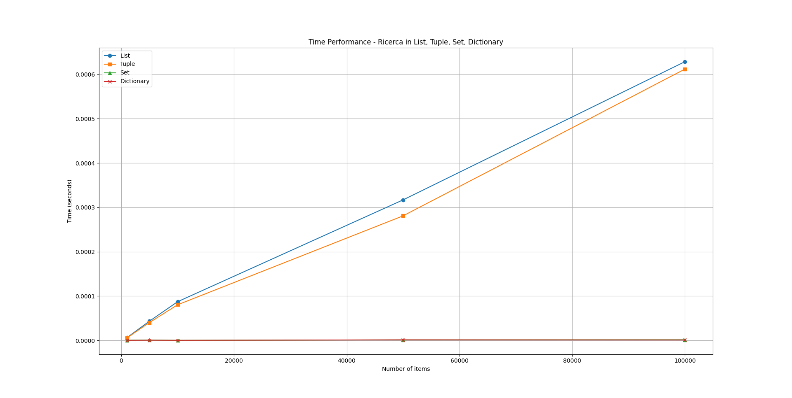
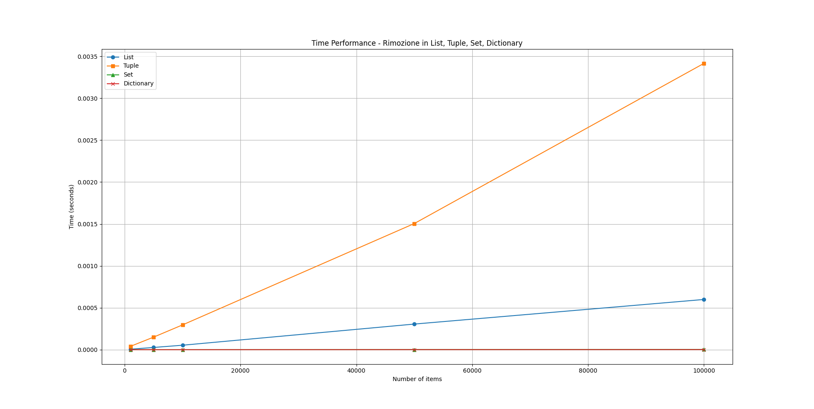

## 1. Introduzione

Python offre diverse strutture dati per gestire collezioni di elementi:

- **List**: sequenze ordinate e modificabili.
- **Tuple**: sequenze ordinate e immutabili.
- **Set**: insiemi non ordinati di elementi unici.
- **Dictionary**: collezioni di coppie chiave-valore.

In questa lezione confronteremo le caratteristiche principali di ciascuna.

## 2. Caratteristiche principali

| Tipo        | Ordinamento | Modificabile | Elementi duplicati | Accesso        |
|------------|------------|--------------|------------------|----------------|
| List       | Sì         | Sì           | Sì               | Indice         |
| Tuple      | Sì         | No           | Sì               | Indice         |
| Set        | No         | Sì           | No               | Non indicizzato|
| Dictionary | No (chiavi)| Sì           | Valori: sì; Chiavi: no | Chiave   |

## 3. Operazioni comuni

- **List**: `append()`, `remove()`, `pop()`, slicing, concatenazione
- **Tuple**: immutabile, slicing, concatenazione crea nuova tuple
- **Set**: `add()`, `remove()`, `union()`, `intersection()`, `difference()`
- **Dictionary**: `get()`, `keys()`, `values()`, `items()`, `pop()`

## 4. Quando usare cosa

| Struttura      | Quando usarla                            | Complessità principale         |
| -------------- | ---------------------------------------- | ------------------------------ |
| **List**       | Sequenze ordinate, iterazioni, slicing   | Ricerca O(n), Append O(1)      |
| **Tuple**      | Sequenze immutabili, dati costanti       | Ricerca O(n)                   |
| **Set**        | Elementi unici, membership test veloce   | Ricerca O(1), Inserimento/O(1) |
| **Dictionary** | Associare chiavi a valori, lookup rapido | Ricerca/O(1), Inserimento/O(1) |


## 5. Performance







### 5.1 Codice per la creazione del grafico del confronto LETTURA

```python
import time
import matplotlib.pyplot as plt

# Range di elementi
sizes = [1000, 5000, 10000, 50000, 100000]

# Liste per salvare i tempi
list_times = []
tuple_times = []
set_times = []
dict_times = []

for n in sizes:
    # Creiamo le strutture dati
    lista = list(range(n))
    tupla = tuple(range(n))
    insieme = set(range(n))
    dizionario = {i: None for i in range(n)}

    # Elemento da cercare (l'ultimo)
    target = n - 1

    # Lista
    start = time.time()
    target in lista
    list_times.append(time.time() - start)

    # Tupla
    start = time.time()
    target in tupla
    tuple_times.append(time.time() - start)

    # Set
    start = time.time()
    target in insieme
    set_times.append(time.time() - start)

    # Dictionary (chiavi)
    start = time.time()
    target in dizionario
    dict_times.append(time.time() - start)

# Grafico
plt.figure(figsize=(10,6))
plt.plot(sizes, list_times, marker='o', label='List')
plt.plot(sizes, tuple_times, marker='s', label='Tuple')
plt.plot(sizes, set_times, marker='^', label='Set')
plt.plot(sizes, dict_times, marker='x', label='Dictionary')
plt.xlabel("Number of items")
plt.ylabel("Time (seconds)")
plt.title("Time Performance: List, Tuple, Set, Dictionary")
plt.legend()
plt.grid(True)
plt.show()
```

### 5.2 Codice per la creazione del grafico del confronto per la RICERCA

```python
import time
import matplotlib.pyplot as plt

# Range di elementi
sizes = [1000, 5000, 10000, 50000, 100000]

# Liste per salvare i tempi
list_times = []
tuple_times = []
set_times = []
dict_times = []

for n in sizes:
    # Creiamo le strutture dati
    lista = list(range(n))
    tupla = tuple(range(n))
    insieme = set(range(n))
    dizionario = {i: None for i in range(n)}

    # Elemento da cercare (ultimo elemento)
    target = n - 1

    # Misuriamo il tempo di ricerca
    start = time.time(); target in lista; list_times.append(time.time() - start)
    start = time.time(); target in tupla; tuple_times.append(time.time() - start)
    start = time.time(); target in insieme; set_times.append(time.time() - start)
    start = time.time(); target in dizionario; dict_times.append(time.time() - start)

# Grafico ricerca
plt.figure(figsize=(10,6))
plt.plot(sizes, list_times, marker='o', label='List')
plt.plot(sizes, tuple_times, marker='s', label='Tuple')
plt.plot(sizes, set_times, marker='^', label='Set')
plt.plot(sizes, dict_times, marker='x', label='Dictionary')
plt.xlabel("Number of items")
plt.ylabel("Time (seconds)")
plt.title("Time Performance - Ricerca in List, Tuple, Set, Dictionary")
plt.legend()
plt.grid(True)
plt.show()
```

### 5.3 Codice per la creazione del grafico del confronto per la RIMOZIONE

```python
import time
import matplotlib.pyplot as plt

sizes = [1000, 5000, 10000, 50000, 100000]

list_times = []
tuple_times = []
set_times = []
dict_times = []

for n in sizes:
    # Creiamo le strutture dati
    lista = list(range(n))
    tupla = tuple(range(n))
    insieme = set(range(n))
    dizionario = {i: None for i in range(n)}

    target = n - 1

    # List - remove
    start = time.time()
    lista.remove(target)
    list_times.append(time.time() - start)

    # Tuple non modificabile → rimozione = creazione nuova tupla senza l'elemento
    start = time.time()
    tupla = tuple(x for x in tupla if x != target)
    tuple_times.append(time.time() - start)

    # Set - remove
    start = time.time()
    insieme.remove(target)
    set_times.append(time.time() - start)

    # Dictionary - remove chiave
    start = time.time()
    del dizionario[target]
    dict_times.append(time.time() - start)

# Grafico rimozione
plt.figure(figsize=(10,6))
plt.plot(sizes, list_times, marker='o', label='List')
plt.plot(sizes, tuple_times, marker='s', label='Tuple')
plt.plot(sizes, set_times, marker='^', label='Set')
plt.plot(sizes, dict_times, marker='x', label='Dictionary')
plt.xlabel("Number of items")
plt.ylabel("Time (seconds)")
plt.title("Time Performance - Rimozione in List, Tuple, Set, Dictionary")
plt.legend()
plt.grid(True)
plt.show()
```

## 6. Quiz a risposta multipla

import Quiz from '../../../components/Quiz.jsx';

<Quiz client:load questions={[
{
question: "1) Quale collezione non permette duplicati?",
answers: {
a: "List",
b: "Tuple",
c: "Set",
d: "Dictionary"
},
correctAnswer: "c"
},
{
question: "2) Quale collezione è immutabile?",
answers: {
a: "List",
b: "Tuple",
c: "Set",
d: "Dictionary"
},
correctAnswer: "b"
},
{
question: "3) Come si accede al valore di una chiave in un dizionario?",
answers: {
a: "auto[0]",
b: "auto.get('chiave')",
c: "auto['chiave']",
d: "b e c"
},
correctAnswer: "d"
},
{
question: "4) Quale struttura mantiene l'ordine degli elementi e permette modifiche?",
answers: {
a: "Tuple",
b: "Set",
c: "List",
d: "Dictionary"
},
correctAnswer: "c"
},
{
question: "5) Quale metodo permette di unire due set?",
answers: {
a: "add()",
b: "union()",
c: "append()",
d: "extend()"
},
correctAnswer: "b"
}
]} />