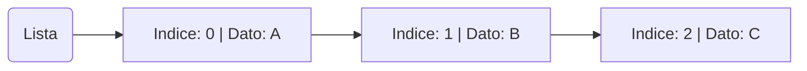

## 1. Introduzione alle Liste in Python

Le **liste** in Python sono una struttura dati fondamentale, poiché consentono di memorizzare una sequenza ordinata di elementi. Grazie alla loro mutabilità e versatilità, le liste permettono di raccogliere e manipolare dati in molti modi utili. Inoltre, Python offre diverse funzioni e metodi per creare, modificare e lavorare con le liste.



## 2. Caratteristiche delle Liste in Python

1. Ordinamento: Gli elementi sono ordinati in base alla posizione, e possiamo accedervi tramite indice.
2. Mutabilità: Le liste sono mutabili, quindi possiamo modificarne il contenuto dopo la creazione.
3. Tipi diversi: Una lista può contenere tipi diversi di dati, inclusi numeri, stringhe, e persino altre liste.

## 3. Funzioni principali

### 3.1 Creazione di una lista

```py
# Lista vuota
lista = []

# Lista con valori
lista = [1, 2, 3]

# Lista con valori ripetuti
lista = [0] * 10  # lista di 10 elementi con valore 0
```

### 3.2 Aggiungere elementi

- `append(x)`: Aggiunge x alla fine della lista.
- `insert(i, x)`: Inserisce x nella posizione i.
- `extend(iterable)`: Aggiunge tutti gli elementi di un altro iterabile.

```py
lista = [1, 2, 3]
lista.append(5)  # -> [1, 2, 3, 5]

lista = [1, 2, 3]
lista.insert(1, 10)  # -> [1, 10, 2, 3]

lista = [1, 2, 3]
lista.extend([4, 5, 6])  # -> [1, 2, 3, 4, 5, 6]
```

### 3.3 Rimuovere elementi

- `remove(x)`: Rimuove la prima occorrenza di x.
- `pop(i)`: Rimuove l'elemento nella posizione i.
- `clear()`: Svuota la lista.

```py
lista = [1, 2, 1, 3, 1]
lista.remove(1)  # -> [2, 1, 3, 1]

lista = [1, 2, 1, 3, 1]
lista.pop(2)  # -> 1, [1, 2, 3, 1]

lista = [1, 2, 1, 3, 1]
lista.clear()  # -> []
```

### 3.4 Ricerca di elementi

- `index(x[, start[, end]])`: Restituisce l'indice della prima occorrenza di x.
- `count(x)`: Restituisce il numero di occorrenze di x.

```py
lista = [1, 2, 3]
lista.index(1)  # -> 0
lista.count(3)  # -> 1
```

### 3.5 Ordinamento e inversione

- `sort(key=None, reverse=False)`: Ordina la lista in ordine crescente.
- `sorted(lista)`: Restituisce una copia ordinata della lista senza modificarla.
- `reverse()`: Inverte l'ordine degli elementi nella lista.

```py
lista = [2, 1, 3]
sorted(lista)  # -> [1, 2, 3]

lista = [2, 1, 3]
lista.reverse()  # -> [3, 1, 2]

lista = [2, 1, 3]
lista.sort(reverse=False)  # -> [1, 2, 3]
```

### 3.6 Operazioni di aggregazione

- Lunghezza: `len(lista)`
- Somma: `sum(lista)`
- Minimo e Massimo: `min(lista)` e `max(lista)`

```py
lista = [2, 1, 3]
len(lista)  # -> 3
sum(lista)  # -> 6
min(lista)  # -> 1
max(lista)  # -> 3
```

### 3.7 Copiare una lista

- `copy()`: Restituisce una copia superficiale.
- `list(lista)`: Crea una copia della lista originale.

```py
lista = [2, 1, 3]
lista.copy()  # -> [2, 1, 3]
list(lista)   # -> [2, 1, 3]
```

### 3.8 Comprensione delle liste

```py
[x**2 for x in range(10)]  # genera i quadrati dei numeri da 0 a 9
```

### 3.9 Altre funzioni utili

- `in`: Verifica se un elemento è presente nella lista.
- `not in`: Verifica se un elemento non è presente nella lista.

```py
lista = [2, 1, 3]
3 in lista  # -> True
1 not in lista  # -> False
```

### 3.10 Concatena e moltiplica liste

- `+`: Concatena due liste.
- `*`: Ripete la lista un certo numero di volte.

```py
lista1 = [2, 1, 3]
lista2 = [0, 1, 2]
lista1 + lista2  # -> [2, 1, 3, 0, 1, 2]
```

### 3.11 Accedere agli elementi

- `lista[i]`: Accede all'elemento alla posizione i.
- `lista[start:end:step]`: Slicing per ottenere un sottoinsieme della lista.

```py
lista = [2, 1, 3]
lista[0]       # -> 2
lista[0:2]     # -> [2, 1]
```

## 4. Algoritmi principali

### 4.1 Popolamento lista con random

```py
import random

lista = [0] * 10
for i in range(len(lista)):
    lista[i] = random.randint(0, 9)

print(lista)
```

### 4.2 Ricerca duplicati in una lista

```py
lista = [1, 2, 4, 0, 1, 2]
duplicati = []

for i in range(len(lista)):
    for j in range(i + 1, len(lista)):
        if lista[i] == lista[j] and lista[i] not in duplicati:
            duplicati.append(lista[i])

print(duplicati)  # stampa la lista dei duplicati
```

### 4.3 Ordinamento lista con il bubble sort

```py
lista = [1, 2, 4, 0, 1, 2]

for i in range(len(lista)):
    for j in range(i + 1, len(lista) - 1):
        if lista[j] > lista[j + 1]:
            lista[j], lista[j + 1] = lista[j + 1], lista[j]

print(lista)  # stampa la lista ordinata
```

### 4.4 Ricerca massimo senza usare max()

```py
lista = [1, 2, 4, 0, 1, 2]
massimo = lista[0]

for i in range(len(lista)):
    if lista[i] > massimo:
        massimo = lista[i]

print(massimo)  # stampa il massimo
```
