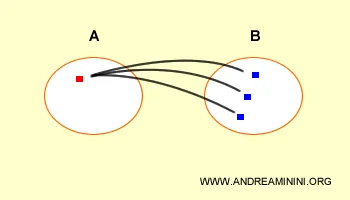

## 1. Introduzione

Alcuni link Importanti:

- La teoria degli insiemi: [La teoria degli insiemi](https://www.andreaminini.org/matematica/teoria-degli-insiemi/)
- Le basi di dati: [Database](https://www.andreaminini.com/database/)
- Wikipedia: [Algebra relazionale](https://it.wikipedia.org/wiki/Algebra_relazionale)

Definizione (di Wikipedia):

In [informatica](https://it.wikipedia.org/wiki/Informatica) l'**algebra relazionale** e il collegato [calcolo relazionale](https://it.wikipedia.org/wiki/Calcolo_relazionale) fanno parte dell'insieme di [linguaggi](https://it.wikipedia.org/wiki/Linguaggio_di_programmazione) che permettono di esaminare le [query](https://it.wikipedia.org/wiki/Query) (interrogazioni) da effettuare nell'ambito della gestione/utilizzo di un [database](https://it.wikipedia.org/wiki/Database). (da Wikipedia).

## 2. Tabelle Esempi

Per gli esempi successivi prendiamo in considerazione queste tabelle:

- Tabella PERSONE:

    | Nome | Cognome | Sesso | Matricola |
    | --- | --- | --- | --- |
    | Adrian | Neri | M | 9297 |
    | Mirco | Neri | M | 7432 |
    | Giada | Verdi | F | 9824 |
    | Marta | Bianchi | F | 9858 |
- Tabella PROGETTI:

    | Nome_P | Numero_P | Sede_P | Numero_D |
    | --- | --- | --- | --- |
    | ProgettoX | 1 | Bellaire | 5 |
    | ProgettoY | 2 | Sugarland | 5 |
    | ProgettoZ | 3 | Houston | 5 |
    | Informatizzazione | 10 | Salford | 4 |
    | Riorganizzazione | 20 | Houston | 1 |
    | nuove opportunità | 30 | Salford | 4 |
- Tabella SEDI_DIPARTIMENTO:

    | Numero_D | Sede_D |
    | --- | --- |
    | 1 | Houston |
    | 4 | Salford |
    | 5 | Bellaire |
    | 5 | Sugarland |
    | 5 | Houston |
- Tabella LAURETATI:

    | Matricola | Nome | Età |
    | --- | --- | --- |
    | 7274 | Rossi | 42 |
    | 7432 | Neri | 54 |
    | 9824 | Verdi | 45 |
- Tabella SPECIALISTI:

    | Matricola | Nome | Età |
    | --- | --- | --- |
    | 9297 | Neri | 33 |
    | 7432 | Neri | 54 |
    | 9824 | Verdi | 45 |

## 3. Operatori

Gli operatori si suddividono in 2 categorie principali:

> *Nota*: gli operatori di: Selezione, Proiezione, Ridenominazione, Unione, Differenza, Prodotto Cartesiano sono operatori di base (primitivi). Mentre i restanti 3 (intersezione, join, divisione) sono derivati dai primi 6.
>
- Operatori Unari:
    - Selezione;
    - Proiezione;
    - Ridenominazione.
- Operatori Binari:
    - Unione;
    - Differenza;
    - Prodotto Cartesiano;
    - Intersezione;
    - Join;
    - Divisione.

### 3.1 Selezione

La **selezione** è un operatore unario ortogonale dell'algebra relazionale che seleziona le tuple di una relazione (tabella) che soddisfano una particolare condizione. Il simbolo della selezione è sigma $σ$ o SEL.

$$
σ_{condizione}(relazione)
$$

oppure:

$$
SEL_{condizione}(relazione)
$$

Il risultato della selezione è una tabella con lo stesso schema della relazione r(X) in ingresso. Dove X è l'insieme degli attributi.

*Nota*: La selezione si dice **operatore "ortogonale"** perché seleziona le righe della tabella che soddisfano la condizione specificata, senza duplicazioni, mantenendo gli stessi attributi (X).

- *esempio 1:* Trovare i progetti sviluppati nella sede di Huston:

    *Soluzione*: $SEL_{SEDE\_P=HUSTON}(PROGETTO)$

    il risultato di questa query sarà:

    | Sede_P |
    | --- |
    | Houston |
    | Houston |
- *esempio 2:* Trovare il nome dei progetti e il numero di dipartimenti dei progetti sviluppati nella sede di Huston:

    *Soluzione*: $PROJ_{NOME\_P,\ NUM\_D}(SEL_{SEDE\_P=HUSTON}(PROGETTO))$

    il risultato di questa query sarà:

    | Nome_P | Numero_D |
    | --- | --- |
    | ProgettoZ | 5 |
    | Riorganizzazione | 1 |

### 3.2 Proiezione

La proiezione è un operatore unario ortogonale dell'algebra relazionale che seleziona alcuni attributi (colonne) di una relazione (tabella). Il simbolo della proiezione è la pi greco $\pi$ con in pedice la lista degli attributi e tra parentesi il nome della relazione:

$$
\pi_{attrributi}(relazione)
$$

oppure:

$$
PROJ_{attrributi}(relazione)
$$

Il risultato della proiezione è una tabella contenente al più tutte le ennuple della relazione in ingresso senza duplicazioni ma soltanto alcune colonne.

- *esempio:* Trovare il nome e il cognome delle persone:

    *Soluzione*: $PROJ_{NOME,\ COGNOME}(PERSONE)$

    il risultato di questa query sarà:

    | Nome | Cognome |
    | --- | --- |
    | Adrian | Neri |
    | Mirco | Neri |
    | Giada | Verdi |
    | Marta | Bianchi |

---

### 3.3 Ridenominazione

La ridenominazione è un operatore unario dell'algebra relazionale che permette di cambiare i nomi degli attributi di una relazione R. Il simbolo è $\rho$:

$$
\rho_{nuovonome \leftarrow nomeattributo}(relazione)
$$

oppure:

$$
REN_{nuovonome \leftarrow nomeattributo}(relazione)
$$

L'operazione di ridenominazione cambia soltanto i nomi degli attributi nello schema della relazione e non i dati nelle tuple.

Il contenuto della tabella resta tale e quale.

- *esempio 1:* Rinominare l'attributo “Nome” della tablella SPECIALISTI in “Cognome”:

    *Soluzione*: $REN_{Cognome \leftarrow Nome}(SPECIALISTI)$

    il risultato di questa query sarà:

    | Matricola | Cognome | Età |
    | --- | --- | --- |
    | 9297 | Neri | 33 |
    | 7432 | Neri | 54 |
    | 9824 | Verdi | 45 |
- *esempio 2:* Rinominare l'attributo “Nome” della tablella SPECIALISTI in “Cognome” e l'attributo “Età” in Anni:

    *Soluzione*: $REN_{Cognome,Anni \leftarrow Nome, Età}(SPECIALISTI)$

    il risultato di questa query sarà:

    | Matricola | Cognome | Anni |
    | --- | --- | --- |
    | 9297 | Neri | 33 |
    | 7432 | Neri | 54 |
    | 9824 | Verdi | 45 |

    ---

### 3.4 Unione

- In matematica: In termini rigorosi l'unione di due insiemi $A, \ B  \subseteq  \ E$ contenuti in un insieme universo $E$ é l'insieme contenente tutti gli elementi dell'insieme $A$ e tutti gli elementi dell'insieme $B$.
II simbolo di unione $\cup$, dunque indichiamo runione tra gli insiemi $A,\  B$ con la notazione:

    $$
    A \cup B
    $$

    La definizione di unione insiemistica in simboli é data dalla seguente rappresentazione per caratteristica:

    $$
    A \cup B := \{ x \in E \ | \ x \in A \ \vee x \in B \}
    $$

    - *esempio*: Consideriamo come insieme universo $E = \{1, \ 2, \ 3, \ 4, \ 5, \ 6, \ 7, \ 8, \ 9, \ 10\}$:

        e i seguenti suoi sottoinsiemi:

        $B = \{3, \ 4, \ 5\}$

        $D = \{8, \ 10\}$

        Quanto fa $B \cup D$?

        RISPOSTA:

        $B \cup D = \{3, \ 4, \ 5\} \cup \{8, \ 10\} = \{ 3, \ 4,  \ 5, \ 8, \ 10\}$

- In Algebra Relazionale: L'**unione** è un operatore insiemistico binario dell'algebra relazionale che unisce due relazioni r1 e r2 (tabelle) in un'unica relazione r3. Il simbolo dell'unione è $\cup$.

    $$
    r_3 = r_1 \ \cup \ r_2
    $$

    Le due relazioni operandi r1 e r2 devono avere lo stesso numero e tipo (dominio) di attributi da sinistra verso destra, ossia **tuple omogenee**.

    Il risultato è una relazione unione r3 composta da tutte le tuple delle due relazioni, senza duplicazioni.

    - *esempio 1:* Eseguire l'unione tra Laureati e Specialisti:

        *Soluzione*: $Laureati \cup Specialisti$

        il risultato di questa query sarà:

        | Matricola | Nome | Età |
        | --- | --- | --- |
        | 7274 | Rossi | 42 |
        | 7432 | Neri | 54 |
        | 9824 | Verdi | 45 |
        | 9297 | Neri | 33 |
    - *esempio 2:* Eseguire l'unione tra Laureati e Specialisti proiettando solo la matricola:

        *Soluzione*: $PROJ_{Matricola}(Laureati \cup Specialisti)$

        il risultato di questa query sarà:

        | Matricola |
        | --- |
        | 7274 |
        | 7432 |
        | 9824 |
        | 9297 |

        > *Nota*: Naturalmente l'unione viene eseguita anche sugli altri attributi, ma stiamo proiettando solo la matricola.
        >

---

### 3.5 Differenza

- In matematica: La differenza tra due insiemi $A,\ B \subseteq E$ contenuti in un insieme universo $E$ é per definizione l'operazione che sottrae agli elementi del primo insieme $A$ gli elementi del secondo insieme $B$.
II simbolo della differenza insiemistica é il meno -, o in alternativa la barra discendente \ così che l'insieme differenza tra $A$ e $B$ si indica in modo equivalente come:

    $$
    A - B \ \ \  ; \ \ \ A\setminus B
    $$

    Se volessimo descrivere la differenza insiemistica mediante simboli, potremmo scrivere:

    $$
    A - B := \{ x \in E \ | \ x \in A \ \wedge x \notin B \}
    $$

    - *esempio*: Consideriamo come insieme universo $E = \{1, \ 2, \ 3, \ 4, \ 5, \ 6, 7, \ 8, \ 9, \ 10\}$:

        e i seguenti suoi sottoinsiemi:

        $A = \{1, \ 3, \ 5, \ 7\}$

        $B = \{1, \ 3, \ 8, \ 9\}$

        Quanto fa $A - B$?

        RISPOSTA:

        $A - B = \{1, \ 3, \ 5, \ 7\} - \{1, \ 3, \ 8, \ 9\}  = \{ 5, \ 7\}$

- In Algebra Relazionale: La **differenza** è un operatore insiemistico binario dell'algebra relazionale che contiene le tuple presenti nella relazione r1, ma non nella relazione r2:

    $$
    r_3 = r_1 - r_2
    $$

    Le due relazioni operandi r1 e r2 hanno **tuple omogenee**. In pratica, le due tabelle hanno lo stesso numero di attributo e lo stesso dominio degli attributi visti da sinistra verso destra.

    Il risultato della differenza è una relazione composta dalle tuple presenti nella prima relazione ma non nella seconda.

    > *Nota Bene*: è possibile eseguire l'operazione di differenza tra 2 tabelle se e solo se hanno lo stesso schema
    >
    - *esempio:* Eseguire la differenza tra Laureati e Specialisti:

        *Soluzione*: $Laureati - Specialisti$

        il risultato di questa query sarà:

        | Matricola | Nome | Età |
        | --- | --- | --- |
        | 7274 | Rossi | 42 |

---

### 3.6 Prodotto Cartesiano

- In matematica: Il prodotto cartesiano è un'operazione tra due insiemi.
Dati due insiemi $A$ e $B$, il prodotto cartesiano $AxB$ è l'insieme di tutte le coppie ordinate $(a, b)$ dove il primo elemento $"a"$ appartiene all'insieme $A$ e il secondo elemento $"b"$ appartiene all'insieme $B$.

    

    il prodotto cartesiano è definito in questo modo:

    $$
    AxB := \{(a,b)\ |\ a\in A,\  b\in B\}
    $$

    Si legge "*A per B*" oppure "*A cartesiano B*".

    - *esempio*: Prendo in considerazione due insiemi A e B composti da due e tre elementi.

        $A = \{1, \ 3\}$

        $B = \{2, \ 4, \ 6\}$
        Il prodotto cartesiano AxB risulterà:

        $AxB = \{ (1, \ 2), \ (1, \ 4), \ (1, \ 6), \ (3, \ 2), \ (3, \ 4), \ (3, \ 6) \}$

- *In Algebra Relazionale:* Il **prodotto cartesiano** è un operatore binario insiemistico dell'algebra relazionale che, date due relazioni r1 e r2, crea una relazione composta da tutte le combinazioni possibili delle tuple della prima con le tuple della seconda. Il simbolo del prodotto cartesiano è $X$:

    $$
     r_3 = r_1 \ X \ r_2
    $$

    Nel prodotto cartesiano ogni tupla della prima relazione è seguita da tutte le tuple della seconda relazione.

    E' un operatore insiemistico perché ha lo stesso significato matematico del prodotto cartesiano nella teoria degli insiemi.

    - *esempio:* Trova il prodotto cartesiano fra PERSONE e LAUREATI:

        *Soluzione*: $PERSONE \  X \  LAUREATI$

        il risultato di questa query sarà:

        | Nome | Cognome | Sesso | Matricola | Matricola_L | Nome_L | Età_L |
        | --- | --- | --- | --- | --- | --- | --- |
        | Adrian | Neri | M | 9297 | 7274 | Rossi | 42 |
        | Adrian | Neri | M | 9297 | 7432 | Neri | 54 |
        | Adrian | Neri | M | 9297 | 9824 | Verdi | 45 |
        | Mirco | Neri | M | 7432 | 7274 | Rossi | 42 |
        | Mirco | Neri | M | 7432 | 7432 | Neri | 54 |
        | Mirco | Neri | M | 7432 | 9824 | Verdi | 45 |
        | Giada | … | … | … | … | … | … |
        | … | … | … | … | … | … | … |
    - *esempio:* Trova il prodotto cartesiano fra PERSONE e LAUREATI, questa volta estraendo solo le tuple significative:

        *Soluzione*: $SEL_{Matricola\_P = Matricola\_L} (PERSONE \ X \ LAUREATI)$

        il risultato di questa query sarà:

        | Nome | Cognome | Sesso | Matricola | Matricola_L | Nome_L | Età_L |
        | --- | --- | --- | --- | --- | --- | --- |
        | Mirco | Neri | M | 7432 | 7432 | Neri | 54 |
        | Giada | Verdi | F | 9824 | 9824 | Verdi | 45 |

---

### 3.7 Intersezione

- In matematica: Consideriamo due insiemi $A, \ B \subseteq E$ contenuti in un insieme universo $E$. Definiamo l'intersezione tra gli insiemi $A, \ B$ come l'insieme degli elementi appartenenti a entrambi gli insiemi, ossia degli elementi in comune tra di essi.
II simbolo di intersezione é $\bigcap$ , quindi per indicare I'intersezione tra $A$ e $B$ scriviamo:

    $$
    A \ \bigcap \ B
    $$

    Possiamo tradurre la definizione di intersezione insiemistica in simboli nel seguente modo:

    $$
    A \ \bigcap \ B := \{ x \in E \ | \ x \in A \ \wedge \ x \in B \}
    $$

    - *esempio*: Consideriamo come insieme universo $E = \{1, \ 2, \ 3, \ 4, \ 5, \ 6, 7, \ 8, \ 9, \ 10\}$:

        e i seguenti suoi sottoinsiemi:

        $A = \{1, \ 2, \ 3 \}$

        $B = \{3, \ 4, \ 5\}$

        Quanto fa $A \ \bigcap \ B$?

        RISPOSTA:

        $A \ \bigcap \ B = \{1, \ 2, \ 3 \} \ \bigcap \ \{3, \ 4, \ 5\}  = \{3\}$

- In Algebra Relazionale: L'**intersezione** è un operatore insiemistico binario dell'algebra relazionale che seleziona le tuple in comune in due relazioni r1 e r2 (tabelle). Il simbolo dell'intersezione è $⋂$.

    $$
     r_3 = r_1 ⋂ r_2
    $$

    Le due relazioni operandi r1 e r2 hanno tuple omogenee, ossia lo stesso numero e tipo (dominio) di attributi visti da sinistra verso destra.

    Il risultato dell'intersezione è una relazione composta dalle tuple presenti in entrambe le relazioni, senza duplicazioni.

    - *esempio:* Eseguire l'intersezione tra LAUREATI e SPECIALISTI:

        *Soluzione*: $LAUREATI ⋂ SPECIALISTI$

        il risultato di questa query sarà:

        | Matricola | Nome | Età |
        | --- | --- | --- |
        | 7432 | Neri | 54 |
        | 9824 | Verdi | 45 |

---

### 3.8 Join

L'operatore **join** in algebra relazionale correla i dati contenuti in relazioni diverse confrontando i valori. Esistono due tipi di join: il join naturale e il join condizionale (theta join).

Si tratta di un operatore che ha per operandi una o due relazioni (tabelle) in ingresso e fornisce in uscita un'altra relazione (tabella).

#### 3.8.1 Join Naturale

Il join naturale correla i dati in due relazioni diverse sulla base dei valori uguali negli attributi con lo stesso nome. Il simbolo del join naturale è una “farfalla” $⋈$.

$$
r1⋈r2 = {t \in X_1 \ \cup \  X_2 \ | \ t[X_1] \in r_1 \wedge t[X_2] \in r_2}
$$

Il presupposto è che ci siano due relazioni contenenti alcuni attributi con lo stesso nome.

3 casi:

- **Join completo:** Il join si dice completo se ogni tupla di ciascuna relazione degli operandi contribuisce almeno a una tupla del risultato.
- **Join incompleto:** Il join si dice incompleto se almeno una tupla delle relazioni degli operandi non contribuisce al risultato.
- **Join vuoto:** Il join si dice vuoto se nessuna tupla delle relazioni degli operandi contribuisce al risultato finale.

> *Nota*: Se nel join naturale non ci sono attributi in comune, il risultato è il prodotto cartesiano delle relazioni r1 x r2.
>

> Nota: Se nel join naturale tutti gli attributi in comune, il risultato è l'intersezione delle relazioni r1 x r2.
>

#### 3.8.2 Theta Join

Il **join condizionale (theta join)** correla i dati in due relazioni diverse sulla base di una condizione booleana. E' anche detto theta join. Il simbolo del join condizionale è una farfalla seguita da una C:

$$
r1⋈_Cr2
$$

L'operatore theta join legge le tuple della prima relazione e verifica quali tuple della seconda relazione soddisfano la condizione di join.

Se la condizione è soddisfatta le tuple sono combinate e aggiunte nella tabella di join.

Viceversa, le tuple che non la soddisfano sono escluse.

> *Nota*: Il join condizionale tra due relazioni r1 e r2 equivale a una selezione sul prodotto cartesiano delle relazioni r1 X r2.
>
- *esempio:* Eseguire la Join tra PERSONE e SPECIALISTI:

    *Soluzione*: $PERSONE ⋈_{Matricola\_P=Matricola\_S} (SPECIALISTI)$

    il risultato di questa query sarà:

    | Nome | Cognome | Sesso | Matricola | Matricola_S | Nome_S | Età_S |
    | --- | --- | --- | --- | --- | --- | --- |
    | Adrian | Neri | M | 9297 | 9297 | Neri | 33 |
    | Mirco | Neri | M | 7432 | 7432 | Neri | 54 |
    | Giada | Verdi | F | 9824 | 9824 | Verdi | 45 |

    > *Nota*: colorati in blu gli attributi e le tuple appartenenti alla tebella SPECILISTI.
    >

---

### 3.9 Divisione

La **divisione** è un operatore binario dell'algebra relazionale che contiene le tuple \<x\> della prima relazione A tali che per ogni tupla \<y\> della seconda relazione B ci sia una tupla \<x,y\> nella prima relazione:

$$
A \ / \ B= \{ <x> \ |  \ \ ∀<y> \ ∈B,<x,y> \ ∈A \}
$$

Si tratta di un operatore derivato perché si ottiene combinando altri operatori primitivi dell'algebra relazionale.

$$
A \ / \ B = ∏_x(A) - N
$$

Dove N sono i valori interdetti di A ossia quei valori \<x\> di A che associati a \<y\> di B formano una tupla \<x,y\> non presente in A.

$$
N = ∏_x((∏_x(A) * B)-A)
$$