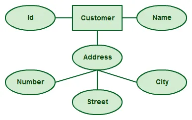

## 1. Introduzione

Un Diagramma Entità Relazione ( Diagramma ER) è una rappresentazione visiva delle **diverse entità all’interno di un sistema e del modo in cui si relazionano tra loro**. Ad esempio, l’autore degli elementi, il romanzo e il consumatore possono essere descritti utilizzando i diagrammi ER.

## 2. Simboli e Notazione

### 2.1 Entità

Un’entità può essere una persona, un luogo, un evento o un oggetto che è rilevante per un dato sistema. Ad esempio, un sistema scolastico può includere studenti, insegnanti, corsi di specializzazione, materie, tasse e altri elementi. Le entità sono rappresentate nei diagrammi ER da un rettangolo e denominate con nomi singolari.

## 2.2 Attributo

Un attributo è una proprietà, caratteristica o caratteristica di un’entità, relazione o altro attributo. Per esempio, l’attributo Inventory Item Name è un attributo dell’entità Inventory Item. Un’entità può avere tutti gli attributi necessari. Nel frattempo, anche gli attributi possono avere i loro specifici attributi. Ad esempio, l’attributo “indirizzo del cliente” può avere gli attributi numero, via, città e stato. Questi sono chiamati attributi compositi. Si noti che alcuni diagrammi ER di livello superiore non mostrano gli attributi per motivi di semplicità. In quelli che lo fanno, invece, gli attributi sono rappresentati da forme ovali.

### 2.3 Relazione

Una relazione descrive il modo in cui le entità interagiscono. Per esempio, l’entità “Falegname” può essere collegata all’entità “tabella” dalla relazione “costruisce” o “fa”. Le relazioni sono rappresentate da forme di diamante e sono etichettate con verbi.

## 3. Cardinalità

le Cardinalità definiscono ulteriormente le relazioni tra le entità collocando la relazione nel contesto dei numeri. In un sistema di posta elettronica, ad esempio, un account può avere più contatti. Il rapporto, in questo caso, segue un modello “uno a molti”.

## 4. Come disegnare i diagrammi ER

I punti sottostanti mostrano come creare un diagramma ER.

1. **Identificare tutte le entità** del sistema. Un’entità dovrebbe apparire una sola volta in un particolare diagramma. Creare rettangoli per tutte le entità e nominarli correttamente.
2. **Identificare le relazioni** tra le entità. Collegarli utilizzando una linea e aggiungere un diamante al centro che descriva il rapporto.
3. **Aggiungere gli attributi** per le entità. Dare nomi di attributi significativi in modo che possano essere compresi facilmente.

## 5. Esempi

[Esercizi online](https://www.ilprofdinformatica.it/le-mie-lezioni/database/esercizi-schema-e-r/soluzione-esercizi-schema-e-r)
