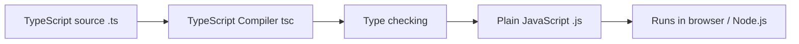

## 1. What is TypeScript?

**TypeScript** is a programming language created by Microsoft that adds **static types** on top of JavaScript. It is often described as a **superset of JavaScript**: every valid JavaScript program is also (mostly) valid TypeScript, but TypeScript adds extra syntax to describe the *shape* of your data — types.

TypeScript code does not run directly in a browser or in Node.js. It gets **compiled** (we also say **transpiled**) down to plain JavaScript first. The type annotations exist only while you are writing and checking the code; by the time it runs, they are gone.



<Aside variant="tip">
Think of TypeScript as JavaScript with a spell-checker for your data. It doesn't change how your program behaves at runtime — it changes how many mistakes you catch *before* runtime.
</Aside>

## 2. Dynamic typing in JavaScript

JavaScript is a **dynamically typed** language. This means a variable's type is not fixed: it is decided at runtime, based on whatever value currently lives in it, and it can change freely during the program's life.

```js
let myVariable = 10;       // number
console.log(myVariable);
myVariable = "Hello world!"; // now a string — perfectly legal in JS
console.log(myVariable);
```

Nothing stops you from reassigning `myVariable` to a completely different type. JavaScript does not check this while you write the code; it only ever cares about what is actually in the variable *right now*.

Compare this with **statically typed** languages, where a variable's type is fixed when it is declared (or inferred) and cannot change afterward. TypeScript brings this discipline to the JavaScript world.

## 3. Interpreted vs compiled: where the errors show up

Another key difference is *when* errors are detected.

- **Interpreted** languages (like plain JavaScript) read and execute code line by line, translating it into machine/byte code as they go. If there is a mistake three lines from the end of the file, the first two thirds of the program can run successfully before the crash happens.
- **Compiled** languages (like C++) analyze the *entire* program before producing anything runnable. A compiler can catch type-related errors — calling something that isn't a function, adding a string to a function, etc. — **before the program ever runs**.

Consider this JavaScript file:

```js
function test() {
}

test()(); // calling the result of test() as if it were a function
```

If you run this with `node demo.js`, Node.js starts executing line by line. There is nothing wrong with *defining* `test`, so nothing fails yet. Only when the engine reaches `test()()` does it discover the problem: `test()` returns `undefined` (a function with no `return` statement returns `undefined` by default), and then the code tries to *call* `undefined` as if it were a function. This throws a **runtime `TypeError`**: `test(...) is not a function`.

<Aside variant="warning">
In JavaScript this bug is invisible until the exact line runs. In a large program, a rarely executed code path (an `if` branch that only triggers in production, for example) can hide bugs like this for a long time.
</Aside>

TypeScript would catch this immediately while you are typing the code, because it can see that `test` has a return type of `void` (nothing) and `void` is not callable — no need to ever run the program.

## 4. Another JavaScript oddity

JavaScript is very permissive about mixing types in expressions:

```js
function test() {
}

const result = test + 2;
console.log(result); // "function test() {\n}2" — a string!
```

What happens here? JavaScript needs a single value out of `+`, so it converts both operands to a common type. Since one operand is a function (not a number), JavaScript falls back to **string coercion**: it calls `test.toString()` (which produces the function's source code as text) and concatenates it with `"2"`. The result is a nonsensical string, produced silently, with no error at all.

TypeScript rejects this at compile time: a function value and a `number` simply cannot be combined with `+`, and the compiler tells you so before you ever run the code.

<Aside variant="danger">
This is the real cost of pure dynamic typing: not that errors happen, but that some "errors" don't even look like errors — they just quietly produce garbage data, like the string above.
</Aside>

## 5. Static typing: the trade-off

In a **dynamically typed** language:

- Type errors are only discovered when the exact line of code executes (**runtime**).
- This makes the language very **flexible**: you can move fast, prototype quickly, and don't need to describe your data upfront.
- The cost is **reliability**: certain classes of bugs only show up in production, or in that one edge case nobody tested.

In a **statically typed** language:

- The compiler checks that every operation is valid *before* the program runs.
- This tends to improve **reliability** and can help tooling optimize **performance**.
- The cost is more upfront **ceremony**: you have to describe the shape of your data.

TypeScript's whole value proposition is to give you both: you keep writing JavaScript, with all its flexibility and its enormous ecosystem, but you *annotate* your code with types so the compiler can catch mistakes early, while your editor gains autocomplete, inline documentation, and safe refactoring.

## 6. How TypeScript fits into the picture

- TypeScript is a **superset** of JavaScript: valid JS is (almost always) valid TS.
- TypeScript uses **structural typing**: two types are considered compatible if they have a compatible *shape*, regardless of their names.
- The TypeScript compiler (`tsc`) performs **type checking** and then **emits plain JavaScript** — types are erased, they never exist at runtime.
- Because types disappear after compilation, you cannot use TypeScript types to make runtime decisions (e.g. you can't `if (typeof x === MyInterface)` — interfaces don't exist at runtime).

<Aside variant="info">
TypeScript doesn't replace JavaScript — it compiles *to* JavaScript. Any JS runtime (browsers, Node.js, Deno, Bun...) can run the output without knowing TypeScript ever existed.
</Aside>

## 7. Further reading

- [TypeScript Handbook — official docs](https://www.typescriptlang.org/docs/handbook/intro.html)
- [TypeScript Playground](https://www.typescriptlang.org/play) — try snippets like the ones above and see the compiled JavaScript output live
- [MDN — JavaScript data types and data structures](https://developer.mozilla.org/en-US/docs/Web/JavaScript/Data_structures)

## 8. Quiz

import Quiz from '../../../components/Quiz.jsx';

<Quiz client:load questions={[
{
question:"What best describes TypeScript's relationship with JavaScript?",
answers:{
a:"It is a completely separate language that runs independently of JavaScript",
b:"It is a superset of JavaScript that adds static types and compiles down to JavaScript",
c:"It replaces JavaScript engines like V8 with a new runtime",
d:"It is a JavaScript library imported at runtime"
},
correctAnswer:"b"
},
{
question:"In the example `function test() {} test()();`, why does this fail at runtime in plain JavaScript?",
answers:{
a:"Because `test` is never defined",
b:"Because JavaScript doesn't allow calling functions with no arguments",
c:"Because `test()` returns `undefined`, and `undefined` is then called as a function",
d:"Because JavaScript requires a `return` statement in every function"
},
correctAnswer:"c"
},
{
question:"What happens when you evaluate `test + 2` in JavaScript, where `test` is a function?",
answers:{
a:"It throws a TypeError immediately",
b:"It converts the function to its source code string and concatenates it with '2'",
c:"It converts the function to `NaN` and returns `NaN`",
d:"It silently returns `0`"
},
correctAnswer:"b"
},
{
question:"What is the key difference between a dynamically typed and a statically typed language?",
answers:{
a:"Dynamically typed languages cannot have variables",
b:"Statically typed languages cannot use loops",
c:"In dynamic typing, type errors surface at runtime; in static typing, they are checked before running",
d:"There is no meaningful difference"
},
correctAnswer:"c"
},
{
question:"What happens to TypeScript's type annotations when the code is compiled?",
answers:{
a:"They are converted into runtime checks that throw errors",
b:"They are kept in the output JavaScript as comments",
c:"They are erased — they exist only for compile-time checking",
d:"They are converted into JSON schema files"
},
correctAnswer:"c"
},
{
question:"Why is an interpreted language often described as 'more flexible' than a compiled one?",
answers:{
a:"Because it executes and translates code line by line, without requiring the whole program to be valid upfront",
b:"Because it does not support functions",
c:"Because it runs faster than compiled code",
d:"Because it has no syntax rules at all"
},
correctAnswer:"a"
}
]} />

## 9. Exercises

**Scenario**: You are onboarding a new teammate who has only ever written JavaScript, and they are skeptical about "adding extra syntax that does nothing at runtime."

**Task**:

1. Write a plain `.js` file that reproduces the `test()()` bug from this lesson, run it with Node.js, and observe the runtime `TypeError`.
2. Write a second snippet that reproduces the `test + 2` string-coercion oddity, and log the result to see the nonsensical string.
3. Open the [TypeScript Playground](https://www.typescriptlang.org/play), paste equivalent TypeScript code, and note exactly which line the compiler flags as an error, before you ever "run" anything.
4. In a few sentences, explain to your (imaginary) teammate why catching these two mistakes at compile time is valuable, even though the JavaScript engine underneath is unchanged.

*Learning objective: understand the practical difference between a runtime error caught late and a compile-time error caught early, and connect this to the core motivation for using TypeScript.*
