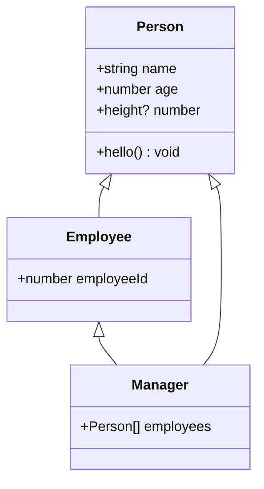

## 1. Introduction

An **interface** is a syntax construct that lets you describe the *shape* of an object: which properties it has, what type each property is, and which methods it exposes. Once you declare an interface, TypeScript will check every object you claim to be "of that interface" against that shape at compile time.

Interfaces don't produce any runtime code — they disappear completely once your TypeScript is compiled to JavaScript. They exist purely to help the compiler (and your editor's autocomplete) understand what a value looks like.

```ts
interface Person {
    name: string;
    age: number;
    height?: number;
    hello: () => void;
}
```

Here `Person` describes an object that must have a `name` (string), an `age` (number), an optional `height` (number, may be omitted), and a `hello` method with no parameters and no return value.

## 2. Implementing an interface with a plain object

```ts
const person: Person = {
    name: "Dennis",
    age: 25,
    hello: function () {
        console.log(this.name + " say hi");
    }
};
```

Notice that `person` never wrote `implements Person` anywhere — there's no such keyword for plain object literals. TypeScript simply checked: "does this object have a `name: string`, an `age: number`, and a `hello` function? Yes → it's a valid `Person`."

This is called **structural typing** (sometimes nicknamed "duck typing": *if it walks like a duck and quacks like a duck..."*). TypeScript doesn't care about *where* a type came from or what it was declared as — it only cares about the actual shape of the value.

<Aside variant="tip">
Structural typing is one of the biggest mental shifts coming from languages like Java or C#, where types are nominal — a class is only a `Person` if it explicitly says `class Employee implements Person`. In TypeScript, any object with a compatible shape qualifies, even if it was never declared against that interface.
</Aside>

### 2.1 Optional properties

The `height?: number` property uses the `?` modifier, meaning the property may be entirely absent from the object — not just `undefined`, but missing. That's exactly what happens above: `person` has no `height` field at all, and the compiler is happy with it.

```ts
// This also compiles: height is present
const tall: Person = {
    name: "Marco",
    age: 30,
    height: 1.9,
    hello() { console.log("hi"); }
};
```

<Aside variant="warning">
A common beginner mistake is assuming an optional property is always `string | undefined`-like and safe to use directly. If you read `person.height` without checking, TypeScript correctly infers its type as `number | undefined`, and using it in arithmetic without a guard (`person.height + 1`) will be flagged as an error, since `undefined` can't be added to a number.
</Aside>

## 3. Method signatures

The `hello: () => void` line describes a method using arrow-function syntax to define its type: no parameters, returns nothing (`void`). You could also write it with the shorthand method syntax, which behaves identically for type-checking purposes:

```ts
interface Person {
    name: string;
    age: number;
    hello(): void; // equivalent to hello: () => void
}
```

Both forms are structurally the same. The arrow-style is often preferred because it composes more naturally with optional methods (`hello?: () => void`) and matches how you'd type a standalone function variable.

## 4. Extending interfaces

An interface can build on top of another one using `extends`. The new interface inherits every property from the base interface and can add more of its own.

```ts
interface Employee extends Person {
    employeeId: number;
}

const worker: Employee = {
    name: "Dennis",
    age: 25,
    height: 1.76,
    employeeId: 10,
    hello: function () {
        console.log(this.name + " say hi");
    }
};
```

`worker` must satisfy *all* the fields from `Person` **and** the new `employeeId` field — `extends` is purely additive.

### 4.1 Extending multiple interfaces

An interface can extend more than one interface at once, separated by commas. This lets you compose several shapes together:

```ts
interface Manager extends Employee, Person {
    employees: Person[];
}

const manager: Manager = {
    name: "Dennis",
    age: 25,
    height: 1.76,
    employeeId: 10,
    hello: function () {
        console.log(this.name + " say hi");
    },
    employees: [worker, person]
};
```

Since `Employee` already extends `Person`, adding `Person` again here is redundant (it's already inherited transitively) — but TypeScript allows it as long as the fields don't conflict, which makes this a harmless — if slightly unusual — way of being explicit about a type's full ancestry.



## 5. `interface` vs `type` aliases

TypeScript also lets you describe object shapes with a `type` alias:

```ts
type PersonType = {
    name: string;
    age: number;
};
```

For plain object shapes, `interface` and `type` are largely interchangeable, but there are two notable differences worth knowing now (we'll go deeper in the [Type Aliases lesson](/informatica/typescript/14_type-aliases)):

- **Declaration merging**: if you declare the same `interface` twice in the same scope, TypeScript merges the two declarations into one combined shape. A `type` alias can never be redeclared — doing so is a compile error.
- **Composition style**: interfaces compose via `extends`; type aliases compose via intersections (`type Manager = Employee & Person & { employees: Person[] }`). Only `type` can alias things an interface fundamentally cannot express, such as unions (`type ID = string | number`).

<Aside variant="info">
A common rule of thumb in the TypeScript community: use `interface` for public object shapes that might need to be extended or merged (e.g. library APIs), and `type` for everything else — unions, tuples, function signatures, and one-off shapes.
</Aside>

## 6. Further reading

- [TypeScript Handbook — Object Types](https://www.typescriptlang.org/docs/handbook/2/objects.html)
- [TypeScript Handbook — Everyday Types (interfaces section)](https://www.typescriptlang.org/docs/handbook/2/everyday-types.html)
- [TypeScript Playground](https://www.typescriptlang.org/play)

## 7. Quiz

import Quiz from '../../../components/Quiz.jsx';

<Quiz client:load questions={[
{
question:"What does TypeScript check when you assign an object literal to a variable typed with an interface?",
answers:{
a:"That the object was created with an `implements` clause",
b:"That the object's shape structurally matches the interface",
c:"That the object's constructor name matches the interface name",
d:"Nothing — interfaces are only documentation"
},
correctAnswer:"b"
},
{
question:"What does the `?` in `height?: number` mean?",
answers:{
a:"The property must always be `null`",
b:"The property is required but can be any type",
c:"The property may be entirely absent from the object",
d:"The property is read-only"
},
correctAnswer:"c"
},
{
question:"What is the name for TypeScript's approach of matching object shapes instead of explicit type declarations?",
answers:{
a:"Nominal typing",
b:"Structural typing",
c:"Dynamic typing",
d:"Static binding"
},
correctAnswer:"b"
},
{
question:"What does `interface Manager extends Employee, Person { ... }` do?",
answers:{
a:"It causes a compile error because you can't extend two interfaces",
b:"It creates a union of Employee and Person",
c:"It combines the members of both Employee and Person into Manager",
d:"It picks whichever interface is declared first"
},
correctAnswer:"c"
},
{
question:"Which of these can a `type` alias do that a plain `interface` cannot?",
answers:{
a:"Describe a method signature",
b:"Alias a union type like `string | number`",
c:"Have optional properties",
d:"Be used to type an object literal"
},
correctAnswer:"b"
},
{
question:"What happens if you declare the same `interface` twice in the same scope?",
answers:{
a:"TypeScript throws a runtime error",
b:"The second declaration is ignored",
c:"TypeScript merges both declarations into one shape",
d:"It's identical to redeclaring a `type` alias"
},
correctAnswer:"c"
}
]} />

## 8. Exercises

### 8.1 Exercise

**Scenario**: You're building a small library catalog and need to model books and their authors using interfaces.

**Task**:
1. Create an interface `Author` with `name: string` and an optional `bio?: string`.
2. Create an interface `Book` with `title: string`, `pages: number`, and `author: Author`.
3. Create an interface `EBook extends Book` that adds `fileSizeMb: number` and a method `download(): void`.
4. Create at least one object literal for each interface and log a formatted description of each to the console.

*Learning objective: practice defining nested interfaces, optional properties, and extending an interface with additional members.*

### 8.2 Exercise

**Scenario**: Your team wants to enforce a consistent shape for API error responses across a project, and also allow interfaces to merge shapes together.

**Task**:
1. Define an interface `ApiError` with `code: number` and `message: string`.
2. Define an interface `ValidationError extends ApiError` that adds `field: string`.
3. Write a function `logError(error: ApiError): void` that accepts *any* object with a compatible shape, not just objects explicitly typed as `ApiError` — call it with a plain object literal to prove structural typing works.
4. Explain (in a comment) why the function accepts objects that were never declared as `ApiError`.

*Learning objective: understand how structural typing lets unrelated object literals satisfy the same interface, and how interface extension builds specialized error shapes.*
