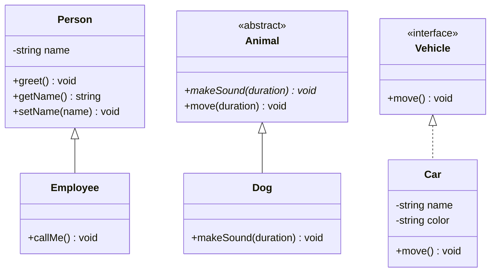

## 1. Introduction

JavaScript classes already give you constructors, methods, and inheritance — but they don't let you enforce visibility rules or abstract contracts at compile time. TypeScript builds on top of plain JavaScript classes and adds **access modifiers**, **abstract classes**, and compile-time checking for **interface implementation**. None of this changes what a class looks like at runtime; it's all erased once compiled to JavaScript, but it catches an entire category of mistakes before your code ever runs.

## 2. Access modifiers

TypeScript supports three access modifiers on class members: `public` (default, accessible from anywhere), `private` (accessible only inside the declaring class), and `protected` (accessible inside the declaring class and its subclasses).

```ts
class Person {
    private name: string;

    constructor(name: string) {
        this.name = name;
    }

    public greet() {
        console.log(`Hello, my name is ${this.name}`);
    }

    public getName() {
        return this.name;
    }

    public setName(name: string) {
        this.name = name;
    }
}
```

Here `name` is `private`, so `person.name` outside the class is a compile error — you're forced to go through the public `getName()`/`setName()` accessors instead. This is the classic **encapsulation** pattern: hide the internal representation, expose a controlled surface.

<Aside variant="tip">
Constructor parameters can be turned directly into class fields with the **parameter property** shorthand — a nice ergonomic shortcut once you're comfortable with the explicit form:

```ts
class Person {
    constructor(private name: string) {}

    public greet() {
        console.log(`Hello, my name is ${this.name}`);
    }
}
```

Adding an access modifier (`private`, `public`, `protected`, or even `readonly`) directly in front of a constructor parameter both declares the field and assigns it — no need to write `this.name = name` at all.
</Aside>

<Aside variant="warning">
`private` in TypeScript is a **compile-time-only** restriction — it doesn't exist in the emitted JavaScript, and determined code can still access the field at runtime (e.g. via `(person as any).name`). If you need true runtime privacy, use JavaScript's native `#name` private fields instead.
</Aside>

## 3. Inheritance with `extends`

A class can extend another class with `extends`, inheriting its public and protected members and gaining the ability to add or override behavior.

```ts
class Employee extends Person {
    public callMe() {
        console.log(this.getName());
    }
}

const p1 = new Person("Dennis");
p1.greet();

const p2 = new Employee("Dennis");
p2.callMe();
```

Note that `Employee` calls `this.getName()`, not `this.name` directly — because `name` is `private` on `Person`, it's invisible even to a subclass. If you want subclasses to have direct access to a field, declare it `protected` instead of `private`.

## 4. Abstract classes

An **abstract class** is a class that cannot be instantiated directly — it exists only to be extended. It can declare **abstract methods**: methods with a signature but no implementation, which every concrete subclass is required to implement.

```ts
abstract class Animal {
    abstract makeSound(duration: number): void;

    public move(duration: number) {
        console.log("Moving alone...");
        this.makeSound(duration);
    }
}

class Dog extends Animal {
    public makeSound(duration: number) {
        console.log("Woof woof");
    }
}

const dog = new Dog();
dog.move(10);
```

`Animal` defines the *shared* behavior (`move`) once, and delegates the *varying* behavior (`makeSound`) to whichever concrete subclass implements it. This is a form of the **template method pattern**: the abstract class controls the overall algorithm shape, subclasses fill in the blanks.

<Aside variant="danger">
Trying to write `new Animal()` is a compile-time error — you cannot instantiate an abstract class, precisely because `makeSound` has no body to run. Only concrete (non-abstract) subclasses that implement every abstract member can be instantiated.
</Aside>

## 5. Implementing an interface with `implements`

An `interface` only declares that something exists — it never provides behavior. A class uses `implements` to promise the compiler it will provide a concrete implementation for every member of that interface.

```ts
interface Vehicle {
    move(): void;
}

class Car implements Vehicle {
    private name: string;
    private color: string;

    constructor(name: string, color: string) {
        this.name = name;
        this.color = color;
    }

    public move() {
        console.log(`Car ${this.name} is moving, and the color is ${this.color}`);
    }
}

const car = new Car("Ford", "Black");
car.move();
```

If `Car` forgot to implement `move()`, TypeScript would refuse to compile with an error like "Class 'Car' incorrectly implements interface 'Vehicle'".

### 5.1 `extends` vs `implements`

These two keywords look similar but mean very different things:

| | `extends` | `implements` |
|---|---|---|
| Used with | classes extending a class/interface | classes fulfilling an interface's contract |
| Inherits behavior? | Yes — actual method bodies are inherited | No — only the shape is enforced, you write all the code |
| How many? | A class can `extends` only one class | A class can `implements` multiple interfaces |

```ts
class ElectricCar extends Car implements Vehicle {
    // extends Car: reuses Car's implementation
    // implements Vehicle: also promises to satisfy Vehicle's shape (already true via Car)
}
```



## 6. Further reading

- [TypeScript Handbook — Classes](https://www.typescriptlang.org/docs/handbook/2/classes.html)
- [TypeScript Handbook — Classes: Member Visibility](https://www.typescriptlang.org/docs/handbook/2/classes.html#member-visibility)
- [TypeScript Playground](https://www.typescriptlang.org/play)

## 7. Quiz

import Quiz from '../../../components/Quiz.jsx';

<Quiz client:load questions={[
{
question:"Which access modifier allows a member to be used by the declaring class and its subclasses, but not from outside code?",
answers:{
a:"private",
b:"protected",
c:"public",
d:"readonly"
},
correctAnswer:"b"
},
{
question:"What does the parameter property shorthand `constructor(private name: string) {}` do?",
answers:{
a:"Only validates the parameter type at runtime",
b:"Declares a private field and assigns it in one step",
c:"Makes the constructor itself private",
d:"Is only valid in abstract classes"
},
correctAnswer:"b"
},
{
question:"Why can't you write `new Animal()` when `Animal` is declared `abstract`?",
answers:{
a:"Abstract classes can never have a constructor",
b:"Abstract classes are only allowed one subclass",
c:"An abstract method like makeSound has no implementation to run",
d:"TypeScript doesn't support abstract classes"
},
correctAnswer:"c"
},
{
question:"What is the key difference between `extends` and `implements` on a class?",
answers:{
a:"There is no difference, they are aliases",
b:"extends inherits actual behavior, implements only enforces a shape",
c:"implements can only be used with abstract classes",
d:"extends can be used with multiple interfaces, implements only one"
},
correctAnswer:"b"
},
{
question:"What happens if a class implements an interface but forgets one of its methods?",
answers:{
a:"TypeScript silently adds a default implementation",
b:"It compiles fine, and the method is `undefined` at runtime",
c:"It is a compile-time error",
d:"The method becomes automatically abstract"
},
correctAnswer:"c"
},
{
question:"In the Animal/Dog example, what design pattern does the abstract `move` + abstract `makeSound` combination resemble?",
answers:{
a:"Singleton pattern",
b:"Template method pattern",
c:"Observer pattern",
d:"Factory pattern"
},
correctAnswer:"b"
}
]} />

## 8. Exercises

### 8.1 Exercise

**Scenario**: You're modeling a simple shape hierarchy for a drawing application.

**Task**:
1. Create an abstract class `Shape` with an abstract method `area(): number` and a concrete method `describe(): void` that logs `"This shape has an area of X"` using `this.area()`.
2. Create concrete classes `Circle` (constructor takes `radius`) and `Rectangle` (constructor takes `width` and `height`), each extending `Shape` and implementing `area()`.
3. Create an array of `Shape` (containing both a `Circle` and a `Rectangle`) and call `describe()` on each.
4. Try instantiating `Shape` directly and note the compiler error you get.

*Learning objective: practice abstract classes, method overriding, and polymorphism through a shared base type.*

### 8.2 Exercise

**Scenario**: You're building a payments module and want a common contract for anything that can be charged, plus encapsulated account balances.

**Task**:
1. Define an interface `Payable` with a method `charge(amount: number): boolean`.
2. Create a class `BankAccount implements Payable` with a `private balance: number` set via the constructor.
3. Implement `charge()` so it returns `false` (and logs a warning) if `amount` exceeds the balance, otherwise deducts it and returns `true`.
4. Add public methods `getBalance()` and `deposit(amount: number)`.
5. Create a subclass `SavingsAccount extends BankAccount` that overrides `charge()` to also apply a fixed withdrawal fee.

*Learning objective: combine `implements` for contract enforcement with `private` encapsulation and inheritance-based overriding.*
