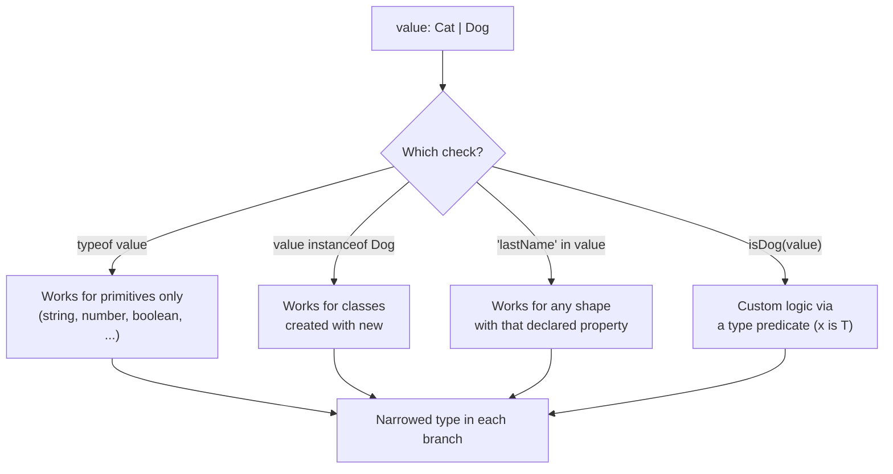

## 1. Introduction

**Type guards** are runtime checks that TypeScript understands and uses to **narrow** the type of a value inside a conditional block. Whenever you have a union type — a value that could be one of several shapes — a type guard is how you tell the compiler "in this branch, treat the value as this more specific type."

TypeScript ships with several kinds of built-in narrowing (`typeof`, `instanceof`, the `in` operator), and it also lets you author your **own** custom guards with the `is` syntax when the built-in ones aren't expressive enough.

## 2. `typeof` narrowing

`typeof` works great for narrowing between **primitive** types:

```ts
type StringOrNumber = string | number;

function add1(value: StringOrNumber): StringOrNumber {
  if (typeof value === "string") {
    return value + "1"; // value is string here
  } else {
    return value + 1; // value is number here
  }
}
```

Inside the `if` branch, TypeScript narrows `value` to `string`; inside the `else`, by elimination, it narrows to `number`. This works because `typeof` in JavaScript returns a small, fixed set of string literals (`"string"`, `"number"`, `"boolean"`, `"object"`, `"function"`, `"undefined"`, `"symbol"`, `"bigint"`), and TypeScript special-cases comparisons against them.

<Aside variant="tip">
`typeof` narrowing only helps with primitives and `function`. For distinguishing between classes or object shapes, you need `instanceof` or the `in` operator instead.
</Aside>

## 3. `instanceof` narrowing

When your union is made of **classes**, `instanceof` checks the prototype chain at runtime and narrows accordingly:

```ts
class Dog {
  public firstName: string;
  public lastName: string;
  public constructor(firstName: string, lastName: string) {
    this.firstName = firstName;
    this.lastName = lastName;
  }
}

class Cat {
  public firstName: string;
  public constructor(firstName: string) {
    this.firstName = firstName;
  }
}

function getNameInstanceof(animal: Cat | Dog) {
  if (animal instanceof Cat) {
    console.log(`The name is ${animal.firstName}`);
  } else {
    console.log(`The name is ${animal.firstName}, ${animal.lastName}`);
  }
}
```

`instanceof` is reliable as long as you're dealing with real classes created via `new`. It won't help with plain object literals or interfaces, since those have no runtime constructor to check against.

## 4. `in` operator narrowing

The `in` operator checks whether a **property name** exists on an object at runtime. It works even for plain object shapes that aren't classes:

```ts
function getNameIn(animal: Cat | Dog) {
  if ("lastName" in animal) {
    console.log(`The name is ${animal.firstName}, ${animal.lastName}`);
  } else {
    console.log(`The name is ${animal.firstName}`);
  }
}
```

TypeScript looks at which member(s) of the union declare a `lastName` property and narrows accordingly. This is the same mechanism you saw with `"birthday" in contract` in the previous lesson.

<Aside variant="warning">
`in` narrows based on the **declared** shape of the type, not on whether the property actually has a defined value at runtime. An object with `lastName: undefined` still satisfies `"lastName" in animal` if the property key is present. Keep this distinction in mind for optional properties.
</Aside>

## 5. Custom type guards with `is`

Sometimes neither `typeof`, `instanceof`, nor `in` capture the exact logic you need. You can write your **own** narrowing function using a **type predicate** — a return type of the form `parameterName is SomeType`:

```ts
function isDog(pet: Cat | Dog): pet is Dog {
  return (pet as Dog).lastName !== undefined;
}

function getName(animal: Cat | Dog) {
  if (isDog(animal)) {
    console.log(`The name is ${animal.firstName}, ${animal.lastName}`);
  } else {
    console.log(`The name is ${animal.firstName}`);
  }
}
```

The important detail is that `pet is Dog` is a **compile-time-only signal** to the type checker. Calling `isDog(animal)` doesn't throw, transform, or validate anything by itself — it's an ordinary function that returns a `boolean`. What makes it special is the *type* of that boolean: TypeScript trusts your implementation and narrows `animal` to `Dog` in the `if` branch (and to `Cat` in the `else` branch) purely based on the declared predicate, not on any additional runtime magic.

<Aside variant="danger">
Because the compiler trusts a type predicate unconditionally, a buggy `is` function can lie to the type system — for example, always returning `true`. This produces no compile error but can cause incorrect narrowing and runtime bugs later. Keep type predicate functions small, honest, and well-tested.
</Aside>

## 6. Comparing the three approaches



As a rule of thumb:

- use **`typeof`** for primitives;
- use **`instanceof`** for class instances;
- use **`in`** for plain object shapes without a discriminant field;
- use a **custom type guard** when the check needs extra logic (multiple conditions, external validation, etc.) or when you want a reusable, named check.

## 7. Further reading

- [TypeScript Handbook — Narrowing](https://www.typescriptlang.org/docs/handbook/2/narrowing.html)
- [TypeScript Handbook — Everyday Types (typeof, instanceof)](https://www.typescriptlang.org/docs/handbook/2/everyday-types.html)
- [TypeScript Playground](https://www.typescriptlang.org/play)

## 8. Quiz

import Quiz from '../../../components/Quiz.jsx';

<Quiz client:load questions={[
{
question:"Which type guard is best suited for narrowing between primitive types like string and number?",
answers:{
a:"instanceof",
b:"typeof",
c:"in",
d:"A custom type predicate is required"
},
correctAnswer:"b"
},
{
question:"Which operator checks the prototype chain at runtime and works well with classes created via new?",
answers:{
a:"typeof",
b:"in",
c:"instanceof",
d:"as"
},
correctAnswer:"c"
},
{
question:"What does the `in` operator check at runtime?",
answers:{
a:"Whether a value is an instance of a class",
b:"Whether a given property name exists on an object",
c:"Whether a variable is a string",
d:"Whether a function returns a boolean"
},
correctAnswer:"b"
},
{
question:"In `function isDog(pet: Cat | Dog): pet is Dog { ... }`, what does the `pet is Dog` return type actually do at runtime?",
answers:{
a:"It throws an error if pet is not a Dog",
b:"It automatically converts pet into a Dog instance",
c:"Nothing at runtime — it is a compile-time signal that lets TypeScript narrow the type after the call",
d:"It removes the Cat type from the union permanently"
},
correctAnswer:"c"
},
{
question:"What is a realistic risk of a poorly implemented custom type guard?",
answers:{
a:"It will always fail to compile",
b:"It can incorrectly narrow a type since TypeScript trusts the predicate without further verification",
c:"It cannot be used with unions",
d:"It forces the function to become async"
},
correctAnswer:"b"
},
{
question:"Which narrowing technique works for a plain object shape that isn't backed by a class constructor?",
answers:{
a:"instanceof",
b:"typeof",
c:"in (or a custom type guard)",
d:"None of the above can narrow plain object shapes"
},
correctAnswer:"c"
}
]} />

## 9. Exercises

**Scenario**: You are building a notification system where a `Notification` can be an `EmailNotification` (with `to: string`, `subject: string`) or a `PushNotification` (with `deviceId: string`, `title: string`).

**Task**:

1. Define both interfaces and the union type `Notification = EmailNotification | PushNotification`.
2. Write a function `send(notification: Notification)` that uses the `in` operator to check for `to` vs `deviceId` and logs an appropriate message for each case.
3. Rewrite the same function using a custom type guard `isEmailNotification(n: Notification): n is EmailNotification` instead of `in`, and compare the resulting code.
4. Add a third variant `SmsNotification` (`phoneNumber: string`, `message: string`) to the union and update both versions of `send` to handle it.

*Learning objective: practice choosing between the `in` operator and a custom type guard, and see how adding a union member forces you to update every narrowing branch.*

**Scenario**: A logging utility receives values of type `unknown` from an external API response and needs to safely narrow them before processing.

**Task**:

1. Write a function `describe(value: unknown): string` that uses `typeof` checks to handle `"string"`, `"number"`, and `"boolean"` cases, returning a descriptive string for each.
2. Add a class `Point { constructor(public x: number, public y: number) {} }` and extend `describe` with an `instanceof Point` branch that formats it as `"(x, y)"`.
3. Add a final `else` branch for anything else, returning `"unknown value"`.
4. Explain, in a comment, why `typeof` alone would not have been enough to detect the `Point` case.

*Learning objective: combine multiple narrowing techniques (`typeof` and `instanceof`) in a single function that safely handles a value of type `unknown`.*
