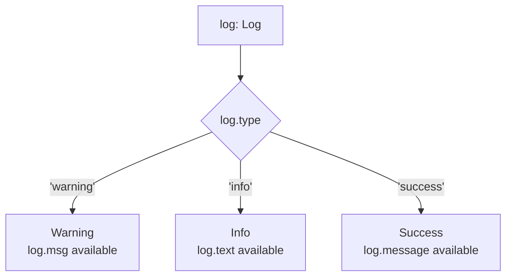

## 1. Introduction

In the previous lesson you narrowed unions using `typeof`, `instanceof`, `in`, and custom type guards. Those techniques work, but they require you to write a check every time. **Discriminated unions** (also called **tagged unions**) take a different, more scalable approach: every member of the union shares a common property — the **discriminant** or **tag** — whose value is a distinct **literal type**. TypeScript can then narrow the entire union automatically inside a `switch` or `if` based purely on that tag, without any extra type guard code.

This pattern is one of the most powerful and idiomatic ways to model variants, results, and events in TypeScript.

## 2. Defining a discriminated union

```ts
interface Warning {
  type: "warning";
  msg: string;
}

interface Info {
  type: "info";
  text: string;
}

interface Success {
  type: "success";
  message: string;
}

type Log = Warning | Info | Success;
```

Notice that each interface has a `type` property, and each one is typed as a **specific string literal** (`"warning"`, `"info"`, `"success"`) rather than the general `string`. That's what makes this a discriminated union: the `type` field acts as a unique fingerprint identifying which member of `Log` you're dealing with.

<Aside variant="tip">
The discriminant property doesn't have to be called `type` — `kind`, `status`, or `tag` are equally common names. What matters is that it exists on every member with a distinct literal value.
</Aside>

## 3. Narrowing automatically with `switch`

```ts
function handleMessage(log: Log) {
  switch (log.type) {
    case "warning":
      console.log(log.msg); // log is narrowed to Warning
      break;
    case "info":
      console.log(log.text); // log is narrowed to Info
      break;
    case "success":
      console.log(log.message); // log is narrowed to Success
      break;
  }
}
```

Inside each `case`, TypeScript automatically knows the exact shape of `log` — no `instanceof`, no `in`, no custom type guard required. This is dramatically less error-prone than the alternatives, especially as the union grows to five, ten, or more variants: you just add a new interface, add it to the union, and add a new `case`.

## 4. Why this pattern scales so well



Compare this to the union/intersection and type-guard techniques from the previous two lessons: `in` and custom guards work, but each one requires a bespoke check written by hand. A discriminated union shifts that responsibility onto the **type system itself** — you describe the shapes once, and the compiler does the narrowing for every consumer of the type.

This pattern shows up constantly in real code:

- HTTP results: `{ status: "ok", data: T } | { status: "error", error: string }`;
- UI events: `{ type: "click", x: number, y: number } | { type: "keydown", key: string }`;
- Redux-style actions: `{ type: "ADD_ITEM", payload: Item } | { type: "REMOVE_ITEM", id: string }`.

## 5. Exhaustiveness checking

One of the best reasons to use discriminated unions is that TypeScript can help you catch **missing cases** at compile time. Add a `default` branch that assigns the value to a variable typed `never`:

```ts
function handleMessageExhaustive(log: Log) {
  switch (log.type) {
    case "warning":
      console.log(log.msg);
      break;
    case "info":
      console.log(log.text);
      break;
    case "success":
      console.log(log.message);
      break;
    default:
      // If every case above is handled, log has type `never` here.
      const _exhaustive: never = log;
      return _exhaustive;
  }
}
```

If someone later adds a fourth variant — say `Error` — to the `Log` union but forgets to add a matching `case`, the `default` branch will receive a value that is **not** `never` (it will still be typed as `Error`), and the assignment `const _exhaustive: never = log;` will fail to compile. This turns a silent runtime gap into a loud compile-time error, which is extremely valuable as a codebase evolves.

<Aside variant="warning">
Exhaustiveness checking only works if there's no `case` that implicitly falls through without a `break`/`return`, and if the `default` branch is actually reachable in every code path. Keep each `case` self-contained.
</Aside>

<Aside variant="info">
Discriminated unions are sometimes called "tagged unions" or "sum types" in other typed languages (e.g. Rust's `enum`, Swift's `enum` with associated values). The underlying idea — a value that is exactly one of several known variants, each carrying different data — is the same.
</Aside>

## 6. Further reading

- [TypeScript Handbook — Narrowing (discriminated unions)](https://www.typescriptlang.org/docs/handbook/2/narrowing.html#discriminated-unions)
- [TypeScript Handbook — Everyday Types](https://www.typescriptlang.org/docs/handbook/2/everyday-types.html)
- [TypeScript Playground](https://www.typescriptlang.org/play)

## 7. Quiz

import Quiz from '../../../components/Quiz.jsx';

<Quiz client:load questions={[
{
question:"What makes a union of interfaces a 'discriminated union'?",
answers:{
a:"Every member has at least one optional property",
b:"Every member shares a common property with a distinct literal type value",
c:"The union has exactly two members",
d:"All members extend the same base class"
},
correctAnswer:"b"
},
{
question:"In the Log example, what type does `log.type` have on the Warning interface?",
answers:{
a:"string",
b:"The literal type \"warning\"",
c:"boolean",
d:"any"
},
correctAnswer:"b"
},
{
question:"Inside `case \"info\":` of the switch statement, what does TypeScript infer about `log`?",
answers:{
a:"It remains the full Log union",
b:"It is narrowed specifically to the Info interface",
c:"It becomes never",
d:"It becomes unknown"
},
correctAnswer:"b"
},
{
question:"What is the purpose of `const _exhaustive: never = log;` in a default branch?",
answers:{
a:"It improves runtime performance",
b:"It forces a compile error if a new union member is added without a matching case",
c:"It converts log into a string",
d:"It is required syntax for every switch statement"
},
correctAnswer:"b"
},
{
question:"Compared to using the `in` operator or a custom type guard for each check, what is the main advantage of a discriminated union?",
answers:{
a:"It removes the need to define interfaces",
b:"The compiler narrows the type automatically from the tag, without writing a bespoke check for each branch",
c:"It only works with classes",
d:"It eliminates the need for a switch statement"
},
correctAnswer:"b"
},
{
question:"Which of these is NOT typically used as a discriminant/tag property name?",
answers:{
a:"type",
b:"kind",
c:"status",
d:"constructor"
},
correctAnswer:"d"
}
]} />

## 8. Exercises

**Scenario**: You are modeling the result of an asynchronous API call that can either succeed with data or fail with an error message.

**Task**:

1. Define a discriminated union `ApiResult<T>` with two variants: `{ status: "success"; data: T }` and `{ status: "error"; error: string }`.
2. Write a function `handleResult<T>(result: ApiResult<T>)` that uses a `switch` on `status` to log the data or the error appropriately.
3. Add exhaustiveness checking with a `default` branch and a `never`-typed variable.
4. Add a third variant `{ status: "loading" }` to `ApiResult<T>` and update `handleResult` — first verify the compiler complains about the missing case in `handleResult`, then fix it.

*Learning objective: model a realistic success/error/loading pattern with a discriminated union and rely on exhaustiveness checking to catch an incomplete switch.*

**Scenario**: You are building a simple event system for a UI component library.

**Task**:

1. Define three event interfaces sharing a `type` discriminant: `ClickEvent` (`type: "click"`, `x: number`, `y: number`), `KeyDownEvent` (`type: "keydown"`, `key: string`), and `ResizeEvent` (`type: "resize"`, `width: number`, `height: number`).
2. Create the union `UiEvent = ClickEvent | KeyDownEvent | ResizeEvent`.
3. Write a function `logEvent(event: UiEvent)` that switches on `event.type` and prints a message specific to each event.
4. Compare this implementation to how you would have written it using the `in` operator instead of a discriminant, and note in a comment which approach is easier to extend with a fourth event type.

*Learning objective: practice designing a discriminated union from scratch for a realistic event-modeling scenario, and reason about extensibility trade-offs.*
